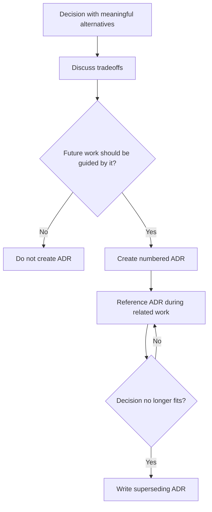

# Architecture Decision Records

Record durable architectural decisions here when they should guide future work.

Add ADRs lazily: create one when a decision has meaningful alternatives, tradeoffs, and future consequences. Use short numbered filenames such as `0001-session-persistence-layout.md`.
