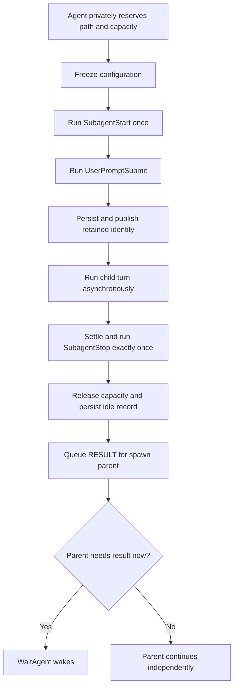

# Multi-agent system

The model-facing `Agent` tool starts a retained child asynchronously. It
accepts a lowercase `task_name` path segment, a complete `message`, and
optional `role`, `fork_turns`, `model`, and `effort` controls, then returns the
committed canonical path immediately.
An omitted role selects `default` and inherits the delegator's effective
instructions, tools, model policy, and delegation capability. A named role
supplies its own configuration rather than intersecting its tools with the
delegator's. Children are created below the caller, so recursive delegation
forms paths such as `/root/implementation/tests`.

`fork_turns` defaults to `all`. `all` copies the complete effective parent
conversation, `none` starts without parent history, and a positive decimal
string such as `"3"` copies the anchored summary plus the three most recent
live turns. The copy retains gptel's user/response/tool span properties and is
taken from the current post-compaction buffer only. Archived raw segments are
never reconstructed. The initial task is appended after this immutable
snapshot; parent turns added later are not synchronized into the child.

At spawn, mevedel materializes the role's dynamic instructions and effective
tools, then captures the exact request backend, model, reasoning effort,
system prompt, tools, context settings, request parameters, and model policy
maps. Resolution starts with the delegator's current request defaults, applies
the role workload, and finally applies explicit `model` and `effort` values.
`model` accepts either a configured tier or `BACKEND:MODEL`; gptel validates
the selected model's effort support. Follow-ups reuse this frozen
configuration even if presets, role definitions, or parent settings change.
Root-session permission decisions and confinement remain live shared policy,
not part of the frozen request configuration.

The root session retains every child's storage identity, path, activity, and
transcript location after the turn settles. `ListAgents` returns the full
path-sorted retained roster without storage IDs or transcript content.
`FollowupAgent` continues an idle retained conversation or steers a running
invocation at its next safe request boundary; later terminal results still go
to the original spawn parent. `SendMessage`
queues plain-text mail for `/root` or any retained path without activating a
turn. `WaitAgent` suspends its ordinary asynchronous tool callback until mail,
user steering, follow-up steering, or its bounded successful timeout wakes it.
`InterruptAgent` aborts one retained non-root agent's current turn by canonical
path, returns its previous activity, and leaves its identity, conversation,
mailbox, descendants, and future follow-up capability intact.

Creation runs `SubagentStart` exactly once, then runs `UserPromptSubmit` for
the initial task before publishing the identity. Every idle-agent follow-up
runs `UserPromptSubmit` again but not `SubagentStart`. A blocked follow-up is
not appended as a user turn; its additional hook context stays with that
identity and is consumed once by its next accepted task. Every completed,
errored, or interrupted turn runs one observational `SubagentStop` without
removing the retained identity.

The built-in role configurations are:

- **worker**: broad implementation, execution, navigation, skill, task, and
  collaboration tools, with explicit concurrent-edit guidance
- **explorer**: directly read-only investigation with authority to delegate to
  workers
- **verifier**: adversarial read-only verification; per-turn
  `verifier-read-only` reminder attached at invocation. Final reports must
  end with `VERDICT: PASS`, `VERDICT: FAIL`, or `VERDICT: PARTIAL`; the
  parsed verdict is stored in transcript render-data for the handle badge.
- **reviewer**: retained leaf code-review agent used by `/review`; per-turn
  `reviewer-read-only` reminder attached at invocation. Reads diffs and
  surrounding code, then returns prioritized findings as JSON.

Every named role receives `SendMessage` and `ListAgents`. Possession of
`Agent` grants transitive delegation authority and automatically supplies the
complete `Agent`, `FollowupAgent`, `WaitAgent`, and `InterruptAgent` control
bundle. Worker and explorer therefore orchestrate recursively; reviewer and
verifier are communicating leaves without those control tools. The complete
root-session tree shares the session's active-turn capacity (three non-root
turns by default), regardless of path depth. Waiting and human-blocked turns
remain active and continue consuming their existing slot.

Before the first sample, the WAIT boundary injects only the caller's direct
children as compact path and role references. Later WAIT boundaries add a
child created in the same turn exactly once. Peers and deeper descendants are
not injected; `ListAgents` is the explicit full-tree discovery surface.

A Goal runs in the root session conversation rather than through a special
agent or phase machine. Child-agent turns are excluded from Goal accounting.
Each active root turn receives request-local Goal context, while the existing
agent tree, capacity, and permission rules remain unchanged. Queued user
messages steer the Goal before its next automatic continuation.

Each agent's `:tools` resolved via `mevedel-tool-resolve-gptel` at
invocation time. Registered buffer-locally via `gptel-agent--agents` per
request (no caching). Each invocation gets a cloned reminder list with
independent `last-fired`.

Agent definitions may include `:hooks` using the same declarative hook
shape as project hook files. These rules are scoped to invocations of that
agent and are folded into the agent invocation layer before skill-scoped
hook rules for fork skill invocations. Within an agent definition, `Stop`
means "when this sub-agent stops" and is normalized to `SubagentStop`;
top-level `Stop` remains reserved for the main assistant turn.
`SubagentStart :additional-context` is auditable in both transcript
surfaces: the parent Agent tool row records that hook context was supplied,
and the child transcript stores the full hook context on the initial
prompt.

Agent prompts are built from the agent's own prompt file plus selected
system sections. `:include-workspace-config`, `:include-memory`,
and `:include-environment` control whether AGENTS.md, persistent memory,
and environment details are appended. The skills prompt section is
derived from the resolved agent tool set: agents with `Skill` or
`ListSkills` receive the model-facing active skill roster. Utility agents
can therefore avoid inheriting main-agent boilerplate while still
receiving environment context. Built-in policy gives worker and explorer
agents `Skill` and `ListSkills` plus the skills prompt section; verifier and
reviewer agents remain skill-free.

## Asynchronous agent lifecycle

Every agent turn uses this path. A caller that needs the result explicitly
invokes `WaitAgent`; a caller that does not may finish while descendants keep
running. `/review`, `/verify`, and fork-skill workflows may keep their owning
interaction open until a leaf result arrives, but that awaiting behavior does
not create another agent execution mode.

## Interrupting retained agent turns

`InterruptAgent(target)` resolves only canonical or relative retained paths. It
rejects `/root`, the caller itself, malformed paths, unknown paths, and opaque
storage ids. An idle target is a successful no-op. An active target's provider
request or requestless wait is aborted, its transcript is finalized as
`aborted`, its active-turn slot is released, and exactly one canonical RESULT
with outcome `interrupted` goes to the stable spawn parent. The payload includes
the interruption reason, bounded useful partial work when available, and the
saved transcript path when available. Request teardown cancels the active tool
pipeline, terminates the target's child executions, and prevents its queued
execution work from being admitted after the turn becomes terminal.

Interruption never recurses. Descendant turns continue, and the target's path,
conversation buffer, mailbox, and registry record remain retained. A later
`FollowupAgent` therefore continues the same conversation. Interrupt-versus-
settlement races use the ordinary exactly-once settlement gate: whichever
terminal event wins is the only RESULT. The tool result itself contains only
the target's activity observed before the request and renders `Interrupted
PATH` from the canonical event.

## Inter-agent messaging (SendMessage)

`SendMessage(target, message)` resolves canonical or relative retained paths
tree-wide. It queues one canonical `MAIL` record containing type, sender path,
recipient path, and payload; it never starts an idle turn. Successful sends
return an empty result and render `Interacted with PATH`. Canonical `MAIL`
payloads are retained in full without a mailbox body cap.

Before a recipient's next model sample, its retained unread queue drains in
FIFO order. Each record is injected as a separate user-role communication
block and written to the retained conversation transcript before the unread
record is removed. Mail queued for an idle agent therefore waits for a later
follow-up, while mail for an active agent is delivered at its next ordinary
WAIT boundary. The tool result never duplicates the message body.

`WaitAgent(timeout_ms?)` is a wake primitive over the caller's mailbox, not a
message transport. Its ordinary asynchronous callback stays pending without a
model sample and without releasing the caller's active-turn slot. Existing or
new mail releases it immediately, as does follow-up steering. New root user
input becomes a separate user-role
steering message in the same resumed request, so no intermediate model sample
can run before the input is visible. The default timeout is 30,000 ms, the
inclusive bounds are
10,000 through 3,600,000 ms, and timeout is a successful outcome. Its result
contains only the wake reason. The view renders `Waiting for agents` while the
tool is pending and `Finished waiting` after it settles.

Independently completed yielded Bash executions use the session or invocation
object captured for their fixed owner when Bash starts. A retained invocation
holds its terminal response while an owned execution is live. Completion is
captured across that boundary in either arrival order, appended to the final
answer, and settled directly without a model request. Bash completion does not
wake `WaitAgent`; execution-only contents never start a paid continuation.

## Review and verify commands

`mevedel-review` / `/review` and `mevedel-verify` / `/verify` run
dedicated asynchronous leaf-agent turns. They share a target picker for
uncommitted changes, diff against a base branch merge-base, a specific
commit, the last commit, or custom instructions. Unlike ordinary user
skills, this path is first-class: it ignores user/project skills named
`review`, creates a context-isolated retained agent at a unique path such as
`/root/review` or `/root/verify_2`, and shares target CAPF for explicit target
forms such as `current`, `HEAD`, `branch:<name>`, and `commit:<rev>`.

The owning workflow attaches a one-shot consumer before provider dispatch and
awaits that leaf's ordinary terminal `RESULT`. Settlement first queues the
canonical envelope in parent mail; after successful workflow delivery, the
consumer removes that exact envelope so a later model turn cannot receive a
duplicate. Handler failure leaves the queued result recoverable. Completion
therefore uses the same settlement and active-turn accounting as every other
asynchronous agent. Cancellation interrupts only the active turn: the
canonical agent path and conversation remain retained for inspection or
follow-up.

`/review` dispatches the `reviewer` agent and parses its Codex-style JSON
finding shape: `findings`, `overall_correctness`, `overall_explanation`,
and `overall_confidence_score`. mevedel renders a readable summary as the
assistant reply and stores a synthetic review `<user_action>` in the
parent transcript so later turns can refer to numbered findings. The view
buffer strips that synthetic block from normal display.

`/verify` dispatches the `verifier` agent with verifier-oriented wording:
inspect adversarially, run or recommend relevant checks when allowed, and
finish with the verifier prompt's `VERDICT: PASS`, `VERDICT: FAIL`, or
`VERDICT: PARTIAL` line. Verifier output is inserted without review JSON
parsing.

While either task runs, the parent view shows an inline `Review` or
`Verify` handle backed by transcript metadata. The handle updates with
running/done/error state and recent tool-call counts like other agent
handles, without exposing the hidden bookkeeping block to the model.

## Transcript persistence and views

Each retained agent runs in its own gptel conversation buffer backed by a
canonical transcript under the root session's `agents/` directory. The
sidecar persists an explicit registry record for its canonical and parent
paths, role and frozen configuration, activity, unread mailbox, pending
conversation-local hook context, conversation location, and internal storage
identity. The canonical path is the only
model-facing address; storage identities never enter collaboration tools.
The frozen configuration is authoritative for the agent's system prompt, so
agent transcripts omit gptel's redundant expanded `GPTEL_SYSTEM` property
while retaining `GPTEL_BOUNDS` and the remaining conversation metadata.

`mevedel-agent-conversation.el` owns conversation creation and hydration,
frozen request-local installation, activity snapshots, response extraction,
and transcript saves. `mevedel-agent-exec.el` is the provider adapter: it owns
the gptel request FSM, prompt dispatch, and streaming callback contract.

Persisted agents may compact older history immediately before a continuation
request.  The canonical transcript path remains stable, the original task and
recent tail remain visible, and later compactions update the existing anchored
summary instead of stacking summaries.  Each rewrite first creates the next
numbered `compact-NNNN` sibling as a recovery artifact.  Those siblings are not
agent handles or sidecar entries; they belong only to the original session and
are not copied by rewind forks. Each retained conversation owns this lifecycle
independently; compacting one agent does not change its registry path or any
other conversation.

Rewind forks copy eligible canonical transcript files and metadata only as
historical inspection artifacts. They do not copy registry identities, frozen
configuration, mailboxes, waiters, or active turns. Historical agent
transcripts remain openable from their handles but are absent from the
collaboration roster, and their former canonical task names are immediately
available to the fork.

`mevedel-view-agent.el` owns transcript lookup and inspection views plus the
aggregate live-agent status and targeted handle refresh. The main view renders
compact one-line agent handles from tool render-data and sidecar state.
Handles show canonical path, role, status, call count, and transcript
attribution; recent ephemeral
activity is kept out of the default view to avoid churn. Terminal
handles open a rendered read-only transcript view from the saved
transcript file. Running handles open a rendered read-only view over
the live agent buffer when that buffer is available. Open live transcript
views are observation-only projections that follow the main renderer's stream
and tool cadence without redirecting parent interactions. See
[`docs/view.md`](view.md#buffer-roles) for their update, scrolling, header,
settlement, and failure-isolation contract.

The agent view owner supplies aggregate running or blocked rows to the status
zone so the user can locate active handles without scanning the whole
transcript. Terminal agent outcomes stay in their inline tool handles
and transcript views instead of being repeated in the aggregate status
zone.

## Permission and confinement propagation

Every nested agent shares the root session's permission mode, direct rules,
explicit denies, protected resources, exact grants, and confinement policy by
reference. Its Bash and Eval calls therefore follow the same authority state as
the root. Required decisions and direct interactions are attributed with the
requester's canonical path and rendered in the root view's shared queues; child
transcript views remain inspection-only. A turn blocked on either queue remains
active and consumes tree capacity. Interrupting that turn cancels only its own
queued entries.

Delegated invocation/request rules may narrow authority and may allow ordinary
known-safe commands, but they cannot authorize dangerous or complex Bash, live
Eval, protected resources, or full execution escalation. An ordinary sub-agent
may request additive or full authority only through the same user-visible queue;
there is no separate model-visible access-request tool. The main view's
persistent confinement row shows the default child boundary while idle and the
actual boundary while a child runs. Concurrent children are summarized without
hiding a less-confined active dimension, including additive filesystem read and
write counts. Each Bash or batch-Eval result records the boundary used by that
call.

## Task status

Tasks are tracked per caller (`/root` and each retained agent path). Agent-owned
tasks and status notes use the retained agent's canonical path for automatic
assignment, grouping, rendering, and terminal finalization; opaque storage IDs
never enter the task surface. Explicit canonical owners must name a retained
agent in the session, while `/root` normalizes to the main owner. Explicit
non-path owner strings remain available as user-defined task buckets.
Resume validates persisted task and status-note owners against the restored
registry and drops entries carrying opaque IDs, malformed paths, or unknown
canonical paths before they can reach model-visible task state. Dependency
edges to dropped tasks are pruned in both directions, so resume cannot leave a
surviving task blocked by an absent task.
`blockedBy` propagates completion. Tasks therefore remain stable across
follow-ups and cold session resume.

The task status fragment is compact and appears only while at least one
task is open. Group headers keep open/done counts visible, open tasks
are listed, and completed task details are hidden. `TAB` or `RET`
on the fragment toggles completed task details for inspection. The
fragment caps itself against the live window height; when rows are
omitted, it keeps open rows ahead of completed rows and shows short
summary lines such as `... 4 completed`. Completed tasks are not pruned
from the session task list.

Each owner group can also carry a short status note through `TaskNote`
or the top-level `note`/`noteOwner` arguments on `TaskCreate` and
`TaskUpdate`. Notes render under the owner header and are dropped from
view when that owner has no open tasks, so a completed-only task list
does not keep the overlay visible.

## Model tiers

`mevedel-models.el` resolves the current session's preset-local named tiers and
workload map. A tier can select a concrete gptel provider and reasoning effort;
a workload can select a tier or exact provider and override effort. Resolution
starts from the session backend/model/effort, then applies tier and workload
values, followed by explicit Agent policy or the policy of a skill that owns
the child request. Explicit Agent `model` and `effort` values have final
precedence. Skill-specific preset entries use `$skill-name` symbols in the
same workload map. Agent buffers receive a deep-copied snapshot of the maps,
so nested agents keep the policy in effect when they were launched.
