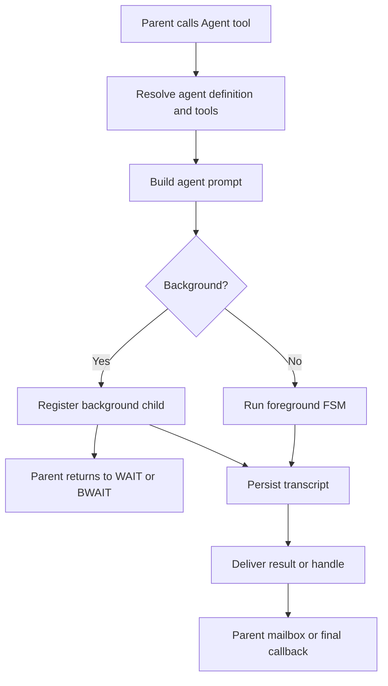

# Multi-agent system

Agents declared with `mevedel-define-agent`:

- **explorer**: read-only investigation, caller-specified thoroughness
- **coordinator**: orchestrates workers via `Agent(run_in_background=true)`;
  never implements
- **verifier**: adversarial read-only verification; per-turn
  `verifier-read-only` reminder attached at invocation. Final reports must
  end with `VERDICT: PASS`, `VERDICT: FAIL`, or `VERDICT: PARTIAL`; the
  parsed verdict is stored in transcript render-data for the handle badge.
- **reviewer**: foreground code-review agent used by `/review`; per-turn
  `reviewer-read-only` reminder attached at invocation. Reads diffs and
  surrounding code, then returns prioritized findings as JSON.

Interactive implementation planning is the first phase of `/goal <objective>`,
not a planner sub-agent. The Goal controller keeps planning and review
read-only, extracts `<proposed_plan>` blocks, asks for approval, and routes an
accepted plan through implementation and review in its recorded execution-home
session. Current-checkout Goals remain in place. Worktree Goals transfer once
to a `goal/<goal-id>` linked-worktree session; the source keeps only a handoff
pointer and cannot continue the Goal.
Every Goal phase request begins with the same deterministic context fragment
generated from persisted session state. Planning, guardian, implementation,
review, and recovery then add only their phase-specific instructions.
For `/goal auto <objective>`, each proposal first goes through an internal
`goal-guardian` workload request. That request has no tools and is not inserted
as a conversational turn. Its approve-or-ask decision is persisted and shown
as an audit disclosure; every non-approval fails closed to the normal plan
approval interaction.

The controller persists a write-ahead checkpoint before each of those phase
requests. Read-only planning, guardian, and review attempts are safe to retry.
Implementation is deliberately asymmetric: if its outcome is not known, resume
audits the current repository against the accepted plan and never resends the
mutation request.

All automatic phase handoffs share one continuation gate. It requires a
settled checkpoint, an idle request and interaction surface, no queued user
intervention, any required guardian approval, and remaining Goal token budget.
The admitted durable state is recorded before dispatch so duplicate callbacks
cannot start the same phase twice.

Each agent's `:tools` resolved via `mevedel-tool-resolve-gptel` at
invocation time. Registered buffer-locally via `gptel-agent--agents` per
request (no caching). Each invocation gets a cloned reminder list with
independent `last-fired`.

Agent definitions may include `:hooks` using the same declarative hook
shape as project hook files. These rules are scoped to invocations of that
agent and are folded into the agent invocation layer before skill-scoped
hook rules for fork skill invocations. Within an agent definition, `Stop`
means "when this sub-agent stops" and is normalized to `SubagentStop`;
top-level `Stop` remains reserved for the main assistant turn.
`SubagentStart :additional-context` is auditable in both transcript
surfaces: the parent Agent tool row records that hook context was supplied,
and the child transcript stores the full hook context on the initial
prompt.

Agent prompts are built from the agent's own prompt file plus selected
system sections. `:include-workspace-config`, `:include-memory`,
and `:include-environment` control whether AGENTS.md, persistent memory,
and environment details are appended. The skills prompt section is
derived from the resolved agent tool set: agents with `Skill` or
`ListSkills` receive the model-facing active skill roster. Utility agents
can therefore avoid inheriting main-agent boilerplate while still
receiving environment context. Built-in policy currently gives explorer
agents `Skill` and `ListSkills` plus the skills prompt section;
coordinator, verifier, and reviewer agents remain skill-free.

## Invocation flow

## Background spawning

`run_in_background` makes `mevedel-agent-runtime-dispatch` call
`process-tool-result` immediately with a launch-status string,
unblocking the parent FSM. The sub-agent completes fire-and-forget; its
result is wrapped in `<agent-result>` and pushed to the parent's mailbox.
When the LLM produces no tool calls but background agents are still
running, the FSM parks in **BWAIT** instead of terminating. Completion
resumes BWAIT→WAIT. `mevedel-agent-runtime--bwait-injected-table` injects the
transition table for main and sub-agent FSMs. `background-agents` slot
on session/invocation tracks running children.

Foreground-callback suppression: when a foreground agent has background
children, `mevedel-agent-runtime-dispatch` stashes the result on the invocation's
`stashed-result` slot; `main-cb` is called once all children finish.

Foreground and background agents share a no-progress watchdog controlled
by `mevedel-agent-no-progress-timeout` (default 600 seconds, nil
disables). It compares transcript buffer size, tool-call count, and
recorded activity from the last observed progress point. If no progress
is observed for the full grace period, the agent is stopped through the
same path as `mevedel-stop-agent`; foreground stops complete the parent
Agent tool, and background stops deliver a stopped `<agent-result>` so
BWAIT can resume. Ordinary runtime errors use the same recovery contract:
when possible the parent receives the safe transcript path, otherwise a
bounded recovered partial response from the live agent buffer.

## Stopping background agents

`StopAgent(agent_id, reason?)` stops a running background agent owned by
the current session or sub-agent invocation. It accepts the full agent id
or an unambiguous displayed short id, marks the transcript `aborted`,
delivers an `<agent-result>` to the parent mailbox with a Read-able
transcript path when persistence is available, removes the id from
`background-agents`, and resumes a parent parked in BWAIT. Without a
saved transcript, the stopped result falls back to a bounded recovered
partial response from the live agent buffer. Runtime error results follow
the same transcript-first, partial-second recovery rule. Stopping is
recursive through a stopped agent's live child registry.

The BWAIT watchdog uses the same recovery contract for stranded
background agents whose live FSM disappeared before normal completion.
It removes the stranded id from `background-agents`, marks the transcript
`incomplete` when sidecar metadata is available, and injects a synthetic
`<agent-result>` pointing at the saved transcript or a recovered partial
when possible. Live background agents are not killed on the first BWAIT
watchdog reminder if the child was not visible when BWAIT was entered;
otherwise the shared no-progress grace period starts as soon as the
parent parks in BWAIT. Later activity resets the grace timer.

`M-x mevedel-stop-agent` uses the same stop path as an interactive
escape hatch for cases where the parent FSM is already parked in BWAIT
and cannot call another tool. The BWAIT watchdog warning includes both
the tool and command names when it is still waiting on live agents.

## Inter-agent messaging (SendMessage)

Fire-and-forget async messages. Aliases `"main"`, `"chat"`, `"coordinator"`
resolve to the main session mailbox; exact agent-id or `"<type>--"` prefix
match resolves to a sub-agent. Messages queue on the recipient's mailbox
and drain via `mevedel-tools--handle-message-inject` in WAIT state, wrapped
as `<agent-message from="SENDER">...</agent-message>` and injected as a
user turn via `gptel--inject-prompt`. Polymorphic accessor
`mevedel-agent-runtime--ctx-messages` dispatches on session vs invocation.

## Coordinator skill

Bundled at `skills/coordinator/SKILL.md` (discovered by the skill core via
`mevedel-skills--bundled-dir`). `context: fork` delegates to the
coordinator agent. User/project skills in `.mevedel/skills/`,
`.agents/skills/`, `~/.mevedel/skills/`, or `~/.agents/skills/` can
coexist with bundled skills; collisions are exposed with generated
visible names instead of overriding the bundled entry.

The coordinator prompt includes a continue-vs-spawn table for deciding
when to reuse a worker through `SendMessage` versus launching a fresh
worker, and requires synthesis before handoff: follow-up prompts should
name concrete files, constraints, and next actions rather than forwarding
research with vague wording.

## Review and verify commands

`mevedel-review` / `/review` and `mevedel-verify` / `/verify` run
dedicated foreground validation tasks. They share a target picker for
uncommitted changes, diff against a base branch merge-base, a specific
commit, the last commit, or custom instructions. Unlike ordinary user
skills, this path is first-class: it ignores user/project skills named
`review`, routes foreground execution through the shared fork skill
dispatch path, and shares target CAPF for explicit target forms such as
`current`, `HEAD`, `branch:<name>`, and `commit:<rev>`.

`/review` dispatches the `reviewer` agent and parses its Codex-style JSON
finding shape: `findings`, `overall_correctness`, `overall_explanation`,
and `overall_confidence_score`. mevedel renders a readable summary as the
assistant reply and stores a synthetic review `<user_action>` in the
parent transcript so later turns can refer to numbered findings. The view
buffer strips that synthetic block from normal display.

`/verify` dispatches the `verifier` agent with verifier-oriented wording:
inspect adversarially, run or recommend relevant checks when allowed, and
finish with the verifier prompt's `VERDICT: PASS`, `VERDICT: FAIL`, or
`VERDICT: PARTIAL` line. Verifier output is inserted without review JSON
parsing.

While either task runs, the parent view shows an inline `Review` or
`Verify` handle backed by transcript metadata. The handle updates with
running/done/error state and recent tool-call counts like other agent
handles, without exposing the hidden bookkeeping block to the model.

## Transcript persistence and views

Each sub-agent invocation runs in its own gptel buffer. That buffer is
the transcript file under the parent session's `agents/` directory. The
parent session mirrors an
`agent-transcripts` alist into the sidecar with agent id, type,
description, path, status, timestamps, parent turn, and call count.

`mevedel-view-agent.el` owns transcript lookup and inspection views plus the
aggregate live-agent status and targeted handle refresh. The main view renders
compact one-line agent handles from tool render-data and sidecar state.
Handles show type, shortened task, status, call count, and transcript
attribution; recent ephemeral
activity is kept out of the default view to avoid churn. Terminal
handles open a rendered read-only transcript view from the saved
transcript file. Running handles open a rendered read-only view over
the live agent buffer when that buffer is available. Open live transcript
views are observation-only projections that follow the main renderer's stream
and tool cadence without redirecting parent interactions. See
[`docs/view.md`](view.md#buffer-roles) for their update, scrolling, header,
settlement, and failure-isolation contract.

The agent view owner supplies aggregate running or blocked rows to the status
zone so the user can locate active handles without scanning the whole
transcript. Terminal agent outcomes stay in their inline tool handles
and transcript views instead of being repeated in the aggregate status
zone.

## Task status

Tasks tracked per caller (main chat and each sub-agent separately).
`blockedBy` propagates completion. `mevedel-agent-runtime--fsms`
(buffer-local on chat buffer) maps agent-id → sub-agent FSM for
SendMessage resolution.

The task status fragment is compact and appears only while at least one
task is open. Group headers keep open/done counts visible, open tasks
are listed, and completed task details are hidden. `TAB` or `RET`
on the fragment toggles completed task details for inspection. The
fragment caps itself against the live window height; when rows are
omitted, it keeps open rows ahead of completed rows and shows short
summary lines such as `... 4 completed`. Completed tasks are not pruned
from the session task list.

Each owner group can also carry a short status note through `TaskNote`
or the top-level `note`/`noteOwner` arguments on `TaskCreate` and
`TaskUpdate`. Notes render under the owner header and are dropped from
view when that owner has no open tasks, so a completed-only task list
does not keep the overlay visible.

## Model tiers

`mevedel-models.el` resolves the current session's preset-local named tiers and
workload map. A tier can select a concrete gptel provider and reasoning effort;
a workload can select a tier or exact provider and override effort. Resolution
starts from the session backend/model/effort, then applies tier and workload
values, followed by explicit Agent policy or the policy of a skill that owns
the child request. Skill-specific preset entries use `$skill-name` symbols in
the same workload map; they do not add an Agent-tool effort argument. Agent
buffers receive a deep-copied snapshot of the maps, so nested agents keep the
policy in effect when they were launched.
