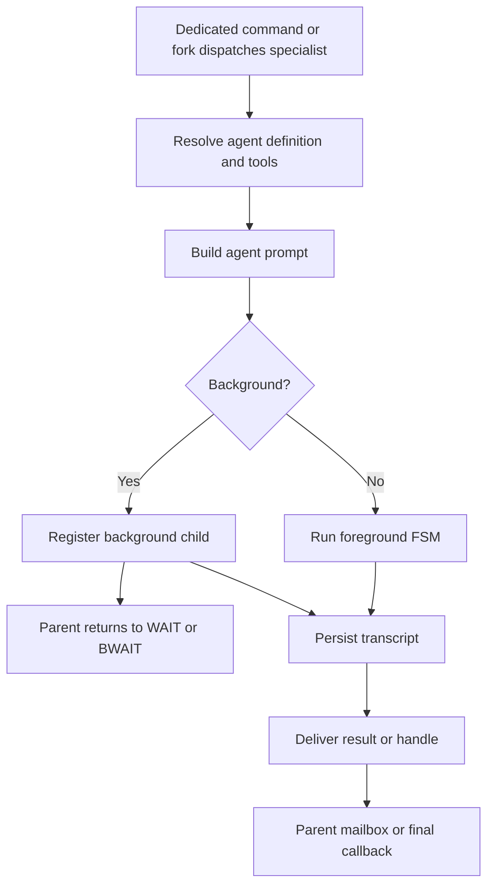

# Multi-agent system

The model-facing `Agent` tool starts a retained child asynchronously. It
accepts a lowercase `task_name` path segment, a complete `message`, and an
optional named `role`, then returns the committed canonical path immediately.
An omitted role selects `default` and inherits the delegator's effective
instructions, tools, model policy, and delegation capability. A named role
supplies its own configuration rather than intersecting its tools with the
delegator's. Children are created below the caller, so recursive delegation
forms paths such as `/root/implementation/tests`.

The root session retains every child's storage identity, path, activity, and
transcript location after the turn settles. `ListAgents` returns the full
path-sorted retained roster without storage IDs or transcript content.
`FollowupAgent` continues an idle retained conversation or steers a running
invocation at its next safe request boundary; later terminal results still go
to the original spawn parent. `SendMessage`
queues plain-text mail for `/root` or any retained path without activating a
turn. `WaitAgent` suspends its ordinary asynchronous tool callback until mail,
user steering, follow-up steering, or its bounded successful timeout wakes it.
`InterruptAgent` aborts one retained non-root agent's current turn by canonical
path, returns its previous activity, and leaves its identity, conversation,
mailbox, descendants, and future follow-up capability intact.

The built-in role configurations are:

- **worker**: broad implementation, execution, navigation, skill, task, and
  collaboration tools, with explicit concurrent-edit guidance
- **explorer**: directly read-only investigation with authority to delegate to
  workers
- **coordinator**: internal orchestration role; never implements
- **verifier**: adversarial read-only verification; per-turn
  `verifier-read-only` reminder attached at invocation. Final reports must
  end with `VERDICT: PASS`, `VERDICT: FAIL`, or `VERDICT: PARTIAL`; the
  parsed verdict is stored in transcript render-data for the handle badge.
- **reviewer**: foreground code-review agent used by `/review`; per-turn
  `reviewer-read-only` reminder attached at invocation. Reads diffs and
  surrounding code, then returns prioritized findings as JSON.

Every named role receives `SendMessage` and `ListAgents`. Possession of
`Agent` grants transitive delegation authority and automatically supplies the
complete `Agent`, `FollowupAgent`, `WaitAgent`, and `InterruptAgent` control
bundle. Worker and explorer therefore orchestrate recursively; reviewer and
verifier are communicating leaves without those control tools. The complete
root-session tree shares the session's active-turn capacity (three non-root
turns by default), regardless of path depth. Waiting and human-blocked turns
remain active and continue consuming their existing slot.

Before the first sample, the WAIT boundary injects only the caller's direct
children as compact path and role references. Later WAIT boundaries add a
child created in the same turn exactly once. Peers and deeper descendants are
not injected; `ListAgents` is the explicit full-tree discovery surface.

Interactive implementation planning is the first phase of `/goal <objective>`,
not a planner sub-agent. The Goal controller keeps planning and review
read-only, extracts `<proposed_plan>` blocks, asks for approval, and routes an
accepted plan through implementation and review in its recorded execution-home
session. Current-checkout Goals remain in place. Worktree Goals transfer once
to a `goal/<goal-id>` linked-worktree session; the source keeps only a handoff
pointer and cannot continue the Goal.
Every Goal phase request begins with the same deterministic context fragment
generated from persisted session state. Planning, guardian, implementation,
review, and recovery then add only their phase-specific instructions.
For `/goal auto <objective>`, each proposal first goes through an internal
`goal-guardian` workload request. That request has no tools and is not inserted
as a conversational turn. Its `approve`, `revise`, or `ask` decision is
persisted and shown as an audit disclosure. `Revise` permits at most two
automatic planning corrections and guardian re-reviews; `ask`, failures, and
unresolved final review return the latest valid plan to the normal approval
interaction.

The controller persists a write-ahead checkpoint before each of those phase
requests. Read-only planning, guardian, and review attempts are safe to retry.
Implementation is deliberately asymmetric: if its outcome is not known, resume
audits the current repository against the accepted plan and never resends the
mutation request.

All automatic phase handoffs share one continuation gate. It requires a
settled checkpoint, an idle request and interaction surface, no queued user
intervention, any required guardian approval, and remaining Goal token budget.
The admitted durable state is recorded before dispatch so duplicate callbacks
cannot start the same phase twice.

Each agent's `:tools` resolved via `mevedel-tool-resolve-gptel` at
invocation time. Registered buffer-locally via `gptel-agent--agents` per
request (no caching). Each invocation gets a cloned reminder list with
independent `last-fired`.

Agent definitions may include `:hooks` using the same declarative hook
shape as project hook files. These rules are scoped to invocations of that
agent and are folded into the agent invocation layer before skill-scoped
hook rules for fork skill invocations. Within an agent definition, `Stop`
means "when this sub-agent stops" and is normalized to `SubagentStop`;
top-level `Stop` remains reserved for the main assistant turn.
`SubagentStart :additional-context` is auditable in both transcript
surfaces: the parent Agent tool row records that hook context was supplied,
and the child transcript stores the full hook context on the initial
prompt.

Agent prompts are built from the agent's own prompt file plus selected
system sections. `:include-workspace-config`, `:include-memory`,
and `:include-environment` control whether AGENTS.md, persistent memory,
and environment details are appended. The skills prompt section is
derived from the resolved agent tool set: agents with `Skill` or
`ListSkills` receive the model-facing active skill roster. Utility agents
can therefore avoid inheriting main-agent boilerplate while still
receiving environment context. Built-in policy gives worker and explorer
agents `Skill` and `ListSkills` plus the skills prompt section; coordinator,
verifier, and reviewer agents remain skill-free.

## Specialist invocation flow

## Internal specialist background mode

The runtime's internal `:background` dispatch keyword makes
`mevedel-agent-runtime-dispatch` call
`process-tool-result` immediately with a launch-status string,
unblocking the parent FSM. The sub-agent completes fire-and-forget; its
result is wrapped in `<agent-result>` and pushed to the parent's mailbox.
When the LLM produces no tool calls but background agents are still
running, the FSM parks in **BWAIT** instead of terminating. Completion
resumes BWAIT→WAIT. `mevedel-agent-runtime--bwait-injected-table` injects the
transition table for main and sub-agent FSMs. `background-agents` slot
on session/invocation tracks running children.

Foreground-callback suppression: when a foreground agent has background
children, `mevedel-agent-runtime-dispatch` stashes the result on the invocation's
`stashed-result` slot; `main-cb` is called once all children finish.

Foreground and background agents share a no-progress watchdog controlled
by `mevedel-agent-no-progress-timeout` (default 600 seconds, nil
disables). It compares transcript buffer size, tool-call count, and
recorded activity from the last observed progress point. If no progress
is observed for the full grace period, the agent is stopped through the
runtime's internal watchdog path; foreground stops complete the parent Agent
tool, and background stops deliver a stopped `<agent-result>` so BWAIT can
resume. Ordinary runtime errors use the same recovery contract:
when possible the parent receives the safe transcript path, otherwise a
bounded recovered partial response from the live agent buffer.

## Interrupting retained agent turns

`InterruptAgent(target)` resolves only canonical or relative retained paths. It
rejects `/root`, the caller itself, malformed paths, unknown paths, and opaque
storage ids. An idle target is a successful no-op. An active target's provider
request or requestless wait is aborted, its transcript is finalized as
`aborted`, its active-turn slot is released, and exactly one canonical RESULT
with outcome `interrupted` goes to the stable spawn parent. The payload includes
the interruption reason, bounded useful partial work when available, and the
saved transcript path when available.

Interruption never recurses. Descendant turns continue, and the target's path,
conversation buffer, mailbox, and registry record remain retained. A later
`FollowupAgent` therefore continues the same conversation. Interrupt-versus-
settlement races use the ordinary exactly-once settlement gate: whichever
terminal event wins is the only RESULT. The tool result itself contains only
the target's activity observed before the request and renders `Interrupted
PATH` from the canonical event.

The BWAIT watchdog uses the same recovery contract for stranded
background agents whose live FSM disappeared before normal completion.
It removes the stranded id from `background-agents`, marks the transcript
`incomplete` when sidecar metadata is available, and injects a synthetic
`<agent-result>` pointing at the saved transcript or a recovered partial
when possible. Live background agents are not killed on the first BWAIT
watchdog reminder if the child was not visible when BWAIT was entered;
otherwise the shared no-progress grace period starts as soon as the
parent parks in BWAIT. Later activity resets the grace timer.

## Inter-agent messaging (SendMessage)

`SendMessage(target, message)` resolves canonical or relative retained paths
tree-wide. It queues one canonical `MAIL` record containing type, sender path,
recipient path, and payload; it never starts an idle turn. Successful sends
return an empty result and render `Interacted with PATH`. Canonical `MAIL`
payloads are retained in full; the legacy mailbox body cap does not truncate
them.

Before a recipient's next model sample, its retained unread queue drains in
FIFO order. Each record is injected as a separate user-role communication
block and written to the retained conversation transcript before the unread
record is removed. Mail queued for an idle agent therefore waits for a later
follow-up, while mail for an active agent is delivered at its next ordinary
WAIT boundary. The tool result never duplicates the message body.

`WaitAgent(timeout_ms?)` is a wake primitive over the caller's mailbox, not a
message transport. Its ordinary asynchronous callback stays pending without a
model sample and without releasing the caller's active-turn slot. Existing or
new mail releases it immediately; follow-up steering and yielded Bash
completion also release it. New root user input becomes a separate user-role
steering message in the same resumed request, so no intermediate model sample
can run before the input is visible. The default timeout is 30,000 ms, the
inclusive bounds are
10,000 through 3,600,000 ms, and timeout is a successful outcome. Its result
contains only the wake reason. The view renders `Waiting for agents` while the
tool is pending and `Finished waiting` after it settles.

Independently completed yielded Bash executions use the same mailbox storage
through the session or invocation object captured for their fixed owner when
Bash starts. The invocation remains parked while an owned execution is
unsettled. Once the agent has produced its answer, completion is latched across
the BWAIT boundary in either arrival order. The runtime drains execution-only
messages into that final answer and settles the agent directly without a model
request; transient callback failures retry with bounded backoff from the
durable mailbox, while persistent failure stops the agent. Legacy
execution-only contents neither start a paid continuation nor arm the agent
watchdog.

## Review and verify commands

`mevedel-review` / `/review` and `mevedel-verify` / `/verify` run
dedicated foreground validation tasks. They share a target picker for
uncommitted changes, diff against a base branch merge-base, a specific
commit, the last commit, or custom instructions. Unlike ordinary user
skills, this path is first-class: it ignores user/project skills named
`review`, routes foreground execution through the shared fork skill
dispatch path, and shares target CAPF for explicit target forms such as
`current`, `HEAD`, `branch:<name>`, and `commit:<rev>`.

`/review` dispatches the `reviewer` agent and parses its Codex-style JSON
finding shape: `findings`, `overall_correctness`, `overall_explanation`,
and `overall_confidence_score`. mevedel renders a readable summary as the
assistant reply and stores a synthetic review `<user_action>` in the
parent transcript so later turns can refer to numbered findings. The view
buffer strips that synthetic block from normal display.

`/verify` dispatches the `verifier` agent with verifier-oriented wording:
inspect adversarially, run or recommend relevant checks when allowed, and
finish with the verifier prompt's `VERDICT: PASS`, `VERDICT: FAIL`, or
`VERDICT: PARTIAL` line. Verifier output is inserted without review JSON
parsing.

While either task runs, the parent view shows an inline `Review` or
`Verify` handle backed by transcript metadata. The handle updates with
running/done/error state and recent tool-call counts like other agent
handles, without exposing the hidden bookkeeping block to the model.

## Transcript persistence and views

Each sub-agent invocation runs in its own gptel buffer. That buffer is
the transcript file under the parent session's `agents/` directory. The
parent session mirrors an
`agent-transcripts` alist into the sidecar with agent id, type,
description, path, status, timestamps, parent turn, and call count.

Persisted agents may compact older history immediately before a continuation
request.  The canonical transcript path remains stable, the original task and
recent tail remain visible, and later compactions update the existing anchored
summary instead of stacking summaries.  Each rewrite first creates the next
numbered `compact-NNNN` sibling as a recovery artifact.  Those siblings are not
agent handles or sidecar entries; they belong only to the original session and
are not copied by rewind forks.

`mevedel-view-agent.el` owns transcript lookup and inspection views plus the
aggregate live-agent status and targeted handle refresh. The main view renders
compact one-line agent handles from tool render-data and sidecar state.
Handles show type, shortened task, status, call count, and transcript
attribution; recent ephemeral
activity is kept out of the default view to avoid churn. Terminal
handles open a rendered read-only transcript view from the saved
transcript file. Running handles open a rendered read-only view over
the live agent buffer when that buffer is available. Open live transcript
views are observation-only projections that follow the main renderer's stream
and tool cadence without redirecting parent interactions. See
[`docs/view.md`](view.md#buffer-roles) for their update, scrolling, header,
settlement, and failure-isolation contract.

The agent view owner supplies aggregate running or blocked rows to the status
zone so the user can locate active handles without scanning the whole
transcript. Terminal agent outcomes stay in their inline tool handles
and transcript views instead of being repeated in the aggregate status
zone.

## Permission and confinement propagation

Every nested agent shares the root session's permission mode, direct rules,
explicit denies, protected resources, exact grants, and confinement policy by
reference. Its Bash and Eval calls therefore follow the same authority state as
the root. Required decisions and direct interactions are attributed with the
requester's canonical path and rendered in the root view's shared queues; child
transcript views remain inspection-only. A turn blocked on either queue remains
active and consumes tree capacity. Interrupting that turn cancels only its own
queued entries.

Delegated invocation/request rules may narrow authority and may allow ordinary
known-safe commands, but they cannot authorize dangerous or complex Bash, live
Eval, protected resources, or full execution escalation. An ordinary sub-agent
may request additive or full authority only through the same user-visible queue;
there is no separate model-visible access-request tool. The main view's
persistent confinement row shows the default child boundary while idle and the
actual boundary while a child runs. Concurrent children are summarized without
hiding a less-confined active dimension, including additive filesystem read and
write counts. Each Bash or batch-Eval result records the boundary used by that
call.

## Task status

Tasks are tracked per caller (`/root` and each retained agent path). Agent-owned
tasks and status notes use the retained agent's canonical path for automatic
assignment, grouping, rendering, and terminal finalization; opaque storage IDs
never enter the task surface. Explicit canonical owners must name a retained
agent in the session, while `/root` normalizes to the main owner. Explicit
non-path owner strings remain available as user-defined task buckets.
`blockedBy` propagates completion. `mevedel-agent-runtime--fsms`
(buffer-local on chat buffer) maps agent-id → sub-agent FSM for
SendMessage resolution.

The task status fragment is compact and appears only while at least one
task is open. Group headers keep open/done counts visible, open tasks
are listed, and completed task details are hidden. `TAB` or `RET`
on the fragment toggles completed task details for inspection. The
fragment caps itself against the live window height; when rows are
omitted, it keeps open rows ahead of completed rows and shows short
summary lines such as `... 4 completed`. Completed tasks are not pruned
from the session task list.

Each owner group can also carry a short status note through `TaskNote`
or the top-level `note`/`noteOwner` arguments on `TaskCreate` and
`TaskUpdate`. Notes render under the owner header and are dropped from
view when that owner has no open tasks, so a completed-only task list
does not keep the overlay visible.

## Model tiers

`mevedel-models.el` resolves the current session's preset-local named tiers and
workload map. A tier can select a concrete gptel provider and reasoning effort;
a workload can select a tier or exact provider and override effort. Resolution
starts from the session backend/model/effort, then applies tier and workload
values, followed by explicit Agent policy or the policy of a skill that owns
the child request. Skill-specific preset entries use `$skill-name` symbols in
the same workload map; they do not add an Agent-tool effort argument. Agent
buffers receive a deep-copied snapshot of the maps, so nested agents keep the
policy in effect when they were launched.
