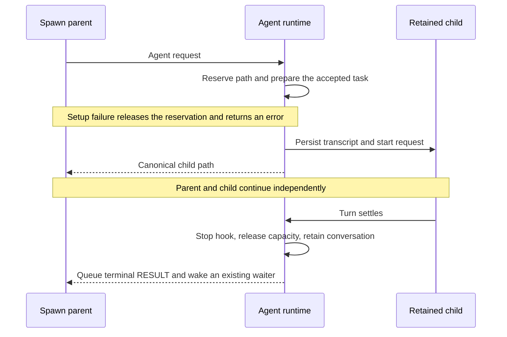

# Multi-agent system

Main and worker prompts ask for short attributed lessons in `work://shared/`
only when the current request permits shared-file writes. Standalone Plan
permits session-owned plan edits but excludes shared and memory writes. Explorer, verifier, and
reviewer report observations and hypotheses through existing results or an
available SendMessage; they receive no extra write authority. Reviewer lessons
stay within its existing JSON response schema. Only the main prompt receives
the recent journal map; all roles may use permitted journal reads on demand.

The model-facing `Agent` tool starts a retained child asynchronously. It
accepts a lowercase `task_name` path segment, a complete `message`, and
optional `role`, `context`, `model`, and `effort` controls, then returns the
committed canonical path after preparation and provider dispatch succeed.
An omitted role selects `default` and inherits the delegator's effective
instructions, tools, model policy, and delegation capability. A named role
supplies its own configuration rather than intersecting its tools with the
delegator's. Children are created below the caller, so recursive delegation
forms paths such as `/root/implementation/tests`.

`context` defaults to `none`, so the complete initial `message` is the
child's sole assigned task and no parent dialogue is copied. Explicit `all`
copies the complete effective parent conversation, and a positive decimal
string such as `"3"` copies the anchored summary plus the three most recent
live turns. Explicit `summary` freezes the realized parent transcript without
the triggering Agent tool segment, runs one central handoff-summary request
focused on the hook-accepted task, and stores the result as a labelled advisory
`Task background` block before that authoritative task. The copy modes retain
gptel's user/response/tool span properties,
including actionable user instructions, and are taken from the current
post-compaction buffer only. Callers use copied context only when the child
must inspect parent dialogue and identify that dialogue as background in the
initial task. Archived raw segments are never reconstructed. The initial task
is appended after this immutable snapshot; parent turns added later are not
synchronized into the child.

Before provider dispatch, after task preparation, mevedel materializes the
role's dynamic instructions and effective tools, then captures the exact
request backend, model, reasoning effort,
system prompt, tools, context settings, request parameters, and model policy
maps. Resolution starts with the delegator's current request defaults, applies
the role workload, and finally applies explicit `model` and `effort` values.
`model` accepts either a configured tier or `BACKEND:MODEL`; gptel validates
the selected model's effort support. Follow-ups reuse this frozen
configuration even if presets, role definitions, or parent settings change.
Root-session permission decisions and confinement remain live shared policy,
not part of the frozen request configuration.

The root session retains every child's storage identity, path, activity, and
transcript location after the turn settles. `ListAgents` returns the full
path-sorted retained roster without storage IDs or transcript content.
`FollowupAgent` continues an idle retained conversation or steers a running
invocation at its next safe request boundary; later terminal results still go
to the original spawn parent. A successful follow-up renders a collapsed
`FollowupAgent: PATH (follow-up sent)` disclosure containing the exact
follow-up text.
`SendMessage`
queues interim plain-text mail for `/root` or any retained path without
activating a turn. `WaitAgent` suspends its ordinary asynchronous tool callback
until mail, user steering, follow-up steering, or its bounded successful
timeout wakes it. A `MAIL` wake-up is not sender completion; only the canonical
`RESULT` is terminal.
`InterruptAgent` aborts one retained non-root agent's current turn by canonical
path, returns its previous activity, and leaves its identity, conversation,
mailbox, descendants, and future follow-up capability intact.

Creation validates and freezes its inputs, privately reserves the canonical
path and a tree-wide capacity slot, runs `SubagentStart` exactly once, then
runs `UserPromptSubmit` for the initial task. The hook-accepted task is passed
to dispatch without rerunning either hook. For `summary`, generation starts
only after that final task exists; the parent row remains in `Preparing summary
context...` until generation and durable child setup finish. The reservation is absent from
`ListAgents` and path resolution until a durable transcript and provider FSM
exist. Failure or parent cancellation releases it synchronously and suppresses
late preparation callbacks. Every idle-agent follow-up
runs `UserPromptSubmit` again but not `SubagentStart`. A blocked follow-up is
not appended as a user turn; its additional hook context stays with that
identity and is consumed once by its next accepted task. Every completed,
errored, or interrupted turn runs one observational `SubagentStop` without
removing the retained identity.

Each invocation aggregates only its own direct operating-system children.
After those children are stopped or settled, noteworthy confinement facts are
patched into the exact `Agent` row that started a new conversation or the
exact idle `FollowupAgent` row that activated the retained turn. Descendant
agents, earlier turns, and steering messages sent to an already-running agent
are excluded. The rollup uses hidden transcript render-data and is not added
to agent sidecars or model-visible results.

The built-in role configurations are:

- **worker**: broad implementation, execution, navigation, skill, task, and
  collaboration tools, with explicit concurrent-edit guidance
- **explorer**: directly read-only investigation with authority to delegate to
  workers
- **verifier**: adversarial read-only verification. Final reports must
  end with `VERDICT: PASS`, `VERDICT: FAIL`, or `VERDICT: PARTIAL`; the
  parsed verdict is stored in transcript render-data for the handle badge.
  PASS requires an adversarial probe, FAIL requires a concrete actionable
  defect, and PARTIAL is reserved for environmental limitations.
- **reviewer**: retained leaf code-review agent used by `/review`. Reads diffs and
  surrounding code, then returns prioritized findings as JSON.

Child request defaults come from the parent, the selected role and mevedel’s
model policy. There is no separate global child-agent preset layer.

The frozen role prompt owns read-only judgment and the report contract. It is
restored before each request, independently of transcript compaction; no
every-turn reminder repeats it. Direct tool rosters and shared permission
checks remain in force. Role names do not impose extra hidden reminder policy.

Every named role receives `SendMessage` and `ListAgents`. Possession of
`Agent` grants transitive delegation authority and automatically supplies the
complete `Agent`, `FollowupAgent`, `WaitAgent`, and `InterruptAgent` control
bundle. Worker and explorer therefore orchestrate recursively; reviewer and
verifier are communicating leaves without those control tools. The complete
root-session tree shares the session's active-turn capacity (three non-root
turns by default), regardless of path depth. Waiting and human-blocked turns
remain active and continue consuming their existing slot.

Before the first sample, the WAIT boundary injects only the caller's direct
children as compact path and role references. Later WAIT boundaries add a
child created in the same turn exactly once. Peers and deeper descendants are
not injected; `ListAgents` is the explicit full-tree discovery surface.

A Goal runs in the root session conversation rather than through a special
agent or phase machine. Child-agent turns are not Goal turns, but agents started
from a Goal turn, nested agents included, charge their usage to that Goal as
they work and receive its budget crossings ([Goals](goals.md#token-budget)).
The RESULT's `:usage` field reports the settled request's usage.
Each active root turn receives current Goal facts through retained context delivery, while the existing
agent tree, capacity, and permission rules remain unchanged. Queued user
messages steer the Goal before its next automatic continuation.

Each agent's `:tools` resolved via `mevedel-tool-resolve-gptel` at
invocation time. Registered buffer-locally via `mevedel-agents--specs` per
request (no caching). Each invocation gets a cloned reminder list with
independent `last-fired`.

An optional `:max-turns` caps one Agent call's model samples. Every sample of
the tool loop counts as one turn, however many tools it calls. At 80% the agent
receives a one-shot warning to wrap up. The sample that reaches the cap tells
the agent to answer now and ends its turn at the next tool boundary. If the
agent still called tools, the call settles with its latest response followed by
a `[Stopped before a final answer: ...]` note, so the caller can tell the report
is incomplete. Retained follow-ups start a fresh count.

The built-in agents set no cap, as in Claude Code, whose built-in agents also
leave `maxTurns` unset; Codex has no agent turn limit. Their earlier caps
(worker 50, explorer 30, verifier 20, reviewer 12) were never enforced.
Telemetry from 238 agent runs in September 2026 showed medians of 12-22
samples, 90th percentiles of 34-51, and a maximum of 94, with about three tool
calls per sample: enforcing the old caps would have cut about half of all
verifier and reviewer runs, and no run approached a runaway bound worth
setting by default.

Agent definitions may include `:hooks` using the same declarative hook
shape as project hook files. These rules are scoped to invocations of that
agent and are folded into the agent invocation layer before skill-scoped
hook rules for fork skill invocations. Within an agent definition, `Stop`
means "when this sub-agent stops" and is normalized to `SubagentStop`;
top-level `Stop` remains reserved for the main assistant turn.
`SubagentStart :additional-context` is auditable in both transcript
surfaces: the parent Agent tool row records that hook context was supplied,
and the child transcript stores the full hook context on the initial
prompt.

Agent definitions declare an ordered `:system-components` list. Entries are
registered prompt component symbols or inline `(NAME :file PATH)` /
`(NAME :text STRING)` components. Every agent profile is workspace-aware, so
`workspace-config` and `environment` must be present explicitly. There are no
per-section inclusion flags and no automatic skills inference: selecting
`memory` or `skills` is part of the role definition.

The built-ins all receive scoped `AGENTS.md` / `AGENTS.local.md` and
environment context without inheriting the main coding-assistant role. Worker
also receives memory; Explorer, verifier, and reviewer do not. Worker and
Explorer select the active skills roster and expose `Skill` / `ListSkills`;
verifier and reviewer remain skill-free. Worker, Explorer, and verifier share
the reporting tone, while reviewer relies on its strict output contract.

## Asynchronous agent lifecycle

```mermaid
sequenceDiagram
    participant P as Spawn parent
    participant H as Agent runtime
    participant C as Retained child
    P->>H: Agent request
    H->>H: Reserve path and prepare the accepted task
    Note over P,H: Setup failure releases the reservation and returns an error
    H->>C: Persist transcript and start request
    H-->>P: Canonical child path
    Note over P,C: Parent and child continue independently
    C->>H: Turn settles
    H->>H: Stop hook, release capacity, retain conversation
    H-->>P: Queue terminal RESULT and wake an existing waiter
```

The diagram covers initial spawning and settlement. Follow-ups reuse the
retained identity and configuration, run UserPromptSubmit for an idle agent's
new task, and do not rerun SubagentStart. Tool counts, activity and response
refresh belong to the current invocation in that retained conversation. An
invocation keeps only its latest few activity items. Settlement drops the
retained buffer's last request payload and audit decoding memo: an idle agent
otherwise kept about as much Lisp data alive as its transcript, and a
continuation builds a fresh request. A caller
that needs the result explicitly
invokes `WaitAgent`; a caller that does not may finish while descendants keep
running. `/review`, `/verify`, and fork-skill workflows may keep their owning
interaction open until a leaf result arrives, but that awaiting behavior does
not create another agent execution mode.

## Agent resource results

Each retained registry record keeps the complete latest settled payload and
its terminal outcome (`completed`, `errored`, or `interrupted`) separately from
the bounded inline `RESULT` mailbox preview. The complete payload is recorded
before the preview is published, including recovery settlements. Request and
owned-execution teardown must both succeed before terminal state is published.
PID-lock settlement commits the idle record and queued result before delivery;
portable settlement -- every project session, local target included --
publishes transcript plus sidecar atomically before it wakes a waiter or
invokes a workflow result handler. Authority, not target locality, chooses:
a portable session resolves its transcripts through the publication, so a
direct write would leave resume unable to see them. A new or
follow-up turn clears the previous settled result before it becomes active,
including the `starting` interval in which provider setup can yield to other
mailbox publications. Failed or quit follow-up dispatch restores the previous
result without discarding mail delivered during setup. Active agents expose no
streaming or stale result and are reported as not ready. A later idle turn replaces the retained result atomically.

`agent://root/PATH` reads that complete settled payload and
`history://root/PATH` reads the same retained identity's transcript through
the shared read-only resource-address resolver. Neither address changes the
conversation, mailbox, transcript, or settlement state. The canonical path,
not the registry's opaque storage identity, is the only addressable identity.
`history://root` uses the same projection for the main agent's current
conversation, including unsaved transcript content. It resolves the owning
session's root data buffer even when called by a retained agent, and appears
in history listings and completion without requiring a child agent. Both
history forms support the existing Read pagination and concise tool results;
neither traverses pre-compaction archives or supports search. Root history
requires a live root buffer, including one restored by normal session resume;
the read itself never resumes a session.
See [`address-to-resource.md`](address-to-resource.md#agent-and-history).

## Interrupting retained agent turns

`InterruptAgent(target)` resolves only canonical or relative retained paths. It
rejects `/root`, the caller itself, malformed paths, unknown paths, and opaque
storage ids. An idle target is a successful no-op. An active target's provider
request or requestless wait is aborted, its transcript is finalized as
`aborted`, its active-turn slot is released, and exactly one canonical RESULT
with outcome `interrupted` goes to the stable spawn parent. The payload includes
the interruption reason, bounded useful partial work when available, and the
saved transcript path when available. Request teardown cancels the active tool
pipeline, terminates the target's child executions, and prevents its queued
execution work from being admitted after the turn becomes terminal.

Interruption never recurses. Descendant turns continue, and the target's path,
conversation buffer, mailbox, and registry record remain retained. A later
`FollowupAgent` therefore continues the same conversation. Interrupt-versus-
settlement races use the ordinary exactly-once settlement gate: whichever
terminal event wins is the only RESULT. The tool result itself contains only
the target's activity observed before the request and renders `Interrupted
PATH` from the canonical event.

## Inter-agent messaging (SendMessage)

`SendMessage(target, message)` resolves canonical or relative retained paths
tree-wide. It queues one canonical `MAIL` record containing type, sender path,
recipient path, and payload; it never starts an idle turn. Successful sends
return an empty result and render a collapsed
`SendMessage: PATH (message queued)` disclosure whose path opens the retained transcript and whose body contains the
sent message. Canonical `MAIL` payloads are retained in full without a mailbox
body cap. Since this delivery is interim and may cross a root-turn boundary,
an agent should put its final verdict in its terminal response rather than
treating `SendMessage` as its completion channel.

Mailbox append is an acknowledged durable mutation. Once the session has a
storage path, mevedel rolls back a failed append and reports the send as
failed; it releases a matching `WaitAgent` only after the root session snapshot
has committed.

Before a recipient's next model sample, its retained unread queue drains in
FIFO order. Each record is injected as a separate user-role communication
block and written to the retained conversation transcript before the unread
record is removed. Mail queued for an idle agent therefore waits for a later
follow-up, while mail for an active agent is delivered at its next ordinary
WAIT boundary. The tool result never duplicates the message body.

`WaitAgent(timeout_ms?)` is a wake primitive over the caller's mailbox, not a
message transport. Its ordinary asynchronous callback stays pending without a
model sample and without releasing the caller's active-turn slot. Existing or
new mail releases it immediately, as does follow-up steering. New root user
input becomes a separate user-role
steering message in the same resumed request, so no intermediate model sample
can run before the input is visible. The default timeout is 30,000 ms.
Out-of-range numeric tool arguments clamp to 10,000-3,600,000 ms; unrepairable
tool arguments are rejected, and timeout is a successful outcome. Its result
contains only the wake reason. The view renders `Waiting for agents` while the
tool is pending. Settled waits render `WaitAgent: agents (OUTCOME)`;
consecutive calls coalesce into the final row with a count while every
canonical call remains in the transcript.

Independently completed yielded Bash executions use the session or invocation
object captured for their fixed owner when Bash starts. A retained invocation
holds its terminal response while an owned execution is live. A completion that
arrives while the agent still works goes to the agent's own mailbox, read at its
next provider request as for the root. Settlement publishes the unchanged final
answer as `RESULT`, and each completion the agent could not read (arrived after
its answer or still unread) as a separate `EXECUTION` record to the spawn parent,
attributed to the agent. These records commit together; workflow result
handlers consume only the `RESULT`. Bash
completion does not wake `WaitAgent` before settlement, and starts no model request.

## Review and verify commands

`mevedel-review` / `/review` and `mevedel-verify` / `/verify` run
dedicated asynchronous leaf-agent turns. They share a target picker for
uncommitted changes, diff against a base branch merge-base, a specific
commit, the last commit, or custom instructions. Unlike ordinary user
skills, this path is first-class: it ignores user/project skills named
`review`, creates a context-isolated retained agent at a unique path such as
`/root/review` or `/root/verify_2`, and shares target CAPF for explicit target
forms such as `current`, `HEAD`, `branch:<name>`, and `commit:<rev>`.

Git evidence packages are prepared after the accepted command returns, one
section per callback. Aborting the request or killing its source buffer cancels
preparation and removes the unfinished package before any agent is dispatched.
Git commands still run individually and synchronously; a very large diff or a
slow remote command can exceed the normal callback budget.

The owning workflow attaches a one-shot consumer before provider dispatch and
awaits that leaf's ordinary terminal `RESULT`. Settlement first queues the
canonical envelope in parent mail; after successful workflow delivery, the
consumer removes that exact envelope so a later model turn cannot receive a
duplicate. Handler failure leaves the queued result recoverable. Completion
therefore uses the same settlement and active-turn accounting as every other
asynchronous agent. Cancellation interrupts only the active turn: the
canonical agent path and conversation remain retained for inspection or
follow-up.

`/review` dispatches the `reviewer` agent and parses its Codex-style JSON
finding shape: `findings`, `overall_correctness`, `overall_explanation`,
and `overall_confidence_score`. Finding priority accepts integers 0–3 or
JSON null; null and omission both mean unspecified. mevedel renders a readable
summary as the assistant reply and stores a synthetic review `<user_action>` in the
parent transcript so later turns can refer to numbered findings. The view
buffer strips that synthetic block from normal display. Schema-invalid JSON
falls back to the raw reviewer output and still settles the parent turn.

`/verify` dispatches the `verifier` agent with verifier-oriented wording:
inspect adversarially, run or recommend relevant checks when allowed, and
finish with the verifier prompt's `VERDICT: PASS`, `VERDICT: FAIL`, or
`VERDICT: PARTIAL` line. The workflow accepts only one exact final verdict,
read from the complete settled report rather than the bounded preview;
malformed reports remain visible but are marked rejected.

Goal completion uses the same verifier role and verdict contract, but selects
its model and effort through `goal-review` (default tier: `strong`). `/verify`
and ordinary verifier agents retain the `verifier` workload. The Goal check
receives the exact objective and any accepted plan with `context: none`, so it
discovers evidence independently of the implementation conversation.

While either task runs, the parent view shows an inline `Review` or
`Verify` handle backed by transcript metadata. The handle updates with
running/done/error state and recent tool-call counts like other agent
handles, without exposing the hidden bookkeeping block to the model.

## Transcript persistence and views

Each retained agent runs in its own gptel conversation buffer backed by a
canonical transcript under the root session's `agents/` directory. The
buffer's `default-directory` remains the session working directory (falling
back to the workspace root), including after transcript attachment and cold
hydration; transcript storage location never becomes tool cwd. The
sidecar persists an explicit registry record for its canonical and parent
paths, role and frozen configuration, activity, unread mailbox, pending
conversation-local hook context, conversation location, and internal storage
identity, plus the latest settled payload and terminal outcome when present.
Resume derives an idle turn's transcript status from that durable outcome
rather than from activity alone, so an agent that failed or was
interrupted does not come back reading as one that finished, and a settled
turn with no recorded outcome reads as incomplete rather than complete.
The canonical path is the only model-facing address; storage identities never
enter collaboration tools or resource addresses. The mailbox remains a
bounded delivery preview rather than the source of truth for an agent result.
The frozen configuration is authoritative for the agent's request setup, so
agent transcripts omit all of gptel's request-config Org properties
while retaining `GPTEL_BOUNDS`.
Initial task text is saved after installing the frozen configuration; provider
setup does not force a second save of the same transcript. In materialized
portable sessions, a new transcript and its dirty metadata share one strict
publication through the session's root buffer, including for nested agents.
Registry admission remains a separate acknowledged commit.

Terminal settlement publishes the result before delivery. After that commit,
gptel's post-response hooks may add transcript text; their extra checkpoint uses
the existing debounced conversation save instead of extending the terminal
callback. If settlement is still pending, that checkpoint remains synchronous.
Explicit saves and teardown flush the pending checkpoint normally.
Generated task background is ordinary persisted conversation context with its
own structural type. Follow-ups and agent compaction therefore absorb it
naturally without replaying or regenerating it.

Resume validates the registry, configuration and transcript locations without
loading idle conversations. The first FollowupAgent, history resource read, or
Emacs transcript inspection hydrates only the selected identity through the same
verified artifact resolver. Unread mail and pending hook context remain in the
registry until their ordinary delivery boundary. Active abandoned turns still
hydrate during resume so recovery can retain their partial responses. Failure to
load a deferred conversation is reported at access before provider dispatch.

Inspection keeps the resolver's read-only/no-save marker after major-mode setup.
A later owned follow-up loads a writable conversation rather than writing through
an inspection snapshot. Browser polling keeps its existing resident-only contract;
it does not cause cold target reads.

The registry stores each conversation location as a session-relative path.
For a remote session, cold hydration, terminal inspection, recovery links, and
compaction resolve that logical path through the session's staged or captured
publication and verify its digest; a materialized fixed-path cache is never
read as authority. The conversation buffer still visits the qualified logical
path, so immutable publication filenames never reach tools, prompts, or views.

`mevedel-agent-conversation.el` owns conversation creation and hydration,
frozen request-local installation, activity snapshots, response extraction,
and transcript saves. Native Emacs auto-save also checkpoints modified retained
conversations, as does the in-flight checkpoint timer while any request runs,
so an unattended agent turn reaches disk before it settles. Emacs exit flushes their text and pending transcript timers
before root session ownership is released. `mevedel-agent-exec.el` is the provider
adapter: it owns
the gptel request FSM, prompt dispatch, and streaming callback contract. It
consumes its exactly-once terminal latch only after runtime settlement accepts
the handoff; transformer or transcript-extraction failures become structured
terminal errors, while a rejected runtime handoff remains pending for retry.
Frozen request locals use one closed symbol schema owned by
`mevedel-agents.el`. Durable configurations contain every schema entry exactly
once, and hydration rejects unknown, duplicate, or missing keys before it
changes a conversation buffer.

Persisted agents may compact older history immediately before a continuation
request.  The canonical transcript path remains stable, the original task and
recent tail remain visible, and later compactions update the existing anchored
summary instead of stacking summaries.  Each rewrite first creates the next
numbered `compact-NNNN` sibling as a recovery artifact.  Those siblings are not
agent handles or sidecar entries; they belong only to the original session and
are not copied by Session Forks. Each retained conversation owns this lifecycle
independently; compacting one agent does not change its registry path or any
other conversation.

Session Forks copy eligible canonical transcript files and metadata only as
historical inspection artifacts. They do not copy registry identities, frozen
configuration, mailboxes, waiters, or active turns. Historical agent
transcripts remain openable from their handles but are absent from the
collaboration roster, and their former canonical task names are immediately
available to the child. Rewind creates no child: it clears the current
session's live agent ownership.

`mevedel-view-agent.el` owns transcript lookup and inspection views plus the
aggregate live-agent status and targeted handle refresh. The main view renders
compact one-line agent handles from tool render-data and sidecar state.
Handles show canonical path, role, status, call count, and transcript
attribution; recent ephemeral
activity is kept out of the default view to avoid churn. Resident retained
agents open a rendered read-only view over their conversation buffer whether
running or idle; cold and historical handles use the saved transcript file.
Open live transcript
views are observation-only projections that follow the main renderer's stream
and tool cadence without redirecting parent interactions. See
[`docs/view.md`](view.md#buffer-roles) for their update, scrolling, header,
settlement, and failure-isolation contract.

The agent view owner supplies aggregate running or blocked rows to the status
zone so the user can locate active handles without scanning the whole
transcript. Terminal agent outcomes stay in their inline tool handles
and transcript views instead of being repeated in the aggregate status
zone.

## Permission and confinement propagation

Every nested agent shares the root session's permission mode, direct rules,
explicit denies, protected resources, resource grants, and confinement policy
by
reference. Its Bash and Eval calls therefore follow the same authority state as
the root. Required decisions and direct interactions are attributed with the
requester's canonical path and rendered in the root view's shared queues; child
transcript views remain inspection-only. A turn blocked on either queue remains
active and consumes tree capacity. Interrupting that turn cancels only its own
queued entries.

The retained-agent tree shares the root session's `work://` namespace,
with session-owned `work://plans/` and workspace-owned `work://shared/`
for notes, findings and handoffs across sessions. Standalone/sticky Plan mode keeps session-only `ApplyPatch` available to
retained agents.
It rejects any ordinary, shared, memory, or bare endpoint before local
materialization, including mixed local/ordinary and ordinary-only calls, while
other edit tools and `Eval` remain unavailable.

Directive planning additionally stamps immutable read-only authority on the
root request and copies it into every delegated invocation and nested request.
Those agents retain Plan tool and Bash restrictions after the root workflow
advances to approval or implementation; mutable session phase is not an
authority boundary. Unlike standalone/sticky Plan mode, directive Planning
remains strictly read-only: its requests and retained agents cannot use
`ApplyPatch`, including session-only proposals, or `Eval`.

Delegated invocation/request rules may narrow authority and may allow ordinary
known-safe commands, but they cannot authorize dangerous or complex Bash, live
Eval, protected resources, or full execution escalation. An ordinary sub-agent
may request additive or full authority only through the same user-visible queue;
there is no separate model-visible access-request tool. The main view's
agent row retains durable warnings for materially non-default child access.
Additional read-only mounts stay silent. Each Bash or batch-Eval result records
the boundary used by that call, and the agent transcript identifies the
affected tool.

## Task status

Tasks are tracked per caller (`/root` and each retained agent path). Agent-owned
tasks and status notes use the retained agent's canonical path for automatic
assignment, grouping, rendering, and terminal finalization; opaque storage IDs
never enter the task surface. Explicit canonical owners must name a retained
agent in the session, while `/root` normalizes to the main owner. Explicit
non-path owner strings remain available as user-defined task buckets.
Resume validates persisted task and status-note owners against the restored
registry and drops entries carrying opaque IDs, malformed paths, or unknown
canonical paths before they can reach model-visible task state. `blockedBy`
is the only dependency edge. Every task write drops the edges it resolved:
an edge to a task that is absent or already completed is removed, so
neither a task created blocked by finished work nor a resume can leave a
surviving task blocked by something that will never clear. Tasks therefore remain stable across follow-ups and cold
session resume.

The task status fragment is compact and appears only while at least one
task is open. Open tasks are ordered once by display priority --
in progress, then pending, then blocked -- and the separator rule
carries the session tallies (`tasks · 3 running · 1 blocked · 6 done`),
so each count is stated once rather than per owner. An owner holding a
single open task renders inline behind a dim owner label with the
`/root/` prefix stripped; an owner holding several renders under one dim
header placed at its best-ordered task, which keeps that owner's rows
adjacent. A running agent-owned row shows its `activeForm` in place of
its subject. `TAB` or `RET` on the fragment toggles completed task
details, which render in a single `done` section, each row keeping its
owner attribution. The fragment caps itself against the live window
height; when rows are omitted, it keeps a stable prefix with open rows
ahead of completed rows and reserves one final count row such as
`... 4 completed`, dropping any header left with nothing under it. A
subject is stored as one non-blank line: whitespace runs collapse to a
single space and a blank subject is rejected. Completed tasks are not
pruned from the session task list.

The task nudge reminder does not reuse this rendering. It sends the
model the same shape `TaskList` returns, with canonical owner paths and
unabbreviated subjects, so display decisions cannot alter what the model
reads.

Each owner group can also carry a short status note through `TaskNote`
or the top-level `note`/`noteOwner` arguments on `TaskCreate` and
`TaskUpdate`. An unknown note owner rejects the whole call; no task is
created or updated. Notes render under the owner's header, or under
its single inline row; the main session's note opens the panel, having
no header to hang from. A note is dropped from view when that owner has
no open tasks, so a completed-only task list does not keep the overlay
visible.

## Model tiers

`mevedel-models.el` resolves the current session's preset-local named tiers and
workload map. A tier can select a concrete gptel provider and reasoning effort;
a workload can select a tier or exact provider and override effort. Resolution
starts from the session backend/model/effort, then applies tier and workload
values, followed by explicit Agent policy or the policy of a skill that owns
the child request. Explicit Agent `model` and `effort` values have final
precedence. Skill-specific preset entries use `$skill-name` symbols in the
same workload map. Agent buffers receive a deep-copied snapshot of the maps,
so nested agents keep the policy in effect when they were launched.
