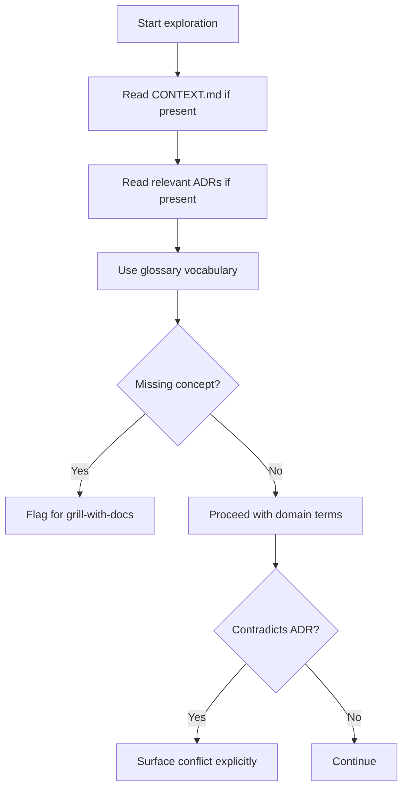

# Domain Docs

How the engineering skills should consume this repo's domain documentation when exploring the codebase.

## Domain-docs flow



## Before exploring, read these

- **`CONTEXT.md`** at the repo root for the project domain glossary.
- **`docs/adr/`** for durable architectural decisions. Read ADRs that touch the area you're about to work in.

If any of these files don't exist, proceed silently. Don't flag their absence; don't suggest creating them upfront. The producer skill (`/grill-with-docs`) creates or updates them lazily when terms or decisions get resolved.

## Layout

This repo uses a single-context layout:

```
/
├── CONTEXT.md
├── docs/adr/
└── docs/agents/domain.md
```

## Use the glossary's vocabulary

When your output names a domain concept (in an issue title, a refactor proposal, a hypothesis, a test name), use the term as defined in `CONTEXT.md`. Don't drift to synonyms the glossary explicitly avoids.

If the concept you need isn't in the glossary yet, either you're inventing language the project doesn't use or there's a real gap. Note it for `/grill-with-docs` rather than silently creating competing terminology.

## Flag ADR conflicts

If your output contradicts an existing ADR, surface it explicitly rather than silently overriding:

> _Contradicts ADR-0007 — but worth reopening because..._
