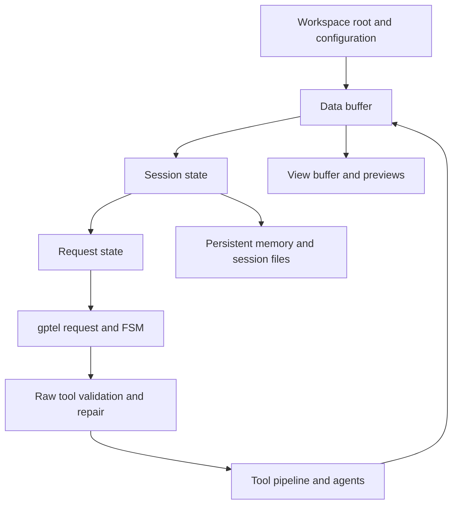

# Architecture

## System flow



## Key data structures

Defined in `mevedel-structs.el` / `mevedel-tool-registry.el`:

- **`mevedel-workspace`**: type, id, root, name, file-cache.
  Additional roots live in `mevedel-workspace-additional-roots`.
  `.mevedel/` is derived by
  `mevedel-workspace-state-dir`, not stored as a slot.
- **`mevedel-session`**: per-chat state: workspace, working
  directory, tasks, touched-files, permission rules/mode, reminders,
  deferred tool state, mailbox messages, background agents, mention
  dedup, queued follow-up user messages, skills, session persistence metadata, agent transcript index,
  invoked skills, session-scoped hook rules/log/context, permission
  queue, plan queue, selected preset and resolved mevedel preset settings,
  the current session-owned Goal, and a transient bounded tool-input repair
  log.
- **`mevedel-goal`**: stable identity and objective, lifecycle status,
  current phase, approval policy, owning session, accepted plan artifact, and
  latest review summary.
- **`mevedel-request`**: per-turn state: session, file-snapshots,
  directive UUID, pending plan, cancellers, skill-scoped permission
  rules, hook rules, model override, effort override.
- **`mevedel-tool`**: name, handler, description, summary, prompt,
  args, optional semantic `repair-input` callback, category,
  read-only/destructive/async flags, sync/async
  permission hooks, specifier extractors (`get-path`, `get-pattern`,
  `get-domain`, `get-name`), groups, max-result-size, display argument,
  render transform, renderer, and its provider-facing gptel tool.
- `mevedel--instruction-states`: workspace-keyed instruction alists and ID state
- Instruction types: **References** (context) and **Directives** (prompts)

Directive request callbacks must not assume the original overlay object is
still live. Capture the directive UUID and re-resolve the directive before
marking success/failure or touching overlay bounds; detached overlays can
occur while a request is in flight.

## Workspace context chain

```
Data buffer (authoritative gptel/org buffer; holds mevedel--workspace,
mevedel--session, and the model-visible transcript)
  |
View buffer (mevedel-view-mode; holds mevedel--data-buffer and the
input zone / editable composer)
  |
Derived buffers / previews / transcript inspection views point back to
their data or parent view buffers as needed
```

Tools execute in the data-buffer context with `default-directory` set to
the session working directory. File modifications are tracked per request
via `mevedel-request-file-snapshots`, while cross-turn file metadata
lives on the workspace file cache and session touched-files map.

## gptel integration

Direct via `gptel-request` and `gptel-fsm`. Tools registered in
`gptel--known-tools`. Presets use exact declared names and inherit in parent
order (later parents win, then the child). Ordinary preset keys resolve to
`mevedel-foo`/`mevedel--foo` before gptel variables and use gptel's value
composition semantics. Persistent application is buffer- and session-local;
request-only application is dynamically scoped. The built-ins are
`mevedel-discuss`, `mevedel-implement`, `mevedel-revise`, and
`mevedel-tutor`. Presets can also merge named model tiers and workload maps;
dispatch resolves session values, tier values, workload values, then explicit
Agent or skill overrides. System prompt assembled
dynamically from Markdown-backed parts. Static content is emitted first
for provider prefix-cache reuse: base prompt, workspace config
(AGENTS.md plus optional AGENTS.local.md), persistent memory,
environment, then the dynamic skill roster.

`mevedel-view-stream.el` isolates gptel stream advice, incremental-render
scheduling, pending-tool live rows, and foreground request-progress state.
It delegates transcript rendering to `mevedel-view-render.el`, while
`mevedel-view-composer.el` owns the editable input, submission hooks, queued
follow-ups, and send/fork dispatch. `mevedel-view.el` coordinates the view
mode, zones, and session lifecycle. The authoritative text remains in the
gptel data buffer.

`mevedel-turn.el` owns the single top-level completion boundary. The ordinary
gptel `DONE` state and direct foreground fork skills both call it after response
hooks, while error and abort terminals retain their separate
no-save/no-follow-up behavior.

Main and agent data buffers install buffer-local gptel pre/post-tool hooks.
The pre-tool hook preserves raw JSON distinctions, validates the call as-is,
and attempts deterministic repair only after failure. A buffer-local ledger
then associates the raw call with pipeline dispatch and final result without
placing argument values in telemetry. The normal pipeline remains the final
validation, permission, execution, and persistence boundary. See
[`tools.md`](tools.md#tool-input-validation-and-repair) and
[`ADR 0011`](adr/0011-repair-model-tool-input-before-pipeline.md).

`mevedel-tool-repair.el` owns structured contract validation plus generic and
tool-owned atomic repair. `mevedel-tool-repair-gptel.el` isolates the temporary
lossless gptel decoding bridge, while `mevedel-tool-repair-diagnostics.el`
owns value-free audit records, dispatch-result tracking, and redacted
telemetry. `mevedel-tool-registry.el` owns the schema declarations and lowers
the internal `path` type to a provider-facing string.

`mevedel-system-build-prompt` checks each directory from workspace root
to the session working directory for `AGENTS.md`. `AGENTS.local.md`,
when present, is loaded after the shared file in that same directory.
Matching files are included from broadest to closest scope as
`## Workspace Configuration` so deeper instructions override earlier
ones.

## Persistent memory

Memory indexes are read from configured `.mevedel/memory/` and
`.agents/memory/` roots, both workspace-local and user-global. The first
200 lines of each present `MEMORY.md` are included in every system
prompt via `mevedel-system--memory-prompt`, with a last-updated age
annotation. Durable memory bodies live in linked topic files under the
same root, using `user`, `feedback`, `project`, or `reference`
frontmatter. `MEMORY.md` should contain one-line links only.
LLM-writable. See [`memory.md`](memory.md) for the full layout, save
policy, staleness rules, and `$remember` review workflow.

## Chat buffer formatting

The data buffer is normally org-mode so gptel can persist
`GPTEL_BOUNDS` and related state. Tool results containing
`:PROPERTIES:` are escaped with `,` in the data buffer to prevent
nested-drawer confusion; the rendered view strips those storage
artifacts where appropriate.

## Transcript structure

`mevedel-transcript.el` owns the canonical transcript grammar. Its primary
entry point, `mevedel-transcript-segments`, classifies data-buffer spans as
`(TYPE START END)` where type is `user`, `response`, `tool`, `reasoning`,
`mailbox`, `reminder`, `queued-message`, `hook-context`, `render-data`,
`prompt`, or `ignored`. It combines gptel text-property runs with generated
control ranges, protects literal user examples from structural recognition,
and repairs known org/gptel boundary damage.

The module also owns the small structural helpers needed to skip leading
property drawers and compaction summaries, recover whole org tool
blocks, split generated queued-user batches, parse agent mailbox blocks,
and find the first real user prompt line outside tool/reasoning/summary
scaffolding.

`mevedel-transcript-normalize-properties` applies those same canonical ranges
when a live or restored Org transcript needs its structural `gptel`
properties repaired. `mevedel-transcript-restore.el` owns restoration of
persisted bounds and invokes that normalizer, so persistence and the view do
not maintain their own transcript grammars. Compaction consumes the same
canonical spans directly.

View rendering, session prompt indexing/rewind, and compaction all read
these shared spans. They keep their own policies: the view groups and
renders turns, session persistence builds prompt previews and fork state,
and compaction chooses response boundaries and preserved-tail policy.
