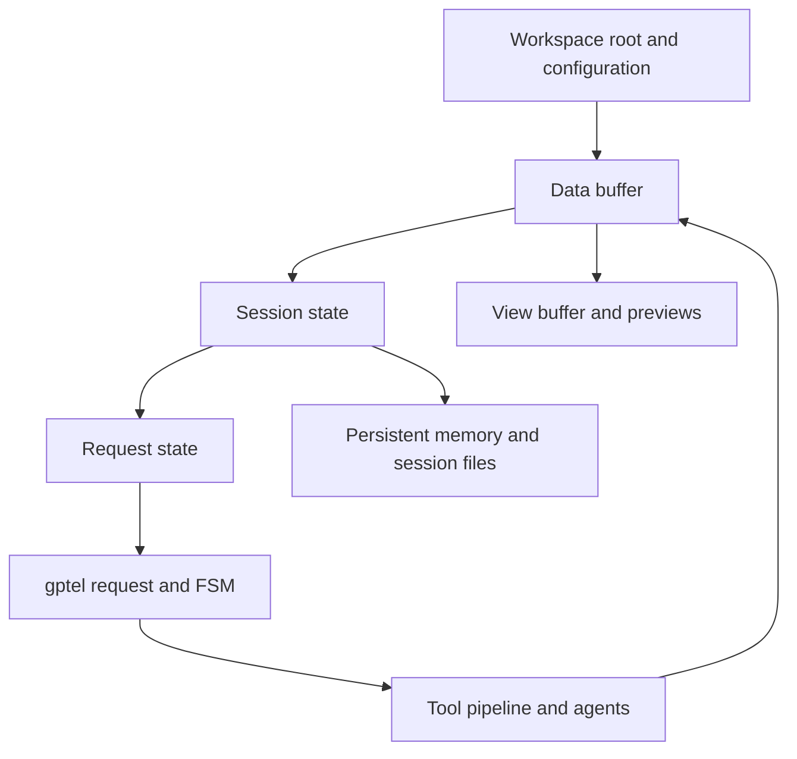

# Architecture

## System flow



## Key data structures

Defined in `mevedel-structs.el` / `mevedel-tool-registry.el`:

- **`mevedel-workspace`**: type, id, root, name, file-cache.
  Additional roots live in `mevedel-workspace-additional-roots`.
  `.mevedel/` is derived by
  `mevedel-workspace-state-dir`, not stored as a slot.
- **`mevedel-session`**: per-chat state: workspace, working
  directory, tasks, touched-files, permission rules/mode, reminders,
  deferred tool state, mailbox messages, background agents, mention
  dedup, queued follow-up user messages, skills, session persistence metadata, agent transcript index,
  invoked skills, session-scoped hook rules/log/context, permission
  queue, plan queue.
- **`mevedel-request`**: per-turn state: session, file-snapshots,
  directive UUID, pending plan, cancellers, skill-scoped permission
  rules, hook rules, model override, effort override.
- **`mevedel-tool`**: name, handler, description, summary, prompt,
  args, category, read-only/destructive/async flags, sync/async
  permission hooks, specifier extractors (`get-path`, `get-pattern`,
  `get-domain`, `get-name`), groups, max-result-size, renderer.
- `mevedel--instruction-states`: workspace-keyed instruction alists and ID state
- Instruction types: **References** (context) and **Directives** (prompts)

Directive request callbacks must not assume the original overlay object is
still live. Capture the directive UUID and re-resolve the directive before
marking success/failure or touching overlay bounds; detached overlays can
occur while a request is in flight.

## Workspace context chain

```
Data buffer (authoritative gptel/org buffer; holds mevedel--workspace,
mevedel--session, and the model-visible transcript)
  |
View buffer (mevedel-view-mode; holds mevedel--data-buffer and the
input zone / editable composer)
  |
Derived buffers / previews / transcript inspection views point back to
their data or parent view buffers as needed
```

Tools execute in the data-buffer context with `default-directory` set to
the session working directory. File modifications are tracked per request
via `mevedel-request-file-snapshots`, while cross-turn file metadata
lives on the workspace file cache and session touched-files map.

## gptel integration

Direct via `gptel-request` and `gptel-fsm`. Tools registered in
`gptel--known-tools`. Four presets: `mevedel-discuss` → `implement` →
`revise`; `tutor` inherits from `discuss`. System prompt assembled
dynamically from Markdown-backed parts. Static content is emitted first
for provider prefix-cache reuse: base prompt, workspace config
(AGENTS.md plus optional AGENTS.local.md), persistent memory,
environment, then the dynamic skill roster.

`mevedel-system-build-prompt` checks each directory from workspace root
to the session working directory for `AGENTS.md`. `AGENTS.local.md`,
when present, is loaded after the shared file in that same directory.
Matching files are included from broadest to closest scope as
`## Workspace Configuration` so deeper instructions override earlier
ones.

## Persistent memory

Memory indexes are read from configured `.mevedel/memory/` and
`.agents/memory/` roots, both workspace-local and user-global. The first
200 lines of each present `MEMORY.md` are included in every system
prompt via `mevedel-system--memory-prompt`, with a last-updated age
annotation. Durable memory bodies live in linked topic files under the
same root, using `user`, `feedback`, `project`, or `reference`
frontmatter. `MEMORY.md` should contain one-line links only.
LLM-writable. See [`memory.md`](memory.md) for the full layout, save
policy, staleness rules, and `$remember` review workflow.

## Chat buffer formatting

The data buffer is normally org-mode so gptel can persist
`GPTEL_BOUNDS` and related state. Tool results containing
`:PROPERTIES:` are escaped with `,` in the data buffer to prevent
nested-drawer confusion; the rendered view strips those storage
artifacts where appropriate.

## Transcript structure

`mevedel-transcript.el` is the shared, read-only transcript structure
module. Its primary entry point, `mevedel-transcript--extract-segments`,
classifies data-buffer spans as `(TYPE START END)` where type is
`user`, `response`, `tool`, or `ignore`, using gptel text properties as
the source of truth and repairing known org/gptel structural glue.

The module also owns the small structural helpers needed to skip leading
property drawers and compaction summaries, recover whole org tool
blocks, split generated queued-user batches, parse agent mailbox blocks,
and find the first real user prompt line outside tool/reasoning/summary
scaffolding.

View rendering, session prompt indexing/rewind, and compaction all read
these shared spans. They keep their own policies: the view groups and
renders turns, session persistence builds prompt previews and fork state,
and compaction chooses response boundaries and preserved-tail policy.
