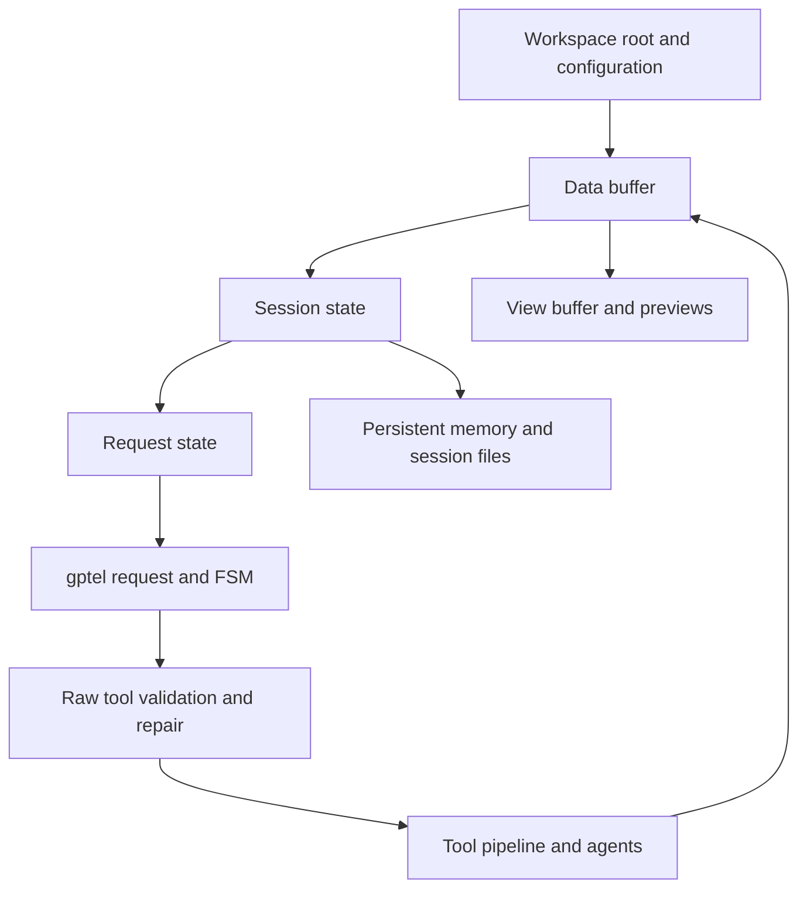

# Architecture

## System flow


```mermaid
flowchart TD
    A[Workspace root and configuration] --> B[Data buffer]
    B --> C[Session state]
    C --> D[Request state]
    D --> E[gptel request and FSM]
    E --> R[Raw tool validation and repair]
    R --> F[Tool pipeline and agents]
    F --> B
    B --> G[View buffer and previews]
    C --> H[Persistent memory and session files]
```

## Key data structures

Defined in `mevedel-structs.el` / `mevedel-tool-registry.el`:

- **`mevedel-workspace`**: type, id, root, name, file-cache, and the durable
  directive records shared by every session in the workspace.
  Additional roots live in `mevedel-workspace-additional-roots`.
  `.mevedel/` is derived by
  `mevedel-workspace-state-dir`, not stored as a slot.
- **`mevedel-directive`**: stable directive id, current authored request,
  source-anchor description, lifecycle state, bound execution-session id, and
  chronological implementation attempts, discussion turns, and current
  parent-owned subdirectives. Source overlays retain the id needed to resolve
  this record; they do not own another request, status, patch, or attempt copy.
- **`mevedel-subdirective`**: stable id, current authored request, and attached
  source anchor for one nested detail owned by a top-level directive. It never
  owns a session, lifecycle state, attempt list, discussion, or Rewind action.
- **`mevedel-directive-attempt`**: immutable submitted request, terminal answer
  or error, authored-request snapshot, outcome, captured patch, capture time and
  completeness, covered files, explicit gaps, successful attempt's consumed
  subdirective snapshots, and the session/turn checkpoint that can restore the
  file state around the attempt. Its directive-local settlement sequence orders
  it against discussion turns. A complete empty patch means the request observed
  its covered files and made no changes; incomplete capture never implies
  complete coverage.
- **`mevedel-directive-discussion-turn`**: immutable local question, submitted
  request, authored-request snapshot, terminal answer or error, outcome,
  optional selected-attempt index, session/turn checkpoint, and directive-local
  settlement sequence.
- **`mevedel-session`**: per-chat state: workspace, working
  directory, tasks, touched-files, permission rules/mode, exact resource grants,
  reminders,
  deferred tool state, mailbox messages, the retained agent registry,
  transient unpublished agent reservations, root activity and tree capacity, mention
  dedup, queued follow-up user messages, skills, session persistence metadata, agent transcript index,
  invoked skills, session-scoped hook rules/log/context, permission
  queue, one pending plan approval, selected preset and resolved mevedel preset settings,
  the current session-owned Goal, and a transient bounded tool-input repair
  log. Lifecycle events emitted before session materialization wait in the
  transient `telemetry-pending` queue and flush to the diagnostic stream; the
  queue is never persisted as resumable state. Its transient `execution-state`
  slot is opaque outside
  `mevedel-execution.el`; process records, timers, spools, and process groups
  never enter the general session model or persisted sidecar.
- **`mevedel-goal`**: identity, objective, lifecycle status and reason,
  token/time/turn accounting, optional budget and accepted-plan reference,
  and timestamps.
- **`mevedel-request`**: per-turn state: process-unique request identity,
  owning session and agent origin, request start time, accumulated active-work
  pause time, file-snapshots, directive UUID, pending plan, cancellers,
  skill-scoped permission rules, user-attached skill records, and hook rules.
  Skill model and effort policy is consumed before
  gptel realizes an owning request rather than stored for late mutation.
- **`mevedel-tool`**: name, handler, description, summary, prompt,
  args, optional semantic `repair-input` callback, category,
  read-only/destructive/async/snapshot flags, sync/async
  permission hooks, specifier extractors (`get-path`, `get-pattern`,
  `get-domain`, `get-name`), groups, max-result-size, display argument,
  render transform, renderer, and its provider-facing gptel tool.
- `mevedel--instruction-states`: workspace-keyed instruction alists and ID state
- Instruction types: **References** (source-bound context) and **Directives**
  (workspace-owned prompts with source presentations)

Directive anchors are either Attached, with a live source range, or Detached,
with a zero-width source position, former source order, and the last attached
anchor evidence. Deleting an entire directive range preserves its durable
record and replaces the evaporated range overlay with a compact detached row;
partial edits use normal overlay resizing. Co-located detached rows are ordered
by their former source positions. References keep their source-bound
evaporation behavior.

Top-level directive presentations may persist an exact provider and
reasoning-effort override. Nested directives are durable details owned by the
topmost directive. Acting on any nested presentation resolves that owner, and
prompt construction includes every current nested detail in stable source
order. Without an override, the directive inherits the main session model at
dispatch.

Directive requests submit an explicit prompt built from the current authored
request and freshly resolved references, so gptel realizes the request in an
isolated prompt buffer without main-chat history. Discussion continuations add
only the directive's durable local discussion transcript. The first accepted
request binds the directive to its execution session. Terminal settlement
writes the attempt or discussion turn to the workspace record even if the
source overlay detached while the request was in flight; overlay updates remain
optional presentation work. The main session retains only a hidden compact
directive event linked to the durable record and turn checkpoint, not the full
submitted request or response. A successful implementation records immutable
snapshots of, then consumes, exactly the subdirectives present at dispatch.
Failure and abort consume none; details authored while a request is in flight
remain current.

Batch processing queues durable top-level directive records in stable source
order rather than retaining source overlays. Each item resolves the same live
prompt context used by an individual action only when its turn begins, so a
prior implementation may detach or remove later source without corrupting the
queue. Ready records use Implement and Discussed records without an attempt use
Implement this. A Source missing record has sufficient context only when it is
top-level, bodyless, and has no nested details; region-backed records must be
reattached. Records with any implementation attempt or without sufficient
current prompt context are reported and skipped; the first failed or aborted
request stops the batch. A zero-delay continuation starts the next item only
after terminal request cleanup.

## Workspace context chain

```
Data buffer (authoritative gptel/org buffer; holds mevedel--workspace,
mevedel--session, and the model-visible transcript)
  |
View buffer (mevedel-view-mode; holds mevedel--data-buffer and the
input zone / editable composer)
  |
Derived buffers / previews / transcript inspection views point back to
their data or parent view buffers as needed
```

Tools execute in the data-buffer context with `default-directory` set to
the session working directory. File modifications are tracked per request
via `mevedel-request-file-snapshots`, while cross-turn file metadata
lives on the workspace file cache and session touched-files map.

`mevedel-execution.el` is the operating-system process boundary. It owns
process creation, process-group signaling, timeout cleanup, Bubblewrap launch
and fallback, stable child environments, bounded disk spooling, and opaque
per-session process state. `mevedel-execution-scheduler.el` admits managed Bash
through a fair session-scoped readers/writer lane. Bash and batch Eval remain
tool adapters in `mevedel-tool-exec.el`; native filesystem tools use the
execution module's confined one-shot helper interface without entering the
Bash scheduler. The Bash adapter also captures its analyzed exit-outcome
resolver at spawn, so later observations derive the same canonical facts
without moving command semantics into the process module.

Each mutable process record points to one immutable origin record containing
the session, owner, private mailbox context, data buffer, tool arguments, and
tool-use ID. Delivery state is explicit and separate from process completion:
a finished result rejected by its mailbox remains unsettled and owner-reachable
until either the model or a mailbox consumer claims it.

The execution module also publishes isolated yield, progress, and terminal
event snapshots. The pipeline supplies the durable gptel tool-use ID and
originating data buffer when Bash starts. Live progress remains a bounded,
disposable view projection; terminal output and structured facts replace the
original row's hidden render-data side channel in the authoritative transcript.
If a parallel tool result has not inserted that row yet, the data buffer keeps
a bounded pending terminal projection and retries at later tool and render
boundaries. Agent data buffers also retry unconditionally at their final
response boundary, so this does not depend on an open transcript view.
Completion therefore survives row-order races, cache turnover, and session
persistence without entering the model-visible result. Passive event
subscribers receive independent copies,
never the private owner context, and cannot acknowledge delivery. Terminal
delivery is claimed exactly once by either a model observer or the single
mailbox sink, using the session or agent invocation captured at spawn. The
agent runtime parks an invocation while its owner has an unsettled execution.
The agent's terminal callback remains gated while any owned execution is
unsettled. Whether the last completion arrives before or after the agent's
terminal response, the runtime appends the queued completion to that response
and settles the turn directly. Agent execution completion is invocation-local,
does not wake `WaitAgent`, and launches no model request. Ordinary mailbox
messages are delivered before the next model sample or wake an explicit
`WaitAgent`.

`mevedel-executions-list.el` is the user-facing projection of that private
registry. The execution module returns immutable all-owner snapshots and
accepts session-user control by execution ID; process records and operating-
system identifiers remain private. Model tools continue through the narrower
yielded-and-owner-scoped interface. Registry membership changes update the
view's live execution count and cockpit rows, while progress and yield events
refresh live row details without creating transcript state.

## gptel integration

Direct via `gptel-request` and `gptel-fsm`. Tools registered in
`gptel--known-tools`. Presets use exact declared names and inherit in parent
order (later parents win, then the child). Ordinary preset keys resolve to
`mevedel-foo`/`mevedel--foo` before gptel variables and use gptel's value
composition semantics. Persistent application is buffer- and session-local;
request-only application is dynamically scoped. The built-ins are
`mevedel-discuss`, `mevedel-implement`, and `mevedel-tutor`. Request changes
and Retry use ordinary implementation authority and focused prompt context,
not another preset. Presets can also merge named model tiers and workload maps.
Dispatch resolves session values, tier values, workload values, then explicit
Agent policy or request-owning skill policy. Skill preset entries use
`$skill-name` workload symbols and are consumed before request realization.
Directive overrides are validated before processing starts and appended as the
final prompt transform. They therefore win for that directive request and its
continuations without mutating the session model.
System prompts are assembled dynamically from ordered profiles in
`mevedel-system.el`. `mevedel-define-prompt-component` registers reusable
Markdown, literal text, or dynamic producers.
`mevedel-define-prompt-profile` selects components, and the profile list is the
render order; inline `(NAME :file PATH)` and `(NAME :text STRING)` entries keep
one-off role content local. Blank components are omitted. Workspace-aware
profiles must explicitly contain `workspace-config` and `environment`, which
the renderer validates before dispatch.

The built-in selection is deliberate:

| Consumer | Role/tone/context |
| --- | --- |
| Main | Base role/tone, tool orchestration, workspace config, memory, environment, skills, Goal |
| Tutor | Tutor role/tone, tool orchestration, workspace config, memory, environment, skills, Goal |
| Worker | Worker role, report tone, tool orchestration, workspace config, memory, environment, skills |
| Explorer | Explorer role, report tone, tool orchestration, workspace config, environment, skills |
| Verifier | Verifier role, report tone, tool orchestration, workspace config, environment |
| Reviewer | Reviewer role, tool orchestration, workspace config, environment |
| Bash guardian | Guardian role, workspace config, environment |
| Compaction | Rendered compaction role only |

The shared tool-orchestration component asks models to batch independent tool
calls within a bounded stage and keep dependencies, waits, approvals, and
conflicting mutations sequential. It does not encode provider pricing.

`mevedel-view-stream.el` isolates gptel stream advice, incremental-render
scheduling, pending-tool live rows, and foreground request-progress state.
It delegates transcript rendering to `mevedel-view-render.el`, while
`mevedel-view-composer.el` owns the editable input, submission hooks, queued
follow-ups, and send/fork dispatch. `mevedel-view.el` coordinates the view
mode, zones, and session lifecycle. The authoritative text remains in the
gptel data buffer.

`mevedel-mention-bindings.el` owns atomic mention identity as validated text
properties on ordinary prompt strings. Completion or programmatic insertion
binds when an exact target first becomes known; the composer binds remaining
resolvable mentions before asynchronous preparation, queueing, or history
insertion. Draft, queue, retry, transcript, and history paths transport the
same propertized string, while kind-specific skill and mention modules resolve
the stored locator against current state and permissions at dispatch. Valid
unavailability annotates only the temporary request and continues the turn;
malformed live data blocks submission. Input-history persistence rejects and
quarantines incompatible binding data rather than migrating it. The supported
kinds are a closed explicit dispatch over skill source path, reference UUID,
absolute file pathname, and MCP server/URI; there is no resolver registry or
sidecar identity store. See [`mentions.md`](mentions.md#atomic-binding-lifecycle).

`mevedel-turn.el` owns the single top-level completion boundary. The ordinary
gptel `DONE` state and awaited fork-skill workflows call it after response
hooks, while error and abort terminals retain their separate
no-save/no-follow-up behavior.

Main and agent data buffers install buffer-local gptel pre/post-tool hooks.
The pre-tool hook preserves raw JSON distinctions, validates the call as-is,
and attempts deterministic repair only after failure. A buffer-local ledger
then associates the raw call with pipeline dispatch and final result without
placing argument values in telemetry. The normal pipeline remains the final
validation, permission, execution, and persistence boundary. See
[`tools.md`](tools.md#tool-input-validation-and-repair) and
[`ADR 0011`](adr/0011-repair-model-tool-input-before-pipeline.md).

`mevedel-tool-repair.el` owns structured contract validation plus generic and
tool-owned atomic repair. `mevedel-tool-repair-gptel.el` isolates the temporary
lossless gptel decoding bridge, while `mevedel-tool-repair-diagnostics.el`
owns value-free audit records, dispatch-result tracking, and redacted
telemetry. `mevedel-tool-registry.el` owns the schema declarations and lowers
the internal `path` type to a provider-facing string.

The `workspace-config` component checks each directory from workspace root
to the session working directory for `AGENTS.md`. `AGENTS.local.md`,
when present, is loaded after the shared file in that same directory.
Matching files are included from broadest to closest scope as
`## Workspace Configuration` so deeper instructions override earlier
ones.

## Persistent memory

Memory indexes are read from configured `.mevedel/memory/` and
`.agents/memory/` roots, both workspace-local and user-global. The first
200 lines of each present `MEMORY.md` are included when a profile selects
the `memory` component, with a last-updated age
annotation. Durable memory bodies live in linked topic files under the
same root, using `user`, `feedback`, `project`, or `reference`
frontmatter. `MEMORY.md` should contain one-line links only.
LLM-writable. See [`memory.md`](memory.md) for the full layout, save
policy, staleness rules, and `$remember` review workflow.

## Chat buffer formatting

The data buffer is normally org-mode so gptel can persist
`GPTEL_BOUNDS` and related state. Tool results containing
`:PROPERTIES:` are escaped with `,` in the data buffer to prevent
nested-drawer confusion; the rendered view strips those storage
artifacts where appropriate.

## Transcript structure

`mevedel-transcript.el` owns the canonical transcript grammar. Its primary
entry point, `mevedel-transcript-segments`, classifies data-buffer spans as
`(TYPE START END)` where type is `user`, `response`, `tool`, `reasoning`,
`mailbox`, `reminder`, `hook-context`, `render-data`, `prompt`, or `ignored`.
It combines gptel text-property runs with generated
control ranges, protects literal user examples from structural recognition,
and repairs known org/gptel boundary damage.

The module also owns the small structural helpers needed to skip leading
property drawers and compaction summaries, recover whole org tool
blocks, parse agent mailbox blocks,
and find the first real user prompt line outside tool/reasoning/summary
scaffolding.

`mevedel-transcript-normalize-properties` applies those same canonical ranges
when a live or restored Org transcript needs its structural `gptel`
properties repaired. `mevedel-transcript-restore.el` owns restoration of
persisted bounds and invokes that normalizer, so persistence and the view do
not maintain their own transcript grammars. Compaction consumes the same
canonical spans directly.

View rendering, session prompt indexing/rewind, and compaction all read
these shared spans. They keep their own policies: the view groups and
renders turns, session persistence builds prompt previews and fork state,
and compaction chooses response boundaries and preserved-tail policy.
