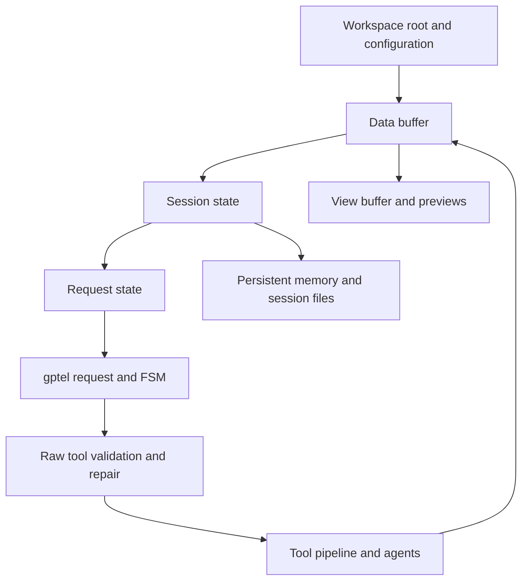

# Architecture

## System flow


```mermaid
flowchart TD
    A[Workspace root and configuration] --> B[Data buffer]
    B --> C[Session state]
    C --> D[Request state]
    D --> E[gptel request and FSM]
    E --> R[Raw tool validation and repair]
    R --> F[Tool pipeline and agents]
    F --> B
    B --> G[View buffer and previews]
    C --> H[Persistent memory and session files]
```

The live browser collaboration slice is composed of the
`mevedel-collaboration.el` room/public-command facade,
`mevedel-collaboration-projection.el` canonical record projection, and
`mevedel-collaboration-transport.el` sealed relay client. The host dials the
self-hosted content-blind Go relay in `relay/` (which also serves the
`relay/viewer/` HTML, CSS, and JavaScript assets); it never listens. Frames
are AES-256-GCM sealed under a room key carried only in the bearer links'
URL fragments; a full link additionally carries a write token granting
prompting and interrupting. Multiple guests may join; the transport
reconnects with bounded backoff and guests re-hello for a fresh snapshot.
It also has deterministic session/buffer/Emacs teardown. It is an observer
only: its post-stream and post-response hooks are failure-isolated so
projection or transport errors cannot settle a model request. Tool starts
publish a stable running record immediately and replace it with the settled
canonical result;
the projection never infers running state from empty output. A configured
public HTTPS origin is operator-managed; without one, generated links are
loopback-only. See
`docs/adr/0099-project-live-collaboration-from-host-authoritative-state.md`.

## Key data structures

Defined in `mevedel-structs.el` / `mevedel-tool-registry.el`:

`mevedel-structs.el` owns these passive shapes and their shape-local
invariants.  `mevedel-workspace.el` owns workspace registry and state lookup,
`mevedel-directive.el` owns directive mutation and derived lifecycle, and
`mevedel-turn.el` owns request admission, cancellation, and settlement.

- **`mevedel-workspace`**: type, id, root, name, file-cache, and the durable
  directive records shared by every session in the workspace.
  Additional roots live in `mevedel-workspace-additional-roots`.
  `.mevedel/` is derived by
  `mevedel-workspace-state-dir`, not stored as a slot.
- **`mevedel-directive`**: stable directive id, current authored request,
  source-anchor description, lifecycle state, bound execution-session id, and
  Plan-before-implementation preference and proposal, chronological planning,
  implementation, and discussion turns, and current parent-owned
  subdirectives. Source overlays retain the id needed to resolve this record;
  they do not own another request, status, patch, or attempt copy.
  Current top-level and nested ids are globally unique within the workspace;
  durable decode rejects any collision before installing records. Historical
  consumed-subdirective snapshots are evidence rather than current identities.
  The lifecycle state is derived from the current authored request and surviving
  activity whenever the record is loaded or queried; it is not persisted as an
  independent authority.
- **`mevedel-subdirective`**: stable id, current authored request, and attached
  source anchor for one nested detail owned by a top-level directive. It never
  owns a session, lifecycle state, attempt list, discussion, or Rewind action.
- **`mevedel-directive-attempt`**: immutable action framing, submitted request,
  terminal answer or error, authored-request snapshot, outcome, captured patch,
  capture time and completeness, covered files, explicit gaps, the successful
  attempt's consumed subdirective snapshots, conservatively detected tool
  effects outside snapshot coverage, and the session/turn checkpoint
  that can restore the file state around the attempt, plus any accepted plan
  and request-local implementation selection. Its directive-local
  settlement sequence orders it against discussion turns. A complete empty
  patch means the request observed its covered files and made no changes;
  incomplete capture never implies complete coverage.
- **`mevedel-directive-discussion-turn`**: immutable local question, submitted
  request, authored-request snapshot, terminal answer or error, outcome,
  optional selected-attempt index, session/turn checkpoint, and directive-local
  settlement sequence. A settlement sequence identifies one event across
  all three collections -- planning turns, attempts, and discussion turns
  -- and the codec rejects a record that repeats one.
- **`mevedel-session`**: per-chat state: workspace, immutable execution target,
  qualified working directory, tasks, touched-files, permission rules/mode,
  exact resource grants, reminders, persisted per-conversation
  workspace-instruction content hashes,
  deferred tool state, mailbox messages, the retained agent registry,
  transient unpublished agent reservations, root activity and tree capacity, mention
  dedup, queued follow-up user messages, skills, session persistence metadata, agent transcript index,
  invoked skills, session-scoped hook rules/log/context, permission
  queue, one pending plan approval, selected preset and resolved mevedel preset settings,
  the current session-owned Goal, and a transient bounded tool-input repair
  log. Lifecycle events emitted before session materialization wait in the
  transient `telemetry-pending` queue and flush to the diagnostic stream; the
  queue is never persisted as resumable state. A transient side conversation
  may point `audit-session` at its durable parent for redacted audit events and
  shared target mutation authority; its runtime queues and unsanitized logs
  remain side-owned. The transient
  `execution-state` slot is opaque outside `mevedel-execution.el`;
  `mevedel-execution-process.el` keeps child processes, timers, spools, and
  process groups behind an opaque child value, so they never enter the general
  session model or persisted sidecar. `mevedel-execution-telemetry.el` owns an
  opaque per-execution context containing live ownership provenance, mutable
  summary cells, and privacy-safe event facts, but no live process record.
  Portable lease
  generations persist only the boolean unsettled-mutation safety latch needed
  when those transient records disappear.
- **`mevedel-goal`**: identity, objective, lifecycle status and reason,
  token/time/turn accounting, optional budget and accepted-plan reference,
  and timestamps.
- **`mevedel-request`**: per-turn state: process-unique request identity,
  owning session and agent origin, its once-reserved session turn identity,
  request start time, accumulated active-work pause time, file-snapshots,
  directive UUID, immutable Plan read-only authority, pending plan, cancellers,
  skill-scoped permission rules, user-attached skill records, hook rules, and
  transient one-shot-mutation/ephemeral-artifact boundaries.
  Skill model and effort policy is consumed before
  gptel realizes an owning request rather than stored for late mutation.
- **`mevedel-tool`**: name, handler, description, summary, prompt and prompt
  provenance,
  args, category, read-only/destructive/async/snapshot flags, sync/async
  permission hooks, specifier extractors (`get-path`, `get-pattern`,
  `get-domain`, `get-name`), groups, max-result-size, display argument,
  render transform, renderer, and its provider-facing gptel tool.
- `mevedel--instruction-states`: workspace-keyed instruction alists and ID state
- Instruction types: **References** (source-bound context) and **Directives**
  (workspace-owned prompts with source presentations)

Instruction ownership is split at the durable-record/presentation boundary:

- `mevedel-instruction-registry.el` owns workspace buckets, IDs, traversal,
  lookup, and links.
- `mevedel-directive-source.el` owns anchors and every operation that changes
  both a durable directive record and its source presentation, including
  create, detach, reattach, archive, and delete.
- `mevedel-overlay-ui.el` owns action dispatch, labels, keymaps, styling, and
  redraw.
- `mevedel-overlays.el` remains the geometry, containment, tag, navigation,
  context, and prompt core.

Callers do not update a directive record and then repair its overlay
separately. They enter through the source owner, while registry and UI work
remain presentation-neutral or durable-record-neutral respectively.

Directive anchors are either Attached, with a live source range, or Detached,
with a zero-width source position, former source order, and the last attached
anchor evidence. Archived and Source-missing anchors keep the last attached
region. Every stored anchor names a file and an ordered region, in every one
of those states, and the codec rejects one that does not. Creating a directive
therefore requires a file-visiting buffer: without a file nothing could
reattach it, and detaching or archiving it would freeze a fileless anchor into
a record that no longer loads. Deleting an entire directive range preserves its durable
record and replaces the evaporated range overlay with a compact detached row;
partial edits use normal overlay resizing. Co-located detached rows are ordered
by their former source positions. References keep their source-bound
evaporation behavior.

Top-level directive presentations may persist an exact provider and
reasoning-effort override. Nested directives are durable details owned by the
topmost directive. Acting on any nested presentation resolves that owner, and
prompt construction includes every current nested detail in stable source
order. When the top-level range detaches, its nested source presentations may
disappear, but prompt construction and submission snapshots continue from the
parent-owned records. Without an override, the directive inherits the main
session model at dispatch.

Directive requests submit an explicit string prompt built from the current
authored request and freshly resolved references, so request construction never
reads surrounding ordinary-chat history. Direct implementation-type prompts
additionally append the record's persisted skill selection as instruction
mentions, revalidated against the session at every dispatch; accepted-plan
handoffs instead carry the approval card's selection. Each request streams as a first-class
turn in the bound execution session's canonical transcript with ordinary user,
response, tool, and interaction roles. Paired durable boundary records identify
the directive turn without replacing any of those roles. Before gptel parses an
ordinary chat request, a synchronous prompt-copy transform marks every enclosed
directive body `gptel 'ignore`; explicit directive requests continue to use
only the workspace record and directive-local history.

Starting a Ready discussion submits that request directly as the first
directive turn. Follow-ups enter a sticky directive scope in the shared
composer and add only durable discussion turns whose authored-request snapshot
matches the current directive request. The first accepted request binds the
directive to its execution session. Each accepted request reserves one session
turn identity before tools run; snapshots, transcript metadata, prompt/Rewind
indexing, and directive checkpoint links use that same identity, which terminal
settlement commits without recomputing it.

When Plan before implementation is enabled, every implementation-starting
action first records a read-only planning turn in that same bound session. The
directive record owns the proposal and approval selection; the session keeps
only a transient reservation identifying whether the workflow is planning,
awaiting approval, or implementing. The accepted handoff reuses the ordinary
directive request path with request-local mode and model policy, and stores the
accepted plan on the resulting immutable attempt. Standalone Plan and directive
planning are mutually exclusive session owners.

Terminal settlement keeps the complete turn in the transcript and writes the
immutable attempt or discussion turn to the workspace record even if the source
overlay detached while the request was in flight; this bounded duplication
keeps chronological presentation separate from durable follow-up context.
The FSM terminal transition captures the final patch before publishing the
request outcome, including on abort; the provider's earlier raw abort callback
does not settle the directive.
Overlay updates remain optional presentation work. A successful implementation
records immutable snapshots of, then consumes, exactly the subdirectives present
at dispatch. Failure and abort consume none; details authored while a request is
in flight remain current.

Batch processing queues durable top-level directive records in stable source
order rather than retaining source overlays. Each item resolves the same live
prompt context used by an individual action only when its turn begins, so a
prior implementation may detach or remove later source without corrupting the
queue. Ready records use Implement and Discussed records without an attempt use
Implement this. Either action pauses the batch at the directive approval card
when Plan before implementation is enabled. A Source missing record has
sufficient context only when it is top-level, bodyless, and has no nested
details; region-backed records must be
reattached. Records with any implementation attempt or without sufficient
current prompt context are reported and skipped; the first failed or aborted
request stops the batch. A zero-delay continuation starts the next item only
after terminal request cleanup.

## Workspace context chain

The request-time system prompt loads `AGENTS.md` then `AGENTS.local.md` from the
workspace root through the session working directory. A successful `Read` of a
deeper file queues any newly applicable instruction files as a host-generated
same-turn reminder. Content hashes deduplicate unchanged files independently
for `/root` and each retained agent only while that owner's model-visible
context remains current. Each `SessionStart` context epoch resets `/root`;
resume resets every owner, and retained-agent compaction resets that agent.

`M-x mevedel-inspect-effective-prompt` and `/prompt` open the same read-only
report of the live preset, profile, prompt components, exact final prompt,
effective tools, prompt provenance, and provider-schema size estimate.

```
Data buffer (authoritative gptel/org buffer; holds mevedel--workspace,
mevedel--session, and the canonical transcript projected into provider context)
  |
View buffer (mevedel-view-mode; holds mevedel--data-buffer and the
input zone / editable composer)
  |
Derived buffers / previews / transcript inspection views point back to
their data or parent view buffers as needed
```

Tools execute in the data-buffer context with `default-directory` set to
the session working directory. File modifications are tracked per request
via `mevedel-request-file-snapshots`, while cross-turn file metadata
lives on the workspace file cache and session touched-files map. A cached
entry counts as current only while its modification time, its inode change
time, and its reported size are all unchanged: a modification time alone is
not proof, since restoring timestamps, a backwards clock, and
coarse-grained filesystem stamps all leave it standing, while a change time
cannot be set from userland and so moves anyway. A rewrite that restores
all three is the remaining blind spot, and closing that would mean reading
every cached file on every poll.

`mevedel-execution-target.el` binds each session to one local or TRAMP target,
owns qualified/native path conversion, and probes target readiness.  Required
`rg` compatibility is verified against a bounded target-side fixture using the
Glob and Grep flag surface, rather than inferred from a version string.  The
project-owned identity in `mevedel-workspace-identity.el` lets equivalent
client-specific TRAMP spellings reopen the same workspace.  SSH-family
`ssh`/`scp`/`sshx`/`scpx`, Docker, and Podman targets are supported; a target
without `HOME` is blocked during readiness rather than failing later path
permission checks.  A target missing `rg`, `bash`, or `setsid` is named in the
readiness diagnostic together with the install command for whichever package
manager the probe finds there, so the fix does not require guessing the
target's distribution.  Mevedel never pushes binaries to a target.

A remote project mounted into the local filesystem -- SSHFS, `rclone mount`,
NFS, SMB -- is deliberately ordinary local operation, not a remote target.
Mevedel sees a local path, so files, search, Bash, and sessions all work with
no remote-specific support and no target dependencies at all.  The trade is
that the mount's host runtime is unused: commands run against the local
toolchain, compilers, and container environment rather than the storage host's.
Choose a TRAMP target when the project's runtime matters, and a mount when only
its files do.

`mevedel-execution.el` owns managed admission, the per-session registry,
observations, delivery, and the public execution facade. Its opaque child
values belong to `mevedel-execution-process.el`, which owns process creation,
stable child environments, process-group signaling, timeout cleanup, and
bounded disk spooling. Bubblewrap admission and fallback remain with the
managed facade. `mevedel-execution-scheduler.el` admits managed Bash through a
fair session-scoped readers/writer lane. `mevedel-bash-policy.el` owns Bash
classification, reusable rules, and guardian guidance;
`mevedel-tool-exec-permission.el` owns Bash/Eval authority and prompt adapters;
and `mevedel-tool-exec.el` retains their tool lifecycle, rendering, and
registration. Native filesystem tools use the execution facade's confined
one-shot helper without entering the Bash scheduler. The Bash adapter also
captures its analyzed exit-outcome resolver at spawn, so
later observations derive the same canonical facts without moving command
semantics into the process owner.

`mevedel-execution-telemetry.el` owns privacy-safe execution event projection,
sandbox attempt summaries, Eask workload recognition, and optional GNU time
resource capture. It never receives a live execution record.

`mevedel-transport.el` answers one question: is this Emacs already inside a
remote operation?  Durable target I/O started from a timer, a process
filter, or redisplay must not nest inside an in-flight TRAMP command, so
callers route deferrable work through `mevedel-transport-run-when-idle`
and it runs when the connection is quiet.

`mevedel-session-durability.el` owns portable project lease and storage
primitives.  `mevedel-session-recovery.el` owns specialized recovery markers,
`mevedel-session-transfer.el` owns cooperative control-transfer records, and
`mevedel-session-publication.el` serializes immutable authoritative
publication and diagnostics.  All of them bottom out in
`mevedel-session-control-fs.el`, which performs control filesystem
operations through a target-side directory descriptor pinning the parent
while the relative operation runs; `mevedel-session-control-transfer.el`
coordinates cooperative control transfer above the transfer records --
persistence calls it for polling, admission, and committed-state adoption.  `mevedel-session-save-as.el` owns the portable
Save As transaction and live-session adoption.  Project sessions use the same
authority profile on local and TRAMP targets: a renewable `.lease/` and an
immutable publication head.  File-workspace sessions use the explicit
`pid-lock` profile and `.lock` instead.  The persisted session profile, not
`file-remote-p`, selects every acquire, release, sweep, and cleanup path;
mixed control artifacts fail closed.  The persistence facade and its codec,
artifact, Rewind, and Fork owners form the workflow layer above that boundary.

Before a mutating managed Bash child can start on a portable project target, the execution module
asserts the durable parent's current lease and commits its unsettled-mutation
latch. Proven terminal settlement clears the latch only after all armed records
sharing that authority have settled. Process records remain transient; restore
and takeover recover the latch, not an invented process registry.

Each mutable process record points to one immutable origin record containing
the session, owner, private mailbox context, data buffer, tool arguments, and
tool-use ID. Delivery state is explicit and separate from process completion:
a finished result rejected by its mailbox remains unsettled and owner-reachable
until either the model or a mailbox consumer claims it.

The execution module also publishes isolated yield, progress, and terminal
event snapshots. The pipeline supplies the durable gptel tool-use ID and
originating data buffer when Bash starts. Live progress remains a bounded,
disposable view projection; terminal output and structured facts replace the
original row's hidden render-data side channel in the authoritative transcript.
If a parallel tool result has not inserted that row yet, the data buffer keeps
a bounded pending terminal projection and retries at later tool and render
boundaries. Agent data buffers also retry unconditionally at their final
response boundary, so this does not depend on an open transcript view.
Completion therefore survives row-order races, cache turnover, and session
persistence without entering the model-visible result. Passive event
subscribers receive independent copies,
never the private owner context, and cannot acknowledge delivery. Terminal
delivery is claimed exactly once by either a model observer or the single
mailbox sink, using the session or agent invocation captured at spawn. The
agent runtime parks an invocation while its owner has an unsettled execution.
The agent's terminal callback remains gated while any owned execution is
unsettled. Whether the last completion arrives before or after the agent's
terminal response, the runtime appends the queued completion to that response
and settles the turn directly. Agent execution completion is invocation-local,
does not wake `WaitAgent`, and launches no model request. Ordinary mailbox
messages are delivered before the next model sample or wake an explicit
`WaitAgent`.

`mevedel-executions-list.el` is the user-facing projection of that private
registry. The execution module returns immutable all-owner snapshots and
accepts session-user control by execution ID; process records and operating-
system identifiers remain private. Model tools continue through the narrower
yielded-and-owner-scoped interface. Registry membership changes update the
view's live execution count and cockpit rows, while progress and yield events
refresh live row details without creating transcript state.

## gptel integration

Direct via `gptel-request` and `gptel-fsm`. Tools registered in
`gptel--known-tools`. Presets use exact declared names and inherit in parent
order (later parents win, then the child). Ordinary preset keys resolve to
`mevedel-foo`/`mevedel--foo` before gptel variables and use gptel's value
composition semantics. Persistent application is buffer- and session-local;
request-only application is dynamically scoped. The built-ins are
`mevedel-discuss` and `mevedel-implement`. Request changes
and Retry use ordinary implementation authority and focused prompt context,
not another preset. Presets can also merge named model tiers and workload maps.
Dispatch resolves session values, tier values, workload values, then explicit
Agent policy or request-owning skill policy. Skill preset entries use
`$skill-name` workload symbols and are consumed before request realization.
Directive overrides are validated before processing starts and appended as the
final prompt transform. They therefore win for that directive request and its
continuations without mutating the session model.
Ordinary-chat prompt assembly also runs the directive-boundary transform in
gptel's temporary request copy. It applies `gptel 'ignore` to complete directive
turns there, including tool spans, while leaving the canonical response and
`(tool . id)` properties intact for persistence and rendering.
System prompts are assembled dynamically from ordered profiles in
`mevedel-system.el`. `mevedel-define-prompt-component` registers reusable
Markdown, literal text, or dynamic producers.
`mevedel-define-prompt-profile` selects components, and the profile list is the
render order; inline `(NAME :file PATH)` and `(NAME :text STRING)` entries keep
one-off role content local. Blank components are omitted. Workspace-aware
profiles must explicitly contain `workspace-config` and `environment`, which
the renderer validates before dispatch.

The built-in selection is deliberate:

| Consumer | Role/tone/context |
| --- | --- |
| Main | Base role/tone, tool orchestration, workspace config, memory, environment, skills, Goal |
| Worker | Worker role, report tone, tool orchestration, workspace config, memory, environment, skills |
| Explorer | Explorer role, report tone, tool orchestration, workspace config, environment, skills |
| Verifier | Verifier role, report tone, tool orchestration, workspace config, environment |
| Reviewer | Reviewer role, tool orchestration, workspace config, environment |
| Bash guardian | Guardian role, workspace config, environment |
| Context summary | Fixed continuation/handoff summary contract only |

The shared tool-orchestration component asks models to batch independent tool
calls within a bounded stage and keep dependencies, waits, approvals, and
conflicting mutations sequential. When the request has ToolScript active, it
also promotes a single ToolScript call over issuing a multi-call sequence one
turn at a time. It does not encode provider pricing.

`mevedel-gptel-stream-bridge.el` isolates private, version-sensitive gptel
stream advice. `mevedel-view-stream.el` owns live-tail render scheduling,
pending-tool live rows, and foreground request-progress state, while
`mevedel-execution-transcript.el` owns durable execution render data and
compaction archive reconciliation. View Stream delegates transcript projection
to `mevedel-view-render.el`; `mevedel-view-disclosure.el` owns source-backed
fold state and actions, `mevedel-view-composer.el` owns the editable input,
submission hooks, and send/fork dispatch, `mevedel-view-segments.el` owns
ephemeral archived-segment projection, and `mevedel-pending-inputs.el` owns
queued follow-ups. Durable segment bytes remain in
`mevedel-session-artifacts.el`. `mevedel-view.el` coordinates the view mode,
zones, and session lifecycle. The authoritative text remains in the gptel data
buffer.

`mevedel-mention-bindings.el` owns atomic mention identity as validated text
properties on ordinary prompt strings. Completion or programmatic insertion
binds when an exact target first becomes known; the composer binds remaining
resolvable mentions before asynchronous preparation, queueing, or history
insertion. Draft, queue, retry, transcript, and history paths transport the
same propertized string, while kind-specific skill and mention modules resolve
the stored locator against current state and permissions at dispatch. Valid
unavailability annotates only the temporary request and continues the turn;
malformed live data blocks submission. Input-history persistence rejects and
quarantines incompatible binding data rather than migrating it. The supported
kinds are a closed explicit dispatch over skill source path, reference UUID,
absolute file pathname, and MCP server/URI; there is no resolver registry or
sidecar identity store. See [`mentions.md`](mentions.md#atomic-binding-lifecycle).

`mevedel-turn.el` owns top-level request admission, identity, cancellation, and
the single completion boundary. The ordinary gptel `DONE` state and awaited
fork-skill workflows call it after response hooks, while error and abort
terminals retain their separate no-save/no-follow-up behavior.

Main and agent data buffers install buffer-local gptel pre/post-tool hooks.
The pre-tool hook preserves raw JSON distinctions, validates the call as-is,
and attempts deterministic repair only after failure. A buffer-local ledger
then associates the raw call with pipeline dispatch and final result without
placing argument values in telemetry. The normal pipeline remains the final
validation, permission, execution, and persistence boundary. See
[`tools.md`](tools.md#tool-input-validation-and-repair) and
[`ADR 0011`](adr/0011-repair-model-tool-input-before-pipeline.md).

`mevedel-tool-repair.el` owns structured contract validation plus generic
atomic repair. `mevedel-tool-repair-gptel.el` isolates the temporary
lossless gptel decoding bridge, while `mevedel-tool-repair-diagnostics.el`
owns value-free audit records, dispatch-result tracking, and redacted
telemetry. `mevedel-tool-registry.el` owns the schema declarations and lowers
the internal `path` type to a provider-facing string.

The `workspace-config` component checks each directory from workspace root
to the session working directory for `AGENTS.md`. `AGENTS.local.md`,
when present, is loaded after the shared file in that same directory.
Matching files are included from broadest to closest scope as
`## Workspace Configuration` so deeper instructions override earlier
ones.

## Resource addressing

Filesystem-shaped tools consume one closed set of seven resource-address
families: `local://`, `artifact://`, `skill://`, `agent://`, `history://`,
`memory://`, and `mcp://`. `Read` supports all seven; `Glob` and `Grep`
support `local://`, `artifact://`, `skill://`, and `memory://`; `ApplyPatch`
supports `local://` alongside ordinary filesystem paths. Addresses serialize
canonical resource locators and do not replace target-native paths, mentions,
or permissions.

The resolver prepares an opaque attempt and logical authority facts after
repair, final validation, and pre-use hooks, then permission and any review
authorize it before execution consumes that attempt without reparsing. Content,
backing paths, and helper roots remain behind the boundary. Local, artifact,
agent, and history resources belong to the session execution target; skills and
memory retain client-local origin; MCP uses the current configured connection.
Freshness and persistence remain owned by each family, while completion and
atomic mention bindings preserve locator identity without side effects.
Standalone/sticky Plan mode keeps all-local `ApplyPatch` available across the
root and retained-agent tree. Any ordinary, non-local, or bare endpoint,
including mixed and ordinary-only proposals, is rejected before local
materialization. Other edit tools and `Eval` remain unavailable. Directive
Planning remains strictly read-only and does not allow `ApplyPatch`, including
all-local proposals, or `Eval`. The shared `local/plans/` namespace holds
durable plans, notes, findings, contracts, and handoffs for the parent and
retained agents. There is no migration or compatibility reader for an older
standalone plan layout.
See [`address-to-resource.md`](address-to-resource.md) and
[`ADR 0104`](adr/0104-keep-resource-addresses-closed-and-capability-neutral.md).

## Persistent memory

Memory indexes are read from configured `.mevedel/memory/` and
`.agents/memory/` roots, both workspace-local and user-global. The first
200 lines of each present `MEMORY.md` are included when a profile selects
the `memory` component, with a last-updated age
annotation. Durable memory bodies live in linked topic files under the
same root, using `user`, `feedback`, `project`, or `reference`
frontmatter. `MEMORY.md` should contain one-line links only.
LLM-writable. See [`memory.md`](memory.md) for the full layout, save
policy, staleness rules, and `$remember` review workflow.

## Chat buffer formatting

The data buffer is normally org-mode so gptel can persist
`GPTEL_BOUNDS` (gptel's other config properties are stripped; the
sidecar owns request configuration). Tool results containing
`:PROPERTIES:` are escaped with `,` in the data buffer to prevent
nested-drawer confusion; the rendered view strips those storage
artifacts where appropriate.

## Transcript structure

`mevedel-transcript.el` owns the canonical transcript grammar. Its primary
entry point, `mevedel-transcript-segments`, classifies data-buffer spans as
`(TYPE START END)` where type is `user`, `response`, `tool`, `reasoning`,
`mailbox`, `reminder`, `hook-context`, `task-background`, `render-data`,
`prompt`, or `ignored`.
It combines gptel text-property runs with generated
control ranges, protects literal user examples from structural recognition,
and repairs known org/gptel boundary damage.
Hook audit delimiters are structural only when their complete encoded span
carries live `mevedel-hook-audit` provenance or the persisted
`gptel=mevedel-hook-audit` property; delimiter-shaped user, assistant,
reasoning, and tool text remains ordinary content.

The module also owns the small structural helpers needed to skip leading
property drawers and compaction summaries, recover whole org tool
blocks, parse agent mailbox blocks,
and find the first real user prompt line outside tool/reasoning/summary
scaffolding.

`mevedel-transcript-normalize-properties` applies those same canonical ranges
when a live or restored Org transcript needs its structural `gptel`
properties repaired. `mevedel-transcript-restore.el` owns restoration of
persisted bounds and invokes that normalizer, so persistence and the view do
not maintain their own transcript grammars. Compaction consumes the same
canonical spans directly.

`mevedel-transcript-project-evidence` freezes consumer-selected ranges as
neutral labelled evidence for `mevedel-context-summary.el`. The projection
preserves ordering while excluding hidden UI/audit spans, bounding tool
content, and replacing native media with textual metadata. The stateless
generator owns the isolated non-streaming request, `summarization` workload,
preflight, heading validation, cancellation, and request telemetry; consumers
retain source selection, hooks, retries, persistence, and mutation.
Plan feeds both Summary locations the same handoff evidence and exact relevance
focus. Here applies the result through root compaction; Worktree generates once,
caches it in retry state, and applies path portability before target insertion.
Agent `context="summary"` projects the frozen realized parent transcript,
excludes the triggering tool call, and applies one handoff result as a distinct
child task-background span before the authoritative task.

View rendering, session prompt indexing/rewind, and compaction all read
these shared spans. They keep their own policies: the view groups and
renders turns, session artifacts build prompt previews, Fork owns projection
state, and compaction chooses response boundaries and preserved-tail policy.
