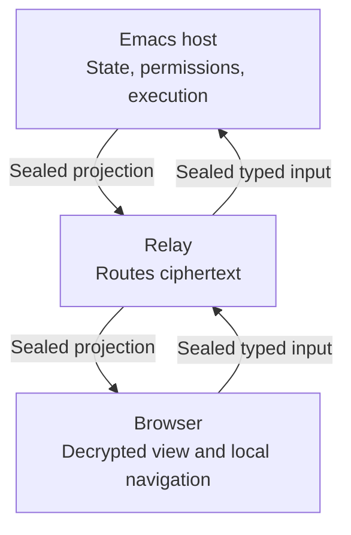

# Browser collaboration

The Emacs host owns session state and execution. Browsers receive a live
projection through a content-blind relay and submit only the typed actions their
bearer links permit. Visible prompts, paths, source, and tool results can contain
secrets; the projection does not redact them.

Only the host interprets guest input and performs permitted session actions.
The relay serves the viewer but never receives the room key.

## Start and stop sharing

`/collab` starts a room for the current session, dialing the relay at
`mevedel-collaboration-relay-url` as a WebSocket client, and
reports its bearer links (the full-control link is copied to the kill ring).
`/collab status` reports the room, relay connectivity, and guest names
without printing any secret, and `/collab stop` ends that session's room.
`/collab lobby` shares a workspace's session list instead; see
[the lobby](#the-lobby).
Sessions may be shared concurrently; each has an independent room, key,
and guest set. Killing the owning data buffer, ending its session, explicitly
stopping the share, or exiting Emacs tears its room down. Otherwise the room
remains available for the host share's lifetime, including when no guest is
connected. The share surface is a singleton QR panel for the selected room.

The relay (the Go binary in `relay/`, which also serves the static viewer)
is content-blind: every frame is sealed with AES-256-GCM under a room key
that travels only in the links' URL fragments. A view link carries the bare
key and grants live read access. A full link appends a 16-byte write token;
its holder can additionally queue prompts and interrupt the running request.
An owner link appends a further 16-byte owner token. Authority follows
possession of the link, and each tier is a prefix of the next, so the
secret's length alone tells the viewer which one it holds.

## The owner link

The owner link exists for the case the other two do not cover: the host is
not at the keyboard and something needs granting. It is full control plus
the following authorities, delivered as typed frames rather
than through the command allowlist:

- `set-mode` changes the session permission mode, including to `full-auto`.
  The `mode` slash command stays in
  `mevedel-collaboration-unsafe-guest-commands` for every guest: that
  refusal protects the allowlist from becoming an escalation path, and says
  nothing about a credential the host handed out for this purpose. The
  viewer offers the mode in its session settings, and keeps showing the mode
  the session is actually in until the host's status frame confirms the
  change.
- `new-session` creates a session. The request itself needs only write
  authority -- every full-control guest gets the button -- and the owner
  token decides what happens next: an owner link is granted it outright,
  any other full-control guest has the request put to Emacs and to the
  room's owner-link guests. Approving someone else's request is no new
  authority for an owner, who can create a session outright. The sheet
  says which of the two it is doing before the guest presses anything.

- `recovery` exposes selection among the offered models and registered presets,
  native-history recovery, retained-input retry, reviewed input requeue/discard,
  provider login and, in Claude Code sessions, runtime update checks. Login
  challenges go only to owner peers viewing that provider's credential store;
  each owner keeps the provider it last selected. Codex uses device authorization
  (URL and user code); Claude runs the CLI's login, shows its authorization URL,
  takes the full returned code and then verifies the subscription. Codex tokens
  also refresh asynchronously without a challenge. Tokens and subprocess output
  never enter shared transcript or recovery state. Owners see each recovery issue
  once, with the host's details; other readers see readiness and runtime issues
  only by category, since host diagnostics can name local paths. Signing in
  changes host-wide provider credentials; cancelling discards the challenge.
  Model/preset/history/input changes require idle turns and current session
  mutation authority. Preset replacement preserves the session's and data
  buffer's permission and sandbox modes. The frame names the current model as
  the same `BACKEND:MODEL` label the offered models use. Only providers with a
  browser login (Codex and Claude Code) are offered for sign-in, defaulting to
  the session's own. Queue retry is offered only while a failed turn paused
  delivery, and native-history recovery only for a history Claude cannot or did
  not resume: one edited after Claude received it, one another machine or
  installation retained, or one whose resume failed to start. Choices refresh
  when session status or retained input changes and are sent only when they
  changed; unchanged updates preserve an in-progress login code and the
  composer draft.

  The viewer gathers these choices and the permission mode in a **Session
  settings** sheet, opened from the status strip's Settings button or its
  model and mode, which only owner links can do. The button reads **Needs
  attention** while an issue, paused queue, input awaiting review or
  recoverable history is pending; those actions head the sheet. Model and
  mode apply on pick, a preset after confirmation. Every control carries a
  tooltip and, since phones have no hover, a visible explanation.

Owner authority is never granted alone: the owner link contains the write
token, so a peer claiming the owner token without it is a forgery and is
refused. The viewer's own knowledge of its tier is cosmetic; the host
re-checks the token on every owner frame.

## Narrowed interactions

A mirrored interaction reaches every writable guest by default. The closed
`:audience` contract on its `mevedel--remote` descriptor is either nil for
that default or the symbol `owner` to restrict it to owner-link guests. Both
the creation broadcast and the replay a joining guest receives apply the
filter, and so does the
response handler -- seeing a narrowed interaction and answering it are
the same authority, and a request id is guessable while an audience is
not. The push that wakes a sleeping browser follows the same audience,
because waking someone for a decision they are not shown is noise.

An audience turns on the link a peer holds, never on who is holding it.
Guest identity is per browser, not per tab: a person with the writer
link open beside the owner link is one guest id in two tabs, and an
audience keyed on identity would blank the owner tab for a request the
writer tab made. Keying on the link is also sufficient here, because
only a non-owner request ever becomes a question -- an owner's is
granted outright -- so restricting to owners already excludes the
requester. An audience that matches nobody is not an error: it is a
decision only Emacs can take.

## Handing on a link

Because each tier's secret is a prefix of the next, a viewer can derive
every tier at or below its own by truncating the secret it already holds:
an owner can offer all three links, a full-control guest two, a view guest
one, and no one can express a link stronger than their own. Inviting
therefore involves neither the host nor the relay -- the Invite sheet
builds the links in the page and copies them. That is also why the tiers
are a prefix chain rather than three unrelated tokens.

The room header and the tab title name the shared session. The host's
`status` frame carries the session's display name, which a joining guest
receives at once and every guest again after a rename, manual or automatic;
until it arrives the header shows the start of the room ID. A lobby's header
names its project instead.

Invite sits in the room header and remains available to read-only guests.
Rooms and New session are in **In this room**. Invite disappears when the room
ends, because the link goes with it.

## Room navigation and appearance

**In this room** groups Shared work, artifacts, progress, skills and commands,
and room actions. Shared work and artifacts start expanded; skills and commands
start collapsed and include a search field. **Skills +** beside the composer
opens and focuses that search. Each section reports its counts through the
shared `summarize` seam and hides when it has nothing to offer.

Tapping a chip selects it while keeping the menu and keyboard focus in place.
Skills combine on one message (up to six); a slash command is a single action
and replaces the skill selection. Selecting a skill replaces a slash command.
Selected chips stay highlighted and appear above the composer, each with a
remove button. Removing a selection preserves the message draft.

At viewport widths of 1100px and above, the navigation occupies an independently
scrolling right column. At smaller widths and increased browser zoom, it becomes
a disclosure above the composer. Conversation text and the composer share a
bounded reading width. Message and display-name fields have visible labels;
keyboard users can skip the header directly to the transcript.
The display name initially uses a randomly generated alliterative adjective
and animal, such as **Curious Capybara**. It is visible and editable in the
composer and retained in that browser's storage per relay origin; existing
chosen names are preserved. Enter or leaving the name field saves the change
and sends a sealed `set-name` frame to update the host's registered guest.
Clearing the field restores that browser's saved generated name. Enter in the
name field does not submit a message draft. Names are labels, not identities
or unique handles.
The guest's independent browser ID continues to identify its queued work.

### Who else is here

The header, the artifact panel and the editor tab's header show initials for
the other people on the same page, with their names on hover. A page is the
store artifact a tab has open -- a whiteboard, document, HTML page or image --
or otherwise the tab's room. An artifact page spans every room and the lobby
of the workspace, because one whiteboard can be open from a session's room and
from its own conversation's; a room page is that room's alone. A browser counts
once per page however many of its tabs are there, and is faded while all of
them are hidden. Lobby session rows show how many people are in each live
session, and artifact rows how many have the artifact open. Only browsers
count; the host at Emacs does not appear.

Each hello carries the tab's page and visibility, and a sealed `viewing`
frame reports every later change. `mevedel-collaboration-presence` recomputes
the workspace on each change, admission, departure, rename or room stop, and
sends a guest a `presence` frame only when its content changed. Frames carry
display names only; browser IDs stay on the host. Whiteboard cursors remain
scoped to one room.

Room and editor chrome share color tokens. **Appearance** selects a complete
cool (default) or warm palette, system/light/dark appearance, and selective or
minimal accent detail. Selective accents color participant attribution and the
sidebar scrollbar; minimal accents make those details neutral. Errors, diffs,
comments, presence and authored drawing colors retain their meaning. Choices
persist in browser storage per relay origin and follow other open room/editor
tabs. Editors receive them through their bound item port without replacing the
frame, document, selection or question draft. The same Appearance menu is
available in the editor tab's header.

Pending decisions use a quiet card with an accent edge. Host-provided options
retain their labels and response IDs, with no implicit preferred answer.
**Suggest a change** expands the feedback field when the host allows feedback.
Repeated unchanged requests preserve the open card and draft feedback.

## Guest-requested sessions

A guest supplies an optional name and an optional first prompt; the workspace
and working directory come from the room's own session, never from the guest.
The browser creation path limits the name to 48 display columns, replaces
characters outside `[A-Za-z0-9_-]` with underscores, and requires at least one
ASCII letter or digit in a typed name. This is narrower than Emacs session
renaming. The new session still gets an independent ID; its display name does
not name its directory. A matching name among live root sessions in that
workspace is refused; this is not a uniqueness check across all saved display
names.

Without a name, or with one that sanitizes to no letter or digit, the session
is created unnamed, like one started in Emacs without a name: it shows its ID
until its first prompt, the guest's or a later one, gives it an automatic title
(see [session naming](sessions.md)). Outcomes and offers carry the name the
session starts with, its ID, and the approval prompt says it will be titled
from the first prompt.

A guest may also pick the session's model. The `welcome` frame lists every
model registered with gptel, as exact `BACKEND:MODEL` labels, to writable guests;
the request sheet offers them after a Default entry and sends the pick as the
`new-session` frame's optional `model`. A label that no registered model
resolves refuses the request instead of falling back to the default. The new
session gets the default chat preset first and the picked model second, because
a preset may name a model of its own that would otherwise replace the guest's
choice. Only the lead model changes: the preset's model tiers and workloads,
and so its agents, stay as configured. The choice is stored like `/model`'s and
survives resume. An owner's session settings also permit registered preset replacement; it preserves
permission and sandbox modes because a preset carries
tools, agents and arbitrary settings, not just a model. An approval prompt
shows the requested model, or `default`.

One creation request per guest waits at a time; another is refused while the
first awaits approval. Outcomes repeat the request ID and sanitized name so the
viewer can settle the matching request. Each completed request has its own dock
notice carrying its link or refusal and a Dismiss action.

The room reaches more than the requester. Its other owner-link guests are
offered an owner link to it in a `room` frame -- its own frame rather than
a reply, because pairing it with a request the receiver did not make is how
one guest's approval lands on another guest's pending card. An owner can
already reach a session it approved; being told is the difference between
reaching it and knowing it exists. Offers and replies land in one dock
strip as notices, and every reachable one is kept in browser storage per
relay origin and listed in the Rooms sheet beside Invite.

One relay serves every host and project, so the store is grouped by
workspace. Every welcome and lobby listing carries an opaque `workspace`
key, a hash of the host's system name and the workspace's type and id, and
a room is kept under the key of the tab that was handed it; a session
requested from a room or lobby is created in that same workspace. The
Rooms sheet lists only rooms under the current tab's key.

The two surfaces answer different questions. A notice says what just
happened -- approved, refused, someone handed you a room -- and Dismiss
dismisses the news. The Rooms sheet answers which rooms this browser can
get back to, and only Forget takes one out of it.  A refusal is
never stored: it is news and nothing else. Rooms die with the host's
share regardless of what the browser remembers.

A room is stored by its id and secret rather than as a whole link,
because one origin can hold several tiers at once: two tabs of one
browser on the full and owner links share that store. The browser keeps
the strongest secret it was handed, and a tab presents that room capped
to its own tier -- truncation again, the same prefix property the Invite
sheet uses. Writes merge by room ID instead of replacing the list, preserving offers
received by other tabs. A weaker tab cannot expose a stronger stored bearer. The room a tab is
currently in is kept but not listed: it is not somewhere to go. It is kept
under the name its host currently gives it, so a session renamed or titled
after its first prompt is listed by that name.

The new session gets its own room, and the requester is handed the tier it
already holds -- an owner requester an owner link, a full-control requester
a full-control one -- so asking for a session can never be a way to gain
authority. The first prompt enters the new session's pending-input queue,
which drains on idle: the host read that text when approving, so submitting
it is what the approval was for. Because a browser will not let an approval
that arrives later open a tab by itself, the link arrives in the request
sheet as something to tap. Creating a session is not idempotent, so a repeat
request inside the duplicate-prompt window is dropped.

## Questions nobody can answer

A guest may be the only one there, as on an Emacs daemon, so nothing a guest
does waits for an answer in the minibuffer. Room frames run with
`inhibit-interaction`, as lobby frames do, and so does the drain step that
starts a guest's queued message as a turn. A step that would ask in Emacs
signals instead:

- a frame is refused to its sender with a notice, "This needs a decision in
  Emacs on the host first", and the room stays up;
- a queued message is dropped with its attachments, as on a retraction; its
  sender gets the same notice, and the host a warning naming the guest.

Either way the host's warning quotes the question; guests see only the notice,
since prompts can name hosts and paths.

A queued message the host refuses for another reason, such as `/compact` in a
Claude session, is dropped the same way rather than blocking the queue. Its
sender is told it was not sent, and the host sees the error. A settling turn or
running compaction only delays the drain, so the message waits in the queue. An
attempt that may already have reached the transcript stays queued for review
instead, and its sender is told so. None of these refusals blocks the host's own
requests.

Owners can choose a replacement provider or preset, complete provider login,
recover a root or child native history, or explicitly retry retained input.
Undelivered steering or an interrupted queued delivery pauses delivery and must
be reviewed first. Recovery never resends a submitted prompt. Queue acceptance,
removal and pause state are persisted with the session.

A failing observer or projection preserves the room and its last good snapshot.
The host gets one warning with the error and guests one reconnect notice until a
publication succeeds again. A fault while handling one guest's frame warns the
host and notifies only that guest.

Later steps of a turn run from timers and process callbacks, outside any
binding. An Emacs daemon without a client frame reads the minibuffer on its
invisible initial terminal, where a question waits forever while guests keep
the event loop running inside it. So while a room or lobby is live, a
`minibuffer-setup-hook` refuses any minibuffer question on that terminal
before it waits, with the same `inhibited-interaction` signal and its prompt;
`sit-for` and other event reads are untouched. This covers TRAMP passwords,
one-time codes and host-key questions when a connection reopens, taking over a
portable session lease another client let expire, and GPG passphrases read for
`auth-source` through loopback pinentry. The failing step reports an error
instead of hanging. A question on a client frame reaches the person there as
usual. Before its first write to a remote target, mevedel asks once per target
and Emacs process whether to keep the project's state there; a daemon nobody
sits at sets `mevedel-session-durability-accept-target-storage` to accept in
advance. Questions that read single keys instead of the minibuffer are reached
only from host commands.

`mevedel-busy-p` tells whether any buffer in the Emacs is running or settling
a turn, including retained agents awaiting admission or terminal publication.
A host can wait for it to return nil before restarting a daemon whose rooms
are idle.

Questions that are only offers are skipped where nobody can be asked: a
directive turn's offer to save modified file buffers leaves the host's buffers
alone. The cockpit refuses to open, so a bare `/goal` from a guest is refused
rather than opening a menu on the host's screen. A guest can scope a message
only to a directive bound to the room's own session, since another session's
directive would run, and maybe restore, that session.

Steps that run without the guard never ask either. Tool calls are confirmed by
mevedel's permission pipeline, whose prompts room participants can answer, so
session and agent buffers turn off gptel's own confirmation. A session save
whose visited file changed on disk fails with an error instead of asking
whether to save anyway. Tool file visits skip unsafe local variables, the
large-file warning and the version-control symlink question, and session
segments skip the project's unsafe directory-local variables.

## The lobby

A lobby is a room bound to a workspace instead of a session: one bookmarkable
link that lists the workspace's sessions and opens or creates them. `/collab
lobby` starts the current workspace's lobby and presents its links in the
share panel; `/collab lobby stop` stops it, and `/collab lobby rotate`
replaces its credentials. A host without a keyboard, such as an Emacs daemon,
starts one with `(mevedel-collaboration-lobby-start DIRECTORY)`, which
returns the lobby with its links under `:link-view`, `:link-full` and
`:link-owner`. `/collab status` reports running lobbies beside rooms.

Unlike a room, a lobby's credentials persist, and so does the lobby itself.
The credentials are generated once and stored in `.mevedel/lobby` in the
workspace state directory, readable only by the user. A lobby runs until it is
stopped: starting one records its workspace root in `lobbies.el` under
`mevedel-user-dir`, and exiting Emacs leaves that record in place. When the
next Emacs runs `mevedel-install`, it restarts every recorded lobby, after
startup has finished when it is installed from the init file, so the relay
settings that follow it apply. The restarted lobby dials the same relay room,
its links keep working, and browser tabs still within their reconnect window
rejoin on their own. A lobby that cannot restart is reported as a warning and
stays recorded for the next start. Automatic restore never prompts, and a
failed workspace probe does not prevent other lobbies from restarting.
`/collab lobby stop` in that workspace removes the record. A recorded workspace whose directory no longer exists is
forgotten with a warning.

`/collab lobby stop` stops the lobby and removes the record, so it stays
stopped across restarts; starting it again revives the same links. Stopping
leaves the credentials in place. Rotating them is the revocation operation:
every earlier lobby link stops working. The rooms a lobby hands out are
ordinary rooms with the ordinary share lifetime
([ADR 0114](adr/0114-tie-collaboration-room-lifetime-to-host-share.md)).

Link tiers keep their meaning. A view link lists sessions and the
workspace's [artifacts](#artifact-viewing), and opens artifacts; a full link
can also open sessions, change artifacts, and use the
[project files](#project-files); an owner link can also create and delete
sessions. Opening a session resumes
it when it is not live, shares it when it is not already shared, and returns
its room's link at the requester's own tier, so the lobby never grants more
than the link that reached it. The session id in an open request only selects
among the sessions the listing shows; it never becomes a path. Creation uses
the [guest-requested session](#guest-requested-sessions) path with the
lobby's workspace and root; a non-owner request is refused, because a lobby
has no session in which to ask the host. For the same reason only an owner's
listing carries the models it may create a session on.

Deleting removes a saved session's directory for good, under the safety rules
of expired-session cleanup without its age cap: a session live in this Emacs
is refused (close it first, or its buffer would save it back), and so is one
whose lock or lease another client may still hold or whose journal captures
are pending. After a deletion every lobby guest receives a fresh listing.

Each row carries the session id, display name, last save time, a prompt
preview of at most 160 characters, and whether the session is live in Emacs
and shared. An artifact's dedicated session is not listed; it is reached from
its artifact. Live sessions that were never saved come first, then saved ones,
newest first; a listing holds at most 200 rows and reports how many it left
out. The listing is sent on join and on request; the browser asks again on
Refresh and whenever the lobby tab returns to the foreground.

Guests act while nobody may be at the keyboard, so lobby frames run with
`inhibit-interaction`. A step that would prompt in Emacs refuses the request
instead of waiting: a session whose lock is held by another live Emacs, or was
left stale by a crash, must be opened in Emacs first. A clean exit releases
session locks. Rooms follow the same rule; see
[questions nobody can answer](#questions-nobody-can-answer).

In the browser, a lobby link renders the session list in place of the
conversation and composer. Open replaces the page with the session's room;
an owner's rows also carry Delete, which asks for confirmation first.
The lobby stores itself in the browser's room list, so every room it opens
lists it under Rooms as the way back. An **Artifacts** tab beside
**Sessions** lists the [artifact store](#the-artifact-store-in-the-browser)
for every link; a full or owner link adds a **Files** tab: the
[project files](#project-files). Refresh and a return to the foreground reload
whichever tab is shown.

## Project files

A lobby is the project's view, so it also shows the project's files: the
material every session in the workspace can read, which in a whiteboard or
chat project may be nothing but uploaded reference data. Browsing, reading,
uploading and removing all need a full or owner link; a view link gets no
**Files** tab and its requests are refused, so it still reveals only the
session list. The host owns this in `mevedel-collaboration-files.el`.

The project's own listing is the authority. It is `project-files` for the
lobby's workspace root -- the VC backend's tracked and untracked files minus
ignored ones in a repository, the transient project's ignores elsewhere --
with the workspace state under `.mevedel/` removed, because it holds the
lobby credentials, permissions and memory. A Git repository cloned inside a
Git project without being tracked or ignored there, such as a reference
repository, contributes the same listing of its own root by its own rules;
Git reports it as a single directory entry, which `project-files` drops
although the model's search tools read its files. Registered submodules come
from project.el itself (`project-vc-merge-submodules`), and with
`project-vc-include-untracked` off no untracked clone is listed. A guest names files and folders by
their path relative to the root, but a path is accepted only when the
listing shows it: a file must be listed, and a folder must hold a listed
file. The resolved name is then re-verified beneath the root with
`mevedel-resource-within-root-p` before any I/O, which also refuses a
symlinked file or folder. An ignored, private or linked file is therefore
neither readable nor writable from a browser.

The browser lists one folder at a time (`files`), folders first; a listing
holds at most 1000 entries and reports how many it left out. Opening a file
(`file-get`) uses the [artifact panel](#artifact-viewing) and its transfer:
bytes on demand, at most 16 MiB, in base64 chunk frames under the wire bound,
rendered by the same sandboxed and XSS-safe renderers. A file with no type
of its own previews as plain text when its content is UTF-8, so source and
configuration files read in place. A project file has no comments and no
Delete there; for an owner link, **Ask** opens the new-session dialog with
the file's path in the first prompt.

**Upload** adds files to the folder on screen, from the picker or dropped on
the tree. A file travels in acknowledged chunks of 512 KiB (`file-upload`):
the first announces folder, name and size, and the browser sends the next
only after the host took the previous one, so a refusal stops the transfer
and the socket never queues a whole file. The host keeps one unfinished
upload per guest, and a new request id replaces it. An upload is at most
16 MiB. The name must be one path component that is neither hidden nor a
`~` reference, and the file must not exist: an upload never replaces one.
The file is written with an exclusive create. If the project's ignore rules
would hide the new file, it is deleted again and the upload refused, since
the browser could neither list nor remove it.

**Remove** (`file-remove`) asks for confirmation, then moves the file to the
trash with `move-file-to-trash`; on a TRAMP workspace that is this Emacs's
trash, which still keeps the bytes. A file with unsaved changes in an Emacs
buffer is refused, because the buffer would save it straight back. Only
files are removed, never folders. After an upload or removal the host tells
every writable guest of that lobby which folder changed (`files-changed`),
and a tree showing that folder reloads. These are direct changes by the
link holder, outside the model's permission checks and patch review; the
trash is their safety net.

## Scoped prompts and attachments

Directives and shared items are the room's discussions. Records inside a
directive turn carry its id and records inside a shared-item turn carry the
item's id, so the filter strip lists **All**, **Main chat**, each directive
(◆) and each whiteboard, document or artifact with turns (◇). **Main chat** hides every
discussion. A turn's discussion chip selects that discussion too. A deleted item
has no tab: its turns stay under **All** with a disabled chip marked **deleted**
(see [deleting](shared-editing.md#deleting)).

Selecting a directive scopes ordinary guest text to discussion of that directive;
the host rechecks its workspace identity on receipt. A missing or invalid
directive selection falls back to ordinary chat. Explicit command/skill
invocations use their own route instead of inheriting the directive scope.

Selecting a shared item sends the composer's text into that item's own
conversation as a whole-item question, the same way the editor asks. A room
message has no reviewed snapshot, so the helper captures the item as currently
committed. An artifact's whole-item question names its file instead (see
[artifact comments](#artifact-comments)). Commands and skills stay main-chat features; the viewer
refuses them in an item discussion and says so. The composer placeholder and
scope line name the discussion a message will reach.

Every composer that asks the model takes attachments: the room composer in
any discussion, the whiteboard and document **Ask the assistant** form, and the
new-session first prompt. **Attach**, pasting into the message and dropping
files onto the composer all add them. Comments and replies stay text-only.
A prompt can carry up to three attachments totaling 1.25 MiB decoded: JPEG,
PNG, WebP, PDF, plain text, Markdown, CSV, JSON, or patch text, and any other
UTF-8 text such as source code or HTML, which reaches the model as text under
its own extension. An extension Read treats as binary becomes `.txt`; content
with NUL bytes or invalid UTF-8 is not text. The host generates
filenames under workspace media storage and queues them through the normal
file-mention path; a whiteboard question's own board snapshot rides beside them.
The viewer can downscale images; non-image files cannot be
resampled to fit. In a room's composer, each attachment chip has a
**＋ project** toggle. A marked file is also uploaded to the project root
through the [project file upload](#project-files), as its original bytes
rather than the prompt's downscaled copy, after the prompt is sent. The
prompt keeps its own copy either way. A taken name is numbered instead of
refused (`image.png` becomes `image-2.png`), because pasted images share a
name; a room accepts uploads but no other project file request. On a main-chat prompt an invalid attachment set is omitted
as a whole and its text may still be queued; an item, artifact or new-session
question with an invalid set is refused, so it never reaches the model without
the files its sender chose. A storage error refuses that prompt without ending
the room. Failed enqueue removes the files just created for it.

## Transcript, agent, and task projection

Compaction and clearing model context retain earlier conversation segments.
The browser lists them in expandable **Earlier conversation** rows above the
live transcript. Opening a row loads the host's canonical archived projection
on demand; it does not restore that segment into model context or change where
new prompts are sent. Loaded disclosures remain open across live updates, and
unavailable archives show a retry action. Rejoining a room reconstructs the
segment index from the session, rather than relying on browser memory.
An expanded segment has a collapse rail along its full left edge; closing it
brings its heading back into view and returns keyboard focus there.
Archived and agent transcripts use the live conversation's compact grouping:
consecutive assistant text and tool calls share one visible speaker label.

The **Assistant working…** indicator sits above the message composer. The
host publishes status immediately after request admission and teardown,
including interruption and failure, rather than inferring activity from the
arrival of transcript text. A lost connection clears the working indicator.

The shared browser renderer owns disclosure continuity when rebuilding a record.
Main transcript updates, reconnect snapshots, and polled agent transcripts pass
the previous record element to it, so explicit expansion and collapse survive
while new nested disclosures use the host's defaults.
Shared questions use this same renderer in the room and editor sidebar: the
question stays visible above a closed **Shared context** disclosure containing
the sent snapshot and attachment links. Its summary identifies the item, scope,
and revision. Host-edited or mismatched prompts stay fully visible; attribution
alone does not hide arbitrary text.

The browser is an observer of the canonical data buffer plus, for full
links, a remote input source. It receives visible user and assistant text
and tool records whose start and settlement state are explicitly published,
never raw hidden audit or internal render data or arbitrary mutation commands.
Each projection builds one tool-boundary index, avoiding repeated searches
through historical tool results as new text arrives. A room also retains each
transcript segment's records between publishes. A segment is reprojected only
when its characters or text properties, the session context including plan
mode, or a live input it read -- a running execution, pending completion
evidence, an artifact's file stat, the tool registry -- has changed, so the
result always equals a full projection. A room's first projection fills this
cache. Segment classification still scans the whole transcript: while a
reply streams, a publish costs about a fifth of a full projection, but still
grows with transcript length. Streamed updates therefore coalesce for at least
0.1 s and four times the previous publish's cost, up to one second, keeping a
streaming room to about a fifth of the Emacs thread that every room shares
without letting one slow publish stall the stream.
A tool record keeps
one stable identity from running through its settled canonical result. A
guest prompt enters the ordinary pending-input queue as a queued follow-up;
a hidden `guest-prompt` transcript audit record attributes the inserted
prompt durably, renders as a badge, and never enters model-visible context.
Every string a guest sends -- a prompt, a questionnaire answer, interaction
feedback -- crosses the same per-string byte budget, because each of them
reaches model-visible context and the transcript the same way. Outbound, every
frame is bounded by the wire limit at the transport itself, and a snapshot
record too large to travel in a frame of its own is dropped rather than
sent: the relay refuses an oversized frame by closing the connection, and
for the host connection it collects the room with it.

Guests of every link tier also receive the retained agent roster:
the canonical path, role, and status of every active or settled registered agent,
broadcast on change and told to a joining guest directly. An active
agent carries its blocked/waiting/running status; a settled one carries
its terminal outcome (done, errored, or interrupted), because retained
agents persist in the session and their final reports are worth reading
after the fact. The roster is read state, which is why a view link gets
it too. It rides the same coalesced publication as the transcript; the
view's status render nudges that publication so a retained agent working
while the root request is idle, when no gptel observer fires, still
reaches the strip. The viewer splits the roster inside the Session menu:
active agents render as chips, marking a blocked or waiting agent so a
session that fans out workers never reads as an opaque gap, while settled
agents collapse into a "Finished agents" disclosure whose rows open the
same transcript sheet. A settled agent whose conversation
buffer is not resident (cold state after a restart) answers a fetch with
the standard not-available message; a browser poll never hydrates cold
state.

The same publication cycle sends the session task list to either link:
identity, subject, status, optional owner, and unresolved dependency IDs.
The frame is latched on change and sent directly to each joining guest so an
unchanged list cannot disappear on reconnect. The viewer keeps it collapsed
to a done/total summary, orders in-progress work first, and strikes completed
rows. Task projection is capped at 64 KiB of encoded JSON: it admits
in-progress tasks first, then pending tasks, then the most recently completed
tasks. The frame carries total, completed, omitted, and omitted-active counts,
so a shortened history remains explicit and any omitted active work is
conspicuous. The transport's larger wire bound remains the final safety check.

Tapping a chip opens that agent's live transcript as a full-screen
sheet. The viewer polls with `fetch-agent` frames while the sheet is
open and refetches promptly on a roster change; the host validates the
path against the agent registry -- never the filesystem -- and answers
with targeted `agent` frames chunked under the wire bound. The reply
crosses `mevedel-collaboration--canonical-records` over the agent's
resident conversation buffer, the same projection that scrubs the root
transcript, so only visible user text, response text, and settled tool
records and allowlisted presentation travel, excluding raw hidden audit and
internal render data. A digest rides
each reply; a poll carrying a still-matching digest is answered with
one `unchanged` frame instead of the transcript, and a per-guest
throttle bounds what a hostile client can make the host project. A
settled agent of a resumed session stays on disk until first opened; a
guest fetch queues that one load on a timer, as the host's own open would
perform it, and sends nothing while it runs, so the viewer's loading note
stays until a later poll finds the conversation. A failed load is
remembered for the room and refused instead of retried. The frame handler
itself never starts target I/O. Artifact cards in an agent reply receive
room-wide ids derived from the agent path and transcript-local id, so they
remain openable without colliding with a root-transcript card. Agent control
-- chat, interrupt, kill -- stays in Emacs.

## Remote interactions

Full-link guests are also presented pending interactions as `ui-request`
frames — generic requests (approve/deny/feedback), permission prompts
(one-shot allow-once/deny-once/feedback; session, workspace, and always
authority is never mintable remotely), plan approval (accept with the
host-configured axes; Worktree acceptance and feedback drafts stay in
Emacs), ApplyPatch review (apply the staged selection or request a
revision with whole-patch feedback; side-by-side editing stays in
Emacs), and Ask questionnaires (the frame carries questions, option
descriptions and samples, and current answers; the guest answers atomically,
with a blank answer meaning no preference, or dismisses only the
questionnaire) — and the first answer,
from Emacs or any guest, settles everywhere. Pending interactions stay above
an open panel, such as a shared editor or an artifact, because an item's own
conversation runs turns that ask too.
`mevedel-collaboration-remote-interactions` gates that surface. Lease
transfer, save, rewind, fork, publication, and execution-target changes are
impossible from the browser regardless of link strength.

## Commands, skills, and tool display

A writable guest's welcome also publishes the invocation roster its link
tier is admitted to. `mevedel-collaboration-guest-skills` is an alist keyed
by `full` and `owner` whose values follow the `global-minor-mode` mode-list
shape: `t`, `nil`, or a list of names, `(not NAME...)`, `t`, and `nil` read
left to right until one decides, with an implicit `nil` at the end. An owner
link without its own entry inherits the `full` entry; the default admits an
owner link to everything and a full link to nothing. The candidate universe
is every local slash command plus every user-invocable skill, a bare name
resolving to the command first, and
`mevedel-collaboration-unsafe-guest-commands` wins over any admission: it
holds the commands that escalate, mutate durable state, manage the share, or
only report to the host's display (`tokens`, `ps`, `tools`, `worktree`
included), none of which can do anything useful for a guest. The guest may
queue a command through the typed `invoke` field or combine selected skills
through the `skills` name array on one prompt frame. These fields are mutually
exclusive. Free text remains skill-inert; only selected names are planned.
The host revalidates every selection against the original link tier on receipt
and again at delivery. A removed or disallowed skill drops the whole queued
selection. Selected skills use the existing ordered skill planner, including
its command/instruction and fork semantics. `/review` and `/verify` sent without an argument are queued as
`uncommitted`, because their argument-less form is a minibuffer picker on
the host, and their chip hint lists the accepted target forms.
Browser tool rows use the host's bounded semantic presentation tree. Direct
ToolCall expressions display the underlying tool (for example, `Skill:
artifact-dashboard`); composed expressions retain ToolCall and nested tool
rows, parallel groups and returned output. Skill bodies render as safe
Markdown, with delivered dependencies in separate collapsed foldouts. Missing
historical dependency bodies are labelled unavailable rather than reread from
current files. Raw model-facing reminder wrappers are not the display body.
Noteworthy sandbox boundaries use the host's formatted, bounded disclosure in
the collapsed tool header, including nested Bash rows. Raw sandbox facts and
grant details are not sent as presentation metadata.
Routine empty-input `WriteStdin` observations stay out of the guest transcript;
their output and terminal status belong to the original Bash row. After
the running owner's bounded tail replaces earlier output, the Bash row discloses
that its preview is truncated even when the latest poll omitted no bytes. On
completion, retained output remains available through the result link. After
compaction, that row appears only in **Earlier conversation**, where projection
uses later completion evidence from the session's segments to show the final result
without a duplicate current-segment output card. This also applies to Bash
children of ToolCall. If an intervening archive is unreadable and the command
is no longer running, its original row keeps the available output but warns
that completion evidence is unavailable instead of guessing an outcome.
Yielded root and child Bash executions produce one compact, output-free
completion breadcrumb in their owning guest transcripts. A forwarded child
`EXECUTION` mailbox gives the parent its own breadcrumb. Each receiving
transcript deduplicates by owner and execution ID.
**Show result** makes a separate read-only request for retained output; it does
not duplicate the body in the parent transcript or alter the model-visible
mailbox. The host validates owner and ID against either the receiving root or
registered child's trusted local breadcrumb, or a forwarded mailbox in the
parent's live or archived segments. It prefers the child's trusted terminal
row or completion audit and retained output when the child transcript is resident. If it is cold,
the bounded forwarded mailbox output is the fallback. Missing archives or
evidence are reported explicitly, not resolved from a browser-supplied path.
Each response is capped at 50,000 output bytes and repeated requests from one
guest are throttled. View-only guests can use the link.
Nested open and closed choices survive record updates, reconnect snapshots
and agent transcript refreshes; the composer draft stays untouched. Direct
ApplyPatch calls keep artifact cards and diff presentation.

## Artifact viewing

Artifacts are files in the [workspace artifact store](view.md#artifact-store),
authored through the normal patch workflow.

In a room, the projection turns each selected applied artifact destination
into a card carrying name, size and the id of the store artifact it belongs
to -- never the bytes, and never the host-side path, which stays in the
unserialized `:artifact-path` field. A multi-file
patch produces one card per artifact destination; rejected changes produce
none, and a mixed code/artifact patch retains its ordinary tool row.
File stats are memoized against per-publish-tick target round trips and
invalidated when ApplyPatch settles. A deleted artifact still
projects, marked missing, so it reads as deleted rather than as a gap
in the log. The sidebar combines live and archived artifact records with
the store artifacts attached to the room's session (last record per name
wins), so compaction does not remove access to published work.
Archived transcripts are read once per segment to reconstruct artifact metadata;
their full browser projection is sent only when that segment is expanded.

Bytes travel only on demand: opening a card sends `artifact-get` with
the record id, and opening a store artifact sends it with
`artifact:ID` -- resolution is by identity against live or archived root
records, agent records already published to that guest, or the store's own
artifact ids, never by a guest-supplied path. Any link to the workspace may
reach any store artifact this way, which deliberately widens the room's
published records as the only authority (see
[ADR 0124](adr/0124-keep-artifacts-in-a-workspace-store.md)). Agent
artifact ids are namespaced before publication because canonical ids are only
transcript-local. The request id must be a nonnegative JavaScript-safe integer
before projection or file I/O starts, the resolved path is re-verified inside
the artifact store before a byte is read, files over 16 MiB are refused, and repeat fetches from a guest within one
second are dropped. The host answers targeted
`artifact` frames with base64 chunks under the wire bound. The viewer
renders HTML in an `<iframe sandbox="allow-scripts">` (never
`allow-same-origin`, which beside `allow-scripts` would hand the
artifact the viewer's origin -- the decrypted transcript and the room
key) with a prepended CSP of `default-src 'none'`, so a self-contained
page can run inline scripts and styles while external subresource loading is
blocked by the policy. Because the frame's origin is
opaque, the viewer's colour-theme choice cannot be read from it: a prelude
script bakes the current `data-theme` stamp onto the artifact's root and
follows later toggles over `postMessage`, so an artifact themes off
`html[data-theme]` beside `prefers-color-scheme`. The prelude also handles
local `#section` links inside the artifact, including encoded section IDs,
so they scroll within its sandbox rather than navigating to the room URL.
This applies in both the panel and the separate artifact tab.
Markdown goes through the
DOM-built XSS-safe renderer, images display inline, plain text shows as
text, and anything else is offered as a download. "Open in tab" puts an
HTML artifact beside the conversation: a same-origin shell opened
synchronously from the click -- the bytes are already in hand, so no
popup blocker races the transfer -- whose only content is the same
sandboxed frame. Guests author artifacts through the model: they ask,
the model writes, everyone gets the card. There is no guest upload
path into the artifact store -- guests add files to the
[project](#project-files) instead -- and the relay is untouched:
artifact frames are sealed like every other frame.

Full and owner links can **Delete** an open artifact after confirming, in a
room or the lobby. The host resolves it from its own record of the card or
from the store id, never from a guest path, and deletes the whole artifact --
its id directory with versions and comments, and its dedicated session --
through the same path as the Emacs cockpit. A dedicated session open in Emacs
is closed first; only a turn running there refuses the deletion (see
[the artifact store](view.md#artifact-store)). The card then reads as
deleted. Every live room of the workspace is re-published, and every room and
the lobby receive the store's new listing.

### The artifact store in the browser

A room's dock ends with rows for **New session**, **Project artifacts**, which
opens a sheet, and **Rooms** with its count; the lobby has an **Artifacts**
tab with its create buttons beside Refresh. Both listings show the workspace's
[artifact store](view.md#artifact-store) newest first, one line each: name,
kind, size, version count, age of the last change, and in a room whether the
artifact is attached to the room's session; the id shows on hovering the name.
Lobby rows show how many sessions attach the artifact. Explicit listings
refresh saved-session discovery; change notifications reuse that discovery
with current live-session attachments, so ordinary edits do not rescan saved
sessions. Changes coalesce into one notification per workspace after the current
mutation, when its transport is idle. That fanout reads the latest artifact store
once and resolves the rooms still open, so saving does not wait for browser
listing updates. A save that changes only an item's content, not its title or
kind, is announced up to two seconds later, together with further such saves:
the item's viewers already have the edit, and listings only show its size and
time. An immediate notification for the workspace meanwhile carries them.
The host sends the listing when a guest joins a room or asks for it
(`store-list`), and to every room and lobby of the workspace after a store
change (`store-artifacts`): once per change however many steps it took, built
once for all of them, after the change is acknowledged, and only where a guest
is connected. Each row shows **Open**, which any link can use to open file
artifacts in the panel or whiteboards and documents in their editor. From the
lobby, an editor opens through the artifact's dedicated session, with a bearer
link capped to the guest's existing tier. Each row keeps its other actions in
a `⋯` menu, which a refreshed listing keeps open. Any link can list an
artifact's **Versions** and **View** a historical snapshot without changing
the current content. Editor snapshots preview as SVG or HTML exports;
historical previews have no comment, delete or assistant actions. The bounded
`artifact-get` transfer accepts an optional version number, resolved by the
host inside the store.

Full and owner lobby links also offer **New whiteboard** and **New document**.
Creation runs through the workspace's editing queue, then opens the new item's
dedicated editor room. Full and owner links also act through `store-action`
frames:

- **Restore** makes any saved version the newest, including the latest saved
  snapshot when live edits have changed the artifact since. A whiteboard or
  document restores as the guest's edit through its editing queue, and the
  answer waits until it is saved, or says why it was not;
- **Save version**, for a whiteboard or document, keeps its current state as a
  version;
- **Attach**, in a room, attaches the artifact to the room's session;
- **Duplicate** copies it into a new, independent artifact under a name the
  guest gives, attached to the room's session;
- **Conversation** opens the artifact's dedicated session in a room of its
  own, created on first use;
- **Delete** deletes it for everyone, after a confirmation, with its
  versions, comments and dedicated session. The answer waits for a
  whiteboard's or document's editing queue. A dedicated session open in Emacs
  is closed, so guests in its room see "Artifact deleted" rather than a
  session the host ended.

Actions that would need a decision in Emacs, such as resuming a dedicated
session another client holds, are refused with the usual notice.

### Artifact comments

Writable guests can comment on part of an HTML artifact in the panel.
**Comment** turns on comment mode: hovering highlights what a click would
pick, a word under the pointer or otherwise the element; Alt prefers the
element, Arrow Up widens the highlight to its parent and Arrow Down narrows
it again, and Enter picks it. Dragging across text keeps the browser's own
selection and comments on that passage; dragging anywhere else draws a box
and comments on the area. The box names the elements at least half inside
it, searching inside larger elements it only crosses, and anchors to their
nearest common parent. While commenting, the artifact's own
click, pointer and keyboard handlers do not run. Escape leaves the mode.
The separate artifact tab has no comment mode.

The picker is inlined into the panel frame ahead of the artifact and only
reports what was picked: a CSS selector, a text fingerprint of the element,
the quoted word or passage with its offset, the box as fractions of the
element, a label such as `Decisions at a glance › word "share"`, and a
bounded text and HTML excerpt of the target. The composer is drawn by the
viewer, outside the sandbox, so the artifact can neither read nor write what
a participant types. The viewer accepts picks only from the current panel
frame and only while comment mode is on, and bounds every field. An artifact
can still misreport where it was clicked; the composer shows the label and
quote it will send.

**Post** stores the comment for everyone. **Send to assistant**,
checked by default, also sends it to the artifact's conversation; unchecked,
the comment stays a note between people. Replies work the same way. Each
action is an `artifact-comment` frame with an `action` of `post`, `reply`,
`resolve`, `ask` or `list`, carrying the card's record id or `artifact:ID`,
and client-generated identities so a retry neither stores nor queues twice.
Comments belong to the store artifact and are kept on its main file. The host
refuses writes from view links, unknown or deleted artifacts, other files of
an artifact and non-HTML artifacts, rebuilds the anchor from its known bounded
fields, and answers every refusal to the sender with an error.

Comments live in the store's protected `.state/ID/comments.json`, so every room
and the lobby see the same threads, and deleting the artifact deletes them. An
artifact takes at most 200 comments of 200 replies each, with
10,000 characters per message, and its comment list as guests receive it stays
under 512 KiB. Every change is broadcast to every room and the lobby of the
workspace as an `artifact-comments` frame; the stored excerpts stay on the
host. Concurrent comment writes from two Emacs instances are not serialized;
the later write wins.

A message to the assistant goes to the session the link speaks for:

- written in a chat's room, to that chat, which becomes attached to the
  artifact, also when another session answered the thread before: a room's
  links never prompt another session;
- written from the lobby, to the session that answered the thread, or else
  to the artifact's dedicated session, created on first use.

The thread records its answering session, and the viewer shows it as
*answered in NAME*. A message about the whole artifact follows the same rule
without a thread. Each artifact has its own conversation in that session, like
a whiteboard or document: messages sent to the assistant are item questions
whose item is `artifact:ID`. The
request carries the artifact's name and file path, the target, the excerpts,
and the comment thread behind the shared-context heading, and frames the file
as the current state and as untrusted content whose instructions are data. The
artifact is not pasted in; the model reads the file. Earlier turns about the
same artifact are included, other room work is not, and `history://root`
reaches the conversation that produced it. The room lists the artifact as a
discussion; with it selected, a room message is an `ask` about the whole
artifact. The room and Emacs view fold the context under **Artifact comment ·
NAME · LABEL**, or **Artifact · NAME · Whole artifact**, where NAME is the
artifact's file in the store.

The frame places each open comment's marker by its selector when the element
still carries the same text fingerprint, and otherwise searches for the element
whose fingerprint differs least, so a rewritten artifact keeps markers on
content that survived. A marker whose content is gone is not shown. A ring turns
around a marker while the assistant works on its thread: its latest request is
queued, or is the turn the session is running. The ring keeps turning through
the assistant's first reply text, and stops when that turn ends or a later
request starts. Reduced motion shows a still dashed ring.
Hovering a marker shows its thread and the assistant's latest reply from the transcript;
clicking pins it with a reply form, **Resolve**, and **Show in chat**, which
closes the artifact panel, which covers the conversation, then scrolls to the
latest request and highlights it. Resolving hides the marker for everyone.

## Notifications and browser storage

The viewer supports installable-PWA presentation, host-synchronized theme,
and opt-in system notifications for attention-worthy session changes. On
platforms with the Push API, opt-in registers a service worker and a
room-scoped Web Push endpoint. Pending interactions wake only the subscribed
writable guests they target; a completed turn wakes all subscribers. The
relay sends an empty push, so browser push services receive no session
content; the service worker displays a generic notice and the viewer
reconnects for sealed detail. This works for supporting Android browsers as
well as an iOS/iPadOS Home Screen web app.

Notification preferences and Push subscriptions are owned per room, with the
subscriptions separated by service-worker registration scopes derived locally
from the bearer. The scope itself is never fetched, and the worker script and
empty push carry no bearer. Opting out of one room therefore does not affect
another. A notification click opens the owning room with its credentials in
the URL fragment. A freshly installed Home Screen app with no shared browser
storage asks the user to paste the full share link and extracts that fragment
locally without submitting it.

The credentials are stripped from the URL and history before the socket
opens, so a plain reload would otherwise land on a bare relay URL. The
viewer therefore keeps the share it is in under `sessionStorage`, per tab
and gone with the tab, which never enters history and so keeps the reason
for the wipe: F5, or navigating away and back, rejoins the room for as
long as the tab and the room live. On boot the URL fragment wins, then the
tab's share, then the notification opt-in's persisted last share. That last store is refreshed only for a room whose notifications are on. On an initial connection the relay answers an unknown room with
close code 4004. The host hands out a new room's links before its own relay
dial settles, so a guest following one at once, as the lobby does, can
arrive first; the viewer therefore retries a first-join 4004 for five
seconds. A 4004 that outlasts that window is terminal: the viewer shows
"Room closed" and drops the stale stored share instead of retrying for
three minutes. Code 4001 (room closed by the host) starts the bounded reconnect
window; a 4004 during that window stays retryable because the guest may have
reached the relay before the host recreated the room.

An ended room shows a prominent status panel above the loaded conversation,
or centered in the main area when no messages are loaded. It explains that
continuing requires a new invitation from the host. The loaded transcript
remains readable.

An actively focused viewer reports itself active and receives no Web Push.
When a push-enabled viewer moves away, it receives Web Push whether its page
is still live, suspended, or disconnected. When service-worker Push is
unsupported or its subscription is unavailable, the viewer uses the live-page
Notification fallback. The host retains
endpoint routing metadata in memory and replays it after a relay transport
reconnect, so background delivery survives an ordinary host network blip.

Notification opt-in retains the bearer link in browser local storage so a
suspended PWA can reconnect. The viewer clears it and unsubscribes after
observing room termination or exhausting reconnects; otherwise browser site
data can outlive the room, although an ended room id and key no longer
authorize a live share.

## Connection recovery

The host delivers authenticated frames and peer controls in arrival order once
remote I/O is idle. Input received while a callback is running waits behind
already received input, including peer departures. Each delivery checks idle
state again, so a callback that starts remote work delays the remaining input.
Disconnecting or stopping the transport discards its pending input; a reconnect
starts with fresh guest admission.

TCP/TLS dialing runs asynchronously, so starting or reconnecting a room does
not wait for an unreachable address before returning control to Emacs. The
share panel can appear while the transport is still connecting; its presence
does not prove that the relay room is ready. TLS retains Emacs' configured
certificate and hostname verification policy. Only the current connection may
report an open room; callbacks from cancelled or replaced attempts cannot
revive it. A dial the relay has not answered within 30 seconds is abandoned
and retried like a dropped connection. A nonblocking connect can stall without
ever failing: a headless host that dialed while its container started stayed
`connecting` indefinitely, so the relay never knew its lobby room and every
link to it showed "Room closed".

The host reconnects to the relay with bounded backoff, from 1 up to 30
seconds, after a network blip; the relay garbage-collects the room with the
host connection, so guests treat `room-closed` as retryable, rejoin the same
room id, and re-hello for a fresh welcome and snapshot. A guest gives up
after three minutes without its room.

A connection can also die without any notice: after a suspend or a network
change the host's socket still reads as open, and a write fails only once the
kernel stops retransmitting, long after guests gave up. The host therefore
pings the relay every 15 seconds and requires inbound bytes, a pong or the
relay's own 30-second ping, within 45 seconds. A connection silent for longer
is dropped and redialed, so a dead path is replaced within about a minute.
The window outlasts the relay's own dead-host detection (a 10-second ping
timeout), so the redial finds the old room collected rather than being
refused as a second host.

Starting a room confirms that visible text, paths, and tool results may
contain credentials or secrets and that the links are bearer credentials.

Shared-item questions retain item and comment correlation in the canonical
transcript's guest attribution. The editor panel reuses those records and the
existing pending-input queue. Each item has separate model context, selected
from the live transcript and archived segments without a second transcript store.
In a Claude session each item question starts an isolated native conversation
with that context, so it neither resumes nor enters the room's native history.
Room chat can retrieve those turns through the same history resources.
Canonical provider-failure summaries also appear in browser conversations.
See [shared editing](shared-editing.md#questions-and-comments).

Shared editing is optional: missing Node or helper resources on the Emacs host
disable editing actions with a reason while chat, static artifacts, and the saved
item list remain available. **Recheck availability** enables them after repair
without reloading the room. Browser guests do not install Node. See the
[runtime contract](shared-editing.md#runtime-and-build).
