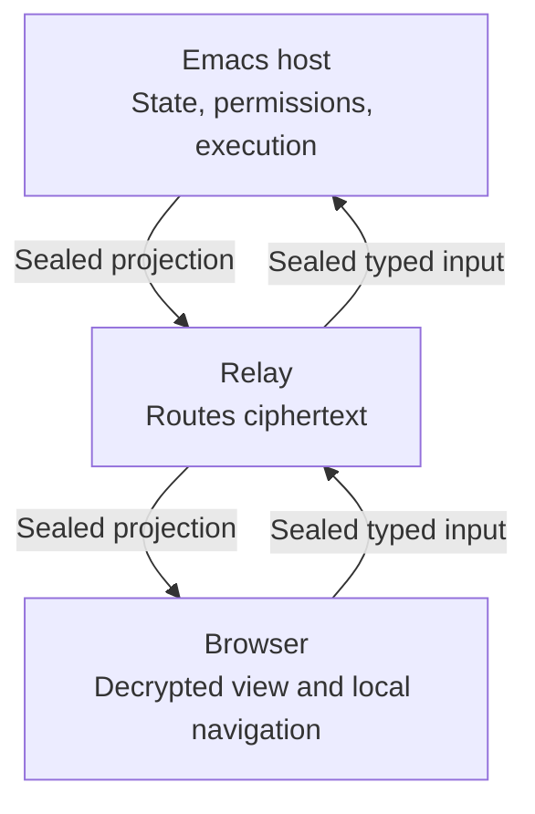

# Browser collaboration

The Emacs host owns session state and execution. Browsers receive a live
projection through a content-blind relay and submit only the typed actions their
bearer links permit. Visible prompts, paths, source, and tool results can contain
secrets; the projection does not redact them.

Only the host interprets guest input and performs permitted session actions.
The relay serves the viewer but never receives the room key.

## Start and stop sharing

`/collab` starts a room for the current session, dialing the relay at
`mevedel-collaboration-relay-url` as a WebSocket client, and
reports its bearer links (the full-control link is copied to the kill ring).
`/collab status` reports the room, relay connectivity, and guest names
without printing any secret, and `/collab stop` ends that session's room.
Sessions may be shared concurrently; each has an independent room, key,
and guest set. Killing the owning data buffer, ending its session, explicitly
stopping the share, or exiting Emacs tears its room down. Otherwise the room
remains available for the host share's lifetime, including when no guest is
connected. The share surface is a singleton QR panel for the selected room.

The relay (the Go binary in `relay/`, which also serves the static viewer)
is content-blind: every frame is sealed with AES-256-GCM under a room key
that travels only in the links' URL fragments. A view link carries the bare
key and grants live read access. A full link appends a 16-byte write token;
its holder can additionally queue prompts and interrupt the running request.
An owner link appends a further 16-byte owner token. Authority follows
possession of the link, and each tier is a prefix of the next, so the
secret's length alone tells the viewer which one it holds.

## The owner link

The owner link exists for the case the other two do not cover: the host is
not at the keyboard and something needs granting. It is full control plus
exactly two authorities, both delivered as their own typed frames rather
than through the command allowlist:

- `set-mode` changes the session permission mode, including to `full-auto`.
  The `mode` slash command stays in
  `mevedel-collaboration-unsafe-guest-commands` for every guest: that
  refusal protects the allowlist from becoming an escalation path, and says
  nothing about a credential the host handed out for this purpose. The
  viewer renders the mode as a native picker in the status strip, and the
  strip keeps showing the mode the session is actually in until the host's
  status frame confirms the change.
- `new-session` creates a session. The request itself needs only write
  authority -- every full-control guest gets the button -- and the owner
  token decides what happens next: an owner link is granted it outright,
  any other full-control guest has the request put to Emacs and to the
  room's owner-link guests. Approving someone else's request is no new
  authority for an owner, who can create a session outright. The sheet
  says which of the two it is doing before the guest presses anything.

Owner authority is never granted alone: the owner link contains the write
token, so a peer claiming the owner token without it is a forgery and is
refused. The viewer's own knowledge of its tier is cosmetic; the host
re-checks the token on every owner frame.

## Narrowed interactions

A mirrored interaction reaches every writable guest by default. The closed
`:audience` contract on its `mevedel--remote` descriptor is either nil for
that default or the symbol `owner` to restrict it to owner-link guests. Both
the creation broadcast and the replay a joining guest receives apply the
filter, and so does the
response handler -- seeing a narrowed interaction and answering it are
the same authority, and a request id is guessable while an audience is
not. The push that wakes a sleeping browser follows the same audience,
because waking someone for a decision they are not shown is noise.

An audience turns on the link a peer holds, never on who is holding it.
Guest identity is per browser, not per tab: a person with the writer
link open beside the owner link is one guest id in two tabs, and an
audience keyed on identity would blank the owner tab for a request the
writer tab made. Keying on the link is also sufficient here, because
only a non-owner request ever becomes a question -- an owner's is
granted outright -- so restricting to owners already excludes the
requester. An audience that matches nobody is not an error: it is a
decision only Emacs can take.

## Handing on a link

Because each tier's secret is a prefix of the next, a viewer can derive
every tier at or below its own by truncating the secret it already holds:
an owner can offer all three links, a full-control guest two, a view guest
one, and no one can express a link stronger than their own. Inviting
therefore involves neither the host nor the relay -- the Invite sheet
builds the links in the page and copies them. That is also why the tiers
are a prefix chain rather than three unrelated tokens.

The Invite and Rooms buttons sit in the dock's Session menu rather than
in the composer row: a read-only guest never sees the composer and has
its own link to hand on. Invite does go away when the room ends, because
the link goes with it.

## The Session menu

The dock has one collapsible menu, the `Session` disclosure, and every
non-transcript surface the viewer offers lives in it: the host-admitted
command and skill chips, live sub-agent chips, finished agents, the task
list, artifact chips, and the New Session, Rooms, and Invite buttons. Its
summary line lists what is inside as counts (`Session · 4 commands · 2
agents · 3/5 tasks · 1 artifact · invite`) and the box hides when every
section is empty. Commands and artifacts fold into closed submenus of
their own, because an owner link with `t` sees every skill on the host
and a flat list would push the agents and tasks out of view. Each section reports its own fragment through one `summarize`
seam keyed by section, so a module adds itself to the menu without
knowing about the others. Tapping a command chip arms the invocation,
closes the menu, and focuses the composer, whose scope line keeps showing
what is armed.

## Guest-requested sessions

A guest supplies a name and an optional first prompt; the workspace and
working directory come from the room's own session, never from the guest.
The browser creation path limits the name to 48 display columns, replaces
characters outside `[A-Za-z0-9_-]` with underscores, and requires at least one
ASCII letter or digit. This is narrower than Emacs session renaming. The new
session still gets an independent ID; its display name does not name its directory.
A matching name among live root sessions in that workspace is refused; this is
not a uniqueness check across all saved display names.

One creation request per guest waits at a time; another is refused while the
first awaits approval. Outcomes repeat the request ID and sanitized name so the
viewer can settle the matching request. Each completed request has its own dock
notice carrying its link or refusal and a Dismiss action.

The room reaches more than the requester. Its other owner-link guests are
offered an owner link to it in a `room` frame -- its own frame rather than
a reply, because pairing it with a request the receiver did not make is how
one guest's approval lands on another guest's pending card. An owner can
already reach a session it approved; being told is the difference between
reaching it and knowing it exists. Offers and replies land in one dock
strip as notices, and every reachable one is kept in browser storage per
relay origin and listed in the Rooms sheet beside Invite.

The two surfaces answer different questions. A notice says what just
happened -- approved, refused, someone handed you a room -- and Dismiss
dismisses the news. The Rooms sheet answers which rooms this browser can
get back to, and only Forget takes one out of it.  A refusal is
never stored: it is news and nothing else. Rooms die with the host's
share regardless of what the browser remembers.

A room is stored by its id and secret rather than as a whole link,
because one origin can hold several tiers at once: two tabs of one
browser on the full and owner links share that store. The browser keeps
the strongest secret it was handed, and a tab presents that room capped
to its own tier -- truncation again, the same prefix property the Invite
sheet uses. Writes merge by room ID instead of replacing the list, preserving offers
received by other tabs. A weaker tab cannot expose a stronger stored bearer. The room a tab is
currently in is kept but not listed: it is not somewhere to go.

The new session gets its own room, and the requester is handed the tier it
already holds -- an owner requester an owner link, a full-control requester
a full-control one -- so asking for a session can never be a way to gain
authority. The first prompt enters the new session's pending-input queue,
which drains on idle: the host read that text when approving, so submitting
it is what the approval was for. Because a browser will not let an approval
that arrives later open a tab by itself, the link arrives in the request
sheet as something to tap. Creating a session is not idempotent, so a repeat
request inside the duplicate-prompt window is dropped.

## Scoped prompts and attachments

Selecting a directive scopes ordinary guest text to discussion of that directive;
the host rechecks its workspace identity on receipt. A missing or invalid
directive selection falls back to ordinary chat. Explicit command/skill
invocations use their own route instead of inheriting the directive scope.

A prompt can carry up to three attachments totaling 1.25 MiB decoded: JPEG,
PNG, WebP, PDF, plain text, Markdown, CSV, JSON, or patch text. The host generates
filenames under workspace media storage and queues them through the normal
file-mention path. The viewer can downscale images; non-image files cannot be
resampled to fit. Invalid attachment sets are omitted as a whole; their prompt
text may still be queued. A storage error refuses that prompt without ending
the room. Failed enqueue removes the files just created for it.

## Transcript, agent, and task projection

The shared browser renderer owns disclosure continuity when rebuilding a record.
Main transcript updates, reconnect snapshots, and polled agent transcripts pass
the previous record element to it, so explicit expansion and collapse survive
while new nested disclosures use the host's defaults.
Shared questions use this same renderer in the room and editor sidebar: the
question stays visible above a closed **Shared context** disclosure containing
the sent snapshot and attachment links. Its summary identifies the item, scope,
and revision. Host-edited or mismatched prompts stay fully visible; attribution
alone does not hide arbitrary text.

The browser is an observer of the canonical data buffer plus, for full
links, a remote input source. It receives visible user and assistant text
and tool records whose start and settlement state are explicitly published,
never raw hidden audit or internal render data or arbitrary mutation commands.
A tool record keeps
one stable identity from running through its settled canonical result. A
guest prompt enters the ordinary pending-input queue as a queued follow-up;
a hidden `guest-prompt` transcript audit record attributes the inserted
prompt durably, renders as a badge, and never enters model-visible context.
Every string a guest sends -- a prompt, a questionnaire answer, interaction
feedback -- crosses the same per-string byte budget, because each of them
reaches model-visible context and the transcript the same way. Outbound, every
frame is bounded by the wire limit at the transport itself, and a snapshot
record too large to travel in a frame of its own is dropped rather than
sent: the relay refuses an oversized frame by closing the connection, and
for the host connection it collects the room with it.

Guests of every link tier also receive the retained agent roster:
the canonical path, role, and status of every active or settled registered agent,
broadcast on change and told to a joining guest directly. An active
agent carries its blocked/waiting/running status; a settled one carries
its terminal outcome (done, errored, or interrupted), because retained
agents persist in the session and their final reports are worth reading
after the fact. The roster is read state, which is why a view link gets
it too. It rides the same coalesced publication as the transcript; the
view's status render nudges that publication so a retained agent working
while the root request is idle, when no gptel observer fires, still
reaches the strip. The viewer splits the roster inside the Session menu:
active agents render as chips, marking a blocked or waiting agent so a
session that fans out workers never reads as an opaque gap, while settled
agents collapse into a "Finished agents" disclosure whose rows open the
same transcript sheet. A settled agent whose conversation
buffer is not resident (cold state after a restart) answers a fetch with
the standard not-available message; a browser poll never hydrates cold
state.

The same publication cycle sends the session task list to either link:
identity, subject, status, optional owner, and unresolved dependency IDs.
The frame is latched on change and sent directly to each joining guest so an
unchanged list cannot disappear on reconnect. The viewer keeps it collapsed
to a done/total summary, orders in-progress work first, and strikes completed
rows. Task projection is capped at 64 KiB of encoded JSON: it admits
in-progress tasks first, then pending tasks, then the most recently completed
tasks. The frame carries total, completed, omitted, and omitted-active counts,
so a shortened history remains explicit and any omitted active work is
conspicuous. The transport's larger wire bound remains the final safety check.

Tapping a chip opens that agent's live transcript as a full-screen
sheet. The viewer polls with `fetch-agent` frames while the sheet is
open and refetches promptly on a roster change; the host validates the
path against the agent registry -- never the filesystem -- and answers
with targeted `agent` frames chunked under the wire bound. The reply
crosses `mevedel-collaboration--canonical-records` over the agent's
resident conversation buffer, the same projection that scrubs the root
transcript, so only visible user text, response text, and settled tool
records and allowlisted presentation travel, excluding raw hidden audit and
internal render data. A digest rides
each reply; a poll carrying a still-matching digest is answered with
one `unchanged` frame instead of the transcript, and a per-guest
throttle bounds what a hostile client can make the host project. A
cold or historical agent is refused rather than hydrated: a guest poll
must never start target I/O. Artifact cards in an agent reply receive
room-wide ids derived from the agent path and transcript-local id, so they
remain openable without colliding with a root-transcript card. Agent control
-- chat, interrupt, kill -- stays in Emacs.

## Remote interactions

Full-link guests are also presented pending interactions as `ui-request`
frames — generic requests (approve/deny/feedback), permission prompts
(one-shot allow-once/deny-once/feedback; session, workspace, and always
authority is never mintable remotely), plan approval (accept with the
host-configured axes; Worktree acceptance and feedback drafts stay in
Emacs), ApplyPatch review (apply the staged selection or request a
revision with whole-patch feedback; side-by-side editing stays in
Emacs), and Ask questionnaires (the frame carries questions, option
descriptions and samples, and current answers; the guest answers atomically,
with a blank answer meaning no preference, or dismisses only the
questionnaire) — and the first answer,
from Emacs or any guest, settles everywhere.
`mevedel-collaboration-remote-interactions` gates that surface. Lease
transfer, save, rewind, fork, publication, and execution-target changes are
impossible from the browser regardless of link strength.

## Commands, skills, and tool display

A writable guest's welcome also publishes the invocation roster its link
tier is admitted to. `mevedel-collaboration-guest-skills` is an alist keyed
by `full` and `owner` whose values follow the `global-minor-mode` mode-list
shape: `t`, `nil`, or a list of names, `(not NAME...)`, `t`, and `nil` read
left to right until one decides, with an implicit `nil` at the end. An owner
link without its own entry inherits the `full` entry; the default admits an
owner link to everything and a full link to nothing. The candidate universe
is every local slash command plus every user-invocable skill, a bare name
resolving to the command first, and
`mevedel-collaboration-unsafe-guest-commands` wins over any admission: it
holds the commands that escalate, mutate durable state, manage the share, or
only report to the host's display (`tokens`, `ps`, `tools`, `worktree`
included), none of which can do anything useful for a guest. The guest may
queue an admitted command or skill with arguments through a typed invocation
frame; free text remains skill-inert, and the host revalidates the name
against the tier the entry was queued under on receipt and again at
delivery. `/review` and `/verify` sent without an argument are queued as
`uncommitted`, because their argument-less form is a minibuffer picker on
the host, and their chip hint lists the accepted target forms.
Browser tool rows use the host's bounded semantic presentation tree. Direct
ToolCall expressions display the underlying tool (for example, `Skill:
artifact-dashboard`); composed expressions retain ToolCall and nested tool
rows, parallel groups and returned output. Skill bodies render as safe
Markdown, with delivered dependencies in separate collapsed foldouts. Missing
historical dependency bodies are labelled unavailable rather than reread from
current files. Raw model-facing reminder wrappers are not the display body.
Nested open and closed choices survive record updates, reconnect snapshots
and agent transcript refreshes; the composer draft stays untouched. Direct
ApplyPatch calls keep session artifact cards and diff presentation.

## Artifact viewing

[Session artifacts](view.md#session-artifacts) are files authored through the
normal patch workflow.

In a room, the projection turns each selected applied artifact destination
into a card carrying name and size -- never the bytes, and never the host-side
path, which stays in the unserialized `:artifact-path` field. A multi-file
patch produces one card per artifact destination; rejected changes produce
none, and a mixed code/artifact patch retains its ordinary tool row.
File stats are memoized against per-publish-tick target round trips and
invalidated when ApplyPatch settles. A deleted artifact still
projects, marked missing, so it reads as deleted rather than as a gap
in the log. The viewer also derives a strip of chips in the Session menu
(last record per name wins) so reopening one never means scrolling the
log.

Bytes travel only on demand: opening a card sends `artifact-get` with
the record id -- resolution is by identity against the root records or agent
records already published to that guest, never by a guest-supplied path. Agent
artifact ids are namespaced before publication because canonical ids are only
transcript-local. The request id must be a nonnegative JavaScript-safe integer
before projection or file I/O starts, the resolved path is re-verified inside
the artifacts directory before a byte is read, files over 16 MiB are refused, and repeat fetches from a guest within one
second are dropped. The host answers targeted
`artifact` frames with base64 chunks under the wire bound. The viewer
renders HTML in an `<iframe sandbox="allow-scripts">` (never
`allow-same-origin`, which beside `allow-scripts` would hand the
artifact the viewer's origin -- the decrypted transcript and the room
key) with a prepended CSP of `default-src 'none'`, so a self-contained
page can run inline scripts and styles while external subresource loading is
blocked by the policy. Because the frame's origin is
opaque, the viewer's colour-theme choice cannot be read from it: a prelude
script bakes the current `data-theme` stamp onto the artifact's root and
follows later toggles over `postMessage`, so an artifact themes off
`html[data-theme]` beside `prefers-color-scheme`. Markdown goes through the
DOM-built XSS-safe renderer, images display inline, plain text shows as
text, and anything else is offered as a download. "Open in tab" puts an
HTML artifact beside the conversation: a same-origin shell opened
synchronously from the click -- the bytes are already in hand, so no
popup blocker races the transfer -- whose only content is the same
sandboxed frame. Guests author artifacts through the model: they ask,
the model writes, everyone gets the card. There is no guest upload
path, and the relay is untouched -- artifact frames are sealed like
every other frame.

## Notifications and browser storage

The viewer supports installable-PWA presentation, host-synchronized theme,
and opt-in system notifications for attention-worthy session changes. On
platforms with the Push API, opt-in registers a service worker and a
room-scoped Web Push endpoint. Pending interactions wake only the subscribed
writable guests they target; a completed turn wakes all subscribers. The
relay sends an empty push, so browser push services receive no session
content; the service worker displays a generic notice and the viewer
reconnects for sealed detail. This works for supporting Android browsers as
well as an iOS/iPadOS Home Screen web app.

Notification preferences and Push subscriptions are owned per room, with the
subscriptions separated by service-worker registration scopes derived locally
from the bearer. The scope itself is never fetched, and the worker script and
empty push carry no bearer. Opting out of one room therefore does not affect
another. A notification click opens the owning room with its credentials in
the URL fragment. A freshly installed Home Screen app with no shared browser
storage asks the user to paste the full share link and extracts that fragment
locally without submitting it.

The credentials are stripped from the URL and history before the socket
opens, so a plain reload would otherwise land on a bare relay URL. The
viewer therefore keeps the share it is in under `sessionStorage`, per tab
and gone with the tab, which never enters history and so keeps the reason
for the wipe: F5, or navigating away and back, rejoins the room for as
long as the tab and the room live. On boot the URL fragment wins, then the
tab's share, then the notification opt-in's persisted last share. That last store is refreshed only for a room whose notifications are on. On an initial connection the relay answers an unknown room with
close code 4004, which the viewer treats as terminal: it shows "Room closed"
at once and drops the stale stored share instead of retrying for three
minutes. Code 4001 (room closed by the host) starts the bounded reconnect
window; a 4004 during that window stays retryable because the guest may have
reached the relay before the host recreated the room.

An actively focused viewer reports itself active and receives no Web Push.
When a push-enabled viewer moves away, it receives Web Push whether its page
is still live, suspended, or disconnected. When service-worker Push is
unsupported or its subscription is unavailable, the viewer uses the live-page
Notification fallback. The host retains
endpoint routing metadata in memory and replays it after a relay transport
reconnect, so background delivery survives an ordinary host network blip.

Notification opt-in retains the bearer link in browser local storage so a
suspended PWA can reconnect. The viewer clears it and unsubscribes after
observing room termination or exhausting reconnects; otherwise browser site
data can outlive the room, although an ended room id and key no longer
authorize a live share.

## Connection recovery

TCP/TLS dialing runs asynchronously, so starting or reconnecting a room does
not wait for an unreachable address before returning control to Emacs. The
share panel can appear while the transport is still connecting; its presence
does not prove that the relay room is ready. TLS retains Emacs' configured
certificate and hostname verification policy. Only the current connection may
report an open room; callbacks from cancelled or replaced attempts cannot
revive it.

The host reconnects to the relay with bounded backoff after a network blip;
the relay garbage-collects the room with the host connection, so guests
treat `room-closed` as retryable, rejoin the same room id, and re-hello for
a fresh welcome and snapshot within a bounded give-up window.

Starting a room confirms that visible text, paths, and tool results may
contain credentials or secrets and that the links are bearer credentials.

Shared-item questions retain item and comment correlation in the canonical
transcript's guest attribution. The editor panel reuses those records and the
existing pending-input queue; it does not maintain a separate conversation.
Canonical provider-failure summaries also appear in browser conversations.
See [shared editing](shared-editing.md#questions-and-document-comments).
