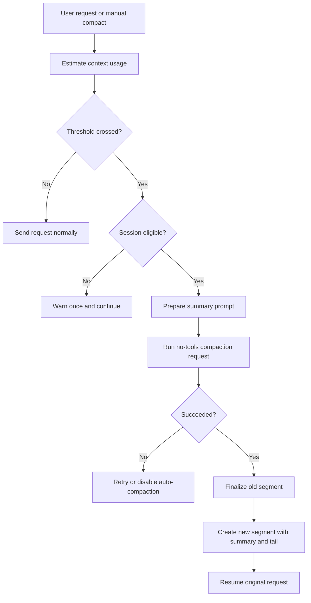

# Conversation Compaction

Compaction reduces model-visible history while keeping the persisted
conversation recoverable. The implementation lives in
`mevedel-compact.el`; persisted segment rotation is handled by
`mevedel-session-persistence.el`.

## Compaction flow



## User model

`mevedel-compact` manually compacts the current chat. Automatic
compaction is enabled by default for persisted sessions and runs when
the estimated context crosses the configured threshold. There are two
automatic gates:

- the pre-send prompt transform for ordinary user requests.
- the continuation WAIT gate before tool-result follow-up requests.

During auto-compaction the view reuses the request progress row and
changes its status to `Compacting...`. When compaction completes, the
original request continues and the spinner returns to `Thinking...`.
The slash/manual command remains useful when the user wants to compact
with custom instructions.

When `PreCompact` adds hook context, the hook audit surface is stored as
an ignored side channel next to the compaction summary, not in the
model-visible summary text.  The expanded audit detail shows the
`PreCompact` event and injected context that affected the summarizer.

The first-compaction accuracy notice is controlled by
`mevedel-compact-warn-on-completion`, enabled by default. It is emitted
as a plain `message`, not a `display-warning`.

## Trigger predicate

The effective context window comes from:

1. The active model's `:context-window` property, converted from
   thousands of tokens to raw tokens.
2. `mevedel-compact-context-limit` when model metadata is absent.
3. A 128000 token fallback.

Usable context is:

```
reserve = min(max(mevedel-compact-reserve-tokens,
                  effective max output tokens),
              context-window / 2)
usable = context-window - reserve
```

The reserve cap keeps small-context models from collapsing the default
fractional threshold to a near-zero value.

`mevedel-compact-token-threshold` is a float strictly between `0.0` and
`1.0`, default `0.80`.  Integer thresholds and invalid ratios are rejected.
This is a breaking configuration change.

Automatic admission resolves both the realized target model and the
`compaction` workload model.  It triggers when the estimate reaches the
smaller model's ratio-derived threshold.

`mevedel--compact-should-compact-p` also checks eligibility:

- `mevedel-compact-auto` must be non-nil.
- auto-compaction must not be disabled by repeated failures.
- no compaction request may already be in flight.
- the session must be writable, persisted, and on the active segment.

If the threshold is crossed but the session is not eligible, mevedel
warns once and lets the request proceed normally.

## Token estimate

Before a request is sent, mevedel still needs a local estimate. It uses
the historic chars/4 scan when no API baseline is available, ignoring
regions marked `gptel 'ignore` and excluding file-local variables.

After normal non-compaction requests, API-reported token usage from
gptel is recorded as `mevedel--known-token-baseline`. Future estimates
start from that measured baseline and add chars/4 only for text added
after the recorded marker. Compaction requests are explicitly excluded
from this baseline so the summarization call never pollutes chat usage
estimates.

The baseline uses gptel's latest request token plist (`info :tokens`)
when available. `info :tokens-full` is only a fallback for gptel
versions or backends that do not provide per-request usage. This avoids
treating cumulative multi-request tool-loop usage as the current
context footprint.

Realized request estimates are media-aware. Inline image payloads in
OpenAI data URLs, Anthropic base64 image blocks, and Bedrock image byte
blocks are not counted as raw base64 text. They are replaced with the
local `mevedel-compact-image-token-estimate` heuristic. This estimate
only decides whether to compact before a continuation request; the next
provider-reported usage baseline remains authoritative.

## Request flow

The first automatic gate is installed as a gptel prompt transform. It
runs after skill/model overrides, mention expansion, and reminder
injection. This order matters:

- compaction uses the effective model/backend for threshold decisions.
- source segment rotation uses the original pending user text.
- the temporary request buffer is rebuilt after compaction and receives
  the transformed pending text, including reminders and mentions, for
  the actual request.

The pre-send estimate starts from the source chat buffer's API-corrected
baseline when present, then adds the chars/4 delta introduced by prompt
transforms. Without a baseline it falls back to the transformed prompt
buffer estimate.

The second automatic gate wraps `gptel--handle-wait` in the preset FSM
handler chain. Existing WAIT injectors still run first: request-begin,
skill overrides, queued user prompts, agent mailbox messages, and
deferred tool injection. The gate then estimates the realized
`info :data` payload for continuation WAIT cycles, currently the
`TRET -> WAIT` path after tool results have been injected. If the
request is below threshold, it calls the original wait handler normally.
If it is over threshold and the session is ineligible, it emits the same
one-shot skip warning as the pre-send gate and lets the continuation
proceed. If eligible, it compacts the active persisted segment, rebuilds
`info :data` from the compacted buffer, and then calls the original wait
handler.

Continuation compaction supports the active persisted session segment and a
persisted sub-agent transcript.  Agent compaction is considered only in the
agent FSM's continuation `WAIT`, after the preceding response and tool result
have settled and immediately before gptel would send the follow-up request.
Initial requests and streaming responses are never interrupted.

The shared compaction runner owns admission, tail selection, tool-output caps,
summary requests, retries, preflight, and hooks for both targets.  The private
target adapter supplies the protected transcript bounds and target-specific
persistence, display, continuation, and failure operations.  Agent hooks run
with the parent session, workspace, and invocation; their payload uses the
agent ID as `:origin`, the stable canonical transcript as `:transcript-path`,
and `"auto"` as `:trigger`.  Model-visible `PreCompact` additions retain their
ignored audit record beside the summary.

For a persisted agent, the original `* Agent Task:` block remains verbatim.
Only older agent-owned history is summarized; parent goal state, session-wide
skill history, and touched-file reminders are excluded.  Before rewriting,
mevedel synchronously saves the full live transcript and copies it to the next
unused sibling such as `explorer.compact-0001.chat.org`.  It then rewrites the
same canonical `.chat.org` file as task plus anchored summary plus configured
recent tail, rebuilds the pending request from that live buffer, and resumes it
once.  Activity temporarily reports `Compacting...` and then returns to the
ordinary continuation status.  Agent compaction emits neither the main-session
file reminder nor the long-thread accuracy warning.

Later continuation compactions update the existing anchored summary in place:
the previous summary is supplied as authoritative retained context, the latest
complete turns are merged into a replacement summary, and the original task
block plus configured recent tail stay intact.  Every pass archives the current
canonical transcript to the next collision-free numbered sibling, so a second
pass creates `compact-0002` from the post-first-compaction transcript before
rewriting the same canonical path again.

If agent summarization or application fails, the continuation is not sent.
The agent FSM enters its normal `ERRS` transaction so transcript finalization
and the terminal callback deliver the ordinary bounded, transcript-backed
error result to the parent exactly once.  The terminal transition clears the
temporary compaction activity before reporting `error`.

An ephemeral agent cannot satisfy the archive contract, so summarizer-only
pressure does not trigger compaction or termination.  It continues while its
target model remains below threshold and enters the same terminal error path
without rewriting its buffer at target pressure.  A persisted agent whose
protected task and recent tail leave no older prefix follows the same pressure
rule: continue below target pressure, terminate without sending at target
pressure.

Archive creation happens before any live-buffer rewrite.  Failure to create the
numbered archive leaves both the canonical transcript and live buffer intact;
if a later local application step fails, the complete pre-compaction archive
remains available for recovery.  These local eligibility, preflight, hook,
abort, and application failures are non-retryable.  Only summary request
failures receive the existing maximum of three identical attempts.

Numbered agent archives are recovery artifacts, not transcript identities.
They are deliberately absent from the session sidecar, session browser, and
retention index.  They remain owned by the original session directory and are
removed with it by normal session cleanup.  Rewind forks copy only canonical
agent transcripts referenced by the fork's sidecar; they do not copy numbered
archives.

Compaction requests disable tools (`gptel-use-tools` and `gptel-tools`),
use a no-tools prompt preamble, respect the active `gptel-stream`
setting, and use the `compaction` workload policy from the current session's
`mevedel-model-workloads`. Failures retry up to three attempts with exponential
backoff. After repeated failures,
`mevedel--compact-auto-disabled` prevents further automatic attempts in
that buffer.

After `PreCompact`, mevedel preflights the tool-capped summary body and the
complete system prompt, including hook additions, against the summarizer's
usable context.  A locally oversized request fails without gptel dispatch or
retry.  Ordinary gptel request failures still retry the identical request up
to three times.

If automatic compaction finds no old body to summarize because the threshold
is reached entirely by the protected tail, it sends the original request only
while the target model remains below its own threshold.  At target pressure it
blocks the pending request.

If automatic compaction fails, mevedel warns with
`Auto-compaction failed; request not sent: ...`. For continuation WAIT
cycles, the overflowing follow-up request is not sent after a failed
compaction.

## Summary prompt

The summary prompt lives in `prompts/compaction/summary.md` and is
rendered by `mevedel--compact-prompt` with request-specific template
values. The generated summary is an anchored Markdown document with
fixed sections:

- Goal
- Constraints & Preferences
- Progress / Done / In Progress / Blocked
- Key Decisions
- Next Steps
- Critical Context
- Relevant Files
- Skills Invoked

On first compaction the prompt asks the model to create a new anchored
summary. On later compactions it provides the previous leading summary
and asks the model to update it. The update prompt treats the previous
summary as authoritative retained context: still-true details must be
kept, stale or contradicted details removed, and new facts merged in.
This is important because older segment contents are no longer present
in the model-visible prompt except through the previous summary.

Skill invocation records from the session are appended to the prompt so
summaries can preserve user-side and model-side skill usage.

When a session owns a Goal, every new segment begins with a
`<goal-context authority="compaction-snapshot">` pointer block generated
directly from the persisted Goal sidecar. It records the compaction-time
objective, lifecycle state, policy, artifact pointers, budget, and execution
home before the summary and preserved tail. Segment rotation regenerates this
snapshot on every compaction; it is orientation, not later lifecycle truth.
Every phase request carries a fresh `authority="session-sidecar"` fragment,
which supersedes earlier snapshots. Neither the summary nor transcript prose
is parsed to reconstruct Goal state. The anchored summary remains working
memory for discoveries, constraints, decisions, progress, evidence, and next
steps.

## Tail preservation

Compaction summarizes only the old body and preserves a recent tail
verbatim. The tail starts at the newest complete turn boundary that fits
both constraints:

- target turn count: `mevedel-compact-tail-turns`, default 2.
- budget: `mevedel-compact-tail-budget` of usable context, default
  0.25.

Response boundaries and preserved-tail turn starts are derived from
`mevedel-transcript-segments`. A turn start is the first real
user prompt line after an assistant response, excluding gptel-owned
tool/reasoning/summary scaffolding, so clipped or restored org markers do
not create fake preserved turns.

Compaction consumes the transcript module's detailed structural types rather
than maintaining an independent control-form classifier.

Tool blocks in both the preserved tail and summary request body are made
structurally safe under character caps: persisted `#+begin_tool` /
`#+end_tool` markers stay balanced, large string arguments are shortened as
readable Lisp data, and visible result bodies are truncated by character caps:

- `mevedel-compact-tail-tool-output-max`
- `mevedel-compact-body-tool-output-max`

The current unsent prompt is kept outside the summarized body. For
auto-compaction it is reattached after the new summary and preserved
tail, then the original request proceeds. If older touched-file
references were omitted, the current auto-compacted request also receives
a one-shot reminder to re-read files before relying on exact contents.
That reminder is current-request state injected while rebuilding or
realizing the compacted prompt; it must not be queued into the session
pending-reminder FIFO, which would deliver it to a later turn.

## Segment integration

Persisted sessions use split-on-compact:

1. Save and finalize the current `segment-NNNN.chat.org`.
2. Increment `mevedel-session-current-segment`.
3. Repoint the data buffer to the new segment file.
4. Rebuild the buffer with segment properties, a leading
   `#+begin_summary` block, preserved tail, and pending prompt.
5. Save the new segment and update the sidecar.

Old segment files remain on disk and stay available through
`mevedel-rewind`. The live view skips the leading summary block when
rendering the visible transcript and shows a compacted-conversation
separator in its place, while the summary remains model-visible for
future requests.

Compaction does not stop or replace managed executions. Completion updates the
original Bash row when that row survives in the preserved tail. If rotation
explicitly archives a completed row, the new segment receives a hidden durable
`execution-completion` audit record. A running row is replaced before segment
publication by a durable `execution-archive` record containing its structured
render data; terminal settlement atomically changes that record to
`execution-completion`, while resume changes a stale archive to `lost`. The
captured owner mailbox continues to provide the model-visible notification.
Archive intent comes from the concrete tool rows removed by compaction, not a
session counter. On resume or fork, a completion/archive record in a newer
segment also supersedes the historical running row left in its predecessor, so
the two copies cannot produce contradictory terminal states. A live archive
record removed by a later compaction is carried into the next segment again;
it remains durable across any number of rotations until terminal settlement.

Persisted summary blocks include a short model-facing handoff prefix
before the anchored Markdown summary. The prefix tells the resumed model
to build on the prior work and avoid duplicating it. When a later
compaction uses the leading summary as `<previous-summary>`, mevedel
strips that prefix so the summarizer receives only the anchored summary
content.

## Defcustoms

All are in `mevedel-compact.el`:

- `mevedel-compact-auto` (default `t`)
- `mevedel-compact-context-limit` (default `nil`, fallback for missing model metadata)
- `mevedel-compact-token-threshold` (default `0.80`)
- `mevedel-compact-reserve-tokens` (default `20000`)
- `mevedel-compact-image-token-estimate` (default `1844`)
- `mevedel-compact-tail-turns` (default `2`)
- `mevedel-compact-tail-budget` (default `0.25`)
- `mevedel-compact-tail-tool-output-max` (default `4000`)
- `mevedel-compact-body-tool-output-max` (default `8000`)
- `mevedel-compact-warn-on-completion` (default `t`)
