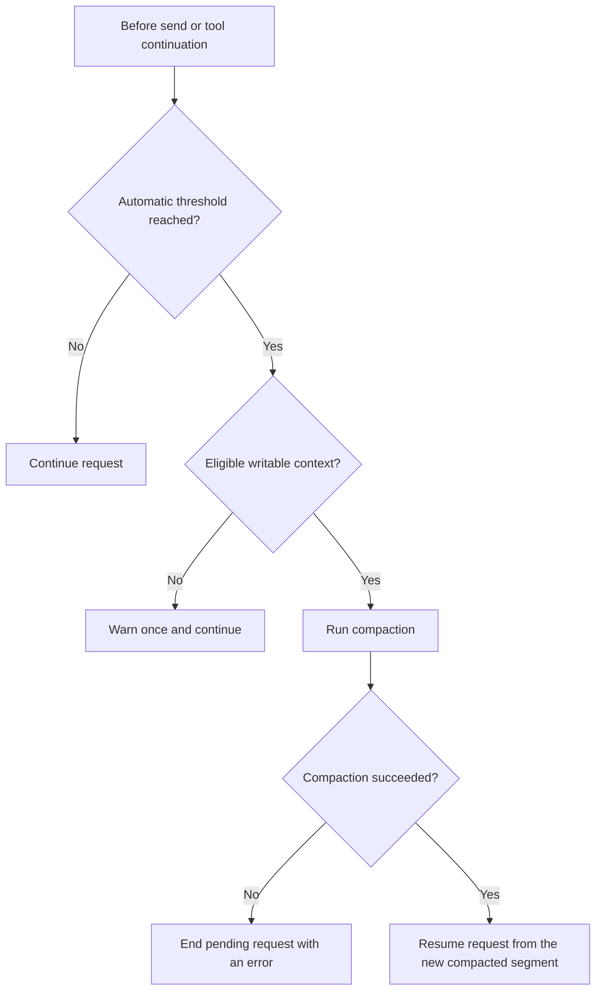

# Conversation Compaction

Compaction reduces model-visible history while keeping the persisted
conversation recoverable. `mevedel-compact.el` is the public command and
gptel gate. Token admission lives in `mevedel-compact-estimation.el`,
transcript projection and tool-safe truncation in
`mevedel-compact-evidence.el`, target application in
`mevedel-compact-target.el`, and asynchronous settlement in
`mevedel-compact-run.el`. Persisted segment rotation is handled by
`mevedel-session-artifacts.el`. Model generation is delegated to the
stateless `mevedel-context-summary.el` generator.

## Native Claude compaction

Claude owns compaction of its external history. Root and retained-child ACP
connections advertise session compaction support; `mevedel-acp-compaction.el`
consumes its lifecycle and retained-summary events. It does not request another
summary from a model. A completed root compaction publishes a successor segment
with Claude's summary through the ordinary segment transaction. A retained
child uses its private transcript archive and keeps its task anchor; its
compaction never replaces root history. Fresh directive conversations do not
advertise this segment operation, because their selected history cannot replace
the containing session's root history.

The boundary follows gptel's insertion marker when compaction starts. Output
received after that boundary is preserved as a tail after the summary, so a
mid-turn compaction loses neither intervening output nor subsequent tools.
Stream markers are reset after publication; the admitted turn keeps its native
identity, per-turn call identities and once-only settlement. Archived managed-command rows
use the same durable execution records as ordinary compaction. Queued, running
and stopping commands remain live archive records even without an open view;
their terminal events replace those records when the commands finish. The
composer draft survives the view rebuild.

A terminal summary supersedes streamed summary chunks. Duplicate terminal
updates cannot publish another segment. Failed or cancelled compaction leaves
the transcript intact; completion without a usable summary fails the turn
visibly. The summary is labelled as Claude-authored and may refer to context
delivered through hooks. Publication does not itself acknowledge delivery of
instructions: [native context restoration](sessions.md#native-context-delivery)
has its own receipt. As after local root compaction, a published segment stops
earlier Reads from counting as duplicates; if touched-file contents were
omitted, the re-read reminder is enqueued on the pending FIFO for the next
prompt, since no gptel request exists to stage it on.

The ACP runner processes native events, hooks and tool admission in order when
the execution target's transport is idle. Cancellation fences queued work;
late callbacks cannot rotate a replacement request's transcript. Isolated text
workloads have no transcript segments and do not advertise this capability.

## Compaction flow

The diagram follows automatic admission for a root session. Manual compaction starts explicitly
and leaves successful compacted context for the next accepted input.


```mermaid
flowchart TD
    A[Before send or tool continuation] --> B{Automatic threshold reached?}
    B -- No --> C[Continue request]
    B -- Yes --> D{Eligible writable context?}
    D -- No --> E[Warn once and continue]
    D -- Yes --> F[Run compaction]
    F --> G{Compaction succeeded?}
    G -- No --> H[End pending request with an error]
    G -- Yes --> I[Resume request from the new compacted segment]
```

Automatic failure does not send the original request with overflowing context.
Repeated failures disable automatic compaction for that session; see the failure
handling contract below.

## User model

`mevedel-compact` manually compacts the current chat. Automatic
compaction is enabled by default for persisted sessions and runs when
the estimated context crosses the configured threshold. There are two
automatic gates:

- the pre-send prompt transform for ordinary user requests.
- the continuation WAIT gate before tool-result follow-up requests.

During auto-compaction the view reuses the request progress row and
changes its status to `Compacting...`. When compaction completes, the
original request continues and the spinner returns to `Thinking...`.
The slash/manual command remains useful when the user wants to compact
with custom instructions.

Standalone Plan's Here/Summary context uses the same aggressive root
compaction runner before implementation. It selects the full compactable
history with no preserved tail, changes generation to the handoff purpose, and
retains the normal hooks, bounded retries, rotation, persistence, and compact
context epoch. The generated background is anchored in the new segment and
cached in the Plan retry record before rotation persists the sidecar.

Worktree/Summary reuses that aggressive evidence selection but calls the
one-attempt context-summary generator directly. It emits no compaction hooks,
does not rotate or otherwise mutate the source, and starts no source context
epoch. A successful background is cached in the durable retry record, rewritten
to repository-relative source paths, and installed as the leading canonical
summary block of the clean target. Later preparation or implementation-start
failures therefore reuse it without another model request.

When `PreCompact` adds hook context, the hook audit surface is stored as
an ignored side channel next to the compaction summary, not in the
model-visible summary text.  The expanded audit detail shows the
`PreCompact` event and injected context that affected the summarizer.
Each summary request retry is a new compaction attempt and reruns
`PreCompact`; hook context from one failed attempt is not reused by the next.

After a successful root summary whose target opts into a new context epoch is
applied, mevedel runs `PostCompact` and then begins a
`SessionStart(compact)` context epoch. Manual compaction leaves
the resulting context for the next accepted input. Automatic compaction adds
it to the already-pending request and resumes that same request without
rerunning `UserPromptSubmit`. Failed or blocked compaction runs neither event.
Retained-agent compaction runs `PostCompact` but no start hook.

Rebuilding a root tool continuation also restores the active Plan reminder,
including directive planning, through the normal reminder injection transaction.
The workflow's proposal format and tool limits therefore remain explicit even
when the summary omits the reminder delivered earlier in the turn.

The first-compaction accuracy notice is controlled by
`mevedel-compact-run-warn-on-completion`, enabled by default. It is emitted
as a plain `message`, not a `display-warning`.

## Trigger predicate

The effective context window comes from:

1. The active model's `:context-window` property, converted from
   thousands of tokens to raw tokens.
2. `mevedel-model-context-limit` when model metadata is absent.
3. A 128000 token fallback.

Usable context is:

```
reserve = min(max(mevedel-model-reserve-tokens,
                  effective max output tokens),
              context-window / 2)
usable = context-window - reserve
```

The reserve cap keeps small-context models from collapsing the default
fractional threshold to a near-zero value.

`mevedel-compact-estimation-token-threshold` is a float strictly between `0.0` and
`1.0`, default `0.80`.  Integer thresholds and invalid ratios are rejected.

Automatic admission resolves both the realized target model and the
`summarization` workload model.  It triggers when the estimate reaches the
smaller model's ratio-derived threshold.

`mevedel--compact-should-compact-p` also checks eligibility:

- `mevedel-compact-auto` must be non-nil.
- auto-compaction must not be disabled by repeated failures.
- no compaction request may already be in flight.
- the session must be writable, persisted, and on the active segment.

If the threshold is crossed but the session is not eligible, mevedel
warns once and lets the request proceed normally.

## Token estimate

Before a request is sent, mevedel still needs a local estimate. It uses
a chars/4 scan when no API baseline is available, ignoring
regions marked `gptel 'ignore` and excluding file-local variables. Complete
retained reminder bodies count as model-visible content; their encoded records
and provider reconstruction metadata do not.

After ordinary non-summary requests, API-reported token usage from
gptel is recorded by the estimation owner as a buffer-local baseline.
Future estimates start from that measured baseline and add chars/4 only for model-visible text added
after the recorded marker, using the same metadata exclusions. Context-summary requests are explicitly excluded
from this baseline so generation never pollutes chat usage
estimates.

Starting a fresh segment (`/clear` or Plan's clean-context handoff) discards
the previous context's token baseline. Clearing an unsaved chat does the same.
The next request is estimated from its new prompt.

The baseline uses gptel's latest request token plist (`info :tokens`)
when it is present, positive, and no larger than the active model's
context window. Missing, zero, malformed, or over-window provider usage
falls back to a fresh chars/4 scan of the model-visible prompt. That scan
runs only for this fallback; valid provider usage records no fresh estimate.
Threshold telemetry reports the chosen estimate and the buffer size rather than
rescanning the transcript at every check. Reminder bodies are counted in their
wrapped provider shape without building that text.
`info :tokens-full` is retained only as cumulative usage telemetry; it
is never used to decide whether to compact.

Telemetry keeps the provider model, raw provider-context and cumulative usage plists,
their normalized counts, the provider baseline status, the fresh
visible-prompt estimate, the chosen source, the model context window,
the baseline marker, and the request identity. This makes provider
accounting anomalies diagnosable without allowing cumulative billing
usage to trigger compaction.

Realized request estimates are media-aware. Inline image payloads in
OpenAI data URLs, Anthropic base64 image blocks, and Bedrock image byte
blocks are not counted as raw base64 text. They are replaced with the
local `mevedel-compact-estimation-image-token-estimate` heuristic. This estimate
only decides whether to compact before a continuation request; the next
provider-reported usage baseline remains authoritative.

## Request flow

The first automatic gate is installed as a gptel prompt transform. It
runs after skill/model overrides, mention expansion, and reminder
staging. Reminders are delivered when the provider request is realized. This order matters:

- compaction uses the effective model/backend for threshold decisions.
- source segment rotation uses the original pending user text.
- the temporary request buffer is rebuilt after compaction and receives
  the transformed pending text, including expanded mentions, for
  the actual request.

The pre-send history boundary is the later of the last assistant response
and the last structurally parsed completed fork-point record. Tool/error
history through that record remains in the predecessor even when no later
assistant prose was emitted. The source and transformed prompt buffers each
compute this boundary from their own text. Explicit continuation boundaries
still protect the current tool batch; this is not a general classification
of all trailing incomplete history as unsent input.

The pre-send estimate starts from the source chat buffer's API-corrected
baseline when present, then adds the chars/4 delta introduced by prompt
transforms. Without a baseline it falls back to the transformed prompt
buffer estimate.

The second automatic gate wraps `gptel--handle-wait` in the preset FSM
handler chain. For a root continuation with pending steering, compaction
admission is decided before steering mutates the realized payload. Request-begin,
agent mailbox messages, and deferred tool injection still run before the final
gate. The gate then estimates the realized
`info :data` payload for continuation WAIT cycles, currently the
`TRET -> WAIT` path after tool results have been injected. If the
request is below threshold, it calls the original wait handler normally.
If it is over threshold and the session is ineligible, it emits the same
one-shot skip warning as the pre-send gate and lets the continuation
proceed. If eligible, it leaves steering pending, compacts the active persisted
segment, rebuilds `info :data`, injects the pending steering into that
post-compaction provider boundary, and then calls the shared provider wrapper.
That wrapper injects and commits reminders only after any rebuild, immediately
before calling the original wait handler, so staged events cannot be
committed into a payload that compaction later discards.

Continuation compaction supports the active persisted session segment and a
persisted sub-agent transcript.  Agent compaction is considered only in the
agent FSM's continuation `WAIT`, after the preceding response and tool result
have settled and immediately before gptel would send the follow-up request.
Initial requests and streaming responses are never interrupted.

The shared compaction runner owns admission, source selection, tail rules,
retries, and hooks for both targets. The context-summary generator owns the
tool-free request, complete-request preflight, validation, and cancellation.
The runner also owns retry-backoff timers: settlement cancels the current
timer, and stale timer, `PreCompact`, summary, or application callbacks are
inert.  A successful target application is the commit point: cancellation is
then inert while `PostCompact` owns context and view completion, and its
callback settles the run once.
The private
target adapter supplies the protected transcript bounds and target-specific
persistence, display, continuation, and failure operations.  Agent hooks run
with the parent session, workspace, and invocation; their payload uses the
canonical agent path as `:origin`, the stable canonical transcript as
`:transcript-path`,
and `"auto"` as `:trigger`.  Model-visible `PreCompact` additions retain their
ignored audit record beside the summary.

For a persisted agent, the original `* Agent Task:` block remains verbatim.
Only older agent-owned history is summarized; parent goal state, session-wide
skill history, and touched-file reminders are excluded.  Before rewriting,
mevedel synchronously saves the full live transcript and copies it to the next
unused sibling such as `explorer.compact-0001.chat.org`.  It then rewrites the
same canonical `.chat.org` file as task plus anchored summary plus configured
recent tail, rebuilds the pending request from that live buffer, and resumes it
once.  Activity temporarily reports `Compacting...` and then returns to the
ordinary continuation status.  Agent compaction emits neither the main-session
file reminder nor the long-thread accuracy warning.

An agent need not have emitted prose after its task to be eligible.  Tool-only
turns anchor the compactable body at the first reasoning or tool span.  During
a continuation `WAIT`, the tool-use ids still held by gptel identify the current
batch; that batch remains verbatim as pending text while older completed tool
cycles can be summarized.

A forked transcript can contain ancestor `* Agent Task:` headings before the
child's own task. The child's initial heading carries its canonical path in an
ignored Org property drawer; follow-up headings do not. This identifies the
stable initial task without confusing later work for a replacement anchor. On
the child's first compaction, inherited live context is included in the summary
input but removed from the rewritten transcript; only the child's own task
block, the new summary, and its configured recent tail remain verbatim.

Later continuation compactions update the existing anchored summary in place:
the previous summary is supplied as authoritative retained context, the latest
complete turns are merged into a replacement summary, and the original task
block plus configured recent tail stay intact.  Every pass archives the current
canonical transcript to the next collision-free numbered sibling, so a second
pass creates `compact-0002` from the post-first-compaction transcript before
rewriting the same canonical path again.

If agent summarization or application fails, the continuation is not sent.
The agent FSM enters its normal `ERRS` transaction so transcript finalization
and the terminal callback deliver the ordinary bounded, transcript-backed
error result to the parent exactly once.  The terminal transition clears the
temporary compaction activity before reporting `error`.

An ephemeral agent cannot satisfy the archive contract, so summarizer-only
pressure does not trigger compaction or termination.  It continues while its
target model remains below threshold and enters the same terminal error path
without rewriting its buffer at target pressure.  A persisted agent whose
protected task and recent tail leave no older prefix follows the same pressure
rule: continue below target pressure, terminate without sending at target
pressure.

Archive creation happens before any live-buffer rewrite.  Failure to create the
numbered archive leaves both the canonical transcript and live buffer intact;
if a later local application step fails, the complete pre-compaction archive
remains available for recovery.  These local eligibility, preflight, hook,
abort, and application failures are non-retryable.  Only summary request
failures receive the existing maximum of three identical attempts.

Portable agent eligibility uses publication or owned-staging membership on local
and remote targets alike, without requiring a fixed canonical transcript file.
Numbered agent archives retain their physical recovery copy before a rewrite.
They are recovery artifacts, not transcript identities.
They are deliberately absent from the session sidecar, session browser, and
retention index.  They remain owned by the original session directory and are
removed with it by normal session cleanup.  Session Forks copy only canonical
agent transcripts referenced by the fork's sidecar; they do not copy numbered
archives.

Context-summary requests disable tools, inherit the current session's streaming
choice, accept both streamed and one-shot provider delivery, and use the
`summarization` workload policy from the session's `mevedel-model-workloads`.
Failures retry up to three attempts with exponential backoff. Every retry
reacquires current `PreCompact` policy before sending the otherwise identical
summary request. After three failed compaction runs (each with up to three
summary-request attempts),
`mevedel--compact-auto-disabled` prevents further automatic attempts in
that buffer.

After `PreCompact`, mevedel preflights the tool-capped summary body and the
complete system prompt, including hook additions, against the summarizer's
usable context.  A locally oversized request fails without gptel dispatch or
retry.  Ordinary gptel request failures still retry the identical request up
to three times.

The preflight uses a byte-aware estimate: it charges non-ASCII content more
conservatively than the ordinary chars/4 estimate while retaining that ratio
for the estimated ASCII portion. It is not a provider tokenizer and cannot
guarantee that an admitted request fits. A local refusal is classified `size`,
does not retry, and does not count toward disabling auto-compaction. A provider
context-limit refusal follows the ordinary request-failure path and can retry
the same oversized payload before the run fails.

If automatic compaction finds no old body to summarize because the threshold
is reached entirely by the protected tail, it sends the original request only
while the target model remains below its own threshold.  At target pressure it
blocks the pending request.

If automatic compaction fails, mevedel warns with
`Auto-compaction failed; request not sent: ...`. For continuation WAIT
cycles, the overflowing follow-up request is not sent after a failed
compaction.

## Context-summary generation

The shared prompt lives in `prompts/context-summary/summary.md`. The generator
receives a frozen evidence string rather than transcript roles and does not
receive workspace configuration, environment, memory, tools, or main/agent
role content. Every continuation summary has these headings exactly once and
in this order:

- Scope
- Constraints & Preferences
- Work & Evidence
- Key Decisions
- Open Questions & Risks
- Critical Context
- Relevant Files
- Skills Invoked
- Next Steps

The generator also supports task-focused handoffs. A handoff shares the first
eight headings but omits `Next Steps`; it treats separately supplied focus data
as authority rather than turning unresolved source work into an assignment.
For Plan, the focus contains the exact accepted plan and implementation-only
instructions, while the projected evidence replaces the accepted proposal with
a labelled omission marker. An anchored continuation summary is ordinary
handoff evidence, not authoritative previous-summary state. Missing,
duplicated, reordered, unexpected, or purpose-inappropriate headings fail
validation.

The same request generator also accepts purpose `digest`, using
`prompts/context-summary/digest.md` and the four headings Done, Learned,
Surprised, and Unfinished. Digests are factual bullet lists, bounded to 16 KiB
of UTF-8 output, with at most 4,000 requested output tokens (or the configured
lower limit). Supported token-limit fields are clamped on gptel's final
provider payload. Providers without server-side token control, including Codex
OAuth, retain the client byte bound and caller-owned timeout; these are not a
server billing limit. Oversized
streaming output is aborted without retaining further chunks. Callers may
supply frozen model policy and receive completion after their source buffer
has died. Capture, persistence, timeouts, and retries remain caller-owned.
Digest generation does not replace or weaken continuation compaction.

Root compaction selects a durable completed-work checkpoint during preparation
and seals that exact checkpoint only after successful summary application.
The checkpoint contains pre-compaction evidence and local notes; sealing does
not inspect the replacement summary. A failed attempt leaves the checkpoint
unsealed. Agent compaction does not capture or seal root work. Journal storage
failures report separately and do not fail compaction. Success queues a
background digest opportunity after the caller returns; it does not wait for
the digest before settling compaction.

The transcript module preserves selected model-visible ordering as labelled
user, assistant, reasoning, tool-call, and tool-result evidence. It excludes
hidden UI and audit data, caps tool content while keeping structures balanced,
and replaces native media with textual kind/MIME/path placeholders. Transcript
text and hook additions remain untrusted evidence below the fixed prompt.
`Skill` results (native or direct ToolCall) are exempt from the ordinary output cap: they carry authored
instructions that must remain available as evidence after cold resume loses
the live invocation records. Later user retirement/correction remains in its
original conversation order. Full instruction results count toward the existing
generator input-size gate; they are not promoted to summarizer instructions.

On first compaction the prompt asks the model to create a new anchored
summary. On later compactions it provides the previous leading summary
and asks the model to update it. The update prompt treats the previous
summary as authoritative retained context: still-true details must be
kept, stale or contradicted details removed, and new facts merged in.
This is important because older segment contents are no longer present
in the model-visible prompt except through the previous summary.

User messages remain ordinary conversation history. Unresolved requests are
retained as actionable next steps; once the history shows a request is
satisfied, later summaries retain only its resulting state, outcome, or
evidence under completed work. This rule also applies when updating an older
summary, so repeated compaction cannot revive completed steering as a standing
instruction. If the summarized history ends in an unanswered user-facing
question or imperative, its exact text is retained in Critical Context or Next
Steps so the next model can continue it unchanged. There is no separate
carry-forward path for raw or injected user
messages. Recent-tail preservation is unchanged.

Relevant skill invocation records from the target conversation are appended as
provenance evidence, including their recorded prepared bodies, source paths,
and conversation identities. Compaction does not reread a possibly changed
`SKILL.md`. Invocation records describe history, not current activation: the
summary must preserve applicable obligations and later user corrections or
deactivation without reviving completed or retired guidance. Missing bodies or
uncertain applicability remain explicit gaps.

These records supplement the transcript in a live session; the record list is
not persisted in the session sidecar. After cold resume, retention depends on
the restored transcript and its existing summary. Prepared bodies are not
silently truncated to fit; they count toward the generator's existing input
size gate, which can reject an oversized request. This preserves evidence for
the generator but does not mechanically guarantee a model's summary fidelity.

The durable Goal record remains the authority for Goal lifecycle state.
Fresh Goal context is derived from that record after compaction; delivered
context can remain in the transcript, but does not control the Goal. Summaries
preserve discoveries, constraints, decisions, progress, evidence, and unresolved
next steps rather than serving as a serialized Goal record.

## Tail preservation

Compaction summarizes only the old body and preserves a recent tail
verbatim. The tail starts at the newest complete turn boundary that fits
both constraints:

- target turn count: `mevedel-compact-evidence-tail-turns`, default 2.
- budget: `mevedel-compact-evidence-tail-budget` of usable context, default
  0.25.

The budget is a hard maximum, so preserved turns are dropped until the tail
fits -- including the last one. A single agentic turn is one turn no matter
how many tool calls it makes, and one that outgrows the budget on its own is
compacted rather than preserved: preserving it would leave the summarizer an
empty history region and fail the request with "No compactable history
remains at target pressure".

Response boundaries and preserved-tail turn starts are derived from
`mevedel-transcript-segments`. A turn start is the first real
user prompt line after an assistant response, excluding gptel-owned
tool/reasoning/summary scaffolding, so clipped or restored org markers do
not create fake preserved turns.

Compaction consumes the transcript module's detailed structural types rather
than maintaining an independent control-form classifier.

Directive boundaries participate in the same structural scan. Directive turns
are excluded from the ordinary-chat summary request, and any directive turn
copied into the verbatim tail keeps both boundary records and its canonical
user, response, and tool roles. The next ordinary request can therefore project
the retained turn out again without losing MevView rendering or directive turn
identity.

Tool blocks in both the preserved tail and summary request body are made
structurally safe under character caps: persisted `#+begin_tool` /
`#+end_tool` markers stay balanced, large string arguments are shortened as
readable Lisp data, and visible result bodies are truncated by character caps:

- `mevedel-compact-evidence-tail-tool-output-max`
- `mevedel-compact-evidence-body-tool-output-max`

The current unsent prompt is kept outside the summarized body. For
auto-compaction it is reattached after the new summary and preserved
tail, then the original request proceeds. If touched-file references
were omitted, the current auto-compacted request also receives a
one-shot reminder to re-read files before relying on exact contents.
Auto compaction includes files touched during the in-flight turn --
they are stamped with the reserved turn number above the committed
count, and a mid-request compaction summarizes exactly their evidence
-- while manual compaction lists only files older than the preserved
tail. That reminder is current-request state injected while rebuilding
or realizing the compacted prompt; it must not be queued into the
session pending-reminder FIFO, which would deliver it to a later turn.

## Segment integration

Persisted sessions use split-on-compact:

1. Capture the current segment without the unsent pending prompt. File-workspace
   sessions save that predecessor before replacing the live buffer.
2. Advance `mevedel-session-current-segment` and build the successor in a temporary
   buffer.
3. Publish according to the session's authority profile. Portable project sessions
   commit the finalized predecessor, successor, instruction artifacts, and sidecar
   together through one immutable publication head. File-workspace sessions
   publish the successor through a same-directory atomic rename, write the
   finalized predecessor, then commit the matching sidecar before saving
   instructions. Both profiles index the exact finalized predecessor text.
4. The publication helpers repoint the data buffer's complete visited-file
   identity. Restore the pending prompt only in the live buffer, outside the
   persisted contents.

Rotation never saves through a dynamically rebound `buffer-file-name`.
Automatic compaction therefore cannot enter Emacs's interactive
supersession or backup-file prompt paths while publishing the successor
segment.

Manual and automatic root compaction mutate transcript segments only. The live
session retains pending steering, queued follow-ups, FIFO order, delivery
pause, and failure pause unchanged. Compaction does not serialize that state.

Old segment files remain on disk and stay available through
`mevedel-rewind`. The live view skips the leading summary block when
rendering the visible transcript and shows a compacted-conversation
separator in its place, while the summary remains model-visible for
future requests. Expanded tool rows surviving in the preserved tail
remain expanded after the view rebuild; rows archived with the old segment
do not transfer their disclosure state into the successor.

Continuation after compaction resets gptel's stream insertion state at the end
of the new transcript. Response, reasoning, and tool output therefore follow
the summary and preserved tail, even when rotation collapsed the previous
request's markers to the buffer start.

Copied Agent contexts read this effective live representation rather than the
segment archive. `all` copies the complete current buffer. A positive
last-N fork copies the leading summary anchor, including an agent transcript's
original task anchor, plus N recent live turns. `none` copies no conversation
context. Because the snapshot never reads finalized segments, summarized raw
turns cannot reappear in a child conversation.

Compaction does not stop or replace managed executions. Completion updates the
original Bash row when that row survives in the preserved tail. If rotation
explicitly archives a completed row, the new segment receives a hidden durable
`execution-completion` audit record. A running row is replaced before segment
publication by a durable `execution-archive` record containing its structured
render data. `mevedel-execution-transcript.el` owns this protocol for both
compaction and live terminal settlement; settlement atomically changes it to
`execution-completion`, while resume changes a stale archive to `lost`. The
captured owner mailbox continues to provide the model-visible notification.
Archive intent comes from the concrete tool rows removed by compaction, not a
session counter. Archive preparation gives live render data precedence and
reads retained archive records at most once per preparation, on the first
missing live row. Its lookup is local to that operation; later preparations
observe the current transcript afresh. This avoids decoding the full history
again for every tool without retaining stale execution state.
On resume or fork, a completion/archive record in a newer
segment also supersedes the historical running row left in its predecessor, so
the two copies cannot produce contradictory terminal states. A live archive
record removed by a later compaction is carried into the next segment again;
it remains durable across any number of rotations until terminal settlement.

Archived terminal settlement follows the session's authority profile. Project
sessions read the authoritative artifact and publish the completion with the
sidecar in one immutable head, through both local and TRAMP access. Their fixed
transcript paths are caches. File-workspace sessions use an atomic file write.
The live transcript changes only after persistence succeeds, and pending prompt
text in that buffer is not included in the persisted replacement.

Persisted summary blocks include a short model-facing handoff prefix
before the anchored Markdown summary. The prefix tells the resumed model
to build on the prior work and avoid duplicating it. When a later
compaction uses the leading summary as `<previous-summary>`, mevedel
strips that prefix so the summarizer receives only the anchored summary
content.

Root summary detection checks only the first content after whitespace and the
optional initial property drawer. It scans drawer delimiters directly, so large
metadata and summary markers quoted later in a conversation cannot overflow the
regexp matcher or become the segment's summary.

## Defcustoms

Model context budgeting lives in `mevedel-models.el`, because every
model-facing workload shares it:

- `mevedel-model-context-limit` (default `nil`, fallback for missing model metadata)
- `mevedel-model-reserve-tokens` (default `20000`)

Compaction-specific settings follow their owners:

- facade: `mevedel-compact-auto` (default `t`)
- estimation: `mevedel-compact-estimation-token-threshold` (default `0.80`)
- estimation: `mevedel-compact-estimation-image-token-estimate` (default `1844`)
- evidence: `mevedel-compact-evidence-tail-turns` (default `2`)
- evidence: `mevedel-compact-evidence-tail-budget` (default `0.25`)
- evidence: `mevedel-compact-evidence-tail-tool-output-max` (default `4000`)
- evidence: `mevedel-compact-evidence-body-tool-output-max` (default `8000`)
- target: `mevedel-compact-target-file-reference-reminder-limit` (default `20`)
- run: `mevedel-compact-run-warn-on-completion` (default `t`)
