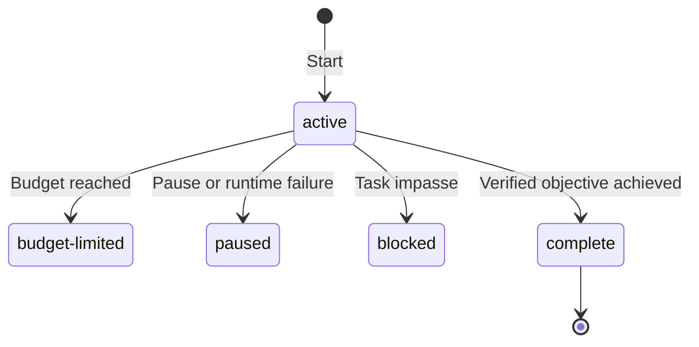

# Goals

A Goal is one durable objective attached to a session. It keeps the objective
in context across ordinary root conversation turns and continues while the
session is idle. There is no Goal phase machine: planning, implementation, and
review are ordinary model work.

Say **"Create a goal for XYZ"** in the ordinary root chat to start one. The
model uses `CreateGoal`, which preserves the full objective and returns its
active status and budget. Ordinary tasks do not implicitly authorize Goal
creation. Explicit user or trusted system/developer instructions do; no separate
Goal confirmation is added. Tool permissions still apply.

`GetGoal` inspects the current objective, status, reason, budget, known usage,
elapsed time, settled-turn count, and accepted-plan address. It also works for
inactive Goals without resuming them. An absent Goal returns `goal: null`;
null budget and remaining-token fields mean unbounded. Its usage includes
known usage of the current attributed turn, which can lag provider activity,
and does not change durable accounting.
An invalid accepted-plan address is reported as `plan_reference_error`, leaving
the Goal inspectable without changing its state.

## Durable state

The session sidecar stores a strict Goal record containing:

- a unique ID and free-form objective;
- `active`, `paused`, `blocked`, `budget-limited`, or `complete` status plus an
  optional reason;
- token, elapsed-time, and turn accounting;
- an optional token budget and accepted-plan reference; and
- creation and update timestamps.

An invalid persisted Goal record loads as no Goal. An active Goal loaded from a
saved session is demoted to `paused` with a session-resumed reason so recovery
cannot dispatch work without an explicit `/goal resume`.

The state controls whether another ordinary turn may start. Pausing ends a
running Goal turn at its next tool boundary: running tools finish and the turn
settles normally, without an abort. A turn waiting in `WaitAgent` is woken with
a steering note so it reaches that boundary; pending user steering is still
delivered first. Lowering the budget to current usage and editing the objective
end the turn the same way. Runtime failures pause execution; a task-level
impasse is a separate, model-reported blocked state.



The diagram shows how active execution stops. Resume returns paused or blocked
Goals to active; a budget-limited Goal requires raising or removing its budget.
Loading an active saved Goal pauses it. Lowering a budget to current usage can
limit any nonterminal Goal. Clearing removes the record, and a completed Goal
cannot be resumed.

## Request context and authority

Before an active root request, mevedel derives current Goal facts from the
durable record: objective, token budget, turns run, and accepted-plan
reference. Live token usage is left out because it moves with every charge and
each change would re-send the whole block; crossing reminders and `GetGoal`
report it. Changed facts are delivered as retained context updates, hidden from
ordinary chat presentation but preserved in transcript audit records. Unchanged
facts remain in selected history; loss of that context causes delivery again.
The durable record supplies current authority, not the old observations.
The Goal's session must match the
request's workspace and working directory; stale ambient sessions contribute
no Goal context. Ordinary user messages that start a turn during a Goal receive
the same context and accounting as automatic turns. Same-turn steering instead
joins the already-running Goal turn at its next model interaction boundary and
does not create or charge another turn.

`/goal edit <objective>` revises the live objective and rotates the Goal ID
while retaining status, budget, accounting, accepted-plan reference, and
creation time. The revised objective has highest authority; an accepted Plan
remains binding only where consistent with it. An already-running turn no longer
sees `UpdateGoal` and its stale calls are rejected, but that turn is still charged to the
revised Goal through a separate request-local accounting identity. Only edit
rotates that identity and queued follow-up ownership with the Goal, so editing
a paused Goal cannot release its held input. Clearing the Goal and starting an
unrelated replacement establishes no accounting lineage. Editing an active
Goal ends its running turn at the next tool boundary, so continuation starts a
turn from the revised objective; a turn waiting in `WaitAgent` is woken with
the refreshed context. The next prompt consumes one objective-updated reminder,
and an active Goal schedules continuation behind the current request gate.

When a Goal references an accepted Plan, each turn validates the reference
against the session's accepted-path metadata, immutable artifact, and stored
hash. A valid artifact receives exact read authority for that request. A
missing, moved, mutated, or mismatched artifact pauses the Goal before provider
dispatch; transcript prose is never a fallback source of Plan authority.

Child-agent, context-summary, and control requests are not Goal turns. A root turn
captures its Goal identity at request start and charges tokens, wall time, and
one turn at canonical success or failure settlement. Token accounting uses
normalized provider input plus output usage, excluding cached-input counts,
with the request estimate as fallback for gptel requests. Agents started from a Goal turn,
including nested agents and the completion verifier started by `UpdateGoal`,
are not Goal turns either, but they charge their normalized usage to the Goal
that root request is accounted to: after each tool batch and when the agent
request ends, whether it completes, fails, or is aborted. The budget therefore
bounds the whole run, not only the root conversation.

Claude subscription turns use the same accounting and continuation lifecycle.
Top-level SDK message identities distinguish model samples; streamed deltas and
consolidated snapshots update one sample rather than charging it repeatedly.
Cache creation contributes to normalized input, while cache reads remain
separate. Only reported nonnegative counters establish known usage. Final
prompt totals replace the corresponding streamed totals; absent final fields
retain known progress. The adapter's context-occupancy updates and cumulative
model quota rows are not additional charges. These metrics do not measure
subscription allowance or establish an exact monetary cost.

If any submitted native prompt in a turn or attributed child lacks complete
input and output counters at settlement, the durable Goal retains the known lower bound and marks its usage
incomplete. No estimate is manufactured from absent gptel request data.
`GetGoal` returns null `tokens_used` and `remaining_tokens`, alongside
`known_tokens_used`; the cockpit labels the count as incomplete. Unbudgeted
Goals can continue. A bounded active Goal becomes `budget-limited` at root
settlement (or when a late child settles after the root), because
its remaining allowance cannot be established. Raising its limit cannot repair
missing usage; remove the limit or start a new Goal to continue. A completed or
blocked decision still wins, and later known usage does not erase the gap.
Known usage from earlier prompts remains in the lower bound. A startup failure
before any prompt dispatch does not create a usage gap. While a prompt is still
running without complete counters, `GetGoal` also reports its total as unknown.

Automatic full-context continuation can use several native prompts within one
admitted Goal turn. Each completed prompt contributes its usage once; later
samples add to that frozen base. Delayed snapshots of completed sample
identities cannot charge again. The whole admitted turn settles once. A user
pause or cancellation at the context boundary prevents the next prompt.

Native child progress charges its owning root Goal while the child runs, and
settlement charges only the remaining delta. Each retained follow-up has its
own request accounting. Root and child budget reminders reach Claude through
the existing post-tool hook and acknowledged context delivery. Usage observed
after a tool result is checked again at that boundary, before the next sample.
The normal budget remains a continuation limit with wrap-up instructions,
not a hard server-side token ceiling.

Starting a Goal through `CreateGoal` or the user command also attributes an
already-running root turn, including its known token usage; elapsed time starts
at Goal activation. The next provider
interaction receives Goal facts and policy through the ordinary retained-context
delivery. The model may complete the Goal in that same turn. Replacing a Goal
completed earlier in the same turn settles the old Goal first and charges only
subsequent token usage to the new one. Repeated settlement cannot charge twice.

Compaction does not reconstruct the durable Goal from a summary. Retained
observations can leave selected history; the context-delivery layer supplies
current facts and policy again when needed. Ordinary steering remains ordinary
conversation history: unresolved requests may survive as actionable summary
steps, while satisfied requests retire to outcome or evidence under completed
work. Current facts derived from the durable Goal supersede historical Goal
observations.

## Token budget

The optional token budget is the user-selected runaway bound. Request context
and the cockpit display bounded usage as used/limit and otherwise say
`unbounded`. Every charge, from a settling root turn or an agent, emits
one-shot crossing reminders: at 50% the model should prioritize the remaining
requirements, at 80% it should reassess the remaining work and avoid low-value
detours, and at 100% it should stop new substantive work and wrap up. These
need no durable reminder ledger because each charge compares usage immediately
before and after the monotonic charge, so every threshold is crossed exactly
once. A crossing reaches a root turn that is still running at its next
provider request, otherwise the next root request. Agents running for the
Goal are told the highest threshold reached so far at their next provider
request, counting the root turn's known in-flight usage; at 100% they are
asked to stop new work and return their findings.
Only an active Goal queues budget instructions; a turn that ends paused,
blocked, or complete queues none for later work. Goal context still reports
the budget, and `GetGoal` reports current usage.

`CreateGoal` accepts an optional positive `token_budget`, supplied only when
explicitly requested. Omission uses `mevedel-goal-token-budget`; the tool cannot
invent a limit or change the configured default.

Crossing the limit never aborts an in-flight request or tool. At each root
tool-result boundary, durable usage plus the turn's known provider usage is
checked as well, so a long turn hears about each 50%, 80%, or 100% crossing
through a hidden turn event delivered at the same WAIT as the tool result. The
100% reminder asks the model to stop new substantive work and wrap up the
current response. It does not create a budget-exempt wrap-up turn. At
settlement, an otherwise-active Goal at or above the limit becomes
`budget-limited`; a `complete` or `blocked` decision from that turn wins.

`/goal budget <N|none>` replaces or removes the durable limit and queues one
reminder with the old limit, new limit, usage, remaining tokens, and resulting
status. Lowering the limit to current usage immediately limits a nonterminal
Goal and ends its running turn at the next tool boundary. Raising it above usage or removing it from a budget-limited Goal
reactivates the Goal and schedules continuation behind the ordinary request
gate.

## Continuation

Starting or resuming a Goal schedules the ordinary continuation text:

```text
Continue working toward the active Goal.
```

Successful and retryable failed root turns schedule the same continuation only
after canonical request teardown. Dispatch requires all of the following:

- the Goal is active;
- no root request is running;
- no permission, Ask, Plan approval, or other interaction is pending in the
  root view, and no prompt hook is running;
- no queued follow-up remains to be delivered; and
- the token budget is not exhausted.

Continuation is also offered again when a gate clears without a settling
turn. Closing the last pending interaction in the root view, such as a child
agent's permission card or Ask, or a Plan approval decided while the root
session is idle, re-offers it, so the Goal resumes as soon as the user settles
what held it. Queued follow-ups go first there too. While a queued follow-up
waits for the user's composer draft, the Goal waits with it; sending or
clearing the draft delivers the follow-up, whose settlement continues the Goal.

Same-turn steering stays with its owning active request. After that request
settles, queued follow-ups run before generic Goal continuation, one normal
turn per entry. Follow-ups owned by a paused, blocked, or budget-limited Goal
remain held until the Goal resumes. Once a Goal is complete, the next queued
follow-up is an ordinary non-Goal message. There is no maximum-turn or no-tool
heuristic.

Transient transport failures are retried up to five consecutive times, after
15, 30, 60, 120, and 240 seconds, so a short network outage does not pause the
Goal. They include timeouts, connection and network errors, HTTP 502-504, and
curl's name-resolution, connect, transfer, TLS, empty-reply, send, and receive
exit codes. A successful turn resets the count. Terminal provider, transport,
compaction, and other runtime failures pause the Goal with a concrete reason.
This includes a failure to start the scheduled continuation. A new Goal or an
explicit resume resets the transient-retry allowance. An exhausted paused or
blocked Goal requires a budget increase or removal before it can resume.
A completion or blockage already recorded by `UpdateGoal` is terminal and is
not overwritten by later request failure handling. User interruption also
pauses the Goal.
Any successfully settled root turn that leaves an active Goal idle schedules
its continuation. A failed or interrupted turn not attributed to the Goal
schedules none, so stopping unrelated work never starts Goal work.

## Goal tools

`CreateGoal`, `GetGoal`, and `UpdateGoal` use the ordinary tool pipeline and
are discoverable through `ToolSearch` and `ToolCall` in both the discuss and
implement presets. Goal turns keep the session's tools, so a Goal started in
read-only discussion can only investigate. They are session control
tools; creating a Goal never raises execution permissions. Native schemas and
the callable catalog use the same visibility checks, and handlers recheck the
owning root request before acting. Child-agent, context-summary, ephemeral,
and cancelled requests cannot call them.

Creation is unavailable in Plan mode, directive requests, while an unfinished
Goal exists, or while accepted Plan implementation is reserved. An inactive
Goal remains inspectable in the root conversation. A failed creation save
restores the previous in-memory Goal and schedules no continuation.

`UpdateGoal` is a permission-free control tool visible only to a root request
attributed to the active Goal. It accepts exactly:

- `complete`; or
- `blocked` with a nonblank summary, stored as the Goal reason.

`blocked` takes effect at once. `complete` is a completion claim: the tool
runs the `verifier` agent in a separate request, using the `goal-review`
workload's model and effort, while the Goal stays active. The verifier receives
the exact objective and, when the Goal has one, the accepted plan verbatim, but
no account of the implementer's work or test results; it discovers the
changes and current state itself. Only a final `VERDICT: PASS` completes the
Goal, and only if it is still the same active Goal. FAIL, PARTIAL, a report
without exactly one final verdict line, or a verifier failure returns the
report as the tool result, leaves the Goal active, and ends the root turn at
that tool boundary. The rejected attempt therefore settles as its own Goal turn:
it is counted, captured by the journal, and checkpointed, queued follow-ups get
their turn, and ordinary continuation starts the next attempt with the report
in its history. The "same condition across three consecutive Goal turns" rule
for `blocked` thus counts completion attempts. An unreadable accepted
plan refuses verification. A user abort interrupts the verifier and pauses the
Goal as for any Goal turn. Canonical turn settlement still persists the final
accounting.

The `goal-review` workload defaults to the `strong` tier. It selects only the
completion check's model and reasoning effort; `/verify` and ordinary verifier
agents continue to use `verifier`. Empty tier fields inherit session policy.
For example, `:model-workloads ((goal-review :tier strong))` configures completion
checks independently of `plan-implementation` and `verifier`. Invalid review
policy leaves the Goal active and reports an error rather than falling back.

The installed `prompts/goals/active-context.md` formats current objective,
accepted-plan reference, budget, and turns run. `prompts/goals/policy.md` separately
supplies the completion contract. It requires evidence for the full requested outcome; passing a
narrower set of checks does not establish completion. A model-reported block
requires the same impasse across at least three consecutive Goal turns with
no meaningful independent progress possible. These are judgment obligations.
The independent verifier checks a completion claim against workspace evidence,
but neither it nor the tool mechanically proves completion or classifies blockers.

## Commands and UI

- `/goal <objective>` starts a Goal and schedules its first turn.
- Bare `/goal` opens the Goal cockpit.
- `/goal pause` stops continuation and ends the running Goal turn at its next
  tool boundary without aborting it.
- `/goal budget <N|none>` replaces or removes the token limit.
- `/goal edit <objective>` replaces the objective without resetting the run.
- `/goal resume [steering]` resumes, queueing steering before continuation.
- `/goal clear` removes Goal state while preserving transcript and artifacts.

A new Goal cannot replace an unfinished Goal or start while accepted Plan
implementation is preparing or retryable. Ordinary Goal startup and Plan mode
are mutually exclusive; accepted-plan Goal execution uses its dedicated handoff.

An accepted Plan may select Goal execution after Here/Current, Here/Fresh,
Here/Summary, Worktree/Fresh, or Worktree/Summary preparation. The prepared
target owns the resulting Goal and immutable accepted artifact. Construction
uses a deterministic objective that preserves the plan's outcomes, constraints,
acceptance criteria, and validation evidence as the completion contract without
parsing Markdown headings. The first ordinary Goal turn receives the prepared
context, resolved artifact path, full plan, and kickoff; later turns use the
small request-local Goal context and may reread the validated artifact.

The Plan-selected permission mode and Goal budget apply to the target session.
For Worktree execution, the source session's permission mode and Goal state
remain unchanged; Here execution uses the current session. Derived
artifact authority exists only while the target Goal is unfinished and never
alters user grants.

Plan approval reserves the Goal identity before asynchronous preparation. The
source retry record blocks a competing Here Goal; a prepared Worktree target
holds the same kickoff reservation locally. Recovery reuses completed summary,
segment, Worktree, settings, mode, artifact, and Goal construction steps. A
durable Goal is recognized only by the reserved ID together with its accepted
plan reference, so an unrelated unfinished target Goal is never overwritten.
A matching Goal restored as paused after a crash is reactivated without
scheduling; the still-owned Plan handoff supplies its one explicit kickoff.

After durable construction, Plan recovery is cleared before the explicit
kickoff. If startup then fails, the Goal is paused with the concrete error and
`/goal resume` uses the normal continuation path. User input owned by that Goal
remains queued while paused; on resume it runs before a generic continuation.
During a Here handoff the same ordering keeps the prepared kickoff first and
post-acceptance input second. Worktree source input never transfers to or
steers the target Goal.

The cockpit and status surface show only objective, status/reason, accounting,
elapsed time, and accepted-plan reference. The cockpit header carries the
objective, status, turn count, and token accounting; `i` opens the Goal record
panel with the blocked reason, elapsed time, and accepted-plan reference. Their
redraws preserve the active composer draft.

## Context delivery

Active root Goal facts (objective, accepted-plan reference, counters and budget)
are retained current-context updates. Changed counters do not rewrite the system
prefix. Goal execution policy is delivered separately on activation/context loss,
so counter updates do not repeat its full instructions. New state supersedes
older observations; leaving the active state delivers an explicit inactive
observation. Retained workers do not inherit the root Goal.
