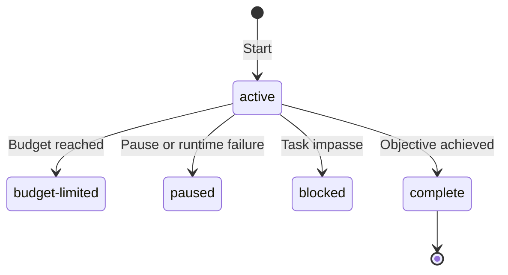

# Goals

A Goal is one durable objective attached to a session. It keeps the objective
in context across ordinary root conversation turns and continues while the
session is idle. There is no Goal phase machine: planning, implementation, and
review are ordinary model work.

## Durable state

The session sidecar stores a strict Goal record containing:

- a unique ID and free-form objective;
- `active`, `paused`, `blocked`, `budget-limited`, or `complete` status plus an
  optional reason;
- token, elapsed-time, and turn accounting;
- an optional token budget and accepted-plan reference; and
- creation and update timestamps.

An invalid persisted Goal record loads as no Goal. An active Goal loaded from a
saved session is demoted to `paused` with a session-resumed reason so recovery
cannot dispatch work without an explicit `/goal resume`.

The state controls whether another ordinary turn may start. Pausing does not
abort a turn already running. Runtime failures pause execution; a task-level
impasse is a separate, model-reported blocked state.



The diagram shows how active execution stops. Resume returns paused or blocked
Goals to active; a budget-limited Goal requires raising or removing its budget.
Loading an active saved Goal pauses it. Lowering a budget to current usage can
limit any nonterminal Goal. Clearing removes the record, and a completed Goal
cannot be resumed.

## Request context and authority

Before an active root request, mevedel derives current Goal facts from the
durable record: objective, accounting, remaining budget, and accepted-plan
reference. Changed facts are delivered as retained context updates, hidden from
ordinary chat presentation but preserved in transcript audit records. Unchanged
facts remain in selected history; loss of that context causes delivery again.
The durable record supplies current authority, not the old observations.
The Goal's session must match the
request's workspace and working directory; stale ambient sessions contribute
no Goal context. Ordinary user messages that start a turn during a Goal receive
the same context and accounting as automatic turns. Same-turn steering instead
joins the already-running Goal turn at its next model interaction boundary and
does not create or charge another turn.

`/goal edit <objective>` revises the live objective and rotates the Goal ID
while retaining status, budget, accounting, accepted-plan reference, and
creation time. The revised objective has highest authority; an accepted Plan
remains binding only where consistent with it. Stale `UpdateGoal` calls from an
already-running turn are rejected, but that turn is still charged to the
revised Goal through a separate request-local accounting identity. Only edit
rotates that identity with the Goal; clearing the Goal and starting an
unrelated replacement establishes no accounting lineage. At a supported
in-flight steering boundary, mevedel also sends the refreshed Goal context on
a best-effort basis. The next prompt consumes one objective-updated reminder,
and an active Goal schedules continuation behind the current request gate.

When a Goal references an accepted Plan, each turn validates the reference
against the session's accepted-path metadata, immutable artifact, and stored
hash. A valid artifact receives exact read authority for that request. A
missing, moved, mutated, or mismatched artifact pauses the Goal before provider
dispatch; transcript prose is never a fallback source of Plan authority.

Child-agent, context-summary, and control requests are not Goal turns. A root turn
captures its Goal identity at request start and charges tokens, wall time, and
one turn at canonical success or failure settlement. Token accounting uses
normalized provider input plus output usage, excluding cached-input counts,
with the request estimate as fallback.

Compaction does not reconstruct the durable Goal from a summary. Retained
observations can leave selected history; the context-delivery layer supplies
current facts and policy again when needed. Ordinary steering remains ordinary
conversation history: unresolved requests may survive as actionable summary
steps, while satisfied requests retire to outcome or evidence under completed
work. Current facts derived from the durable Goal supersede historical Goal
observations.

## Token budget

The optional token budget is the user-selected runaway bound. Request context
and the cockpit display bounded usage as used/limit and otherwise say
`unbounded`. Charging a turn emits one-shot crossing reminders: at 50% the
model should prioritize the remaining requirements, at 80% it should reassess
the remaining work and avoid low-value detours, and at 100% it should stop new
substantive work and wrap up. These need no durable reminder ledger because
settlement compares usage immediately before and after the monotonic charge.

Crossing the limit never aborts an in-flight request or tool. When provider
usage is already known at a tool-result boundary, the first 100% crossing
queues one hidden reminder turn event, delivered at the same WAIT as the tool
result, asking the model to stop new substantive work and wrap up the current
response. It does not create a budget-exempt wrap-up turn. At
settlement, an otherwise-active Goal at or above the limit becomes
`budget-limited`; a `complete` or `blocked` decision from that turn wins.

`/goal budget <N|none>` replaces or removes the durable limit and queues one
reminder with the old limit, new limit, usage, remaining tokens, and resulting
status. Lowering the limit to current usage immediately limits a nonterminal
Goal. Raising it above usage or removing it from a budget-limited Goal
reactivates the Goal and schedules continuation behind the ordinary request
gate.

## Continuation

Starting or resuming a Goal schedules the ordinary continuation text:

```text
Continue working toward the active Goal.
```

Successful and retryable failed root turns schedule the same continuation only
after canonical request teardown. Dispatch requires all of the following:

- the Goal is active;
- no root request is running;
- no permission or Plan interaction is pending;
- no queued follow-up remains to be delivered; and
- the token budget is not exhausted.

Same-turn steering stays with its owning active request. After that request
settles, queued follow-ups run before generic Goal continuation, one normal
turn per entry. Follow-ups owned by a paused, blocked, or budget-limited Goal
remain held until the Goal resumes. Once a Goal is complete, the next queued
follow-up is an ordinary non-Goal message. There is no maximum-turn or no-tool
heuristic.

A transient transport failure is retried once. Terminal provider, transport,
compaction, and other runtime failures pause the Goal with a concrete reason.
A completion or blockage already recorded by `UpdateGoal` is terminal and is
not overwritten by later request failure handling. User interruption also
pauses the Goal.

## Completion tool

`UpdateGoal` is a permission-free control tool visible only to an active root
Goal. It accepts exactly:

- `complete`; or
- `blocked` with a nonblank summary, stored as the Goal reason.

The tool reports only the status transition. Canonical turn settlement still
persists the final accounting.

The installed `prompts/goals/active-context.md` formats current objective,
accepted-plan reference, and accounting. `prompts/goals/policy.md` separately
supplies the completion contract. It requires evidence for the full requested outcome; passing a
narrower set of checks does not establish completion. A model-reported block
requires the same impasse across at least three consecutive Goal turns with
no meaningful independent progress possible. These are judgment obligations,
not claims that the tool mechanically verifies completion or classifies blockers.

## Commands and UI

- `/goal <objective>` starts a Goal and schedules its first turn.
- Bare `/goal` opens the Goal cockpit.
- `/goal pause` stops continuation without aborting the current request.
- `/goal budget <N|none>` replaces or removes the token limit.
- `/goal edit <objective>` replaces the objective without resetting the run.
- `/goal resume [steering]` resumes, queueing steering before continuation.
- `/goal clear` removes Goal state while preserving transcript and artifacts.

A new Goal cannot replace an unfinished Goal or start while accepted Plan
implementation is preparing or retryable. Plan mode cannot start while the
session owns an unfinished Goal.

An accepted Plan may select Goal execution after Here/Current, Here/Fresh,
Here/Summary, Worktree/Fresh, or Worktree/Summary preparation. The prepared
target owns the resulting Goal and immutable accepted artifact. Construction
uses a deterministic objective that preserves the plan's outcomes, constraints,
acceptance criteria, and validation evidence as the completion contract without
parsing Markdown headings. The first ordinary Goal turn receives the prepared
context, resolved artifact path, full plan, and kickoff; later turns use the
small request-local Goal context and may reread the validated artifact.

The Plan-selected permission mode and Goal budget apply to the target session.
For Worktree execution, the source session's permission mode and Goal state
remain unchanged; Here execution uses the current session. Derived
artifact authority exists only while the target Goal is unfinished and never
alters user grants.

Plan approval reserves the Goal identity before asynchronous preparation. The
source retry record blocks a competing Here Goal; a prepared Worktree target
holds the same kickoff reservation locally. Recovery reuses completed summary,
segment, Worktree, settings, mode, artifact, and Goal construction steps. A
durable Goal is recognized only by the reserved ID together with its accepted
plan reference, so an unrelated unfinished target Goal is never overwritten.
A matching Goal restored as paused after a crash is reactivated without
scheduling; the still-owned Plan handoff supplies its one explicit kickoff.

After durable construction, Plan recovery is cleared before the explicit
kickoff. If startup then fails, the Goal is paused with the concrete error and
`/goal resume` uses the normal continuation path. User input owned by that Goal
remains queued while paused; on resume it runs before a generic continuation.
During a Here handoff the same ordering keeps the prepared kickoff first and
post-acceptance input second. Worktree source input never transfers to or
steers the target Goal.

The cockpit and status surface show only objective, status/reason, accounting,
elapsed time, and accepted-plan reference. The cockpit header carries the
objective, status, turn count, and token accounting; `i` opens the Goal record
panel with the blocked reason, elapsed time, and accepted-plan reference. Their
redraws preserve the active composer draft.

## Context delivery

Active root Goal facts (objective, accepted-plan reference, counters and budget)
are retained current-context updates. Changed counters do not rewrite the system
prefix. Goal execution policy is delivered separately on activation/context loss,
so counter updates do not repeat its full instructions. New state supersedes
older observations; leaving the active state delivers an explicit inactive
observation. Retained workers do not inherit the root Goal.
