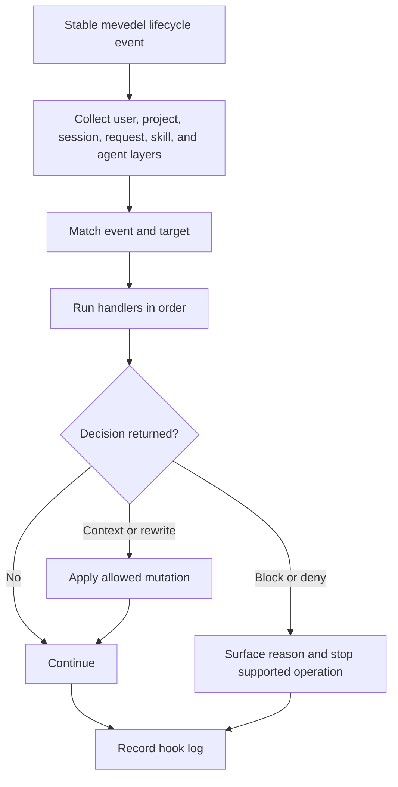

# Hooks

Hooks are the execution subsystem for project-scoped automation around mevedel
requests and tool calls.  This page records the prior-art research and the
implemented contract.

The target is deliberately narrower than Claude Code's full lifecycle but
broader than gptel's public hook variables: project hooks should be useful for
guardrails, formatting, linting, context injection, and local workflow glue
without exposing gptel's unstable FSM as public API.

## Hook execution flow



## Prior art

Claude Code has the broadest lifecycle: session, prompt, tool,
permission, sub-agent, compaction, config, cwd/file, worktree, and MCP
elicitation events.  Hooks are configured as event -> matcher group ->
handler, receive JSON on stdin for command hooks, and can return
structured decisions.  It supports command, HTTP, MCP, prompt, and agent
handlers.  Blocking semantics vary by event: `PreToolUse` can deny before
execution, `PostToolUse` can only change feedback/context, and `Stop`
blocking means "continue".

Codex uses a similar shape but currently exposes a smaller practical set:
`SessionStart`, `UserPromptSubmit`, `PreToolUse`, `PermissionRequest`,
`PostToolUse`, `Stop`, plus compaction events in the local code.  Hooks
are mostly command handlers, run with session `cwd`, receive JSON on
stdin, and use JSON stdout or exit code 2 for policy decisions.  Project
hooks load only from trusted project config.  Mevedel keeps the same
general shape while adding Emacs-native handler support and explicit
skill/agent scoping.

opencode is plugin-centered rather than declarative hook-centered.  Trusted
JS/TS plugins expose named blocking hooks such as `tool.execute.before`,
`tool.execute.after`, `chat.message`, `shell.env`, and compaction
transforms.  Blocking hooks run sequentially and mutate an output object;
generic `event` hooks are fire-and-forget.  The model is powerful but
assumes trusted in-process code.

gptel already exposes useful Emacs hooks:

- `gptel-prompt-transform-functions`: async-capable prompt transforms,
  currently called with a request FSM despite docs saying an info plist.
- `gptel-pre-tool-call-functions`: abnormal hook that can stop, block,
  force/skip confirmation, rewrite args/name, or provide a result.
- `gptel-post-tool-call-functions`: abnormal hook that can stop, block, or
  rewrite the result.
- `gptel-post-request-hook`, `gptel-post-stream-hook`,
  `gptel-post-response-functions`, `gptel-save-state-hook`, and
  `gptel-refresh-buffer-hook` for request/UI notifications.

gptel-agent does not expose public hook variables.  Its useful extension
points are the custom request handler table, sub-agent request callback,
overlay/status updates, and compaction `post-func`, all of which should be
wrapped by stable mevedel events rather than exposed directly.

## Design goals

- Use normal Emacs hooks for notification-only lifecycle events and
  abnormal `*-functions` hooks for events with arguments or control return
  values.
- Keep public hook inputs as stable mevedel plists, not raw gptel FSM or
  backend internals.
- Support declarative project/user hooks for shell commands and native
  Elisp hook handlers.
- Route hooks through mevedel's centralized pipeline and permission system,
  not around it.
- Make blocking semantics explicit per event; never imply post hooks can
  undo side effects.
- Run mutating/decision hooks serially in deterministic order.
- Treat hook commands as trusted project/user code and require an explicit
  trust story before project-local shell hooks execute.
- Record enough hook status/debug output that misconfiguration is visible.
- Provide a hook audit surface for every hook decision that changes
  model-visible context, control flow, permissions, or submitted content.
  Diagnostic stdout/stderr and hook runner logs may stay in hook logs or
  `*Messages*`.

## Event set

The implementation focuses on events that map cleanly to existing mevedel
boundaries:

| Event | Fires | Matcher | Control |
| --- | --- | --- | --- |
| `SessionStart` | root context epoch begins | source (`startup`, `resume`, `clear`, `compact`) | add context only |
| `UserPromptSubmit` | before a root or retained-agent task input is sent | none | block, add context |
| `UserPromptExpansion` | before a user `$skill` expansion reaches the model | none | block, add context, rewrite prompt |
| `PreToolUse` | after validation, before permission | tool name | deny, ask, add context, rewrite args |
| `PermissionRequest` | before a generic permission prompt is shown | tool name | allow, deny, ask |
| `PermissionDenied` | after a tool is denied | tool name | add feedback/context only |
| `PostToolUse` | after handler and result shaping | tool name | add context, replace result, mark feedback |
| `PostToolUseFailure` | after a tool result beginning with `Error:` | tool name | add context, replace result |
| `PreCompact` | before manual/automatic compaction | trigger (`manual`, `auto`) | block, add context |
| `PostCompact` | after compaction completes | trigger | notification/logging |
| `SubagentStart` | once before a retained-agent identity is published | agent role | block, add context |
| `SubagentStop` | after each retained-agent turn reaches terminal status | agent role | notification/logging |
| `Stop` | after a successful top-level assistant turn | none | notification/logging |
| `StopFailure` | after an errored or aborted top-level assistant turn | none | notification/logging |
| `SessionEnd` | buffer kill/session teardown | reason | notification only |

Later events can add `ConfigChange`, `CwdChanged`, `FileChanged`,
`PostToolBatch`, task lifecycle, and shell-env injection once the core
runner is stable.

## Config shape

Persistent hook config should support both Lisp data and JSON.  Lisp is
idiomatic for Emacs users and can name Elisp functions naturally; JSON is
natural for shell-heavy hook configs and easier to share with other agent
tools.  When both files are present in the same layer, load and merge both
additively in documented order.

Lisp shape:

```elisp
((PreToolUse
  ((:matcher "Bash"
    :hooks ((:type command
             :command ".mevedel/hooks/block-rm.sh"
             :timeout 10
             :description "Block destructive rm")
            (:type elisp
             :function my-mevedel-bash-policy)))))
 (PostToolUse
  ((:matcher "Edit|Write"
    :hooks ((:type command
             :command ".mevedel/hooks/format-changed-file"
             :timeout 30))))))
```

Recommended locations:

- `mevedel-hook-rules`: user defcustom, Emacs-local.
- `~/.agents/hooks.el`, `~/.agents/hooks.json`,
  `~/.mevedel/hooks.el`, and `~/.mevedel/hooks.json`: user files,
  shareable across projects on one machine.
- Activated plugin manifests may contribute hooks only after mevedel has
  shown a concise consent summary for the plugin's executable hooks.
  Mevedel reads the Codex default `./hooks/hooks.json` when the manifest
  omits `hooks`, or the manifest `hooks` field when present. That field
  must be a single path.
- `<workspace>/.agents/hooks.el`, `<workspace>/.agents/hooks.json`,
  `<workspace>/.mevedel/hooks.el`, and
  `<workspace>/.mevedel/hooks.json`: project hooks, trusted per
  workspace.
- Skill frontmatter `hooks`: scoped to a command invocation. Instruction
  preparation ignores this field. In fork commands, a local `Stop`
  declaration is normalized to `SubagentStop`.
- Agent definition `:hooks`: scoped to invocations of that registered
  agent.  A local `Stop` declaration is normalized to `SubagentStop`.
- Session/request/invocation hook lists: transient programmatic layers.

Hook handlers run from lower-precedence roots to higher-precedence roots
so later rewrite fields preserve the package-wide resource precedence.
Layers merge additively in this order: `mevedel-hook-rules`, user
`.agents/hooks.el`, user `.agents/hooks.json`, user
`.mevedel/hooks.el`, user `.mevedel/hooks.json`, enabled plugin hooks,
trusted project `.agents/hooks.el`, trusted project `.agents/hooks.json`,
trusted project `.mevedel/hooks.el`, trusted project
`.mevedel/hooks.json`, session, request, and agent invocation. Command-skill
hooks are folded into the owned request or agent invocation. Deny decisions
remain restrictive across all layers;
allow decisions do not override existing explicit permission denies.

Within a file layer, `.el` runs before `.json` when both exist.  Ordering only
matters for hooks that rewrite tool input or results, so this order is kept
deterministic.

JSON shape:

```json
{
  "hooks": {
    "PreToolUse": [
      {
        "matcher": "Bash",
        "hooks": [
          {
            "type": "command",
            "command": ".mevedel/hooks/block-rm.sh",
            "timeout": 10,
            "failClosed": true
          }
        ]
      }
    ]
  }
}
```

## Matching

`matcher` is event-specific.  For tool events it matches the mevedel tool
name (`Bash`, `Read`, `Edit`, `Write`, `Agent`, MCP names when wrapped).
For agent events it matches agent role.  For compaction it matches
`manual` or `auto`.

Matcher rules:

- nil, empty string, or `"*"` matches all.
- strings containing only letters, digits, `_`, `-`, and `|` are exact
  names or pipe-separated exact alternatives.
- any other string is an Emacs regexp matched case-sensitively.

Handler-level `:if` can be added later using the existing permission rule
parser style, e.g. `"Bash(git *)"` or `"Edit(src/*.el)"`.  It is not
part of the current implementation.

## Handler types

`command` runs a shell command with JSON input on stdin and captures
stdout/stderr.  User/global command hooks run in the session working
directory, falling back to the workspace root when no session cwd is
available.  Project hook commands from `<workspace>/.mevedel/hooks.*`
run from the workspace root so relative commands such as
`.mevedel/hooks/block-rm.sh` resolve consistently regardless of the
session cwd.  Default timeout is 30 seconds with a global cap. Each
stdout/stderr stream is capped by `mevedel-hooks-command-output-max-chars`
before parsing decisions or writing log previews, so noisy hooks cannot
inject unbounded output through `updated_result` or block reasons.

Plugin command hooks run from the same event cwd as user/global hooks but
receive compatibility environment variables:

- `PLUGIN_ROOT`, `CLAUDE_PLUGIN_ROOT`, and `MEVEDEL_PLUGIN_ROOT` point at
  the plugin root.
- `PLUGIN_DATA`, `CLAUDE_PLUGIN_DATA`, and `MEVEDEL_PLUGIN_DATA` point at
  `<workspace>/.mevedel/plugin-data/<plugin-name>` and are created before
  the command starts.

Superpowers is treated specially when its hooks are enabled: mevedel
installs a native `SessionStart` Elisp hook that loads the bundled
`using-superpowers` skill plus a mevedel tool mapping, and skips the
plugin's manifest hooks. Non-Superpowers plugin hooks keep their manifest
behavior.

Codex plugin `apps` and `mcpServers` manifest fields are not loaded by
the hook subsystem. They remain unsupported plugin components until
mevedel has native app or plugin-scoped MCP loading.

`elisp` calls a function with one event plist argument.  Functions may
return nil or a decision plist.  Elisp hooks are trusted in-process code
and should usually be configured by the user, packages, or skills rather
than accepted blindly from untrusted project files.

Native abnormal `*-functions` hooks and declarative `elisp` handlers enter
one ordered handler engine. Native functions are represented as Elisp handler
records ahead of the declarative layers while retaining Emacs buffer-local,
global-inheritance, and hook-depth ordering. The shared engine owns decision
normalization, one log record per handler, serial payload mutation, decision
merging, error policy, and event-specific terminal short-circuiting. Normal
zero-argument `mevedel-session-start-hook` and `mevedel-session-end-hook`
remain notification hooks outside this decision engine.

HTTP, prompt, MCP-tool, and agent hook handlers are deferred.  They are
useful later, but each one adds a separate permission/cancellation story.

## Input and output

Every event plist should include:

- `:hook-event-name`
- `:session-id`
- `:transcript-path`
- `:cwd`
- `:workspace-root`
- `:model`
- `:turn-id`
- `:origin` (`/root` or a canonical retained agent path)

Tool events add:

- `:tool-name`
- `:tool-use-id`
- `:tool-input`
- `:raw-result` for post events, before persistence/truncation and
  render-data shaping
- `:result` / `:tool-response` for post events, matching the
  model-visible result after persistence/truncation and render-data
  shaping.  Both names are provided; `:tool-response` is the documented
  hook payload field, while `:result` is kept as an Elisp convenience.
- `:error` for failure events

Prompt events add:

- `:prompt`: the user prompt about to be sent
- `:display-text`: optional view-facing text used when the actual prompt is
  generated from another source, such as an inline skill invocation
- `:skill-name` and `:arguments` for `UserPromptExpansion` when the prompt
  came from a `$skill` invocation

Compaction events add:

- `:trigger`: `"manual"` or `"auto"`
- `:tokens-before`
- `:aggressive`
- `:instructions` for `PreCompact`
- `:summary` and `:tokens-after` for `PostCompact`

Sub-agent events add:

- `:agent-path`
- `:role`
- `:description`
- `:transcript-relative-path`
- `:prompt` for `SubagentStart`
- `:status` and `:terminal-reason` for `SubagentStop`

Top-level terminal events add:

- `:status`, currently `completed`, `error`, or `aborted`
- `:terminal-reason` for `StopFailure`

Command handlers receive the same data encoded as JSON with snake_case
keys.  Elisp handlers receive the plist directly, with `:hook-handler`
holding the normalized handler metadata for declarative handlers.

Decision plist fields:

- `:continue nil`: stop processing where supported.
- `:stop-reason`: user-facing reason.
- `:system-message`: user-visible warning/status.
- `:additional-context`: developer/model context to inject into the next
  request or current tool feedback, depending on event.
- `:permission-decision`: `allow`, `deny`, or `ask` for pre-tool and
  permission events.
- `:permission-reason`: model-facing reason for deny/ask feedback.
- `:updated-input`: replacement prompt text for `UserPromptSubmit` and
  `UserPromptExpansion`, or replacement tool args for `PreToolUse`.
  Prompt rewrites create a hook audit surface attached to the submitted
  user turn.  The audit surface records the hook event, optional
  system-message/reason detail, and original versus submitted text;
  it does not need inline diff review UI.  Tool argument rewrites create
  a hook audit surface attached to the affected tool attempt, recording
  original and updated args.
- `:updated-result`: replacement result for post-tool events.
- `:suppress-output`: reserved; should be rejected until implemented.

Command exit code handling:

- exit 0 with empty stdout: success, no decision.
- exit 0 with JSON stdout: parse as decision.
- exit 2: deny/block/continue according to event, using stderr as reason.
- other non-zero: hook failure.  Log it and fail open unless the event is
  explicitly configured as fail-closed.

Handlers may set `:fail-closed t`.  For those handlers, timeout,
unparseable required output, or non-zero failure blocks the triggering
operation with a hook-failure reason.  The default remains fail-open so a
broken formatter or notification script does not strand normal work.

## Pipeline integration

The tool pipeline shape is:

```
validate
-> PreToolUse hooks
-> permission
-> snapshot
-> handler
-> persist
-> attach-render-data
-> PostToolUse / PostToolUseFailure hooks
```

Running `PreToolUse` after validation means hooks see normalized args and
do not need to duplicate schema checks.  Running it before permission lets
project policy deny early and lets `PermissionRequest` hooks participate
in the existing generic prompt path.  Bash and Eval currently use
specialized permission queue entries from their tool permission slots, so
they can be guarded with `PreToolUse` but do not fire `PermissionRequest`.

`PostToolUse` runs after persistence/render-data shaping and receives
`:raw-result`, `:tool-response`, and `:result`.  `:tool-response` /
`:result` are the exact model-visible result; `:raw-result` is available
for audit, formatting, redaction, or repair hooks that need the handler's
original output.  Post-tool hooks cannot block already-completed tool side
effects; they may replace feedback with `:updated-result` or add context.
`PostToolUse` and `PostToolUseFailure :additional-context` attach their
hook audit surface to the affected tool transcript result because that is
the feedback they modify.  The hidden audit block is stripped at
`gptel--parse-tool-results` before any model-bound tool result is built.

Hook steps must read session/workspace/default-directory from the pipeline
context, matching the existing rule for all post-handler steps.

## Lifecycle integration

`UserPromptSubmit` runs in the data buffer context after any deterministic
skill plan has fully prepared its bodies, placeholders, and hidden instruction
context, but before the view renders or forwards the prompt to `gptel-send`.
Queueing runs no prompt hook; a queued entry fires this event once when it
becomes its own turn. A blocking decision stops the send without
inserting a user turn. Its additional context remains pending on the root
session and is consumed once by the next accepted root input. For ordinary
prompts, `:updated-input` replaces the
prompt text.  For a deterministic skill plan, the replacement is accepted
only when it retains the complete prepared prompt unchanged as a substring;
otherwise the rewrite and its audit record are ignored.  This lets a hook add
prefix or suffix policy without deleting a prepared body, reminder, or
placeholder.  Only an explicit blocking decision cancels the whole plan.
`:additional-context` is appended to the model-visible prompt inside a
`<hook-context>` block while staying out of the view-facing user message
body.  The view shows a generic collapsed `◇ hook context added`
disclosure that can be expanded to see the contributing event names and
injected text.  Multiple hook context contributions consumed by the same
prompt share one combined disclosure, preserving contribution order in the
expanded details.
Hook audit records for persisted `<hook-context>` blocks contain ordered `<hook-event
name="...">` entries so resume, rewind, and full rerender can recover
which hook events contributed context:

```xml
<hook-context>
<hook-event name="SessionStart">
PONYTAIL MODE ACTIVE - level: full
</hook-event>
<hook-event name="UserPromptSubmit">
Project-specific prompt policy.
</hook-event>
</hook-context>
```

No backwards-compatible plain-body format is required for new persisted
hook context.
Retained-agent initial tasks and idle-agent follow-ups also fire this event
once before their model request. Mailbox delivery, compaction, guardians,
response items, and automatic continuations do not. If an agent task is
blocked, its additional context remains pending on that retained identity and
is consumed once by its next accepted task; it cannot enter the root or a
sibling conversation. Internal root flows that construct their own requests,
such as directive processing and plan execution, do not currently fire this
event.

`SessionStart :additional-context` is pending context for the next request,
not an immediate transcript event. Its hook audit surface is attached to the
first user turn that consumes it, so the visible record appears where the
context affects model input. A fresh buffer uses source `startup`; restoring a
saved session uses `resume`; successful `/clear` uses `clear`; and successful
root compaction uses `compact`. Restoring an already-live buffer does not
reinitialize it. Clear and compaction begin context epochs inside the same
live session epoch and therefore do not emit `SessionEnd`.

Context-changing audit surfaces represent an event once and list its
contributing handlers in execution order.  Each handler retains its own
source, identity, reason, and context bodies where that audit surface exposes
them.  Parent sub-agent rows omit the injected bodies.

`UserPromptExpansion` runs after each unique user-invoked skill body is
prepared. Commands run first from left to right, followed by deduplicated
instructions in first-occurrence order. `:updated-input` replaces that skill's
prepared contribution; `:additional-context` is appended inside a
`<hook-context>` block. A blocking decision stops the complete plan before any
request or child dispatch. After all expansions settle, `UserPromptSubmit`
sees the complete inert prompt without receiving earlier context in its event
payload. Model-side Skill calls do not fire this event. Expansion context is
merged afterward with start and prompt-submit context, in lifecycle order, and
persisted in the accepted turn's durable disclosure.

`PreCompact` runs after the compaction range and prompt have been prepared
but before the compaction request is sent.  A blocking decision stops the
compaction.  `:additional-context` is appended to the compaction system
prompt, so hooks can give the summarizer local policy or retention hints.
Its hook audit surface belongs on the compaction event/summary, not a
user turn, because the summarizer request is the model call it changes.
For automatic compaction, a block is treated as compaction failure and the
pending user request is not sent. Each provider retry reruns `PreCompact` with
a fresh decision and system prompt rather than reusing the previous attempt's
hook result.

`PostCompact` runs after a successful summary has been applied. It receives
the summary and before/after token estimates. Decisions are currently logged
but not injected anywhere. A successful root compaction then runs
`SessionStart(compact)` before final view completion. Manual compaction leaves
that context pending for the next accepted input; automatic compaction adds it
to the already-approved pending request without rerunning `UserPromptSubmit`.
Retained-agent compaction emits `PreCompact` and `PostCompact` only.

`SubagentStart` runs once when a retained identity is created, before
`UserPromptSubmit` and before the identity is published. Follow-ups and
retained-agent compaction do not rerun it. A blocking decision stops the Agent
tool without leaving an addressable identity or partial conversation.
`:additional-context` is appended to the sub-agent prompt inside a
`<hook-context>` block. This hook is awaited before the atomic spawn commits;
after commit the Agent tool returns the retained canonical path immediately.
Its hook audit surface is split across parent and child:
the parent Agent tool row records that the spawned agent received hook
context, while the child transcript attaches the full hook context to the
child's initial prompt.

`SubagentStop` runs once after every invocation reaches `completed`, `error`,
or `aborted` and after transcript status/sidecar updates have been written.
The retained identity remains addressable for later follow-ups.
Decisions are currently logged but do not change terminal status or parent
feedback.

`Stop` runs after a successful top-level assistant turn, before the
request-scoped hook layers are cleared. This includes awaited fork user skill
completions, which finalize the parent turn without a
normal gptel DONE transition.  `StopFailure` runs for top-level error and
abort terminals and includes `:terminal-reason` when available.  Both
events are observational: blocking decisions are logged but do not change
terminal state.

## Trust and permissions

Shell hooks are arbitrary local code.  Project-local command hooks should
not run unless the workspace hook config is trusted.  A minimal first trust
model:

- user defcustom plus `~/.mevedel/hooks.el` and
  `~/.mevedel/hooks.json` are trusted by the user.
- project `<workspace>/.mevedel/hooks.el` and
  `<workspace>/.mevedel/hooks.json` are ignored until the user trusts
  them for that workspace.
- trust state lives under user state, keyed by workspace id and project
  hook file hashes.
- changed project hook files require re-trust.
- trusting a project refreshes that workspace's trust entries to the current
  hook files only, so removed hook files are no longer trusted.

Permission decisions are audit-surfaced by outcome.  `deny` and forced
`ask` decisions are visible on the affected tool attempt because they
change control flow.  `allow` decisions remain in hook logs unless they
suppress a permission prompt that would otherwise have been shown.

Elisp functions from project hook files are higher risk because loading the
file already evaluates Lisp.  Project files are treated as data only: read
hook forms with `read`, validate that `:function` names are symbols, and do
not evaluate arbitrary forms.

Hooks may tighten policy.  They should not silently weaken explicit
permission denies.  A `PreToolUse` or `PermissionRequest` allow can skip a
prompt only when the normal permission resolver would not return an
explicit deny.

## Emacs API

Notification hooks:

- `mevedel-session-start-hook`
- `mevedel-session-end-hook`

Control/argument hooks:

- `mevedel-user-prompt-submit-functions`
- `mevedel-user-prompt-expansion-functions`
- `mevedel-pre-tool-use-functions`
- `mevedel-permission-request-functions`
- `mevedel-permission-denied-functions`
- `mevedel-post-tool-use-functions`
- `mevedel-pre-compact-functions`
- `mevedel-post-compact-functions`
- `mevedel-subagent-start-functions`
- `mevedel-subagent-stop-functions`
- `mevedel-stop-functions`
- `mevedel-stop-failure-functions`

These should support normal `add-hook` usage, including buffer-local hooks
with LOCAL non-nil.  Programmatic hooks should use the same decision plist
as declarative `elisp` handlers.

## Debugging and UI

The hook runner keeps a per-session in-memory hook log with event,
handler, status, elapsed time for command hooks, stdout/stderr previews,
parsed decision, and failure details.  `SessionStart` entries also record
`:event-source` as `"startup"`, `"resume"`, `"clear"`, or `"compact"`,
separately from the handler's configuration source.

Raw command-hook stdout/stderr never appears in the view by default.
Only structured decision fields are eligible for user-facing hook audit
surfaces.  Hook authors who want user-visible text must return fields such
as `:system-message`, `:stop-reason`, `:permission-reason`,
`:additional-context`, or `:updated-input`.

`:system-message` by itself is a transient user notification: it is shown
through `message` and recorded in the hook log, but it does not create a
transcript/view audit item.  When the same decision also changes
model-visible context, submitted content, control flow, or permissions,
the hook audit surface includes the system message as supporting detail.

When the session has been materialized on disk, the same entries are also
appended to `<session>/hook-log.el` as one sanitized plist per line when
each log entry is recorded.  Bounded entries created before the session has
a save path are backfilled when it first materializes.  Non-readable runtime
values such as closures are converted to printable strings before writing.
The in-memory log remains capped by `mevedel-hooks-log-limit`; the persistent
file is append-only for the session.

Raw hook stdout/stderr should stay out of the model transcript by default.
Only explicit structured fields such as `:additional-context`,
`:permission-reason`, `:updated-result`, or `:tool-response` may enter
model-visible content.  Random script output belongs in the hook log, with
important failures surfaced to the user in the view or messages.

Slow hook runs are surfaced after `mevedel-hooks-slow-threshold` seconds.
If the view already has an active spinner, its status changes to show the
running hook event; otherwise the user sees a `message`.  Blocking
decisions are always surfaced with the event name and hook-provided reason.
For tool calls blocked by `PreToolUse` or `PermissionRequest`, the compact
tool line includes a second line such as `blocked by PreToolUse: reason`.

Useful commands:

- `mevedel-hooks-list`: show effective hooks for the current session.
- `mevedel-hooks-trust-project`: trust the current project's hook files.
- `mevedel-hooks-run-dry`: show which native and declarative hooks would
  run for an event/matcher target without executing Elisp or shell
  handlers.

Quiet successful hooks do not clutter the normal workflow.

## Implementation status

Implemented:

1. `mevedel-hooks.el` provides config loading, validation, matching,
   decision merging, command execution, Elisp dispatch, trust state,
   dry-run inspection, and hook execution logging.
2. `PreToolUse`, `PermissionRequest`, `PermissionDenied`, `PostToolUse`,
   and `PostToolUseFailure` are wired into the tool pipeline and
   permission prompt dispatch.
3. `SessionStart`, `SessionEnd`, `UserPromptSubmit`,
   `UserPromptExpansion`, `PreCompact`, `PostCompact`, `SubagentStart`,
   `SubagentStop`, top-level `Stop`, and top-level `StopFailure` fire at
   stable mevedel lifecycle boundaries.
4. Skill frontmatter `hooks` and agent definition `:hooks` participate
   only while that skill or agent invocation is active.  Local `Stop`
   declarations in fork skills and agent definitions are normalized to
   `SubagentStop`.
5. Slow hook runs, blocking hook decisions, and hook-injected prompt
   context are surfaced in the view without dumping raw stdout/stderr into
   the model transcript.
6. Hook log entries are persisted to `hook-log.el` under materialized
   session directories.

Deferred:

- HTTP, prompt, MCP-tool, and agent hook handler types.
- Handler-level `:if` predicates.

## Settled policy decisions

- Support both `.mevedel/hooks.el` and `.mevedel/hooks.json`; merge both
  when present.
- Post-tool hooks receive both `:raw-result` and model-visible `:result`.
- Hook command failures fail open by default, with per-handler
  `:fail-closed t` for strict policy hooks.
- Hook stdout/stderr stays out of the model transcript by default; only
  explicit decision fields can add model-visible content.
