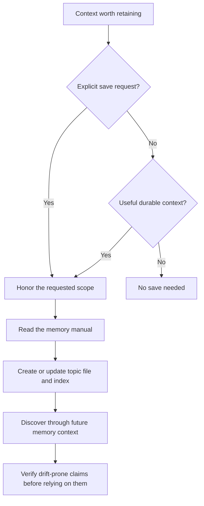

# Persistent Memory

mevedel reads persistent memory from configured `.mevedel/memory/` and
`.agents/memory/` roots, both workspace-local and user-global. Memory is
model-writable and persists across conversations, but it is
selective by default: optional saves should preserve durable context useful to
future work. Explicit user requests to save, forget, or ignore memory take
precedence over package preferences about what is worth retaining.


Curated topics hold reusable knowledge; journal digests hold dated evidence
supporting that knowledge. Use `/remember` to review memory and journal evidence, then
inspect the proposed changes in the [memory cockpit](#memory-cockpit).
The `$learn` skill supports explicitly requested write-back during a conversation.

## Memory flow



## Layout

```
.agents/memory/
  MEMORY.md             ; delivered index
  user-style.md         ; topic file
  issue-tracker.md      ; topic file
  external-systems.md   ; topic file
```

`MEMORY.md` is an index, not a body store. It is the only memory file
included in normal conversation context. Each configured root may
have its own `MEMORY.md`; the first 200 lines of every present index are
loaded in configured order and prefixed with the root label plus a
generated HTML comment describing the index file's last modification
date:

```markdown
<!-- Last updated: 2026-05-08 -->
- [User style](user-style.md) - communication preferences for this user
- [Issue tracker](issue-tracker.md) - where integration bugs are tracked
```

Topic files hold the actual durable memories. `MEMORY.md` entries should
stay short, usually one line under about 150 characters:

```markdown
- [Title](file.md) - one-line relevance hook
```

## Topic Files

Each topic file uses YAML frontmatter:

```markdown
---
name: User style
description: Communication and review preferences for this user
type: feedback
---

Prefer terse completion responses after code edits.

**Why:** the diff and tests already show most routine details.
**How to apply:** summarize material outcomes, risks, and verification
instead of replaying every edit.
```

Supported `type` values:

- `user`: stable details about the user's role, goals, expertise, or
  durable preferences.
- `feedback`: reusable guidance about how mevedel should approach work,
  including corrections and explicitly confirmed non-obvious approaches.
- `project`: enduring context or motivation not otherwise recoverable from
  code, Git history, project instructions, or maintained documentation.
- `reference`: otherwise undiscoverable pointers to authoritative information
  in trackers, documentation, or external systems, with their purpose.

Feedback and project memories should preserve enough context to be
actionable later. Prefer a direct rule or fact followed by `**Why:**`
and `**How to apply:**`.

## Save Policy

Ordinary saving is optional. Keep reusable knowledge in the categories above
when it will help a future task. No entry and no memory change are successful
outcomes. Do not treat an empty index as a task to fill, or infer a lasting
preference from silence or an ambiguous one-time reaction.

Tasks, blockers, deadlines, progress, and decisions belong in the project tracker
or maintained documentation. Conversation state and continuation details belong
in session context and compaction. Avoid speculative conclusions and duplication
of code, Git history, project instructions, or maintained documentation.
Debugging fix recipes normally stay with the code and commit; a distinct reusable
lesson may qualify, but the activity itself does not. A reference points to the
authoritative source instead of copying its changing contents. These defaults do
not veto an explicit request to preserve a particular fact. Avoid retaining
secrets or unnecessary personal information; keep the scope the user asked for.

Saving is a three-step operation:

1. Choose the correct memory root.
2. Create or update a topic file under that root.
3. Add or update the one-line pointer in that root's `MEMORY.md`.

Update existing memories in place. For new memories, use global memory
for cross-project user preferences or broad feedback, and local memory
for project-specific feedback, project context, or local references.
Prefer `.agents/memory/` for portable memories that other agent tools
can share. Use `.mevedel/memory/` for mevedel-specific behavior or
schema. Record known dates absolutely so relative wording does not drift.

When the user asks to remember something, save it within their selected scope
using the topic/index format. When they ask to forget, remove the relevant topic
content and pointer, preserving unrelated information. Do not invent an approval
gate solely because the requested fact is more ordinary than the default policy
would choose to save. A separately requested report-only review retains its
actual approval boundary.

## Prompt inclusion and delivery

The stable `memory-policy` owns relevance, authority, and freshness. The short
`memory-save-policy` requires reading this manual before any memory mutation,
including model-initiated saves. The manual owns format, routing, index updates,
and forget semantics; Read retrieves it as `mevedel://memory.md`.

Main and worker receive current configured roots and index contents as retained
context updates. Changed or removed indexes replace earlier observations for
current decisions without rewriting prior messages. Other role profiles receive
only the memory components they select. Stateless buddy prompts include their
current memory snapshot directly.

## Staleness

Memory is context, not proof. A memory that names a function, file,
command, flag, or external resource records what was believed when the
memory was written. Before recommending or acting on such a memory, the
model should cheaply verify it against current files, docs, git, or the
external system.

If the user says to ignore memory or not use memory, the model should
proceed as if `MEMORY.md` were empty. It should not apply remembered
facts, cite them, compare against them, or mention them.

## On-demand review

`/remember [focus]` and `M-x mevedel-remember` run bounded consolidation over
eligible digests, captured memory, and applicable instructions. In `manual` and `propose` modes, resulting proposals wait in the memory cockpit
for accept/reject decisions; inspection alone edits no curated files. `propose`
is the default. The bundled `$learn` skill provides a separate, explicitly
requested workflow for writing durable session findings to instructions or memory.

## Model selection

Journal generation and memory consolidation have independent `journal` and
`memory` workloads, both defaulting to the `balanced` tier. They use the ordinary
`mevedel-model-workloads` and preset `:model-workloads` configuration:

```elisp
(mevedel-define-preset my-preset
  :parents (mevedel-implement)
  :model-workloads ((journal :tier balanced)
                    (memory :tier balanced)))
```

These workloads are independent of `summarization` (compaction and handoff)
and `buddy` (edit reviews and guidance). Configure either workload with the
ordinary model policy to select a provider, model, and reasoning effort.

Journal capture freezes the originating root buffer's policy. Changing that
entry affects new captures; already captured jobs retain their frozen policy.
Consolidation resolves `memory` in the caller's current buffer. Automatic review
runs from an idle callback without restoring an originating session preset;
configure its workload globally when a consistent background policy is needed.

## Journal and consolidation overview

Journal storage is separate from curated memory. The internal
`mevedel-journal-store` module publishes immutable workspace digests and
completed-review and proposal-decision records, and
`mevedel-journal-claim` provides bounded work ownership and recoverable
outcomes. Completed-turn capture and sealing are connected to session
lifecycle. Background generation and accepted-result recovery run from
lifecycle opportunities; completed, saved root turns recover abandoned checkpoints.
Public entries live in `.mevedel/journal/`; private bookkeeping and recovery
evidence live in `.mevedel/state/journal/`.
Public-entry discovery batches fresh expiry-marker checks and bounded reads in
groups of 16. Completed-turn coverage uses the same bounded read batching;
malformed coverage fails closed. These observations are not cached across calls.
`memory://journal/` supports ordinary Read, Glob, and Grep over validated published
records, with cached composer completion and request-time roster availability.
The main conversation receives a bounded recent-digest map as retained context.
Consolidation runs on demand through `/remember` or automatically in `propose` and `auto` modes;
the memory cockpit supports inspection, decisions, and recovery. See
[ADR 0117](adr/0117-publish-journal-results-from-fenced-outcomes.md) for the
storage contract and the workflows below for the user surface.

## Review evidence and proposal format

The consolidation output contract is implemented in
`mevedel-memory-proposal-parse`. It validates the complete reply against captured
root IDs, admitted files, complete filename observations for creation, and
admitted digest IDs before returning any proposals. The fixed ordered sections
are Promote, Update, Merge, Remove, Instructions, and No action. Proposal fences
contain JSON-valued header lines, a `---` separator, and Markdown replacement
content. The header is a sequence of `key: value` lines, not a JSON object;
only the values use JSON syntax. Merge sources must be admitted files; overlapping file operations
invalidate the entire reply. Instruction targets must be exact captured
applicable files. Direct MEMORY.md proposals are rejected because application
owns index consistency. This parser performs no reads or writes and does not
establish current authority, freshness, or factual correctness. The request uses
this parser at terminal settlement before accepting proposals into the durable
review and decision lifecycle exposed by the memory cockpit.

`mevedel-memory-scope-capture` supplies the parser's root and file allowlist.
It reads complete topic, index, and root instruction files without changing
them: at most 32 KiB per file and 96 KiB total, with a 256-entry inventory per
memory root. A review admits at most sixteen configured memory roots; exceeding
that count refuses capture. Omitted files remain known existing names; an incomplete inventory
cannot authorize creation. Symlinked files and symlinked parents cannot supply
before-state or new proposal targets. The captured index is reserved for the
application transaction, rather than offered as a direct model-editable topic.

Each root retains its original physical path, target identity,
and local host/user identity where applicable. Later configuration changes do
not rebind these IDs. Inspection checks original authority; a different local
client or a retargeted root makes it unavailable. Freshness checks compare
literal captured bytes and expected absence with current target reads, including
indexes and merge inputs selected by the caller. These read-only checks do not
acquire write ownership or commit files; the application coordinator must hold
the required ownership across checking and mutation.

The captured source boundary accepts relative paths only within the original
workspace target. It excludes VCS metadata, `.mevedel` state, symlinks, and all
configured memory roots, including roots omitted because their index was
unavailable. Omitting a memory root does not make its contents available through
a source-file fallback.

`mevedel-memory-reference-check` inspects backticked references in the admitted
topic snapshots, returning at most 200 distinct topic/token observations with
dates. Its current check is workspace-relative **path existence**, including
references with line-number suffixes. A found path does not verify a lesson or
the referenced line. Commands, flags, external references, ambiguous identifiers,
and paths outside the source boundary remain `unknown`. Oversized references,
unavailable topics, and the count limit produce explicit omissions. Topics
without candidates receive no certification. These rows can be stored in the
immutable review record and are supplied to the consolidation request.

### Investigation tools

`mevedel-memory-investigation` supplies request-local gptel Read, Glob, and Grep
tools. Each call names `workspace`, `journal`, or an admitted root ID, plus a
relative path. This is a scoped tool argument, not another resource-address
family. Memory and journal reads use captured evidence; source Read uses the
ordinary text reader over a pinned UTF-8 snapshot capped at 512 KiB, including
range support within that snapshot. Oversized files are refused before the
reader can scan a long line or a large offset. No tool definitions are added to gptel's global tool registry.

Searches reuse ordinary Glob/Grep over private admitted copies. Source search
examines at most 256 entries, copies at most 2 MiB, and omits files larger than
512 KiB. Omitted, unavailable, and excluded source paths produce a partial-search
notice. Narrowing the subtree or reading a named source file supports further
investigation. Results use relative filenames and omit private copy paths.
Each result is capped at 8 KiB of UTF-8; a request may return at most 64 KiB
across 64 calls. The module constants `mevedel-memory-investigation--max-calls`
and `mevedel-memory-investigation--max-bytes` supply these aggregate limits to
both enforcement and the review prompt. Exceeding either limit retires the investigation and
reports failure to its request owner. Stopping cancels active search helpers,
removes their copies, and suppresses late delivery. The owner still supplies
the overall deadline and generation check.
Search completion restores the caller's working directory before delivering
the result, including synchronous empty results. A provider follow-up never
inherits a deleted investigation snapshot as its working directory.

### Request limits and settlement

`mevedel-memory-review-request` combines that scope, reference pre-check, and
investigation in a sessionless gptel request using the `memory` workload (default
tier `balanced`). It admits a prefix of at most 20 complete candidate digests and
reports omissions. The
initial prepared provider payload, including tools and roles, must fit both
32,000 estimated tokens and the model's usable context with output reserve.
Indexes, instructions, and topics are supplied as complete documents when they
fit; other captured documents remain available through Read. An empty digest
set requires an explicit memory-only request. Focus and recent rejection text
are each bounded to 8 KiB.

The request has a 180-second deadline. Its cumulative output budgets default to
64,000 tokens (`mevedel-memory-review-max-tokens`) and 256 KiB
(`mevedel-memory-review-max-bytes`). Both settings must be positive integers and
are captured at request start. Reasoning, intermediate replies, and tool-call
arguments share these budgets with the final reply. Both the client token
estimate and available provider-reported output usage must fit the token budget;
the estimate is not the provider's tokenizer and charges non-ASCII text
conservatively. Tool results have the separate investigation limits above.
The client charges tool calls at TOOL using a normalized JSON encoding of
their executable names and parsed arguments, not their raw wire spelling.
Whitespace and escape spelling in argument JSON are not preserved in that
charge, and in-flight argument fragments have not yet been charged. The byte
counter is therefore an accounted-output size, not a bound on raw transport
traffic. Provider-reported usage, when available, supplies the separate token
guard; the deadline still bounds an interrupted argument stream.

The final proposal reply alone must fit the parser's independent **32 KiB**
limit, checked at terminal DONE; reasoning and earlier rounds do not consume
that allowance. Increasing the cumulative budgets does not increase the amount
of proposal text that may be accepted.

Supported provider output limits are clamped to the smaller of the workload's
per-response limit and the remaining cumulative token budget, subtracting the
larger of estimated and reported output usage. Either depleted cumulative budget
refuses another round. Providers without that control retain client-side limits, not a server
billing ceiling. Every follow-up rechecks the prepared payload against usable
context. The initial input admission limit remains 32,000 estimated tokens.

The initial consolidation prompt renders the frozen output, investigation,
proposal, and deadline limits. It asks the model to reserve room for its final
proposals or No action response, and to use focused evidence checks rather than
exhaustive validation. After completed tool results, before a follow-up's context
check and dispatch, the request may inject a budget reminder through native
gptel prompt APIs. Reminders fire at 75% and 90% of any cumulative output,
investigation-call, tool-result-byte, or elapsed-time allowance, at most twice;
a jump across both thresholds emits only the highest stage. They report the
remaining allowances. The last stage asks the model to stop tools and return
the final review, with No action valid for unresolved claims. They cannot
interrupt a response already in progress and do not replace the hard guards.
This sessionless request creates no session-backed reminder queue or transcript.

Review callback results and live usage snapshots include accumulated
`:output-bytes`, `:output-estimated-tokens`, and the current round's reply size
(`:result-bytes`), separately from provider-reported usage. The breakdown
`:reasoning-bytes`, `:reply-bytes`, and `:tool-call-bytes` measures cumulative
reasoning, replies across all response rounds, and the normalized tool-call
charge. Thus `:reply-bytes` can exceed `:result-bytes`; only the latter is the
final proposal size at DONE. `:tool-call-count` records admitted investigation
calls, including calls that return errors, but not calls refused after exhaustion.
`:rounds` counts completed HTTP rounds independently of provider token metadata.
Output guard failures
include `:budget-kind` (`output-bytes`, `output-estimated-tokens`, `output-tokens`,
or `proposal-bytes`) and the numeric `:output-limit`; the error message also names
the guard and its measured usage. The pass result and terminal workspace
telemetry retain these counters, including on cancellation and publication
failure, without retaining generated text. A streaming abort can occur before
the provider reports the interrupted round's usage.
Read tools execute within their captured authority without interactive gptel
confirmation; unavailable tool names fail the review. Only gptel's terminal
DONE state validates the final proposal response. An intermediate HTTP completion
does not finish the tool loop or consume coverage.

While running, its read-only buffer displays admitted evidence, model output,
and tool results. Closing it or invoking the returned cancel function retires
the request, stops active searches, and suppresses late results. The validated
callback includes the exact validated reply, admitted digests, and cumulative
provider usage. It does not publish proposals or coverage. Connecting the
request to pass selection, storage, and cancellation is handled by
`mevedel-memory-pass-start`.

## Selecting and accepting a review

`mevedel-memory-pass-select` supplies candidate selection from a fresh journal
observation. General passes select uncovered digests; focused passes can reuse
covered ones. Selection returns at most twenty, oldest first with digest ID as
the tie breaker, and reports the eligible backlog beyond that batch. Later
arrivals do not enter an already captured observation.

Published digests describe completed, immutable work and are eligible even while
their source session remains open or another client holds that session. Selection
needs no source-session authority: it changes neither session state nor review
coverage. The coordinator still acquires journal/consolidation ownership and pins
freshly validated evidence before a review starts.

`mevedel-memory-store` supplies private prepared and accepted pass storage. The
caller holds the 180-second consolidation claim. Preparation acquires journal
mutation ownership, recovers accepted expiry, checks that selected entries still
match their public source bytes, and then pins them. This order prevents a pass
from reviving evidence already committed for expiry. The prepared record retains
the original scope, complete digest bodies, source fingerprints, and focus.
Focus must fit the public record's 4 KiB bound before inference begins.

Private records live in `.mevedel/state/journal/passes/<pass-id>/prepared.el` and `accepted.el`.
They use bounded durable Lisp data, preserving literal byte strings in captured
before-state; each record is limited to 4 MiB. Reading disables evaluation and
circular-reader syntax. Evidence pins live under
`.mevedel/state/journal/evidence-pins/<digest-id>/<pass-id>.pin` and bind to the prepared record's
hash. These records are internal storage, outside `memory://journal/`; displaying their
memory bodies still requires the original scope's authority checks.

Acceptance validates the reply again against the prepared scope and exact
admitted digest subset. Each proposal retains its affected topics, merge inputs,
index, or instruction before-state. Its identity includes the pass, original
target and client, proposed change, and before-state. The accepted bundle is
written before its hash competes in the pass claim's immutable outcome election.
Changed private bundles cannot be replayed as accepted results.

Publication reads that accepted bundle under fresh journal mutation ownership
and publishes the immutable review record. Only this public record advances
general coverage. Replaying publication is idempotent, including after the
original request is gone. Pending proposals retain admitted digest pins;
omitted digests and a no-action pass release their pins after publication.
Failed, cancelled, or expired passes can release only their own pins, after
their unsuccessful outcome has been recorded. None of these storage operations
applies proposals to curated files. Decisions, application, and expiry use the
separate checked operations described below.

### Pass ownership

`mevedel-memory-pass-start` coordinates one 180-second workspace claim. Before
selecting evidence, it recovers accepted older pass publications and releases
pins belonging to fenced unsuccessful attempts. Selection runs under journal
mutation ownership after accepted expiry recovery. Preparation rechecks the
selected entries when pinning them; a change between those operations fails
without consuming coverage. Each request checks current target ownership, and
the coordinator's timer includes selection and preparation in its deadline.

For local Linux workspaces whose configured memory roots are also local,
publication recovery, evidence selection, automatic admission, scope capture,
immutable preparation and rejection-history reading run in a short-lived batch
Emacs child. The editor supplies the resolved memory roots, instruction paths,
automatic thresholds and original client identity; the child does not rediscover
user configuration. The claim deadline covers admission as well as preparation.
An automatic opportunity that is not due settles its state as `:skipped`, updates
the next-opportunity observation, and starts neither inference nor a completion
callback. Scope reads transfer in bounded batches of eight while
each admitted file still obeys the remaining total byte budget. The editor
rechecks the claim before starting the configured review from the originating
buffer. Cancellation stops preparation, fences the pass, and ignores late
replies. Remote roots retain target-native preparation in the editor.

Local accepted-result storage and review publication also run in the child.
Only immutable review inputs cross that boundary; automatic proposal application
and its original-target checks stay in the editor. The pass remains running
until publication returns. Cancellation fences an unaccepted reply; an already
accepted outcome retains its bundle and pins for publication recovery. Provider
usage and errors remain visible through the ordinary pass callback.

The returned state is available through `mevedel-memory-pass-running`. Its
`:request` is populated after preparation and contains the read-only review
buffer; the pass remains registered while its result is being published.
`mevedel-memory-pass-cancel`, or closing
that buffer, retires only this client's attempt. Failure and expired callbacks
cannot publish fresh results or change a successor's claim or pins. Success
returns the immutable public review, usage, and remaining frozen backlog count;
arrivals after selection remain eligible. There is no recursive backlog drain.
Explicit callers may allow an empty batch for current-memory review. The proposal
cockpit and `/remember [focus]` command are available. Workspace telemetry records
pass starts and terminal outcomes, usage received so far, published proposal and
coverage counts, and remaining backlog without private content.

### Automatic review and application

`mevedel-memory-consolidation-mode` supports `manual`, `propose` (the default),
and `auto`. Manual runs only on request. Propose schedules a read-only review at
eligible completed, durably saved root turns and digest
publication, and leaves its proposals for approval. Auto uses the same review and applies fresh memory proposals through
the ordinary checked decision path. Instruction proposals always wait for
approval, including changes to `AGENTS.md`. The mode is frozen at pass admission.

The automatic gate checks mode, then elapsed time since the last successful
general review, then the eligible unreviewed digest count. The settings
`mevedel-memory-consolidation-min-hours` and
`mevedel-memory-consolidation-min-digests` default to 24 hours and five digests.
Both automatic and general on-demand completion move the clock; focused reviews
do not. Retired review metadata preserves that clock after history expiry.
A smaller backlog becomes eligible one day before its oldest digest reaches the
configured ordinary-recall age limit (13 days under the default). Disabled expiry
keeps the count threshold; the elapsed-time gate still applies in either case.
This creates review opportunities for sparse workspaces and completed work from
long-running sessions. `/remember` bypasses timing and count thresholds.

Turn completion checks cached timing and settings without target I/O. Queued
turns coalesce, and filesystem work waits for idle transport. A failed count
check is cached for ten minutes; a recent successful general review postpones
the next check until its interval ends. The coordinator acquires target
ownership and recovers accepted publications before rechecking the gate, so
another client's completion cannot be missed merely because the initial
observation was stale. Journaling can be disabled while existing digests remain
eligible for consolidation. Exit cancels queued and active review work.

Auto applies proposals sequentially with fresh workspace and original-root
ownership for each application. Unrelated index edits are preserved across
reviews and manual changes. Changed topic files or affected index entries remain
stale; cancelled application holds the remaining proposals. Completion reports
the number of distinct files confirmed written by that run, counting a shared index once and
excluding idempotently returned decisions from another call. A successful
review can still leave held, stale, unavailable, or recovery-required proposals.
Neither syntactic validation nor the updated-file count establishes that the
new memory is correct.

## Proposal decisions

`mevedel-memory-decision-reject` records a rejection without editing memory or
rewriting the completed review. It acquires workspace ownership and checks the
proposal's original target authority. A repeated rejection returns the same
terminal decision, including its original reason. The reason is optional and
limited to 4 KiB. Private `.mevedel/state/journal/decisions/<decision-id>.el` records retain the
claim, exact public metadata, and optional write-intent identity. Their hash is accepted before publication,
so a later client can recover a rejection after the owner stops.

Public `kind: decision` records contain decision, pass, proposal, and workspace
identities, date, status, reason, and a private-state hash. Their body is derived
from metadata and includes no private topic or proposed replacement. Decision
status is verified against immutable acceptance evidence; public text alone
cannot decide a pending proposal or release its evidence. When every proposal
in a pass is terminal, publication releases that pass's digest pins. Review
and decision records remain retained while evidence or unresolved work needs
them, then expire together under the resolution-based history window.

Before a later request, the coordinator recovers accepted decisions and includes
bounded recent rejection evidence: the original suggestion and reason, under
the original memory-root authority. It admits at most twenty whole records
within 8 KiB and reports omitted or unavailable records. This can help the model
recognize reworded suggestions; it is untrusted evidence and does not guarantee
semantic suppression. Rejection, application, and reversal APIs are implemented
through the proposal cockpit as well as their internal APIs.

### Checked application

`mevedel-memory-apply-changes` prepares complete topic/index or instruction
changes from accepted before-state without writing them. Topic frontmatter is
generated from the validated name, description, and type. Index updates escape
labels and filenames, retain unrelated lines, and reject duplicate or invalid
destinations, including two encoded names for the same file. Instructions
append to their captured file. Every emitted change retains expected original
bytes or absence and exact proposed bytes for the shared patch transaction.
Generated files must fit the memory reader's 32-KiB per-file bound, including
index growth, so a change cannot exclude its root from the next review.

The patch transaction checks supplied before-state before any write and
again before writing each path. It restores only its own expected after-state;
intervening disk and unsaved buffer edits survive a failure. A caller can fence
all writes and rollback through a target mutation callback in addition to
client-side ownership checks. Interrupted buffer
synchronization rolls back before propagating a quit.

`mevedel-memory-decision-apply` acquires the workspace claim and an independent
claim at the original target root. Topic and instruction files must still match
their captured state. For `MEMORY.md`, only entries for the proposal's topic and
merge sources must match, including entry absence. Unrelated entries, prose, and
entry ordering may change. The shared index parser rejects duplicate destinations,
invalid paths, and unsupported link syntax. A missing index has no entries.
After these checks, application uses the complete current index snapshot and
preserves its unrelated content and permissions. Exact file checks still protect
the interval between preparation and writing, including unchanged dependencies.
Full before/after states live in private
`.mevedel/state/journal/writes/<intent-id>.el` records. Standard `.mevedel/memory/`
roots keep a hash-only marker in the sibling `state/memory-write/pending/` before
curated writes. Other memory and instruction roots use
`ROOT/.mevedel/state/memory-write/root/pending/`. Coordination belongs to the
original target, independently of the calling workspace. An unresolved
marker blocks other workspaces at that root even after the original claim
expires. Coordination files are excluded from consolidation memory and source
scopes; inventory does not descend into their directory.

Curated mutations and target-claim settlement take the same target-side `flock`
on the pinned claims directory. Each mutation checks the unsettled claim,
filesystem-clock deadline, expected bytes and mode under that lock; replacement
mode is set on the temporary before rename. A delayed old writer either finishes
before takeover or fails its guard afterward. The same mechanism protects
rollback and marker retirement. This requires Linux `flock` on the storage
host; acquisition waits at most 20 seconds and process death releases the lock.

Application accepts an immutable decision before retiring the marker. Status
ordering uses accepted claim generations, so retries in the same second still
produce an unambiguous latest result. Entry-level index checks work independently
of review identity and retained write history. The original pass stays immutable;
only the transaction's working copy receives the checked current index snapshot.
Conflicting entries or topic files produce a stale decision naming the conflict.

### Recovery and reversal

`mevedel-memory-decision-recover-write` reconciles exact retained states without
repeating application: complete writes become applied, untouched attempts become
unavailable, and mixed or intervening changes remain recovery-required with their
marker intact. Its explicit rollback option restores a pending attempt through
the patch engine only when every dependency matches recorded before or after
state. Foreign or unsaved edits prevent rollback.

`mevedel-memory-decision-reverse` reverses a resolved application only while all
affected files match its exact after-state. It persists a separate reverse intent
linked to the original intent identity and hash, then uses the same patch and
decision path. Successful reversal adds an immutable `reversed` decision; the
original application remains inspectable. Reversed proposals remain terminal,
so repeating accept, reject, or reverse cannot silently reapply them. A new
review is needed for a new proposal.

Reversal can also be interrupted: completed reverse writes become `reversed`
when reconciled, untouched attempts leave the proposal `applied`, and partial
attempts remain recovery-required. Explicitly rolling back a partial reversal
restores the previously applied state. Reversal retains exact whole-file checks:
an earlier proposal cannot be reversed through a later proposal's index edits;
reverse those later changes first, or leave the current files intact.

`mevedel-memory-decision-recover-pending` discovers retained write records and
reconciles their independently marked attempts without inference or file
reapplication. It first recovers settled publications under successor workspace
ownership. Unmarked intents are not classified as applications, even if an
external edit happens to match their proposed bytes. Unreadable or unavailable
records stay inspectable. Completed, durably saved root turns schedule this
recovery independently of journaling being enabled. Repeated opportunities
coalesce and wait for idle transport. On local Linux workspaces, accepted
publication recovery runs in a batch child under the workspace claim. The editor
then inspects one retained write per event-loop callback and reconciles marked
attempts against current target authority and live buffers; unsaved edits cannot
be classified by the child. Each record is read afresh. Cancellation stops the
remaining checks, and the original deadline also bounds this inspection phase.
Root-turn automatic consolidation is offered after recovery finishes, so it does
not race that recovery claim. A queued offer refused by a busy claim does not
consume the scheduling cooldown; a fresh admission observation still does.
Consolidation still recovers under its own claim
before selecting evidence; the intervening live-write phase releases ownership.
A live workspace owner leaves recovery for a later opportunity. Session selection
and conversation setup do not start workspace maintenance. Exit cancels queued
recovery, fences this client's active claims and stops its children. A 180-second
deadline bounds scheduled recovery, and late replies cannot continue it. Remote
workspaces and explicit synchronous recovery retain the target-native path.
Recovery neither requests a model nor repeats or rolls back memory writes.

## Memory cockpit

`M-x mevedel-memory-list-open`, or **Memory** (`l`) in the session cockpit, opens
the memory table with **Candidates**, **Memories**, and **History** views.
Switch with the clickable header or `1`, `2`, and `3`. Opening starts with
Candidates when proposals need attention, otherwise Memories. Refresh retains
the selected view and row where possible. Resolved candidates move to History.
Rows show action, type, title, status, and exact target/origin. The header shows
workspace, pending/recovery counts, history retention, and this client's running pass. Opening attempts checked recovery; a busy owner does
not prevent read-only inspection or lose its claim. Refresh preserves the active
session composer draft. Another client's unavailable memory root remains visible,
but inspecting private body/diff evidence or applying there requires its original
authority.

Memories inventories actual topic files in configured roots, including manual
and unindexed topics, with frontmatter title/type and indexed/unindexed status.
Indexes and internal coordination files are excluded. `RET` inspects the full
stored body, `o` opens the actual file, and `d` asks for confirmation naming the
exact topic. Deletion freshly captures the topic and index, then uses the same
checked transaction as proposal application. Its producer is `user`; it runs no
model and fabricates no model response. A concurrent edit prevents application.
The deletion appears in History, where `u` can restore its exact before-state
while that history remains and the current files still match. Unrelated topics
are untouched. History also includes completed reviews with no candidates;
details show the retention deadline or unresolved dependency.

The main cockpit's Memory row shows pending/stale proposals, interrupted-write
recovery, and unavailable-record counts separately. Opening and rendering the
main cockpit use cached observations without reading journal or memory files.
The row says `not checked` before an observation exists and marks observations
older than ten seconds as `cached`. Open the Memory table or refresh it to
collect current evidence. Counts are disposable UI state and never authorize
an application or override its freshness checks.

`RET`/`i` shows the complete proposed body, retained before/after diff, decision
reason, retained digest bodies with their original addresses, and dated reference
checks. A section index opens the proposed body initially; decision status stays
visible while navigating. Each changed file and retained evidence entry has its
own destination. `n`/`p` switch sections; `g` refreshes the same proposal; `q`
closes both panes and returns to the table. Narrow windows stack the index above
the reader. Evidence inspection still works if a public digest is unavailable.
Pending diffs include unrelated current index edits when freshness checks pass.
If they fail, inspection retains the captured diff and shows the current conflict
or unavailable-state reason. Applied/reversed diffs come from the exact retained
write intent. `a` accepts, `r` rejects, `A` accepts pending and stale proposals sequentially,
and `R` rejects pending proposals. Rejection is one key; use a prefix argument to
enter an optional reason. `u` performs checked reversal. `c` reconciles an
interrupted write; `U` explicitly rolls back a known interrupted attempt.
`v` opens a separate inspector for this client's running request. Admitted
evidence and model response occupy separate sections; incoming source changes
update the reader without moving focus. Closing the inspector leaves the request
running; when the source closes, the inspector reports that state. `k` cancels
the request through the pass owner,
and `j` opens pending journal jobs with their inspection/retry/discard actions.
`m` runs another consolidation; a prefix argument asks for focus. The first-class
`/remember [focus]` command and `M-x mevedel-remember` use the same bounded
sessionless pass, allow explicit current-memory review without eligible digests,
and open this table. Completion refreshes an existing matching table without
reopening a closed table or altering the composer. The command may run while a
conversation request is active; already published digests from it remain eligible.
`g`, `?`, and `q` follow the shared cockpit refresh/help/back contract.

## Journal discovery and context

The `journal` component is selected only by `main` and delivered as an independent
retained context update, leaving the system prefix stable. It shows at most
five recent digests with date, session name, canonical address, and the first
nonempty Learned bullet (falling back to Done). The entire component is bounded
to 2 KiB of UTF-8, including labels and addresses; long names and excerpts get
visible omission markers. These are dated evidence, not current instructions
or authority to resume unfinished work. Worker, explorer, verifier, reviewer,
guardian, buddy, and context-summary prompts omit the map. Review coverage is
the exact union of digest IDs in published general-review records. Focused
reviews retain their examined IDs without advancing general coverage. The
cached observation includes reviews, so additions or removals refresh the count
even when the newest digest filename stays unchanged. Changed maps or coverage
produce a new complete journal section; unchanged state is not repeated. Empty
state clears an earlier map, and outgoing-history loss causes redelivery through
the ordinary context acknowledgement mechanism. The resource roster advertises
journal retrieval only when validated public entries are available.

Discovery refreshes at most once per ten seconds. On local physical paths, it
reuses the last validated entries when directory and file attributes for public
records and expiry markers are unchanged. Access times are excluded; change
times, modification times, identity, size and permissions remain in the source
signature. A read whose before/after signatures differ is not reusable across
refreshes. Remote or unavailable observations use the ordinary validated read
path. Cached-only completion performs no filesystem operations, and every use
still applies the age limit. This snapshot is advisory: evidence reads,
consolidation admission and publication do not use it as storage authority.

A completed review records its pass ID, exact examined digest IDs, focus,
reference-check evidence and dates, and generated proposal IDs. Its public body
is derived from that metadata; it contains no proposal replacement bodies or
captured private topic content. Publication is the coverage commit point, so the
pass owner must persist its proposal batch before publishing the review. Review
records remain retained while any examined digest survives. Once their evidence
dependencies end, old reviews can expire with their private prepared/accepted
bodies and complete terminal decision/write history.

## Working notes and completed-turn capture

Main and worker guidance asks for attributed factual lessons in
`work://shared/` when the request permits workspace writes. Agents search before
creating and update relevant existing files; no filename or structure is required. Read-only agents
report lessons through their existing results or available SendMessage; they
gain no mutation tools. `$learn` considers available notes and digests as
additional evidence, verifies relevant claims, and acknowledges omissions.

With `mevedel-journal-enabled` (default `t`), a successful completed root-turn
save freezes a checkpoint before generation collection. One immutable private
record contains projected evidence, notes, their hashes, stable completed-turn
identities, and serializable journal model selection. It pins the source
session and any committed publication head. A newer checkpoint supersedes an
unsealed predecessor only when it contains all that predecessor's turns.
Published and sealed turns stay outside later checkpoints; replacement
branches use distinct persisted fork-point identities even when turn numbers
repeat. A turn that spanned an auto-compaction is captured from the segment
where it finished, whose inherited summary stands for the earlier part
([Sessions](sessions.md)). Storage failure reports a warning without failing the conversation save.

For deferred root-turn settlement on local Linux portable sessions, a batch
Emacs child prepares that checkpoint from the committed publication and frozen
turn index, model policy and client identity. It receives no source mutation
lease or provider object. The editor retains request admission while allowing
input, then checks the same live root, request, saved head and source authority
before publishing and pinning. Changed or cancelled sources cannot publish late
results; preparation has a 120-second timeout. The child's request and reply
files use an explicit lossless coding: detection read evidence holding a NUL
byte, such as binary tool output, as raw bytes and broke every non-ASCII string.
Terminal hooks and queued requests
wait for settlement, and collection is offered afterward. Explicit checkpointing,
compaction/close, PID-lock sessions and remote roots use the same preparation
and publication operations synchronously.

Publication retains capture and completed-turn IDs in private immutable coverage
records. These contain no transcript or digest text and survive deletion or
expiry of public digests. A later checkpoint therefore excludes previously
published work even when its public digest is gone. This capture coverage is
separate from consolidation review coverage.

Public entries and private capture bundles have separate 8 MiB storage bounds;
digest bodies remain capped at 16 KiB. Metadata admission reserves the entire
body allowance, so long completed-turn ID lists are never silently truncated.
An oversized capture is rejected before publication or pinning and stays
eligible for a later successful capture.
Capture decoding also checks the complete source-reference schema, unique
segment names, their revision hash, and all frozen policy fields. Malformed
descriptors remain inspectable with their source pins intact. A saved reasoning
effort that the resolved model no longer supports stays unavailable before any
provider request.

Successful root compaction and `/clear` seal the completed-work checkpoint
selected before the transcript was replaced, with `compaction` and `clear`
triggers respectively. Clear retains the pre-clear evidence and captured title;
it does not capture unfinished output or create an empty digest. Pre-commit
failures or cancellations leave checkpoints unsealed. A committed clear still
seals its checkpoint if subsequent presentation or hook work fails. Agent
compactions create no journal work. Closing the root data buffer or exiting Emacs seals completed
checkpoints as session-end work. View-pair close seals before removing the
root registration. Read-only buffers do not seal, and a portable session must
still own its lease; closing does not reacquire authority. Neither path
snapshots incomplete streaming output. Exit starts no model request. Sealing is immutable and preserves the
first trigger. Disabling journaling stops new capture and sealing while keeping
existing snapshots and pins.

### Digest generation

Completed turns, successful root compaction, successful `/clear` with captured
work, and session close schedule one
background processing opportunity. Scheduling waits until the caller returns
and the target transport is idle. Already-due journal and memory opportunities
leave an event-loop interval between jobs rather than executing back-to-back.
On local Linux workspaces, scheduled abandoned-capture recovery, digest discovery
and claim admission, and journal retention run in short-lived batch Emacs children using the same pinned storage
operations and fenced claims. Children load package dependencies without user
init, receive frozen storage inputs and retention settings, and return bounded
completion records. Digest preparation returns a capture identity and fenced
claims; the editor freshly reads the selected capture and rechecks both claims
before starting inference. Provider requests keep the editor's configured gptel backend;
no backend or authentication objects are serialized to maintenance children. Recovery completes before its
processing opportunity resumes. Remote workspaces retain transport-aware editor
scheduling. Live-buffer artifact retention remains in the editor, where active
buffers and gptel context can protect references. Interrupted workers leave durable
claims and evidence for later recovery; exit stops this client's children.

Capture discovery observes marker directories in batches and omits fully retired
records whose evidence descriptor has already been removed. Retired records with
remaining descriptors stay visible to recovery. Claim ownership verifies the
latest generation on the target without transferring the full claim listing;
pruning stops when its deletion budget is exhausted.

Duplicate events coalesce, and completion
does not recursively drain the backlog. Only sealed captures run. A dedicated
workspace admission claim permits one digest request at a time; the capture's
own claim accepts its result. Both share a 120-second target-clock deadline.
Failed jobs get at most three automatic attempts on separate opportunities.

Generation records dated evidence supporting qualifying user, feedback, project,
or reference knowledge under the save policy above, rather than conversation
progress. A correction or discovery may qualify; completing a task, passing
tests, encountering a blocker, or making a decision does not qualify by itself.
The digest's Unfinished section preserves uncertainty about qualifying knowledge,
not pending work. A validated result with `- none` in all four sections succeeds
without publishing a journal entry or scheduling consolidation. Its accepted
outcome records turn coverage before releasing source pins, so recovery needs no
replacement inference and later boundaries do not recapture those turns.
Consolidation independently judges whether journal evidence supports a useful
memory, including when older notes contain project progress. It treats No action
as success, avoids duplicates, and proposes corrections or removal of outdated
memories when supported. Existing notes and memories are not rewritten merely
because the selection policy changed.

Processing re-resolves the exact frozen provider/model and uses the saved
streaming, effort, and output settings. Missing policy or client-owned evidence
stays unavailable instead of selecting a fallback. Frozen evidence is bounded
again to the generator's actual input budget, with explicit omissions. No live
conversation buffer or tools are needed. Cancellation and timeout preserve
pins; late callbacks cannot replace an accepted outcome.
If one accepted result cannot finish recovery, a background opportunity retains
it and can process another sealed capture. Explicit retry reports the recovery
error. The job browser identifies a capture that requires its original client.

New captures use the configured `journal` workload (default tier `balanced`)
and its effort selection. Unspecified effort retains the provider default;
journaling does not force reasoning off or translate a universal effort level
across models. Existing frozen policies keep their saved effort and limit.
Digest prompts request a few decisive facts and skip routine successful tool
chatter; continuation and handoff policy is unchanged.

Journaling adds no server token limit. Explicit output limits from the resolved
policy or originating buffer's `gptel-max-tokens` are frozen and honored where
the provider supports them, without an automatic 4,000-token ceiling. Omitting
a limit uses provider defaults, not unlimited generation. Input admission uses
the ordinary model context reserve (`mevedel-model-reserve-tokens`) and any
configured output allowance. Accepted digest text remains limited to 16 KiB,
with a 120-second client deadline. Streaming overflow cancels the request;
oversized final output is rejected. These client guards do not bound internal
reasoning tokens or guarantee a server billing ceiling. Codex OAuth has no
server output-token control. Changing journal policy affects new captures;
queued captures keep their frozen choice and published digests remain readable.

Successful output is accepted durably before publication. If publication
fails, the next opportunity recovers that exact output without another model
request. After successful publication, the processor releases the source pin,
retires the job, and removes its frozen transcript/notes bundle. Exit cancels
queued and active processing before sealing remaining checkpoints, starts no
inference, and does not wait for a model.

### Abandoned checkpoint recovery

Completed, durably saved root turns schedule recovery before processing. Recovery inspects inactive captures as well as ready jobs,
repairs interrupted pin/ready publication, and seals abandoned completed work.
It verifies the original source session and frozen evidence under temporary
source authority. PID locks use the existing dead-holder check and a checked
replacement serialized with normal resume and release by Emacs native file
locking. A resume replacing the observed stale record prevents recovery from
acquiring it. Live, foreign,
or unreadable locks remain untouched. Portable recovery fences an expired
ordinary lease through the existing generation election. Live leases, publishing
leases, unresolved mutation, and reserved control transfers remain held for
normal session recovery. No conversation is resumed and no model request runs
while source authority is held. One unavailable capture does not prevent the
recovery scan from examining unrelated captures.

Recovery also finishes superseded pin release after checking the successor's
retained completed-turn coverage. It then removes the old raw bundle. Retirement
markers prevent an old completed-turn set from recreating its retired capture.

## Journal jobs and inspection

`M-x mevedel-journal-jobs` lists pending checkpoints and jobs, including failed,
exhausted, unavailable, and unreadable captures. `RET` inspects the frozen
evidence, `r` retries the selected sealed job once, `d` discards it, and `g`
refreshes the list. The corresponding commands are `mevedel-journal-inspect`,
`mevedel-journal-retry`, and `mevedel-journal-discard`. They work from a session
or workspace buffer as well as the job list. Pending jobs and overdue retained
evidence have separate headings. Capture inspection uses a section navigator for
diagnostics and exact frozen evidence. Inspection starts no inference.
Manual retry retains the frozen model policy and attempt history, and respects
active ownership and already accepted results.
Unready checkpoints also appear as recovery work, including damaged descriptors;
retired captures remain outside the pending list. Inspection does not acquire
source authority or repair storage.

Explicit discard remains available when journaling is disabled. It cancels a
matching request owned by this client, records an immutable omission before
releasing the source pin, and removes the raw evidence bundle. It cannot take
over another client's live request. An interrupted discard resumes from its
accepted outcome. An already accepted digest is recovered instead of discarded.
When a capture descriptor is unreadable, the interactive command asks for its
original source directory and verifies the matching pin before proceeding.
Discarding a checkpoint prevents that exact capture from being repinned; new
completed work can still produce a new capture.

The journal jobs inspector also shows overdue public entries that remain in
storage: total count, age in days, review mode, and observed retention reasons.
Unreviewed evidence, unfinished capture publication, evidence pins and retained
review/decision history appear separately from pending digest jobs. Entry buttons
read current validated storage for human inspection. Review and proposal/recovery
buttons use the existing `/remember` and proposal cockpit commands; capture retry
and discard keep their existing authority checks. No inspection grants ordinary
model recall or unconditional deletion.

## Journal recall and retention

`mevedel-journal-max-age-days` defaults to 14; nil disables ordinary recall age
filtering. It does not disable storage cleanup.
The clock starts at the immutable public entry `created` timestamp in UTC.
For a digest, this is the execution target time when its completed-turn capture
was first frozen, carried unchanged into later digest publication. Reviews and
decisions use their native record-creation time. Delayed digest generation can
therefore publish evidence whose ordinary recall period has already ended;
unprocessed evidence remains available for consolidation and human inspection.
Reading, retrying, reviewing and changing the address namespace do not reset it.
At the limit, ordinary Read/Glob/Grep, exact addresses, discovery and completion
exclude an entry even if physical storage must retain it. Recall checks use the
client's current UTC clock; native cleanup and automatic review use the execution
target's clock. Machines should have synchronized clocks for matching boundaries.
Cached discovery checks age on every use, and prepared reads check at execution.

Physical deletion follows review completion, independently of recall age. Unreviewed digests remain available
to consolidation and human inspection after their ordinary recall expires. A
successful general review with no proposed changes counts as processing; failed,
cancelled and focused reviews do not consume general coverage. Pending proposals
and interrupted operations can retain evidence indefinitely until resolved. A
14-day recall limit is therefore not a physical-erasure guarantee. Once a
published general review has terminal decisions for every candidate, its public
source notes retire at the next idle cleanup opportunity after other references
end, including when they are younger than 14 days. One decision does not discard
notes still needed by another candidate or review. Exact evidence remains in the
private review history for inspection and undo.

`mevedel-memory-history-max-age-days` is an independent nonnegative setting,
defaulting to 14 days after the latest terminal decision, or completion of a
review with no proposals. Reversal restarts that window. Expired history is
removed as a complete public/private dependency group. Curated memories remain.
Expiry runs independently of session expiry and new capture, for local and TRAMP
workspaces, after completed, saved root turns and existing cleanup opportunities.
These turn opportunities are throttled to once an hour. Review/decision publication
also schedules idle cleanup. Each batch selects at most 50 content groups and
prunes at most 200 obsolete claim pairs. Progress queues another idle batch;
no progress stops the drain. Scheduled cleanup returns to Emacs between ownership
phases and coordination records. It rechecks acquired claims before resuming;
expired or fenced ownership stops the batch and settles its remaining claims.
Claim directories containing only the newest or referenced generations need only
a fresh listing; they do not trigger record reads, clock probes, or resumptions.
A possible deletion still requires fresh claim and target-clock observations and
locked byte verification.
Live-buffer artifact retention checks and their deletions remain one phase.
Explicit synchronous cleanup drains the same steps. Redraw does not run cleanup.
Selection currently scans validated
public entries. Pending captures and pinned review evidence remain retained.

Expiry accepts an immutable manifest through journal mutation ownership before
removing anything. Later mutations recover accepted expiry before selecting new
evidence. An expiry marker hides the public entry immediately, even if physical
deletion is interrupted; recovery finishes deletion without inference. Changed
public or private bytes are retained for inspection. Retired capture payloads can be removed
with their expired digest, while identity-only capture coverage survives.
Consolidation uses the same mutation boundary when pinning proposal evidence.
Cleanup also acquires consolidation admission, so a live pass postpones cleanup.
When an interactive memory decision encounters this client's active cleanup,
it waits for that batch to release ownership, with quitting available and a
120-second bound. Queued idle cleanup does not delay decisions. Bulk decisions
defer newly scheduled cleanup until the command finishes. Other owners still
prevent conflicting decisions.
Completed general reviews become eligible only after all their examined digests are gone,
their own evidence pins are released, and their accepted private state matches
the public record. A digest and its covering review expire on separate
opportunities; selecting a digest for deletion does not prematurely remove its
coverage. A completed focused review can expire while its unprocessed public
source notes remain. Retirement is recorded before public or private deletion. Pass recovery
and the proposal table skip retired passes, including interrupted deletions.
Retirement retains the completion date and general/focused scope, without the
focus text, so expiry does not erase the scheduling history of general reviews.
Every proposal must have a terminal applied, rejected, or reversed decision, and
the group must satisfy the resolution-based history deadline. Unpublished decisions, unresolved
write intents, outstanding target markers, and unavailable original targets
retain the group. The manifest includes the complete related public decision
history and exact private pass, decision, and write filenames with accepted
hashes; it cannot name arbitrary workspace files. Its encoded size is capped at
4 MiB before acceptance or deletion. A group may contain more than fifty public
records; splitting it would break retained reversal dependencies. Current curated
memory files are never deleted by journal expiry. Readers skip retired history
even when an interrupted deletion leaves only a private write intent behind.
Prompt and cockpit observations are invalidated after cleanup.

Private `.mevedel/state/journal/` directories serve separate purposes:

| Directory | Purpose and retention |
| --- | --- |
| `captures` | Frozen inputs and per-capture attempts; payload retires with its processed digest. |
| `coverage` | Minimal turn identities preventing duplicate capture; retained. |
| `mutation`, `digest-run`, `consolidation` | Numbered ownership claims and outcomes; obsolete settled pairs are pruned after their deadlines. |
| `passes`, `decisions`, `writes` | Exact review evidence, decisions and transaction snapshots; removed with expired history after recovery dependencies end. Failed/abandoned preparations retain a diagnostic window of the configured history duration after their deadline. |
| `evidence-pins` | References preventing early evidence deletion; released when resolved, empty directories removed. |
| `expiry` | Accepted cleanup manifests and completion receipts; collected after completion and claim expiry. Unaccepted abandoned manifests are collected after fencing and expiry. |
| `expired`, `retired-passes` | Minimal retirement identities preventing late recovery from republishing deleted records; retained. |

Claim pruning always preserves the newest generation, unexpired or unsettled
attempts, and any claim still referenced by recovery/history. It covers capture
attempts and configured shared memory-root claims too; outstanding target write
markers block pruning there. Acquisition, settlement, and pruning use the same
target lock and check the observed generation inside it. Delayed callers cannot
recreate a removed generation. Thus bulky coordination history is bounded by
active dependencies and batch progress, while minimal identity records remain.
Unreadable proof records stop cleanup rather than being treated as garbage.

## Working-note snapshot limits

The internal note snapshotter caps the entire working-note input at 32 KiB,
including provenance and omission labels. It visits shared files first and
session files second, in filename order without a preferred filename. Shared
content is labelled as potentially coming from other sessions, not evidence of
this session's work. It labels notes as untrusted prior context, lists binary or non-UTF-8 files by
name, and includes only names and first lines for `local/plans/`. Reads are
bounded on the execution target before transfer. Snapshot strings remain
unchanged when the source files later change.
