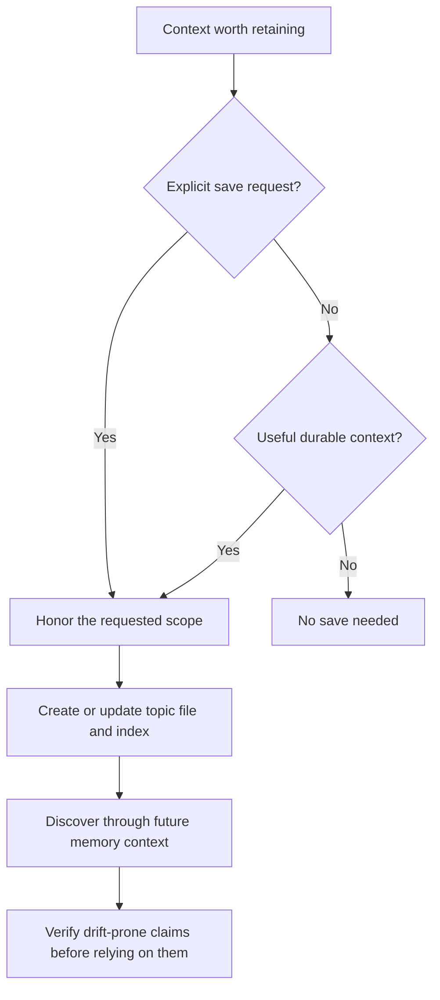

# Persistent Memory

mevedel reads persistent memory from configured `.mevedel/memory/` and
`.agents/memory/` roots, both workspace-local and user-global. Memory is
model-writable and persists across conversations, but it is
selective by default: optional saves should preserve durable context useful to
future work. Explicit user requests to save, forget, or ignore memory take
precedence over package preferences about what is worth retaining.

## Memory flow



## Layout

```
.agents/memory/
  MEMORY.md             ; delivered index
  user-style.md         ; topic file
  release-context.md    ; topic file
  external-systems.md   ; topic file
```

`MEMORY.md` is an index, not a body store. It is the only memory file
included in normal conversation context. Each configured root may
have its own `MEMORY.md`; the first 200 lines of every present index are
loaded in configured order and prefixed with the root label plus a
generated HTML comment describing the index file's last modification
date:

```markdown
<!-- Last updated: 2026-05-08 -->
- [User style](user-style.md) - communication preferences for this user
- [Release context](release-context.md) - current release coordination facts
```

Topic files hold the actual durable memories. `MEMORY.md` entries should
stay short, usually one line under about 150 characters:

```markdown
- [Title](file.md) - one-line relevance hook
```

## Topic Files

Each topic file uses YAML frontmatter:

```markdown
---
name: User style
description: Communication and review preferences for this user
type: feedback
---

Prefer terse completion responses after code edits.

**Why:** the diff and tests already show most routine details.
**How to apply:** summarize material outcomes, risks, and verification
instead of replaying every edit.
```

Supported `type` values:

- `user`: stable details about the user's role, goals, expertise, or
  durable preferences.
- `feedback`: guidance about how mevedel should approach work, including
  corrections and confirmed non-obvious successes.
- `project`: ongoing work, deadlines, ownership, incidents, or decision
  context not otherwise derivable from code, docs, or git history.
- `reference`: pointers to external systems such as ticket projects,
  dashboards, runbooks, or incident trackers.

Feedback and project memories should preserve enough context to be
actionable later. Prefer a direct rule or fact followed by `**Why:**`
and `**How to apply:**`.

## Save Policy

Ordinary saving is optional. Keep a useful preference, correction, decision,
coordination fact, or reference when it will help future work. Do not treat an
empty index as a task to fill, or infer a lasting preference from silence or an
ambiguous one-time reaction.

Avoid unsolicited activity logs, transient task state, speculative conclusions,
and duplication of easily recovered code, git history, or maintained project
docs. These defaults do not veto an explicit request to preserve a particular
fact. Avoid retaining secrets or unnecessary personal information; keep the
scope the user actually asked for.

Saving is a three-step operation:

1. Choose the correct memory root.
2. Create or update a topic file under that root.
3. Add or update the one-line pointer in that root's `MEMORY.md`.

Update existing memories in place. For new memories, use global memory
for cross-project user preferences or broad feedback, and local memory
for project-specific feedback, project context, or local references.
Prefer `.agents/memory/` for portable memories that other agent tools
can share. Use `.mevedel/memory/` for mevedel-specific behavior or
schema. Record known dates absolutely so relative wording does not drift.

When the user asks to remember something, save it within their selected scope
using the topic/index format. When they ask to forget, remove the relevant topic
content and pointer, preserving unrelated information. Do not invent an approval
gate solely because the requested fact is more ordinary than the default policy
would choose to save. A separately requested report-only review retains its
actual approval boundary.

## Prompt inclusion and delivery

The stable `memory-policy` owns relevance, authority, and freshness. The short
`memory-save-policy` requires reading this manual before any memory mutation,
including model-initiated saves. The manual owns format, routing, index updates,
and forget semantics; Read retrieves it as `mevedel://memory.md`.

Main and worker receive current configured roots and index contents as retained
context updates. Changed or removed indexes replace earlier observations for
current decisions without rewriting prior messages. Other role profiles receive
only the memory components they select. Stateless buddy prompts include their
current memory snapshot directly.

## Staleness

Memory is context, not proof. A memory that names a function, file,
command, flag, or external resource records what was believed when the
memory was written. Before recommending or acting on such a memory, the
model should cheaply verify it against current files, docs, git, or the
external system.

If the user says to ignore memory or not use memory, the model should
proceed as if `MEMORY.md` were empty. It should not apply remembered
facts, cite them, compare against them, or mention them.

## Review Skill

The bundled `$remember [focus]` skill reviews the memory landscape and
reports proposed cleanup, promotion, stale-memory, or ambiguity findings.
It looks at configured `MEMORY.md` indexes, linked topic files, other
memory topic files, and applicable `AGENTS.md` / `AGENTS.local.md`
files.

The skill is report-only. It should not edit memory unless the user
explicitly approves changes after seeing the report.
