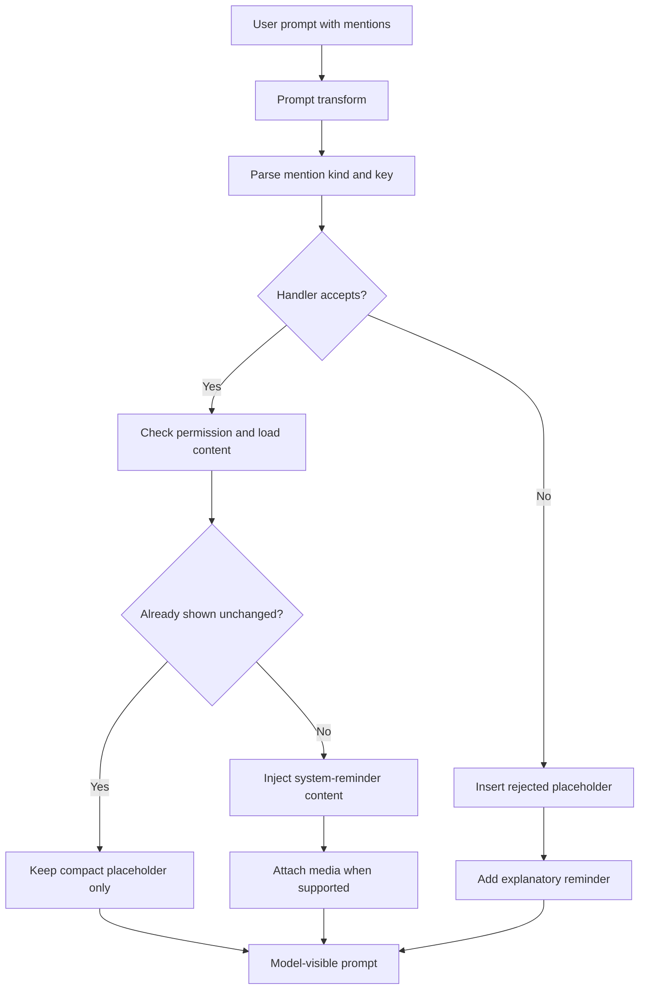

# @-mention system

Supports `@ref`, `@file`, `@agent`, `@mcp`.

Expansion runs as a gptel prompt transform (priority -90) via
`mevedel--transform-expand-mentions`, dispatching through
`mevedel-mention-handlers`. Each mention becomes a compact
`[kind:KEY -- STATUS]` placeholder with full content injected as a
`<system-reminder>` block above the user prompt.

Inline `$skill` attachment scanning lives next to this transform and reuses
the same placeholder plus `<system-reminder>` output path, but keeps a
separate parser because `$skill` quote, escape, and Markdown-code rules differ
from `@` mentions.

## Mention kinds

- **@ref:N** / **@ref:{tag query}** — refs by ID or tag
- **@file:path** / **@file:{path with spaces}** — hierarchical file
  completion inserts the bare form; drag/drop and clipboard image paste
  use the braced form when quoting is needed. Optional
  `#L<start>[-<end>]` pins a line range for text files (not recorded in
  touched-files, since LLM may still need other parts). Directories
  return a gitignore-filtered recursive listing
  (`rg --files --hidden --follow --sort path`) capped at
  `mevedel-file-mention-directory-max-entries` (default 1000). Text
  contents read via `mevedel-tool-fs--slurp-file-contents` (512 KB cap,
  line numbers).
  Supported media file types from the Read tool (`png`, `jpg`, `jpeg`,
  `gif`, `webp`, `pdf`) are attached through gptel context when the
  active model advertises compatible media support; otherwise the mention
  is rejected with an explanatory placeholder. Runs
  `mevedel-check-permission "Read"` first — any non-allow yields
  "permission denied". Missing and unreadable files are rejected.
- **@agent:name** — asks main agent to delegate via
  `Agent(subagent_type="NAME", ...)` (looked up in `mevedel-agent--registry`)
- **@mcp:server:uri** — attaches an MCP resource via mcp.el
  (`mcp-hub-get-servers`, `mcp-server-connections`, `mcp-read-resource`).
  URI capture is greedy past internal colons so `file:///...` works.
  mcp.el is optional (declared via `declare-function`).

Every rejection branch emits a follow-up `<system-reminder>` telling the
LLM the bracketed placeholder is a system annotation, not user text.

## Expansion flow

## Dedup

- Per-session: `mevedel-session-mentions-shown` keyed on `(KIND . KEY)`
  stores `(turn . content-hash)`; unchanged hashes skip re-injection and
  media reattachment
- Read dedup: `@file` records reads on `mevedel-session-touched-files`
  so later Read calls short-circuit

## Drag/drop grants

Dragging local files into the view buffer inserts visible `@file` mentions
and records pending exact-file grants on the session. During the next send
that still mentions the same expanded path, the grant becomes an
in-memory session-scoped `Read` grant for that exact path only. It does
not grant the containing directory, does not apply to write tools, and is
not persisted. Explicit deny or ask rules, protected paths, unreadable
files, and missing files still take their normal paths through the
permission chain. Pending grants are cleared when the composer is cleared.

## Clipboard images

`C-y` in the view composer saves a clipboard image to
`<workspace-root>/.mevedel/media/` and inserts an `@file` mention for it.
The saved image follows the same pending exact-file grant and media
attachment path as a dropped file. If no clipboard image is available,
`C-y` falls back to normal text yank.

## Completion

`mevedel-ref-capf`, `mevedel-file-capf`, `mevedel-agent-capf`,
`mevedel-mcp-capf` (two-stage: server names at `@mcp:`, resource URIs at
`@mcp:server:`). Font-lock uses `success`/`shadow`/`link` box faces.
Registered in `mevedel-install`/`-uninstall`.
