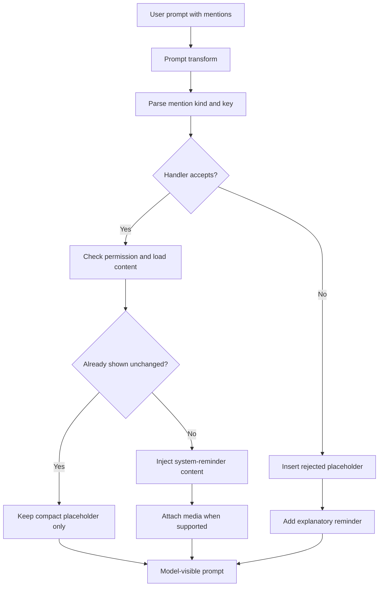

# @-mention system

Supports `@ref`, `@file`, `@agent`, `@mcp`.

Expansion runs as a gptel prompt transform (priority -90) via
`mevedel--transform-expand-mentions`, dispatching through
`mevedel-mention-handlers`. Each mention becomes a compact
`[kind:KEY -- STATUS]` placeholder with full content injected as a
`<system-reminder>` block above the user prompt.

Inline `$skill` attachment scanning lives next to this transform and reuses
the same placeholder plus `<system-reminder>` output path, but keeps a
separate parser because `$skill` quote, escape, and Markdown-code rules differ
from `@` mentions.

`mevedel-mention-bindings.el` owns the shared atomic binding lifecycle for
skills, direct references, files, and MCP resources. Kind-specific discovery,
resolution, content loading, permission checks, and request annotations remain
in the skill and mention modules.

## Atomic binding lifecycle

A binding is a hidden text property on the exact visible mention token. It
stores `:kind`, the unchanged `:token`, and one canonical locator:

- skill: canonical `SKILL.md` source pathname
- direct reference: reference UUID
- file: absolute expanded pathname
- MCP resource: configured server name plus resource URI

The binding preserves identity, not contents or authorization. Completion and
programmatic insertion bind immediately when the exact target is known.
Remaining manually typed mentions bind at send before async preparation,
queueing, or input-history insertion. A missing direct reference or unknown
skill remains unbound because no exact target is known; a file pathname and an
MCP server/URI pair can bind even while unavailable.
Reference queries intentionally remain unbound so every dispatch evaluates the
current matching set. Agent mentions also remain unbound because registered
agent names already provide their live identity.

Composer drafts, queued messages, retries, transcript prompts, history recall,
and persisted input history carry the propertized prompt string. Copying or
yanking a bound token inside mevedel preserves its locator; plain external text
has no property and follows normal send-time binding. Editing a token or
lexically extending it removes only that occurrence's binding. Edits elsewhere
and untouched copied occurrences retain theirs. Bindings add no face, badge,
lock state, indivisible token behavior, or permanent transcript warning.

At actual dispatch, each kind resolves only through its stored locator and
reads current target state and contents. It never falls back to a same-named
skill, reused reference number, different pathname, or different MCP server
name. Current file and MCP access checks still apply; binding is not approval.
Unavailable, deleted, disconnected, unreadable, or denied targets become
explicit annotations only in the temporary model request, emit a nonblocking
message, omit unavailable contents, and do not block the rest of the turn. The
composer, queue, transcript, and history retain the user's original text.

A malformed binding is corruption rather than ordinary unavailability. An
invalid plist, unsupported kind, mismatched token, partial property run, or
invalid lexical boundary blocks live submission so visible text cannot silently
retarget. Persisted history containing an incompatible or malformed binding is
quarantined by the corrupt-history path. The persisted format change is
intentionally breaking: there is no compatibility reader, migration, registry,
or sidecar binding store. Supporting another binding kind requires explicit
schema, send-time binding, and dispatch branches.

## Mention kinds

- **@ref:N** / **@ref:{tag query}** — direct references display their numeric
  ID but bind the selected reference UUID. Completion binds immediately;
  manually typed direct references bind at send when the reference exists.
  Queueing and input history preserve that UUID, while dispatch reads the
  reference's current contents. A deleted bound reference is annotated as
  unavailable with a nonblocking warning and never falls back to a reused
  numeric ID. Tag queries remain unbound and re-evaluate current matches at
  every dispatch.
- **@file:path** / **@file:{path with spaces}** — hierarchical file
  completion inserts the bare form; drag/drop and clipboard image paste
  use the braced form when quoting is needed. Completion and programmatic
  insertion bind an absolute pathname immediately; manually typed forms bind
  their expanded absolute pathname at send, even if it is currently missing.
  Dispatch reads current contents at that pathname. Replacing a file at the
  same path retains the target; moving or deleting it makes the bound target
  unavailable. Optional
  `#L<start>[-<end>]` pins a line range for text files (not recorded in
  touched-files, since LLM may still need other parts) and remains request
  syntax rather than part of the pathname locator. Directories
  return a gitignore-filtered recursive listing
  (`rg --files --hidden --follow --sort path`) capped at
  `mevedel-file-mention-directory-max-entries` (default 1000). Text
  contents read via `mevedel-tool-fs--slurp-file-contents` (512 KB cap,
  line numbers).
  Supported media file types from the Read tool (`png`, `jpg`, `jpeg`,
  `gif`, `webp`, `pdf`) are attached through gptel context when the
  active model advertises compatible media support; otherwise the mention
  is rejected with an explanatory placeholder. Runs
  `mevedel-check-permission "Read"` first — any non-allow yields
  "permission denied". Missing and unreadable files are rejected.
- **@agent:name** — asks main agent to delegate via
  `Agent(subagent_type="NAME", ...)` (looked up in `mevedel-agent--registry`)
- **@mcp:server:uri** — attaches an MCP resource via mcp.el
  (`mcp-hub-get-servers`, `mcp-server-connections`, `mcp-read-resource`).
  Resource completion binds the selected server-name/URI pair immediately;
  manually typed complete locators bind at send even while disconnected.
  Dispatch uses the current connection and current resource contents, so a
  reconnected or replacement configured server with the same name remains the
  same locator. Current MCP availability and server access behavior still
  apply, and read or access failure exposes no resource contents.
  URI capture is greedy past internal colons so `file:///...` works.
  mcp.el is optional (declared via `declare-function`).

Every rejection branch emits a follow-up `<system-reminder>` telling the
LLM the bracketed placeholder is a system annotation, not user text.

## Expansion flow

## Dedup

- Per-session: `mevedel-session-mentions-shown` keyed on `(KIND . KEY)`
  stores `(turn . content-hash)`; unchanged hashes skip re-injection and
  media reattachment. Direct references use their UUID as `KEY`, so changed
  contents are attached again without allowing displayed-number reuse to
  collide. Files use the absolute pathname plus requested line range; MCP
  resources use server name plus URI. The kind and exact locator prevent
  cross-kind collisions, while the current content hash causes changed content
  to be attached again.
- Read dedup: `@file` records reads on `mevedel-session-touched-files`
  so later Read calls short-circuit

## Drag/drop grants

Dragging local files into the view buffer inserts visible `@file` mentions
and records pending exact-file grants on the session. During the next send
that still mentions the same expanded path, the grant becomes an
in-memory session-scoped `Read` grant for that exact path only. It does
not grant the containing directory, does not apply to write tools, and is
not persisted. Explicit deny or ask rules, protected paths, unreadable
files, and missing files still take their normal paths through the
permission chain. Pending grants are cleared when the composer is cleared.

## Clipboard images

`C-y` in the view composer saves a clipboard image to
`<workspace-root>/.mevedel/media/` and inserts an `@file` mention for it.
The saved image follows the same pending exact-file grant and media
attachment path as a dropped file. If no clipboard image is available,
`C-y` falls back to normal text yank.

## Completion

`mevedel-ref-capf`, `mevedel-file-capf`, `mevedel-agent-capf`,
`mevedel-mcp-capf` (two-stage: server names at `@mcp:`, resource URIs at
`@mcp:server:`). Font-lock uses `success`/`shadow`/`link` box faces.
Registered in `mevedel-install`/`-uninstall`.
