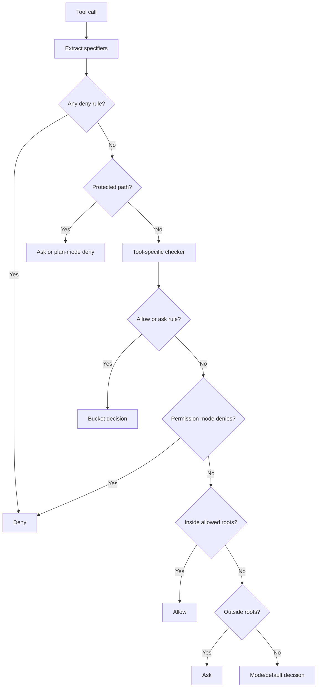

# Permission system

## Decision flow



Single decision function `mevedel-check-permission`. Nine-step chain:

1. Extract specifier values via `get-path` / `get-pattern` / `get-domain` /
   `get-name` slots
2. Deny rules (across all buckets — see bucket precedence below)
3. Protected paths (`.git/`, `.ssh/`, `.gnupg/`) → ask, or deny when
   Plan mode already hard-denies the non-read-only tool
4. Tool's own `check-permission` slot
5. Allow/ask rules (innermost-bucket-first — see bucket precedence below)
6. Permission mode hard-deny, currently Plan mode for non-read-only tools
7. Inside allowed roots → allow (implicit)
8. Outside allowed roots with no covering rule → ask
9. Permission mode/default decision

Hook integration sits around this chain:

- `PreToolUse` runs before the chain. A hook `deny` is final. A hook
  `ask` can tighten an allow into a prompt. A hook `allow` can only skip
  a prompt when the normal resolver would have returned `ask`; explicit
  denies still win.
- `PermissionRequest` runs after the chain returns `ask` and before the
  generic queued prompt is shown. It can allow, deny, or leave the prompt
  in place. Tools with specialized permission queues, currently Bash and
  Eval, make their prompt decision inside the tool permission slot instead
  of returning a generic `ask`.
- `PermissionDenied` runs after any final denial. It can adjust the
  reason/context shown to the model, but it cannot turn the denial into an
  allow.

Permission invocation context is normalized in the permission module before
callers enter the decision chain. That context centralizes specifier
extraction, rule buckets, mode, allowed roots, dropped-file exact grants,
missing-session fallback warnings, and the prompt rule shape used for
outside-root approvals.

The synchronous and asynchronous decision entry points then share one pure
preflight. It normalizes the decision facts and resolves absolute deny rules
and protected paths exactly once. Both paths use the same synchronous tool
slot adapter and decision tail; only a tool that supplies an asynchronous
permission callback introduces an asynchronous branch.

## Bucket precedence

Steps 2 and 5 consume rules from multiple buckets, in this order:
invocation `skill-permission-rules`, request `skill-permission-rules`,
session rules, persistent rules, defcustom `mevedel-permission-rules`.

- Step 2 (deny) is absolute — any bucket's `deny` wins.
- Step 5 (allow/ask) is innermost-first — the first bucket yielding any
  decision wins.
- Plan-mode exception: under `mode = plan`, the skill buckets are
  suppressed from step 5 for non-read-only tools (skill grants cannot
  bypass plan mode). Non-skill allow rules can still make an explicit
  allow decision before the mode hard-deny step, but ask decisions and
  implicit allowed-root grants cannot bypass plan mode.

## Rule format

Rules live on `mevedel-permission-rules` with form
`(TOOL-NAME &key SPECIFIER VALUE :action ACTION)`. One specifier per rule:

| Key        | Matches                | Used by                           |
|------------|------------------------|-----------------------------------|
| `:path`    | path (glob, `~` exp.)  | Read, Edit, Write, Glob, Grep, ...|
| `:pattern` | command string (glob)  | Bash                              |
| `:domain`  | host name (glob)       | WebFetch, YouTube                 |
| `:name`    | free-form name (glob)  | Agent (subagent_type)             |

Precedence: specifier rules outrank generic; within a group
`deny > ask > allow`; protected paths always prompt.

Modes: `default` / `accept-edits` / `plan` / `trust-all`. Slash-command
aliases normalize `ask` to `default`, `edit` / `edits` to `accept-edits`,
and `auto` to `trust-all`.

Prompt offers 5 choices (allow/deny × once/session/always). Persisted
rules live in `.mevedel/permissions.el`.

Default allowed roots are the workspace root, the system temporary directory,
configured memory roots, and session-added roots
granted through `RequestAccess`. These roots bypass the workspace-boundary
prompt but not explicit deny rules or protected-path prompts.

Files dropped into the view buffer can add exact, session-scoped `Read`
grants when the next sent prompt still mentions the same path. These
grants are in-memory only, do not grant the containing directory, do not
apply to write tools, and are still lower precedence than explicit deny or
ask rules and protected-path prompts.

Local slash commands may own deterministic workflows outside the model tool
pipeline. `/worktree status` and `/worktree create` run argv-safe local
Git commands directly because the user explicitly typed the command in the
mevedel UI. That does not grant the model any Bash permission. When the
model uses the `git-worktree` skill and falls back to creating a worktree
itself, creation happens through the normal Bash tool and this permission
chain.

## Prompt queues

Permission prompts are queued on the session, not displayed as
independent blocking overlays. `mevedel-permission-queue.el` owns a
heterogeneous FIFO with three entry kinds:

- `generic` for pipeline permission asks
- `bash` for Bash command confirmation
- `eval` for Eval expression confirmation

Only the head is visible in the view interaction zone. The permission UI
registers that head with `mevedel-view-interaction.el`, which owns ordering,
callback overlays, and redraw. Rule-creating outcomes (`allow-session`,
`deny-session`, `always-allow`) can coalesce
queued siblings by re-running the decision chain. The queue is transient
runtime state and is not written to the session sidecar; unfinished
prompts are aborted on request/session teardown.

`mevedel-permission-prompt.el` is the focused UI owner for all three entry
kinds. It owns generic permission controls, agent attribution, Bash guardian
and dangerous-command presentation, and Eval presentation. The queue retains
ordering and outcome semantics; the shared interaction primitive retains
overlay settlement and request cancellation.

Permission diagnostics are persisted to `permission-log.el` in the session
directory when `mevedel-permission-log-enabled` is non-nil. The log is
diagnostic only: resume never replays it into live permission state.
Entries recorded before first materialization are buffered transiently and
flushed when the session directory is created.

Each tool invocation that reaches permission checking records a sanitized
`permission-decision` event with fields such as tool name, origin, mode,
outcome, specifier, protected-path flag, resolver path, and rule bucket. It
does not include raw Write/Edit content, arbitrary tool args, or extra raw
Bash/Eval payloads. Prompt lifecycle events remain separate: queue
enqueue/resolve/abort/coalesce events describe prompt handling without raw
Bash commands or Eval expressions, and `RequestAccess`
create/resolve/cache events describe access-root prompts.

## Bash specifics

Bash has domain logic in `check-permission`: parses commands, enforces
`mevedel-bash-dangerous-commands` blocklist, fails safe under
`mevedel-bash-fail-safe-on-complex-syntax` on variable expansion /
`eval` / `exec` / here-docs / brace expansion. Bash does not use the
pipeline's generic permission prompt or `PermissionRequest` hook path;
when it needs a decision it enqueues a Bash-specific permission entry.
Under `trust-all`, unknown, dangerous, and complex Bash commands are
allowed without a prompt after explicit deny rules and literal protected
path tokens have been checked. Outside `trust-all`, unknown commands
default to ask. The dangerous blocklist only downgrades `allow` to
`ask`; explicit `deny`/`ask` wins.

Skill body shell expansion passes a trusted-literal flag for
author-written commands so the dangerous-command and complex-syntax
heuristics do not fire. Explicit deny rules still win.

### Bash guardian guidance

`mevedel-permission-guardian` can add model-reviewed risk guidance to
Bash prompts. Outside `trust-all`, it is advisory only: the normal
permission chain still decides `allow` / `ask` / `deny`, explicit deny
rules still win, plan mode and protected-path policy are unchanged, and
the user remains authoritative. In `trust-all`, the guardian is
deny-only for commands that the normal classifier would have treated as
suspicious; deny recommendations veto, while timeouts, failures, invalid
output, and non-deny recommendations allow by default.

Guardian guidance runs only after Bash resolves to `ask`. The permission
prompt is shown immediately with:

```text
Guardian guidance
Status: Analyzing command risk...
```

When guidance arrives, the same queued prompt is redrawn with risk,
recommendation, and reason. If the reviewer times out, fails, or returns
unparseable output, the section stays visible as:

```text
Guardian guidance
Unavailable
```

Set `mevedel-permission-guardian` to `t` to use the `guardian` workload
model tier from `mevedel-model-workload-tiers`, or to a custom
`(lambda (command context callback) ...)` classifier for tests or local
policy. `mevedel-permission-guardian-timeout` controls the wait for
reviewer output; the default is 20 seconds. The model prompt lives in
`prompts/permissions/bash-guardian.md`.

## Eval

Eval asks through the same session permission queue's Eval-specific
entry type unless the effective permission mode is `trust-all`. Like
Bash, it does not use the generic `PermissionRequest` hook path. The
expression shown in the prompt is subject to
`mevedel-eval-expression-display-limit`.  The prompt also shows the
requested execution mode and, for live Eval, whether UI preservation is
enabled.

Eval supports two execution modes.  `live` is the default and evaluates
inside the current Emacs process so the expression can inspect live
buffers, variables, windows, timers, advice, and package state.  Live
Eval restores the selected frame's window configuration by default;
callers can pass `preserve_ui: false` only when intentional UI
manipulation is desired.  `batch` starts a child `emacs --batch -Q`
process with the current `load-path` and the session working directory.
Batch Eval protects the interactive Emacs session from UI/global-state
mutation, but it is not a security sandbox: the expression still runs as
the same OS user and can touch files or processes.

Skill body elisp injections (`!el` inline and ` ```!el ` fenced blocks)
are the exception: they pass a trusted-literal flag because the
expression is author-written SKILL.md content, not model-generated Eval
input. A trusted elisp injection may bypass the prompt only when an
active unqualified `Eval` allow rule covers it, typically from the
skill's `allowed-tools: [Eval]`. Eval deny rules still win absolutely,
and plan mode suppresses skill-bucket Eval allows. Markers introduced
by argument substitution are not trusted literals and are left as text.
Literal markers may still contain substituted text in their expression
body; only the marker syntax and delimiters carry the trusted-literal
provenance.

## Sub-agent permission propagation

Sub-agent buffers carry `mevedel--session` set buffer-locally to the
**parent's session struct, by reference** (allocated in
`mevedel-agent-exec--allocate-agent-buffer`). The pipeline reads
`mevedel--session` from the current buffer at tool-dispatch entry, so a
tool dispatched inside a sub-agent observes the parent's
`permission-rules` and `permission-mode` slots, and any
"allow-session" / "deny-session" outcome accepted inside the sub-agent's
prompt is written via `setf` on the same struct -- so the new rule
applies immediately to the main agent and to every other live sub-agent.
This is a deliberate sharing contract; agents that should not be able to
mutate the shared state are constrained today by their tool list (e.g.
the verifier ships read-only tools, so its calls never reach the prompt
step).

All queued permission prompts render in the parent session's interactive
view buffer, not inside the sub-agent transcript buffer or a read-only
transcript inspection view. Queue entries carry an origin (`"main"` or
the canonical agent id), and request teardown only aborts entries owned
by the ending request. This keeps a background agent's visible prompt
open across parent-view rerenders and parent request cleanup until the
user explicitly resolves it or aborts the session/agent.

If the permission step ever runs without a session in context,
`mevedel-pipeline--step-permission` emits a `display-warning`
("Permission step for ... ran with no session in context"); that
fallback would silently consult only the defcustom-scoped global
defaults, which is the actual hazard. The warning surfaces it.

## Bash permission example

```elisp
(setq mevedel-permission-rules
      '(("Bash" :action ask)                       ; default ask
        ("Bash" :pattern "echo"     :action allow)
        ("Bash" :pattern "echo *"   :action allow)
        ("Bash" :pattern "ls"       :action allow)
        ("Bash" :pattern "ls *"     :action allow)
        ("Bash" :pattern "git log*" :action allow)
        ("Bash" :pattern "rm *"     :action deny)))

(setq mevedel-bash-dangerous-commands
      '("rm" "sudo" "dd" "chmod" "curl" "wget" "ssh"))
```

Use space-boundary patterns (`"ls"` + `"ls *"`) rather than `"ls*"` to
avoid matching `lsof`. Parseable: simple commands, chains (`&&`/`||`/`;`),
pipes, command substitutions (incl. nested), sudo/env/nice prefixes.
Fails safe: variable expansion (`$VAR`), `eval`/`exec`, here-docs, brace
expansion, unbalanced quotes.
