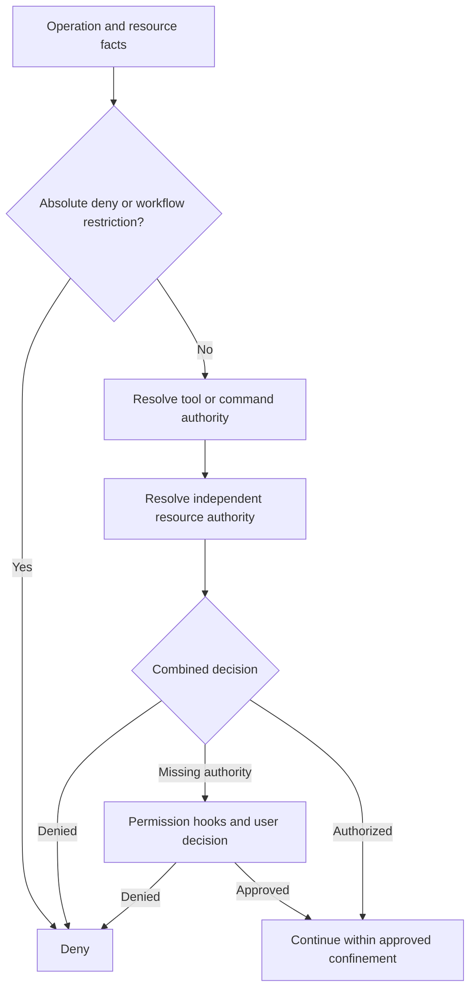

# Permission system

The subsystem has four owners. `mevedel-permission-mode.el` owns mode
normalization and session-scoped transitions; `mevedel-permission-rules.el`
owns rule matching, precedence buckets, protected-path policy, and resource
grants; `mevedel-permission-persistence.el` owns authority-store validation and
target-aware I/O. `mevedel-permissions.el` is the decision facade that combines
those facts with tool policy.

## Decision flow


```mermaid
flowchart TD
    Input[Operation and resource facts] --> Absolute{Absolute deny or workflow restriction?}
    Absolute -->|Yes| Deny[Deny]
    Absolute -->|No| Tool[Resolve tool or command authority]
    Tool --> Resource[Resolve independent resource authority]
    Resource --> Result{Combined decision}
    Result -->|Denied| Deny
    Result -->|Missing authority| Ask[Permission hooks and user decision]
    Result -->|Authorized| Allow[Continue within approved confinement]
    Ask -->|Denied| Deny
    Ask -->|Approved| Allow
```

The diagram shows authority composition; the ordered resolver below supplies the
exact precedence. Bash and batch Eval also resolve their child-confinement
capabilities before execution. An approval applies only within the requested and
approved scope; it cannot override an absolute denial or workflow ceiling.


Single decision function `mevedel-check-permission`. Decision chain:

1. Extract specifier values via `get-path` / `get-pattern` / `get-domain` /
   `get-name` slots
2. Deny rules (across all buckets — see bucket precedence below)
3. Workflow restrictions: standalone/sticky Plan denies native edit tools and
   Eval, except ApplyPatch whose every operand is a session-owned `work://`
   descendant. Directive Planning denies all native edits and Eval. These
   restrictions apply regardless of allow rules or permission mode.
4. Tool's own `check-permission` slot decides command authority
5. Allow/ask rules (innermost-bucket-first — see bucket precedence below)
6. For a path not directly covered by a native path rule, resolve an allowed
   root, exact allowed path, or covering resource grant
7. A protected or outside-root path without that authority → ask
8. Permission-mode fallback when no earlier policy decides; satisfied resource
   authority does not itself authorize a mutating operation

The permission mode itself never denies: modes decide between automatic
allowance and a prompt, and every hard denial is a step-2 or step-3 policy.
ApplyPatch is the deliberate exception to step 8. Its reviewed-edit capability
is allowed because `ask` mode already supplies mandatory per-file/hunk review
before any write. Allowed-root patches therefore proceed directly to that
review. Protected or outside-root paths still require resource authority before
the review appears, and explicit allow/ask/deny rules retain their precedence.

For a tool with a command checker, command authority and filesystem resource
authority are layered: both must allow. A command rule cannot authorize its
path, and a resource grant cannot authorize its command. Native `:path` rules
remain direct tool authorization, but cannot bypass a protected path's
resource-grant requirement.

Hook integration sits around this chain:

- `PreToolUse` runs before the chain. A hook `deny` is final. A hook
  `ask` can tighten an allow into a prompt. A hook `allow` can only skip
  a prompt when the normal resolver would have returned `ask`; explicit
  denies still win. The resulting `ask` still crosses `PermissionRequest`
  once before that earlier allow suppresses queue admission.
- `PermissionRequest` runs whenever generic, Bash, Eval, or sandbox authority
  resolution reaches `ask`, before the corresponding entry enters the shared
  queue. It can allow, deny, or leave the prompt in place. Queue display and
  rule-driven re-evaluation do not rerun it.
- `PermissionDenied` runs after any final denial. It can adjust the
  reason/context shown to the model, but it cannot turn the denial into an
  allow. Its payload identifies the original policy, user, `PreToolUse`, or
  `PermissionRequest` provenance.

Permission invocation context is normalized in the decision facade before
callers enter the decision chain. That context centralizes specifier
extraction, rule buckets, mode, allowed roots, resource grants,
missing-session fallback warnings, and the prompt rule shape used for
outside-root approvals.

## Resource-address authority

A resource address identifies a target; it is not a permission grant. After
repair and final validation, resource preparation resolves an opaque attempt
and only the logical authority facts needed here, without reading content.
Permission then applies the ordinary operation policy before the authorized
handler consumes that attempt. Malformed or unsupported addresses, traversal,
and containment failures stop before permission and post-use hooks; a valid but
missing, disconnected, stale, or unreadable resource follows ordinary handler
failure handling.

Read-only `artifact://`, `skill://`, `agent://`, `history://`, `memory://`, and `memory://journal/`
resources keep their intrinsic read capability and current freshness rules.
`work://` and explicit memory-file mutation use ordinary `ApplyPatch` permission
and patch review. Shared and memory operands use their real backing paths for
protected-path and workspace-boundary decisions;
recognizing an address does not broaden roots or create a grant. Skill and
memory addresses retain client-local origin, while MCP authority remains with
the current configured connection. Standalone/sticky Plan mode allows session-only
`ApplyPatch`, including requests from retained agents, but denies any proposal
containing an ordinary, shared, memory, or bare endpoint before local materialization
or ordinary mutation. Mixed local/ordinary and ordinary-only proposals
therefore fail tree-wide; permission modes and allow rules cannot reopen that
boundary. See
[`address-to-resource.md`](address-to-resource.md#shared-resolution-and-permission-seam).

The synchronous and asynchronous decision entry points then share one pure
preflight. It normalizes decision facts, resolves absolute deny rules, and
records protected-path and resource-boundary facts exactly once. Both paths
use the same synchronous tool slot adapter and decision tail; only a tool that
supplies an asynchronous permission callback introduces an asynchronous
branch.

## Bucket precedence

Steps 2 and 5 consume rules from multiple buckets, in this order:
invocation `skill-permission-rules`, request `skill-permission-rules`,
session rules, persistent rules, defcustom `mevedel-permission-rules`.

- Step 2 (deny) is absolute — any bucket's `deny` wins.
- Step 5 (allow/ask) is innermost-first — the first bucket yielding any
  decision wins.
- Directive discussion installs request-scoped denies for every registered
  mutation-capable tool and for mutation-capable delegation. These denies are
  a hard capability ceiling: broader session, workspace, or global allows
  cannot enable mutation during that discussion request.
- Goals use the same tool permission policy as ordinary root conversation
  turns. Goal lifecycle state never raises the session permission mode.
- Standalone Plan approval applies the selected Ask, Edits, or Full Auto mode to
  the session that performs Direct implementation. Here changes the source
  session; Worktree leaves the source mode unchanged and applies the selection
  only after the target session and accepted artifact are prepared. Summary
  generation does not raise either session's permission mode.

## Rule format

Rules live on `mevedel-permission-rules` with form
`(TOOL-NAME &key SPECIFIER VALUE :network BOOL :file-system GRANTS
:sandbox-permissions LEVEL :action ACTION)`.
One specifier per rule:

| Key        | Matches                | Used by                           |
|------------|------------------------|-----------------------------------|
| `:path`    | path (glob, `~` exp.)  | Read, ApplyPatch, Glob, Grep, ... |
| `:pattern` | command/expression glob | Bash; full-escalation Eval rules |
| `:domain`  | host name (glob)       | WebFetch, WebSearch               |
| `:name`    | free-form name (glob)  | Agent (`role`)                    |

Precedence: specifier rules outrank generic; within a group
`deny > ask > allow`. Protected paths prompt unless a covering resource grant
with sufficient access already exists.

`:sandbox-permissions` is an execution-level qualifier, not a request to raise
authority. A rule carrying `require-escalated` is considered only after Bash or
batch Eval has explicitly requested that level. Ordinary command allows cannot
authorize full escalation. Only direct user-authored session, persistent, and
defcustom rules may allow it; delegated invocation/request rules cannot. A
pattern scopes authority to the matching Bash command or Eval expression, and
omitting the pattern deliberately authorizes every expression for that tool at
that execution level. Qualified and ordinary explicit denies remain final.

`:network` and `:file-system` form an execution permission profile on a
matching Bash or batch-Eval allow rule. The profile records the additive child
authority approved with that operation; it is not a workload classifier.
Single-segment Bash approvals may use the recognized safe command pattern.
Compound commands keep generalized operation rules for their segments but
store the profile against the complete compound command, preventing one
segment from inheriting another segment's capability.
Filesystem entries are `(:path PATH :access read-or-write [:recursive t])`
requirements. `PATH` is either absolute or home-relative with `~`/`~/`; stored
home-relative paths expand in the execution target. Grant paths are literal —
`*`, `**`, and `?` carry no glob meaning; `:recursive t` extends an entry from
the exact path to the directory and all its descendants, present and future.
Project and session stores
encode exact paths and absolute path rules without a client-specific TRAMP
prefix, then qualify them through the currently opened matching target. A
foreign target prefix invalidates the stored authority instead of being
reinterpreted. Entries become effective only while an equally strong direct
resource grant still exists: a recursive requirement is met only by a
recursive direct grant containing it, while a recursive direct grant also
satisfies an exact requirement for any descendant. Multiple matching profiles
are unioned, with write dominating read for the same path and scope; exact and
recursive entries on the same path stay distinct. Only session, persistent,
and defcustom rules can contribute a reusable profile. Invocation- and
request-scoped delegated rules may still authorize ordinary operations but
never broaden the child sandbox.

`mevedel-protected-paths` is an alist from glob to `read-only` or
`inaccessible`. The default `.git` glob is read-only; the default SSH, GnuPG,
AWS, Azure, Google Cloud, and Kubernetes credential globs are inaccessible. On
a trailing `/**`, policy covers both the directory and its descendants. On a
remote session, leading `~` uses the target user's probed home; a
client-absolute custom pattern stays in the client path domain and therefore
does not become a remote protection rule.
String-only entries are invalid by design. Glob discovery walks the
workspace, memory, and additional writable roots before every launch; the
execution target's temporary directory is excluded as a discovery root. A
workspace or additional root beneath it is still searched when independently
listed. Other repositories placed only in temporary scratch do not receive
glob-discovered protection.

The three canonical modes are `ask`, `edits`, and `full-auto`:

- `ask` allows recognized inspection, sends ApplyPatch directly to its
  mandatory review when its paths are authorized, and prompts for other edits
  and uncertain Bash or Eval execution.
- `edits` additionally applies native edits inside allowed roots, but grants no
  blanket Bash or Eval authority.
- `full-auto` bypasses heuristic Bash and Eval prompts, including live Eval,
  while explicit denies and protected resources without exact authority still
  win.

Configuration, interactive commands, and persisted sessions accept only these
canonical values.

The prompt offers allow/deny choices for the invocation, session, or persistent
workspace scope. When one Bash or batch-Eval call needs both operation and
additive authority, one card presents the complete request. Session and
workspace approval default to remembering the complete selected profile;
command, network, and individual path toggles can narrow it before approval.
The current invocation always receives the complete approved request.
`.mevedel/permissions.el` stores a plist containing both `:rules` and
`:resource-grants`. It lives with the project on its execution target and stores
target-native paths, so reopening the same workspace through an equivalent
TRAMP alias reuses its authority. Paths under the target's home directory are
written abbreviated as `~/...` and expanded against the current target at
load, so the file can be committed and shared between machines whose home
directories differ. A target-incarnation change never rewrites this file; only
session-scoped exact grants are revoked. Both global and project stores belong
to the session's execution target:

| Session | Global store | Project store |
| --- | --- | --- |
| Local | `mevedel-user-dir/permissions.el` (default `~/.mevedel/permissions.el`) | `PROJECT/.mevedel/permissions.el` |
| TRAMP | Target user's `~/.mevedel/permissions.el` | Target's `PROJECT/.mevedel/permissions.el` |

Both stores contribute `:rules` and `:resource-grants`. Global and project
rules share the persistent rule bucket and its ordinary matching precedence;
explicit denies still win. Resource grants are additive, retaining their read
or write access and exact or recursive extent. Paths in either store refer to
the execution target, including `~` and filesystem requirements in command
profiles. Durable files use native paths, without client-specific TRAMP prefixes.
Local `mevedel-user-dir` customization does not relocate remote stores.

A remote session does not inherit the client's global file, even if its target
global file is missing or unavailable. Global authority is read at runtime,
not copied into a project or portable session. Store replacement is atomic
and descriptor-pinned; a symlink in the state path or at `permissions.el`
fails closed before any linked target is changed.

Global and project stores are validated when a fresh, resumed, or forked
session initializes. Invalid files contribute no authority and produce one
actionable warning per file version. Persistent permission changes refuse to
overwrite an invalid file; fix it to the current
`(:rules (...) :resource-grants (...))` shape first. Missing files are valid
empty stores.

Before each permission-controlled tool, mevedel refreshes both stores once and
uses that snapshot for every rule and resource-grant lookup in the invocation.
A remote refresh waits until the transport is idle, so it cannot re-enter a
TRAMP command already in flight. Thus an external edit or revocation, including
one made by another Emacs in a different session for the same project, governs
the next tool admitted by this Emacs. An already admitted tool keeps its prior
decision. Frozen `/btw` conversations retain their documented creation-time
authority snapshot.

Default allowed roots are the workspace root, the system temporary directory,
configured memory roots, and manually configured additional roots. A native
filesystem operation outside those roots prompts for exact `read` or `write`
authority. A session grant is stored in the durable session sidecar and
survives save/resume of that same session; an always grant is stored only in
the workspace permission file. Neither enters an unrelated session. ApplyPatch
authority covers reading the same exact path, but read authority does not cover
writes. An exact grant does not cover siblings or descendants; a grant carrying
`:recursive t` covers the directory and everything beneath it, present and
future. Prompts and the cockpit label every grant `(exact)` or `(recursive)`,
and a remembered execution profile's row lists its child grants after the
pattern. Neither kind
adds workspace roots or authorizes Bash/Eval code. Revoking the grant restores
the underlying
workspace/protected-path restriction unless another entry still grants access.
Session-side paths use the same target-native codec as persistent authority;
resume reloads the target's global and project stores. Invocation-only authority is consumed
by the approved call and is not stored.

The permissions cockpit shows `session`, `workspace`, and `global` entries,
including their backing store in the details. Refresh reads current stores.
Revoking a global entry edits the target user's global file and affects every
project using it; revoking a workspace entry edits only that project's file.
Identical entries in different scopes remain separate and independently
revocable. Global entries are authored explicitly: prompt-based remembering
continues to write only session or workspace authority.

The permission card keeps the original request visible. Press `g` to select
the exact resource or an existing containing directory tree, including a higher
ancestor, and its read/write access. For several execution resources, first
choose which resource to change. The card shows the selected path in the
execution target's native notation and labels exact and recursive scope.
Selection alone neither creates a grant nor runs the tool. `RET` approves the
current invocation, `s` remembers session authority, and `A` remembers workspace
authority; one-shot interactions retain only their permitted lifetime choices.
Approving a tree installs its grant before checking queued siblings. Rechecks
retain the originating tool buffer and delegated rules, and a captured hook ask
continues to require its own answer.

Read-only tools also receive mevedel's installed package source directory as
an allowed root, so the model can read bundled manuals named by an absolute
tool-description path. Mutation-capable tools do not receive this root; an
installed package outside the active workspace therefore remains outside their
automatic edit boundary.

A conversation or worktree session fork copies the source session's permission
mode, sandbox mode, session permission rules, and resource grants at the fork
point. Subsequent authority changes are local to the source or fork unless they
modify the shared workspace permission store.

An ephemeral `/btw` side also copies that policy, but every side request carries
an immutable one-shot mutation boundary. Analyzer-proven read-only Bash and
read-only tools remain automatic when the ordinary policy allows them. Other
mutations ask even under `full-auto` or an inherited allow rule, and the prompt
offers only allow-once, deny-once, or feedback; defensive outcome normalization
prevents hooks or non-UI callers from creating reusable authority. ApplyPatch's
mandatory hunk review itself satisfies this boundary, so it does not show a
duplicate generic permission prompt. Explicit denies and protected-resource
checks still precede approval. Oversized side tool results are bounded and
discarded in memory rather than materializing an ephemeral session on disk.
The side publishes only explicit file/search/code/web inspection tools,
ApplyPatch, Bash, and managed-execution controls. Eval, delegation, Ask,
tasks, Goals, skills, introspection tools, deferred tools, and arbitrary
MCP tool schemas are absent.

The side freezes session, workspace-persistent, global-rule, protected-path,
sandbox, and additional-root authority at creation; later configuration changes
cannot broaden or narrow it. Mutation approval warns when the parent request is
still active because both requests affect the same workspace. The side owns a
separate permission queue and execution state, while allowlisted redacted audit
events are attributed to `/btw` and written through the durable parent session.
Side prompts, command text, paths, patch contents, results, and justifications
are never copied into that parent audit stream.

Files dropped into the view buffer can add exact, session-scoped `Read`
grants when the next sent prompt still mentions the same path. These
grants are in-memory only, do not grant the containing directory, do not
apply to write tools, and are still lower precedence than explicit deny or
ask rules and protected-path resource checks. A queued steering entry or
follow-up activates its grant before its own mention expansion, which
needs it to read the dropped file, so the grant is provisional until that
entry is delivered: an entry that fails to deliver stays pending and its
grant is given back.

Local slash commands may own deterministic workflows outside the model tool
pipeline. `/worktree status` and `/worktree create` run argv-safe Git commands
directly on the session execution target because the user explicitly typed the
command in the mevedel UI. That does not grant the model any Bash permission.
When the model uses the `git-worktree` skill and falls back to creating a
worktree itself, creation happens through the normal Bash tool and this
permission chain.

## Prompt queues

The root session owns one authority boundary for its complete agent tree. Every
child uses the root session's permission mode, sandbox mode, user-authoritative
permission rules, and resource grants. A child may exercise that existing
authority but cannot broaden it independently. Permission prompts from the
complete tree are therefore queued on the root session, not displayed as
independent blocking overlays, and carry the requesting agent's canonical path
for attribution. Nested ToolCall asks instead show their envelope and child
tool-use identities, including for root-owned requests.
`mevedel-permission-queue.el` owns a heterogeneous FIFO with four entry kinds:

- `generic` for pipeline permission asks
- `bash` for Bash command confirmation
- `eval` for Eval expression confirmation
- `sandbox` for additive network, exact filesystem, or full execution authority

Only the head is visible in the view interaction zone. The permission UI
registers that head with `mevedel-view-interaction.el`, which owns ordering,
callback overlays, and redraw. Rule-creating outcomes (`allow-session`,
`deny-session`, `always-allow`) can coalesce
queued siblings by re-running the decision chain. Resolved siblings leave the
queue before any callback runs. Execution admission and rechecks share one
pure decision in `mevedel-tool-exec-permission.el`: it orders operation
policy, guardian review, full escalation, denied capabilities, command
resources, and missing capabilities, and names the one thing that still
stands in the way. Admission resolves that need with a prompt or guardian
review and decides again; a recheck reports it as a pending ask. Rechecks
therefore cover the operation and its complete requested filesystem/network
authority, including capabilities that were already granted at admission. They retain the originating request,
agent invocation, Plan restrictions, and frozen policy context. An operation
rule alone cannot release a sibling that still lacks a capability; a directory
grant alone cannot release an uncertain command in edits mode. Every queue exit
uses the permission
queue's exactly-once settlement gate. The queue is transient
runtime state and is not written to the session sidecar; unfinished
prompts are aborted on their owning request or root-session teardown. A child
turn awaiting one of these prompts remains active and continues to occupy one
tree capacity slot.

The permission hook boundary precedes queue admission. An admitted entry has
already fired `PermissionRequest`; rendering the head, redrawing it, and
coalescing siblings by re-running policy never fire that hook again.

`mevedel-permission-notify-function` (default nil) is called once per admitted
card with its entry plist, at admission -- never for decisions the rule chain
or hooks settle without prompting, and never again on head redraw, coalesce,
or resolution. Only prompts the user must answer notify, never auto-resolved
tool calls; how many that is per session depends entirely on the session's
permission mode and rules. It fires at enqueue rather than after an
unanswered delay because the machine is certainly awake then; an
idle-escalation timer dies with a suspend, which is exactly the situation --
the user stepped away, the machine slept on an open prompt -- the hook exists
for. Errors are demoted so a broken notifier cannot break admission.

The value is always a small wrapper that formats a message from the entry;
the entry carries mevedel's card keys, not a notification API's keywords, so
pointing the variable directly at `notifications-notify` shows an empty
notification.

```elisp
;; One formatter, reused by every wrapper below.  A notification is a
;; glance surface: name the session, name the tool, and give one
;; truncated line of the command -- never the whole thing.
(defun my/mevedel-permission-summary (entry)
  (let ((session (plist-get entry :session)))
    (format "%s%s: %s"
            (if session (concat (mevedel-session-name session) " ") "")
            (or (plist-get entry :tool-name) (plist-get entry :kind))
            (truncate-string-to-width
             (replace-regexp-in-string
              "[ \t\n]+" " "
              (or (plist-get entry :command)
                  (plist-get entry :expression)
                  (plist-get entry :specifier-value)
                  ""))
             110 nil nil t))))

;; Desktop notification via Emacs's built-in DBus client
;; (notifications.el ships with Emacs and talks to the same
;; freedesktop daemon notify-send does):
(require 'notifications)
(setq mevedel-permission-notify-function
      (lambda (entry)
        (notifications-notify
         :title "mevedel needs permission"
         :urgency 'critical
         :timeout 0
         :body (my/mevedel-permission-summary entry))))

;; The same through the notify-send binary; destination 0 makes
;; call-process fire-and-forget:
(setq mevedel-permission-notify-function
      (lambda (entry)
        (call-process "notify-send" nil 0 nil
                      "--app-name=mevedel" "--urgency=critical"
                      "--expire-time=0"
                      "mevedel needs permission"
                      (my/mevedel-permission-summary entry))))

;; Phone push through ntfy, for the prompt that opens after you have
;; left the desk:
(setq mevedel-permission-notify-function
      (lambda (entry)
        (call-process "curl" nil 0 nil "-s"
                      "-d" (my/mevedel-permission-summary entry)
                      "https://ntfy.sh/YOUR-TOPIC")))
```

The desktop wrappers request a non-expiring critical notification.  The
notification server may ignore the timeout hint.

`mevedel-permission-prompt.el` is the focused UI owner for all four entry
kinds. It owns generic permission controls, agent attribution, Bash guardian
and dangerous-command presentation, and Eval presentation. The queue retains
ordering and outcome semantics; the shared interaction primitive retains
overlay settlement and request cancellation.

A Bash command longer than `mevedel-permission-command-display-limit` (400
characters) and an Eval expression longer than
`mevedel-eval-expression-display-limit` (20 lines) are elided in the prompt
behind a `TAB` toggle, which names how much is hidden and re-renders the queue
head in place. Only the command or expression body elides: agent attribution,
the guardian verdict, the detected-command summary, the patterns a
session/always allow would add, and every warning stay visible, because those
are what the decision rests on. The `mevedel--remote` descriptor a browser
collaborator reads always carries the whole command, elided or not -- a guest
has no `TAB` to press and must not approve what it cannot see. Both surfaces
show the captured admission mode, approval cause, and selected resource scope,
including directory selections on one-shot cards without remembering controls.

`mevedel-bash-policy.el` supplies Bash classification, reusable rule patterns,
and guardian guidance. `mevedel-tool-exec-permission.el` combines that policy
with the generic permission chain, persists approved authority, and adapts
Bash and Eval decisions to the permission queue. Execution and rendering stay
in `mevedel-tool-exec.el`.

Permission diagnostics are persisted to `permission-log.el` in the session
directory when `mevedel-permission-log-enabled` is non-nil. The log is
diagnostic only: resume never replays it into live permission state.
Entries recorded before first materialization are buffered transiently and
flushed when the session directory is created.

Each tool invocation that reaches permission checking records a sanitized
`permission-decision` event with fields such as tool name, origin, mode,
outcome, specifier, protected-path flag, resolver path, and rule bucket. It
does not include raw ApplyPatch content, arbitrary tool args, or extra raw
Bash/Eval payloads. Prompt lifecycle events remain separate: queue
enqueue/resolve/abort/coalesce events describe prompt handling without raw
Bash commands or Eval expressions.

Each queued card gets a `:permission-id` at admission, separate from the owning
`:request-id` and nested tool-call identifiers. Its captured
`:permission-mode-base` and `:permission-mode-effective` remain unchanged when
the user changes modes while the card is pending. Eval's live/batch choice is
recorded separately as `:eval-mode`. The visible card shows the admission mode
and the cause supplied by the policy owner: mode-based operation judgment,
resource boundary, protected resource, explicit ask rule, hook, missing
additive filesystem/network authority, or execution without confinement.

Count `permission-displayed` to measure actual initial card displays. Admission
is `permission-enqueued`; refreshing a card's scope, queue count, or guardian
guidance does not emit another display. Each admitted request settles once as
`permission-resolved` for a user answer, `permission-coalesced` for a covering
policy decision, `permission-swept` for owner-request teardown, or
`permission-aborted` for cancellation, queue abort, or rendering failure.
`:settlement-source` distinguishes these paths. A crash may leave an admission
without a terminal record; that is an unrecorded outcome, not an approval.

The permission log retains `:resource-originals` and `:selected-resources`,
including path, read/write access, and `:recursive` extent (nil means exact),
plus `:approval-lifetime` for invocation, session, or workspace approval.
Unified telemetry retains the categorical identity, mode, cause, outcome, and
lifetime fields, while its allowlist drops resource paths and capability
payloads. Forwarded side-conversation events use the same categorical fields;
feedback is recorded as a denial outcome without copying the user's text.

## Bash specifics

Bash analysis returns a normalized command class, structured argument vectors,
parser source, literal resources, and human-readable reasons.  It uses a
normally configured Bash Tree-sitter grammar when available and a conservative
scanner otherwise.  Redirections, substitutions, expansions, assignments,
subshells, here-documents, control flow, parse errors, and unsupported operators
are complex.  A dangerous component takes precedence in a compound request.
Read-only classification uses argument-aware built-in policies. Git has no
built-in read-only classification because repository and system configuration
can attach helper processes to inspection commands; it requires explicit Bash
authority even when its argv looks read-only. Find, ripgrep, base64, sed, and
awk reject deletion, helper execution, output-file options, and unrecognized
programs. Safe forms need no broad default allow patterns; variants outside
these narrow policies remain unknown.
Bash keeps its specialized permission entry and controls, but an `ask` passes
through the pipeline's shared `PermissionRequest` boundary before that entry
is admitted.
Under `full-auto`, unknown, dangerous, and complex Bash commands are
allowed without a prompt after explicit deny rules and literal protected
path tokens have been checked. Outside `full-auto`, unknown commands
default to ask. Direct user-authored session, persistent, and defcustom
patterns may authorize dangerous or complex forms. Invocation- and
request-scoped delegated patterns may not. Explicit denies always win.
When a prompted dangerous command is literal and contains no dynamic shell or
glob ambiguity, session/workspace remembering stores the complete command
exactly. Ambiguous commands remain invocation-only; users may still author
broader rules directly.

### Child confinement

Bash, batch Eval, and native external tool helpers share the guarded child
launcher and, independently of the permission mode, consult
the session's `mevedel-sandbox-mode`. On Linux, `best-effort` resolves
`bwrap` with `executable-find` and caches a real probe of the core mount, user,
process, and network namespaces. Each probe attempt defaults to a 500 ms bound
and retains at most 64 KiB of combined diagnostics. If the full probe fails,
Mevedel retries without replacing `/proc`. A successful retry retains the
mount, user, process, and network boundary while exposing the host `/proc`
view; pending and execution facts record `proc: host` instead of treating the
whole backend as unavailable. A full successful profile mounts `/` read-only,
rebinds the workspace, temporary directory, memory roots, manually configured
roots, and session working directory writable, installs a fresh `/proc`, and
changes to the canonical working directory. Its private `/dev` supplies
`/dev/null` without host authority; redundant additive grants for that device
are ignored rather than remounted. The default profile also isolates the
network. A justified additive network request prompts in `ask` and `edits`,
proceeds automatically in `full-auto` after command authorization, and changes
only network isolation for that invocation. The namespace and mount boundary
is inherited by descendants.

Native tools pass already-authorized input and search paths to the launcher as
read-only mounts and pass only their generated-artifact directories as writable
roots. Each invocation also gets a private writable scratch directory, which is
removed on settlement. This currently covers `diff` for previews, `rg` for
Read directory listings, Glob, and Grep, and `pdfinfo`, `pdftoppm`, and
ImageMagick for Read media handling. These helper profiles are chosen by native
code; they do not add model-facing escalation arguments or another permission
prompt. Live Emacs operations, long-lived language servers, hooks, and
user-triggered Git, clipboard, and UI helpers are not external tool helpers.

An exact filesystem grant may name a symlink. The launcher opens the granted
path but mounts its canonical target, leaving the requested command and symlink
chain unchanged while avoiding Bubblewrap mounts onto symlink entries. Before
Bubblewrap starts, the target-side launcher compares the device/inode identity
of each already-open descriptor with the identity captured during grant
resolution. A failed open, missing descriptor stat support, or replacement
mismatch refuses the child; `best-effort` does not retry that authority failure
as an unrestricted launch. Beneath a masked parent it recreates only the link
hops and empty traversal directories needed to reach that exact target.

An inaccessible file is masked by a private empty file with mode 000, then
mounted read-only. Dedicated launcher descriptors supply the empty contents;
the child's stdin remains available. No chmod is applied to a host inode or an
already read-only bind. Multiple masks and exact file additions share the
existing descriptor-backed launcher with distinct descriptor numbers.

Bubblewrap cannot add authority for only a directory inode: binding a directory
also exposes its descendants. Exact directory write grants, and exact directory
read grants beneath inaccessible masks, therefore refuse preparation with a
message identifying the directory and the prompt's recursive-scope selection.
An exact directory read already available through the baseline filesystem adds
no mount. An explicitly approved recursive grant subsumes redundant exact
mounts, without merging their separate identities in the authority store.

A justified additive filesystem request names exact absolute paths and marks
each as read or write. Ungranted paths prompt in every permission mode;
invocation, session, and persistent approvals use the same resource-grant
store as native filesystem tools. Reusable approval also records those
requirements in the matching operation profile. The card's `g` selection can
broaden a requested file or directory to a containing tree. Both the current
child and a selected remembered profile receive that explicit extent. Narrowing
the remembering toggles does not narrow the current invocation's approval.
The default remembered selection includes every requested capability, including
ones already granted before the card appeared. The network and path toggles
therefore cover the complete request, rather than only its missing additions.
Recursive profile entries carry `:recursive t`, exposing the directory tree
through one bind mount at the selected access level; model-facing requests
name exact paths only. A
later matching default call
reattaches a path only while both the profile and a sufficient direct resource
grant remain — recursive requirements need a recursive grant containing them —
and removing either immediately restores confinement. Approved paths
are rebound at only the requested access level. A grant that contains a
protected descendant is bound before that descendant is masked; all other
grants are bound after protected masks are installed. An explicit write grant
supersedes the read-only restriction at that exact mount, including when the
mount precedes protected children. It does not remove those children's masks.
Inaccessible parents
expose traversal only far enough to reach the named mount, so their contents
and sibling resources remain hidden. Command or Eval authorization is resolved
independently and is never supplied by the resource grant. Explicit path denies
remain final. Network and filesystem additions may be combined without
changing any unrequested confinement boundary.

Protected linked-worktree `.git` pointers resolve both the worktree metadata
directory and its `commondir` target. Both retain the applicable protection.
Failed confined results identify the discovered shared metadata location for
objects and refs; this is repository-layout information, not a diagnosis
inferred from stderr or an automatic grant. A new explicit invocation can
request the missing scope.
Before Bash or batch Eval starts, one shared resolver merges capabilities
explicitly requested by that invocation with every matching direct
session/workspace/global profile. A non-empty effective profile promotes
`use_default` to additive confinement; `require_escalated` is never changed.
This resolution happens both during permission checking and immediately before
child launch. It never applies to live Eval. A capability not present in a
matching approved profile is not inferred from failures or earlier commands:
the model must make a new explicit invocation with the missing capability and
justification. A started process is never replayed.

Before Bash executes, identified literal resources are resolved against the
working directory. Resources outside the allowed roots require a covering
additive grant — exact, or recursive over an ancestor directory; bare `.` and
`..` operands participate in this check. Command
authorization is resolved first so an explicit command deny retains precedence.
Provider-shaped empty optional fields, such as disabled network plus empty
filesystem lists, are treated as omitted rather than as an authority request.
Non-empty additions still require `with_additional_permissions` and a
justification.

`require_escalated` is a separate complete bypass for Bash and batch Eval. It
requires a justification and cannot be combined with additive permissions. It
prompts in every permission mode, including `full-auto`, unless a matching
direct user-authored `:sandbox-permissions require-escalated` rule already
exists. The prompt and diagnostics explicitly identify that filesystem,
network, and process confinement will all be disabled. Operation denials,
including Bash mutations prohibited by Plan, still apply before escalation.
Explicit operation ask rules retain their prompt even when a remembered rule
already authorizes escalation. Once approved, the child runs directly as the
user and reports `sandbox: escalated`. Delegated rules
cannot grant this authority, and non-interactive trusted skill expansion cannot
request it or create reusable escalation rules. An ordinary sub-agent may still
place the same user-visible request in the shared permission queue.

Literal stable Bash commands, including dangerous commands, and literal batch
Eval expressions may be remembered exactly. Dynamic, glob-bearing, or otherwise
ambiguous Bash remains invocation-only; experts may still author an exact,
scoped, or deliberately broad qualified rule directly. Reusable deny remains
available because it can only reduce authority.

`best-effort` executes directly when the initial probe is unavailable. Once
confined preparation begins, a failure is returned without an unrestricted
replacement. A private marker emitted immediately before `exec` distinguishes
launch refusal from a started command; grant refusals do not emit that marker.
Signals, timeouts, and ordinary command failures are returned once and never
replayed. `required` refuses an unavailable backend, while `off` selects direct
execution deliberately. Direct execution reports `filesystem: unrestricted`
and `network: unrestricted`; refused attempts report unavailable boundaries.
A pre-marker failure retains its launcher error, diagnostics, or exit code.
The next independent invocation reprobes the backend, so a transient launch
failure does not disable confinement permanently. Bash and batch-Eval results append their active
sandbox facts for the model and audit trail. Native helper facts remain
internal and in tests rather than being added to successful tool content.
Trusted skill substitutions keep those facts out of the substituted literal.
The first direct fallback in each live session emits one user-visible warning
and adds one model-visible note to the affected tool result. Later fallbacks do
not repeat the warning, but completed Bash and batch-Eval results retain their
actual invocation facts for the transcript and audit trail. Additive filesystem
facts include read and write grant counts. Mevedel does not add a persistent
sandbox status-line item.

Protected restrictions are layered after writable roots. Existing glob matches
and canonical targets become concrete mounts; `.git` pointer files also protect
their Git directory target. Read-only paths remain visible but immutable, while
inaccessible directories are replaced by empty read-only mounts. Determinable
missing directory roots receive identity-checked temporary mount targets that
are removed after settlement. A protected path crossing a symlink that the
child could rewrite fails closed instead of relying on a racy canonical-path
snapshot.

### Bash guardian guidance

The optional guardian runs after an interactive Bash decision reaches `ask`.
The permission card appears immediately with “Analyzing command risk...” and is
redrawn with risk, recommendation and reason when guidance arrives. Failed,
timed-out or invalid guidance leaves an “Unavailable” section. The normal
permission chain and the user's answer remain authoritative.

In `full-auto`, guardian review is deny-only for commands that would otherwise
have asked under ordinary classification. A `deny` vetoes that unattended path;
`proceed`, `ask` or unavailable guidance lets the already-authorized path
continue. Direct user authority and escalation follow the resolver's ordering;
the guardian cannot grant missing filesystem or network capabilities.

[Permission guardian](guardian-prompts.md) owns configuration, trust boundaries,
command-evidence fields, risk criteria and examples. Its output is guidance,
not a grant or proof that execution occurred.

## Introspection source reads

`library_source` bypasses ordinary path arguments only for a simple library
name whose resolved canonical file remains below a canonical local `load-path`
entry. Absolute names, directory components, remote entries, and library
symlinks that escape their load-path entry are denied before the upstream
reader runs. Use the ordinary `Read` tool when source outside that closed set is
needed; its path goes through the normal resource permission boundary.

## Eval

Eval asks through the same session permission queue's Eval-specific
entry type unless the effective permission mode is `full-auto`. Like Bash,
an `ask` fires `PermissionRequest` before queue admission without changing the
specialized card. The expression shown in the prompt is subject to
`mevedel-eval-expression-display-limit`.  The prompt also shows the
requested execution mode and, for live Eval, whether UI preservation is
enabled.

Eval supports two execution modes.  `live` is the default and evaluates
inside the current Emacs process so the expression can inspect live
buffers, variables, windows, timers, advice, and package state.  Live
Eval restores the selected frame's window configuration by default;
callers can pass `preserve_ui: false` only when intentional UI
manipulation is desired.  `batch` starts a child `emacs --batch -Q`
process with the current `load-path` and the session working directory.
Batch Eval protects the interactive Emacs session from UI/global-state
mutation and uses the same optional child confinement as Bash. When
confinement is unavailable or disabled, it still runs as the same OS user and
the result explicitly reports unrestricted filesystem and network access.

Skill body elisp injections (`!el` inline and ` ```!el ` fenced blocks)
are the exception: they pass a trusted-literal flag because the
expression is author-written SKILL.md content, not model-generated Eval
input. A matching Eval allow authorizes model-generated or trusted Eval, while
a matching ask prompts even in `full-auto`; deny rules still win absolutely.
Trusted skill expansion cannot create an interactive prompt and therefore
requires existing authority, typically from the skill's `allowed-tools:
[Eval]`.
Standalone/sticky Plan mode withholds Eval regardless of this authority;
directive Planning also withholds it. Goal turns use ordinary Eval policy. Markers
introduced by argument
substitution are not trusted literals and are left as text.
Literal markers may still contain substituted text in their expression
body; only the marker syntax and delimiters carry the trusted-literal
provenance.

## Sub-agent permission propagation

Sub-agent buffers carry `mevedel--session` set buffer-locally to the
**root session struct, by reference** (allocated in
`mevedel-agent-conversation-open`). The pipeline reads
`mevedel--session` from the current buffer at tool-dispatch entry, so a
tool dispatched at any nesting depth observes the root's permission mode,
direct rules, explicit denies, protected resources, resource grants, and
confinement policy. Any
"allow-session" / "deny-session" outcome accepted inside the sub-agent's
prompt is written via `setf` on the same struct -- so the new rule
applies immediately to the root and to every other live sub-agent.
An agent's tool list limits which operations it can request. A read-only
agent can still need a permission prompt for a protected or outside-root
resource; read-only capability does not confer unrestricted read authority.

All queued permission prompts render in the root session's interactive
view buffer, not inside the sub-agent transcript buffer or a read-only
transcript inspection view. Queue entries carry a canonical origin (`/root`
or a retained agent path such as `/root/worker/verifier`), and request teardown
only aborts entries owned
by the ending request. This keeps a retained agent's visible prompt
open across root-view rerenders and unrelated request cleanup until the
user explicitly resolves it or interrupts that agent turn. Redraws use the
ordinary interaction-zone lifecycle and preserve the active composer draft.

If the permission step ever runs without a session in context,
`mevedel-tool-permission-step` emits a `display-warning` once per tool
("Permission step for ... ran with no session in context"); that
fallback would silently consult only the defcustom-scoped global
defaults, which is the actual hazard. Repeats are logged quietly to
`*Messages*` without disturbing the echo area.

`mevedel-tool-permission.el` owns permission-step path fan-out, decision
logging, permission hook dispatch, and prompt orchestration. The Pipeline only
places that step in the standard tool sequence.

## Bash permission example

```elisp
(setq mevedel-permission-rules
      '(("Bash" :action ask)                       ; default ask
        ("Bash" :pattern "echo"     :action allow)
        ("Bash" :pattern "echo *"   :action allow)
        ("Bash" :pattern "ls"       :action allow)
        ("Bash" :pattern "ls *"     :action allow)
        ("Bash" :pattern "git log*" :action allow)
        ("Bash" :pattern "rm *"     :action deny)))

(setq mevedel-bash-dangerous-commands
      '("rm" "sudo" "dd" "chmod" "curl" "wget" "ssh"))
```

Use space-boundary patterns (`"ls"` + `"ls *"`) rather than `"ls*"` to
avoid matching `lsof`. Supported plain syntax is commands joined by
`&&`, `||`, `;`, or `|`. Dynamic shell forms are complex and require either
an interactive decision, `full-auto`, or a deliberately authored direct-user
pattern.

A portable project-local store that authorizes the Eask CLI, network access,
and writes within npm's cache directory is:

```elisp
(:rules
 (("Bash" :pattern "npx @emacs-eask/cli *"
   :network t
   :file-system ((:path "~/.npm" :access write :recursive t))
   :action allow))
 :resource-grants
 ((:path "~/.npm" :access write :recursive t)))
```

A `:recursive t` entry grants a whole directory tree — here read access to
the system Emacs installation, both as a direct grant and inside a Bash
profile that exposes it to the sandboxed child through one read-only bind
mount:

```elisp
(:rules
 (("Bash" :pattern "some-command *"
   :file-system ((:path "/usr/share/emacs" :access read :recursive t))
   :action allow))
 :resource-grants
 ((:path "/usr/share/emacs" :access read :recursive t)))
```
