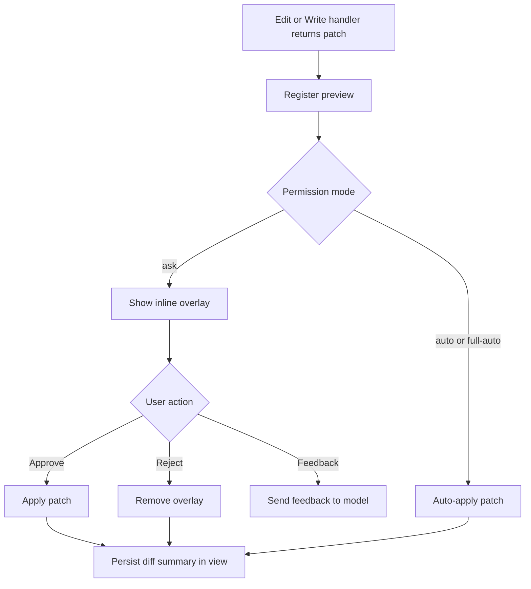

# Inline diff preview

Entry point: `mevedel-preview-mode-add-preview` (keyword API). Dispatches
on `mevedel-preview-mode--effective-mode`:

- `ask` → interactive inline overlay
- `auto` / `full-auto` → `--auto-apply` (runs `apply-fn`
  immediately, still produces a persistent diff summary in the view)

Automatic application validates every hunk without prompting. A hunk that
would require Emacs' heuristic whitespace or word-wrap repair is rejected
before files change. The tool receives an `Error:` result with a 500-character
excerpt of the offending hunk for diagnosis and audit.

`mevedel-preview-mode` is a buffer-local minor mode with a lighter
` Preview[N]`. Prefix `C-c p`: `n`/`p` navigate, `a` approve-all,
`r` reject-all. Per-overlay: approve (`C-c C-c`/`a`/`RET`), reject
(`C-c C-k`/`r`/`q`), ediff (`C-c C-e`/`e`), feedback (`C-c C-f`/`f`),
trust-rest (`S`), toggle (`TAB`).

`S` approves all pending overlays and escalates permission mode to
`auto` (not `full-auto` — shell commands still prompt). Registering
a preview leaves point where it was instead of auto-focusing the preview, and
adds a canceller to the active request's `cancellers` list, so `mevedel-abort`
tears everything down cleanly.
Interactive preview controls register with `mevedel-view-interaction.el`;
preview mode owns their callbacks while the interaction module owns ordering,
callback-overlay placement, and redraw.

## Preview flow



## Handler return shape

Every native mevedel handler returns, or fires its callback with, a plist:

```
(:result STR :render-data (:kind diff :patch PATCH :path PATH :rel-path REL))
```

The pipeline splits `:result` (LLM-facing) from `:render-data`
(LLM-invisible side channel). `:result` is required, even when no render data
is present. Wrapped external gptel tools are converted to this shape by the
tool registry before entering the pipeline.

## Overlay-preserving apply

`mevedel-diff-apply.el` applies accepted diffs while keeping instruction
overlays usable. It records affected overlays before changing text,
applies all hunks atomically, then moves each overlay once after all
cumulative deltas are known.

A single instruction overlay can be touched by multiple hunks. Keep the
original overlay bounds with each saved hunk record and merge duplicate
records before moving the overlay; otherwise later hunks can compute from
temporary properties already cleared by an earlier move. Line-based
overlays snap back to full lines, and deleted overlays become stubs so
instruction persistence still has a live anchor.

Update the workspace instruction state only after `save-buffer` succeeds. If
saving fails, leave the overlay state unchanged; otherwise instructions can
point at content that never reached disk.
