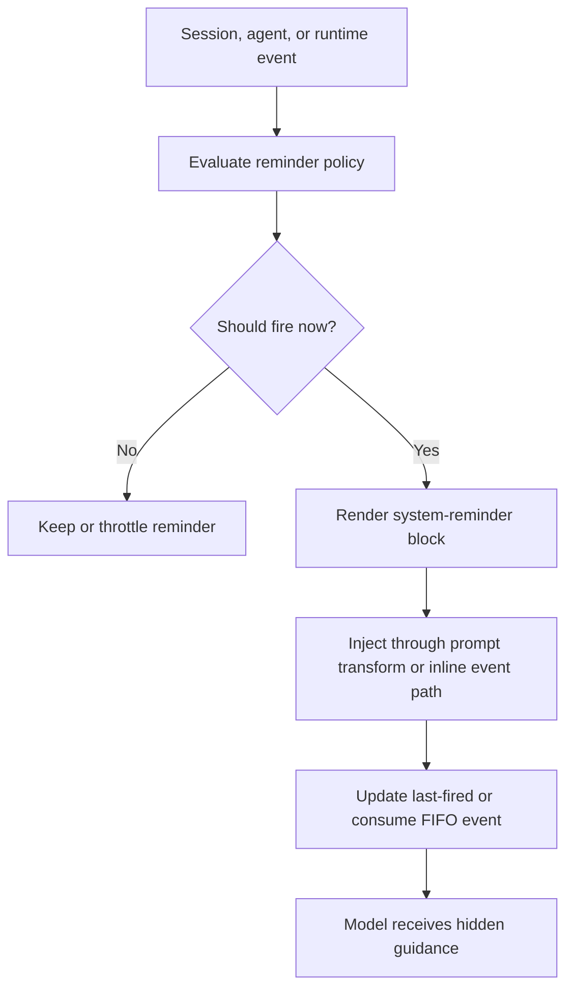

# System reminders

System reminders are model-visible, user-hidden guidance injected into
the prompt stream as `<system-reminder>` blocks. `mevedel-reminders.el`
owns the reminder struct, firing policy, session and agent scoped
reminder lists, and prompt-transform injection. The base system prompt
teaches the model that these blocks are system context, not user text or
tool output.

This page tracks implemented system reminders and candidate reminders
from the `SYSTEM-REMINDERS.md` research note that can be adapted to
mevedel. It deliberately excludes research-only items that do not map
to current mevedel concepts.

## Reminder flow

## Implemented

### Plan-mode workflow reminders

When permission mode is `plan`, `plan-mode` reminds the model to stay
read-only, gather only needed context, ask only undiscoverable
questions, and finish with exactly one `<proposed_plan>` block. The
first firing includes the preferred plan shape: title, Summary, Key
Changes, Regression Coverage, Validation, and Assumptions. Later
firings are sparse.

### Plan-mode reentry and exit reminders

Entering Plan mode installs `plan-mode-reentry` when a current plan
artifact already exists. Exiting Plan mode installs `plan-mode-exit`
to mark that implementation permissions have resumed.

### Plan-file reference reminder

Accepted plans are recorded in session `plan-metadata` and persisted
as `plans/current.md` under the session directory. The one-shot
`plan-reference` reminder surfaces bounded contents of the approved
plan on later turns when it may still be relevant. When Plan mode hands
implementation to a worktree session, both sessions retain an accepted-plan
artifact, but only the worktree session keeps verification pending.

### Accepted-plan verification reminder

Accepting a plan marks verification as pending in `plan-metadata`.
The existing `verification-suggestion` reminder now mentions approved
plan execution verification while that flag is active, and spawning a
verifier clears the flag.

### Agent read-only role reminders

Verifier invocations get an every-turn `verifier-read-only` reminder
that reinforces verification-only behavior and the required verdict line.
Reviewer invocations get an every-turn `reviewer-read-only` reminder
that reinforces review-only behavior, no patching, and strict JSON review
output.

### Specialist navigation availability reminders

Workspace buffers are probed for live specialist navigation support.
One-shot reminders surface xref, Imenu, Treesitter, and Emacs Lisp
introspection when those capabilities are available and, when relevant,
include a `ToolSearch(..., load=true)` hint for deferred tools. These
reminders steer code-symbol work toward `XrefReferences`,
`XrefDefinitions`, `Imenu`, `Treesitter`, and loaded-state Emacs Lisp
introspection instead of broad text search or whole-file reads.

### Generic-tool specialist nudges

Successful `Grep` and `Read` results may receive a bounded appended
`<system-reminder>` when the call looks like code-symbol or structure
discovery and a specialist tool would be more precise. Nudges are
throttled per specialist family and suppress obvious good uses of the
generic tools, such as regex/literal Grep searches, exact Read ranges,
media/PDF reads, duplicate reads, and non-code files.

`mevedel-specialist-nudges.el` owns this post-tool prompting policy,
including eligibility, per-session or per-invocation throttling, deferred-tool
guidance, and exact reminder text. `mevedel-reminders.el` remains the owner of
workspace capability probing and the independent one-shot availability
reminders described above.

### PDF and large-attachment reference reminders

Large PDFs read without a `pages` selector receive an appended
`<system-reminder>` telling the model to prefer bounded
`Read(..., pages="START-END")` requests for relevant pages. Large PDFs
attached through `@file` get the same hidden guidance, and oversized
PDF `@file` attachments that cannot be attached include bounded-page
guidance in the rejection reminder.

### Runtime status and event reminders

- **Date-change:** `mevedel-reminders-make-date-change` compares the
  current date to the session's `last-observed-date` slot and updates
  the slot after firing.
- **Compaction availability:**
  `mevedel-reminders-make-compaction-available` fires once when
  automatic compaction is enabled and context usage crosses the
  configured reminder threshold.
- **Compact file-reference:** compaction queues reminders for file
  references whose contents were not retained; the `pending-events`
  reminder consumes the session FIFO on the next prompt.
- **Token usage:** `mevedel-reminders-make-token-usage` reports high
  context pressure using the compaction token state, with sparse
  repeat firing.
- **Agent listing delta:**
  `mevedel-reminders-make-agent-listing-delta` compares the current
  visible agent roster to the session's `agent-types-snapshot`.
- **Skill listing delta:**
  `mevedel-reminders-make-skills-delta` compares the current active,
  enabled, model-invocable skill roster to the session's
  `skills-snapshot`. The first snapshot is silent; later changes list
  added skills with descriptions and removed skills by name.
- **Skill roster budget:**
  `mevedel-reminders-make-skills-roster-budget` fires when the
  prompt-context skill roster first becomes truncated or omitted, or when
  that budget status changes. The prompt section itself still carries the
  roster budget note; this reminder is only the event-shaped nudge.
- **Path-scoped skill activation:** tool activity that touches a matching
  path can activate dormant enabled path-scoped skills. When activated
  skills are model-invocable, a pending event names the triggering path
  and a capped list of newly active skills.
- **Hook outcome:** hooks record blocking outcomes through
  `mevedel-hooks-record-session-reminder`, consumed by `pending-events`;
  standalone `:system-message` remains a transient notification and hook-log
  entry. Additional hook context still uses `<hook-context>`.
- **Queued user-message:** queued user-message batches are wrapped in
  an inline `<system-reminder>` explaining that the input arrived while
  the previous request was active.
- **Background task status delta:** background agent transitions queue
  status reminders with agent id, type, description, reason,
  transcript path, and optional summary; `background-agents-pending`
  separately reminds the parent when children are still running.

Default session reminders are installed idempotently through
`mevedel-reminders-install-defaults`. Event-shaped reminders use the
session pending-reminder FIFO and the `pending-events` reminder unless
they are injected inline by the view layer.
