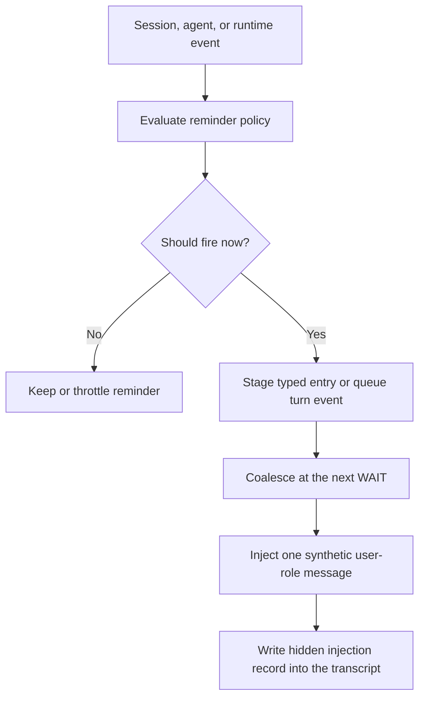

# System reminders

System reminders are model-visible guidance injected into the request
stream as `<system-reminder>` blocks. `mevedel-reminders.el` owns the
reminder struct, firing policy, session and agent scoped reminder
lists, the staging seam other modules deliver through, request-time
injection, and the hidden injection record the view renders. The base
system prompt teaches the model that these blocks are system context,
not user text or tool output.

## The two channels

Every reminder is delivered through exactly one of two channels, chosen
by one rule:

**Ephemeral by default.** A reminder is injected into one request's
payload and vanishes from later requests' history. Permanence requires
a *position-bound* fact: something true about a specific place in the
transcript rather than about the session's current state.

- **Ephemeral (the reminder channel).** Staged entries and turn events
  are injected at WAIT into the request payload only. State-bound
  guidance (rosters, dates, token pressure, modes, fork provenance) is
  regenerated from session state each time it fires, so it stays
  accurate and costs tokens once per firing instead of in every later
  request's history.
- **Positional-permanent (durable transcript text).** Earned by four
  cases only: the `/btw` interrupted-context boundary (marks *where*
  the interruption sits), Read result notices such as truncation and
  page-range riders (facts about *that* result), and compaction
  summary blocks (they *are* the transcript). Skill instruction
  reminders prepended to submitted model-input are a fourth,
  deliberate case: turn-bound provenance of prompt content that
  several submission paths consume.

A reminder that describes current state must not be written into the
buffer, and a position-bound fact cannot be delivered ephemerally.
This rule reversed the original fork-disclosure design: fork
disclosures were durable transcript text, but provenance is session
state, so it is now regenerated sparsely (see `fork-provenance`
below). What moved the decision: durable disclosures cost tokens in
every subsequent request forever, could not adapt when state changed,
and the view had to special-case their text by prefix sniffing.

## Reminder flow

```mermaid
flowchart TD
    A[Session, agent, or runtime event] --> B[Evaluate reminder policy]
    B --> C{Should fire now?}
    C -- No --> D[Keep or throttle reminder]
    C -- Yes --> E[Stage typed entry or queue turn event]
    E --> F[Coalesce at the next WAIT]
    F --> G[Inject one synthetic user-role message]
    G --> H[Write hidden injection record into the transcript]
```

Staged reminders travel as typed entries `(:type SYM :body STRING)`;
wrapping into `<system-reminder>` blocks happens once at injection.
At the request's first WAIT, all staged entries are injected in one
synthetic user-role message immediately before the actual user message
(`gptel--inject-prompt` position `-1`). At a later WAIT the last
message carries tool results, so everything appends after them instead
-- a message injected before them would split a tool call from its
result. Observations produced while tools run are buffer-local and
bound to the active root request or retained-agent invocation.
Repeated observations with the same key coalesce and are injected at
the next WAIT owned by that same turn. They are discarded when the
owner changes and are never carried into the next user turn.
The compaction provider-dispatch wrapper is the final injection seam:
continuation auto-compaction may rebuild the realized payload first,
then reminders are injected, recorded, and committed against the
payload that is actually dispatched.

### Staging seams

- `mevedel-reminders-stage-entry` appends one typed entry (plus an
  optional deferred commit) to the request's fsm info. Callable from
  any prompt transform and from WAIT-time handlers that run before the
  final provider dispatch: mentions (depth -90) and skills-input (-89) stage before
  the reminders transform (-80) collects session reminders;
  auto-compaction (-70) and the steering WAIT handler stage after.
- `mevedel-reminders-stage-commit` defers a commit thunk alone, for
  consumable state whose payload rides the prompt text or the staged
  entries of the same request.
- `mevedel-reminders-queue-turn-event` queues an owner-bound,
  key-coalesced observation for the current turn, delivered at the
  next WAIT after the tool results.
- `mevedel-session-enqueue-pending-reminder` appends to the session's
  transient pending FIFO, consumed by the `pending-events` reminder on
  the next request. Survives a request boundary but not a restart.

### Commits

Consuming a reminder is a separate step from staging it. A content
function returns either its body or a `:body`/`:commit` plist, and
every commit -- the pending-event FIFO, hook context, the observed
date, external-change snapshots, expired deferred tools, queued turn
events, mention deduplication, and each reminder's fired turn -- runs
only once the final provider-bound payload exists at WAIT. Hook context is the exception in
mechanism, not in guarantee: it rides the prompt text rather than a
block, so the transform reserves it out of the pending list
immediately -- otherwise automatic compaction's context epoch or a
prompt prepared in the composer could deliver the same entries a
second time -- and ending the request returns the reservation, which
every dead turn does. A request that fails to realize, is aborted or
cancelled before its first WAIT, or whose injection signals therefore
keeps everything for the next turn instead of losing it, and an
interval reminder is not marked fired for a turn the model never saw.
A trigger that mutates state has no commit channel, so a reminder
whose trigger consumes still reports once per attempt rather than once
per delivery.

Durable state reminders are regenerated from session state rather than
persisted as transient observations. Root and retained-agent queues
remain isolated.

## The injection record

Every injection additionally writes one hidden hook-audit record
(`:type injected-reminders`, phase `turn-start` or `mid-turn`, items
with each entry's type and UTF-8 body capped in bytes at
`mevedel-reminders--record-body-limit`) into the chat data buffer at
the request's active response marker, immediately after the payload
injection succeeds -- a cancelled request records nothing. The record
is durable for the *user* even though the blocks are ephemeral for the
*model*: it is never sent to a provider, is excluded from compaction
evidence and token estimation, is skipped by collaboration projection,
and persists through session segments.

The view renders it as one grouped collapsed row -- `◇ N system
reminders (labels…)` -- above the user turn for turn-start injections
and inline in the assistant turn for mid-turn injections, expanding to
per-entry bodies. Historical durable `<system-reminder>` text (old
fork disclosures, the btw boundary) keeps the single-block
`◇ System reminder (N lines)` row.

## Agent requests

Agent invocations carry their own reminder roster (max-turns warning,
verifier/reviewer read-only, deferred-tool roster and expiry), cloned
at spawn. `mevedel-reminders--agent-transform` runs in every agent
request's transform list and collects that roster with the invocation
as firing context; delivery, commits, and the injection record ride
the shared WAIT injector. Turn events queue against the invocation as
owner exactly as on the root path.

## Implemented reminders

### Session state and mode guidance (regenerated, ephemeral)

- **Plan-mode workflow:** the every-turn `plan-mode` reminder
  reinforces Plan's read-only boundary, exploration-first behavior,
  replacement semantics, exact proposal tags, and the preferred
  proposal shape.
- **Mode constraints / full-auto:** permission-mode guidance.
- **Fork provenance:** the sparse (interval 20) `fork-provenance`
  reminder regenerates a fork's provenance from durable session slots
  via `mevedel-session-fork-provenance-body`: source session and, for
  worktree forks, worktree directory, branch, and base commit. The
  one-time worktree restore report (restored count, unrestored files,
  external shared paths, dropped state) is enqueued on the pending
  FIFO at fork time and delivered on the child's first request; the
  FIFO is transient, so a restart before that request drops the report
  detail while the provenance reminder keeps the durable facts.
- **Plan-file reference:** the one-shot `plan-reference` reminder
  surfaces bounded contents of the approved plan on later turns when
  it may still be relevant. Main-session compaction resets its fired
  mark (`mevedel-reminders-rearm-plan-reference`), because the summarized
  prefix may have carried both its earlier delivery and the
  implementation prompt's full plan text; the reference then re-fires
  once with the plan address. The trigger suppresses it when an active Goal
  carries that exact accepted-plan reference, because the Goal's system-prompt
  context regenerates the binding plan address on every request. A Goal with
  no plan or a different plan does not suppress it. Standalone Plan Direct
  handoff does not use this reminder.
- **Accepted-plan verification:** `verification-suggestion` mentions
  approved plan execution verification while `plan-metadata` marks it
  pending; spawning a verifier clears the flag.
- **Agent read-only roles:** every-turn `verifier-read-only` and
  `reviewer-read-only` reminders on the respective invocations.
- **Specialist navigation availability:** one-shot xref, Imenu,
  Treesitter, and Emacs Lisp introspection availability reminders,
  with `ToolSearch(..., load=true)` hints for deferred tools.

### Runtime status and event reminders (ephemeral)

- **Specialist nudges:** eligible `Grep` and `Read` calls queue a
  turn event (key `(specialist . TOOL)`) whose body names the
  originating call and steers follow-up symbol work toward the
  specialist tools. `mevedel-specialist-nudges.el` owns eligibility,
  per-family throttling, and exact text.
- **Goal budget:** turn settlement queues one-shot 50%, 80%, and 100%
  crossing events; budget changes queue one event with old and new
  limits. When provider usage is already known at a tool-result
  boundary, the pipeline queues the first 100% warning as a turn event
  delivered at the same WAIT, so an in-flight turn can wrap up without
  an extra request; the fsm guard suppresses the settlement duplicate.
- **Mention expansions:** `@ref`/`@file`/`@mcp`/`@agent` contents and
  rejection notices are staged entries (typed by mention key).
  Deduplication commits only once the payload exists, so a cancelled
  request never marks content as shown.
- **Skill attachments:** inline user `$skill` bodies and recursively required
  authored `!$skill` bodies reuse staged entries of type `skill-attachment`.
  Required contributions are flattened dependency first into the same pending
  collection; no new reminder type or late hidden reminder path is used. The
  corresponding attachment placeholder stays in the prompt or parent body.
- **Compact file-reference:** manual compaction enqueues pending-FIFO
  reminders for file references whose contents were not retained; auto
  compaction stages a `compact-file-references` entry on the in-flight
  fsm instead, delivered at its next WAIT.
- **Path-scoped workspace instructions:** a successful `Read` below
  the session working directory queues changed `AGENTS.md` and
  `AGENTS.local.md` files as turn events, ordered broad to narrow and
  deduplicated by owner, path, and content.
- **Recovery reconciliation:** cold resume and abort of a live root
  request queue one warning that processes or tool effects may be
  partial.
- **User-revised patch:** the one-shot `user-revised-patch` reminder
  repeats the applied-content-is-authoritative directive on the turn
  after a user-edited ApplyPatch review.
- **Date-change**, **compaction availability**, **token usage**,
  **agent listing delta**, **skill listing delta**, **skill roster
  budget**, **path-scoped skill activation**, **deferred tools roster
  and expiry**, **max-turns warning**, **edited files**: state
  snapshots and deltas, each regenerated from session or invocation
  state.
- **Hook outcome:** hooks record blocking outcomes through
  `mevedel-hooks-record-session-reminder` as turn events; additional
  hook context still rides the prompt text as `<hook-context>`.

### PDF and large-attachment guidance

Large PDFs read without a `pages` selector receive an appended
`<system-reminder>` telling the model to prefer bounded
`Read(..., pages="START-END")` requests (a Read result rider, thus
positional). Large PDFs attached through `@file` get the same guidance
as part of the mention's staged entry.

### Edit diagnostics

The edit-diagnostics state machine is its own owner,
`mevedel-edit-diagnostics.el`: the patch tool drives it, and the
reminder module only delivers what it queues through the generic
turn-event channel. Diagnostics are observed only after a successful
`ApplyPatch`. Before the first edit of a visited file in a request,
mevedel captures that file's current Flymake and Flycheck diagnostics
as its baseline. After the edit, an unmodified stale buffer is safely
reverted, active checkers are started, and the tool callback waits on
Flymake report callbacks and Flycheck's completion hook, with a fixed
30-second timeout. A Flycheck buffer with no selected checker is
treated as immediately ready and never starts that timeout. Modified
stale buffers are never reverted, and rejected or failed edits produce
no diagnostic observation.

The first fresh result is compared with the baseline: new or changed
diagnostics are completion work, while pre-existing diagnostics are
context only unless they block the requested work. Later edits compare
with the last fresh result and do not repeat the pre-existing
category. Resolved diagnostics are telemetry only. Model-visible
output prioritizes new diagnostics, sorts by severity, caps output at
10 diagnostics per file and 30 total, and reports one aggregate
omitted count. Telemetry records counts and outcomes, never diagnostic
text or file paths.

Default session reminders are installed idempotently through
`mevedel-reminders-install-defaults`. Lifecycle events use the session
pending-reminder FIFO and `pending-events`; observations use the
owner-bound turn queue.
