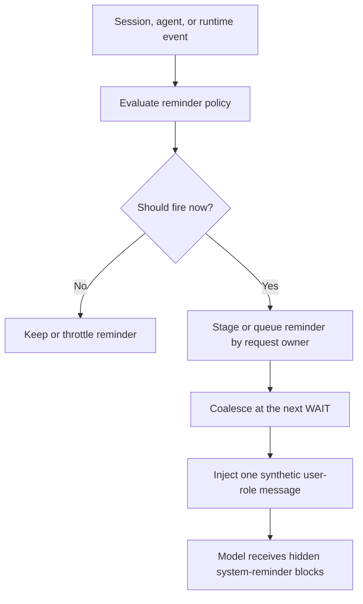

# System reminders

System reminders are model-visible, user-hidden guidance injected into
the request stream as `<system-reminder>` blocks. `mevedel-reminders.el`
owns the reminder struct, firing policy, session and agent scoped
reminder lists, and request-time injection. The base system prompt
teaches the model that these blocks are system context, not user text or
tool output.

This page tracks implemented system reminders and candidate reminders
from the `SYSTEM-REMINDERS.md` research note that can be adapted to
mevedel. It deliberately excludes research-only items that do not map
to current mevedel concepts.

## Reminder flow

```mermaid
flowchart TD
    A[Session, agent, or runtime event] --> B[Evaluate reminder policy]
    B --> C{Should fire now?}
    C -- No --> D[Keep or throttle reminder]
    C -- Yes --> E[Stage or queue reminder by request owner]
    E --> F[Coalesce at the next WAIT]
    F --> G[Inject one synthetic user-role message]
    G --> H[Model receives hidden system-reminder blocks]
```

Initial reminders are staged by the prompt transform without changing the
accepted user prompt. At the first request `WAIT`, all staged blocks are
injected in one synthetic user-role message immediately before the actual user
message. Observations produced while tools run are buffer-local and bound to
the active root request or retained-agent invocation. Repeated observations
with the same key coalesce and are injected at the next `WAIT` owned by that
same turn. They are discarded when the owner changes and are never carried
into the next user turn.

Consuming a reminder is a separate step from staging it. A content function
returns either its body or a `:body`/`:commit` plist, and every commit -- the
pending-event FIFO, hook context, the observed date, external-change
snapshots, expired deferred tools, queued turn events, and each reminder's
fired turn -- runs only once the payload exists at `WAIT`. Hook context is the
exception in mechanism, not in guarantee: it rides the prompt text rather than
a block, so the transform reserves it out of the pending list immediately --
otherwise automatic compaction's context epoch or a prompt prepared in the
composer could deliver the same entries a second time -- and ending the
request returns the reservation, which every dead turn does. A
request that fails to realize, is aborted or cancelled before its first
`WAIT`, or whose injection signals therefore keeps everything for the next turn
instead of losing it, and an interval reminder is not marked fired for a turn
the model never saw. A trigger that mutates state has no commit channel, so a
reminder whose trigger consumes still reports once per attempt rather than once
per delivery.

Explicit lifecycle events that intentionally survive a request boundary still
use the session pending-event FIFO. Durable state reminders are regenerated
from session state rather than persisted as transient observations. Root and
retained-agent queues remain isolated.

## Implemented

### Plan-mode workflow

The every-turn `plan-mode` reminder reinforces Plan's read-only boundary,
exploration-first behavior, replacement semantics, and exact proposal tags. It
also includes the preferred title, Summary, Key Changes, Regression Coverage,
Validation, and Assumptions shape on every firing so revised proposals retain
the same structure.

### Plan-file reference reminder

Accepted plans are recorded in session `plan-metadata` and persisted as an
immutable accepted artifact under the session directory. The mutable proposal
remains at `current-plan.md`. The one-shot `plan-reference` reminder surfaces
bounded contents of the approved plan on later turns when it may still be
relevant.

Standalone Plan Direct handoff does not use this reminder. Here and Worktree
targets receive the immutable artifact path and full accepted plan in the
canonical implementation prompt; Summary contexts additionally receive their
cached handoff before that prompt.

### Accepted-plan verification reminder

Accepting a plan marks verification as pending in `plan-metadata`.
The existing `verification-suggestion` reminder now mentions approved
plan execution verification while that flag is active, and spawning a
verifier clears the flag.

### Agent read-only role reminders

Verifier invocations get an every-turn `verifier-read-only` reminder
that reinforces verification-only behavior and the required verdict line.
Reviewer invocations get an every-turn `reviewer-read-only` reminder
that reinforces review-only behavior, no patching, and strict JSON review
output.

### Specialist navigation availability reminders

Workspace buffers are probed for live specialist navigation support.
One-shot reminders surface xref, Imenu, Treesitter, and Emacs Lisp
introspection when those capabilities are available and, when relevant,
include a `ToolSearch(..., load=true)` hint for deferred tools. These
reminders steer code-symbol work toward `XrefReferences`,
`XrefDefinitions`, `Imenu`, `Treesitter`, and loaded-state Emacs Lisp
introspection instead of broad text search or whole-file reads.

### Generic-tool specialist nudges

Successful `Grep` and `Read` results may receive a bounded appended
`<system-reminder>` when the call looks like code-symbol or structure
discovery and a specialist tool would be more precise. Nudges are
throttled per specialist family and suppress obvious good uses of the
generic tools, such as regex/literal Grep searches, exact Read ranges,
media/PDF reads, duplicate reads, and non-code files.

`mevedel-specialist-nudges.el` owns this post-tool prompting policy,
including eligibility, per-session or per-invocation throttling, deferred-tool
guidance, and exact reminder text. `mevedel-reminders.el` remains the owner of
workspace capability probing and the independent one-shot availability
reminders described above.

### PDF and large-attachment reference reminders

Large PDFs read without a `pages` selector receive an appended
`<system-reminder>` telling the model to prefer bounded
`Read(..., pages="START-END")` requests for relevant pages. Large PDFs
attached through `@file` get the same hidden guidance, and oversized
PDF `@file` attachments that cannot be attached include bounded-page
guidance in the rejection reminder.

### Runtime status and event reminders

- **Path-scoped workspace instructions:** a successful `Read` below the
  session working directory queues changed `AGENTS.md` and `AGENTS.local.md`
  files that were not already in the initial prompt. Delivery is ordered from
  broad to narrow and deduplicated by conversation owner, path, and content;
  the content hash is recorded only after the reminder reaches the request.
- **Recovery reconciliation:** cold resume and abort of a live root request
  queue one warning that processes or tool effects may be partial. Interrupted
  retained-agent results carry the equivalent warning directly.

- **Date-change:** `mevedel-reminders-make-date-change` compares the
  current date to the session's `last-observed-date` slot and updates
  the slot after firing.
- **Compaction availability:**
  `mevedel-reminders-make-compaction-available` fires once when
  automatic compaction is enabled and context usage crosses the
  configured reminder threshold.
- **Compact file-reference:** compaction queues reminders for file
  references whose contents were not retained; the `pending-events`
  reminder consumes the session FIFO on the next prompt.
- **Goal objective update:** `/goal edit` queues one event containing the
  revised objective and its authority over conflicting accepted-plan text.
- **Goal token budget:** turn settlement queues one-shot 50%, 80%, and 100%
  crossing events. Budget changes queue one event containing old and new
  limits, current usage, remaining tokens, and resulting status. The tool
  pipeline can also append the 100% warning directly to one tool result so an
  in-flight turn can wrap up without an extra request.
- **Token usage:** `mevedel-reminders-make-token-usage` reports high
  context pressure using the compaction token state, with sparse
  repeat firing.
- **Agent listing delta:**
  `mevedel-reminders-make-agent-listing-delta` compares the current
  visible named-role roster to the session's prior snapshot.
- **Skill listing delta:**
  `mevedel-reminders-make-skills-delta` compares the current active,
  enabled, model-invocable skill roster to the session's
  `skills-snapshot`. The first snapshot is silent; later changes list
  added skills with descriptions and removed skills by name.
- **Skill roster budget:**
  `mevedel-reminders-make-skills-roster-budget` fires when the
  prompt-context skill roster first becomes truncated or omitted, or when
  that budget status changes. The prompt section itself still carries the
  roster budget note; this reminder is only the event-shaped nudge.
- **Path-scoped skill activation:** tool activity that touches a matching
  path can activate dormant enabled path-scoped skills. When activated skills
  are model-invocable, a turn-scoped observation names the triggering path and
  a capped list of newly active skills.
- **Hook outcome:** hooks record blocking outcomes through
  `mevedel-hooks-record-session-reminder` as a turn-scoped observation;
  standalone `:system-message` remains a transient notification and hook-log
  entry. Additional hook context still uses `<hook-context>`.

### Edit diagnostics

Diagnostics are observed only after a successful `ApplyPatch`.
Before the first edit of a visited file in a request, mevedel captures that
file's current Flymake and Flycheck diagnostics as its baseline. After the
edit, an unmodified stale buffer is safely reverted, active checkers are
started, and the tool callback waits on Flymake report callbacks and Flycheck's
completion hook, with a fixed 30-second timeout. A Flycheck buffer with no
selected checker is treated as immediately ready and never starts that timeout.
Modified stale buffers are
never reverted, and rejected or failed
edits produce no diagnostic observation.

The first fresh result is compared with the baseline: new or changed
diagnostics are completion work, while pre-existing diagnostics are context
only unless they block the requested work. Later edits compare with the last
fresh result and do not repeat the pre-existing category. Resolved diagnostics
are telemetry only. Model-visible output prioritizes new diagnostics, sorts by
severity, caps output at 10 diagnostics per file and 30 total, and reports one
aggregate omitted count. Telemetry records counts and outcomes, never
diagnostic text or file paths.

Default session reminders are installed idempotently through
`mevedel-reminders-install-defaults`. Lifecycle events use the session
pending-reminder FIFO and `pending-events`; observations use the owner-bound
turn queue.
