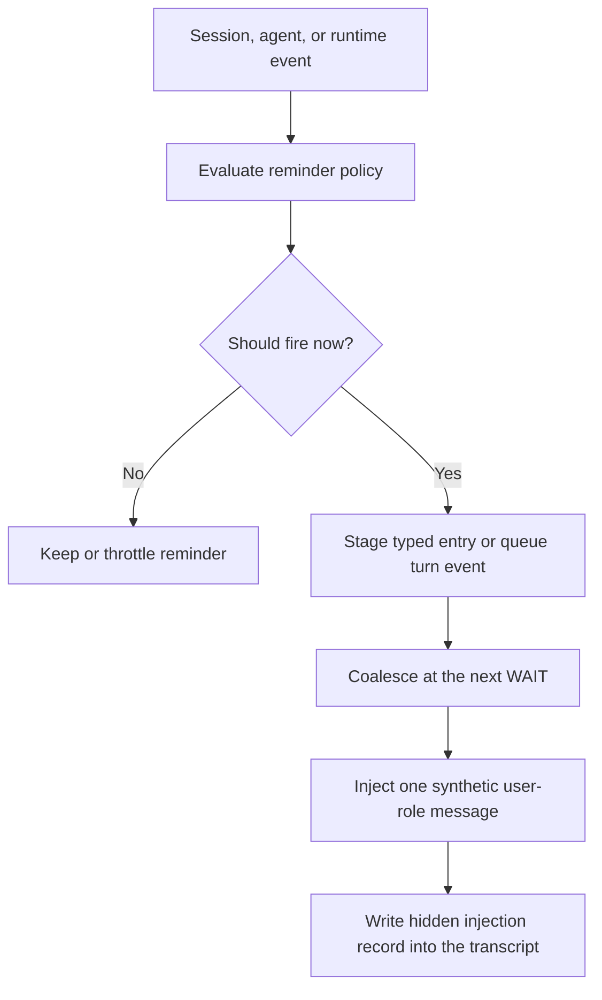

# System reminders

System reminders are model-visible guidance injected into the request
stream as `<system-reminder>` blocks. `mevedel-reminders.el` owns the
reminder struct, firing policy, session and agent scoped reminder
lists, the staging seam other modules deliver through, request-time
injection, and the hidden injection record the view renders. The base
system prompt teaches the model that these blocks are system context,
not user text or tool output.

Contextual reminders remain a valid delivery mechanism; neither their count nor
raw specialist-tool usage establishes whether guidance improved a task.

## Delivery and history

Deliver reminders only when their firing policy establishes relevance. Once
actually delivered, retain their complete content at that point in conversation
history until compaction removes the corresponding prefix. Later state changes
arrive as new context; old state descriptions do not override current settings.

Retention consumes historical context and local storage; sparse firing,
deduplication, and compaction control that cost. The rationale and prior delivery
behavior are recorded in [ADR 0115](adr/0115-retain-delivered-conversation-fragments.md).

Claude records acknowledged typed entries through the same hidden injection
record as the gptel engine, including guidance restored after native compaction.
The shared view therefore shows the reminder count and source labels. Initial
prompt deliveries attach to that user turn; later deliveries remain at their
position among assistant activity. Unacknowledged entries do not create a row.

Staged entries and turn events share this delivery contract. Unsent events remain
owner-bound and transient; cancellation must not manufacture delivered history.
Position-bound text such as Read truncation notices, the `/btw` interruption
boundary and compaction summaries remains ordinary durable transcript content.

## Reminder flow

```mermaid
flowchart TD
    A[Session, agent, or runtime event] --> B[Evaluate reminder policy]
    B --> C{Should fire now?}
    C -- No --> D[Keep or throttle reminder]
    C -- Yes --> E[Stage typed entry or queue turn event]
    E --> F[Coalesce at the next WAIT]
    F --> G[Inject one synthetic user-role message]
    G --> H[Write hidden injection record into the transcript]
```

Staged reminders travel as typed entries `(:type SYM :body STRING)`;
wrapping into `<system-reminder>` blocks happens once at injection.
At every WAIT, the synthetic message appends after the actual user message or
complete tool results, matching the durable record's transcript position. This
never splits a tool call from its result. Observations produced while tools run are buffer-local and
bound to the active root request or retained-agent invocation.
Repeated observations with the same key coalesce and are injected at
the next WAIT owned by that same turn. They are discarded when the
owner changes and are never carried into the next user turn.
The compaction provider-dispatch wrapper is the final injection seam:
continuation auto-compaction may rebuild the realized payload first,
then reminders are injected, recorded, and committed against the
payload that is actually dispatched.

### Staging seams

- `mevedel-reminders-stage-entry` appends one typed entry (plus an
  optional deferred commit) to the request's fsm info. Callable from
  any prompt transform and from WAIT-time handlers that run before the
  final provider dispatch: mentions (depth -90) and skills-input (-89) stage before
  the reminders transform (-80) collects session reminders;
  auto-compaction (-70) and the steering WAIT handler stage after.
- `mevedel-reminders-stage-commit` defers a commit thunk alone, for
  consumable state whose payload rides the prompt text or the staged
  entries of the same request.
- `mevedel-reminders-queue-turn-event` queues an owner-bound,
  key-coalesced observation for the current turn, delivered at the
  next WAIT after the tool results.
- `mevedel-session-enqueue-pending-reminder` appends to the session's
  transient pending FIFO, consumed by the `pending-events` reminder on
  the next request. Survives a request boundary but not a restart.

### Commits

Consuming a reminder is a separate step from staging it. A content
function returns either its body or a `:body`/`:commit` plist. A nil `:body`
stages only the commit, for a silent acknowledgement of context already in the
prompt. Pending-event consumption, observed dates, external-change snapshots,
turn events, mention deduplication, and reminder firing marks commit only after
the final provider-bound payload exists at WAIT. A request that fails before
injection keeps that state eligible for a later attempt.

Hook context has two entry paths. Composer preparation consumes accepted hook
context when its user turn is committed to the transcript; a later dispatch
failure cannot redeliver text already stored there. Context still pending when
the prompt transform runs is reserved into that request's prompt text. Its WAIT
commit clears the reservation, and request teardown returns an uncommitted
reservation to the pending list. See [hook lifecycle integration](hooks.md#lifecycle-integration).

A trigger that mutates state has no commit channel, so a reminder
whose trigger consumes still reports once per attempt rather than once
per delivery.

The Claude engine collects configured reminders once at prompt submission,
using the same session or invocation context and firing policy as gptel. Pending
root hook context joins that delivery. Native SDK receipt commits firing marks
and consumes only captured pending events and hook context; later arrivals stay
pending. Silent commits require receipt too. Large initial reminder bodies use
the prompt, which has no inline hook-string limit. Local transcript estimates
do not produce context-pressure reminders for externally owned model history.

During a Claude turn, tool-batch hooks carry queued turn events, changed selected
observations, new direct children and mail. Exact SDK receipts run their commits;
event consumption preserves objects queued or replaced during delivery. Missing
required-context receipts block further tools and successful settlement. Native
compaction restores selected observations, the full direct-child roster,
active root Plan guidance, eligible accepted-plan references and current contents
of previously learned path instructions. Removed instruction files explicitly withdraw their earlier
guidance. Oversized required updates or restoration stop the native prompt and
automatically continue the same admitted turn with the complete captured body
in a new prompt. Its exact SDK user receipt runs the original commits; no hook
preview counts as delivery. Pause, cancellation and child sample caps still
apply, and a failed prompt is not retried automatically.

Reminder eligibility is evaluated from current session state; delivered
observations remain historical context rather than current authority. Root and retained-agent queues
remain isolated.

Native receipt markers (`<!-- mevedel-delivery:... -->`) remain in the stored
transcript as delivery evidence. The paired view omits the marker and folds
the following system reminder into the usual expandable row, including when
the receipt follows authored text in the same user-role span.

## The injection record

Every successful gptel injection writes one trusted hidden record
(`:type injected-reminders`, phase `turn-start` or `mid-turn`) containing each
entry's type and complete body. Bodies are not truncated: the record supplies
reconstruction as well as inspection. Missing insertion markers or recording
failures prevent committing delivery; injection failures retain pending state.

Claude receipts instead record the exact accepted body as a user-role block in
the canonical transcript. They do not claim that a gptel payload exists.

The encoded gptel record stays out of provider text. `mevedel-history.el` decodes it
as a separate message during prompt preparation, including fresh-process
restore. Compaction evidence includes its instruction bodies, and local token
estimates count the decoded guidance instead of encoded metadata. The record
continues to be excluded from collaboration projection and persists through
session segments. Compaction can summarize or retire obsolete guidance.

The view renders it as one grouped collapsed row -- `◇ N system
reminders (labels…)` -- above the user turn for turn-start injections
and inline in the assistant turn for mid-turn injections, expanding to
per-entry bodies. Inline `<system-reminder>` text (fork disclosures and the btw boundary) keeps the single-block
`◇ System reminder (N lines)` row.

## Agent requests

Agent invocations carry their own reminder roster (configured reminders and
max-turns warning), cloned at spawn. `mevedel-reminders--agent-transform` runs in every agent
request's transform list and collects that roster with the invocation
as firing context; delivery, commits, and the injection record ride
the shared WAIT injector. The max-turns warning is instead evaluated at
every agent WAIT, where each model sample is counted, so it fires inside
long tool loops ([Agents](agents.md)). Turn events queue against the
invocation as owner exactly as on the root path.

Claude children count the initial sample at prompt preparation and subsequent
samples at PostToolBatch. The same warning producer stages a turn event near
the cap; its firing mark waits for exact SDK receipt. Final-sample guidance has
one shared producer with gptel and is restored after native compaction. Once
the final sample's tools settle, the hook ends the loop and the child result
discloses that it stopped before a final answer.

## Implemented reminders

### Session state and mode guidance (evaluated from current state)

- **Plan-mode workflow:** the every-turn `plan-mode` reminder
  describes read-only project inspection, unavailable Eval, session-only
  ApplyPatch in standalone/sticky Plan, and no writes in directive Planning.
  It retains exploration-first behavior,
  replacement semantics, exact proposal tags, and the preferred
  proposal shape. Rebuilding a root tool continuation after compaction stages
  the same active Plan reminder again, unless it is already staged; this also
  covers directive planning. A generated summary cannot replace the current
  proposal contract.
- **Mode constraints / full-auto:** permission-mode guidance, including the
  disclosure that live Eval runs inside Emacs without confinement.
- **Fork provenance:** the sparse (interval 20) `fork-provenance`
  reminder regenerates a fork's provenance from durable session slots
  via `mevedel-session-fork-provenance-body`: source session and, for
  worktree forks, worktree directory, branch, and base commit. The
  one-time worktree restore report (restored count, unrestored files,
  external shared paths, dropped state) is enqueued on the pending
  FIFO at fork time and delivered on the child's first request; the
  FIFO is transient, so a restart before that request drops the report
  detail while the provenance reminder keeps the durable facts.
- **Plan-file reference:** the one-shot `plan-reference` reminder
  surfaces bounded contents of the approved plan on later turns when
  it may still be relevant. Main-session compaction resets its fired
  mark (`mevedel-reminders-rearm-plan-reference`), because the summarized
  prefix may have carried both its earlier delivery and the
  implementation prompt's full plan text; the reference then re-fires
  once with the plan address. The trigger suppresses it when an active Goal
  carries that exact accepted-plan reference, because the Goal's retained current-context
  delivery supplies the binding plan address. A Goal with
  no plan or a different plan does not suppress it. Standalone Plan Direct
  handoff does not use this reminder. Native Claude compaction restores an
  eligible reference through the same producer immediately, requiring its exact
  receipt before further tools; it does not wait for the next user prompt.
- **Recent-edit verification:** `verification-suggestion` requires a
  recorded file modification in the latest committed turn or the active
  turn, and fires at most once every ten turns. Reading a file does not
  qualify; older edits do not keep the suggestion eligible. When an
  accepted plan's verification is pending, the suggestion also asks for
  evidence that the plan was executed. Spawning a verifier clears that
  plan flag. The generic suggestion remains applicable to recent edits.

Read-only role and report contracts live in the frozen agent prompt, restored
for every request even when the transcript is compacted. They are not repeated
as reminders. Explicitly configured role reminders retain their own lifetimes.

Specialist tools are discoverable through ToolSearch by capability or name.
Their descriptions and search results own suitability and call guidance.
There is no generic ToolSearch/ToolCall availability reminder. The native descriptions deliver that stable guidance.
Ordinary Read/Grep calls and open editor buffers do not trigger navigation
workflow advice; a registered tool alone does not establish that its backend
works for a particular file.

### Changing prompt observations

Named workspace guidance, environment/date, memory indexes, compact skill
catalogs, resource availability and active Goal facts are separate from the stable
system prefix. Each changed section delivers its complete current contents with
an explicit notice that other previously supplied state remains applicable.
Unchanged sections remain in retained history. Delivery is checked against actual
selected history; absent observations are redelivered after compaction, filtering
or restore. If all selected sections are absent, all are delivered again. Explicitly configured custom date reminders remain available. See
[retained instruction context](architecture.md#retained-instruction-context).

### Runtime status and event reminders

- **Goal budget:** every Goal charge (root settlement or agent progress)
  reports each newly crossed 50%, 80%, or 100% threshold once, as a turn
  event for a still-running root turn or a pending reminder otherwise;
  budget changes queue one event with old and new limits. At each root
  tool-result boundary the pipeline also checks known in-flight usage and
  queues newly crossed thresholds as turn events delivered at the same WAIT;
  the fsm guard suppresses the settlement duplicate. Agents charged to the
  Goal receive a notice of the highest threshold reached at their next WAIT
  ([Goals](goals.md#token-budget)).
- **Mention expansions:** `@ref`/`@file`/`@mcp`/`@agent` contents and
  rejection notices are staged entries (typed by mention key).
  Deduplication commits only once the payload exists, so a cancelled
  request never marks content as shown.
- **Skill attachments:** inline user `$skill` bodies and recursively required
  authored `!$skill` bodies reuse staged entries of type `skill-attachment`.
  Required contributions are flattened dependency first into the same pending
  collection; no new reminder type or late hidden reminder path is used. The
  corresponding attachment placeholder stays in the prompt or parent body.
- **Compact file-reference:** manual compaction enqueues pending-FIFO
  reminders for file references whose contents were not retained; auto
  compaction stages a `compact-file-references` entry on the in-flight
  fsm instead, delivered at its next WAIT.
- **Path-scoped workspace instructions:** a successful `Read` below
  the session working directory queues changed `AGENTS.md` and
  `AGENTS.local.md` files as turn events, ordered broad to narrow and
  deduplicated by owner, path, and content. Delivery is acknowledged only at
  payload injection or exact native SDK receipt, so cancellation leaves the
  guidance eligible for retry. Fresh directive requests keep their own hashes;
  root history cannot suppress their guidance. Local compaction, rewind, and
  cold resume reset the relevant local-history delivery acknowledgements.
  Native conversations retain their learned scopes across reopening and refresh
  the complete current instructions in each resumed prompt. Native compaction
  instead restores current instruction contents for that conversation, broad
  to narrow with local overrides last, and acknowledges the restoration.
  This post-read discovery helps subsequent model decisions: it is not an edit
  gate and cannot affect another tool already scheduled in the same batch.
  The shared task policy therefore still requires inspecting applicable project
  guidance before changing code. Resource reads such as session working-file
  `work://` addresses do not discover workspace policy.
- **Recovery reconciliation:** cold resume and abort of a live root
  request queue one warning that processes or tool effects may be
  partial.
- **User-revised patch:** the one-shot `user-revised-patch` reminder
  repeats the applied-content-is-authoritative directive on the turn
  after a user-edited ApplyPatch review.
- **Compaction availability**, **token usage**,
  **agent listing delta**,
  **path-scoped skill activation**,
  **max-turns warning**, **edited files**: state
  snapshots and deltas, each regenerated from session or invocation
  state.
- **Hook outcome:** hooks record blocking outcomes through
  `mevedel-hooks-record-session-reminder` as turn events; additional
  hook context still rides the prompt text as `<hook-context>`.

### What the edited-file reminder watches

The `edited-file` reminder reports every file in the workspace file cache
whose content moved outside mevedel's tools. Two boundaries keep that from
turning into per-turn noise and per-turn cost.

mevedel's own session bookkeeping never enters the cache. A session
directory holds append-only logs, transcript segments, and sidecars that
mevedel rewrites every turn, so caching one would report mevedel's own
writes back as external edits for the rest of the session, and let a
multi-megabyte telemetry log evict every cache entry describing real work.
Sibling sessions under the same sessions root are excluded too — reading a
second live session's files churns identically — each confirmed by its
sidecar rather than assumed from its location. The `artifacts` subtree stays
watched: those are authored deliverables, and an outside edit to one is worth
reporting. The interaction record is still written for an excluded path.

Content is bounded twice. A file the filesystem reports as larger than
`mevedel-file-cache-max-file-bytes` is cached as a fingerprint — timestamps
and reported size, no content — so it is still seen to move but claims none
of the `mevedel-file-cache-max-bytes` budget. Content past
`mevedel-reminders-edited-file-max-diff-bytes` is not diffed at all:
`mevedel-generate-diff` spools both sides to temporary files and forks
`diff`, which is not worth paying every turn for the
`mevedel-reminders-edited-file-max-diff-lines` lines that survive. Both cases
report the change and its size and tell the model to re-read the file.

The diffs are prepared before the request is dispatched: the provider-wait
handler detects the changes, runs one `diff` helper per changed file, and
stages the reminder from those changes once the diffs return. The dispatch
does not block while it waits. A cancelled request stops a pending
preparation and ends the turn. A diff that fails leaves its file reported
without one, as does any evaluation of the reminder outside a prepared
dispatch.

Diff spooling explicitly uses UTF-8, encoding decoded text while preserving
literal bytes from the file cache. It never asks the user to choose a coding
system during prompt preparation, even when cached files contain non-ASCII text.

### PDF and large-attachment guidance

Large PDFs read without a `pages` selector receive an appended
`<system-reminder>` telling the model to prefer bounded
`Read(..., pages="START-END")` requests (a Read result rider, thus
positional). Large PDFs attached through `@file` get the same guidance
as part of the mention's staged entry.

### Edit diagnostics

The edit-diagnostics state machine is its own owner,
`mevedel-edit-diagnostics.el`: the patch tool drives it, and the
reminder module only delivers what it queues through the generic
turn-event channel. Diagnostics are observed only after a successful
`ApplyPatch`. Before the first edit of a visited file in a request,
mevedel captures that file's current Flymake and Flycheck diagnostics
as its baseline. After the edit, an unmodified stale buffer is safely
reverted, active checkers are started, and the tool callback waits on
Flymake report callbacks and Flycheck's completion hook, with a fixed
30-second timeout. A Flycheck buffer with no selected checker is
treated as immediately ready and never starts that timeout. Modified
stale buffers are never reverted, and rejected or failed edits produce
no diagnostic observation.

The first fresh result is compared with the baseline: new or changed
diagnostics are completion work, while pre-existing diagnostics are
context only unless they block the requested work. Later edits compare
with the last fresh result and do not repeat the pre-existing
category. Resolved diagnostics are telemetry only. Model-visible
output prioritizes new diagnostics, sorts by severity, caps output at
10 diagnostics per file and 30 total, and reports one aggregate
omitted count. Telemetry records counts and outcomes, never diagnostic
text or file paths.

Default session reminders are installed idempotently through
`mevedel-reminders-install-defaults`. Lifecycle events use the session
pending-reminder FIFO and `pending-events`; observations use the
owner-bound turn queue.
