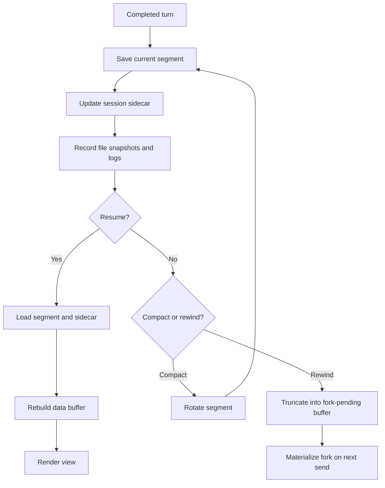

# Session Persistence

Sessions auto-save lazily and per-completed-turn. Compaction rotates
segments rather than rewriting in place.

Conversation compaction has its own doc in
[`compaction.md`](compaction.md). This page describes the session
persistence contract that compaction relies on.

## Persistence flow



## Session persistence

Sessions auto-save lazily and per-completed-turn under
`<workspace-root>/.mevedel/sessions/<name>-<timestamp>-<short-uuid>/`.
Ordinary model turns and direct foreground fork-skill turns share one
successful-turn transaction.  It advances the turn, records the token
baseline, saves before request teardown, runs `Stop`, restores temporary
permission state, ends the request, and schedules queued follow-up delivery.
Layout:

```
.mevedel/sessions/main-2026-04-23T14-30-a9f2/
  session.meta.el                    ; sidecar plist (workspace, perms, tasks, ...)
  .lock                              ; PID + hostname + buffer name; released on kill
  segment-0001.chat.org              ; finalized at compact #1
  segment-0002.chat.org              ; finalized at compact #2
  segment-0003.chat.org              ; current/live
  hook-log.el                        ; one hook execution plist per line
  permission-log.el                  ; permission/request diagnostic plists
  repair-log.el                      ; redacted tool-input validation telemetry
  file-history/                      ; per-session backup store
    4f1e8c9a3b2d6e57@v1
    4f1e8c9a3b2d6e57@v2
  agents/                            ; sub-agent transcript .chat.org files
```

The data buffer is locked to `org-mode` so `gptel-org--save-state`
can round-trip text-property bounds via `GPTEL_BOUNDS`. The sidecar
holds session-wide state that doesn't live in the buffer text:
permission rules, tasks, prompt-index (driving the rewind picker and
latest resume preview), `:file-snapshots` (per-turn map of tracked files
to backup names), workspace identity, `:working-directory`, fork lineage
(`:forked-from-session-id` / `:forked-from-turn`), and
`:agent-transcripts` metadata. It also records `:preset-name` and the resolved
buffer-local mevedel variables in `:preset-settings`; resume restores those
settings, and a normal fork deep-copies them so parent and child can diverge.
gptel's own buffer-local settings continue to use its Org persistence.

Worktree sessions are ordinary sessions whose `:working-directory` is a
Git linked worktree under the same workspace, created by `/worktree
create`. The old session remains live; the new session does not inherit
active requests, permission queues, tasks, background agents, or transcript
history. Unless `--clean` is used, the new data buffer starts with a
visible setup-context user turn explaining the source session, source
directory, worktree directory, branch, purpose, and warnings. That turn is
not sent automatically.

When a saved session's working directory no longer exists, resume prompts
for an existing replacement inside the workspace and persists that directory
after the session opens successfully.

The prompt-index is rebuilt from `mevedel-transcript-segments`
over the live segment. Only shared `user` spans whose real prompt text
starts outside gptel-owned org tool/reasoning/summary scaffolding become
rewind entries, so property drawers, compaction summaries, tool glue, and
stale structural gaps are not offered as user turns.

After gptel restores persisted bounds, session restoration calls
`mevedel-transcript-normalize-properties`. The transcript module reapplies
properties from its canonical structural ranges; persistence does not parse
transcript control forms itself.

Hook execution logs are append-only diagnostics.  The in-memory
`hook-log` slot is transient and capped, while `hook-log.el` keeps the
session's persisted hook entries as sanitized plists.  It is not read back
into live session state on resume.  Entries recorded before first
materialization are backfilled when the session directory is created.

Permission diagnostics are also append-only. `permission-log.el` records
permission queue and `RequestAccess` prompt lifecycle events so transient
overlays can be diagnosed after a turn or agent is aborted. It is not read
back into live session state on resume.  Pre-materialization entries wait in
a transient session queue and flush with the other diagnostic logs.

For mevedel chat buffers with dynamic preset system prompts, save-time
advice around `gptel--save-state` removes frozen `GPTEL_SYSTEM`
metadata. Restored sessions keep the preset reference and rebuild the
system prompt dynamically.

### Resume contract

On-disk state normally reflects a completed turn boundary. Mid-flight
requests are not recoverable; their pending tool calls are discarded by
virtue of never having been auto-saved. Abort/error teardown is an explicit
save boundary after prompts, agents, and the current request have been
cleared, so resumed sessions do not resurrect aborted runtime state.

### Rewind

`mevedel-rewind` picks any prior user prompt across all segments via
`completing-read`; selection truncates the live buffer to that turn's
response, sets `buffer-file-name` to nil so saves can't corrupt the
original, optionally restores tracked files to their state at that turn
(per-file plan with external-changes detection), and arms
`mevedel-session--fork-pending`.

### Fork

When the user sends in a buffer with `fork-pending` set,
`mevedel-session-persistence-fork-now` materializes a fresh fork
session — predecessor segment files copied verbatim, picked segment
truncated, file-history backups referenced by the target state copied,
and referenced agent transcript files copied — then the send proceeds
onto the fork's segment file. The parent session is never modified.

### Agent transcripts

Sub-agent transcript files live under `agents/`. The sidecar's
`:agent-transcripts` alist records each agent's id, type, description,
relative path, status, timestamps, parent turn, and call count. The
view uses this metadata to render handles and open terminal transcripts.

Running transcripts are coerced to `incomplete` on normal resume because
mid-flight sub-agent requests are not recoverable. Read-only attach
observes the on-disk state without rewriting it.

Live transcript views render directly from the running agent buffer. They
do not restore or normalize saved `GPTEL_BOUNDS` while the agent is
streaming, because partial reasoning/tool/system blocks may not have their
closing marker yet. The session property normalizer treats such incomplete
structural blocks as unclassified text until a complete block is present.
When repairing persisted metadata, it only reclassifies tool-shaped org
blocks that already carry a tool `gptel` property or overlapping non-empty
`GPTEL_BOUNDS` tool id; pasted transcript text that happens to contain
`#+begin_tool` stays ordinary user/ignored text.

### Input history

The view input ring is persisted at
`<workspace-root>/.mevedel/input-history.el` when the session is
writable. Missing files are normal. Corrupt
files are warned about once, renamed aside, and replaced with an empty
in-memory ring.

### Generated state excludes

When mevedel writes generated workspace state, it best-effort appends
exact entries to `.git/info/exclude` instead of ignoring the whole
`.mevedel/` tree. The generated entries are:

- `/.mevedel/sessions/`
- `/.mevedel/tool-results/`
- `/.mevedel/input-history.el`
- `/.mevedel/media/`

### Locking

`.lock` files prevent concurrent edits. Same-host active lock →
break / read-only / abort prompt; same-host stale lock → prompt to
break; cross-host → break / read-only / abort prompt. Same-host locks
are stale when their PID is dead or when the live process start time
proves PID reuse. If the process start time or lock timestamp cannot be
verified, the lock stays active.

### Auto-cleanup

`mevedel-session-max-age-days` (default 30) deletes expired sessions on
`mevedel-resume`, skipping active locks and throttled to once per
workspace per Emacs invocation. `nil` disables.

## Defcustoms

All in `mevedel-session-persistence.el`:

- `mevedel-sessions-directory` (default `.mevedel/sessions/`)
- `mevedel-session-max-age-days` (default 30)
- `mevedel-file-history-max-snapshots` (default 100)
- `mevedel-file-history-max-snapshot-bytes` (default 1 MB)
- `mevedel-view-input-history-size` (in `mevedel-view-history.el`,
  default 500)
