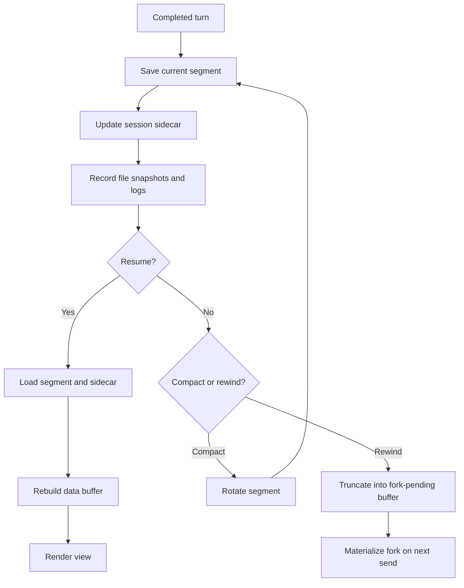

# Session Persistence

Sessions auto-save lazily and per-completed-turn. Compaction rotates
segments rather than rewriting in place.

Conversation compaction has its own doc in
[`compaction.md`](compaction.md). This page describes the session
persistence contract that compaction relies on.

A root data buffer owns one live session epoch. Fresh initialization emits
`SessionStart(startup)`, restoration emits `SessionStart(resume)`, and killing
the data buffer emits one `SessionEnd`. Successful `/clear` and root compaction
start `clear` and `compact` context epochs inside that same live epoch; they do
not emit `SessionEnd`. Their hook context is appended as a new snapshot and is
consumed by the next accepted root input, except automatic compaction attaches
compact-start context to its already-pending request.

## Persistence flow



## Session persistence

Sessions auto-save lazily and per-completed-turn under
`<workspace-root>/.mevedel/sessions/<name>-<timestamp>-<short-uuid>/`.
Ordinary model turns and awaited fork-skill turns share one
successful-turn transaction.  It advances the turn, records the token
baseline, saves before request teardown, runs `Stop`, restores temporary
permission state, ends the request, and schedules queued follow-up delivery.
Layout:

```
.mevedel/sessions/main-2026-04-23T14-30-a9f2/
  session.meta.el                    ; sidecar plist (workspace, perms, tasks, ...)
  .lock                              ; PID + hostname + buffer name; released on kill
  segment-0001.chat.org              ; finalized at compact #1
  segment-0002.chat.org              ; finalized at compact #2
  segment-0003.chat.org              ; current/live
  plans/current.md                   ; mutable standalone Plan draft/proposal
  plans/accepted-*.md                ; immutable accepted standalone plans
  hook-log.el                        ; one hook execution plist per line
  permission-log.el                  ; permission/request diagnostic plists
  repair-log.el                      ; redacted tool-input validation telemetry
  telemetry-log.el                   ; correlated lifecycle events, one plist/line
  diagnostics/run-*/                 ; profiler and full-suite resource reports
  file-history/                      ; per-session backup store
    4f1e8c9a3b2d6e57@v1
    4f1e8c9a3b2d6e57@v2
  agents/                            ; sub-agent transcript .chat.org files
```

The data buffer is locked to `org-mode` so `gptel-org--save-state`
can round-trip text-property bounds via `GPTEL_BOUNDS`. The sidecar
holds session-wide state that doesn't live in the buffer text:
permission rules, exact session resource grants, tasks, prompt-index (driving
the rewind picker and latest resume preview), `:file-snapshots` (per-turn map
of tracked files to backup names), workspace identity, `:working-directory`,
fork lineage (`:forked-from-session-id` / `:forked-from-turn`), and
`:agent-transcripts` presentation metadata and the explicit `:agent-registry`
containing retained paths, frozen configurations, activity, mailboxes, and
conversation locations. It also records `:preset-name` and the resolved
buffer-local mevedel variables in `:preset-settings`; resume restores those
settings, and a normal fork deep-copies them so parent and child can diverge.
gptel's own buffer-local settings continue to use its Org persistence.

Standalone Plan state lives in the same sidecar and session directory.
Here/Fresh finalizes the planning segment through the `/clear` rotation path
and records a `SessionStart(clear)` context snapshot.  Here/Summary instead
uses aggressive root compaction with no preserved tail and records the compact
handoff in the new segment.  Both contexts then submit the immutable accepted
path and full plan through the ordinary prompt and request lifecycle.  If
preparation or request startup fails, the sidecar keeps the accepted artifact,
selected context and permission mode, and the first incomplete step for
`mevedel-retry-plan-implementation`.  It also keeps a completed Summary
handoff, so retry repeats neither a finished Fresh rotation nor a successful
summary request.  The record is cleared only after request startup.

Plan approval can instead select Worktree/Fresh or Worktree/Summary.  Before acceptance, `RET`
collects and validates the branch name; cancelling the minibuffer leaves the
approval pending.  A dirty source checkout remains eligible, but the approval
warns that the linked worktree starts at `HEAD` and excludes uncommitted
changes.  Preparation never copies, stashes, or applies those changes.
The source keeps its approval archive, permission mode, and durable retry
record.  The new session inherits the source preset, model settings, and
ordinary Goal budget, gets the selected permission mode, and owns a
byte-identical immutable accepted artifact. Completed Worktree creation and
target-artifact steps are recorded by target session identity and path, so
retry restores that same target and does not create another worktree, session,
or artifact.

Worktree/Summary runs the same summary producer against the source transcript
without compacting or rotating it.  The cached handoff converts source-checkout
file references to repository-relative paths, and the new clean target segment
stores that summary before the target artifact path, full plan, and Direct
implementation instruction.  Retry reuses the summary, validated branch,
worktree, target artifact, inherited settings, and selected mode.

When approval selects Goal instead of Direct, Goal construction happens only
after the chosen segment, summary, Worktree, target settings, and target-local
accepted artifact exist. The prepared target session owns the Goal record and
its relative accepted-plan reference; the source session never owns or
transfers the Worktree Goal. The first turn stores the full artifact path, plan
content, and compact kickoff in the target transcript while the rendered view
uses the short Goal implementation label.

The telemetry stream and diagnostics directory are observational artifacts,
not resumable state. They are append-only within a run and are never consulted
to restore a session. See [`telemetry.md`](telemetry.md) for the event schema,
redaction boundary, and profiler procedure.

The Goal remains in the session sidecar as a strict phase-free record: identity,
objective, status/reason, token/time/turn accounting, optional budget, optional
accepted-plan reference, and timestamps. Provider usage is authoritative when
available; otherwise the request estimator supplies the charge.

Worktree sessions are ordinary sessions whose `:working-directory` is a
Git linked worktree under the same workspace, created by `/worktree
create`. The old session remains live; the new session does not inherit
active requests, permission queues, tasks, retained agents, or transcript
history. Unless `--clean` is used, the new data buffer starts with a
visible setup-context user turn explaining the source session, source
directory, worktree directory, branch, purpose, and warnings. That turn is
not sent automatically.

When a saved session's working directory no longer exists, resume prompts
for an existing replacement inside the workspace and persists that directory
after the session opens successfully.

The prompt-index is rebuilt from `mevedel-transcript-segments`
over the live segment. Only shared `user` spans whose real prompt text
starts outside gptel-owned org tool/reasoning/summary scaffolding become
rewind entries, so property drawers, compaction summaries, tool glue, and
stale structural gaps are not offered as user turns.

After gptel restores persisted bounds, session restoration calls
`mevedel-transcript-normalize-properties`. The transcript module reapplies
properties from its canonical structural ranges; persistence does not parse
transcript control forms itself.

Hook execution logs are append-only diagnostics.  The in-memory
`hook-log` slot is transient and capped, while `hook-log.el` keeps the
session's persisted hook entries as sanitized plists.  It is not read back
into live session state on resume.  Entries recorded before first
materialization are backfilled when the session directory is created.

Permission diagnostics are also append-only. `permission-log.el` records
permission queue lifecycle events so transient overlays can be diagnosed after
a turn or agent is aborted. It is not read
back into live session state on resume.  Pre-materialization entries wait in
a transient session queue and flush with the other diagnostic logs.

For mevedel chat buffers with dynamic preset system prompts, save-time
advice around `gptel--save-state` removes frozen `GPTEL_SYSTEM`
metadata. Restored sessions keep the preset reference and rebuild the
system prompt dynamically.

### Resume contract

On-disk state normally reflects a completed turn boundary. Pending tool calls
remain non-recoverable. Abort/error teardown is
an explicit save boundary after prompts, agents, and the current request have
been cleared, so resumed sessions do not resurrect aborted runtime state.
Managed execution registries are likewise transient: resume never reattaches
an operating-system process. After acquiring the session lock, resume
atomically reconciles running Bash rows across the restored segment and its
archived predecessors before rendering the view. The scan proceeds newest to
oldest: a later `execution-archive` or `execution-completion` record marks an
older copy as archived/superseded. Structured execution rows in later segments
provide the same successor evidence, including rows retained in a compacted
tail; a row with no successor becomes `lost`.

An active persisted Goal is restored `paused`, with an explicit session-resumed
reason; opening a session never dispatches Goal work. `/goal resume` is required
to continue. Normal rewind forks copy session preset settings but clear Goal
state.

### Rewind

`mevedel-rewind` picks any prior user prompt across all segments via
`completing-read`; selection truncates the live buffer to that turn's
response, sets `buffer-file-name` to nil so saves can't corrupt the
original, optionally restores tracked files to their state at that turn
(per-file plan with external-changes detection), and arms
`mevedel-session--fork-pending`.

Rewind refuses while the session has live executions and points the user to
`/ps` and `/stop`; hiding a process behind older history would violate its
session ownership boundary.

### Fork

When the user sends in a buffer with `fork-pending` set,
`mevedel-session-persistence-fork-now` materializes a fresh fork
session — predecessor segment files copied verbatim, picked segment
truncated, file-history backups referenced by the target state copied,
and referenced canonical agent transcript files copied — then the send
proceeds onto the fork's segment file. Numbered agent compaction archives are
unindexed recovery artifacts and are not copied. The parent session is never
modified. Fork staging receives an empty execution registry and reconciles
running Bash rows across the installed segment and copied predecessors before
the new directory is published, preserving later archive/completion successors
and marking only otherwise-stale rows `lost`.

Rewind refuses while an agent turn is active, so branching never
interrupts the source tree. A fork keeps eligible child transcript metadata and
files as read-only historical evidence, but starts with an empty addressable
registry and empty agent mailboxes. Historical handles remain inspectable,
while `ListAgents` and collaboration commands see only the fork's independent
tree. The task list, owner status notes, and last task-write marker also start
empty, so former canonical task names are immediately reusable. Session policy,
prompt state, skills, and reminders are independently copied; the workspace
identity and its cache are the only session-owned reference deliberately shared
with the source. The source sidecar and its retained tree are not modified.

Renaming a materialized session preserves live execution ownership. Retained
artifact paths are retargeted immediately after the session directory moves,
before process filters can append further output.

### Agent transcripts

Retained-agent transcript files live under `agents/`. The sidecar's
`:agent-transcripts` alist records presentation metadata for handles and
terminal transcript inspection. The separate `:agent-registry` is the
addressability source of truth; it persists canonical and parent paths, role
and frozen configuration, activity, unread mailbox, conversation location,
and internal storage identity.

On normal resume, a persisted active turn has no surviving provider request.
Recovery settles it once as interrupted, releases its capacity slot, preserves
the retained identity, conversation, and unread mail, and queues a canonical
`RESULT` for its spawn parent. Read-only attach observes the on-disk state
without rewriting it.

Live transcript views render directly from the running agent buffer. They
do not restore or normalize saved `GPTEL_BOUNDS` while the agent is
streaming, because partial reasoning/tool/system blocks may not have their
closing marker yet. The session property normalizer treats such incomplete
structural blocks as unclassified text until a complete block is present.
When repairing persisted metadata, it only reclassifies tool-shaped org
blocks that already carry a tool `gptel` property or overlapping non-empty
`GPTEL_BOUNDS` tool id; pasted transcript text that happens to contain
`#+begin_tool` stays ordinary user/ignored text.

### Input history

The view input ring is persisted at
`<workspace-root>/.mevedel/input-history.el` when the session is
writable. Missing files are normal. Corrupt
files are warned about once, renamed aside, and replaced with an empty
in-memory ring.

### Generated state excludes

When mevedel writes generated workspace state, it best-effort appends
exact entries to `.git/info/exclude` instead of ignoring the whole
`.mevedel/` tree. The generated entries are:

- `/.mevedel/sessions/`
- `/.mevedel/tool-results/`
- `/.mevedel/input-history.el`
- `/.mevedel/media/`

### Locking

`.lock` files prevent concurrent edits. Same-host active lock →
break / read-only / abort prompt; same-host stale lock → prompt to
break; cross-host → break / read-only / abort prompt. Same-host locks
are stale when their PID is dead or when the live process start time
proves PID reuse. If the process start time or lock timestamp cannot be
verified, the lock stays active.

### Auto-cleanup

`mevedel-session-max-age-days` (default 30) deletes expired sessions on
`mevedel-resume`, skipping active locks and throttled to once per
workspace per Emacs invocation. `nil` disables.

## Defcustoms

All in `mevedel-session-persistence.el`:

- `mevedel-sessions-directory` (default `.mevedel/sessions/`)
- `mevedel-session-max-age-days` (default 30)
- `mevedel-file-history-max-snapshots` (default 100)
- `mevedel-file-history-max-snapshot-bytes` (default 1 MB)
- `mevedel-view-input-history-size` (in `mevedel-view-history.el`,
  default 500)
