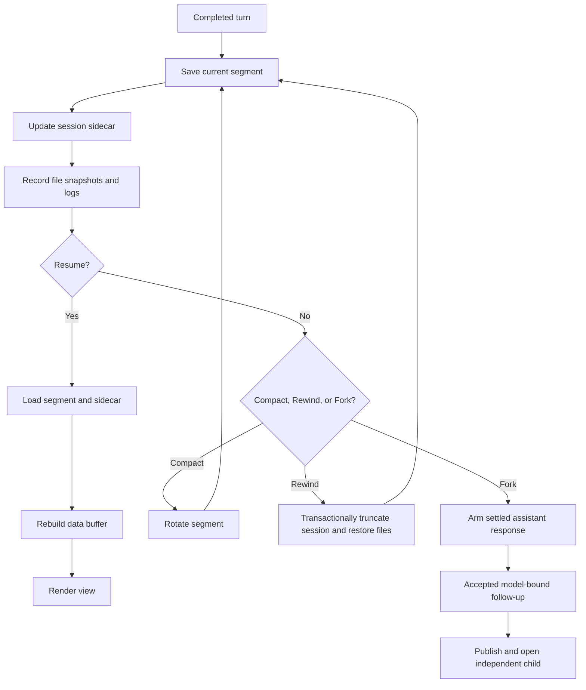

# Session Persistence

Settled directive work remains a complete first-class turn in its execution
session segment. Its canonical user, response, and `(tool . id)` properties are
saved through the normal transcript/GPTEL_BOUNDS path so resume and MevView use
the ordinary renderer. Paired hidden directive-boundary audit records retain
the directive id, action, and canonical turn identity; ordinary-chat request
assembly finds those boundaries in gptel's temporary prompt copy and marks the
enclosed body `gptel 'ignore`, including tool spans.

The workspace-owned implementation attempt or discussion turn also retains the
exact submitted request, terminal result, and matching
`(:session-id ... :turn ...)` checkpoint; implementation attempts additionally
retain the authored-request snapshot, capture timestamp, capture metadata, and
patch. Bash/Eval/execution-control or agent activity that may mutate files
outside the ordinary tool snapshot seam is retained as an explicit capture gap;
such an attempt is never labeled complete, and Rewind surfaces the gap before
restoring. This bounded duplication separates durable follow-up/inspection context
from transcript presentation. Every accepted request reserves its turn identity
before tools run, and that same identity keys pre-turn snapshots, transcript
metadata, the prompt/Rewind index, and the workspace record. A directive reuses
its bound live or persisted session. If that session no longer exists, rebinding
requires explicit confirmation and does not rewrite historical checkpoints.

Sessions auto-save lazily and per-completed-turn. Compaction rotates
segments rather than rewriting in place.

Conversation compaction has its own doc in
[`compaction.md`](compaction.md). This page describes the session
persistence contract that compaction relies on.

A root data buffer owns one live session epoch. Fresh initialization emits
`SessionStart(startup)`, restoration emits `SessionStart(resume)`, and killing
the data buffer emits one `SessionEnd`. Successful `/clear` and root compaction
start `clear` and `compact` context epochs inside that same live epoch; they do
not emit `SessionEnd`. Their hook context is appended as a new snapshot and is
consumed by the next accepted root input, except automatic compaction attaches
compact-start context to its already-pending request.

Plan Here/Summary is a root compaction and follows this rotation and context
epoch contract. Plan Worktree/Summary is a non-mutating handoff preparation:
the source sidecar caches its successful generated background in the durable
implementation retry record, but the source segment and context epoch stay
unchanged. The clean target later receives that cached background before its
accepted-plan implementation turn.

## Persistence flow


```mermaid
flowchart TD
    A[Completed turn] --> B[Save current segment]
    B --> C[Update session sidecar]
    C --> D[Record file snapshots and logs]
    D --> E{Resume?}
    E -- Yes --> F[Load segment and sidecar]
    F --> G[Rebuild data buffer]
    G --> H[Render view]
    E -- No --> I{Compact, Rewind, or Fork?}
    I -- Compact --> J[Rotate segment]
    I -- Rewind --> K[Transactionally truncate session and restore files]
    I -- Fork --> L[Arm settled assistant response]
    J --> B
    K --> B
    L --> M[Accepted model-bound follow-up]
    M --> N[Publish and open independent child]
```

## Session persistence

Sessions auto-save lazily and per-completed-turn under
`<workspace-root>/.mevedel/sessions/<name>-<timestamp>-<short-uuid>/`.
Ordinary model turns and awaited fork-skill turns share one
successful-turn transaction.  It advances the turn, records the token
baseline, saves before request teardown, runs `Stop`, restores temporary
permission state, ends the request, and schedules queued follow-up delivery.
Layout:

```
.mevedel/sessions/main-2026-04-23T14-30-a9f2/
  session.meta.el                    ; sidecar plist (workspace, perms, tasks, ...)
  .lock                              ; PID + hostname + buffer name; released on kill
  segment-0001.chat.org              ; finalized at compact #1
  segment-0002.chat.org              ; finalized at compact #2
  segment-0003.chat.org              ; current/live
  plans/current.md                   ; mutable standalone Plan draft/proposal
  plans/accepted-*.md                ; immutable accepted standalone plans
  hook-log.el                        ; one hook execution plist per line
  permission-log.el                  ; permission/request diagnostic plists
  repair-log.el                      ; redacted tool-input validation telemetry
  telemetry-log.el                   ; correlated lifecycle events, one plist/line
  diagnostics/run-*/                 ; profiler and full-suite resource reports
  file-history/                      ; per-session backup store
    4f1e8c9a3b2d6e57@v1
    4f1e8c9a3b2d6e57@v2
  agents/                            ; sub-agent transcript .chat.org files
```

The data buffer is locked to `org-mode` so `gptel-org--save-state`
can round-trip text-property bounds via `GPTEL_BOUNDS`. The sidecar
holds session-wide state that doesn't live in the buffer text:
permission rules, exact session resource grants, tasks, prompt-index (driving
the rewind picker and latest resume preview), `:file-snapshots` (per-turn
pre-turn checkpoints of tracked files, including absent markers and known
capture gaps; post-turn copies remain alongside them for historical Fork),
workspace identity, `:working-directory`,
fork lineage (`:fork-type`, `:forked-from-session-id`,
`:forked-from-turn`, and `:forked-from-fork-point-id`), and
Worktree Fork origin (`:worktree-source-root`, `:worktree-directory`,
`:worktree-branch`, and `:worktree-base-commit`), and
`:agent-transcripts` presentation metadata and the explicit `:agent-registry`
containing retained paths, frozen configurations, activity, mailboxes, and
conversation locations. It also records `:preset-name` and the resolved
buffer-local mevedel variables in `:preset-settings`, plus the session's exact
`:model-provider` and explicit `:reasoning-effort`; resume restores those
settings. A Session Fork also copies the source session's permission mode,
sandbox mode, session permission rules, and exact resource grants at the fork
point. Parent and child then diverge independently.
gptel's other buffer-local settings continue to use its Org persistence.
An Agent `summary` selection is persisted only in the child transcript as a
labelled `<task-background>` block before the authoritative Agent Task. The
parent sidecar and tool result retain only provider/model/effort metadata, not
the generated summary text.

Pending input is live-session state, not sidecar state. Same-turn steering,
queued follow-ups, their category order and edit state, session-local IDs,
delivery pause, and failure pause are deliberately transient. Killing and
resuming a session therefore restores accepted text only through the ordinary
workspace input history; it does not recreate either pending-input category or
any delivery state. There is no compatibility migration or queue-size cap.

Standalone Plan state lives in the same sidecar and session directory.
Here/Fresh finalizes the planning segment through the `/clear` rotation path
and records a `SessionStart(clear)` context snapshot.  Here/Summary instead
uses aggressive root compaction with no preserved tail and records the compact
handoff in the new segment.  Both contexts then submit the immutable accepted
path and full plan through the ordinary prompt and request lifecycle.  If
preparation or request startup fails, the sidecar keeps the accepted artifact,
selected context, permission mode, model/effort snapshot, canonical skill
references, implementation instructions, and the first incomplete step for
`mevedel-retry-plan-implementation`. It also keeps a completed Summary
handoff, so retry repeats neither a finished Fresh rotation nor a successful
summary request.  Direct clears the record after request startup. Goal instead
stores a reserved Goal ID before preparation and clears the record after the
matching Goal is durably constructed, before kickoff.

Plan approval can instead select Worktree/Fresh or Worktree/Summary.  Before acceptance, `RET`
collects and validates the branch name; cancelling the minibuffer leaves the
approval pending.  A dirty source checkout remains eligible, but the approval
warns that the linked worktree starts at `HEAD` and excludes uncommitted
changes.  Preparation never copies, stashes, or applies those changes.
The source keeps its approval archive, permission mode, and durable retry
record. The new session inherits the source preset and ordinary Goal budget,
gets the accepted model/effort snapshot and selected permission mode, and owns a
byte-identical immutable accepted artifact. Completed Worktree creation and
target-artifact steps are recorded by target session identity and path, so
retry restores that same target and does not create another worktree, session,
or artifact.

Worktree/Summary runs the same summary producer against the source transcript
without compacting or rotating it.  The cached handoff converts source-checkout
file references to repository-relative paths, and the new clean target segment
stores that summary before the target artifact path, full plan, and Direct
implementation instruction.  Retry reuses the summary, validated branch,
worktree, target artifact, accepted model/effort, implementation attachments,
and selected mode.

When approval selects Goal instead of Direct, Goal construction happens only
after the chosen segment, summary, Worktree, target settings, and target-local
accepted artifact exist. The prepared target session owns the Goal record and
its relative accepted-plan reference; the source session never owns or
transfers the Worktree Goal. The first turn stores the full artifact path, plan
content, and compact kickoff in the target transcript while the rendered view
uses the short Goal implementation label.

The source retry record is the durable handoff reservation. Its preallocated
Goal ID plus the target accepted-plan reference identify a construction that
survived a crash, allowing retry to reuse it without duplicating the Goal. A
different unfinished target Goal remains a conflict. A matching Goal restored
as paused is reactivated without scheduling; the surviving Plan handoff still
owns the explicit kickoff. Worktree targets keep
a temporary copy of the kickoff reservation so target input queues locally;
source input stays in the source session. Here input likewise queues behind the
kickoff. If kickoff startup fails after Plan recovery is cleared, the target
Goal is paused and its owned queue remains held for `/goal resume`.

The telemetry stream and diagnostics directory are observational artifacts,
not resumable state. They are append-only within a run and are never consulted
to restore a session. See [`telemetry.md`](telemetry.md) for the event schema,
redaction boundary, and profiler procedure.

The Goal remains in the session sidecar as a strict phase-free record: identity,
objective, status/reason, token/time/turn accounting, optional budget, optional
accepted-plan reference, and timestamps. Provider usage is authoritative when
available; otherwise the request estimator supplies the charge.

Worktree sessions are ordinary sessions whose `:working-directory` is a
Git linked worktree under the same workspace, created by `/worktree
create`. The old session remains live; the new session does not inherit
active requests, permission queues, tasks, retained agents, or transcript
history. Unless `--clean` is used, the new data buffer starts with a
visible setup-context user turn explaining the source session, source
directory, worktree directory, branch, purpose, and warnings. That turn is
not sent automatically.

When a saved session's working directory no longer exists, it remains visible
in the resume picker. Resume prompts for an existing replacement inside the
workspace and persists that directory after the session opens successfully.
For a Worktree Fork this does not recreate Git state: its original worktree
path, branch, base commit, and fork type remain origin metadata while its
current working directory changes. The picker labels the original path as
missing or the session as retargeted.

The prompt-index is rebuilt from `mevedel-transcript-segments`
over the live segment. Only shared `user` spans whose real prompt text
starts outside gptel-owned org tool/reasoning/summary scaffolding become
rewind entries, so property drawers, compaction summaries, tool glue, and
stale structural gaps are not offered as user turns.

After gptel restores persisted bounds, session restoration calls
`mevedel-transcript-normalize-properties`. The transcript module reapplies
properties from its canonical structural ranges; persistence does not parse
transcript control forms itself.

Hook execution logs are append-only diagnostics.  The in-memory
`hook-log` slot is transient and capped, while `hook-log.el` keeps the
session's persisted hook entries as sanitized plists.  It is not read back
into live session state on resume.  Entries recorded before first
materialization are backfilled when the session directory is created.

Permission diagnostics are also append-only. `permission-log.el` records
permission queue lifecycle events so transient overlays can be diagnosed after
a turn or agent is aborted. It is not read
back into live session state on resume.  Pre-materialization entries wait in
a transient session queue and flush with the other diagnostic logs.

For mevedel chat buffers with dynamic preset system prompts, save-time
advice around `gptel--save-state` removes frozen `GPTEL_SYSTEM`
metadata. Restored sessions keep the preset reference and rebuild the
system prompt dynamically.

### Resume contract

On-disk state normally reflects a completed turn boundary. Pending tool calls
remain non-recoverable. Abort/error teardown is
an explicit save boundary after prompts, agents, and the current request have
been cleared, so resumed sessions do not resurrect aborted runtime state.
Managed execution registries are likewise transient: resume never reattaches
an operating-system process. After acquiring the session lock, resume
queues a model-visible reconciliation reminder: prior commands may still run
or have partial effects, so the next turn must inspect current state and prefer
the newest user request. Aborting a live root request queues the same reminder
before the explicit save boundary. Resume also atomically reconciles running
Bash rows across the restored segment and its
archived predecessors before rendering the view. The scan proceeds newest to
oldest: a later `execution-archive` or `execution-completion` record marks an
older copy as archived/superseded. Structured execution rows in later segments
provide the same successor evidence, including rows retained in a compacted
tail; a row with no successor becomes `lost`.

An active persisted Goal is restored `paused`, with an explicit session-resumed
reason; opening a session never dispatches Goal work. `/goal resume` is required
to continue. Rewind preserves session preset settings but clears Goal state.

### Archived segment inspection

The session cockpit projects persisted segments in the existing view: `[`
shows the previous segment, `]` shows the next, and `g` chooses one directly.
The picker lists the canonical range from segment 1 through the live segment,
including each segment's latest prompt preview and `readable`, `missing`, or
`unreadable` status. Adjacent navigation reports the exact broken path instead
of skipping it; the picker lets the user bypass that segment.

Each archived projection renders exactly one segment and is read-only. It does
not merge earlier segments, modify the authoritative data buffer, or become a
resumable session state. The view remembers cursor, window, and fold state
ephemerally while moving among segments. The live composer draft remains
hidden and unchanged, and `[Latest]` returns to the live segment. Fresh resume
always starts at latest.

Live work may continue while an archived segment is displayed. Status,
interaction, and request-progress chrome stays live, while streaming transcript
updates wait until the user returns to latest. Live-tip actions such as Send,
follow-up, Compact, Review, Verify, and slash commands are refused. Fork,
Rewind, and conversation-variant switching use the historical assistant
response at point. A successful Rewind returns to latest; cancellation and
no-op Rewind remain on the archived projection.

### Rewind

`mevedel-rewind` picks a settled assistant response across all segments.
`mevedel-view-rewind-at-point`, also available as `R` in the session cockpit,
uses the response at point. Both routes show the same impact and require
explicit confirmation.

The cockpit's `n`/`N` actions move through rendered displays for inspection,
while `C-n`/`C-p` move through user queries. These navigation actions change
neither transcript nor session state; Rewind remains a separate explicit
operation.

Rewind is an in-place transaction. It discards the selected turn and every
later transcript and session artifact, restores every captured working-tree
file to immediately before the selected turn, and keeps
the same session identity, name, directory, working directory, and lineage.
The impact lists the discarded prompt suffix in order, including ordinary chat
and complete directive turns, alongside restored files and every known gap.
External working-tree changes to captured files are overwritten. Git HEAD and
the index are not changed, so the impact identifies staged files whose index
content will diverge from the restored working tree. Failure rolls back both
session and file changes, including a live transcript already replaced during
publication. A failed rollback reports every inconsistent path and retains its
temporary recovery directory; a successful Rewind removes those rollback
bytes. Every settled model turn, including the first, owns a durable pre-turn
checkpoint. The impact marks coverage as complete or lists known gaps; gaps do
not disable Rewind and are never presented as restored paths. Rewind creates
neither a child session nor a redo variant. Existing
child sessions and worktrees are not removed; children forked after the target
become detached from the Source's visible history.

Workspace-owned directive identity is not historical session state. Rewind
retains each authored directive and its current request, removes only model
activity at or after the target turn in that execution session, and recomputes
the lifecycle from what survives. A surviving request edit remains Ready with
a request-changed qualifier. Subdirectives consumed by discarded successful
attempts return to their parent from immutable attempt snapshots; subdirectives
authored later remain current, and neither receives independent activity.
Historical instruction snapshots restore source presentation only; a source
file restored by Rewind uses the normal safe anchor reattachment path. The
directive turn or read-only inspector's Rewind action resolves an
effectful attempt's exact execution session and pre-turn checkpoint, then uses
this same Rewind transaction and impact confirmation.

Only a committed Rewind emits `SessionStart(rewind)`; it does not emit
`SessionEnd`. Any context produced by that event belongs to the next accepted
prompt. Cancellation, rollback, and an empty impact emit no Rewind lifecycle
event. Selecting the latest response discards that response and its prompt,
even when it is the first turn in the session.

Current session settings survive. Tasks, Goal, retained agents and mailboxes,
pending Plan state, permission queues, and execution state are cleared because
they do not have a trustworthy per-turn journal.

Rewind refuses while the session has live executions and points the user to
`/ps` and `/stop`; hiding a process behind older history would violate its
session ownership boundary.

Rewind and `/clear` also refuse while either pending-input category is nonempty.
The user must resolve the entries in the Pending Inputs cockpit or explicitly
clear them with `C-c C-q` before a destructive transcript operation.

### Fork

`f` in the session cockpit arms a Conversation Fork and `F` arms a Worktree
Fork from the settled assistant response at point. Both focus the existing
composer draft. The interaction row identifies the assistant turn and fork
type; `[Cancel]` or `C-c C-k` disarms it without changing the draft. An empty
prompt, a local command, a failed syntax or mention preflight, or cancellation
creates no child.

The next preflight-valid model-bound submission publishes an ordinary child
session whose transcript ends at the selected response. Child then emits
`SessionStart(fork)` and owns skill expansion, `UserPromptSubmit`, and the
request. The draft and its referenced grants transfer from Source at
publication. A Child hook rejection keeps them in the published child for
revision without sending a request. The Source transcript, sidecar, lock,
workflow state, and checkout remain live and unchanged. The child keeps the
Source working directory and restores no files,
so Conversation Fork also works outside Git. A durable system-reminder
disclosure tells both the user and model that current files may be newer than
the conversation point and that file changes are shared with Source.

Worktree Fork requires a supported Git checkout. It creates a linked worktree
at the Source checkout's current `HEAD`, restores captured repository-local
files from the selected turn before the first prompt, and retargets valid
repository-local snapshot, permission, grant, and mention paths to the child
checkout. An unavailable individual backup leaves that child file at `HEAD`
and does not block the fork; the durable disclosure names every such file and
every malformed copied path record that was dropped. Invalid restoration
metadata, an unsafe target, or an unreadable required history store still
aborts. Uncaptured files retain their `HEAD` contents, uncommitted Source
changes are not copied, and captured external paths remain shared and
non-isolated. The disclosure also records the worktree path, branch, base
commit, restored-file count, and uncaptured-file semantics. A partial
disclosure renders as an expanded warning by default; collapsing it changes
only the view, never model context. Failure outside Git never falls back to
Conversation Fork.

The common fork projection copies current model, preset, effort, mode,
permission, skill, reminder, and hook configuration into independent
child-owned values. Prompt indexes, file snapshots, skill history, historical
agent transcripts, and accepted-plan evidence stop at the fork point. Tasks,
Goal, pending Plan/handoff state, addressable agents and mail, pending inputs,
requests, interactions, queues, executions, callbacks, logs, caches, and
one-shot prompt context start empty. Only dropped-file grants referenced by
the transferred draft move to Child.

Conversation children use the first unused direct-child name
`<source> · conversation N`, receive a normal unique session ID, and can be
renamed with `mevedel-rename-session`. Their sidecars retain the Source session
ID, cumulative fork turn, stable fork-point ID, and `conversation` fork type.
Worktree children independently use `<source> · worktree N`; their branch and
directory use the first suffix unused by either Git or the workspace's
`.worktrees/` directory.

Once a Fork exists, `B` switches variants for the exact assistant response at
point. The shared assistant header also shows a text switch such as
`[⇆ Source · 2 variants]`, `[⇆ Conversation · 2 variants]`, or
`[⇆ Worktree · 2 variants]`.  It remains available when the turn is folded.
With one alternative, `RET` or `mouse-1` opens it directly through the normal
session restore path and positions its view at the same stable fork point.
With several alternatives, the same action opens a stable chooser ordered
Source first and then direct Forks oldest to newest. It marks the current
session without moving it and shows each session identity, working directory,
latest prompt, sharing status, and Worktree branch/recovery state. Switching
redraws only source-backed history; each owning view keeps its composer draft
and the sessions keep their working directories.

A fork-point group is a star discovered from persisted Source identity plus
stable fork-point identity; Source stores no child list. A Child cannot fork
its inherited response again and is directed back to Source, but a later Child
response can become the Source of a separate group. Deleted, expired, or
rewound-past variants disappear independently. If Source disappears or no
longer contains the exact stable point, surviving direct Children remain a
detached sibling group and Source is omitted. Reusing a descriptive turn number
cannot reconnect that group.

Arming `F` reserves that exact branch and directory. Forking from an existing
linked worktree creates a sibling under the workspace's `.worktrees/` directory
from that checkout's current `HEAD`. If a later staging or publication step
fails, the created branch and worktree remain intact and the error reports
their names plus an exact `git worktree remove`/`git branch -D` cleanup
command. The armed composer keeps the same reservation, draft, and grants;
retry reports the existing-artifact conflict instead of allocating another
suffix.

Renaming a materialized session preserves live execution ownership. Retained
artifact paths are retargeted immediately after the session directory moves,
before process filters can append further output.

### Agent transcripts

Retained-agent transcript files live under `agents/`. The sidecar's
`:agent-transcripts` alist records presentation metadata for handles and
terminal transcript inspection. The separate `:agent-registry` is the
addressability source of truth; it persists canonical and parent paths, role
and frozen configuration, activity, unread mailbox, conversation location,
and internal storage identity.

On normal resume, a persisted active turn has no surviving provider request.
Recovery settles it once as interrupted, releases its capacity slot, preserves
the retained identity, conversation, and unread mail, and queues a canonical
`RESULT` for its spawn parent. Read-only attach observes the on-disk state
without rewriting it.

Live transcript views render directly from the running agent buffer. They
do not restore or normalize saved `GPTEL_BOUNDS` while the agent is
streaming, because partial reasoning/tool/system blocks may not have their
closing marker yet. The session property normalizer treats such incomplete
structural blocks as unclassified text until a complete block is present.
When repairing persisted metadata, it only reclassifies tool-shaped org
blocks that already carry a tool `gptel` property or overlapping non-empty
`GPTEL_BOUNDS` tool id; pasted transcript text that happens to contain
`#+begin_tool` stays ordinary user/ignored text.

### Input history

The view input ring is persisted at
`<workspace-root>/.mevedel/input-history.el` when the session is
writable. Missing files are normal. Corrupt
files are warned about once, renamed aside, and replaced with an empty
in-memory ring. Accepting same-turn steering or a queued follow-up records its
text in this ring immediately, independently of the transient queue state.

### Generated state excludes

When mevedel writes generated workspace state, it best-effort appends
exact entries to `.git/info/exclude` instead of ignoring the whole
`.mevedel/` tree. The generated entries are:

- `/.mevedel/sessions/`
- `/.mevedel/tool-results/`
- `/.mevedel/input-history.el`
- `/.mevedel/media/`

### Locking

`.lock` files prevent concurrent edits. Same-host active lock →
break / read-only / abort prompt; same-host stale lock → prompt to
break; cross-host → break / read-only / abort prompt. Same-host locks
are stale when their PID is dead or when the live process start time
proves PID reuse. If the process start time or lock timestamp cannot be
verified, the lock stays active.

### Auto-cleanup

`mevedel-session-max-age-days` (default 30) deletes expired sessions on
`mevedel-resume` and from `kill-emacs-hook`, including sessions whose sidecars
are obsolete, unreadable, or missing. Exit cleanup scans every workspace
registered during the Emacs invocation before releasing live-session locks.
Cleanup uses `:updated-at` when available, otherwise the sidecar or session
directory modification time. It skips active locks and is throttled to once per
workspace per Emacs invocation. `nil` disables.

## Defcustoms

All in `mevedel-session-persistence.el`:

- `mevedel-sessions-directory` (default `.mevedel/sessions/`)
- `mevedel-session-max-age-days` (default 30)
- `mevedel-file-history-max-snapshot-bytes` (default 1 MB)
- `mevedel-view-input-history-size` (in `mevedel-view-history.el`,
  default 500)
