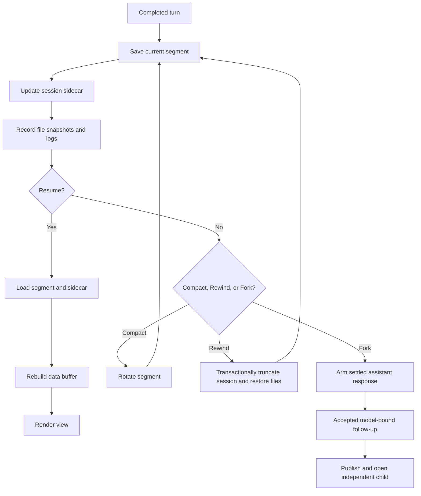

# Session Persistence

Settled directive work remains a complete first-class turn in its execution
session segment. Its canonical user, response, and `(tool . id)` properties are
saved through the normal transcript/GPTEL_BOUNDS path so resume and MevView use
the ordinary renderer. Paired hidden directive-boundary audit records retain
the directive id, action, and canonical turn identity; ordinary-chat request
assembly finds those boundaries in gptel's temporary prompt copy and marks the
enclosed body `gptel 'ignore`, including tool spans.

The workspace-owned implementation attempt or discussion turn also retains the
exact submitted request, terminal result, and matching
`(:session-id ... :turn ...)` checkpoint; implementation attempts additionally
retain the authored-request snapshot, capture timestamp, capture metadata, and
patch. Bash/Eval/execution-control or agent activity that may mutate files
outside the ordinary tool snapshot seam is retained as an explicit capture gap;
such an attempt is never labeled complete, and Rewind surfaces the gap before
restoring. This bounded duplication separates durable follow-up/inspection context
from transcript presentation. Every accepted request reserves its turn identity
before tools run, and that same identity keys pre-turn snapshots, transcript
metadata, the prompt/Rewind index, and the workspace record. A directive reuses
its bound live or persisted session. If that session no longer exists, rebinding
requires explicit confirmation and does not rewrite historical checkpoints.

Sessions auto-save lazily and per-completed-turn. Compaction rotates
segments rather than rewriting in place.

Conversation compaction has its own doc in
[`compaction.md`](compaction.md). This page describes the session
persistence contract that compaction relies on.

A root data buffer owns one live session epoch. Fresh initialization emits
`SessionStart(startup)`, restoration emits `SessionStart(resume)`, and killing
the data buffer emits one `SessionEnd`. Successful `/clear` and root compaction
start `clear` and `compact` context epochs inside that same live epoch; they do
not emit `SessionEnd`. Their hook context is appended as a new snapshot and is
consumed by the next accepted root input, except automatic compaction attaches
compact-start context to its already-pending request.

A failed fresh initialization retains neither the named data buffer nor its
companion view. Buffer-local cleanup hooks unwind any lifecycle state installed
before the failure, and retrying the same session name starts from a new buffer.

Plan Here/Summary is a root compaction and follows this rotation and context
epoch contract. Plan Worktree/Summary is a non-mutating handoff preparation:
the source sidecar caches its successful generated background in the durable
implementation retry record, but the source segment and context epoch stay
unchanged. The clean target later receives that cached background before its
accepted-plan implementation turn.

## Persistence flow


```mermaid
flowchart TD
    A[Completed turn] --> B[Save current segment]
    B --> C[Update session sidecar]
    C --> D[Record file snapshots and logs]
    D --> E{Resume?}
    E -- Yes --> F[Load segment and sidecar]
    F --> G[Rebuild data buffer]
    G --> H[Render view]
    E -- No --> I{Compact, Rewind, or Fork?}
    I -- Compact --> J[Rotate segment]
    I -- Rewind --> K[Transactionally truncate session and restore files]
    I -- Fork --> L[Arm settled assistant response]
    J --> B
    K --> B
    L --> M[Accepted model-bound follow-up]
    M --> N[Publish and open independent child]
```

## Session persistence

Persistence is split by ownership. `mevedel-session-codec.el` owns the closed
sidecar schema and validation; `mevedel-session-artifacts.el` owns paths,
artifacts, snapshots, and segment writes; `mevedel-session-rewind.el` owns
restore plans and the Rewind transaction; and `mevedel-session-fork.el` owns
Fork/Worktree projection, publication, and rename.
`mevedel-session-persistence.el` remains the lifecycle, resume, listing,
locking, and cleanup facade used by callers.

Sessions auto-save lazily and per-completed-turn under
`<workspace-root>/.mevedel/sessions/<name>-<timestamp>-<short-uuid>/`.
Ordinary model turns and awaited fork-skill turns share one
successful-turn transaction.  It advances the turn, records the token
baseline, saves before request teardown, runs `Stop`, restores temporary
permission state, ends the request, and schedules queued follow-up delivery.
Layout:

```
.mevedel/workspace-id                 ; project-owned portable workspace identity
.mevedel/sessions/main-2026-04-23T14-30-a9f2/
  session.meta.el                    ; non-authoritative current sidecar cache
  .lease/                            ; project-session portable lease generations
    00000000000000000001.el         ; current renewable ownership record
  .publications/
    generation-a1b2c3/
      000001.data                   ; immutable artifact bytes
      manifest.el                  ; logical path -> bytes + SHA-256
  .recovery/                       ; target-side project recovery only
    recovery-a1b2c3...el            ; marker, written after recovery bytes
    a1b2c3.../                      ; manual repair material
  segment-0001.chat.org              ; finalized at compact #1
  segment-0002.chat.org              ; finalized at compact #2
  segment-0003.chat.org              ; current/live
  hook-log.el                        ; one hook execution plist per line
  permission-log.el                  ; permission/request diagnostic plists
  repair-log.el                      ; redacted tool-input validation telemetry
  telemetry-log.el                   ; correlated lifecycle events, one plist/line
  diagnostics/run-*/                 ; resource reports; local sessions only
  file-history/                      ; per-session backup store
    4f1e8c9a3b2d6e57@v1
    4f1e8c9a3b2d6e57@v2
  local/                              ; lazy session-owned shared resources
    plans/current.md                 ; mutable Plan draft/proposal
    plans/accepted-*.md              ; immutable accepted plans
  artifacts/                         ; durable session artifacts (mockups,
                                     ; documents); cockpit inventory and
                                     ; collaboration byte source
  agents/                            ; sub-agent transcript .chat.org files
```

Project sessions use the portable authority profile on both local and TRAMP
targets: `.lease/` and immutable `.publications/` are authoritative, while
the familiar sidecar and segment paths are only fixed caches.  File-workspace
sessions use the separate `pid-lock` profile and `.lock`; they do not create a
lease or publication tree.  A session directory containing both control
artifacts, or a persisted authority profile that disagrees with its workspace
category, is rejected rather than guessed.

The data buffer is locked to bare `org-mode` so `gptel-org--save-state` can
round-trip text-property bounds via `GPTEL_BOUNDS`. Entering the mode suppresses
all major-mode hooks, Org startup UI, global-minor-mode attachment, and Local
Variables processing. The transcript is generated authoritative storage rather
than a normal Org editing surface, and model output must not activate project
or user configuration. The companion view owns presentation. The sidecar holds
session-wide state that doesn't live in the buffer text: permission rules,
exact or recursive session resource grants, tasks, prompt-index (driving the
rewind picker
and latest resume preview), `:file-snapshots` (per-turn pre-turn checkpoints of
tracked files, including absent markers and known capture gaps; post-turn
copies remain alongside them for historical Fork), workspace identity,
`:working-directory`, fork lineage (`:fork-type`, `:forked-from-session-id`,
`:forked-from-turn`, and `:forked-from-fork-point-id`), and Worktree Fork
origin (`:worktree-source-root`, `:worktree-directory`, `:worktree-branch`, and
`:worktree-base-commit`), and `:agent-transcripts` presentation metadata and
the explicit `:agent-registry` containing retained paths, frozen
configurations, activity, mailboxes, and conversation locations. It records
only the selected `:preset-name`; resume rebuilds mevedel variables from that
currently registered trusted preset, so sidecar data cannot name or populate
buffer locals. It also records the session's exact `:model-provider` and
explicit `:reasoning-effort`. This removal of persisted preset variable keys
and values and the durable ToolScript audit checkpoint change the sidecar
format to `v0.5.4`; older sessions are intentionally rejected rather than
migrated. The checkpoint contains the ToolScript call and bounded child audit,
never an interpreter continuation. A Session Fork also copies the source
session's permission mode, sandbox mode, session permission rules, and resource
grants at the fork point. Parent and child then diverge independently.
Other gptel buffer-local settings are request-time state only; mevedel does not
persist them as Org properties. An Agent `summary` selection is persisted only
in the child transcript as a labelled `<task-background>` block before the
authoritative Agent Task. The parent sidecar and tool result retain only
provider/model/effort metadata, not the generated summary text.

## Session-owned local state

`local/` is created lazily when the first durable write to `local://` succeeds.
It is shared by the root and its retained-agent tree, survives save, resume,
and rename, and is removed when its owning session is cleaned up. A Conversation
or Worktree Fork copies it into independent child state; Rewind leaves it
unchanged. Local files are not workspace snapshots, touched files, instruction
discovery, LSP inputs, directive patch captures, or Git summary inputs. An
ephemeral request without durable session ownership cannot create or mutate it.

`local/plans/` is the shared durable plan namespace. The parent and retained
agents use `local://plans/...` for current and accepted plans alongside shared
notes, findings, contracts, and handoffs. Accepted archives are always canonical
`accepted-TIMESTAMP.md` names, so every managed plan is addressable. The layout
is intentionally current: there is no migration or compatibility reader for an
older top-level `plans/` directory or persisted plan format.

`local/plans/` is the one exception to plain Fork copying, because it is managed
plan state rather than free-form local content. A Fork drops the copied
`local/plans/` subtree and re-adds only the accepted artifact that was already
accepted at the fork point, after re-verifying its recorded hash. The child
therefore starts without an inherited current-plan draft.

Session-owned `local://`, `artifact://`, `agent://`, and `history://` addresses
belong to the session's execution target. Client-local skill and memory roots
retain their origin, while MCP addresses use the current configured connection;
no resource address changes a session's target. See
[`address-to-resource.md`](address-to-resource.md#local).

The workspace identity is one opaque 64-character lowercase hexadecimal value
stored in `.mevedel/workspace-id` when the first session is materialized.  The
sidecar's nested `:workspace` record stores that `:workspace-id` together with
`:target-native-root`; the top-level `:working-directory` is target-native as
well.  Neither field stores a client-specific TRAMP prefix or the process-local
workspace registry id.  Resume binds the record to the currently opened
workspace, verifies its project-owned identity, maps saved target-native paths
to the current target root, and constructs a fresh immutable execution target.
A missing identity is an error.  An identity mismatch requires explicit
confirmation; declining aborts resume, while accepting binds the conversation
to the opened workspace and discards copied session permission rules, resource
grants, and additional roots.  The next save records the opened workspace's
identity.  Superseded sidecar shapes are not migrated.

The package release is `0.5.0`; its persisted session format is independently
`v0.5.4`.  The top-level `:authority-mode`, `:ptc-checkpoints`, and
execution-target incarnation are
required by that session format:
project sessions persist `portable`, while file-workspace sessions
persist `pid-lock`.  Portable project sessions always persist a non-empty
`:target-incarnation`, including local sessions; the local and TRAMP probes use
one canonical boot-id, machine-id, PID-1 start, and hostname payload, without
client-specific TRAMP spelling or Emacs build details.  Resume restores the
persisted baseline and compares it with the fresh observation before readiness
and authority admission, so a reboot or replacement target cannot inherit old
grants.  A replacement probe stages the observation without changing that
durable baseline.  The fence then runs as one transaction: it first revokes
exact session and workspace grants, then commits a sidecar marker containing
the new incarnation and no exact session grants; only that successful commit
acknowledges the replacement.  Resume with an acquired lease runs that
transaction immediately, so a restored session already carries the
acknowledged new incarnation; request admission runs it for replacements
observed later.  Publication failure leaves admission blocked and retryable.

Admission observes the fingerprint with one target command rather than a full
readiness probe.  Environment, capabilities, and sandbox facts are fixed for
the life of a connection, so they are probed when the session opens, when the
connection is replaced, and on `mevedel-retry-target-readiness`; re-deriving
them at every mutation boundary cost roughly fifteen synchronous round trips
per admitted mutation, and a session admits several per prompt.  A failed
observation falls back to the full probe, which settles the blocked readiness
that admission reports.

A lost settlement records the target process-group identity, so a mutating
request re-proves that group against the target before it is refused: an
affirmative `dead` clears the block with no user action, while live,
unreachable, or ambiguous keeps it. If the transport is already active, the
request stays blocked rather than nesting a target probe; the next mutation
attempt retries the proof. The durable latch restored across a restart carries
no process identity and still needs
`mevedel-retry-target-readiness`, which every refusal names.

The unsettled-mutation latch is
[`ADR 0098`](adr/0098-store-unsettled-mutation-in-the-session-lease.md); the
one portable authority profile is
[`ADR 0100`](adr/0100-portable-project-session-authority.md).

Portable control roots are physical target directories, not ordinary
pathname-checked caches. Lease generations, transfer requests and fences, and
specialized recovery markers are read and mutated through a pinned target-side
parent descriptor; symlinked roots or final entries fail closed. Each control
operation opens its parent directory, proves the opened directory is the
requested physical path, and then works only through that descriptor.

One target process carries a *program* of such operations rather than a single
one. Every operation in a program opens and re-proves its own parent, so a
program is exactly as pinned as the same operations run one at a time, while
costing one round trip instead of one per operation. A program stops at the
first operation that does not succeed and reports the rest as skipped, which is
what lets a caller state a precondition as a `verify` operation its writes
depend on: the proof and the write it guards share one process, which narrows
the window between them to two adjacent syscall sequences rather than a
network round trip. It does not remove the window -- another client can
exclusively create the next generation in between -- so a lease commit
decides who won from what it observes after its write, and exclusive
creation is the only atomic election. Each operation reports `ok`, `conflict`,
`absent`, `mismatch`, `failed` or `skipped`, so a caller reproduces the
per-operation nil-versus-signal contract of the single-operation wrappers.
Payloads and listings travel base64-encoded inside a NUL-framed request and
response, because filenames and content both contain bytes a shell cannot pass
through a command substitution literally. An operation marked optional does not
end its program, which is how ensuring a directory that may already exist
shares a round trip with the write that needs it. Target diagnostics are
captured separately from the response, so a tool writing to stderr cannot
present itself as a result.

Round trips therefore dominate durable session work over a real remote
connection, and the layer is written to spend as few as it can. One lease
commit is one program, not a clock read plus two listings plus two reads plus
a write. The interpreters those processes run through are resolved
once per target rather than per operation, because locating a program on a
TRAMP target costs one test per `exec-path` entry and the durability layer
inhibits the remote file-name cache; a refused operation drops the resolved
pair so a moved interpreter is looked up again. An operation that carries
content pays two further round trips, because TRAMP copies its input file to
the target and removes it afterwards. Reads never create control directories:
an absent transfer mailbox holds no requests, so a polling observer performs no
target mutation. Publication proves lease ownership immediately before every
artifact write and once after the last one; each of those proofs is one round
trip.
Portable lease expiry and transfer deadlines use the target filesystem clock at
whole-second resolution, so clients with skewed wall clocks cannot change one
another's authority and lease durations are configured in whole seconds.  A
lease observation reads that clock in the same process as the records it
inspects, and one durable transaction may answer from a reading it already took
for at most one second before taking another; local elapsed time only decides
when to read the target again and never becomes a time value, so no deadline is
ever derived from a client clock.  A
client reclaims its own expired lease without a prompt, because renewal cannot
run inside blocking target I/O and confirming a takeover from oneself is
meaningless; the exclusive creation of the next generation still refuses the
reclaim when another client claimed the lease meanwhile.  Taking over another
client's expired lease still requires explicit confirmation.

### Portable project durability publication

Portable project session state remains authoritative under the target
workspace's `.mevedel/` directory.  Before the first target-side state write in a live
Emacs client, mevedel discloses the exact state directory, the stored data
categories, and that mevedel does not encrypt them.  Acceptance is remembered
once per execution target for that Emacs process; another client or restart
discloses again.

Completed-turn saves and segment transitions stage their complete critical
artifact batch locally before target I/O.  Replacement files at their familiar
session paths are published through nearby target temporary files plus atomic
rename, but these fixed files are caches, not the durable snapshot boundary.
A successful session-local batch without a sidecar marker retains its staged
source locally.  A later batch with exactly one `session.meta.el` artifact
marked `:commit-marker t` merges those retained artifacts with the current
batch in order; duplicate logical paths use the last write.  Artifacts outside
the session directory remain ordinary fenced writes and never enter the
session snapshot.

A save whose durable state is byte for byte the committed snapshot performs no
target transaction at all: the candidate artifacts are hashed against the
committed manifest, and when every one matches, the save records nothing and
`updated-at` is not even stamped, because stamping it first would make the
sidecar differ on every call and defeat the comparison.  When some artifacts
differ, only those are published; an omitted artifact keeps its existing
manifest entry, so the logical snapshot is unchanged while whole per-artifact
ownership proofs are avoided.  The commit marker always publishes, because it is
the transaction's commit point rather than a payload.  `mevedel-save-session`
publishes regardless, for a user who wants a snapshot rather than a record of a
change.

The free-form `artifacts/` subtree is included recursively as literal regular
files in every portable save candidate. Its absent committed entries are
explicit `:delete t` tombstones: ordinary omission still means unchanged, while
a tombstone removes that logical from the overlaid manifest at the same marker
commit. Symlinks are not publication inputs. This makes the immutable manifest,
not a remote fixed cache, authority for artifact bytes after Resume, Save As,
and Fork. After an owned cold Resume fences and revalidates the publication
head, it replaces the fixed `artifacts/` subtree from verified manifest bytes;
a read-only inspector never performs that reconciliation.

The marker transaction copies the merged logical artifacts into a unique,
never-overwritten directory below `.publications/`, records each target-native
session-relative logical and published path plus its SHA-256, and creates the
immutable `manifest.el` last.  That directory, its artifacts and its manifest
are one target program, so the whole generation costs one round trip and the
manifest is still the last byte written inside it.  Updating the exact current
lease generation's `:publication-head` to that manifest is the only commit
point.  Every fixed
cache write precedes this commit, and no fixed or shared state is written
after a failed one.  Consequently, a reader sees either
the complete old manifest or the complete new one even if newer fixed caches
already exist.  A lifecycle replacement such as Rewind may put `:replace t`
only on the marker, which starts from an empty manifest rather than overlaying
the preceding snapshot.

An uncached read validates the manifest and all logical/control paths, returns
qualified immutable paths, and verifies the selected sidecar bytes eagerly.
Other artifact digests are verified only when those bytes are consumed, so
session listing costs one manifest plus one sidecar rather than the whole
conversation.  A nil head means the session is unpublished or incomplete.
The live owning session may resolve its newest retained local staged source
before falling back to its captured committed manifest; readers never treat
the fixed caches as authority.

Cooperative control transfer uses immutable generation-specific request and
decision records below `.lease/requests/`. Each lease records its open transfer
generation. Ordinary rotations preserve it, so every contender uses the same
exclusive request path even when a lease rotation lands between lookup and
creation. A successful rejection rotation opens the next transfer generation;
the decision alone does not. The owner pairs a decision with that request's
generation, and the pending request remains the only requester across ordinary
lease rotations. A request must still name the
current lease's client as its owner, so one left over from an earlier
ownership cannot cross a release. Granting a request does not move
authority: the owner drains existing work, commits one final publication, and
releases with a short requester-only fence. New mutation admission is refused
while draining; the named requester acquires only after observing the released
successor, then reloads the committed sidecar and transcript before its buffer
becomes writable. The requester also reads its exact immutable decision, so a
rejection ends the pending state and exposes a fresh request action. The fence
records the later generation actually released, while retaining the request's
identity; retries therefore remain idempotent after the owner's normal
generation drift. A failed refresh releases the new lease and leaves the
requester read-only. Sidecar, transcript, target, and instruction restoration
are staged before the live session or buffer advances, so a failed follower
refresh remains retryable. View-owned drain predicates survive committed-state
adoption. Transfer state is transient session state and is not serialized in
the sidecar. A view polls that state every
`mevedel-view-control-transfer-poll-seconds`, or every
`mevedel-view-control-transfer-remote-poll-seconds` when the session lives on a
target; each poll reads the lease head, the target clock, and the mailbox, so
the interval trades handoff latency against time on the one target connection
the user's own work also needs. The remote default is much longer because that
cost is real only there, and because a command in flight is also a window in
which a foreign process sentinel can issue its own remote operation on the same
connection — see [Transport reentrancy](#transport-reentrancy).

While a transfer is in flight — a request outstanding on either side — both
sides poll at `mevedel-view-control-transfer-active-poll-seconds` instead.
The idle cadence is chosen for a connection nobody is waiting on, and a
handoff composes three separate waits: the owner noticing the request, the
grant deadline, and the requester noticing the release fence. Paying the idle
interval for each turns a thirty-second handoff into minutes. Both sides
return to the idle cadence as soon as the transfer settles, so the timer is
re-armed per tick rather than fixed when the view is set up.

An unanswered request is granted by the owner's own poll once
`mevedel-session-transfer-prompt-timeout` passes, so control can be taken
from a machine nobody is sitting at. That window runs from the moment the
owner could first *see* the request, not from when the requester wrote it: a
poll interval can be longer than the timeout, and measuring from the
requester's clock granted requests the owner had never displayed. Worst-case
latency is therefore one poll interval plus the timeout, and the person at
the owner always gets the full timeout to press Keep. That requires the owner's Emacs to be
alive and polling; an owner that has died instead lets its lease expire, and
the successor takes over through the expired-lease path. Grant is not
release: the owner still drains, publishes, and releases, so a request
against a busy owner sits in `quiescing` until the work it is waiting on
finishes. Only the owner can say what that work is, so the owner's surface
names the blocker and the requester's says just that it is waiting.

`mevedel-take-control` is the one command for the requester's side. It routes
on lease state: an unheld or expired lease is acquired directly, because
there is no owner to ask and the lease layer's own confirmation is the whole
negotiation; a held one is requested. `mevedel-release-control` is the
reverse, saving and publishing before the lease goes and leaving the buffer
read-only and following.

Entering read-only mode reports itself as a message rather than a warning.
The buffer states its own authority in the interaction zone and the cockpit
header for as long as it holds, so a warning window would repeat durably
visible state and take the frame at the moment the user is watching the
handoff. A lease that fails to renew or is lost still warns: that is a
problem, not a transition. Neither side is privileged: the machine that just
handed control away is a non-owner like any other and can ask for it back.

### Following a session owned elsewhere

A buffer whose session is being written somewhere else — a joined client, or
a host that has handed control away — advances through the owner's committed
publications while `mevedel-session-follow-published` is non-nil, which is
the default and is read per buffer so one session can opt out through
`mevedel-toggle-follow`. `mevedel-refresh-session` performs the same read on
demand.

Updates are per publication, which means whole turns rather than streaming
tokens: a non-owner sees what the owner has committed, never work in
progress. The publication head in the lease record names the owner's current
generation, so an owner that has published nothing new costs one lease
observation and no artifact reads. When it has advanced, the follower reloads
the committed sidecar and segment through the same path a granted transfer
ends with, minus the lease and the write enable. A locally modified buffer is
never advanced: those edits are exactly what the transfer path refuses to
discard.
Like lease renewal, that poll performs no target I/O while another TRAMP
operation is in progress or while a publication owns the bounded window: Emacs
runs timers and process filters wherever the main loop waits, including inside
a TRAMP operation, and the owner poll may itself publish. The next tick
observes the same durable state once the transport is free.

### Transport reentrancy

Target I/O started while another remote operation is already in flight does not
merely fail. TRAMP refuses the reentrant call, or the nested command consumes
the running command's pending output and returns an answer belonging to
something else — an absent lock reads as present, and durable state derived
from that is wrong. Every caller reachable from a timer, a process filter, or
redisplay therefore asks `mevedel-transport-busy-p` first and defers through
`mevedel-transport-run-when-idle`.

That predicate combines two signals with complementary blind spots. Advice on
`tramp-file-name-handler` maintains a dynamic depth counter spanning the whole
of any operation this Emacs started through a file name, including operations
belonging to other packages: a mode line that stats a remote file during
redisplay opens exactly this window. When the outermost handler returns, the
same advice re-arms package-owned deferral timers created while TRAMP had
`timer-list` temporarily bound away; otherwise the pending entry would retain
a timer that can never fire. TRAMP's own
per-connection lock property covers callers that reach the connection without
a handler frame, but only for the instants it is held — TRAMP releases it and
runs timers between the send and the read, which is the window the depth
counter exists to see. TRAMP has no global in-operation flag, so a plain
variable check silently never fires.

Neither signal sees a remote process on a separate connection, so the predicate
is necessary rather than sufficient. `mevedel-session-control-fs` therefore also
refuses outright, with `mevedel-session-control-fs-busy`, any control operation
issued while the transport is busy: a visible failure is recoverable, a
fabricated answer is not.

Transport integration follows both package and TRAMP lifecycle. Unloading TRAMP
cancels deferred work and detaches the handler advice; reloading TRAMP restores
it while mevedel remains active. `mevedel-uninstall` cancels the same work and
keeps later TRAMP reloads detached until `mevedel-install` runs again; deferred
producer callbacks arriving in that interval are dropped.

The predicate only governs this package. It cannot stop the reverse case, which
is just as destructive: an idle timer belonging to a syntax checker or a mode
line does not consult it, and TRAMP's wait loop yields to timers with a command
in flight, so that timer sends its own command on the same connection and
consumes the reply this session was waiting for — our lease records arrive at
its parser, and the record we read belongs to it. Control operations, and the
whole save transaction around them, therefore run inside
`mevedel-transport-with-exclusive-connection`, which suspends timers for the
duration, exactly as TRAMP does around its own critical sections. A timer the
body arms is re-armed on exit rather than lost, and a `with-timeout` opened
inside it still fires, because the bound lists are the ones Emacs consults
while the body runs; only timers that existed beforehand are held.

Suspension stops timers, not process sentinels, and that residual is real
rather than theoretical. `accept-process-output` with JUST-THIS-ONE suppresses
other processes' *output* but still dispatches their status changes, so any
package that performs remote I/O from a sentinel can still nest inside a
mevedel command. Observed in practice: projectile advises `delete-file` to
invalidate its cache, which resolves a project root — `file-truename` over the
connection — whenever a native-compilation job or a syntax checker deletes its
own local temporary file. TRAMP refuses that nested call, which is the
outcome the guard exists to produce: the refusal belongs to the intruding
sentinel and the running command's reply is untouched. Nothing on this side can
prevent it, so the mitigation is to hold fewer commands in flight, which is why
the remote control-transfer poll is deliberately slow.

Each such package can be stopped at its own door, and projectile is worth
stopping: a remote session hits it on every temporary file any sentinel
deletes. `mevedel-transport--depth` is non-zero exactly while a TRAMP
operation is on the stack, so the intruding work can decline to run there:

```elisp
(with-eval-after-load 'projectile
  (define-advice delete-file-projectile-remove-from-cache
      (:around (fn filename &optional trash) skip-inside-remote-operation)
    (if (and (bound-and-true-p mevedel-transport--depth)
             (> mevedel-transport--depth 0))
        nil
      (funcall fn filename trash))))
```

The cache update is skipped only inside that window; a delete outside one
maintains the cache as before, and the entry skipped is stale until the next
`projectile-invalidate-cache`.

Note what the test is *not*. Whether FILENAME looks remote decides nothing:
the file a sentinel deletes is typically a local temporary, and it is
projectile's *project root* that is remote, so the truename crosses the
connection however the argument is spelled. The same mistake is available
inside this package, and the transport's own state is the only reliable
answer to "will this reach the target".

Turn settlement is deferred as one unit for the same reason. gptel drives it
from a process sentinel, which Emacs may dispatch from inside an unrelated
remote operation. Only the turn commit — the single-use reservation fence,
which touches no target — runs synchronously there; the publishing steps wait
for an idle transport. The chain defers whole rather than step by step because
its order is load-bearing: ending the request follows the autosave, and
inverting them drops the turn's file-history checkpoints.

Without a prefix, `M-x mevedel` lists persisted workspace sessions before
creating a buffer, after sweeping expired sessions and locks left behind by
dead Emacsen. Each candidate carries the action its authority produces,
alongside `Start new session`:

| Lease state | Label | Outcome |
|---|---|---|
| already open in this Emacs | `Switch` | switch to the live buffer |
| `available` | `Resume` | acquire the lease, writable |
| `foreign` | `Join` | read-only, following the owner |
| `expired` | `Take over` | confirmed takeover |

The verb comes from the lease alone. Whether the workspace is local or
reached over TRAMP is a property of the client's vantage point, not of the
session: two machines see one session directory through different path
spellings, and what decides the outcome is whether anybody is writing it.
The row's annotation names the machine involved — `held by desktop`,
`lease expired, was laptop` — from the lease record's `:host`, since the
client id is opaque and per-process and can only answer "is this me, now".
A lease written before hosts were recorded reads as unknown, not as an error.

Joining an active writer opens only its last committed publication and exposes
`Request control` in the view. Expired takeover still requires the ordinary
explicit confirmation. Starting an independent session while another one is
*held* — joined or open here, not merely resumable or expired — warns that both
share project files and points to a Worktree Fork for isolation. An expired
lease does not warn: its writer is gone, which is the reason that row offers a
takeover in the first place.

A failure before the manifest-head compare-and-set retains the current and
previously retained staged sources as one transient local recovery, surfaces
`Publication pending` in session status, and blocks request and mutation
admission until `mevedel-session-publication-retry` succeeds or the
user explicitly runs
`mevedel-session-publication-abandon`.  Once the compare-and-set
succeeds, the transaction is durable even if the final `publishing` to
`active` lease normalization fails: the client fails closed with visible lease
loss, consumes the transaction sources, and does not create recovery or
republish the committed bytes.  Normal session-buffer closure and Emacs exit
are refused while recovery is pending, so releasing a lease cannot silently
turn the only local recovery into an unreachable temporary directory.
If publication is queued reentrantly while a live publisher is being released,
lease release converts the queued and preceding uncommitted batches into the
same pending-recovery state instead of deleting their staged sources.

An incomplete portable-project Rewind rollback has a stronger recovery boundary. Before
the failure is reported, its local repair directory is copied into a unique
directory below the session's target-side `.recovery/` control tree and a
`recovery-*.el` marker is atomically written last. The marker makes manual
recovery durable across client loss: restore, lease takeover, and every later
mutation admission refresh it and remain blocked until the user explicitly
abandons the recovery. Any client that can inspect the session can therefore
find the named target-side bytes. The client-local directory is removed only
after the marker is installed; if target installation fails, it is retained
and the warning reports both the failed target install and its exact local
path. Target recovery is not a publication artifact: `.recovery/` is excluded
from immutable publications, Rewind materialization, forks, and Save As
clones. Explicit abandonment is destructive and removes the target marker and
bytes (or the retained local fallback) while holding the session lease. A
successful rollback leaves no recovery tree.

Critical publication changes the owned generation to `publishing` and reserves
a one-hour ownership window before each artifact.  Timer callbacks perform no
target I/O while publication is active, avoiding reentrant TRAMP calls; the
serialized publisher renews before and immediately after every artifact
instead.  If one uninterrupted target filesystem operation exceeds that
window, the next ownership check fails closed and preserves local recovery.
Another client may take over an expired publishing generation only after an
explicit prompt warns that a critical write may still be in flight and asks
the user to confirm that the prior client is stopped.

The same bounded reservation wrapper covers long synchronous lifecycle I/O,
such as target-side copy, restore, and rename.  It suppresses timer target I/O
and checks final ownership but does not itself publish, commit, or drain queued
artifacts.

A generation is written on every committed save, so a turn that streamed for a
minute leaves dozens of them; one day of one session measured 101 generations
and 67 MB, of which 54 MB was superseded copies of a growing transcript.  A
settled turn is where the generations that turn published stop being anyone's
recovery state -- until settlement they are what a crashed owner resumes from,
and afterwards nothing resolves through them -- so
`mevedel-session-publication-collect-generations` runs there, best-effort,
under the owner's lease.  It also runs when a restore acquires the lease,
because a turn that never settles -- crash, suspend, lost provider callback
-- orphans everything it published and settlement never sees it again: one
real two-day session accumulated 421 collectible generations (366 MB) that
way.

A collection pass is complete: every collectible generation is deleted in one
batched control program (`mevedel-session-control-fs-delete-directories`),
so a backlog costs one extra round trip rather than surviving to the next
settlement.  An earlier per-pass cap of 32, motivated by one-deletion-per-
program round trips, lost by arithmetic once publications streamed in at
several per minute.

Collection reads every published sidecar rather than a recent window,
because coarse target timestamps make "the newest N generations" an
unreliable set when several publishes share a second: a generation the
current head still resolves through could fall outside such a window.
Manifests and sidecar facts are therefore cached in memory per generation
path, which a committed generation's immutability makes sound.  Reading
752 uncached generations measured 17 seconds inside one settlement and
0.12 once cached, so the cache is what makes the complete scan
affordable rather than an optimisation.

Collection is a mark-and-sweep, never an age cap, because manifests are
chained: a committed manifest carries unchanged entries forward verbatim rather
than copying their bytes, so a retained head resolves artifacts through the
generations that first wrote them.  Deleting by age would break the current
head.  Three kinds of generation are retained: one per distinct settled turn
state, which is what a restore targets; the newest
`mevedel-session-publication-keep-recent-generations` regardless; and the
reference closure of both.  A generation captured mid-turn is not a settled
state -- its latest prompt is one turn ahead of its turn count -- so it is
collectable once its turn settles, and orphaned generations from failed
publishes fall out of the same closure test.

The retained count therefore floors above the number of turns rather than at
it: the measured session collects 88 of 101 generations and keeps 13, because
retained blobs keep their original directories alive.  Making it exactly one
directory per turn would mean rewriting each retained head as self-contained,
which is the copying that carry-forward exists to avoid.

`ponytail:` collection has no read pins.  The grace window covers the race it
replaces them for -- a follower re-reads the owner's current head rather than
pinning it, and the newest generations are retained regardless -- but a reader
that resolved an older non-boundary head can still lose its bytes, and will see
a hash or absence failure rather than silent corruption.  Add pins if
cross-client following of superseded heads ever becomes a real access pattern.

Terminal retained-agent state in an already-materialized portable project session uses
the same seam: finalization first updates the in-memory transcript metadata and
registry, then publishes the agent transcript followed by the session sidecar
as one batch.  A mid-batch failure therefore leaves one retryable recovery and
blocks later mutation.  Transcript allocation may shallowly create the session
directory before the first root turn settles, but the first acknowledged agent
registry or mailbox mutation forces a full non-fork-point root snapshot.  The
sidecar therefore exists before mevedel reports the child publication or wakes
a mailbox consumer; the root turn's later DONE publication still establishes
its first stable fork point.

An acknowledged agent mutation refuses reentrant publication queueing: its
caller returns only after that batch changes the immutable head.  Once the head
has changed, later lease normalization or buffer save-hook failures are
diagnostic cleanup failures rather than grounds to roll live agent state back.

Observational agent persists are not acknowledged mutations.  Activity
transitions (blocked/waiting flavors and their release) and mailbox
consumption debounce into one sidecar-only registry save
(`mevedel-session-persistence-save-agent-state-soon`, landing as
`mevedel-session-artifacts-save-agent-registry`): the sidecar carries the
agent registry the persist is about, and the transcript segment is committed
at settlement, so the observational path never saves the segment or scans
snapshots.  A synchronous acknowledged commit absorbs a pending one, and
Emacs exit flushes the rest.  Recovery treats every active activity
identically and mail delivery is at-least-once, so a crash inside the
debounce window costs at most a stale activity flavor and an
already-possible re-delivery.  See ADR 0112.

Diagnostic streams (telemetry, hook, permission, and repair logs) reach a
remote target as one pinned `append` operation carrying only the delta;
republishing the whole file per flush was quadratic in stream size.  The
append works in place, so a crash mid-operation can tear one trailing line of
a stream nothing reads at resume.

Local Fork and Rewind retain their same-filesystem directory transactions and
rollback trees.  Portable project lifecycle commits use the immutable
publication head instead.  A portable project fork acquires one fresh child
lease in hidden staging,
publishes a complete `:replace t` child snapshot, then moves the staged tree
with its `.lease/` and `.publications/` control state while the bounded lease is
reserved.  The child's save path changes immediately and restore retains that
same generation; it is never released and reacquired at a discoverable path.
The replacement manifest contains the selected transcript, accepted-plan
evidence, retained agent transcripts, file-history artifacts, and the current
`artifacts/` subtree resolved from the Source's committed manifest, never its
fixed caches.

Portable project Rewind does not rename or exchange the session directory.  It
materializes only logical committed artifacts, excludes `.lease/` and
`.publications/` by construction, restores project files under a bounded lease
reservation, then commits the complete rewound snapshot with one `:replace t`
sidecar marker against the current generation and head.  A pre-commit failure
revalidates the same authority before rolling project files back.  Incomplete
rollback fails closed visibly and retains recovery bytes; the control trees
and current lease generation are never copied, moved, or replaced.

Portable project Rename reserves the owned lease while moving the whole session tree,
immediately retargets the bound session to the moved `.lease/`, refreshes its
captured immutable paths, and commits the renamed sidecar against the same
generation and head.  Failure before that head compare-and-set moves the tree
and in-memory paths back under revalidated authority; failure after it leaves
the committed rename installed and reports lease loss.

Portable project Save As captures the parent's current committed publication
through the `mevedel-session-save-as.el` transaction while holding its lease.
That module materializes only the manifest's logical artifacts in hidden child
staging, acquires a fresh child lease before writing them, commits one complete
replacement publication, and moves the staged child into discoverability
before releasing the parent.  Adoption target-verifies that already-owned
child lease, transfers its exact path, generation, and renewal responsibility
into the live session, and only then releases the old parent path; it never
reacquires child authority after live mutation.  The child therefore starts
with one publication and no copied lease, publication-history, recovery, lock,
or staging controls; work is proportional to current logical state rather
than the parent's retained history.  Its in-memory session is built by the same
explicit slot policy as every Save As path: logical containers are deep-copied,
the workspace and immutable execution-target identity are shared, and all
request, queue, publication, transfer, and lease runtime is reset.  Pre-commit
failure removes staging and leaves
the parent unchanged.  Once the marker commits, later finalization failure
retains the independently resumable child and reports the failure instead of
rolling it back. If the final staging-directory rename itself fails, session
listing recognizes that hidden committed child by its verified publication;
the live buffers and lease stay attached to that recoverable path.

Pending input is live-session state, not sidecar state. Same-turn steering,
queued follow-ups, their category order and edit state, session-local IDs,
delivery pause, and failure pause are deliberately transient. Killing and
resuming a session therefore restores accepted text only through the ordinary
workspace input history; it does not recreate either pending-input category or
any delivery state. There is no compatibility migration or queue-size cap.

Standalone Plan metadata lives in the same sidecar, while its artifacts live
under `local/plans/` in the session directory.
Here/Fresh finalizes the planning segment through the `/clear` rotation path
and records a `SessionStart(clear)` context snapshot.  Here/Summary instead
uses aggressive root compaction with no preserved tail and records the compact
handoff in the new segment.  Both contexts then submit the immutable accepted
path and full plan through the ordinary prompt and request lifecycle.  If
preparation or request startup fails, the sidecar keeps the accepted artifact,
selected context, permission mode, model/effort snapshot, canonical skill
references, implementation instructions, and the first incomplete step for
`mevedel-retry-plan-implementation`. It also keeps a completed Summary
handoff, so retry repeats neither a finished Fresh rotation nor a successful
summary request.  Direct clears the record after request startup. Goal instead
stores a reserved Goal ID before preparation and clears the record after the
matching Goal is durably constructed, before kickoff.

Plan approval can instead select Worktree/Fresh or Worktree/Summary.  Before acceptance, `RET`
collects and validates the branch name; cancelling the minibuffer leaves the
approval pending.  A dirty source checkout remains eligible, but the approval
warns that the linked worktree starts at `HEAD` and excludes uncommitted
changes.  Preparation never copies, stashes, or applies those changes.
The source keeps its approval archive, permission mode, and durable retry
record. The new session inherits the source preset and ordinary Goal budget,
gets the accepted model/effort snapshot and selected permission mode, and owns a
byte-identical immutable accepted artifact. Completed Worktree creation and
target-artifact steps are recorded by target session identity and path, so
retry restores that same target and does not create another worktree, session,
or artifact.

Worktree/Summary runs the same summary producer against the source transcript
without compacting or rotating it.  The cached handoff converts source-checkout
file references to repository-relative paths, and the new clean target segment
stores that summary before the target artifact path, full plan, and Direct
implementation instruction.  Retry reuses the summary, validated branch,
worktree, target artifact, accepted model/effort, implementation attachments,
and selected mode.

When approval selects Goal instead of Direct, Goal construction happens only
after the chosen segment, summary, Worktree, target settings, and target-local
accepted artifact exist. The prepared target session owns the Goal record and
its relative accepted-plan reference; the source session never owns or
transfers the Worktree Goal. The first turn stores the full artifact path, plan
content, and compact kickoff in the target transcript while the rendered view
uses the short Goal implementation label.

The source retry record is the durable handoff reservation. Its preallocated
Goal ID plus the target accepted-plan reference identify a construction that
survived a crash, allowing retry to reuse it without duplicating the Goal. A
different unfinished target Goal remains a conflict. A matching Goal restored
as paused is reactivated without scheduling; the surviving Plan handoff still
owns the explicit kickoff. Worktree targets keep
a temporary copy of the kickoff reservation so target input queues locally;
source input stays in the source session. Here input likewise queues behind the
kickoff. If kickoff startup fails after Plan recovery is cleared, the target
Goal is paused and its owned queue remains held for `/goal resume`.

The telemetry stream and diagnostics directory are observational artifacts,
not resumable state. They are append-only within a run and are never consulted
to restore a session. Because nothing restores from them, a session saved on a
target keeps its profiler run directory on the client instead — in a per-run
temporary directory, not `diagnostics/` — so a multi-megabyte profile never
crosses the connection. Diagnostics for such a run are consequently not
portable. See [`telemetry.md`](telemetry.md) for the event schema, redaction
boundary, and profiler procedure.

The Goal remains in the session sidecar as a strict phase-free record: identity,
objective, status/reason, token/time/turn accounting, optional budget, optional
accepted-plan reference, and timestamps. Provider usage is authoritative when
available; otherwise the request estimator supplies the charge.

Worktree sessions are ordinary sessions whose `:working-directory` is a
Git linked worktree under the same workspace, created by `/worktree
create`. Git availability, worktree-command support, and branch validity are
checked on the session execution target before any worktree state is created.
The linked checkout and its session remain on that same target, while
setup-context paths use the target-native spelling. The old session remains
live; the new session does not inherit active requests, permission queues,
tasks, retained agents, or transcript history. Unless `--clean` is used, the
new data buffer starts with a visible setup-context user turn explaining the
source session, source directory, worktree directory, branch, purpose, and
warnings. That turn is not sent automatically.

When a saved session's working directory no longer exists, it remains visible
in the resume picker. Resume prompts for an existing replacement inside the
workspace and persists that directory after the session opens successfully.
For a Worktree Fork this does not recreate Git state: its original worktree
path, branch, base commit, and fork type remain origin metadata while its
current working directory changes. The picker labels the original path as
missing or the session as retargeted.

The prompt-index is rebuilt from `mevedel-transcript-segments`
over the live segment. Only shared `user` spans whose real prompt text
starts outside gptel-owned org tool/reasoning/summary scaffolding become
rewind entries, so property drawers, compaction summaries, tool glue, and
stale structural gaps are not offered as user turns. The rebuild is one
forward pass: the block-depth prefix each span needs is carried along
rather than recounted from the start of the buffer per turn, which matters
because the rebuild runs on every settled save and a live segment is
bounded only by the compaction threshold.

After mevedel restores persisted bounds, session restoration calls
`mevedel-transcript-normalize-properties`. The transcript module reapplies
properties from its canonical structural ranges; persistence does not parse
transcript control forms itself.

Hook execution logs are append-only diagnostics.  The in-memory
`hook-log` slot is transient and capped, while `hook-log.el` keeps the
session's persisted hook entries as sanitized plists.  It is not read back
into live session state on resume.  Entries recorded before first
materialization are backfilled when the session directory is created.

Permission diagnostics are also append-only. `permission-log.el` records
permission queue lifecycle events so transient overlays can be diagnosed after
a turn or agent is aborted. It is not read
back into live session state on resume.  Pre-materialization entries wait in
a transient session queue and flush with the other diagnostic logs.  Failed
hook, repair, permission, and telemetry appends stay queued and retry after
the next successful session save; they never block critical publication.
Portable project diagnostic appends share one reservation only with appends
owned by the same session and send only their queued delta. A nested flush for
another session reserves that session's lease independently. A crash may tear
the final line; failed appends leave the in-memory entries queued.

For mevedel chat buffers, save-time advice around `gptel--save-state`
strips every gptel request-config Org property (`GPTEL_BACKEND`,
`GPTEL_MODEL`, `GPTEL_PRESET`, `GPTEL_SYSTEM`, effort, tools, and the
rest), keeping only `GPTEL_BOUNDS`. The sidecar is the sole durable
source of session request configuration; a stale drawer copy would
otherwise override live buffer-locals through gptel's send advice
(`gptel-org--send-with-props`), silently undoing a mid-session model
change. The same strip runs at chat-buffer init and agent hydration so
segments persisted with the old format are cleaned on sight. Restored
sessions rebuild model, effort, and preset from the sidecar
(`mevedel-model-apply-session-policy`, `mevedel-preset-restore-session`).

### Resume contract

On-disk state normally reflects a completed turn boundary. Pending tool calls
remain non-recoverable. Abort/error teardown is an explicit save boundary after
prompts, agents, and the current request have been cleared, so resumed sessions
do not resurrect aborted runtime state. Managed execution registries are
likewise transient: resume never reattaches an operating-system process. After
acquiring the session lock, resume queues a model-visible reconciliation
reminder: prior commands may still run or have partial effects, so the next
turn must inspect current state and prefer the newest user request. Aborting a
live root request queues the same reminder before the explicit save boundary.
ToolScript is the narrow exception to the non-recoverable tool rule: its guest
machine remains transient, but the sidecar stores the envelope and bounded
child audit. Resume converts a surviving checkpoint to an interrupted
ToolScript row, never resumes the script, and commits the repaired segment
together with clearing the checkpoint. Resume also atomically reconciles
running Bash rows across the restored segment and its archived predecessors
before rendering the view. The scan proceeds newest to oldest: a later
`execution-archive` or `execution-completion` record marks an older copy as
archived/superseded. Structured execution rows in later segments provide the
same successor evidence, including rows retained in a compacted tail; a row
with no successor becomes `lost`.

An active persisted Goal is restored `paused`, with an explicit session-resumed
reason; opening a session never dispatches Goal work. `/goal resume` is required
to continue. Rewind preserves session preset settings but clears Goal state.

### Archived segment inspection

`mevedel-view-segments.el` owns the ephemeral inspection buffer and switching
state; `mevedel-session-artifacts.el` remains the sole owner of segment
descriptors and bytes. Source-backed expand/collapse state within either
projection remains owned by `mevedel-view-disclosure.el`.

The session cockpit's Navigate submenu projects persisted segments in the
existing view: `[` shows the previous segment, `]` shows the next, and `g`
chooses one directly.
The picker lists the canonical range from segment 1 through the live segment,
including each segment's latest prompt preview and `readable`, `missing`, or
`unreadable` status. Adjacent navigation reports the exact broken path instead
of skipping it; the picker lets the user bypass that segment.

Each archived projection renders exactly one segment and is read-only. It does
not merge earlier segments, modify the authoritative data buffer, or become a
resumable session state. The view remembers cursor, window, and fold state
ephemerally while moving among segments. The live composer draft remains
hidden and unchanged, and `[Latest]` returns to the live segment. Fresh resume
always starts at latest.

Live work may continue while an archived segment is displayed. Status,
interaction, and request-progress chrome stays live, while streaming transcript
updates wait until the user returns to latest. Live-tip actions such as Send,
follow-up, Compact, Review, Verify, and slash commands are refused. Fork,
Rewind, and conversation-variant switching use the historical assistant
response at point. A successful Rewind returns to latest; cancellation and
no-op Rewind remain on the archived projection.

### Rewind

Rewind removes everything after a boundary, and each entry point places that
boundary on the side that matches what it names. `mevedel-view-rewind-at-point`,
also available as `R` in the session cockpit, names the assistant response at
point: that turn is the last one **kept**. `mevedel-rewind` picks one of the
user's own prompts across all segments and returns to just **before** it, so
the prompt and its answer are discarded and it can be asked again -- which is
the reason to select a prompt at all. The directive **Rewind before this
implementation...** action is a `before` boundary for the same reason.

Coverage is complementary rather than duplicated: the point route reaches every
boundary that follows a response but cannot empty a session, since no response
precedes the first prompt, while the prompt picker reaches every boundary before
a prompt including the first, which is the empty state. Both routes show the
same impact, name the boundary and both sides of it, and require explicit
confirmation.

The Navigate submenu's `n`/`p` actions move through rendered displays for
inspection, while `C-n`/`C-p` move through user queries. These navigation actions change
neither transcript nor session state; Rewind remains a separate explicit
operation.

Rewind is an in-place logical transaction. It discards historical transcript
and managed session state after the boundary, restores every captured working-tree file
to the state that boundary owned, and keeps the same session identity, name,
directory, working directory, and lineage. The candidate session state is the
single place the boundary is decided; the transcript cutoff, instruction
snapshot pruning, and remote staging pruning all derive their answers from its
surviving turn count, and the file plan reads a turn's pre-turn checkpoint for a
`before` boundary and its post-turn checkpoint for `after`.
File-workspace sessions stage and swap a session directory with a rollback
tree.  Portable project sessions leave the directory and control state in
place and commit one complete replacement manifest through the owned lease
head.
The current free-form `artifacts/` folder is preserved unchanged: it is durable
session content like `local/`, not a turn-indexed snapshot.
The impact lists the discarded prompt suffix in order, including ordinary chat
and complete directive turns, alongside restored files and every known gap.
External working-tree changes to captured files are overwritten. Git HEAD and
the index are not changed, so the impact identifies staged files whose index
content will diverge from the restored working tree. Failure before the commit
point rolls back both session and file changes, including a live transcript
already replaced during local publication. Portable project rollback first
revalidates
the same lease authority and never substitutes fixed session caches for the
captured manifest. A failed rollback reports every inconsistent path and
promotes its temporary repair directory to the target-side specialized
recovery marker and bytes described above; a successful Rewind removes those
rollback bytes and does not create a recovery tree. Every settled model turn, including the first, owns a durable pre-turn
checkpoint. The impact marks coverage as complete or lists known gaps; gaps do
not disable Rewind and are never presented as restored paths. Rewind creates no child session. A portable
session's superseded head stays published, so `mevedel-redo` can restore its
conversation as described below; a PID-lock session has no redo. Existing
child sessions and worktrees are not removed; children forked after the target
become detached from the Source's visible history.

Workspace-owned directive identity is not historical session state. Rewind
retains each authored directive and its current request, removes only model
activity at or after the target turn in that execution session, and recomputes
the lifecycle from what survives. A surviving request edit remains Ready with
a request-changed qualifier. Subdirectives consumed by discarded successful
attempts return to their parent from immutable attempt snapshots; subdirectives
authored later remain current, and neither receives independent activity.
Historical instruction snapshots restore source presentation only; a source
file restored by Rewind uses the normal safe anchor reattachment path. The
directive turn or read-only inspector's Rewind action resolves an
effectful attempt's exact execution session and pre-turn checkpoint, then uses
this same Rewind transaction and impact confirmation.

Only a committed Rewind emits `SessionStart(rewind)`; it does not emit
`SessionEnd`. Any context produced by that event belongs to the next accepted
prompt. Cancellation, rollback, and an empty impact emit no Rewind lifecycle
event. Selecting the first prompt in the picker discards that prompt and its
answer, which empties the session; selecting the latest response at point keeps
everything and reports an empty impact instead.

Current session settings survive. Tasks, Goal, retained agents and mailboxes,
pending Plan state, permission queues, and execution state are cleared because
they do not have a trustworthy per-turn journal. Session-owned `local/` is
deliberately not per-turn state and remains unchanged.

Rewind refuses while the session has live executions and points the user to
`/ps` and `/stop`; hiding a process behind older history would violate its
session ownership boundary.

Rewind and `/clear` also refuse while either pending-input category is nonempty.
The user must resolve the entries in the Pending Inputs cockpit or explicitly
clear them with `C-c C-q` before a destructive transcript operation.

### Redo

`mevedel-redo`, also available as `D` in the session cockpit beside
Rewind's `R`, restores a portable session's conversation to one of its
superseded published heads.  The cockpit entry is inapt for a file
session, which publishes no immutable heads and therefore has nothing to
restore. Every committed head is immutable, so the state a
Rewind moved away from is still on disk as a complete, hash-verified
generation; redo is an exposure of that state rather than a new mechanism.

The picker lists turn states, not generations. A generation is written on every
committed save, so `mevedel-session-rewind-published-heads` groups them by the
turn count and fork point their published sidecar records, offers the newest
generation of each state, drops the state the session is already in, and drops
heads captured mid-turn -- a head whose latest prompt is one turn ahead of its
turn count restores a half-arrived response, which is a recovery state rather
than a choice. Rows are labelled with segment, turn, and that turn's prompt
through `mevedel-session-rewind--prompt-label`, the same label the Rewind
picker uses, so undo and redo read as one vocabulary over turns. On the
measured session this turned 100 generation rows into 5 turn rows.

Restoring republishes the chosen generation as a **new** committed head under
the session's reserved lease: the artifacts are materialized into a temporary
staging root, the staged sidecar becomes the candidate logical state, and the
whole set is published exactly as a Rewind publishes its replacement. Because
the restore is an ordinary publication and not a rollback, the head it moves
away from stays published in turn, so redo composes in both directions instead
of consuming history. Where a session lives and what it talks to -- save path,
execution target, working directory -- stays live and is never adopted from the
snapshot.

Redo returns the transcript, sidecar state, instruction snapshots, retained
agent transcripts, and persisted tool results, and it restores captured
working-tree files in the same transaction. Captured bytes live in published
`file-history` artifacts indexed by the sidecar's per-turn snapshots: a Rewind
trims that index while republishing the bytes, so the head being restored still
names its own captured file state. Coverage is Rewind's coverage -- uncaptured
filesystem effects remain -- and workspace directive records a Rewind pruned do
not come back.

Because files are involved, redo is a two-phase transaction and follows
Rewind's ordering. Preparation reads only immutable published bytes, so
materialization, the file plan, the modified-buffer prompt, and the
confirmation all run with no lease held. The confirmation names the turns and
captured files the restore returns, plus any captured file whose current
contents changed externally and would be overwritten. One reserved-lease
operation then rechecks that the current head is still the one the caller saw,
rechecks the confirmed file plan, backs up current contents, and restores the
files; the head CAS follows, and any failure before it rolls those files back.
Declining the confirmation mutates nothing.

A PID-lock file session publishes no immutable heads and therefore has no redo,
which is why the Rewind confirmation promises conversation and captured-file
redo for a portable session and none for a file session. Redo refuses under the same
stable-source conditions as Rewind, and a failed buffer install degrades to a
warning naming its own frame rather than abandoning the refreshes that follow
a committed head.

### Fork

`f` in the session cockpit arms a Conversation Fork and `F` arms a Worktree
Fork from the settled assistant response at point. Both focus the existing
composer draft. The interaction row identifies the assistant turn and fork
type; `[Cancel]` or `C-c C-k` disarms it without changing the draft. An empty
prompt, a local command, a failed syntax or mention preflight, or cancellation
creates no child.

The next preflight-valid model-bound submission publishes an ordinary child
session whose transcript ends at the selected response. Child then emits
`SessionStart(fork)` and owns skill expansion, `UserPromptSubmit`, and the
request. The draft and its referenced grants transfer from Source at
publication. A Child hook rejection keeps them in the published child for
revision without sending a request. The Source transcript, sidecar, lock,
workflow state, and checkout remain live and unchanged. The child keeps the
Source working directory and restores no files,
so Conversation Fork also works outside Git. A durable system-reminder
disclosure tells both the user and model that current files may be newer than
the conversation point and that file changes are shared with Source.

Worktree Fork requires Git, its worktree command, and a supported checkout on
the Source session's execution target. Dependency and repository preflight run
before a branch or directory is created. It creates a linked worktree at the
Source checkout's current `HEAD`, restores captured repository-local
files from the selected turn before the first prompt, and retargets valid
repository-local snapshot, permission, grant, and mention paths to the child
checkout. An unavailable individual backup leaves that child file at `HEAD`
and does not block the fork; the durable disclosure names every such file and
every malformed copied path record that was dropped. Invalid restoration
metadata, an unsafe target, or an unreadable required history store still
aborts. Uncaptured files retain their `HEAD` contents, uncommitted Source
changes are not copied, and captured external paths remain shared and
non-isolated. The disclosure also records the worktree path, branch, base
commit, restored-file count, and uncaptured-file semantics. A partial
disclosure renders as an expanded warning by default; collapsing it changes
only the view, never model context. Failure outside Git never falls back to
Conversation Fork.

The common fork projection copies current model, preset, effort, mode,
permission, skill, reminder, and hook configuration into independent
child-owned values. Prompt indexes, file snapshots, skill history, historical
agent transcripts, and accepted-plan evidence stop at the fork point. Tasks,
Goal, pending Plan/handoff state, addressable agents and mail, pending inputs,
requests, interactions, queues, executions, callbacks, logs, caches, and
one-shot prompt context start empty. Ordinary session-owned local content is
copied into independent child state rather than shared, but managed
`local/plans/` state is projected separately: the mutable current plan and
unrelated evidence are discarded, and only an accepted artifact that is valid
at the fork point is preserved. There is no compatibility migration for
discarded plan state. Only dropped-file grants referenced by the transferred
draft move to Child.
The Source's current free-form `artifacts/` subtree is copied into independent
child state. Portable forks materialize its committed immutable bytes; PID-lock
forks copy the physical folder.

Conversation children use the first unused direct-child name
`<source> · conversation N`, receive a normal unique session ID, and can be
renamed with `mevedel-rename-session`. Their sidecars retain the Source session
ID, cumulative fork turn, stable fork-point ID, and `conversation` fork type.
Worktree children independently use `<source> · worktree N`; their branch and
directory use the first suffix unused by either Git or the workspace's
`.worktrees/` directory.

Once a Fork exists, `B` switches variants for the exact assistant response at
point. The shared assistant header also shows a text switch such as
`[⇆ Source · 2 variants]`, `[⇆ Conversation · 2 variants]`, or
`[⇆ Worktree · 2 variants]`.  It remains available when the turn is folded.
With one alternative, `RET` or `mouse-1` opens it directly through the normal
session restore path and positions its view at the same stable fork point.
With several alternatives, the same action opens a stable chooser ordered
Source first and then direct Forks oldest to newest. It marks the current
session without moving it and shows each session identity, working directory,
latest prompt, sharing status, and Worktree branch/recovery state. Switching
redraws only source-backed history; each owning view keeps its composer draft
and the sessions keep their working directories.

A fork-point group is a star discovered from persisted Source identity plus
stable fork-point identity; Source stores no child list. A Child cannot fork
its inherited response again and is directed back to Source, but a later Child
response can become the Source of a separate group. Deleted, expired, or
rewound-past variants disappear independently. If Source disappears or no
longer contains the exact stable point, surviving direct Children remain a
detached sibling group and Source is omitted. Reusing a descriptive turn number
cannot reconnect that group.

Arming `F` reserves that exact branch and directory. Forking from an existing
linked worktree creates a sibling under the workspace's `.worktrees/` directory
from that checkout's current `HEAD`. If a later staging or publication step
fails, the created branch and worktree remain intact and the error reports
their names plus an exact `git worktree remove`/`git branch -D` cleanup
command. The armed composer keeps the same reservation, draft, and grants;
retry reports the existing-artifact conflict instead of allocating another
suffix. Creation rejects symbolic links at the `.worktrees/` boundary and
revalidates resolved workspace containment immediately before Git mutation.

Renaming a materialized session preserves live execution ownership. Retained
client-local spool paths and target-native remote recovery paths are retargeted
in their own domains immediately after the session directory moves, before
process filters can append further output. Session-relative `local://`
addresses remain valid within the renamed session even when no new output
arrives after the move.

### Agent transcripts

Retained-agent transcript files live under `agents/`. The sidecar's
`:agent-transcripts` alist records presentation metadata for handles and
terminal transcript inspection. The separate `:agent-registry` is the
addressability source of truth; it persists canonical and parent paths, role
and frozen configuration, activity, unread mailbox, conversation location,
and internal storage identity, plus each retained agent's latest settled
payload and terminal outcome when present. The `RESULT` mailbox remains a
bounded preview; history addresses use the retained transcript identity.

On normal resume, a persisted active turn has no surviving provider request.
Recovery settles it once as interrupted, releases its capacity slot, preserves
the retained identity, conversation, and unread mail, and queues a canonical
`RESULT` for its spawn parent. Read-only attach observes the on-disk state
without rewriting it.

Live transcript views render directly from the running agent buffer. They
do not restore or normalize saved `GPTEL_BOUNDS` while the agent is
streaming, because partial reasoning/tool/system blocks may not have their
closing marker yet. The session property normalizer treats such incomplete
structural blocks as unclassified text until a complete block is present.
When repairing persisted metadata, it only reclassifies tool-shaped org
blocks that already carry a tool `gptel` property or overlapping non-empty
`GPTEL_BOUNDS` tool id; pasted transcript text that happens to contain
`#+begin_tool` stays ordinary user/ignored text.

### Input history

The view input ring is persisted at
`<workspace-root>/.mevedel/input-history.el` when the session is
writable. Missing files are normal. Corrupt
files are warned about once, renamed aside, and replaced with an empty
in-memory ring. Accepting same-turn steering or a queued follow-up records its
text in this ring immediately, independently of the transient queue state.

### Generated state excludes

When mevedel writes generated workspace state, it best-effort appends
exact entries to `.git/info/exclude` instead of ignoring the whole
`.mevedel/` tree. In a linked worktree, Git resolves that file to the
repository's common exclude file. The generated entries are:

- `/.mevedel/sessions/`
- `/.mevedel/tool-results/`
- `/.mevedel/input-history.el`
- `/.mevedel/media/`
- `/.mevedel/plugin-data/`

### Locking

File-workspace `.lock` files prevent concurrent edits. Same-host active lock →
break / read-only / abort prompt; same-host stale lock → prompt to
break; cross-host → break / read-only / abort prompt. Same-host locks
are stale when their PID is dead or when the live process start time
proves PID reuse. If the process start time or lock timestamp cannot be
verified, the lock stays active.

Portable project sessions never use client PIDs as liveness authority.  Their `.lease/`
directory contains portable generation records with an opaque client id,
renewal and expiry times, and a diagnostic buffer name.  A record is authority
only while its timestamps are finite nonnegative numbers: these are file bytes
another machine wrote, and an infinite expiry would never expire while a NaN
fails every comparison it is put to, so either one is rejected rather than
compared.  A new owner exclusively creates the next generation in `claiming`,
then activates it only if the immediately preceding live generation is still
exactly the record it observed.  A generation appearing beside a live owner's
record without activating does not end that owner's lease, so its renewal
heartbeat keeps running until another client's claim is actually active.
Every complete acquire, renewal, and release transaction disables remote file
caching so an external client's generation is observed consistently.  Renew
and release can update only their own generation and verify that no newer head
won.  A successful claim prunes older generations
best-effort; aborted candidates are ignored and removed best-effort.

Each generation also carries `:publication-head`, initially nil and otherwise
a validated `.publications/.../manifest.el` session-relative path.  A new
generation inherits its predecessor's head; renewal, status changes, and
release preserve it.  The publisher may replace it only through an exact-head
generation check, so a stale client can update only its older record and
cannot commit over a newer owner.  The current head can be read uncached before
a session object exists without acquiring or mutating the lease.

Each generation also carries the required boolean `:unsettled-mutation` latch.
Managed mutation on a portable project target sets it before child launch.
Renewal, publishing,
release, and takeover preserve it. Proven settlement clears it by updating the
exact owned generation only after no other armed mutating record remains; an
unprovable result keeps it set. A restored owner therefore blocks mutation
without reconstructing process records, and explicit acknowledgement must
durably clear the owned generation before transient blocking state is removed.

The target-side `.recovery/` marker is independent of lease liveness. Releasing
or losing a client lease never deletes it, and a successor refreshes it after
takeover before mutation admission. This preserves manual repair material
until the successor explicitly confirms destructive abandonment.

The persisted states are `claiming`, `active`, `publishing`, `released`, and
`aborted`.  Unexpired claiming, active, and publishing records fence other
clients.  An interrupted claiming or publishing record remains bounded by its
expiry, and its takeover still requires explicit confirmation.  A non-owner
may inspect the last published state read-only.  Killing the owning data buffer
cancels its renewal timer and marks only that client's active or inactive
publishing generation released; it never interrupts live publication or
deletes a newer owner's generation.  Retry can normalize the same client's
still-live publishing generation back to active before reserving a new window.

### Auto-cleanup

`mevedel-session-max-age-days` (default 30) deletes expired sessions from the
`mevedel` session chooser and from `kill-emacs-hook`, including sessions whose sidecars
are obsolete, unreadable, or missing. Exit cleanup scans every workspace
registered during the Emacs invocation before releasing live-session locks.
Cleanup uses `:updated-at` when available, otherwise the sidecar or session
directory modification time. The `mevedel-session-keep-recent-count`
(default 3) most-recently-updated sessions are exempt regardless of age:
the chooser sweeps before any lock is taken, so without this floor a
long absence would delete the very session the user came back to resume.
Cleanup skips active locks and is throttled to once per
workspace per Emacs invocation. Expired session cleanup removes its `local/`
scratch directory with the rest of the session. Portable project session
stores are never auto-cleaned; their portable lease protocol has no deletion
claim in v1. `nil` disables local cleanup.

## Defcustoms

All in `mevedel-session-persistence.el`:

- `mevedel-sessions-directory` (default `.mevedel/sessions/`)
- `mevedel-session-max-age-days` (default 30)
- `mevedel-session-keep-recent-count` (default 3)
- `mevedel-file-history-max-snapshot-bytes` (default 1 MB)
- `mevedel-session-lease-seconds` (in `mevedel-session-durability.el`,
  default 90; renewal runs from a timer that cannot fire inside blocking
  target I/O, so the owner reclaims its own expired lease)
- `mevedel-session-lease-renewal-seconds` (in
  `mevedel-session-durability.el`, default 30)
- `mevedel-session-follow-published` (in
  `mevedel-session-control-transfer.el`, default t)
- `mevedel-view-control-transfer-active-poll-seconds` (in
  `mevedel-view-control-transfer.el`, default 2)
- `mevedel-session-publication-lease-seconds` (in
  `mevedel-session-durability.el`, default 3600)
- `mevedel-view-input-history-size` (in `mevedel-view-history.el`,
  default 500)
