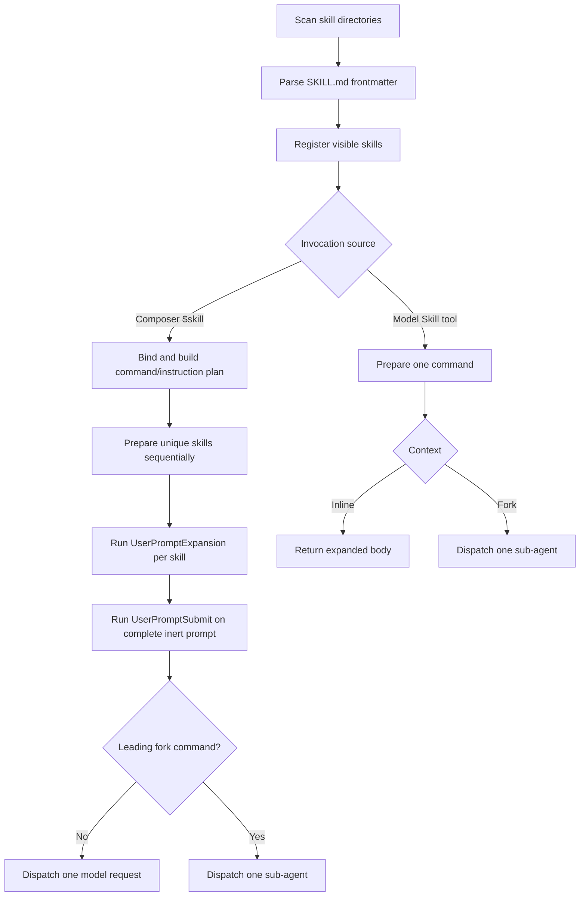

# Skills

Skills are reusable prompt packages loaded from `SKILL.md` files.
`mevedel-skills-core.el` owns the skill model, discovery, persisted enablement,
session installation, path-scoped activation state, and hot reload.
`mevedel-tool-skills.el` registers the model-visible Skill tool schemas.
`mevedel-skills-invoke.el` owns skill preparation, invocation, request-scoped
overrides, direct fork response insertion, and model-tool behavior.
`mevedel-skills-plan.el` owns deterministic composer invocation plans.
`mevedel-turn.el` owns the canonical terminal transaction shared by
ordinary responses and direct fork completion.
`mevedel-skills-prompt.el` owns prompt roster rendering, event-shaped reminders,
and path-activation notices. `mevedel-skills-ui.el` owns local commands, the
skills cockpit, command/skill completion, font-lock, and send-dispatch
composition.

## Skill flow



## Discovery

Skills are scanned from configured user/project/managed/plugin dirs plus
bundled skills under `skills/` when `mevedel-skills-include-bundled` is
non-nil. The default search order is `.mevedel/skills/`,
`.agents/skills/`, `~/.mevedel/skills/`, then `~/.agents/skills/`.
Unique names stay unqualified. When non-plugin skills from different
sources share a name, all colliding entries are exposed with the shortest
deterministic prefix that disambiguates them, such as `mevedel:review`,
`agents:review`, `local:review`, `global:review`, or
`bundled:review`. If all four ordinary roots contain the same name, the
visible names are `local-mevedel:review`, `local-agents:review`,
`global-mevedel:review`, and `global-agents:review`. Same-source
duplicates keep the first entry.

Plugin skills are discovered from enabled `.codex-plugin/plugin.json`
manifests. A manifest `skills` path is resolved relative to the plugin
root and scanned with source `plugin`. User-facing plugin skill names
are prefixed with the plugin name from the manifest, so
`skills/brainstorming/SKILL.md` in the `superpowers` plugin appears as
`superpowers:brainstorming` in `$` completion, the Skill tool listing,
and direct `Skill(name=...)` calls. The on-disk SKILL.md name remains
unchanged. New installs live under `~/.agents/plugins/`, including
GitHub installs below `github.com/OWNER/REPO`. Plugin roots are
discovered from workspace `.mevedel/plugins/`, workspace
`.agents/plugins/`, global `~/.mevedel/plugins/`, global
`~/.agents/plugins/`, then `mevedel-plugin-extra-roots`. Plugin
activation is workspace-scoped: plugins are inactive by default in each
project until enabled, and the state is stored in that workspace's
`.mevedel/plugins.el`. Activating a plugin enables all implemented plugin
components for that workspace; plugins with executable hooks require a
concise consent summary before those hooks are enabled. The summary shows
the plugin identity/source, exposed skills, hook events, executable hook
handlers, and workspace plugin data directory rather than dumping the full
manifest.

When multiple plugin roots contain the same manifest name, mevedel keeps
the highest-precedence plugin and reports shadowed duplicates in
`/plugin list`. Precedence is workspace `.mevedel/plugins/`, workspace
`.agents/plugins/`, global `~/.mevedel/plugins/`, global
`~/.agents/plugins/`, then `mevedel-plugin-extra-roots`. Activation is
bound to the plugin name and source root, so a higher-precedence plugin
with the same name does not silently inherit enabled state from a
different source. `/plugin list` reports the conflict so the user can
consciously enable the winning source.

Activation survives updates when the plugin name and source root stay the
same. Executable hook consent is tied to a fingerprint of the hook surface;
when an update changes hook files, events, commands, or functions, skills
remain enabled but hooks require consent again before running.
Plugin runtime data stays workspace-scoped and keyed by plugin name, so
switching an activation between roots with the same manifest name reuses
the same `<workspace>/.mevedel/plugin-data/<plugin-name>` directory.

Bundled skills currently include:

- `coordinator` — forked orchestration skill for multi-agent work.
- `review` — bundled forked code-review skill. The first-class
  `/review` command uses the same reviewer contract but dispatches its
  task directly so user/project skills named `review` cannot override the
  review workflow. A skill named `review` remains selectable through its
  generated visible name, for example `local:review` or `mevedel:review`.
- `git-worktree` — model-only guidance for checking Git worktree
  isolation and mirroring the `/worktree` defaults when explicit
  model-driven fallback is needed.
- `analyze-log` — user-invocable gptel HTTP log analysis helper.
- `remember` — user-invocable persistent-memory review and cleanup
  proposal helper.

`remember` is intentionally report-only: it reviews configured memory
roots, topic files, and applicable workspace configuration, then
proposes cleanup or promotion changes. It should not edit memory unless
the user explicitly approves the report.

Raw skill names come from frontmatter `name` when valid, otherwise the
containing directory name. Raw names must match `[a-z0-9-]+`; visible
names may include a generated `source:` or plugin prefix.

Hot reload marks consuming chat buffers dirty when watched skill
directories change. Completion and reminders rescan on demand when a
buffer is dirty.

## Local Slash Commands

Local slash commands are separate from `$skill` lookup. Built-ins include
`/tokens`, `/model`, `/compact`, `/init`, `/review`, `/verify`,
`/worktree`, `/mode`, `/skills`, `/tools`, `/auto`, `/clear`, `/plugin`,
and `/help`. `/init` sends the repository bootstrap prompt that helps create
or improve `AGENTS.md`, `AGENTS.local.md`, `.agents` skills and memory,
and mevedel hooks. `/auto` toggles the current
session between `default` and `trust-all`, adding an `auto-mode` reminder
while active and a one-shot `auto-mode-exit` reminder after it is turned
off. `/mode auto` is the same as entering `trust-all`; `/mode edit`
and `/mode edits` are aliases for `accept-edits`.

No-argument or list-style commands open the same session cockpit surfaces
as their matching cockpit rows when a live view/data pair exists:
`/plugin` and `/plugin list`, `/skills` and `/skills list`, `/mode`,
`/model`, `/tools` and `/tools list`, `/worktree` and `/worktree status`,
and `/help`. Outside a cockpit-capable session, commands fall back to the
older message-style behavior where that still exists. Explicit mutation
forms remain direct and scriptable.

Worktree isolation has split surfaces:

- `/worktree` and `/worktree status` open the worktree cockpit surface
  with read-only branch/worktree status and refresh/create keys.
- `/worktree list` opens the tabulated worktree list for selection-oriented
  actions on linked worktrees.
- `/worktree create [NAME] [--for "purpose"] [--clean]`
  creates a new branch and linked checkout under `.worktrees/`, opens a
  fresh session there, and does not auto-send a model prompt.
- `git-worktree` is model-visible but not user-invocable. It embeds
  best-effort read-only Git detection and tells the model how to mirror
  `/worktree` defaults when the user explicitly requested isolation.
- A model-visible `Worktree` tool is deferred; until then, model-driven
  creation uses ordinary permission-gated Bash.

Plugin management:

- `/plugin install OWNER/REPO` clones a GitHub plugin into
  `~/.agents/plugins/github.com/OWNER/REPO`; existing installs are left
  untouched and should be updated with `/plugin update NAME`. Install is
  always global and does not enable the plugin in the current workspace.
- `/plugin update NAME` runs `git pull --ff-only` for global managed
  installs under `~/.mevedel/plugins/` or `~/.agents/plugins/`.
  If the update changes an enabled plugin's executable hook surface, the
  update result reports that hook consent is pending.
- `/plugin remove NAME` and `/plugin uninstall NAME` delete a
  global managed installed plugin. If the current workspace activation
  points at that source, mevedel clears that activation. Workspace plugin
  data is not deleted by default because it is shared by plugin name
  across source switches. Plugins discovered from workspace
  `.mevedel/plugins/`, `.agents/plugins/`, or
  `mevedel-plugin-extra-roots` must be removed manually. Use `/plugin
  disable NAME` for project-only deactivation.
- `/plugin` and `/plugin list` open the session-owned plugin cockpit for
  the current workspace in a dedicated `*mevedel plugins*` buffer. The
  cockpit is a `tabulated-list-mode` table with one selected plugin at a
  time; it is not added to the chat transcript. The buffer supports
  refresh, adaptive enable/disable, hook override, install, update,
  reload, uninstall, source-opening, detail, help, and back-to-cockpit
  keybindings backed by the same command functions as the slash commands.
  Shadowed duplicate plugin sources and pending hook consent are marked in
  the table state column and explained in `RET` details. Malformed plugin
  manifests are rendered as warning rows instead of being silently hidden.
  If an old activation binding points at a shadowed source, the enable
  action still routes through an explicit switch confirmation. There is no
  separate `/plugin show` command in this iteration.
- `/plugin enable NAME` activates all implemented plugin components for
  the current workspace. If the plugin contributes executable hooks,
  mevedel shows a concise consent summary of the risky/executable surface
  before enabling them.
- `/plugin disable NAME` disables plugin skills and hooks in the current
  workspace.
- `/plugin hooks NAME off` disables executable plugin hooks while leaving
  plugin skills enabled. `/plugin hooks NAME on` re-enables hooks for an
  already-enabled plugin after the same consent summary. The
  `/plugin hooks enable NAME` and `/plugin hooks disable NAME` forms are
  accepted aliases. These are advanced/scriptable overrides; `/plugin
  enable NAME` is the normal activation path.
- `/plugin reload` refreshes plugin-visible skills in the current chat
  session when possible.

Plugin mutations refresh the current session's visible plugin skills and
hook state immediately when possible; users should not need to start a new
session after enabling, disabling, installing, updating, or removing a
plugin. Starting or resuming an interactive session reports enabled plugins
whose hooks still need new consent; hooks remain withheld until consent is
reviewed per plugin.

Codex plugin manifest fields `apps` and `mcpServers` are not loaded
today; mevedel does not start plugin apps or bundled MCP servers yet.

`/skills` manages visible skills:

- `/skills` or `/skills list` opens the skills cockpit surface, listing
  session skills and whether each is enabled.
- `/skills help NAME` shows description, source, and file metadata.
- `/skills enable NAME` removes NAME from the persisted disabled set.
- `/skills disable NAME` persists NAME as disabled.

Disabled skills stay on the session for inspection, but they are omitted
from `$` completion, rejected by explicit `$skill` invocation and
`Skill(name=...)`, and omitted from model-facing skill discovery. The
disabled set is stored in `skills-state.el` under `mevedel-user-dir`.

Completion offers local command names at leading `/` and user-invocable
skill names at leading `$` in the composer, with annotations for every
included slash command and every visible skill. Inline `$` completion
offers only user-invocable `context: inline` skills; leading `$`
completion may offer user-invocable inline and fork skills. Completing a
root name inserts a real argument separator so display-only skill hints
cannot make `$skill [arg]` look typed when the buffer only contains
`$skill`.
Commands can also expose argument candidates based on the current
argument position; `/mode` completes `default`, `accept-edits`, `trust-all`,
and the UI aliases `edit`, `edits`, and `auto`, while
`/model` completes model names from the current gptel backend. `/plugin`
completes subcommands, then installed plugin names for `enable`,
`disable`, `update`, `remove`, `uninstall`, and supported `hooks` forms;
`/plugin install` remains freeform. Skill names with prefixes, such as
`superpowers:brainstorming`, are valid `$` candidates.
`/review` and `/verify` complete shared explicit target forms such as
`current`, `HEAD`, `branch:<name>`, and `commit:<rev>`. With no arguments
they open the target picker; unknown free-form arguments remain custom
instructions.

## Frontmatter

Current fields include:

- `name`, `display-name`, `description`
- `argument-hint`, `arguments`
- `user-invocable`, `disable-model-invocation`
- `allowed-tools`
- `model`, `effort`
- `context`, `agent`
- `paths`
- `shell`
- `hooks` (skill-scoped hooks active during invocation)

`description` follows the Agent Skills convention: it should describe both
what the skill does and when the model should use it.

`paths` gates model-listing visibility only. Explicit `$skill` or
model-side invocation by name can still run the skill subject to the
user/model invocation gates.

## Invocation

Invocation role and origin are independent. Roles are `command` and
`instruction`; origins are `user`, `model`, and `internal`. A leading user
mention and a model-side `Skill` call are commands. A user mention embedded in
ordinary prose is an instruction, regardless of the skill's `context` field.

The view composer builds one invocation plan from the original, atomically
bound input before running prompt-submit hooks. Consecutive distinct leading
`context: inline` commands form a stack of at most six commands and share the
remaining text as their raw argument string. Duplicate commands collapse to
their first canonical source. A standalone `--` ends the stack. A leading
`context: fork` command runs alone; a fork skill after another command or in
ordinary prose is an instruction and does not create a child.

Commands prepare left to right, followed by instructions in first-occurrence
order. Every occurrence remains represented, but preparation is deduplicated
by exact canonical source across the complete submission. A command occurrence
wins over instruction occurrences of the same source. Instruction occurrences
become inert model-visible placeholders such as
`[skill:to-prd -- attached]`, and each unique instruction body is supplied once
as hidden turn context. Instruction preparation always receives empty
arguments and ignores `context`, model, effort, agent, and declared skill
hooks. Its allowed-tool rules exist only while preparing body injections.

Quoted `"$foo"` / `'$foo'`, escaped `\$foo`, Markdown code spans and fences,
and unknown `$foo` names remain literal. A bound or known skill that is
missing, disabled, malformed, or no longer user-invocable blocks the whole
submission with enable-or-escape guidance. Mevedel prepares every unique skill
before dispatching anything; the first load, injection, permission, validation,
or hook failure sends neither a partial request nor a child and leaves the
direct draft or queued entry editable.

`UserPromptExpansion` runs once per prepared canonical skill. After all bodies,
placeholders, and instruction reminders exist, `UserPromptSubmit` runs once on
the complete inert prompt. Hook output is never rescanned for skill syntax; a
hook may add a prefix or suffix but cannot rewrite away any prepared
contribution, and it cancels planned work only by blocking the whole
submission. Skill bodies,
prepared output, model output, child prompts and results, and model-supplied
arguments are likewise never interpreted as new user `$skill` mentions.

Queued prompts retain their original bound text. Queueing performs no body
preparation and runs no prompt hook. When an entry becomes the next turn, it is
planned, prepared, and submitted independently; the entry leaves the queue
only at the request or fork dispatch boundary.

The transcript and input history keep the exact original user text. An ignored
render-data block connects that text to the prepared model prompt without
exposing the control metadata to the model. `$skill` preparation may block chat
input while asynchronous injections run, and a foreground fork blocks until
its child settles. Cancellation or buffer death invalidates the preparation
token so late callbacks cannot dispatch.

The model-side `Skill` tool and internal callers use the same normalized
preparation outcomes. Model failures remain ordinary tool errors, and fork
dispatch uses the shared agent runtime rather than a skill-specific recursion
or scheduling limit. `ListSkills` mirrors the active, enabled,
model-invocable roster and can query dormant path-scoped skills.

## Review and Verify Commands

`/review` / `M-x mevedel-review` and `/verify` / `M-x mevedel-verify` are
local commands, not ordinary skill resolution. They share a target picker
for uncommitted changes, a base branch, a specific commit, the last
commit, or custom instructions. Inline `/review` and `/verify` arguments
can name explicit target forms such as `current`, `HEAD`, `branch:<name>`, and
`commit:<rev>`; other non-empty arguments remain custom instructions.

`/review` runs a dedicated foreground reviewer task with the registered
`reviewer` agent. The command ignores user/project skills named `review`,
but keeps the bundled review skill metadata so its `UserPromptExpansion` hook
policy still runs. The reviewer prompt asks for strict JSON with prioritized
findings. The parent turn stores a synthetic `<user_action>` block
containing the rendered review results before the assistant summary, so
follow-up prompts like "fix finding 2" have the findings in model context.
The normal view hides that synthetic block and shows only the readable
review summary.

`/verify` runs a dedicated foreground verifier task with the registered
`verifier` agent. It uses the same target text but asks for adversarial
validation, relevant checks when allowed, and the verifier prompt's final
`VERDICT: PASS`, `VERDICT: FAIL`, or `VERDICT: PARTIAL` line. Verifier
output is inserted as-is rather than parsed as review JSON.

The parent view displays a live inline `Review` or `Verify` handle while
the agent runs. This handle is sourced from hidden agent-transcript
render-data, updates as the agent calls tools, and remains separate from
the final summary.

At dispatch time, `mevedel-review.el` keeps target/result semantics local
and routes foreground agent execution through `mevedel-skills-invoke`.
For concrete Git targets it writes a package under
`.mevedel/review-packages/` and tells the reviewer or verifier to read
that file before rerunning broad repository inspection. It supplies
skill-scoped allow rules for read-only `git` Bash commands
used to inspect diffs (`git diff`, `git status`, `git log`, `git show`,
`git merge-base`, `git rev-parse`, `git ls-files`, and `git cat-file`),
plus `head` as a pipe filter for bounded object inspection. Review adds a
local deny rule for other Bash commands; verify does not, so normal
permission policy decides whether validation commands may run. Read tools
come from the selected agent's tool list.

## Allowed Tools

`allowed-tools` is permission augmentation, not tool selection. It never
removes tools from the model and never denies unspecified tools.

For command invocations, parsed entries become skill-scoped permission rules
on the owned request or agent invocation. For instructions they exist only on
the temporary preparation request and do not grant tools to the consuming
request. These buckets outrank session and persistent rules for allow/ask
resolution, while deny remains absolute across all buckets. Active Goal
planning and review phases deny non-read-only tools before skill allow grants
are considered.

## Hooks

Skill frontmatter `hooks` uses the same event -> matcher -> handler shape
as `.mevedel/hooks.el` and `.mevedel/hooks.json`. Command skills install
those rules on their request or child invocation. Instruction invocations
ignore their declared hooks; non-skill hook layers may still observe and
rewrite or block instruction body preparation. For fork commands, a
frontmatter `Stop` declaration is scoped to that child invocation and is
normalized to `SubagentStop`; top-level `Stop` remains a main-turn event.
Successful foreground fork user skills also complete the parent turn and
use the same successful-turn transaction as an ordinary model response.  The
top-level `Stop` hook runs before request-scoped layers are cleared; queued
follow-ups and other terminal cleanup run through that shared boundary.

## Model And Effort

`model` can name a preset-local tier or concrete provider selector. It
temporarily overrides the workload/session provider for the active
request/invocation.

`effort` remains opaque until dispatch. Mevedel validates it through gptel's
public `gptel-reasoning-effort` and the selected model's `:reasoning-effort`
type metadata. Unsupported explicit effort fails before the request instead of
being dropped or downgraded. An effort-bearing skill must be selected before
request realization; a model-side Skill call cannot retrofit effort into an
already provider-specific payload and therefore fails visibly.

## Body Preparation

Argument substitution runs before execution. Supported argument
placeholders are `$ARGUMENTS` for the raw argument string,
`$ARGUMENTS[N]` for a zero-based parsed argument, `$N` as shorthand for
`$ARGUMENTS[N]`, and `$name` for names declared in frontmatter
`arguments`.

Claude-compatible literal substitutions are supported for imported skills:
`${CLAUDE_SESSION_ID}`, `${CLAUDE_SKILL_DIR}`, and `${CLAUDE_EFFORT}`.
Mevedel-native aliases are also available and preferred for new
mevedel-specific skills: `${MEVEDEL_SESSION_ID}`, `${MEVEDEL_SKILL_DIR}`,
and `${MEVEDEL_EFFORT}`. Effort substitutions reflect the parsed skill
`effort`. Literal `${...}` substitutions do not suppress the
automatic `ARGUMENTS: ...` fallback when invocation arguments are supplied
but no argument placeholder is present.

The view composer uses `argument-hint` and `arguments` as display-only
typing guidance. `argument-hint` appears before the user starts typing
arguments. Named `arguments` appear as remaining positional slots, e.g.
`[service] [environment]`, and disappear as tokens are supplied. These
hints do not validate arguments and are never inserted into the
model-visible prompt.

Body injections support shell inline `` !`cmd` ``, shell fenced ` ```! `
blocks, elisp inline `` !el`(emacs-version)` ``, and elisp fenced
` ```!el ` blocks. Inline elisp is intended for short one-line
expressions; fenced elisp is the supported form for longer expressions.

Shell injections substitute trimmed stdout. Elisp injections substitute
the printed return value, with captured stdout appended in a compact
`STDOUT:` section when present.

Bash and Eval body injections are treated as author-written skill code
and use trusted-literal permission handling. Bash injections require a
covering Bash allow rule; elisp injections require `allowed-tools:
[Eval]`. Explicit deny rules still win.

Only markers written literally in `SKILL.md` are executable body
injections. Markers introduced by argument substitution or produced by
another injection's output remain literal text in the prepared body.
The marker syntax and delimiters must be author-written, but the
command/expression body may contain substituted arguments. For example,
`` !el`(length "$ARGUMENTS")` `` is valid when the skill author controls
the surrounding elisp expression. Substitution is textual, so skill
authors must quote or escape interpolated values correctly before using
them inside shell scripts or elisp strings.

Each invocation records a `mevedel-skill-invocation-record` on the
session so compaction/replay can preserve the prepared body even if the
source `SKILL.md` changes later.
