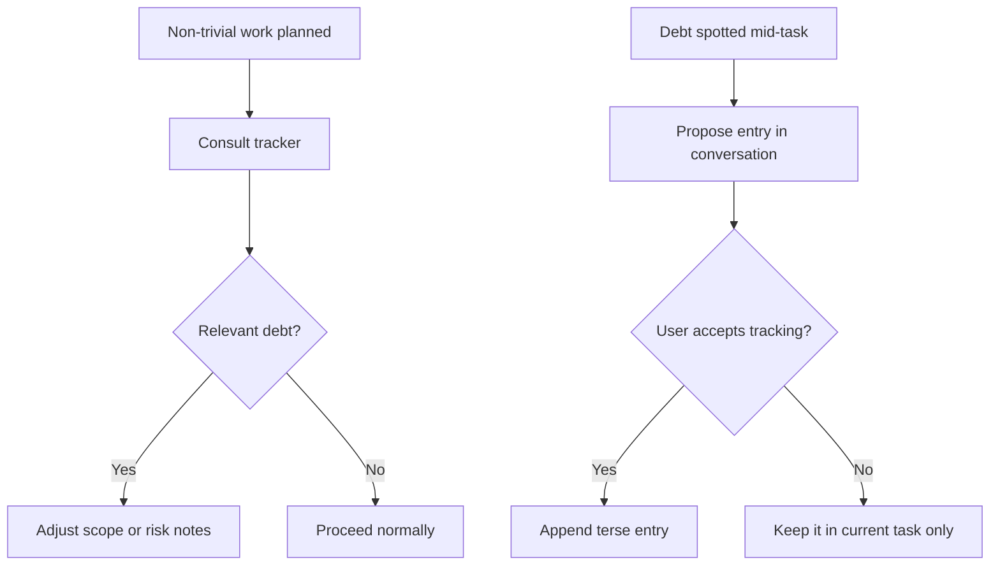

# Tech debt tracker

Living list of known shortcuts, deferred cleanups, and rough edges in
the codebase. Read this before planning non-trivial work in any of the
listed areas — an entry here may change the scope of what you're about
to do.

Both humans and the agent may consult this file. The agent may **propose**
new entries when it spots debt mid-task, but should flag them in the
conversation first rather than appending silently — the user decides
whether something graduates from "current task" to a tracked entry.

## Tracking flow



## Entry format

Each entry uses the structure below. Newest entries on top.

```
### <short title>

- **Location:** `file.el` (`function-name`, or `file.el:LINE`)
- **What's owed:** the actual cleanup or change required
- **Why deferred:** why this wasn't fixed when introduced (scope, risk,
  blocked on X, waiting for an upstream change, etc.)
- **Blast radius:** what code/behavior is affected if this is left
  alone, or what could break when it's finally fixed
- **Added:** YYYY-MM-DD (optional — git blame is authoritative)
```

Keep entries terse. If something needs a paragraph of context, link to
the maintained docs, a design note, or a commit instead.

## Entries

### Header-line right-alignment hooks gptel internals

- **Location:** `mevedel-chat.el:247` (`mevedel--token-header-segment`
  setup inside `mevedel-chat-mode`)
- **What's owed:** a less brittle way to right-align the token-count
  and persistence segments in the gptel header line.
- **Why deferred:** original author flagged it as fragile but couldn't
  find a more robust approach; depends on gptel keeping its
  `gptel--header-line-info` shape (`:eval` form whose `display` text
  property carries `:align-to` with a known offset).
- **Blast radius:** if gptel changes the header-line construction the
  segment will mis-render or error at every redisplay.

### Own token estimation could be replaced by upstream gptel

- **Location:** token-count machinery driving `mevedel--token-header-segment`
- **What's owed:** drop the in-tree estimation in favor of gptel's
  native token calculations (gptel commit `4b8894fd`).
- **Why deferred:** gptel only recently added the feature; mevedel's
  homegrown chars/4 estimate predates it.
- **Blast radius:** divergent estimates between mevedel's header
  segment and gptel's own UI; small accuracy gap.

### Diff preview overlays leak after multi-edit turns

- **Location:** `mevedel-preview-mode.el` (cleanup paths around
  `mevedel-preview-mode-add-preview` / dismiss)
- **What's owed:** ensure preview buffers/overlays from earlier
  Edit/Write calls in the same turn are reliably reaped when the next
  preview registers or the request finishes.
- **Why deferred:** observed but not yet root-caused.
- **Blast radius:** stale overlays accumulate in the user's buffers
  across long sessions; `mevedel-abort` may not catch the orphans.

### `mevedel-view--tool-status-string` belongs on tool defs

- **Location:** `mevedel-view.el` (status-string lookup) and
  `mevedel-tool-registry.el` (tool struct slots)
- **What's owed:** move the per-tool status-string mapping onto the
  `mevedel-tool` struct (with a reasonable default) instead of
  branching inside the view.
- **Why deferred:** noted in `todo.org`; refactor opportunity, not a
  correctness bug.
- **Blast radius:** new tools currently have no clean place to declare
  their progress label; the view file grows a switch statement.

### Legacy / backwards-compat code from the redesign

- **Location:** TBD — needs an audit pass
- **What's owed:** sweep the redesign branches for compatibility
  shims, removed-feature comments, and dead code paths the new
  architecture no longer needs.
- **Why deferred:** the redesign rolled in incrementally; cleanup was
  postponed to keep diffs small.
- **Blast radius:** dead code obscures the real architecture and
  inflates the agent's reading load.
