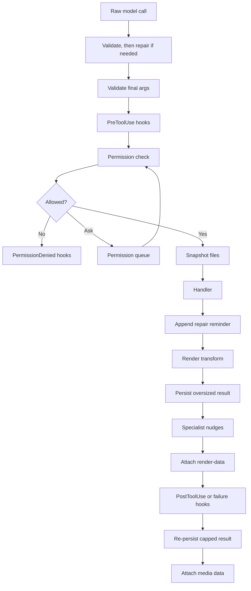

# Tools

## Tool pipeline

All tools go through `mevedel-pipeline-run-tool`:



Synchronous handlers receive `(args)` and asynchronous handlers receive
`(callback args)`, where args is a keyword plist. The
pipeline handles all cross-cutting concerns; handlers contain no
boilerplate for validation, hooks, permissions, snapshots, or
persistence.

Important tool metadata:

- Behavior: `:read-only-p`, `:destructive-p`, `:async-p`
- Permissions: `:check-permission`, `:check-permission-async`,
  `:get-path`, `:get-pattern`, `:get-domain`, `:get-name`
- Loading/grouping: `:category`, `:groups`, `:wrap`, `:prompt-file`
- Input contracts: `:args`, `:repair-input`
- Display/output: `:summary`, `:max-result-size`, `:render-transform`,
  `:renderer`

### Tool input validation and repair

`mevedel-tool-repair.el` mediates raw model calls before gptel dispatches
them into the pipeline. The temporary provider bridge lives in
`mevedel-tool-repair-gptel.el`; audit and telemetry live in
`mevedel-tool-repair-diagnostics.el`. The core first validates the call unchanged. Valid input is
never rewritten. Only invalid model-produced input gets one atomic repair
attempt; the pipeline then validates the committed arguments again before
hooks or permissions run. Direct programmatic calls and arguments rewritten
by `PreToolUse` remain validation-only.

While gptel decodes provider responses, mevedel preserves JSON `null` as a
distinct sentinel. Before pre-tool hooks it restores decoded empty objects in
the common tool-call representation. This temporary adapter covers gptel's
tool-capable backends in one place and can be removed when gptel's shared JSON
string decoder preserves nulls itself.

The generic repair catalogue is deliberately small and ordered:

1. omit explicit `null` from optional properties;
2. parse exact JSON strings when the parsed value satisfies the expected
   non-string contract;
3. wrap a schema-valid singleton where an array is expected;
4. replace an empty object placeholder with an empty array only for optional
   arrays that permit zero items;
5. unwrap an exact Markdown HTTP(S) auto-link in the final component of a
   semantic filesystem path.

Repairs never invent required values and do not coerce arbitrary strings to
numbers or booleans: the JSON parser must consume the exact input and the
result must validate. Required `null` and required empty-object placeholders
therefore remain invalid. Generic repairs run before and after, at most once,
an optional tool-owned `:repair-input` callback. This deliberate extension
handles relational or wrapped-tool invariants the generic schema visitor
cannot express. The callback receives copies
of `(args validation-issues)` and must return changed `:args` plus value-free
`:repairs` records covering every changed top-level argument. The entire
candidate is committed only when final validation succeeds; otherwise the
model gets bounded, value-free retry guidance and no tentative arguments run.

`path` is an internal semantic argument type for mevedel-owned filesystem
contracts. Provider schemas lower it to an ordinary JSON string and append
the guidance “Pass a raw filesystem path, not Markdown or a URL.” This lets
native tools opt into the narrow auto-link repair without guessing whether an
arbitrary string is a path. Wrapped tools can use `:repair-input` when their
source schema cannot express mevedel's semantic `path` type.

Committed repairs proceed without a retry and add one corrective note to the
final tool result, including error results. If a multi-step candidate still
fails validation, its repair audit is marked abandoned and the handler is not
called. Both audit states contain only rule IDs, schema paths, and before/after
shape names.

Every raw model call records a redacted event on its top-level session with
the actual backend, model, tool, stable origin (`main` or agent ID), outcome
(`valid`, `repaired`, `invalid`, or `abandoned`), rule IDs, schema paths,
execution state, and result classification. Argument values, paths, commands,
prompts, schemas, validation messages, and results are excluded. The in-memory
`mevedel-session-repair-log` is bounded by
`mevedel-tool-repair-log-limit` (default 200). When
`mevedel-tool-repair-persist-log` is non-nil, materialized sessions also append
events to `<session>/repair-log.el`; bounded events recorded before first
materialization are backfilled when the session directory is created.
Telemetry failures never block tool execution.
`mevedel-tool-input-repair-enabled` disables mutation while retaining
validation and telemetry.

`mevedel-define-tool :wrap SOURCE` adopts an existing `gptel-tool` via
`gptel-get-tool` on every call (so upstream changes take effect without
rewrapping). Re-registering the same wrapped `(category, name)` replaces
the prior mevedel wrapper, matching native tool registration.

Tools carry `:groups`. `(:deferred GROUP)` in a preset's or agent's tool
list pulls every tool tagged with GROUP into the session's deferred set.
`mevedel-preset-extra-tool-specs` / `mevedel-agent-extra-tool-specs` add
specs without redefining the preset/agent.

`ToolSearch(load=true)` queues matching deferred tools for the next tool
payload update and reports them as available now so the model calls the
newly loaded tool in its next tool call. Search terms can be exact tool
names (`XrefReferences`, `Imenu`, `function_source`) or capability
families (`xref`, `imenu`, `treesitter`, `elisp`, `web`).

## Native Tools Surface

The session cockpit `t Tools` row opens the native `*mevedel tools*` surface
for the current main session. `/tools` and `/tools list` open the same
surface. The buffer is read-only UI chrome, not transcript content.

The tools surface shows active tools, deferred tools, temporarily loaded
deferred tools, expired loaded tools, and the deferred-tool TTL. It also
offers session-local lifecycle operations:

- defer an active tool for the current session;
- activate a deferred tool for the current session;
- load a deferred tool temporarily, matching `ToolSearch(load=true)` behavior;
- inspect loaded or expired deferred tools.

Manual tool changes do not mutate presets or global configuration, and they
do not rewrite already-running child agent tool state.

Tool descriptions live in `tools/*.md` and are loaded via
`mevedel-define-tool`'s `:prompt-file` keyword.

### Hook boundaries

`PreToolUse` runs after validation so hooks see normalized args. It runs
before permission so policy hooks can deny, force an ask, add context, or
replace args before the permission resolver and handler see the call.

`PermissionRequest` runs only when the permission chain resolves to a
generic `ask`. It can allow, deny, or leave the normal queued prompt in
place. Bash and Eval use specialized permission queue entries from their
tool permission slots, so they do not currently fire `PermissionRequest`.
`PermissionDenied` runs after denial and can add model-facing feedback or
context, but it cannot reopen the denied tool call.

Post-tool hooks run after initial oversized-result persistence,
specialist nudges, and render-data attachment. They receive both the raw
handler output and the exact model-visible result. They can replace
feedback or add context, but they cannot undo tool side effects that
already happened. For capped tools, a second persistence/truncation pass
runs after post-tool hooks so `updated_result` cannot reintroduce an
oversized model-visible result.

### Hazard: post-handler steps must read from context, not buffer-local

Pipeline steps that run **after** the handler must read session,
workspace, and any other chat-buffer state from the pipeline context
plist — not from `(current-buffer)` or buffer-local variables.

Tool handlers may invoke the async callback from process sentinels,
temporary buffers, or other non-chat-buffer contexts. Because steps are
chained via callbacks, anything that runs after the handler executes in
the callback's current buffer — often a process output or temp buffer —
where `mevedel--session` and `mevedel--workspace` may have no
buffer-local binding and silently fall back to `nil`. That has produced
concrete bugs (e.g. result persistence skipped because
`mevedel--workspace` came back `nil` inside a temp buffer).

Rules of thumb:
- Capture session/workspace once at `mevedel-pipeline-run-tool` entry
  and thread them through the context plist.
- Steps that run **before** the handler (validate, permission,
  snapshot) are safe to use `current-buffer` — they run in the caller's
  buffer.
- When adding a step, check its position relative to the handler before
  deciding whether buffer-local reads are safe.

## Tool renderers

Individual tools may ship a `:renderer FN-OR-ALIST` for rich collapsible
views in the view buffer. Function contract:

```
(lambda (NAME ARGS RESULT RENDER-DATA) -> rendering-plist-or-nil)
```

Pure function — no I/O, no mutation. Nil falls back to
the generic renderer.

Alist form dispatches on the visible result status:

```elisp
((success . FN) (error . FN) (default . FN))
```

The view computes dispatch status from the visible result:
`error` when `mevedel-view--tool-result-error-p` matches, otherwise
`success`. Lookup tries the exact status first, then `default`, then
the generic renderer. A rendering plist's `:status` affects only the
visual marker; it does not participate in dispatch.

Rendering plist: `(:header STRING :body STRING :body-mode SYMBOL
:status SYMBOL :expandable-p BOOL :initially-collapsed-p BOOL)`.
`:status` and `:expandable-p` are optional. When `:expandable-p` is nil,
the view inserts a compact non-toggleable event line and ignores `:body`
and `:initially-collapsed-p`. Validated by
`mevedel-view--rendering-plist-p`.

Well-formed tool segments always render through a registered renderer
or the generic fallback. Malformed or unparseable tool segments keep the
older safe fallback behavior.

Renderers that remove appended specialist nudges or system reminders from
their display body must strip only an explicit trailing appended block.
Tool output may legitimately contain marker-shaped text, especially Read
output with line prefixes, so renderer cleanup should first check for the
marker and never treat arbitrary file content as hidden guidance.

### Render transforms

Wrapped tools may ship a `:render-transform FN` to synthesize bounded
render metadata from string output:

```elisp
(lambda (NAME ARGS RESULT) -> render-data-or-nil)
```

`RESULT` is the normalized string result before oversized-result
persistence and before render/media side-channel attachment. The
transform runs only when the handler did not already provide
`:render-data`, only for non-error string results, and never changes
`:result` or `:raw-result`. Transform errors emit a warning and leave the
tool result unchanged.

Transforms must return small metadata, not copies of large result
bodies. The pipeline rejects oversized transform metadata so a transform
cannot bypass tool-result persistence by hiding the full output in
render-data.

### Render-data side channel

Every handler returns a plist containing `:result`; when it also includes
`:render-data DATA`, the pipeline
writes `:result` to the data buffer and appends a hidden block wrapped in
`<!-- mevedel-render-data -->` delimiters, propertized
`'gptel 'ignore` and `'invisible t`. Parser:
`mevedel-pipeline-extract-render-data`.

Tool renderer input is derived from the data buffer on each rerender; it
must not depend on durable state stored only in view overlays or text
properties. View-local fragment metadata, collapse state, and renderer caches
are disposable UI state.
`mevedel-view--invoke-renderer` `condition-case`s the call; malformed
output emits a warning and falls through to the one-liner.

Wrapped tools (gptel/MCP) have `render-data` = nil unless they declare a
`:render-transform`; their renderer can use transform metadata when
present or parse the result string directly.

Agent tool calls use `:kind agent-transcript` render-data so the view
can render a handle, patch it as the sub-agent changes state, and open
the persisted transcript after the invocation reaches a terminal state.
Render-data lookup/patching scans literal open/close delimiters rather
than matching the whole hidden block with one regexp; live agent metadata
and multiline payloads can be large enough to overflow Emacs regexp
limits. MkDir uses `:kind mkdir` render-data to distinguish newly-created
directories from idempotent already-existing directories in the view.

## Tool result persistence

When `:max-result-size` is set and result exceeds the effective limit
(min of tool value and 50,000-char global cap), the full result is saved
to `.mevedel/tool-results/` and replaced with a preview wrapped in
`<persisted-output>` XML. The LLM can `Read` the file to see the full
output. Oversized error results (`"Error:"` prefix) are truncated but
not persisted, preserving failure status without injecting huge error
blobs. No workspace → no persistence.

Per-tool limits match Claude Code's approach: Grep 20k, Bash/Eval 30k,
Glob 30k, Ask 30k, Xref*/Imenu 20k, Treesitter 30k, Agent 50k,
WebFetch/YouTube 50k. Read/Write/Edit/MkDir: nil (self-bounded or
short). Background agent mailbox deliveries inline at most a 32 KiB
preview of the final response and point to the persisted transcript when
available.

## Bash execution timeout

Bash commands are terminated after `mevedel-bash-timeout` seconds by
default (120 seconds). A Bash call may pass `timeout_seconds` to request
a longer or shorter positive timeout for that invocation. When a command
times out, mevedel terminates the shell process group where supported and
returns the partial combined stdout/stderr with a timeout notice.

## Eval execution scope

Eval has two execution modes.  `live` is the default and runs inside the
current Emacs process so it can inspect live session state.  Live mode
restores the selected frame's window configuration by default, preventing
accidental calls like `delete-other-windows` from surprising the user;
`preserve_ui: false` opts out for deliberate UI manipulation.  `batch`
runs a child `emacs --batch -Q` process with the current `load-path` and
the session working directory.  Batch mode isolates the interactive
Emacs session from UI/global-state changes, but it is not an OS security
sandbox.
