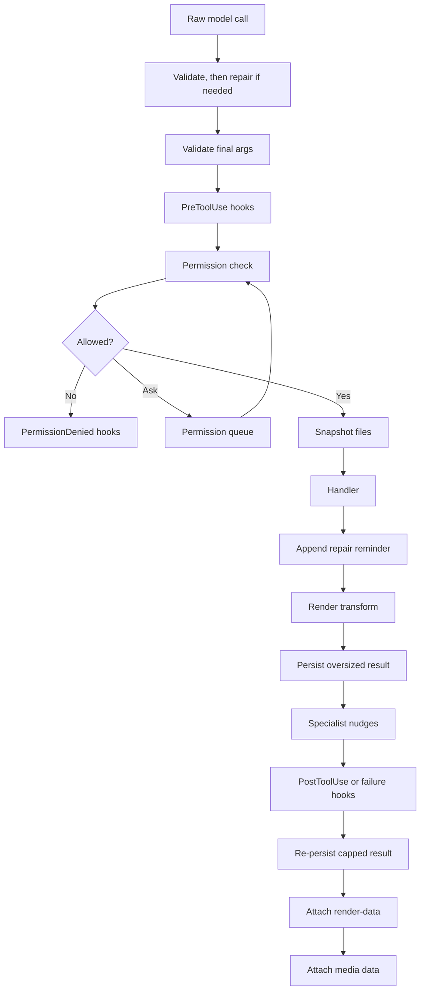

# Tools

## Tool pipeline

All tools go through `mevedel-pipeline-run-tool`:



Synchronous handlers receive `(args)` and asynchronous handlers receive
`(callback args)`, where args is a keyword plist. The
pipeline handles all cross-cutting concerns; handlers contain no
boilerplate for validation, hooks, permissions, snapshots, or
persistence.

Tool-result media has one focused boundary in `mevedel-tool-media.el`.
It validates and sanitizes captured media records, stores their bytes behind
opaque transcript references, restores trusted records during replay, removes
media from hook-visible text, and converts restored records into each
provider's native payload shape. `mevedel-pipeline.el` supplies the session's
tool-results directory and calls that boundary from the attach, hook, render,
and gptel parse steps; it does not construct provider-specific media blocks.
The transcript reference contains only an opaque record id and its owning tool
use id. Replay never rereads the original filesystem path.

Important tool metadata:

- Behavior: `:read-only-p`, `:destructive-p`, `:async-p`
- Permissions: `:check-permission`, `:check-permission-async`,
  `:get-path`, `:get-pattern`, `:get-domain`, `:get-name`
- Loading/grouping: `:category`, `:groups`, `:wrap`, `:prompt-file`
- Input contracts: `:args`, `:repair-input`
- Display/output: `:summary`, `:max-result-size`, `:render-transform`,
  `:renderer`

### Tool input validation and repair

`mevedel-tool-repair.el` mediates raw model calls before gptel dispatches
them into the pipeline. The temporary provider bridge lives in
`mevedel-tool-repair-gptel.el`; audit and telemetry live in
`mevedel-tool-repair-diagnostics.el`. The core first validates the call unchanged. Valid input is
never rewritten. Only invalid model-produced input gets one atomic repair
attempt; the pipeline then validates the committed arguments again before
hooks or permissions run. Direct programmatic calls and arguments rewritten
by `PreToolUse` remain validation-only.

While gptel decodes provider responses, mevedel preserves JSON `null` as a
distinct sentinel. Before pre-tool hooks it restores decoded empty objects in
the common tool-call representation. This temporary adapter covers gptel's
tool-capable backends in one place and can be removed when gptel's shared JSON
string decoder preserves nulls itself.

The generic repair catalogue is deliberately small and ordered:

1. omit explicit `null` from optional properties;
2. parse exact JSON strings when the parsed value satisfies the expected
   non-string contract;
3. wrap a schema-valid singleton where an array is expected;
4. replace an empty object placeholder with an empty array only for optional
   arrays that permit zero items;
5. unwrap an exact Markdown HTTP(S) auto-link in the final component of a
   semantic filesystem path.

Repairs never invent required values and do not coerce arbitrary strings to
numbers or booleans: the JSON parser must consume the exact input and the
result must validate. Required `null` and required empty-object placeholders
therefore remain invalid. Generic repairs run before and after, at most once,
an optional tool-owned `:repair-input` callback. This deliberate extension
handles relational or wrapped-tool invariants the generic schema visitor
cannot express. The callback receives copies
of `(args validation-issues)` and must return changed `:args` plus value-free
`:repairs` records covering every changed top-level argument. The entire
candidate is committed only when final validation succeeds; otherwise the
model gets bounded, value-free retry guidance and no tentative arguments run.

`path` is an internal semantic argument type for mevedel-owned filesystem
contracts. Provider schemas lower it to an ordinary JSON string and append
the guidance “Pass a raw filesystem path, not Markdown or a URL.” This lets
native tools opt into the narrow auto-link repair without guessing whether an
arbitrary string is a path. Wrapped tools can use `:repair-input` when their
source schema cannot express mevedel's semantic `path` type.

Committed repairs proceed without a retry and add one corrective note to the
final tool result, including error results. If a multi-step candidate still
fails validation, its repair audit is marked abandoned and the handler is not
called. Both audit states contain only rule IDs, schema paths, and before/after
shape names.

Every raw model call records a redacted event on its top-level session with
the actual backend, model, tool, stable origin (`main` or agent ID), outcome
(`valid`, `repaired`, `invalid`, or `abandoned`), rule IDs, schema paths,
execution state, and result classification. Argument values, paths, commands,
prompts, schemas, validation messages, and results are excluded. The in-memory
`mevedel-session-repair-log` is bounded by
`mevedel-tool-repair-log-limit` (default 200). When
`mevedel-tool-repair-persist-log` is non-nil, materialized sessions also append
events to `<session>/repair-log.el`; bounded events recorded before first
materialization are backfilled when the session directory is created.
Telemetry failures never block tool execution.
`mevedel-tool-input-repair-enabled` disables mutation while retaining
validation and telemetry.

`mevedel-define-tool :wrap SOURCE` adopts an existing `gptel-tool` via
`gptel-get-tool` on every call (so upstream changes take effect without
rewrapping). Re-registering the same wrapped `(category, name)` replaces
the prior mevedel wrapper, matching native tool registration.

Tools carry `:groups`. `(:deferred GROUP)` in a preset's or agent's tool
list pulls every tool tagged with GROUP into the session's deferred set.
`mevedel-preset-extra-tool-specs` / `mevedel-agent-extra-tool-specs` add
specs without redefining the preset/agent.

`ToolSearch(load=true)` queues matching deferred tools for the next tool
payload update and reports them as available now so the model calls the
newly loaded tool in its next tool call. Search terms can be exact tool
names (`XrefReferences`, `Imenu`, `function_source`) or capability
families (`xref`, `imenu`, `treesitter`, `elisp`, `web`).

### Interaction tool ownership

`mevedel-tool-ui.el` assembles the user-interaction tool surface and owns only
the Agent, StopAgent, ToolSearch, and SendMessage adapters. Ask's questionnaire,
handler, renderer, and schema live in `mevedel-tool-ask.el`. Exact external-path
authority is part of the normal permission pipeline, not a model-visible tool.
The same shared resource-grant interface authorizes native filesystem tools and
additive Bash/batch-Eval mounts; command authorization remains independent.

All direct user interactions share the settlement and cancellation primitive in
`mevedel-interaction-prompt.el`. Domain owners supply their own text, keymaps,
outcome translation, and persistence effects; the shared primitive owns only
overlay identity, exactly-once settlement, request-local cancellation, and the
standard frame.

## Native Tools Surface

The session cockpit `t Tools` row opens the native `*mevedel tools*` surface
for the current main session. `/tools` and `/tools list` open the same
surface. The buffer is read-only UI chrome, not transcript content.

The tools surface shows active tools, deferred tools, temporarily loaded
deferred tools, expired loaded tools, and the deferred-tool TTL. It also
offers session-local lifecycle operations:

- defer an active tool for the current session;
- activate a deferred tool for the current session;
- load a deferred tool temporarily, matching `ToolSearch(load=true)` behavior;
- inspect loaded or expired deferred tools.

Manual tool changes do not mutate presets or global configuration, and they
do not rewrite already-running child agent tool state.

Tool descriptions live in `tools/*.md` and are loaded via
`mevedel-define-tool`'s `:prompt-file` keyword.

### Hook boundaries

`PreToolUse` runs after validation so hooks see normalized args. It runs
before permission so policy hooks can deny, force an ask, add context, or
replace args before the permission resolver and handler see the call.

`PermissionRequest` runs only when the permission chain resolves to a
generic `ask`. It can allow, deny, or leave the normal queued prompt in
place. Bash and Eval use specialized permission queue entries from their
tool permission slots, so they do not currently fire `PermissionRequest`.
`PermissionDenied` runs after denial and can add model-facing feedback or
context, but it cannot reopen the denied tool call.

Post-tool hooks run after initial oversized-result persistence and specialist
nudges, but before final render-data attachment. The specialist-nudge step is a
thin pipeline delegation to `mevedel-specialist-nudges.el`, which owns all
`Read`/`Grep` eligibility, family throttling, deferred `ToolSearch` guidance,
and model-visible reminder text. Post-tool hooks receive both the raw
handler output and the exact model-visible result. They can replace
feedback or add context, but they cannot undo tool side effects that
already happened. For capped tools, a second persistence/truncation pass
runs after post-tool hooks so `updated_result` cannot reintroduce an
oversized model-visible result.

### Hazard: post-handler steps must read from context, not buffer-local

Pipeline steps that run **after** the handler must read session,
workspace, and any other chat-buffer state from the pipeline context
plist — not from `(current-buffer)` or buffer-local variables.

Tool handlers may invoke the async callback from process sentinels,
temporary buffers, or other non-chat-buffer contexts. Because steps are
chained via callbacks, anything that runs after the handler executes in
the callback's current buffer — often a process output or temp buffer —
where `mevedel--session` and `mevedel--workspace` may have no
buffer-local binding and silently fall back to `nil`. That has produced
concrete bugs (e.g. result persistence skipped because
`mevedel--workspace` came back `nil` inside a temp buffer).

Rules of thumb:
- Capture session/workspace once at `mevedel-pipeline-run-tool` entry
  and thread them through the context plist.
- Steps that run **before** the handler (validate, permission,
  snapshot) are safe to use `current-buffer` — they run in the caller's
  buffer.
- When adding a step, check its position relative to the handler before
  deciding whether buffer-local reads are safe.

## Tool renderers

Individual tools may ship a `:renderer FN-OR-ALIST` for rich collapsible
views in the view buffer. Function contract:

```
(lambda (NAME ARGS RESULT RENDER-DATA) -> rendering-plist-or-nil)
```

Pure function — no I/O, no mutation. Nil falls back to
the generic renderer.

Alist form dispatches on the visible result status:

```elisp
((success . FN) (error . FN) (default . FN))
```

The view first uses structured `:status` from render-data, then falls back to
the visible result: `error` when `mevedel-view--tool-result-error-p` matches,
otherwise `success`. Lookup tries the exact status first, then `default`, then
the generic renderer. Explicit pipeline status also overrides a custom
rendering plist's visual `:status`; without explicit status, the rendering
plist controls only the visual marker and does not participate in dispatch.

Rendering plist: `(:header STRING :body STRING :body-mode SYMBOL
:status SYMBOL :expandable-p BOOL :initially-collapsed-p BOOL)`.
`:status` and `:expandable-p` are optional. When `:expandable-p` is nil,
the view inserts a compact non-toggleable event line and ignores `:body`
and `:initially-collapsed-p`. Validated by
`mevedel-view--rendering-plist-p`.

Well-formed tool segments always render through a registered renderer
or the generic fallback. Malformed or unparseable tool segments keep the
older safe fallback behavior.

Renderers that remove appended specialist nudges or system reminders from
their display body must strip only an explicit trailing appended block.
Tool output may legitimately contain marker-shaped text, especially Read
output with line prefixes, so renderer cleanup should first check for the
marker and never treat arbitrary file content as hidden guidance.

### Render transforms

Wrapped tools may ship a `:render-transform FN` to synthesize bounded
render metadata from string output:

```elisp
(lambda (NAME ARGS RESULT) -> render-data-or-nil)
```

`RESULT` is the normalized string result before oversized-result
persistence and before render/media side-channel attachment. The
transform runs only when the handler did not already provide
`:render-data`, only for string results whose pipeline status is not `error`,
and never changes `:result` or `:raw-result`. Transform errors emit a warning
and leave the tool result unchanged.

Transforms must return small metadata, not copies of large result
bodies. The pipeline rejects oversized transform metadata so a transform
cannot bypass tool-result persistence by hiding the full output in
render-data.

### Render-data side channel

Every handler returns a plist containing `:result` and may set `:status` to
`success` or `error`. Handlers without explicit status retain the legacy
`Error:`-prefix classification. When a handler includes `:render-data DATA` or
explicit status, the pipeline writes `:result` to the data buffer and appends a
hidden block wrapped in `<!-- mevedel-render-data -->` delimiters, propertized
`'gptel 'ignore` and `'invisible t`. Parser:
`mevedel-pipeline-extract-render-data`.

Tool renderer input is derived from the data buffer on each rerender; it
must not depend on durable state stored only in view overlays or text
properties. View-local fragment metadata, collapse state, and renderer caches
are disposable UI state.
`mevedel-view--invoke-renderer` `condition-case`s the call; malformed
output emits a warning and falls through to the one-liner.

Wrapped tools (gptel/MCP) have `render-data` = nil unless they declare a
`:render-transform`; their renderer can use transform metadata when
present or parse the result string directly.

Agent tool calls use `:kind agent-transcript` render-data so the view
can render a handle, patch it as the sub-agent changes state, and open
the persisted transcript after the invocation reaches a terminal state.
Render-data lookup/patching scans literal open/close delimiters rather
than matching the whole hidden block with one regexp; live agent metadata
and multiline payloads can be large enough to overflow Emacs regexp
limits. MkDir uses `:kind mkdir` render-data to distinguish newly-created
directories from idempotent already-existing directories in the view.

## Tool result persistence

When `:max-result-size` is set and result exceeds the effective limit
(min of tool value and 50,000-char global cap), the full result is saved
to `.mevedel/tool-results/` and replaced with a preview wrapped in
`<persisted-output>` XML. The LLM can `Read` the file to see the full
output. Oversized error results are truncated but not persisted; explicit
handler status takes precedence over the legacy `Error:` prefix. Every
oversized preview keeps equal head and tail budgets, prefers nearby newline
boundaries, and reports the exact omitted character count. The persisted file
remains complete. Bash and Eval do not apply an earlier prefix-only cap. No
workspace → no persistence.

Per-tool limits match Claude Code's approach: Grep 20k, Bash/Eval 30k,
Glob 30k, Ask 30k, Xref*/Imenu 20k, Treesitter 30k, Agent 50k,
WebFetch/YouTube 50k. Read/Write/Edit/MkDir: nil (self-bounded or
short). Background agent mailbox deliveries inline at most a 32 KiB
preview of the final response and point to the persisted transcript when
available.

## External helper confinement

Native tool implementations launch short-lived external helpers through
`mevedel-execution.el`, the same process boundary used by Bash and batch Eval.
The caller supplies a structured argv, authorized read paths, and explicit
writable artifact directories. The module adds a private scratch working
directory, applies `mevedel-sandbox-mode`, tracks the active boundary in the
status zone, owns timeout/process-group cleanup, and removes the scratch
directory after the callback. Output streams directly into a bounded temporary
disk spool rather than an Emacs process buffer; the one-shot terminal result
contains the captured output and structured exit, timeout, output-limit, byte,
and wall-time facts. In `auto`, it may retry directly only after a pre-exec
Bubblewrap failure; it never replays a helper that may have started. `required`
fails the tool explicitly and `off` runs directly.

All operating-system children receive deterministic defaults for UTF-8 locale,
no color, terminal mode, and pagers, plus `MEVEDEL_EXECUTION=1`. An invocation
can still override these variables inside its own command. Ordinary one-shot
stdin is closed immediately.

The current external-helper inventory is `diff`; `rg` for Read directory
listings, Glob, and Grep; `pdfinfo` and `pdftoppm`; and ImageMagick's `magick`
or `convert`. Their sandbox facts stay out of successful model-visible results.
Native filesystem permission checks remain the authorization boundary; helper
confinement limits effects after that authorization.

## Managed Bash execution

Bash source runs through `bash -lc`, so login-shell initialization contributes
to the same output and timeout as the requested command. Commands are
terminated after `mevedel-bash-timeout` seconds by default (120 seconds). A
Bash call may pass `timeout_seconds` to request a longer or shorter positive
timeout for that invocation. On Unix, Emacs places each child in a dedicated
process group, and mevedel sends TERM followed by KILL to the whole group. On
Windows it terminates the direct child. The result includes partial combined
stdout/stderr and structured termination facts.

Bash waits up to `yield_time_ms` (10 seconds by default, 250-30000ms). A command
that finishes first returns normally and discards its temporary spool when all
output fits inline. A command still running at the boundary returns its unread
output, an opaque owner-scoped execution ID, and a retained session artifact.
Its timeout and 64 MiB output cap continue running after yield. Pipe-mode stdin
is closed from spawn. Explicit `tty=true` instead allocates a PTY and retains
writable stdin without changing the captured owner, workdir, confinement, or
resource grants. `WriteStdin` sends ordinary input only to PTYs; a single
Ctrl-C character signals the process group in either mode. Every observation
returns only the newly unread output. `ListExecutions` exposes only the caller's
yielded handles, and `StopExecution` terminates only a handle owned by that
caller. Terminal facts record PTY mode and preserve the raw process exit or
signal status. Canonical lifecycle state distinguishes `queued`, `running`,
`stopping`, and `completed`; Interrupt rejects queued work that has not started,
while Stop cancels it. There is no chunk ID: each observation advances one
private unread cursor and returns canonical execution facts separately from
the raw output. Unread ranges beyond 2000 characters use the shared newline-aware,
equal head-and-tail preview while the retained artifact remains complete.

Managed executions publish transient progress after two seconds, at most four
times per second. The existing Bash row shows the bounded output tail, elapsed
time, line and byte counts, configured timeout, and the execution ID once the
command has yielded. These progress updates live only in bounded view state and
never create transcript turns. Events carry the originating data buffer and
durable tool-use ID, so the matching main or agent view is selected directly.
Terminal settlement replaces the original row's hidden render-data side channel
in the authoritative transcript with the bounded whole-artifact head-and-tail
preview plus exit, outcome, duration, and omitted-output facts. The provider
scrubber keeps that durable UI state model-hidden, while transcript persistence
keeps it stable across cache turnover and resume. Parallel completion may beat
gptel's insertion of the original row; a bounded data-buffer queue retains that
terminal projection and retries it at tool and final-render boundaries.
Agent data buffers run the final-boundary retry even when no transcript view is
open.

Terminal delivery has one claimant. A model observation that sees completion
claims the final result and retires the handle without a mailbox duplicate. If
a yielded process exits independently, or the user stops it outside the model
tool, its unread output and final facts are queued synchronously in the fixed
main or sub-agent owner mailbox without starting a model request. For a
sub-agent already parked in BWAIT, acceptance may settle
the agent directly in DONE by appending the Bash result to its final response;
completion arriving just before BWAIT is latched and settled on BWAIT entry.
Transient direct-settlement failures use an invocation-owned bounded backoff
from the durable mailbox; persistent failure stops the agent. This also starts
no model request. The handle retires only after a mailbox
consumer acknowledges the message. Rejected delivery remains explicitly
unsettled and owner-reachable. Passive progress/view subscribers cannot
acknowledge durable delivery. Finished records never appear in live execution
listings.

Users have a separate session-wide control surface. `/ps`, the view's live
execution status row, and the session cockpit's `Processes` row open a
tabulated list containing foreground and yielded work from every model owner.
It shows the opaque execution ID, canonical owner, command, PTY mode, elapsed
time, output bytes, and sandbox state. Details include the bounded live tail
and current spool path. The user may send a PTY line, signal Ctrl-C, stop the
process group, or open the spool. `/stop EXECUTION_ID` stops directly; bare
`/stop` opens the same cockpit. These user controls do not widen model tool
authority: `WriteStdin`, `ListExecutions`, and `StopExecution` remain scoped to
the calling owner and yielded handles. Progress and completion refresh the
table in place, and terminal rows disappear instead of becoming tombstones.

Terminal facts preserve the raw exit code and derive a separate `outcome`.
Zero is `success`. Exit one is `no-match` for one proven simple `grep` or `rg`
command, `different` for `diff`, and `false` for `test` or `[`. These outcomes
are successful tool observations rather than execution errors. Exit codes two
and above, non-exit termination, path-qualified executables, and compound,
dangerous, complex, or unsupported analysis fall back to `failure`. Command
output is never prefixed or rewritten to encode the outcome. Model-visible XML
and UI render data consume the same canonical fact snapshot.

Analyzer-proven read-only Bash calls may overlap within one session. Unknown,
unparsable, and mutating calls use the exclusive lane. Admission is FIFO: once
an exclusive call is waiting, later readers wait behind it, preventing writer
starvation. Main and sub-agent owners share their session's scheduler, while
separate sessions remain independent. A command releases its scheduler lease
when it finishes, aborts, or yields; a yielded operating-system process keeps
running under its original owner and resource boundary without blocking later
admission.

At most 64 managed Bash processes may be live in one session. The sixty-fifth
is refused before spawn without evicting existing work. Foreground work remains
owned by its initiating request; yielding detaches it from later request aborts
without changing its session, model owner, sandbox boundary, working directory,
or resource grants. Shell-native background operators are rejected because
they would bypass this lifecycle. Remaining descendants are terminated when
the managed shell exits.

Execution lifetime follows ownership rather than transcript visibility. Agent
termination synchronously discards only that canonical agent's Bash and native
helper children; data-buffer teardown, package uninstall, and Emacs exit do the
same for every child in the session, including queued scheduler work and
process-group descendants. Record-owned teardown also releases helper scratch
directories when normal callbacks are suppressed. Ordinary yielded completion
still uses the captured owner mailbox and never launches an unsolicited model
request. Bash, Eval, and filesystem helpers all resolve that owner through the
same request-first execution-context resolver.

## Eval execution scope

Eval has two execution modes.  `live` is the default and runs inside the
current Emacs process so it can inspect live session state.  Live mode
restores the selected frame's window configuration by default, preventing
accidental calls like `delete-other-windows` from surprising the user;
`preserve_ui: false` opts out for deliberate UI manipulation.  `batch`
runs a child `emacs --batch -Q` process with the current `load-path` and
the session working directory. Bash and batch Eval share child-process output,
cleanup, process-group handling, and optional Bubblewrap confinement; live Eval
does not use that child seam. Batch mode isolates interactive Emacs state and,
when the platform sandbox is active, applies the same filesystem, protected
path, process, and network boundaries as Bash.

The main view keeps the child sandbox, filesystem, and network boundary visible
in its status zone. It shows the selected default while idle, switches to the
actual boundary for the lifetime of a Bash, batch-Eval, or external-helper
child, and returns to the default on settlement. Bash and batch-Eval results
also record the boundary that applied to their invocation. Additive filesystem
state includes read and write grant counts; concurrent children are summarized
without hiding their least-confined active dimensions.
