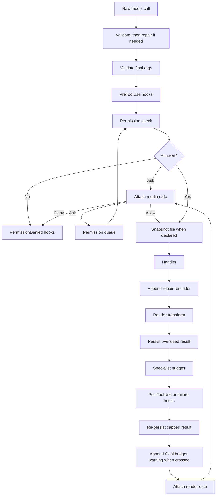

# Tools

## Tool pipeline

All tools go through `mevedel-pipeline-run-tool`:


```mermaid
flowchart TD
    R[Raw model call] --> S[Validate, then repair if needed]
    S --> A[Validate final args]
    A --> B[PreToolUse hooks]
    B --> C[Permission check]
    C --> D{Allowed?}
    D -- No --> E[PermissionDenied hooks]
    D -- Ask --> Q[PermissionRequest hooks]
    Q -- Ask --> F[Permission queue]
    Q -- Deny --> E
    Q -- Allow --> G
    F --> C
    D -- Yes --> G[Snapshot file when declared]
    G --> H[Handler]
    H --> I[Append repair reminder]
    I --> J[Render transform]
    J --> K[Persist oversized result]
    K --> L[Specialist nudges]
    L --> M[PostToolUse or failure hooks]
    M --> N[Re-persist capped result]
    N --> O[Append Goal budget warning when crossed]
    O --> P[Attach render-data]
    P --> Q[Attach media data]
```

Synchronous handlers receive `(args)` and asynchronous handlers receive
`(callback args)`, where args is a keyword plist. The
pipeline sequences the standard cross-cutting steps; handlers contain no
boilerplate for validation, hooks, permissions, snapshots, or
persistence.

Request teardown cancels the currently active pipeline step. The tool callback
then receives one canonical error result, `tool-finished` records one error,
and the open step span records one cancelled terminal outcome. A late async
continuation from the cancelled primitive is ignored.

Tool-result media has one focused boundary in `mevedel-tool-media.el`.
It validates and sanitizes captured media records, stores their bytes behind
opaque transcript references, restores trusted records during replay, removes
validated media from hook-visible text, preserves marker-shaped ordinary text,
and converts restored records into each provider's native payload shape.
`mevedel-pipeline.el` supplies the session's
tool-results directory and calls that boundary from the attach, hook, render,
and gptel parse steps; it does not construct provider-specific media blocks.
The transcript reference contains only an opaque record id and its owning tool
use id. Replay never rereads the original filesystem path. Remote records are
published and replayed through the session artifact manifest; a fixed-path
cache is never an authority fallback. In-memory retention is bounded by
`mevedel-tool-media-cache-max-bytes` (default 25 MiB): the oldest records are
dropped first and the newest is always kept. Durable records are reread from
their published copy after eviction; media captured without durable storage is
unavailable once evicted.

`mevedel-tool-render-data.el` owns render-data serialization, provider
scrubbing, transcript mutation, and stale execution reconciliation. The
Pipeline owns only the render-transform and final attachment steps and their
ordering.

Important tool metadata:

- Behavior: `:read-only-p`, `:snapshot-p`, `:destructive-p`, `:async-p`
- Permissions: `:check-permission`, `:check-permission-async`,
  `:get-path`, `:get-paths`, `:get-pattern`, `:get-domain`, `:get-name`
- Loading/grouping: `:category`, `:groups`, `:wrap`, `:prompt-file`
- Input contracts: `:args`
- Display/output: `:summary`, `:max-result-size`, `:render-transform`,
  `:renderer`

Native and wrapped registrations preserve the same permission metadata.
`mevedel-define-tool` rejects unrecognized keywords during macro expansion.

`:snapshot-p` is an explicit declaration for file-mutating tools whose
before-state participates in the final patch. `ApplyPatch` declares it and
uses `:get-paths` so permission and snapshot steps cover every affected path.

During directive implementation, the pipeline also records conservative
untracked-effect markers for non-read-only execution tools and agent dispatch.
Those markers do not attempt to infer changed paths; they prevent the final
attempt capture from claiming completeness and become explicit Rewind gaps.

### Tool input validation and repair

`mevedel-tool-repair.el` mediates raw model calls before gptel dispatches
them into the pipeline. The temporary provider bridge lives in
`mevedel-tool-repair-gptel.el`; audit and telemetry live in
`mevedel-tool-repair-diagnostics.el`. The core first validates the call unchanged. Valid input is
never rewritten. Only invalid model-produced input gets one atomic repair
attempt; the pipeline then validates the committed arguments again before
hooks or permissions run. Direct programmatic calls and arguments rewritten
by `PreToolUse` remain validation-only.

While gptel decodes provider responses, mevedel preserves JSON `null` as a
distinct sentinel. Before pre-tool hooks it restores decoded empty objects in
the common tool-call representation. This temporary adapter covers gptel's
tool-capable backends in one place and can be removed when gptel's shared JSON
string decoder preserves nulls itself.

The generic repair catalogue is deliberately small and ordered:

1. omit explicit `null` from optional properties;
2. parse exact JSON strings when the parsed value satisfies the expected
   non-string contract;
3. wrap a schema-valid singleton where an array is expected;
4. replace an empty object placeholder with an empty array only for optional
   arrays that permit zero items;
5. unwrap an exact Markdown HTTP(S) auto-link in the final component of a
   semantic filesystem path.

Repairs never invent required values and do not coerce arbitrary strings to
numbers or booleans: the JSON parser must consume the exact input and the
result must validate. Required `null` and required empty-object placeholders
therefore remain invalid. Generic repairs run as one bounded, ordered pass.
The entire candidate is committed only when final validation succeeds;
otherwise the model gets bounded, value-free retry guidance and no tentative
arguments run.

`path` is an internal semantic argument type for filesystem-only contracts.
Provider schemas lower it to an ordinary JSON string and append the guidance
“Pass a raw filesystem path, not Markdown or a URL.” Tools that also accept
resource addresses use a separate path-or-resource contract, so a recognized
`scheme://` address is not rejected as a web URL and ordinary paths retain
their current behavior.

Code-navigation tools keep filesystem access in Emacs buffers, so Imenu and
Tree-sitter operate on remote files through the active file handler. Remote
Xref is capability-scoped: Emacs Lisp reference search is the currently
tested TRAMP-aware path, while definition lookup and other backends return a
direct unsupported-backend diagnostic instead of invoking client-side
programs. Location results are rendered as target-native paths.

Code navigation answers the location it was asked for or reports why it
cannot. A Treesitter line or column the file does not have is an error, never
the nearest position that does exist; the buffer is widened first, and the
column is an Emacs display column, so a tab counts as the width it displays.
Imenu descends every nesting level and prefixes each leaf with its category
path, so class- and namespace-shaped indexes are listed to their full depth,
with whole-buffer line numbers even when the visiting buffer is narrowed. Only
Imenu's own special entries are skipped, identified by the negative position
that marks them rather than by their name, so an ordinary symbol whose name
starts with `*` is listed. Whole-file Treesitter traversal has a construction
limit well above the tool's result limit: it stops there and says the tree was
truncated, so a wide or generated file cannot spend unbounded time and memory
on a tree nothing can consume.

Committed repairs proceed without a retry and add one corrective note to the
final tool result, including error results. If a multi-step candidate still
fails validation, its repair audit is marked abandoned and the handler is not
called. Both audit states contain only rule IDs, schema paths, and before/after
shape names.

Every raw model call records a redacted event on its root session with
the actual backend, model, tool, canonical origin (`/root` or an agent path), outcome
(`valid`, `repaired`, `invalid`, or `abandoned`), rule IDs, schema paths,
execution state, and result classification. Argument values, paths, commands,
prompts, schemas, validation messages, and results are excluded. The in-memory
`mevedel-session-repair-log` is bounded by
`mevedel-tool-repair-log-limit` (default 200). When
`mevedel-tool-repair-persist-log` is non-nil, materialized sessions also append
events to `<session>/repair-log.el`; bounded events recorded before first
materialization are backfilled when the session directory is created.
Remote callback entries wait for session settlement and publish through an
atomic replacement. Failed appends warn, remain queued, and retry after the
next successful session save. Telemetry failures never block tool execution.
`mevedel-tool-input-repair-enabled` disables mutation while retaining
validation and telemetry.

`mevedel-define-tool :wrap SOURCE` freezes the source argument schema, order,
and async calling convention exposed to the provider.  Each call resolves the
current source with `gptel-get-tool`, so a reconnect can replace its function
without rewrapping when that contract is unchanged.  Contract drift fails the
call and requires rewrapping.  Re-registering the same wrapped `(category,
name)` replaces the prior mevedel wrapper, matching native tool registration.
Wrapping is the default for gptel-agent's tools, but a source that leaks
resources cannot be wrapped, because only the owner of a call can release them.
YouTube is therefore registered natively: the mevedel handler resolves the
upstream asynchronous function through `gptel-get-tool` on every call, so
upstream keeps owning the protocol, while mevedel owns the response buffers the
call retrieves. `url-http` records the retrieval arguments in every response
buffer it creates and carries them across redirects, and the upstream handler
passes its callback among those arguments at every stage, so the handler's own
continuation identifies exactly its buffers, including the one YouTube's
watch-page redirect adds, and no buffer belonging to anything else. They are
killed when the call settles, once; a call that never settles keeps its
buffers.

Preset application also resolves its tool specs from the current registry.
Reloading a native tool therefore updates the next request's schema and
handler instead of leaving a stale `gptel-tool` captured by an older preset.

## Resource addresses in filesystem-shaped tools

The closed resource resolver accepts the seven documented `scheme://` families
without adding a model-facing tool. The operation matrix is deliberately
narrow: `Read` accepts every family; `Glob` and `Grep` accept `local://`,
`artifact://`, `skill://`, and `memory://`; `ApplyPatch` accepts `local://` and
ordinary filesystem paths. Unsupported combinations fail explicitly. Bare
addresses list only when the family defines a discovery listing.

Resource preparation runs after repair, final validation, `PreToolUse`, and
hook-rewrite validation, but before permission, snapshots, helper execution,
patch review, or handlers. It returns an opaque resolved attempt and logical
authority facts without reading content. After permission, the handler
executes that attempt without reparsing the authored address. Malformed or
unsupported addresses therefore stop before permission and post-use hooks;
valid but unavailable resources follow ordinary handler failure handling.

Authored addresses remain in model-visible errors, headings, search results,
truncation notices, and persisted tool arguments. Backing paths and helper
roots stay private. Directory-backed resource searches use the existing
confined helper boundary with exact read roots; virtual resources stay
in-process. A mixed local/ordinary `ApplyPatch` remains one proposal and one
atomic review transaction outside standalone/sticky Plan mode. Standalone/sticky
Plan mode keeps all-local `ApplyPatch` available, including proposals from
retained agents, but rejects any ordinary, non-local, or bare endpoint before
local materialization. Mixed local/ordinary and ordinary-only proposals
therefore fail before either side is touched. Directive Planning remains
strictly read-only and does not allow `ApplyPatch`, including all-local
proposals, or `Eval`. See
[`address-to-resource.md`](address-to-resource.md) for canonical grammar,
freshness, and lifecycle contracts.

Tools carry `:groups`. `(:deferred GROUP)` in a preset's or agent's tool
list pulls every tool tagged with GROUP into the session's deferred set.
`mevedel-preset-extra-tool-specs` / `mevedel-agent-extra-tool-specs` add
specs without redefining the preset/agent.

`ToolSearch(load=true)` queues matching deferred tools for the next tool
payload update and reports them as available now so the model calls the
newly loaded tool in its next tool call. Only entries the registry
resolves are reported that way; a match it cannot resolve is reported
unavailable and dropped from the deferred set for the rest of the
request, so the roster and the unknown-tool guidance stop sending the
model back to load it. The next request re-seeds the set from the
preset. Search terms can be exact tool names (`XrefReferences`,
`Imenu`, `function_source`) or capability families (`xref`, `imenu`,
`treesitter`, `elisp`, `web`).

### Interaction tool ownership

`mevedel-tool-ui.el` assembles the user-interaction tool surface and owns the
Agent, FollowupAgent, InterruptAgent, ListAgents, ToolSearch, SendMessage, and
WaitAgent adapters. Ask's questionnaire, handler, renderer, and schema live in
`mevedel-tool-ask.el`. Exact external-path authority is part of the normal
permission pipeline, not a model-visible tool.

Agent's required inputs are `task_name` and `message`. Its optional `role`,
`context`, `model`, and `effort` inputs are validated before reservation:
context accepts `all`, `none`, `summary`, or positive decimal strings; model
selectors use the shared tier/provider parser; and effort support is delegated
to the resolved gptel model. `summary` freezes the realized parent evidence,
omits the triggering Agent tool segment, and makes one handoff-summary request
focused on the hook-accepted task. A valid request reserves path and capacity
while its ordinary task hooks and optional summary prepare asynchronously. The
path is not published until the labelled background, authoritative task,
durable transcript, and provider dispatch succeed; cancellation or failure
releases the reservation.
The same shared resource-grant interface authorizes native filesystem tools and
additive Bash/batch-Eval mounts; command authorization remains independent.
When one Bash or batch-Eval invocation is missing both operation authority and
additive network or exact-path authority, the pipeline presents one combined
card. Checked capabilities are already granted; unchecked capabilities are the
complete upgrade. Approval grants that complete request to the current
invocation, while denial rejects it without replay or reduced execution. Full
execution escalation uses a separate card because it disables confinement
rather than adding a named capability.

All direct user interactions share the settlement and cancellation primitive in
`mevedel-interaction-prompt.el`. Domain owners supply their own text, keymaps,
outcome translation, and persistence effects; the shared primitive owns only
overlay identity, exactly-once settlement, request-local cancellation, and the
standard frame. Ask and other child-originated interactions are attributed by
canonical path and rendered only in the root session's interactive view; child
transcript views remain inspection-only. Interrupting one agent request invokes
that request's canceller and leaves sibling interactions queued.

## Native Tools Surface

The session cockpit `t Tools` row opens the native `*mevedel tools*` surface
for the current main session. `/tools` and `/tools list` open the same
surface. The buffer is read-only UI chrome, not transcript content.

The tools surface shows active tools, deferred tools, temporarily loaded
deferred tools, expired loaded tools, and the deferred-tool TTL. It also
offers session-local lifecycle operations:

- defer an active tool for the current session;
- activate a deferred tool for the current session;
- load a deferred tool temporarily, matching `ToolSearch(load=true)` behavior;
- inspect loaded or expired deferred tools.

Manual tool changes do not mutate presets or global configuration, and they
do not rewrite already-running child agent tool state.

Tool descriptions live in `tools/*.md` and are loaded via
`mevedel-define-tool`'s `:prompt-file` keyword.

### Hook boundaries

`PreToolUse` runs after validation so hooks see normalized args. It runs
before permission so policy hooks can deny, force an ask, add context, or
replace args before the permission resolver and handler see the call.

`PermissionRequest` runs whenever generic, Bash, Eval, or sandbox-authority
resolution produces `ask`, immediately before shared queue admission. It can
allow, deny, or leave the kind-specific card in place. Queue display,
redraw, and rule-driven re-evaluation do not rerun it. `PermissionDenied`
runs once after a final denial, carries its original provenance, and can add
model-facing feedback or context without reopening the tool call.

Post-tool hooks run after initial oversized-result persistence and specialist
nudges, but before final render-data attachment. The specialist-nudge step is a
thin pipeline delegation to `mevedel-specialist-nudges.el`, which owns all
`Read`/`Grep` eligibility, family throttling, deferred `ToolSearch` guidance,
and model-visible reminder text. Post-tool hooks receive both the raw
handler output and the exact model-visible result. They can replace
feedback or add context, but they cannot undo tool side effects that
already happened. For capped tools, a second persistence/truncation pass
runs after post-tool hooks so `updated_result` cannot reintroduce an
oversized model-visible result.

Post-use hooks imply handler execution. A successful handler emits only
`PostToolUse`; an explicit error result, invalid return, or handler signal is
normalized and emits only `PostToolUseFailure`. Validation failures,
permission failures, and aborted permission interactions emit neither event.

For an attributed root Goal turn, the final model-visible result receives one
100% budget warning when cumulative provider-reported input plus output usage
first reaches the Goal limit. This runs after final oversized-result
persistence, so the warning remains visible even when the original result was
capped. It is advisory: the current request and tool pipeline continue.

### Hazard: post-handler steps must read from context, not buffer-local

Pipeline steps that run **after** the handler must read session,
workspace, and any other chat-buffer state from the pipeline context
plist — not from `(current-buffer)` or buffer-local variables.

Tool handlers may invoke the async callback from process sentinels,
temporary buffers, or other non-chat-buffer contexts. Because steps are
chained via callbacks, anything that runs after the handler executes in
the callback's current buffer — often a process output or temp buffer —
where `mevedel--session` and `mevedel--workspace` may have no
buffer-local binding and silently fall back to `nil`. That has produced
concrete bugs (e.g. result persistence skipped because
`mevedel--workspace` came back `nil` inside a temp buffer).

Rules of thumb:
- Capture session/workspace once at `mevedel-pipeline-run-tool` entry
  and thread them through the context plist.
- Steps that run **before** the handler (validate, permission,
  snapshot) are safe to use `current-buffer` — they run in the caller's
  buffer.
- When adding a step, check its position relative to the handler before
  deciding whether buffer-local reads are safe.

## Tool renderers

Individual tools may ship a `:renderer FN-OR-ALIST` for rich collapsible
views in the view buffer. Function contract:

```
(lambda (NAME ARGS RESULT RENDER-DATA) -> rendering-plist-or-nil)
```

Pure function — no I/O, no mutation. Nil falls back to
the generic renderer.

Alist form dispatches on the visible result status:

```elisp
((success . FN) (error . FN) (default . FN))
```

The view first uses structured `:status` from render-data, then falls back to
the visible result: `error` when `mevedel-view--tool-result-error-p` matches,
otherwise `success`. Lookup tries the exact status first, then `default`, then
the generic renderer. Explicit pipeline status also overrides a custom
rendering plist's visual `:status`; without explicit status, the rendering
plist controls only the visual marker and does not participate in dispatch.

Rendering plist: `(:header STRING :body STRING :body-mode SYMBOL
:status SYMBOL :expandable-p BOOL :hidden-p BOOL
:coalesce-key STRING
:initially-collapsed-p BOOL)`.
`:status`, `:expandable-p`, `:hidden-p`, and `:coalesce-key` are optional. When
`:expandable-p` is nil, the view inserts a compact non-toggleable event line
and ignores `:body` and `:initially-collapsed-p`. When `:hidden-p` is
non-nil, the view inserts nothing. Consecutive visible renderings with equal
coalescing keys retain only the final row and append their call count; any
other visible rendering ends the run. Validated by
`mevedel-view--rendering-plist-p`.

Well-formed tool segments always render through a registered renderer
or the generic fallback. Malformed or unparseable tool segments keep the
older safe fallback behavior.

Renderers that remove appended specialist nudges or system reminders from
their display body must strip only an explicit trailing appended block.
Tool output may legitimately contain marker-shaped text, especially Read
output with line prefixes, so renderer cleanup should first check for the
marker and never treat arbitrary file content as hidden guidance.

### Render transforms

Wrapped tools may ship a `:render-transform FN` to synthesize bounded
render metadata from string output:

```elisp
(lambda (NAME ARGS RESULT) -> render-data-or-nil)
```

`RESULT` is the normalized string result before oversized-result
persistence and before render/media side-channel attachment. The
transform runs only when the handler did not already provide
`:render-data`, only for string results whose pipeline status is not `error`,
and never changes `:result` or `:raw-result`. Transform errors emit a warning
and leave the tool result unchanged.

Transforms must return small metadata, not copies of large result
bodies. The pipeline rejects oversized transform metadata so a transform
cannot bypass tool-result persistence by hiding the full output in
render-data.

### Render-data side channel

Every handler returns a plist containing `:result` and may set `:status` to
`success` or `error`. The handler boundary normalizes that optional status
into canonical lifecycle state before post-use hooks run; legacy `Error:`
results are classified only at that boundary. Invalid returns and handler
signals become canonical errors there as well. Final lifecycle and repair
telemetry retain that same classification regardless of displayed result text.
When a handler
includes `:render-data DATA` or
explicit status, the pipeline writes `:result` to the data buffer and appends a
hidden block wrapped in `<!-- mevedel-render-data -->` delimiters, propertized
`'gptel 'mevedel-render-data` and `'invisible t`. Parser:
`mevedel-tool-render-data-extract`.
Tool-result blocks carry the owning tool-use ID. Provider scrubbing, view
extraction, and live metadata updates accept only the block whose owner matches
the surrounding tool call; other valid marker-shaped blocks remain literal
result text. Non-tool render records are unbound and are parsed only by their
dedicated non-tool paths when the complete source span carries live producer
provenance or the persisted `gptel=mevedel-render-data` property;
delimiter-shaped user, assistant, and reasoning text remains ordinary
transcript content.
The payload is exactly one proper keyword plist.  Marker-looking text with a
non-plist payload, trailing Lisp data, or unreadable data is ordinary visible
tool output and is preserved verbatim. Handler envelopes are validated at the
pipeline boundary as well: a non-nil `:render-data` value must already be a
proper, even keyword plist. Malformed renderer metadata becomes a canonical
tool error instead of reaching transcript serialization.

Child-process settlement may add a model-hidden `:sandbox-summary` to this
same payload. It contains only logical attempt/start/refusal counts, boundary
symbols, and aggregate additional read/write mount counts. Default confined
execution and additional read-only mounts are omitted. Paths, commands, and
raw launcher reasons are never copied into the summary.

Tool renderer input is derived from the data buffer on each rerender; it
must not depend on durable state stored only in view overlays or text
properties. View-local fragment metadata, collapse state, and renderer caches
are disposable UI state.
`mevedel-view--invoke-renderer` `condition-case`s the call; malformed
output emits a warning and falls through to the one-liner.

Wrapped tools (gptel/MCP) have `render-data` = nil unless they declare a
`:render-transform`; their renderer can use transform metadata when
present or parse the result string directly.

Agent tool calls and direct asynchronous workflows use `:kind
collaboration-event` render-data. A `started` event renders the retained
transcript handle; the registry-backed aggregate status uses distinct
`Running`, `Waiting`, and `Blocked` rows. Canonical tool and lifecycle events
are the only sources for `Started PATH`, `FollowupAgent: PATH`,
`SendMessage: PATH`, `InterruptAgent: PATH`, and `Waiting for agents`.
Settled `WaitAgent` calls render `WaitAgent: agents (OUTCOME)`; consecutive
waits coalesce into the final row with a count. `FollowupAgent: PATH` and
`SendMessage: PATH` start collapsed and expand to their exact follow-up or
mail text.
Render-data lookup/patching scans literal open/close delimiters rather
than matching the whole hidden block with one regexp; live agent metadata
and multiline payloads can be large enough to overflow Emacs regexp
limits. ApplyPatch uses `:kind patch` render-data for one persisted aggregate
whose body contains structured per-file diff blocks.

## Tool result persistence

When `:max-result-size` is set and result exceeds the effective limit
(min of tool value and 50,000-char global cap), the full result is saved
to `.mevedel/tool-results/` and replaced with a preview wrapped in
`<persisted-output>` XML. The LLM can `Read` the file to see the full
output, and the notice provides a followable `artifact://` address plus exact
bounded `Read` continuation and `Grep` recovery calls. `Grep` accepts an
explicit artifact address; absolute session-storage paths remain internal.
When persistence is unavailable, the notice says the omitted text is
unavailable and asks for a narrower rerun. Oversized error results are
truncated but not persisted according to
the canonical status produced at the handler boundary. Every
oversized preview keeps equal head and tail budgets, prefers nearby newline
boundaries, and reports the exact omitted character count. The persisted file
remains complete. Bash and Eval do not apply an earlier prefix-only cap. No
workspace → no persistence.

Per-tool limits match Claude Code's approach: Grep 20k, Bash/Eval 30k,
Glob 30k, Ask 30k, Xref*/Imenu 20k, Treesitter 30k,
WebFetch/YouTube 50k. Read/ApplyPatch: nil (self-bounded or short). Agent
`RESULT` mailbox records inline at most a 32 KiB preview of the final response;
the retained agent resource keeps the complete latest settled payload and
terminal outcome.

## External helper confinement

Native tool implementations launch short-lived external helpers through the
`mevedel-execution.el` facade, backed by the same opaque process owner used by
Bash and batch Eval.
The caller supplies a structured argv, authorized read paths, and explicit
writable artifact directories. The facade adds a private scratch working
directory, applies `mevedel-sandbox-mode`, and removes the scratch directory
after the callback. The process owner handles timeout/process-group cleanup
and streams output into a bounded temporary disk spool rather than an Emacs
process buffer. The one-shot terminal result contains the captured output and
structured exit, timeout, output-limit, byte, and wall-time facts. In
`best-effort`, the facade may retry directly only after a pre-exec Bubblewrap
failure; it never replays a helper that may have started. `required` fails the
tool explicitly and `off` runs directly.

Bubblewrap capability probes are cached independently per execution target.
Local probes use the short `mevedel-sandbox-probe-timeout`; remote probes use
`mevedel-sandbox-remote-probe-timeout` (10 seconds by default) so transport
latency does not silently disable best-effort confinement.

All operating-system children receive deterministic defaults for UTF-8 locale,
no color, terminal mode, and pagers, plus `MEVEDEL_EXECUTION=1`. An invocation
can still override these variables inside its own command. Ordinary one-shot
stdin is closed immediately. For local Unix execution, a normal main-process
exit drains any remaining process-group descendants through the same bounded
TERM/KILL path before the one-shot callback runs. Local Windows execution
remains limited to the direct child; remote execution retains the target-side
wrapper behavior described below. Remote direct-async channel overrides are
scoped to the individual spawn and never change the user's global TRAMP
connection properties.

`mevedel-tool-fs.el` owns registration and the shared path/resource result
primitives. `mevedel-tool-fs-read.el` owns text/media decoding and bounded Read
output; `mevedel-tool-fs-search.el` owns Glob/Grep execution and private
resource-output rewriting. Diff generation belongs to the shared Utilities
owner, while pre-turn file snapshots belong to Pipeline.

The current external-helper inventory is `diff`; `rg` for Read directory
listings, Glob, and Grep; `pdfinfo` and `pdftoppm`; and ImageMagick's `magick`
or `convert`. Their sandbox facts stay out of successful model-visible results.
Directory Read does not follow descendant symbolic links beyond its authorized
root.
Materially non-default facts are aggregated per owning tool invocation and
persisted in its hidden render-data as a durable warning; additional read-only
mounts stay silent.
Helpers that consume target files stage scratch on that target.  Unified diff
presentation is deliberately local because it compares two already-local
content snapshots; an ambient remote session never sends its local temporary
files to the target's `diff` process.
Native filesystem permission checks remain the authorization boundary; helper
confinement limits effects after that authorization.

Glob and Grep keep the helper's private scratch working directory and pass
absolute authorized search roots to ripgrep. Both narrow a
directory-qualified pattern by its leading literal components.
Absolute patterns, parent traversal, and existing symlink escapes are
rejected. Missing qualified directories settle as ordinary no-match results.
Both tools search hidden
files and exclude `.git`, `.svn`, `.hg`, `.bzr`, `.jj`, and `.sl` metadata at
any depth. Glob deliberately ignores ignore files. Grep respects ignore rules
during ordinary traversal, while an explicit `path` or positive `glob` may
select ignored content; explicit scope takes precedence. Neither sorts results
or follows symlinks. Both share
`mevedel-tool-fs-search-timeout` (20 seconds by default). Error, timeout, and
output-limit facts are settled before exit codes, with captured timeout or
output-limit text labeled partial and passed through the existing result
bounds. Result ordering is unspecified. Incomplete and failed searches tell
the model which path or expression fields to narrow before retrying.

## Managed Bash execution

`mevedel-tool-exec.el` owns Bash/Eval tool registration, execution lifecycle,
and rendering. Bash classification and guardian policy live in
`mevedel-bash-policy.el`; execution-specific permission normalization and
prompt adaptation live in `mevedel-tool-exec-permission.el`.

Bash source runs through `bash -lc`, so login-shell initialization contributes
to the requested command's output. Managed Bash has no automatic timeout; use
the native `timeout` command when the command itself needs a deadline. On Unix,
Emacs places each child in a dedicated process group, and mevedel sends TERM
followed by KILL to the whole group. On Windows it terminates the direct child.
The result includes partial combined stdout/stderr and structured termination
facts.

Bash waits up to `yield_time_ms` (10 seconds by default, clamped to
250-30000ms; malformed values fall back to the default). A command
that finishes first returns normally and discards its temporary spool when all
output fits inline. A command still running at the boundary returns its unread
output and an opaque owner-scoped execution ID. Local sessions retain a session
artifact when output does not fit inline. Remote execution spools client-locally
while live and never exposes that client path to the model. When an observation
omits output, mevedel stages a complete session artifact at that tool-call
boundary and returns its target-native logical path; terminal settlement
updates it with the final bytes. If another session publication is already
active, the session artifact resolver serves the queued local staging bytes
until its manifest commit. The local remote spool is removed at terminal-record
retirement or session teardown.
The 64 MiB output cap continues running after yield. Pipe-mode stdin is closed
from spawn. Explicit `tty=true` instead allocates a PTY and retains writable
stdin without changing the captured owner, workdir, confinement, or resource
grants. Native Windows Emacs exposes only pipe subprocesses, so mevedel rejects
PTY and Interrupt requests there; Stop remains available for the direct child.
If the managed spool cannot be written, mevedel records the file error,
settles with `output-write-failed`, and starts the same bounded TERM/KILL path;
unwritten chunks never advance output counters or previews.
Empty `WriteStdin` polls default to 5000ms and clamp positive shorter waits to
5000ms; the maximum is 300000ms. `WriteStdin` sends ordinary input only to
PTYs. Unconfined Ctrl-C is
written through PTYs or signals pipe-mode process groups; confined Ctrl-C
instead signals the foreground process group once across Bubblewrap's session
boundary.
Every observation returns only the newly unread output. `ListExecutions`
exposes only the caller's yielded handles, and `StopExecution` terminates only
a handle owned by that caller. Input and stop inherit that execution authority
without another prompt, while explicit deny rules and permission hooks still
apply. A successful empty `WriteStdin` poll while the execution remains
running is model-visible but omitted as a separate view row; progress continues
to update the original Bash row. Polls with output, input writes, terminal
observations, and failures remain visible. Adjacent successful output-free
poll rows for one execution coalesce into the final `WriteStdin: polled
background process` row; input writes render `WriteStdin: sent input to
background process`.
Each `WriteStdin` attempt records
its requested `yield_time_ms` and the
effective wait, making omitted or stale tool arguments visible without storing
stdin or process output. Terminal facts record PTY mode and preserve the raw
process exit or signal status. Canonical lifecycle state distinguishes
`queued`, `running`, `stopping`, and `completed`; Interrupt rejects queued work
that has not started, while Stop cancels it. There is no chunk ID: each
observation advances one private unread cursor and returns canonical execution
facts separately from the raw output. Unread ranges beyond 2000 characters use
the shared newline-aware,
equal head-and-tail preview while the retained artifact remains complete.
The initiating Bash disclosure remains force-expanded with a five-line tail
while live and returns to its normal collapsed state when it settles. Its
collapsed header truncates the first command line to 60 columns; expanding the
disclosure shows the exact full command above its output.

Managed executions publish transient progress after two seconds, at most four
times per second. The existing Bash row shows the last five output lines, elapsed
time, line and byte counts, and the execution ID once the command has yielded.
These progress updates live only in bounded view state and never create
transcript turns. Events carry the originating data buffer and durable tool-use
ID, so the matching main or agent view is selected directly. A progress or
terminal event replaces only that source-backed Bash row; a missing row
schedules one coalesced incremental recovery render rather than rebuilding the
whole transcript.
Terminal settlement replaces the original row's hidden render-data side channel
in the authoritative transcript with the bounded whole-artifact head-and-tail
preview plus exit, outcome, duration, omitted-output facts, and any noteworthy
sandbox summary. Polling, input, and stop tools never duplicate that disclosure
on their own rows. The provider
scrubber keeps that durable UI state model-hidden, while transcript persistence
keeps it stable across cache turnover and resume. Parallel completion may beat
gptel's insertion of the original row; a bounded data-buffer queue retains that
terminal projection and retries it at tool and final-render boundaries.
Agent data buffers run the final-boundary retry even when no transcript view is
open.

Terminal delivery has one publisher. The yield boundary first reconciles an
already-exited child, so its initiating Bash call receives completion instead
of a stale live handle. A yielded terminal result remains owner-pollable for 60
seconds; repeated polls return the same observation without publishing another
terminal event or mailbox message. If a yielded process exits independently,
or the user stops it outside the model tool, root-owned output is queued
synchronously in the root mailbox without starting a model request. Agent-owned
completion is captured by the retained invocation instead: it does not wake
`WaitAgent`, and once the provider has produced its terminal response the
runtime appends every captured completion and settles the turn directly in
either arrival order. This starts no model request. Passive progress/view
subscribers cannot acknowledge delivery, and finished records never appear in
live execution listings.

The transcript view renders execution-only mailbox deliveries as compact Bash
completion cards while retaining their full model-facing disclosure in the
authoritative data buffer.

Users have a separate session-wide control surface. `/ps`, the view's live
execution status row, and the session cockpit's `Executions` row open a
tabulated list containing foreground and yielded work from every model owner.
It shows the opaque execution ID, canonical owner (`/root` or a retained agent
path), command, PTY mode, elapsed
time, output bytes, and sandbox state. Details include the bounded live tail
and current spool path. The user may send a PTY line, signal Ctrl-C, stop the
process group, or open the spool. `/stop EXECUTION_ID` stops directly; bare
`/stop` stops every live execution in the session. These user controls do not
widen model tool authority: `WriteStdin`, `ListExecutions`, and
`StopExecution` remain scoped to the calling owner and yielded handles.
Progress and completion refresh the table in place, and terminal rows
disappear instead of becoming tombstones.

Terminal facts preserve the raw exit code and derive a separate `outcome`.
Zero is `success`. Exit one is `no-match` for one proven simple `grep` or `rg`
command, `different` for `diff`, and `false` for `test` or `[`. These outcomes
are successful tool observations rather than execution errors. Exit codes two
and above, non-exit termination, path-qualified executables, and compound,
dangerous, complex, or unsupported analysis fall back to `failure`. Command
output is never prefixed or rewritten to encode the outcome. Model-visible XML
and UI render data consume the same canonical fact snapshot; the XML also
repeats the exact command so parallel same-name calls remain self-identifying.

Analyzer-proven read-only Bash calls may overlap within one session. Unknown,
unparsable, and mutating calls use the exclusive lane. Admission is FIFO: once
an exclusive call is waiting, later readers wait behind it, preventing writer
starvation. Main and sub-agent owners share their session's scheduler, while
separate sessions remain independent. A command releases its scheduler lease
when it finishes, aborts, or yields; a yielded operating-system process keeps
running under its original owner and resource boundary without blocking later
admission. Before starting queued work, admission rechecks that a retained agent
owner is still active and settles rejected work without spawning a process.

A remote mutating Bash command first acquires or verifies the session's portable
mutation lease and durably arms its unsettled-mutation latch before process
launch is attempted. Yield releases the scheduler lane, so more than one
mutating process can remain armed; one clean settlement cannot clear the latch
while another armed record remains. A post-attempt launch error, transport loss,
or failed lease compare-and-set remains unknown. Reconnect plus explicit user
acknowledgement clears the durable latch before mutation admission reopens.
Non-read-only tools are rejected while the latch is armed without a live
provable writer. Lifecycle teardown gives a final KILL one bounded proof
interval before it decides whether the latch can clear. Process records,
timers, and spools remain transient.

At most 64 managed Bash processes may be live in one session. The sixty-fifth
is refused before spawn without evicting existing work. Foreground work remains
owned by its initiating request; yielding detaches it from later request aborts
without changing its session, model owner, sandbox boundary, working directory,
or resource grants. Shell-native background operators are rejected because
they would bypass this lifecycle. Remaining descendants are terminated when
the managed shell exits: the captured process group is signalled once and then
force-killed after a single bounded cleanup interval, and the record settles
only after that. Run a service that must outlive its command outside managed
Bash.

Execution lifetime follows ownership rather than transcript visibility. Agent
termination synchronously discards only that canonical agent's Bash and native
helper children; data-buffer teardown, package uninstall, and Emacs exit do the
same for every child in the session, including queued scheduler work and
process-group descendants. Record-owned teardown also releases helper scratch
directories when normal callbacks are suppressed. Ordinary yielded completion
still uses the captured owner context and never launches an unsolicited model
request. Bash, Eval, and filesystem helpers all resolve that owner through the
same request-first execution-context resolver.

### Real transport acceptance

`test/test-mevedel-execution-remote.el` has opt-in cases for each supported
transport. Set any combination of `MEVEDEL_TEST_SSH_ROOT`,
`MEVEDEL_TEST_DOCKER_ROOT`, and `MEVEDEL_TEST_PODMAN_ROOT` to existing writable
TRAMP directories; authentication and target/container startup remain external
to the suite. Unset transports skip independently. Once configured, each
transport must also pass `required` Bubblewrap readiness and its exact-grant
case; unavailable confinement fails that release gate.

```bash
MEVEDEL_TEST_SSH_ROOT=/ssh:user@host:/srv/project/ \
MEVEDEL_TEST_DOCKER_ROOT=/docker:container:/workspace/ \
MEVEDEL_TEST_PODMAN_ROOT=/podman:container:/workspace/ \
npx @emacs-eask/cli test ert test/test-mevedel-execution-remote.el
```

The loss cases discard this client's transport and refuse reconnection while
the execution settles, so the target keeps running and the outcome is
genuinely unprovable. They require an unknown outcome plus the
mutating-execution block, then reconnect, identity-check the bounded
descendant that survived, and clean its process group.

For a disposable local matrix, the repository provides one OCI target image
used by Docker, Podman, and SSH.  The launcher builds it, starts one container
per runtime, routes SSH through the Docker instance, temporarily installs the
pinned Bash tree-sitter grammar when absent, runs the acceptance file, and
removes its containers, grammar, and temporary credentials.  It deliberately
supplies no `--privileged`, capability, or security-profile override; the same
default-run core transport matrix is a CI gate:

```bash
test/run-remote-acceptance.sh
```

## Eval execution scope

Eval has two execution modes.  `live` is the default and runs inside the
current Emacs process so it can inspect live session state.  Live mode
restores the selected frame's window configuration by default, preventing
accidental calls like `delete-other-windows` from surprising the user;
`preserve_ui: false` opts out for deliberate UI manipulation.  `batch`
runs a child `emacs --batch -Q` process with the current `load-path` and
the session working directory. Bash and batch Eval share child-process output,
cleanup, process-group handling, and optional Bubblewrap confinement; live Eval
does not use that child seam. Batch mode isolates interactive Emacs state and,
when the platform sandbox is active, applies the same filesystem, protected
path, process, and network boundaries as Bash.

Bash and batch-Eval results record the boundary that applied to their
invocation. The settled owning tool row retains a compact durable warning for
materially non-default boundaries, additional writes, refusals, and children
that never started. Additional read-only mounts stay silent. Agent rows
aggregate warnings from their direct child executions, while the agent
transcript identifies the affected tools.
