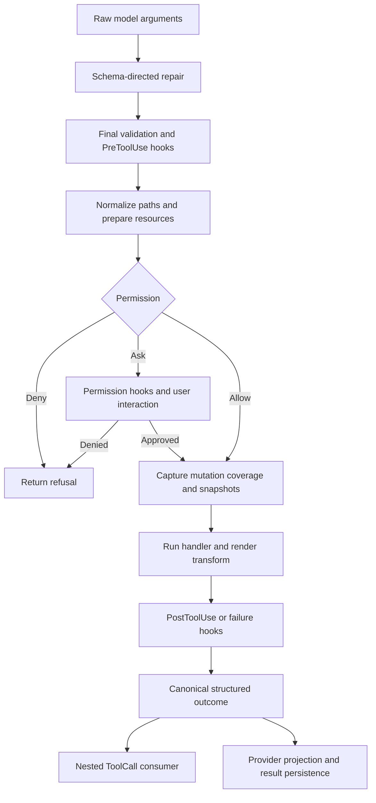

# Tools

## Model-facing descriptions and manuals

Native tool schemas own parameter names, types, required fields, and basic
constraints. Descriptions retain suitability, ordinary usage, essential limits,
and failure behavior in When to use / When NOT to use / How to use sections.
Keep worked examples that clarify parameter combinations, result interpretation,
recovery, or consequential mistakes. Examples may repeat a contract when the
concrete case makes it easier to use. Improve or omit examples that add no useful
information; neither an example nor a good/bad pair is required for every tool.
Avoid repeating a workflow policy across tools; suitability should explain this
tool's actual behavior.

Tools with meaningful advanced behavior point to packaged Markdown and name
the cases that need it. Read, Glob, and Grep share
[`tools/files.md`](tools/files.md); ApplyPatch uses
[`tools/applypatch.md`](tools/applypatch.md); Bash uses
[`tools/execution.md`](tools/execution.md); ToolCall uses
[`ptc-dialect.md`](ptc-dialect.md). Models retrieve these through Read at stable
`mevedel://` addresses, with no mandatory full-manual load for ordinary calls.
Simple tools do not need manuals. Keep consequential prerequisites, authority
boundaries, irreversible effects, and ordinary grammar visible in descriptions.

Every built-in role exposing these tools also has Read. Manual retrieval uses
the installed `docs/` tree, including `docs/tools/` in Eask packages, and needs
no source checkout or session-specific address. Missing guidance is an ordinary
Read failure; use only the known contract or report the missing manual. A
manual read adds later result context without rewriting the tool description.
Update manuals with the implementation, and retrieve needed detail again after
context loss or a manual change. Static manuals do not list dynamic capabilities:
ToolSearch delivers current contracts; the dialect manual lists pure operations.

## Shared editing

`SharedRead`, `SharedCreate`, and `SharedEdit` expose session-owned collaborative
whiteboards and documents. Reads return revisioned targets and matching board
media; mutations use exact target preconditions and the normal permission
pipeline. An atomic commit and its result delivery defer cancellation
settlement until the actual durable outcome is known. See
[shared editing](shared-editing.md) for schemas, reversion, and host ownership.

## Tool pipeline

`mevedel-tool-registry.el` owns registration, schemas, and conversion of gptel's
positional arguments to handler plists. Registration loads gptel's tool API;
the registered callbacks load the execution pipeline on their first call.

All tools share one execution pipeline. Provider calls enter through
`mevedel-pipeline-run-tool`; nested programmatic calls use
`mevedel-pipeline-run-tool-outcome`:


```mermaid
flowchart TD
    Raw[Raw model arguments] --> Repair[Schema-directed repair]
    Repair --> Validate[Final validation and PreToolUse hooks]
    Validate --> Resolve[Normalize paths and prepare resources]
    Resolve --> Permission{Permission}
    Permission -->|Deny| Refuse[Return refusal]
    Permission -->|Ask| Review[Permission hooks and user interaction]
    Review -->|Denied| Refuse
    Review -->|Approved| Capture
    Permission -->|Allow| Capture[Capture mutation coverage and snapshots]
    Capture --> Execute[Run handler and render transform]
    Execute --> Post[PostToolUse or failure hooks]
    Post --> Outcome[Canonical structured outcome]
    Outcome --> Nested[Nested ToolCall consumer]
    Outcome --> Provider[Provider projection and result persistence]
```

This shows the common execution path and its two output consumers. Validation,
resource preparation, hooks, or the handler can terminate a call with a failure;
permission denial cannot reach mutation capture or the handler. Permission hooks
and user decisions are detailed in [Permissions](permissions.md#decision-flow).
Provider projection adds hook context and repair feedback, persists oversized
output when declared, queues any Goal-budget warning, then attaches render data
and media. It does not feed that presentation back into a nested ToolCall.


Synchronous handlers receive `(args)` and asynchronous handlers receive
`(callback args)`, where args is a keyword plist. The
pipeline sequences the standard cross-cutting steps; handlers contain no
boilerplate for validation, hooks, permissions, snapshots, or
persistence.

The structured outcome boundary is not a second pipeline. It captures status,
canonical result, raw result, render-data, media, tool-use identity, parent
identity, and call source after common execution. Provider-only projection text
never becomes input to a ToolCall guest. Text-only metadata stripping preserves
non-string result values, including nil, for hooks and nested callers. Provider
projection uses gptel's normal text conversion when attaching display metadata,
so numeric and other non-text results retain their underlying tool renderer.
The call returns a cancellation
thunk that settles its current pipeline continuation exactly once;
already-started tool-specific effects remain cancellable only when their owner
exposes that capability.

Handler-owned cleanup registers before the outer pipeline canceller, so a
compound async tool can cancel and audit its active children before its own
provider-facing result settles.

### Tool-call identity in transcripts

Mevedel renders completed calls from gptel's authoritative `:tool-use` records,
which contain the original ID, final arguments and result. For each record, the
adapter supplies gptel's existing renderer with that single call and its tool
specification. It restores the complete request call list even if insertion
fails and keeps the normal insertion markers, result-inclusion settings and
callback contract. This applies to main and agent conversation buffers carrying
a mevedel session; unrelated gptel conversations keep their own rendering path.

Results appear in the model's call order, independently of asynchronous
completion order. Distinct invocations with identical arguments or results
retain their own IDs. The callback's tool specification is located by name;
call identity, arguments and output always come from the authoritative record,
never a name/argument guess or text inside the result.

The adapter retains gptel's callback format and normal transcript storage.
Its rationale and the prior ID-assignment failure are recorded in
[ADR 0115](adr/0115-retain-delivered-conversation-fragments.md#decision-history).

### Retained provider history

`mevedel-history.el` records the provider message fragment for each fully
rendered tool response and its results. It records neither the system prompt nor
the native schemas, transport headers or keys. This is a fragment per completed
response, not a growing full-conversation snapshot. It duplicates response
content in local storage so reconstruction can preserve grouping, preambles,
result whitespace and opaque fields such as reasoning signatures.

A fragment has a provider/endpoint fingerprint, model and cache policy, paired
trusted boundaries, and a digest of the covered rendered text and meaningful role boundaries. Replay requires
the same provider/model/policy and complete unchanged source. Prompt preparation
maps verified spans through gptel's Org conversion; a second digest includes role
properties so later text edits or filtering invalidate replay. Context selection
must retain both boundaries. Omitted results are never recovered from hidden
metadata. Model or provider switches use the new backend's normal serialization.

The adapter applies only to mevedel conversations and their prepared prompt
copies. Other gptel buffers retain their normal behavior. Decoded reminders keep
separate message boundaries, and the backend's current explicit cache annotation
is applied to the assembled messages. Stable reconstruction enables cache reuse;
it cannot guarantee that a provider retains or serves a cache entry.

The view continues to render the normal transcript and grouped reminder rows;
provider fragments stay hidden. Compaction uses displayed evidence and decoded
reminder bodies, excludes encoded provider metadata, and removes records with
retired history. Source edits, partial selection, compaction and deliberate
provider/model/policy changes can still change the cached prefix. History without complete fragments uses normal backend serialization.

### Programmatic Tool Calling

`ToolCall` runs one fresh orchestration script in the closed machine
documented by its static description and on-demand dialect manual. `mevedel-tool-ptc.el` owns
that description, the request roster, registration, and aggregate rendering;
`mevedel-ptc-driver.el` owns nested pipeline orchestration and exposes one
execution entry to the tool adapter; `mevedel-ptc-interpreter.el` remains the
pipeline-independent guest machine. Nested calls retain the normal validation,
hook, permission, snapshot, cancellation, and telemetry behavior. They are
shown as one live aggregate row and one settled ordered audit, not as invented
provider transcript messages. Child identities use `ToolCall-ID/N` and source
`ptc`; those facts reach hooks, permission logs, pipeline telemetry, and the
child audit. The live row reports active tools, terminal completion counts,
failures, denials, and permission waits. In composed expressions, child outputs that fit the guest value
budget stay in the user-visible settled audit but are never copied into
provider history. An oversized child value becomes a bounded guest error before
the audit or its checkpoint retains it. The cumulative retained-value budget is
also charged before parallel results enter either durable surface.

The ToolCall envelope is available to the root session and to retained
agents; every built-in role declares it. An agent-run script differs in one
way: it never writes the durable envelope checkpoint, because an agent buffer
resolves to the parent session, whose checkpoint recovery reconciles into the
root transcript. After a restart an interrupted agent script settles through
the agent's own interrupted-turn handling instead.

A syntactically direct expression renders using the underlying tool's normal
renderer and status, while retaining the ToolCall envelope and child IDs in the
transcript audit. The redundant direct-call text result in that audit is a
bounded preview; the outer result remains the displayed result. Non-text values,
arguments, render data, IDs, and supported media retain their ordinary direct-call
semantics. Its result and supported media reach the model unchanged
apart from ordinary output limits and pipeline guidance. Ask, Skill, WaitAgent
and UpdateGoal are standalone-only; unclassified wrapped tools default to that
route. `mevedel-ptc-composable-tools` admits additional names for composition.
A program that transforms one child result still renders as a script.

Emacs and collaboration projection share the same direct-call selection rule.
Browser records retain the outer execution name and ID for pending/settled
reconciliation and carry a separate, bounded `presentation` tree. Registered
tool renderers supply its headers, bodies, statuses, children and parallel
batches. Skill display metadata retains the prepared dependency bodies from
invocation; browsers show each in a separate collapsed foldout, without
rereading files or exposing dependency reminder wrappers as the root body.
Display metadata remains excluded from provider messages.


The settled envelope's own body carries only what the script returned. On a
successful completion, a returned value longer than
`mevedel-tool-ptc-result-collapse-line-threshold` lines moves into a trailing,
initially collapsed `Returned` row; setting the threshold to zero keeps every
value inline. Each nested call becomes its own collapsible row rendered by that
tool's registered renderer, so a nested Grep row gets Grep's header and
`grep-mode` body rather than one flat dump fontified in a single mode. Rows
exist only while the envelope is expanded, failed rows start collapsed, and a
nested compound call expands into its own child rows one level deeper. The calls
of one `parallel` or `parallel-map` join share a batch identity and are drawn
as a bracketed group, so a concurrent fan-out is distinguishable from the same
calls made in sequence; a one-call join is not concurrency and is not marked.
Retained per-child argument strings are truncated; argument aggregates that are
too large or too deeply nested, and oversized per-child render data, are dropped
whole. The transcript therefore never grows a second full copy of a child result.

The dialect supports sequential dependencies plus bounded `parallel` and
`parallel-map` joins. The latter accept only one direct tool call per entry;
the host concurrency cap is `mevedel-ptc-parallelism`, and results retain input
order. A denial aborts the envelope with a bounded partial-work summary.
Ordinary failures remain values the guest can inspect. In-flight interpreter
state is ephemeral: cancellation or restart interrupts it and it is never
resumed from session storage. Before child effects, the session sidecar records
the envelope. Child audit changes are journaled in memory and become durable on
an unrelated autosave or the settlement write, avoiding one full publication
per child. The provider pipeline commits the settlement checkpoint after result
projection: an oversized result is stored once as a tool artifact, and the
checkpoint contains its bounded preview and resource reference. That marker
commits both before delivery. Post-use hooks still see the full result before
projection. If the pipeline is interrupted before that commit, recovery uses
the last running checkpoint. Structured outcome-only callers checkpoint their
unprojected result at their own completion boundary.
A restart reconstructs one interrupted ToolCall row from the last
durable checkpoint and consumes it with the repaired segment. Synchronous child callbacks are admitted
in bounded timer turns so one batch cannot monopolize Emacs. Provider
projection records whether the envelope output was inline, truncated, or
persisted, plus its original character count. A `ptc-script` telemetry span
records only the outcome, budget category, nested-call count, and duration;
script text, arguments, and results are never included. This span ends with
guest execution, before provider projection and final checkpoint publication;
`tool-finished` records the pipeline's final outcome. See
[`0111-run-programmatic-tool-calls-in-a-closed-machine.md`](adr/0111-run-programmatic-tool-calls-in-a-closed-machine.md).

Request teardown cancels the currently active pipeline step. The tool callback
then receives one canonical error result, `tool-finished` records one error,
and the open step span records one cancelled terminal outcome. A late async
continuation from the cancelled primitive is ignored.

Interactive pipeline chains yield between steps after 20 ms of elapsed work
or when input is pending, using an ordinary timer so Emacs can process input
before the next step. A due timer checks input again and waits while keystrokes
are pending, since GC or another callback may have used up its original delay.
A single step may take longer. The pending step retains its cancellation handler
and native error boundary; cancelling removes its timer before side effects
run. A queued successor also checks its cancellation ownership before running,
so a predecessor's late error cannot leave pending side effects. Short chains
without pending input and batch callers keep synchronous chaining. This does not
move tool execution into a Lisp thread.

Tool-result media has one focused boundary in `mevedel-tool-media.el`.
It validates and sanitizes captured media records, stores their bytes behind
opaque transcript references, restores trusted records during replay, removes
validated media from hook-visible text, preserves marker-shaped ordinary text,
and converts restored records into each provider's native payload shape.
`mevedel-pipeline.el` supplies the session's
tool-results directory and calls that boundary from the attach, hook, render,
and gptel parse steps; it does not construct provider-specific media blocks.
The transcript reference contains only an opaque record id and its owning tool
use id. Replay never rereads the original filesystem path. Remote records are
published and replayed through the session artifact manifest; a fixed-path
cache is never an authority fallback. In-memory retention is bounded by
`mevedel-tool-media-cache-max-bytes` (default 25 MiB): the oldest records are
dropped first and the newest is always kept. Durable records are reread from
their published copy after eviction; media captured without durable storage is
unavailable once evicted.

`mevedel-tool-render-data.el` owns render-data serialization, provider
scrubbing, transcript mutation, and stale execution reconciliation. The
Pipeline owns only the render-transform and final attachment steps and their
ordering.

Important tool metadata:

- Behavior: `:read-only-p`, `:snapshot-p`, `:destructive-p`, `:async-p`
- Permissions: `:check-permission`, `:check-permission-async`,
  `:get-path`, `:get-paths`, `:get-pattern`, `:get-domain`, `:get-name`
- Loading/grouping: `:category`, `:groups`, `:wrap`, `:prompt-file`
- Input contracts: `:args`
- Display/output: `:summary`, `:max-result-size`, `:render-transform`,
  `:renderer`

Native and wrapped registrations preserve the same permission metadata.
`mevedel-define-tool` rejects unrecognized keywords during macro expansion.

`:snapshot-p` is an explicit declaration for file-mutating tools whose
before-state participates in the final patch. `ApplyPatch` declares it and
uses `:get-paths` so permission and snapshot steps cover every affected path.

During directive implementation, the pipeline also records conservative
untracked-effect markers for non-read-only execution tools and agent dispatch.
Those markers do not attempt to infer changed paths; they prevent the final
attempt capture from claiming completeness and become explicit Rewind gaps.

### Tool input validation and repair

`mevedel-tool-repair.el` mediates raw model calls before gptel dispatches
them into the pipeline. The temporary provider bridge lives in
`mevedel-tool-repair-gptel.el`; audit and telemetry live in
`mevedel-tool-repair-diagnostics.el`. The core first validates the call unchanged. Valid input is
never rewritten. Only invalid model-produced input gets one atomic repair
attempt; the pipeline then validates the committed arguments again before
hooks or permissions run. Direct programmatic calls and arguments rewritten
by `PreToolUse` remain validation-only.

While gptel decodes provider responses, mevedel preserves JSON `null` as a
distinct sentinel. Before pre-tool hooks it restores decoded empty objects in
the common tool-call representation. This temporary adapter covers gptel's
tool-capable backends in one place to preserve the distinctions required by schema validation.

The generic repair catalogue is deliberately small and ordered:

1. omit explicit `null` from optional properties;
2. parse exact JSON strings when the parsed value satisfies the expected
   non-string contract;
3. wrap a schema-valid singleton where an array is expected;
4. replace an empty object placeholder with an empty array only for optional
   arrays that permit zero items;
5. unwrap an exact Markdown HTTP(S) auto-link in the final component of a
   semantic filesystem path;
6. clamp a number to the `:minimum`/`:maximum` bounds its argument declares
   in the tool arg DSL (the same bounds the provider schema advertises).

Repairs never invent required values and do not coerce arbitrary strings to
numbers or booleans: the JSON parser must consume the exact input and the
result must validate, tolerating only range issues the clamp rule fixes in a
later step of the same pass. Clamping is not invention: the bound is declared
schema data, the repair is deterministic, and it is always reported in the
corrective note and telemetry. WriteStdin advertises the union of its input and poll ranges;
its `chars`-dependent bounds remain handler policy and requested-versus-
effective telemetry.
Required `null` and required empty-object placeholders
therefore remain invalid. Generic repairs run as one bounded, ordered pass.
The entire candidate is committed only when final validation succeeds;
otherwise the model gets bounded, value-free retry guidance and no tentative
arguments run.

`path` is an internal semantic argument type for filesystem-only contracts.
Provider schemas lower it to an ordinary JSON string and append the guidance
“Pass a raw filesystem path, not Markdown or a URL.” Tools that also accept
resource addresses use a separate path-or-resource contract, so a recognized
`scheme://` address is not rejected as a web URL and ordinary paths retain
their current behavior.

Code-navigation tools keep filesystem access in Emacs buffers, so Imenu and
Tree-sitter operate on remote files through the active file handler. Remote
Xref is capability-scoped: Emacs Lisp reference search is the currently
tested TRAMP-aware path, while definition lookup and other backends return a
direct unsupported-backend diagnostic instead of invoking client-side
programs. Location results are rendered as target-native paths.
Emacs Lisp reference searches use the recognized project, or the file's
directory when no project is recognized. Searching does not register a project
or require writing Emacs's remembered-project list.

Code navigation answers the location it was asked for or reports why it
cannot. A Treesitter line or column the file does not have is an error, never
the nearest position that does exist; the buffer is widened first, and the
column is an Emacs display column, so a tab counts as the width it displays.
Read and Grep pagination follows the same policy: a negative `offset`,
`limit`, or `head_limit` is an error, a Read range starting past the last
line is an error naming the offset, and a Grep offset past the last output
line returns an error about the range instead of returning an empty success
indistinguishable from no matches.
Imenu descends every nesting level and prefixes each leaf with its category
path, so class- and namespace-shaped indexes are listed to their full depth,
with whole-buffer line numbers even when the visiting buffer is narrowed. Only
Imenu's own special entries are skipped, identified by the negative position
that marks them rather than by their name, so an ordinary symbol whose name
starts with `*` is listed. Whole-file Treesitter traversal has a construction
limit well above the tool's result limit: it stops there and says the tree was
truncated, so a wide or generated file cannot spend unbounded time and memory
on a tree nothing can consume.

Committed repairs proceed without a retry and add one corrective note to the
final tool result, including error results. If a multi-step candidate still
fails validation, its repair audit is marked abandoned and the handler is not
called. Both audit states contain only rule IDs, schema paths, and before/after
shape names.

Every raw model call records a redacted event on its root session with
the actual backend, model, tool, canonical origin (`/root` or an agent path), outcome
(`valid`, `repaired`, `invalid`, or `abandoned`), rule IDs, schema paths,
execution state, and result classification. Argument values, paths, commands,
prompts, schemas, validation messages, and results are excluded. The in-memory
`mevedel-session-repair-log` is bounded by
`mevedel-tool-repair-log-limit` (default 200). When
`mevedel-tool-repair-persist-log` is non-nil, materialized sessions also append
events to `<session>/repair-log.el`; bounded events recorded before first
materialization are backfilled when the session directory is created.
Remote callback entries wait for session settlement and append only their
queued delta. A crash may tear the final line; failed appends warn, remain
queued, and retry after the next successful session save. Telemetry failures
never block tool execution.
`mevedel-tool-input-repair-enabled` disables mutation while retaining
validation and telemetry.

`mevedel-define-tool :wrap SOURCE` freezes the source argument schema, order,
and async calling convention exposed to the provider.  Each call resolves the
current source with `gptel-get-tool`, so a reconnect can replace its function
without rewrapping when that contract is unchanged.  Contract drift fails the
call and requires rewrapping.  Re-registering the same wrapped `(category,
name)` replaces the prior mevedel wrapper, matching native tool registration.
The Emacs introspection and web tools are native mevedel tools. Introspection
uses Emacs source, documentation and Info APIs, with Orderless symbol matching.
`variable_value` always asks for permission; `library_source` must resolve
inside a local load-path directory.

WebSearch uses the configured EWW search engine and returns up to five URLs
and excerpts, with two searches active at a time. WebFetch renders readable
HTML with EWW/SHR; YouTube URLs retrieve video descriptions and English captions.
Every HTTP retrieval has a 30-second timeout, including its redirects. Each
YouTube stage gets its own timeout. The retrieval owns its response buffers
and timer, releases them before delivery, and delivers success or failure once.
Malformed responses, network errors and timeouts return explicit tool failures.
A caption failure retains any retrieved video description alongside the transcript
error.

Preset application also resolves its tool specs from the current registry.
Reloading a native tool therefore updates the next request's schema and
handler instead of leaving a stale `gptel-tool` captured by an older preset.

## Resource addresses in filesystem-shaped tools

The closed resource resolver accepts the eight documented `scheme://` families
without adding a model-facing tool. The operation matrix is deliberately
narrow: `Read` accepts every family; `Glob` and `Grep` accept `work://`,
`artifact://`, `skill://`, `memory://` (including `memory://journal/`),
`history://saved/`, and `mevedel://`;
`ApplyPatch` accepts `work://`, explicit memory file descendants, and ordinary
filesystem paths. Unsupported combinations fail
explicitly. Bare addresses list only when the family defines a discovery
listing. `mevedel://` is always available, including without a session, and
exposes only packaged Markdown documentation.

Skill tools accept exact `skill://NAME@SOURCE-KEY` locators and explicit
origin aliases for local Mevedel, local agents, global Mevedel, global agents,
bundled, managed, and plugin sources. Bare skill listings expose both forms.
An alias resolves to the exact current full-hash locator for authority while
transcripts, errors, and results keep the address the model authored; there is
no unqualified `skill://NAME` alias.

Resource preparation runs after repair, final validation, `PreToolUse`, and
hook-rewrite validation, but before permission, snapshots, helper execution,
patch review, or handlers. It returns an opaque resolved attempt and logical
authority facts without reading content. After permission, the handler
executes that attempt without reparsing the authored address. Malformed or
unsupported addresses therefore stop before permission and post-use hooks;
valid but unavailable resources follow ordinary handler failure handling.

Authored addresses remain in model-visible errors, headings, search results,
truncation notices, and persisted tool arguments. Backing paths and helper
roots stay private. Directory-backed resource searches use the existing
confined helper boundary with exact read roots; virtual resources stay
in-process. A mixed local/ordinary `ApplyPatch` remains one proposal and one
atomic review transaction outside standalone/sticky Plan mode. Standalone/sticky
Plan mode keeps session-only `ApplyPatch` available, including proposals from
retained agents, but rejects any ordinary, shared, memory, or bare endpoint before
local materialization. Mixed local/ordinary and ordinary-only proposals
therefore fail before either side is touched. Directive Planning remains
strictly read-only and does not allow `ApplyPatch`, including session-only
proposals, or `Eval`. See
[`address-to-resource.md`](address-to-resource.md) for canonical grammar,
freshness, and lifecycle contracts.

## Discovery and stable native tools

Tools carry `:groups`. `(:discoverable GROUP)` in a preset or agent tool list
adds that group to its ToolSearch/ToolCall catalog. The implementation native
list is Read, Bash, Glob, Grep, ApplyPatch, ToolSearch and ToolCall. Other roles
use the permitted core subset. Their other capabilities, including implicit
agent communication tools and configured wrapped tools, remain discoverable.
User extras use `mevedel-preset-extra-tool-specs` and
`mevedel-agent-extra-tool-specs`; an explicitly native extra remains native.

ToolSearch performs case-insensitive OR matching over names, summaries,
categories and groups. One to three matches return all contracts, arguments,
signatures and manual references. Broader queries return at most 20 names and
summaries, total/truncation information, and a request to narrow to one or two
exact names. An exact name selects only that name for its term. Responses deduplicate identities; repeated
searches return contracts again, including after compaction.
Queries with no matches suggest at most 20 sorted categories/groups from the
current callable catalog. An empty catalog produces no suggestions. This
recovery guidance appears only in the failed search result.

Search does not load native schemas. Each session or retained invocation keeps
only a `tool-catalog`, not pending/loaded/injected lists or a TTL. Search results
are ordinary later transcript content. The native ToolSearch/ToolCall
descriptions own discovery guidance; no duplicate availability reminder is
prepended to task history. Calls use the current owner's catalog and request
restrictions; search is not authorization. Wrapped tools use `category/name`
identities, while built-ins use their short names. Unsupported category
separators and language-name collisions require native exposure.

Native schema additions can invalidate a cached prefix containing much more
than the changed tool. Role/configuration changes can still alter schemas;
ToolSearch and ToolCall do not. Provider cache hit guarantees remain separate
from payload stability.

Plan filtering retains the shared payload writer and the cache boundary chosen
by gptel's serializer. Anthropic `cache_control` and Bedrock `cachePoint` retain
their backend-specific meaning. Discovery no longer invokes this writer.

### Interaction tool ownership

`mevedel-tool-ui.el` assembles the user-interaction tool surface and owns the
Agent, FollowupAgent, InterruptAgent, ListAgents, ToolSearch, SendMessage, and
WaitAgent adapters. Ask's questionnaire lives in `mevedel-tool-ask-ui.el`; its
handler, renderer, and schema live in `mevedel-tool-ask.el`. Exact external-path
authority is part of the normal permission pipeline, not a model-visible tool.

Agent's required inputs are `task_name` and `message`. Its optional `role`,
`context`, `model`, and `effort` inputs are validated before reservation:
context accepts `all`, `none`, `summary`, or positive decimal strings; model
selectors use the shared tier/provider parser; and effort support is delegated
to the resolved gptel model. `summary` freezes the realized parent evidence,
omits the triggering Agent tool segment, and makes one handoff-summary request
focused on the hook-accepted task. A valid request reserves path and capacity
while its ordinary task hooks and optional summary prepare asynchronously. The
path is not published until the labelled background, authoritative task,
durable transcript, and provider dispatch succeed; cancellation or failure
releases the reservation.
The same shared resource-grant interface authorizes native filesystem tools and
additive Bash/batch-Eval mounts; command authorization remains independent.
When one Bash or batch-Eval invocation is missing both operation authority and
additive network or exact-path authority, the pipeline presents one combined
card. Checked capabilities are already granted; unchecked capabilities are the
complete upgrade. Approval grants that complete request to the current
invocation, while denial rejects it without replay or reduced execution. Full
execution escalation uses a separate card because it disables confinement
rather than adding a named capability.

All direct user interactions share the settlement and cancellation primitive in
`mevedel-interaction-prompt.el`. Domain owners supply their own text, keymaps,
outcome translation, and persistence effects; the shared primitive owns only
overlay identity, exactly-once settlement, request-local cancellation, and the
standard frame. Ask and other child-originated interactions are attributed by
canonical path and rendered only in the root session's interactive view; child
transcript views remain inspection-only. Interrupting one agent request invokes
that request's canceller and leaves sibling interactions queued.

## Native Tools Surface

The session cockpit `t Tools` row opens the native `*mevedel tools*` surface
for the current main session. `/tools` and `/tools list` open the same
surface. The buffer is read-only UI chrome, not transcript content.

The tools surface lists native and discoverable tools. It supports contract
search (`s`), details, and opening the gptel configuration menu.

## Tool renderers

Individual tools may ship a `:renderer FN-OR-ALIST` for rich collapsible
views in the view buffer. Function contract:

```
(lambda (NAME ARGS RESULT RENDER-DATA) -> rendering-plist-or-nil)
```

Pure function — no I/O, no mutation. Nil falls back to
the generic renderer.

The view binds `mevedel-tool-render-summary-only` while requesting an initially
collapsed row. Renderers may then omit body and child-row construction, while
retaining the same header, status, visibility, grouping and disclosure decisions.
An initially expanded rendering must still supply its body. Expansion and browser
projection request the full rendering. Bash uses this context to defer output
cleanup and command-prefix construction; ToolCall defers returned-value formatting,
line counting and child-row construction. Metadata decoding and status
classification still happen before the collapsed row is shown.

Alist form dispatches on the visible result status:

```elisp
((success . FN) (error . FN) (default . FN))
```

The view first uses structured `:status` from render-data, then falls back to
the visible result: `error` when `mevedel-view--tool-result-error-p` matches,
otherwise `success`. Lookup tries the exact status first, then `default`, then
the generic renderer. Built-in count and success-summary renderers register
only for `success`, so a failed search, fetch, or mutation uses the generic
error summary and retains its diagnostic body. Bash and ToolCall retain
their structured failure details. This dispatch also applies to nested calls
and wrapped tools; unregistered tools use the generic renderer.

Explicit pipeline errors override custom visual status. Explicit success
overrides a renderer's inferred error but preserves visual warnings and
running/cancelled lifecycle states. Visual status does not change the
pipeline's `success`/`error` outcome or participate in renderer dispatch.
Errors use a red `×` (`error` face); warnings use `!` with warning highlighting.
Only the marker is emphasized. Expected empty results are successful.
Completed ToolCall programs with handled child failures or warning disclosures
carry a visual warning; failed programs carry an error. Children retain their
own outcomes and start collapsed, including in the browser projection.

Rendering plist: `(:header STRING :body STRING :preview-body STRING
:body-mode SYMBOL :status SYMBOL :expandable-p BOOL :hidden-p BOOL
:coalesce-key STRING :child-calls LIST
:initially-collapsed-p BOOL)`.
`:preview-body`, `:status`, `:expandable-p`, `:hidden-p`, `:coalesce-key`,
and `:child-calls` are optional. `:preview-body` replaces `:body` only when
the row renders expanded by default (`:initially-collapsed-p` nil); an
explicit user expansion re-invokes the renderer and shows the complete
`:body`. ApplyPatch uses it to open a reviewed patch on its first changes. `:child-calls` belongs to a compound tool that runs other tools:
each entry is `(:id ID :tool NAME :args PLIST :result STRING :status SYMBOL
:batch ID :render-data DATA)` and becomes its own collapsible row rendered by
that tool's own renderer, inserted only while the owning block is expanded.
Entries sharing a `:batch` value ran concurrently and are bracketed by a glyph
gutter; a block whose calls all ran in sequence gets no gutter. When
`:expandable-p` is nil, the view inserts a compact non-toggleable event line
and ignores `:body` and `:initially-collapsed-p`. When `:hidden-p` is
non-nil, the view inserts nothing. Consecutive visible renderings with equal
coalescing keys retain only the final row and append their call count; any
other visible rendering ends the run. Validated by
`mevedel-view--rendering-plist-p`.

Well-formed tool segments always render through a registered renderer
or the generic fallback. Malformed or unparseable tool segments keep the
safe raw-text fallback.

Renderers that remove appended system reminders from
their display body must strip only an explicit trailing appended block.
Tool output may legitimately contain marker-shaped text, especially Read
output with line prefixes, so renderer cleanup should first check for the
marker and never treat arbitrary file content as hidden guidance.

### Render transforms

Wrapped tools may ship a `:render-transform FN` to synthesize bounded
render metadata from string output:

```elisp
(lambda (NAME ARGS RESULT) -> render-data-or-nil)
```

`RESULT` is the normalized string result before oversized-result
persistence and before render/media side-channel attachment. The
transform runs only when the handler did not already provide
`:render-data`, only for string results whose pipeline status is not `error`,
and never changes `:result` or `:raw-result`. Transform errors emit a warning
and leave the tool result unchanged.

Transforms must return small metadata, not copies of large result
bodies. The pipeline rejects oversized transform metadata so a transform
cannot bypass tool-result persistence by hiding the full output in
render-data.

### Render-data side channel

Every handler returns a plist containing `:result` and may set `:status` to
`success` or `error`. The handler boundary normalizes that optional status
into canonical lifecycle state before post-use hooks run; legacy `Error:`
results are classified only at that boundary. Invalid returns and handler
signals become canonical errors there as well. Final lifecycle and repair
telemetry retain that same classification regardless of displayed result text.
When a handler
includes `:render-data DATA` or
explicit status, the pipeline writes `:result` to the data buffer and appends a
hidden block wrapped in `<!-- mevedel-render-data -->` delimiters, propertized
`'gptel 'mevedel-render-data` and `'invisible t`. Parser:
`mevedel-tool-render-data-extract`.
Tool-result blocks carry the owning tool-use ID. Provider scrubbing, view
extraction, and live metadata updates accept only the block whose owner matches
the surrounding tool call; other valid marker-shaped blocks remain literal
result text. Non-tool render records are unbound and are parsed only by their
dedicated non-tool paths when the complete source span carries live producer
provenance or the persisted `gptel=mevedel-render-data` property;
delimiter-shaped user, assistant, and reasoning text remains ordinary
transcript content.
The payload is exactly one proper keyword plist.  Marker-looking text with a
non-plist payload, trailing Lisp data, or unreadable data is ordinary visible
tool output and is preserved verbatim. Handler envelopes are validated at the
pipeline boundary as well: a non-nil `:render-data` value must already be a
proper, even keyword plist. Malformed renderer metadata becomes a canonical
tool error instead of reaching transcript serialization.

Child-process settlement may add a model-hidden `:sandbox-summary` to this
same payload. It contains only logical attempt/start/refusal counts, boundary
symbols, and aggregate additional read/write mount counts. Default confined
execution and additional read-only mounts are omitted. Paths, commands, and
raw launcher reasons are never copied into the summary.

Tool renderer input is derived from the data buffer on each rerender; it
must not depend on durable state stored only in view overlays or text
properties. View-local fragment metadata, collapse state, and renderer caches
are disposable UI state.
`mevedel-view--invoke-renderer` `condition-case`s the call; malformed
output emits a warning and falls through to the one-liner.

Wrapped tools (gptel/MCP) have `render-data` = nil unless they declare a
`:render-transform`; their renderer can use transform metadata when
present or parse the result string directly.

Agent tool calls and direct asynchronous workflows use `:kind
collaboration-event` render-data. A `started` event renders the retained
transcript handle; the registry-backed aggregate status uses distinct
`Running`, `Waiting`, and `Blocked` rows. Canonical tool and lifecycle events
are the only sources for `Started PATH`, `FollowupAgent: PATH`,
`SendMessage: PATH`, `InterruptAgent: PATH`, and `Waiting for agents`.
Settled `WaitAgent` calls render `WaitAgent: agents (OUTCOME)`; consecutive
waits coalesce into the final row with a count. `FollowupAgent: PATH` and
`SendMessage: PATH` start collapsed and expand to their exact follow-up or
mail text.
Render-data lookup/patching scans literal open/close delimiters rather
than matching the whole hidden block with one regexp; live agent metadata
and multiline payloads can be large enough to overflow Emacs regexp
limits. ApplyPatch uses `:kind patch` render-data for one persisted aggregate
whose body contains structured per-file diff blocks.

## Tool result persistence

Message normalization checks valid Unicode with a single string scan and returns
valid text unchanged, including its properties. Raw byte characters, surrogate
code points and values above the Unicode range still use the repair path. This
avoids allocating one Lisp object per character on each pass through large tool
results; normalization still happens before durable output and previews are made.

When `:max-result-size` is set and result exceeds the effective limit
(min of tool value and 50,000-char global cap), the full result is saved
to the owning session's `tool-results/` directory and replaced with a preview wrapped in
`<persisted-output>` XML. The LLM can `Read` the file to see the full
output, and the notice provides a followable `artifact://` address plus exact
bounded `Read` continuation and `Grep` recovery calls. `Grep` accepts an
explicit artifact address; absolute session-storage paths remain internal.
When persistence is unavailable, the notice says the omitted text is
unavailable and asks for a narrower rerun. Oversized error results are
truncated but not persisted according to
the canonical status produced at the handler boundary. Every
oversized preview keeps equal head and tail budgets, prefers nearby newline
boundaries, and reports the exact omitted character count. The persisted file
remains complete. Bash and Eval do not apply an earlier prefix-only cap. Ephemeral requests and calls without durable session storage cannot persist
output.

Per-tool character limits are: Grep 20k, Bash/Eval 30k,
Glob 30k, Ask 30k, Xref*/Imenu 20k, Treesitter 30k,
WebFetch 50k. Read/ApplyPatch: nil (self-bounded or short). Agent
`RESULT` mailbox records inline at most a 32,768-character preview of the final response;
the retained agent resource keeps the complete latest settled payload and
terminal outcome.

## External helper confinement

Native tool implementations launch short-lived external helpers through the
`mevedel-execution.el` facade, backed by the same opaque process owner used by
Bash and batch Eval.
The external-helper execution boundary returns an idempotent cancellation
function. Sessionless request owners can stop their own helper children while
preserving normal terminal delivery and cleanup. Glob/Grep return this handle
when they launch a helper; synchronous no-match paths settle directly.

The caller supplies a structured argv, authorized read paths, and explicit
writable artifact directories. The facade adds a private scratch working
directory, applies `mevedel-sandbox-mode`, and removes the scratch directory
after the callback. The process owner handles timeout/process-group cleanup
and streams output into a bounded temporary disk spool rather than an Emacs
process buffer. The one-shot terminal result contains the captured output and
structured exit, timeout, output-limit, byte, and wall-time facts. In
`best-effort`, an unavailable initial confinement probe permits disclosed direct
execution. Once confined preparation begins, preparation and launcher failures
return without retrying the helper. `required` refuses an unavailable backend
and `off` runs directly.

Bubblewrap capability probes are cached independently per execution target.
Local probes use the short `mevedel-sandbox-probe-timeout`; remote probes use
`mevedel-sandbox-remote-probe-timeout` (10 seconds by default) so transport
latency does not silently disable best-effort confinement.

All operating-system children receive deterministic defaults for UTF-8 locale,
no color, terminal mode, and pagers, plus `MEVEDEL_EXECUTION=1`. An invocation
can still override these variables inside its own command. Ordinary one-shot
stdin is closed immediately. For local Unix execution, a normal main-process
exit drains any remaining process-group descendants through the same bounded
TERM/KILL path before the one-shot callback runs. Local Windows execution
remains limited to the direct child; remote execution retains the target-side
wrapper behavior described below. Remote direct-async channel overrides are
scoped to the individual spawn and never change the user's global TRAMP
connection properties.

`mevedel-tool-fs.el` owns registration and the shared path/resource result
primitives. `mevedel-tool-fs-read.el` owns text/media decoding and bounded Read
output; `mevedel-tool-fs-search.el` owns Glob/Grep execution and private
resource-output rewriting. Diff generation belongs to the shared Utilities
owner, while pre-turn file snapshots belong to Pipeline.

The current external-helper inventory is `diff`; `rg` for Read directory
listings, Glob, and Grep; `pdfinfo` and `pdftoppm`; and ImageMagick's `magick`
or `convert`. Their sandbox facts stay out of successful model-visible results.
Directory Read does not follow descendant symbolic links beyond its authorized
root.
Materially non-default facts are aggregated per owning tool invocation and
persisted in its hidden render-data as a durable warning; additional read-only
mounts stay silent.
Helpers that consume target files stage scratch on that target.  Unified diff
presentation is deliberately local because it compares two already-local
content snapshots; an ambient remote session never sends its local temporary
files to the target's `diff` process.
Native filesystem permission checks remain the authorization boundary; helper
confinement limits effects after that authorization.

Glob and Grep keep the helper's private scratch working directory and pass
absolute authorized search roots to ripgrep. Both narrow a
directory-qualified pattern by its leading literal components.
Absolute patterns, parent traversal, and existing symlink escapes are
rejected. Missing qualified directories settle as ordinary no-match results.
Both tools search hidden
files and exclude `.git`, `.svn`, `.hg`, `.bzr`, `.jj`, and `.sl` metadata at
any depth. Glob deliberately ignores ignore files. Grep respects ignore rules
during ordinary traversal, while an explicit `path` or positive `glob` may
select ignored content; explicit scope takes precedence. Neither sorts results
or follows symlinks. Both share
`mevedel-tool-fs-search-timeout` (20 seconds by default). Error, timeout, and
output-limit facts are settled before exit codes, with captured timeout or
output-limit text labeled partial and passed through the existing result
bounds. Result ordering is unspecified. Incomplete and failed searches tell
the model which path or expression fields to narrow before retrying.

## Managed Bash execution

`mevedel-tool-exec.el` owns Bash/Eval tool registration, execution lifecycle,
and rendering. Bash classification and reusable rules live in
`mevedel-bash-policy.el`; execution-specific permission normalization and
prompt adaptation live in `mevedel-tool-exec-permission.el`.

Bash source runs through `bash -lc`, so login-shell initialization contributes
to the requested command's output. Managed Bash has no automatic timeout; use
the native `timeout` command when the command itself needs a deadline. On Unix,
Emacs places each child in a dedicated process group, and mevedel sends TERM
followed by KILL to the whole group. On Windows it terminates the direct child.
The result includes partial combined stdout/stderr and structured termination
facts.

Bash waits up to `yield_time_ms` (10 seconds by default; the declared
250-30000ms schema range is enforced by the input-repair clamp with a
corrective note, and a non-numeric value is rejected by validation). A command
that finishes first returns normally and discards its temporary spool when all
output fits inline. A command still running at the boundary returns its unread
output and an opaque owner-scoped execution ID. Local sessions retain a session
artifact when output does not fit inline. Remote execution spools client-locally
while live and never exposes that client path to the model. When an observation
omits output, mevedel stages a complete session artifact at that tool-call
boundary and returns its target-native logical path; terminal settlement
updates it with the final bytes. If another session publication is already
active, the session artifact resolver serves the queued local staging bytes
until its manifest commit. The local remote spool is removed at terminal-record
retirement or session teardown.
The 64 MiB output cap continues running after yield. Pipe-mode stdin is closed
from spawn. Explicit `tty=true` instead allocates a PTY and retains writable
stdin without changing the captured owner, workdir, confinement, or resource
grants. Native Windows Emacs exposes only pipe subprocesses, so mevedel rejects
PTY and Interrupt requests there; Stop remains available for the direct child.
If the managed spool cannot be written, mevedel records the file error,
settles with `output-write-failed`, and starts the same bounded TERM/KILL path;
unwritten chunks never advance output counters or previews.
WriteStdin advertises a static 250-300000ms union range. Empty polls default
to 5000ms and use 5000-300000ms; input writes default to 250ms and use
250-30000ms. These mode-dependent bounds remain handler policy because they
depend on `chars`. `WriteStdin` sends ordinary input only to
PTYs. Unconfined Ctrl-C is
written through PTYs or signals pipe-mode process groups; confined Ctrl-C
instead signals the foreground process group once across Bubblewrap's session
boundary.
Every observation returns only the newly unread output. `ListExecutions`
exposes only the caller's yielded handles, and `StopExecution` terminates only
a handle owned by that caller. Input and stop inherit that execution authority
without another prompt, while explicit deny rules and permission hooks still
apply. A successful empty `WriteStdin` poll while the execution remains
running is model-visible but omitted as a separate view row; progress continues
to update the original Bash row. Polls with output, input writes, terminal
observations, and failures remain visible. Adjacent successful output-free
poll rows for one execution coalesce into the final `WriteStdin: polled
background process` row; input writes render `WriteStdin: sent input to
background process`.
Each `WriteStdin` attempt records
its requested `yield_time_ms` and the
effective wait, making omitted or stale tool arguments visible without storing
stdin or process output. Terminal facts record PTY mode and preserve the raw
process exit or signal status. Canonical lifecycle state distinguishes
`queued`, `running`, `stopping`, and `completed`; Interrupt rejects queued work
that has not started, while Stop cancels it. There is no chunk ID: each
observation advances one private unread cursor and returns canonical execution
facts separately from the raw output. Unread ranges beyond 2000 characters use
the shared newline-aware,
equal head-and-tail preview while the retained artifact remains complete.
The initiating Bash disclosure remains force-expanded with a five-line tail
while live and returns to its normal collapsed state when it settles. Its
collapsed header truncates the first command line to 60 columns; expanding the
disclosure shows the exact full command above its output.

Managed executions publish transient progress after two seconds, at most four
times per second. The existing Bash row shows the last five output lines, elapsed
time, line and byte counts, and the execution ID once the command has yielded.
These progress updates live only in bounded view state and never create
transcript turns. Events carry the originating data buffer and durable tool-use
ID, so the matching main or agent view is selected directly. A progress or
terminal event replaces only that source-backed Bash row; a missing row
schedules one coalesced incremental recovery render rather than rebuilding the
whole transcript.
Terminal settlement replaces the original row's hidden render-data side channel
in the authoritative transcript with the bounded whole-artifact head-and-tail
preview plus exit, outcome, duration, omitted-output facts, and any noteworthy
sandbox summary. Polling, input, and stop tools never duplicate that disclosure
on their own rows. The provider
scrubber keeps that durable UI state model-hidden, while transcript persistence
keeps it stable across cache turnover and resume. Parallel completion may beat
gptel's insertion of the original row; a bounded data-buffer queue retains that
terminal projection and retries it at tool and final-render boundaries.
Agent data buffers run the final-boundary retry even when no transcript view is
open.

Terminal delivery has one publisher. The yield boundary first reconciles an
already-exited child, so its initiating Bash call receives completion instead
of a stale live handle. A yielded terminal result remains owner-pollable for 60
seconds; repeated polls return the same observation without publishing another
terminal event or mailbox message. If a yielded process exits independently,
or the user stops it outside the model tool, root-owned output is queued
synchronously in the root mailbox without starting a model request. Agent-owned
completion is captured by the retained invocation instead: it does not wake
`WaitAgent`, and once the provider has produced its terminal response the
runtime settles the turn directly in either arrival order. Each captured completion
is published to the spawn parent as a separate `EXECUTION` record alongside the
unchanged agent `RESULT`. This starts no model request. Passive progress/view
subscribers cannot acknowledge delivery, and finished records never appear in
live execution listings.

The transcript view renders execution-only mailbox deliveries as compact Bash
completion cards while retaining their full model-facing disclosure in the
authoritative data buffer.

Users have a separate session-wide control surface. `/ps`, the view's live
execution status row, and the session cockpit's `Executions` row open a
tabulated list containing foreground and yielded work from every model owner.
It shows the opaque execution ID, canonical owner (`/root` or a retained agent
path), command, PTY mode, elapsed
time, output bytes, and sandbox state. Details include the bounded live tail
and current spool path. The user may send a PTY line, signal Ctrl-C, stop the
process group, or open the spool. `/stop EXECUTION_ID` stops directly; bare
`/stop` stops every live execution in the session. These user controls do not
widen model tool authority: `WriteStdin`, `ListExecutions`, and
`StopExecution` remain scoped to the calling owner and yielded handles.
Progress and completion refresh the table in place, and terminal rows
disappear instead of becoming tombstones.

Terminal facts preserve the raw exit code and derive a separate `outcome`.
Zero is `success`. Exit one is `no-match` for one proven simple `grep` or `rg`
command, `different` for `diff`, and `false` for `test` or `[`. These outcomes
are successful tool observations rather than execution errors. Exit codes two
and above, non-exit termination, path-qualified executables, and compound,
dangerous, complex, or unsupported analysis fall back to `failure`. Command
output is never prefixed or rewritten to encode the outcome. Model-visible XML
and UI render data consume the same canonical fact snapshot; the XML also
repeats the exact command so parallel same-name calls remain self-identifying.

Analyzer-proven read-only Bash calls may overlap within one session. Unknown,
unparsable, and mutating calls use the exclusive lane. Admission is FIFO: once
an exclusive call is waiting, later readers wait behind it, preventing writer
starvation. Main and sub-agent owners share their session's scheduler, while
separate sessions remain independent. A command releases its scheduler lease
when it finishes, aborts, or yields; a yielded operating-system process keeps
running under its original owner and resource boundary without blocking later
admission. Before starting queued work, admission rechecks that a retained agent
owner is still active and settles rejected work without spawning a process.

A remote mutating Bash command first acquires or verifies the session's portable
mutation lease and durably arms its unsettled-mutation latch before process
launch is attempted. Yield releases the scheduler lane, so more than one
mutating process can remain armed; one clean settlement cannot clear the latch
while another armed record remains. A post-attempt launch error, transport loss,
or failed lease compare-and-set remains unknown. A later target proof that the recorded process group is dead can clear the
block. A durable latch restored without process identity requires
`mevedel-retry-target-readiness` and explicit acknowledgement before mutation
admission reopens.
Non-read-only tools are rejected while the latch is armed without a live
provable writer. Lifecycle teardown gives a final KILL one bounded proof
interval before it decides whether the latch can clear. Process records,
timers, and spools remain transient.

At most 64 managed Bash processes may be live in one session. The sixty-fifth
is refused before spawn without evicting existing work. Foreground work remains
owned by its initiating request; yielding detaches it from later request aborts
without changing its session, model owner, sandbox boundary, working directory,
or resource grants. Shell-native background operators are rejected because
they would bypass this lifecycle. Remaining descendants are terminated when
the managed shell exits: the captured process group is signalled once and then
force-killed after a single bounded cleanup interval, and the record settles
only after that. Run a service that must outlive its command outside managed
Bash.

Execution lifetime follows ownership rather than transcript visibility. Agent
termination synchronously discards only that canonical agent's Bash and native
helper children; data-buffer teardown, package uninstall, and Emacs exit do the
same for every child in the session, including queued scheduler work and
process-group descendants. Record-owned teardown also releases helper scratch
directories when normal callbacks are suppressed. Ordinary yielded completion
still uses the captured owner context and never launches an unsolicited model
request. Bash, Eval, and filesystem helpers all resolve that owner through the
same request-first execution-context resolver.

### Real transport acceptance

`test/test-mevedel-execution-remote.el` has opt-in cases for each supported
transport. Set any combination of `MEVEDEL_TEST_SSH_ROOT`,
`MEVEDEL_TEST_DOCKER_ROOT`, and `MEVEDEL_TEST_PODMAN_ROOT` to existing writable
TRAMP directories; authentication and target/container startup remain external
to the suite. Unset transports skip independently. Once configured, each
transport must also pass `required` Bubblewrap readiness and its exact-grant
case; unavailable confinement fails that release gate.

```bash
MEVEDEL_TEST_SSH_ROOT=/ssh:user@host:/srv/project/ \
MEVEDEL_TEST_DOCKER_ROOT=/docker:container:/workspace/ \
MEVEDEL_TEST_PODMAN_ROOT=/podman:container:/workspace/ \
npx @emacs-eask/cli test ert test/test-mevedel-execution-remote.el
```

The loss cases discard this client's transport and refuse reconnection while
the execution settles, so the target keeps running and the outcome is
genuinely unprovable. They require an unknown outcome plus the
mutating-execution block, then reconnect, identity-check the bounded
descendant that survived, and clean its process group.

For a disposable local matrix, the repository provides one OCI target image
used by Docker, Podman, and SSH.  The launcher builds it, starts one container
per runtime, routes SSH through the Docker instance, temporarily installs the
pinned Bash tree-sitter grammar when absent, runs the acceptance file, and
removes its containers, grammar, and temporary credentials.  It deliberately
supplies no `--privileged`, capability, or security-profile override; the same
default-run core transport matrix is a CI gate:

```bash
test/run-remote-acceptance.sh
```

## Eval execution scope

Eval has two execution modes.  `live` is the default and runs inside the
current Emacs process so it can inspect live session state.  Live mode
restores the selected frame's window configuration by default, preventing
accidental calls like `delete-other-windows` from surprising the user;
`preserve_ui: false` opts out for deliberate UI manipulation.  `batch`
runs a child `emacs --batch -Q` process with the current `load-path` and
the session working directory. Bash and batch Eval share child-process output,
cleanup, process-group handling, and optional Bubblewrap confinement; live Eval
does not use that child seam. Batch mode isolates interactive Emacs state and,
when the platform sandbox is active, applies the same filesystem, protected
path, process, and network boundaries as Bash.

Bash and batch-Eval results record the boundary that applied to their
invocation. The settled owning tool row retains a compact durable warning for
materially non-default boundaries, additional writes, refusals, and children
that never started. Additional read-only mounts stay silent. Agent rows
aggregate warnings from their direct child executions, while the agent
transcript identifies the affected tools.
