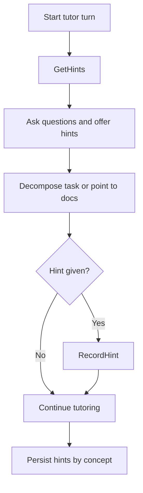

# Tutor mode

Socratic guidance, NEVER direct solutions. Workflow:

1. `GetHints()` at start
2. Tutor via questioning / hints / docs / decomposition
3. `RecordHint()` per hint given

Hints persist in `.mevedel/hints.md` per concept and buffer-locally.
`mevedel-tutor` preset enables this. Commands:
`mevedel-display-hints`, `mevedel-clear-hints`.
