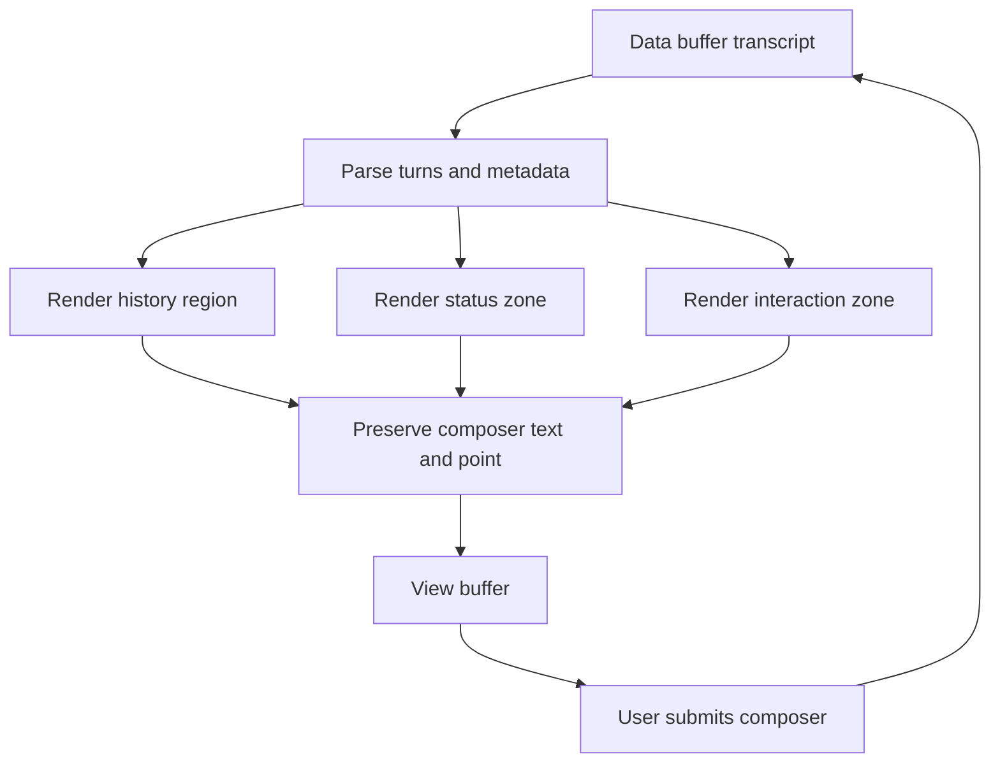

# View Buffer

The view modules render a compact user-facing projection of the authoritative
gptel data buffer. `mevedel-view.el` owns the mode, zones, composer, and
session coordination. `mevedel-view-render.el` owns transcript rendering,
folding, source mapping, and navigation. `mevedel-view-stream.el` owns
streaming, request progress, and gptel stream integration. The data buffer
remains the model-visible transcript.

## Buffer Roles

- **Data buffer**: org-mode gptel buffer. Holds `mevedel--session`,
  `mevedel--workspace`, tool results, hidden render-data blocks, and
  persisted gptel metadata.
- **View buffer**: `mevedel-view-mode`. Holds `mevedel--data-buffer`,
  compact Markdown-rendered turns, status and interaction zones, and the
  input zone.
- **Agent transcript view**: rendered read-only projection of a saved
  sub-agent transcript file. It is opened on demand for terminal agents.

The view is reconstructable from the data buffer. Avoid storing durable
conversation state only in view overlays or text properties.

## Render flow



Full rerenders parse the data buffer through
`mevedel-transcript-segments`, after skipping gptel-org leading
metadata and any leading compaction summary. `mevedel-view.el` owns the
surrounding view coordination, while `mevedel-view-render.el` owns turn
grouping and rendering. Transcript span classification, tool block
recovery, generated queued-message parsing, and mailbox, reminder,
hook-context, render-data, prompt, and ignored-range recognition live in
`mevedel-transcript.el` so persistence and compaction use the same structural
view of the buffer. Hidden audit record grammar and
attachment spans live in `mevedel-transcript-audit.el`; the view consumes
those spans without reparsing the wire format.

Before rendering a restored transcript, `mevedel-transcript-restore.el`
recovers gptel bounds and normalizes their text properties through that same
canonical transcript grammar. Restoration does not maintain a second parser.

## Zones

The view buffer is split into vertically ordered regions. The data buffer
remains the model-visible source of truth; view zones are display and
interaction chrome around that transcript.

```text
+--------------------------------------------------------------+
| Header / mode line chrome                                    |
+--------------------------------------------------------------+
| History region                                               |
|   Rendered user turns, assistant turns, tool summaries,      |
|   inline agent/tool handles, and any in-flight live tail.     |
+------------------------- status marker ----------------------+
| Status zone                                                  |
|   Task status and aggregate running/blocked agent rows.       |
+---------------------- interaction marker --------------------+
| Interaction zone                                             |
|   Permission prompts, plan approvals, RequestAccess, Ask,     |
|   queued follow-ups, and preview controls.                   |
+--------------------------------------------------------------+
| Request progress row                                         |
|   Bottom live spinner such as `Working...` or `Compacting...` |
|   while the foreground request is active.                    |
+-------------------------- input marker ----------------------+
| Input zone                                                   |
|   Read-only input prompt, then editable composer body.        |
+--------------------------------------------------------------+
```

Terminology:

- **History region**: rendered transcript above `mevedel-view--status-marker`.
  Pending tool rows like `Calling Read...` are fragment-backed live-tail
  history content, not status-zone content.
- **Status zone**: session status chrome between `mevedel-view--status-marker`
  and `mevedel-view--interaction-marker`; it is for task rows and aggregate
  agent status rows.
- **Interaction zone**: user-action chrome between
  `mevedel-view--interaction-marker` and the request progress row; it is for
  queued prompts and controls that require user response.
- **Request progress row**: the fragment-backed foreground spinner directly
  above the input prompt. It is not part of the history, status, or
  interaction zones.
- **Input zone**: the read-only prompt prefix plus the editable composer.
  **Composer** refers only to the editable unsent input body.

The interaction-zone painter renders descriptor bodies as `interaction`
fragments. Descriptor overlays may still span those fragments as callback
handles for prompt settlement and preview cleanup; they are not independent
renderers. Register controls with `mevedel-view--interaction-register`; do
not direct-insert ad hoc UI near the composer. Registering or rebuilding an
interaction must not auto-focus the prompt or move point out of the composer.
Interaction keybindings are active only when point is on the interaction text;
composer input must never settle or cycle interaction prompts.

The interaction separator is virtual chrome. Task rows, aggregate agent
status rows, interaction bodies, and request progress are view-owned UI
chrome; they do not belong to the model-visible transcript. The input
prompt starts with a read-only blank separator line so status,
interaction, and request-progress rows stay visually distinct from the
composer.

## Status Strip And Cockpit Routing

The view buffer header line is mevedel-owned chrome. It shows session
orientation on the left as `SESSION  WORKSPACE-ROOT` and operational
state on the right as `MODE · REQUEST-STATE · MODEL · TOOL-COUNT`.
The workspace root uses Emacs path abbreviation normally, truncates to
the final directory when space is tight, and disappears before the
right-side state is dropped. Clickable parts route to session cockpit
surfaces such as top, mode, model, and tools. The request state is
plain status text. The view must not copy or proxy gptel's clickable
data-buffer header line; gptel-owned header controls stay in the raw
data buffer.

The session cockpit is the normal control surface from the view. It resolves
the live view/data pair once and routes each action to the owner buffer. The
explicit `g gptel menu` cockpit row is the advanced bridge into gptel's menu
from the paired data buffer.

## Managed-zone chrome

`mevedel-view-zone.el` owns the four fixed fragment-backed regions of
view-owned chrome. Producers submit a complete desired fragment set for a
named zone. The module owns region identity, overlay lifetime, marker
choreography during mutation, uniform composer/point/window preservation,
reconciliation, stale-region recovery, collapse, and navigation. Producers
retain their domain text and actions.

A fragment is keyed by managed region identity, namespace, and id. It may
also carry priority, label/body text, keymap/help text, activation metadata,
navigation metadata, and a collapse key. Whole-zone reconciliation sorts by
descending priority and caller order. Unknown zone names and malformed
descriptors are programming errors; stale disposable UI state is rebuilt.

Fragment metadata lives in `mevedel-view-zone-*` text properties. Those
properties are valid for view navigation, activation, collapse, and targeted
refresh decisions, but they are UI cache only. Durable conversation state
continues to live in the data buffer and session structures. The zone module
owns managed region overlays. Remaining interaction overlays are opaque
callback handles for permission, plan, Ask, RequestAccess, and preview flows;
they are not parallel renderers.

`mevedel-interaction-prompt.el` owns the common lifecycle for those opaque
handles: exactly-once settlement, request-local cancellation, buffer-kill
cleanup, and standard prompt framing. Ask, RequestAccess, permission, plan,
and preview code retain their domain-specific descriptors and outcomes.

Current fragment namespaces:

- `history-live`: pending tool live-tail rows in the history region, built
  from `mevedel-view--pending-tool-calls`. They are removed and recreated
  from pending state; they must not be preserved as source-backed transcript
  text or deleted by heuristic `Calling ...` line matching.
- `status`: `tasks` and `agents` status-zone blocks. Task and aggregate-agent
  disclosure state is backed by fragment collapse state.
- `interaction`: queued user controls plus a non-navigatable `:separator`
  fragment. Ask, permission, plan, RequestAccess, preview, and queued-message
  callers continue to use the descriptor registry.
- `progress`: the foreground `request` progress row between the interaction
  zone and input prompt.

Source-backed transcript turns, tool summaries, and agent transcript handles
are intentionally outside this chrome-fragment model even when they are
clickable or collapsible. They are projections of the authoritative data
buffer and keep source-coordinate disclosure state. The incremental renderer
in `mevedel-view-render.el` (`mevedel-view--render-incremental`) remains the
correctness path for streaming
assistant text. `mevedel-view-stream.el` schedules those updates and owns the
gptel stream advice, request-progress state, and pending-tool live rows;
fragment updates should not bypass the data-buffer transcript.
Revisit source-backed transcript fragments only as a separate design after a
concrete performance or correctness problem is identified.

High-level zone markers still define layout order in `mevedel-view.el`.
Producers provide those layout positions to the zone module but do not own
managed overlays, preservation wrappers, or marker insertion choreography.

## Redraw invariants

Redraw paths must treat the composer as user-owned text. Full rerenders,
interaction rebuilds, status/task rows, spinner ticks, pending-tool live
lines, and targeted agent refreshes should preserve both composer text
and point while suppressing modification hooks for view-owned changes.

`mevedel-view-rerender` is the correctness fallback and is debounced for
bursty updates. Prefer narrower refresh paths when a stable source exists:
agent activity updates refresh source-backed handles and aggregate status
rows, then fall back to a full rerender only when the visible handle is
missing or stale.

Full rerenders rebuild the zone markers from the header, skip leading
compaction summaries, and re-anchor the in-flight assistant turn. Without
a valid in-flight anchor, the next incremental render can erase freshly
rendered history or duplicate a preserved live tail.

Temporary buffers used only to fontify or render view text must suppress
user major-mode hooks and local variables. Use
`mevedel-view--with-render-temp-buffer` rather than raw
`with-temp-buffer` plus mode activation.

Assistant response text is rendered as Markdown in the view. The data
buffer remains org-mode for gptel state, tool parsing, and persistence,
but the user-facing projection does not convert assistant Markdown to org.
When available, Markdown view text is fontified through `markdown-ts-mode`
(Emacs 31+) or `markdown-mode`; otherwise the raw Markdown text remains
visible.

Markdown rendering adds small view-only affordances:

- completed fenced code blocks are rewritten in the view projection as
  source panels: the data buffer keeps the raw Markdown fences, while
  the view strips them, inserts a clickable `LANG ⧉` label (`snippet ⧉`
  for unlabeled fences), adds panel padding/background, and copies only
  the code body;
- incomplete streaming fences stay raw until the closing fence arrives;
- local Markdown image links and bare local image paths render inline
  when Emacs can display images;
- simple Markdown pipe tables are padded so columns line up in the view;
- rendered `@file` mentions, local Markdown links, and bare local paths
  are clickable open-file buttons, including `:LINE`, `:L<line>`,
  `:#L<line>`, comma-separated line lists, and `#L<line>` targets.

Markdown tables, links, local images, paths, and fenced source-panel
projection are isolated in `mevedel-view-markdown.el`.
Audit disclosure formatting and toggling live in `mevedel-view-audit.el`;
`mevedel-view-render.el` retains the surrounding turn orchestration.

Tool-rendering caches are disposable UI caches, not just text caches.
Cache keys must include session-side state that changes visible
headers/status, and collapsed-header cache entries should omit large
bodies so expansion can recompute body content when needed.

Source-backed disclosure state is keyed from data-buffer coordinates and
stable source anchors, not view-buffer positions. Rerenders should capture
and reapply collapse state, including temporary in-flight anchors that later
settle, so expanded tool/response sections do not collapse again during
live refreshes.

Live-tail duplicate detection should compare literal lines while skipping
volatile spinner/tool/agent rows. Avoid building one large regexp from
streamed transcript text; long agent outputs can overflow Emacs regexp
limits.

### Zone mockups

Idle session with no live status or queued controls:

```text
main  ~/project/                                      ask · idle · gpt-5.5 · 20 tools

> draft starts here
```

Active request with a pending tool live-tail row and queued follow-up:

```text
main  ~/project/                                   ask · running · gpt-5.5 · 20 tools

You
Please inspect the view layout.

Assistant
I'll inspect the associated files.

Calling Read: mevedel-view.el...

-- 1 queued message pending -----------------------------------

Queued messages
  C-c C-e edit batch; C-c C-q clear
  1. Also check the docs.

Working... · 42s

> editable composer draft
```

Active tasks, agents, and an interaction prompt:

```text
main  ~/project/                                   ask · running · gpt-5.5 · 20 tools

You
Implement the change.

Assistant
I'll work on the changes.

-- tasks -------------------------------------------------------
  Main 1 open
  - Run focused tests

  Agent: verifier -- review spinner layout [running · 1 call]

-- 1 permission prompt pending --------------------------------

Allow Bash?
  npx @emacs-eask/cli test ert test/test-mevedel-view.el

Working... · 1m 08s · 1 agent running

[plan]  >
```

Busy session showing every view-owned zone at once:

```text
main  ~/project/                                   ask · running · gpt-5.5 · 20 tools

You
Update the view docs and verify the spinner layout.

Assistant
I'll update the docs, run the focused checks, and ask before any risky action.

Calling Read: docs/view.md...
Calling Grep: status zone...

-- tasks -------------------------------------------------------
  Main 2 open
  - Update docs with zone mockups
  - Run focused validation

  Agent: explorer -- audit zone terminology [running · 3 calls]
  Agent: verifier -- check spinner ordering [blocked · waiting]

-- 1 question · 1 permission · 2 queued messages pending ------

Ask
  Which validation should run next?
  [focused view tests] [compile] [full suite]

Permission request from verifier--a1b2c3
Allow Bash?
  npx @emacs-eask/cli test ert test/test-mevedel-view.el

Queued messages
  C-c C-e edit batch; C-c C-q clear
  1. Also include a full mockup with agents and permissions.
  2. Keep the request spinner pinned above the composer.

Working... · 2m 14s · 1 agent blocked · 1 agent running

[edits] > I am drafting a follow-up while the request runs.
```

## Input History

`mevedel-view-history.el` provides comint-style input history for the
view input zone:

- `M-p` / `M-n`: previous / next input
- `M-r`: search history
- `C-c C-l`: browse history
- `C-c C-u`: clear current input
- `C-a`: beginning of input line
- `Shift-TAB` / `<backtab>`: cycle the session permission mode

History persists at the workspace level as
`<workspace-root>/.mevedel/input-history.el`, so new and resumed
sessions in the same project share prompt recall. Read-only or
non-persistent sessions keep history in memory only. Rewind keeps the
current buffer-local ring.

The input zone installs slash command completion, `$` skill completion,
and display-only skill argument hints. Root slash completion offers local
commands; root `$` completion offers user-invocable skills. Both insert a
real space after a completed root name. Command argument completion is
available for commands with useful candidate sets, such as `/mode` and
`/model`. Skill hints are rendered
as a zero-width overlay near point from `argument-hint` or remaining
`arguments` names. They are not buffer text and are never sent to the
model.

Text inserted as a user turn must be plain transcript text. User send,
queued-drain, and synthetic user-role insertion paths strip copied view,
tool, read-only, and `gptel` text properties, then restore only internal
render-data blocks as `'gptel 'ignore`; UI properties copied from the view
must not become model-visible transcript state.

## File Drag/Drop And Clipboard Images

Interactive view buffers install a buffer-local DND handler for local
`file:` URIs. Dropping regular files inserts visible `@file` mentions in
the composer; paths with whitespace or other token-breaking characters use
the braced `@file:{...}` form. Directory drops are ignored.

`C-y` in the composer first tries to save a clipboard image, using the
first available platform clipboard command, into
`<workspace-root>/.mevedel/media/clipboard-YYYYmmdd-HHMMSS.png`. When an
image is saved, the view inserts it as an `@file` mention instead of
yanking text. If no clipboard image is available, normal `yank` behavior
is used.

Each dropped file also records a pending exact-file grant on the session.
If the next send still contains an `@file` mention for that same expanded
path, the grant becomes an in-memory session-scoped `Read` grant for that
exact path. The grant does not create a directory rule, does not apply to
write tools, and is not persisted with the session. Clipboard image paste
uses the same pending-grant path.

## Queued Follow-Ups

Plain user input submitted while a request is active is queued on the
session as a transient FIFO and shown in the interaction zone.
`UserPromptSubmit` runs when the prompt is queued; accepted entries store
their prepared model input, display text, hook context, and history
input. Slash commands are not queued; they continue to be rejected until
the active request finishes.

At the next `WAIT` boundary before an HTTP request is sent, all prepared
queued prompts drain as one explicit user-role batch block in FIFO order.
The same batch block is written to the data buffer transcript so the
view/audit log matches the request payload. Direct `WAIT` injection is
rendered live as generated user messages; the system-reminder and
queued-message XML wrappers are display/control wrappers, not prose the
user typed. If no `WAIT` boundary occurs before the active turn reaches
successful `DONE`, the zero-delay post-`DONE` drain sends the queued batch
as the next normal user turn. Aborted and errored turns leave queued prompts
pending for review.

Queued entries that contain `@` mentions, including dropped-file grants,
skip the direct `WAIT` injection path. They drain after the active turn as
a normal send so gptel prompt transforms can expand mentions and attach
media consistently.

Editing queued prompts removes the whole uncommitted batch from the FIFO
and restores a combined draft to the composer, so it cannot be
auto-submitted while being edited.

## Agent Transcript Views

Agent handles and attribution fragments are clickable when a transcript
entry is available. Running agents show status/activity in the main view
and may open a rendered read-only transcript view over the live agent
buffer while that buffer is available. Terminal agents open a rendered
read-only transcript view from the saved transcript file through
`mevedel-view-open-agent-transcript`.

`mevedel-transcript-restore.el` restores only the gptel bounds/properties
needed for rendering and normalizes them through `mevedel-transcript.el`'s
canonical grammar. Transcript views do not restore backend/tool objects or
become live agent buffers themselves.

When `SubagentStart` injects hook context, the parent transcript renders a
compact audit note on the Agent tool row, and the child transcript renders
the full hook-context disclosure on the child's initial prompt.

## Hook Audit Display

Model-visible `<hook-context>` blocks are stripped out of the rendered
user message body so injected policy/context does not look like text the
user typed. When such context is present, the view shows a compact
disclosure:

```text
  ◇ hook context added
```

Expanding it shows the contributing hook event names and injected context.
When multiple hooks contribute context to the same prompt, the view renders
one combined disclosure for that prompt, preserving contribution order in
the expanded details.  This keeps successful context injection quiet by
default while still making it auditable in the transcript view.

The renderer builds hook audit surfaces from hook audit records.  For
context injection, it reads ordered `<hook-event name="...">` entries
inside a `<hook-context>` block; new persisted hook context does not need
a plain-body fallback.

Tool input repair reuses the same hidden audit side channel. A committed
repair appears on the affected tool row as `◇ tool input repaired`; a
tentative repair discarded because final validation failed appears as
`◇ tool input repair abandoned`. Expanding either disclosure shows only the
repair rule ID, argument-schema path, and before/after shape. Supplied and
repaired values never enter this metadata. Malformed records render the safe
`tool input repair audit unavailable` fallback without changing the tool
result. Async audit redraw follows the normal view invariant: composer text
and point, including multiline drafts beginning with `>`, are preserved.

Prompt rewrites from `:updated-input` use a separate compact disclosure
attached to the submitted user turn:

```text
  ◇ hook changed prompt
```

Expanding it shows the hook event, any hook-provided message or reason,
and the original and submitted prompt text:

```text
  ◇ hook changed prompt
    UserPromptSubmit
    reason: normalized review request

    Original prompt
    review plz

    Submitted prompt
    Please review this file.
```

The first implementation does not need inline diff review UI.

Tool calls blocked by `PreToolUse` or `PermissionRequest` stay visible as
normal tool attempts, with a short second line showing which hook blocked
the call and the hook-provided reason.  Forced `ask` decisions are also
shown on the affected tool attempt.  `allow` decisions are not rendered
unless they suppress a permission prompt that would otherwise have been
shown.  A `PreToolUse :updated-input` rewrite is shown on the same tool
row as `◇ hook changed tool input`; expanding it shows the event,
supporting message/reason, and original versus updated tool args.

`PostToolUse` and `PostToolUseFailure` context is rendered on the affected
tool result row, not the next user turn, because the hook modifies the
model-visible tool feedback.  A post-tool `:updated-result` rewrite is
shown on the affected tool row as `◇ hook changed tool result`; expanding
it shows original and updated model-visible result text.
