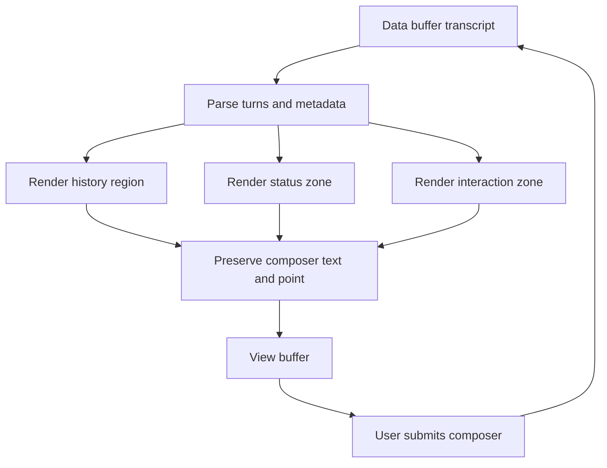

# View Buffer

The view modules render a compact user-facing projection of the authoritative
gptel data buffer. `mevedel-view.el` owns the mode, zones, and session
coordination. `mevedel-view-composer.el` owns the editable composer,
submission hooks, pending input, and send/fork dispatch.
`mevedel-view-agent.el` owns agent transcript inspection, live agent status,
and targeted handle refresh. `mevedel-view-interaction.el` owns interaction
descriptor registration, ordering, callback overlays, and redraw.
`mevedel-view-render.el` owns transcript rendering, folding, source mapping,
and navigation. `mevedel-view-stream.el` owns streaming, request progress,
and gptel stream integration. The data buffer remains the model-visible
transcript.

## Buffer Roles

- **Data buffer**: org-mode gptel buffer. Holds `mevedel--session`,
  `mevedel--workspace`, tool results, hidden render-data blocks, and
  persisted gptel metadata.
- **View buffer**: `mevedel-view-mode`. Holds `mevedel--data-buffer`,
  compact Markdown-rendered turns, status and interaction zones, and the
  input zone.
- **Agent transcript view**: rendered read-only projection of a sub-agent
  transcript. Running agents use the live agent buffer; terminal agents use
  the saved transcript file.

An open running-agent transcript view follows the main view's update cadence:
streamed text uses `mevedel-view-stream-render-delay`, tool boundaries use
`mevedel-view-tool-boundary-render-delay`, and terminal settlement renders
immediately. It shows the same transient pending-tool rows as the main view,
but not the main foreground-request spinner; the transcript header already
shows that the agent is running. Live updates keep the window at the bottom
only when it was already there. If the reader has scrolled upward, rendering
preserves point and window start until they return to the bottom.

Agent transcript views reuse the main view's transcript renderer, incremental
rendering, and stream scheduling. The agent-specific layer only fans live
agent events out to open transcript views and applies their read-only chrome;
it does not maintain a parallel rendering implementation. The live agent data
buffer keeps its existing parent-view binding, so opening an inspection view
does not redirect parent status and interaction UI.

Agent transcript views are observation-only. Permission, Ask,
plan, and other actionable interactions remain exclusively in the parent
view. A transcript header may report that an agent is blocked, but the
transcript view never duplicates interaction controls or owns their callbacks.

Each parent view owns at most one agent transcript side window. Opening a
different agent transcript replaces the current inspection view; live refresh
does not add multi-view window management.

If the observed agent settles while its transcript view is open, the view
renders the final content immediately and updates its header in place. It
keeps the live data buffer rather than swapping source buffers mid-display.
Closing the inspection view preserves data buffers owned by retained agent
records so a later `FollowupAgent` can continue them; parent-session teardown
kills every retained conversation buffer from the session registry, whether
or not it has an open inspection view. Reopening resolves the saved transcript
normally.

The live transcript header updates on the same stream and tool events as the
body. It reflects running or blocked state, tool-call count, and elapsed time.
Elapsed time has no independent ticking timer; it advances when another live
event refreshes the view. Terminal status updates immediately.

Live transcript rendering is an observer side effect and cannot alter agent
execution or the parent view. If a refresh fails, the last good projection
remains visible, mevedel emits a warning, and a later event or terminal
settlement may retry.

Opening a transcript performs the existing full render. Subsequent live
events use the main incremental renderer, except that retained-agent metadata
replacements fully rerender because delete-and-insert invalidates their source
endpoints. Missing or stale source anchors use the same full-rerender
correctness path rather than introducing a second recovery strategy.

Opening a view while a tool is already in flight does not reconstruct a
transient pending-tool row from activity history. The full render shows the
authoritative live transcript as it stands; subsequent tool events populate
pending rows normally, and terminal settlement renders the final state.

Live updates preserve the main view's source-backed disclosure state. An
incremental update or full-rerender fallback must not collapse response,
reasoning, tool, or audit sections that the reader expanded.
Rendered source ranges use data-buffer markers so a length-changing update to
one tool's hidden render data cannot retarget an adjacent tool disclosure.

Agent transcript views open only through explicit user action on an agent
handle or status surface. Agent start, progress, and blocked events never
create or focus an inspection window automatically.

The view is reconstructable from the data buffer. Avoid storing durable
conversation state only in view overlays or text properties.

Directive activity uses a separate read-only projection with its own multiline
composer. It renders durable implementation attempts and discussion turns from
the workspace directive record; discussion never enters the main chat history.
Refreshing activity replaces only the managed projection above the composer,
preserving the draft and point exactly, including drafts whose first editable
character is `>`. A discussion result can target one selected attempt, and
`Implement this` submits the directive with the complete local discussion as
additional implementation context.

The same composer switches to Request changes after a successful attempt and
Retry after a failed or aborted attempt. Request changes requires multiline
feedback unless newly added subdirectives already supply it; Retry guidance is
optional. The resulting implementation prompt uses fresh directive context and
only the immediately preceding attempt. Older attempts remain visible but do
not enter the request automatically.

## Render flow


```mermaid
flowchart TD
    A[Data buffer transcript] --> B[Parse turns and metadata]
    B --> C[Render history region]
    B --> D[Render status zone]
    B --> E[Render interaction zone]
    C --> F[Preserve composer text and point]
    D --> F
    E --> F
    F --> G[View buffer]
    G --> H[User submits composer]
    H --> A
```

Full rerenders parse the data buffer through
`mevedel-transcript-segments`, after skipping gptel-org leading
metadata and any leading compaction summary. `mevedel-view.el` owns the
surrounding view coordination, while `mevedel-view-render.el` owns turn
grouping and rendering. Transcript span classification, tool block recovery,
and mailbox, reminder, hook-context, render-data, prompt, and ignored-range recognition live in
`mevedel-transcript.el` so persistence and compaction use the same structural
view of the buffer. Hidden audit record grammar and
attachment spans live in `mevedel-transcript-audit.el`; the view consumes
those spans without reparsing the wire format.

Streaming chunks, tool boundaries, and explicit rerender requests share one
buffer-local render scheduler.  Requests in the same pending window collapse
into one refresh; a full request upgrades an incremental request instead of
starting a second timer.  Status and interaction zones remain independent of
transcript parsing.  Reconciliation leaves an unchanged managed fragment in
place, and spinner animation changes its frame display property without
rewriting the textual progress row until elapsed or agent metadata changes.

Before rendering a restored transcript, `mevedel-transcript-restore.el`
recovers gptel bounds and normalizes their text properties through that same
canonical transcript grammar. Restoration does not maintain a second parser.

Inner transcript disclosures use a two-space left inset for their headers and
a four-space left inset for expanded bodies. This includes mailbox, tool,
reasoning, prompt, system-reminder, hook-audit, hook-context, and
completed-agent disclosures. Nested audit details and mailbox payload gutters
may indent further to express their hierarchy. Ordinary response prose and
whole-turn headers or folds remain flush-left. Body insets are display-only,
including on wrapped continuation lines, so copied disclosure content retains
its authoritative text without presentation padding.
Non-empty agent-message and agent-result mailbox bodies start collapsed by
default; `mevedel-view-mailbox-collapse-line-threshold` can raise that
threshold.

## Zones

The view buffer is split into vertically ordered regions. The data buffer
remains the model-visible source of truth; view zones are display and
interaction chrome around that transcript.

```text
+--------------------------------------------------------------+
| Header / mode line chrome                                    |
+--------------------------------------------------------------+
| History region                                               |
|   Rendered user turns, assistant turns, tool summaries,      |
|   inline agent/tool handles, and any in-flight live tail.     |
+------------------------- status marker ----------------------+
| Status zone                                                  |
|   Active child confinement, tasks, and aggregate agent rows.  |
+---------------------- interaction marker --------------------+
| Interaction zone                                             |
|   Permission prompts, plan approvals, Ask,                    |
|   pending input, approvals, and preview controls.            |
+--------------------------------------------------------------+
| Request progress row                                         |
|   Bottom live spinner such as `Working...` or `Compacting...` |
|   while the foreground request is active.                    |
+-------------------------- input marker ----------------------+
| Input zone                                                   |
|   Read-only input prompt, then editable composer body.        |
+--------------------------------------------------------------+
```

Terminology:

- **History region**: rendered transcript above `mevedel-view--status-marker`.
  Pending tool rows like `Calling Read...` are fragment-backed live-tail
  history content, not status-zone content.
- **Status zone**: session status chrome between `mevedel-view--status-marker`
  and `mevedel-view--interaction-marker`. Task, live-execution, and
  aggregate-agent rows appear here.
- **Interaction zone**: user-action chrome between
  `mevedel-view--interaction-marker` and the request progress row; it is for
  pending input and controls that require user response.
- **Request progress row**: the fragment-backed foreground spinner directly
  above the input prompt. It is not part of the history, status, or
  interaction zones. Its elapsed value measures active request work, excluding
  time spent awaiting an Ask answer, permission decision, Plan approval,
  Write/Edit preview decision, or direct request input. During those waits it
  reads `Waiting for input` while its spinner frame keeps animating. Queued
  Pending Inputs and an armed session fork do not pause active elapsed time.
- **Input zone**: the read-only prompt prefix plus the editable composer.
  **Composer** refers only to the editable unsent input body.

The interaction-zone painter in `mevedel-view-interaction.el` renders
descriptor bodies as `interaction` fragments. Descriptor overlays may still
span those fragments as callback handles for prompt settlement and preview
cleanup; they are not independent renderers. Register controls with
`mevedel-view--interaction-register`; do not direct-insert ad hoc UI near the
composer. Registering or rebuilding an interaction must not auto-focus the
prompt or move point out of the composer.
Interaction keybindings are active only when point is on the interaction text;
composer input must never settle or cycle interaction prompts.

The interaction separator is virtual chrome. Task rows, aggregate agent
status rows, interaction bodies, and request progress are view-owned UI
chrome; they do not belong to the model-visible transcript. The input
prompt starts with a read-only blank separator line so status,
interaction, and request-progress rows stay visually distinct from the
composer.

## Directive Activity

`mevedel-open-directive-activity` opens a workspace-owned directive outside
the main chat. The ephemeral buffer renders the current request, lifecycle
state (`Ready`, `Discussed`, `Implementing`, `Implemented`, `Failed`, or
`Aborted`), anchor state,
and chronological immutable attempts through the managed
`directive-activity` view zone. Refreshing the buffer reads the shared
workspace record directly and never adds content to a transcript or model
request. `mevedel-list-directives` provides workspace-level selection, and an
Attached anchor can be visited from the activity view with `o` or `RET`.
Each attempt exposes its exact request and answer/error, capture completeness,
covered-file and gap counts, and session/turn checkpoint. Pressing `RET` on an
attempt with changes projects its owned patch into the reusable patch viewer;
the viewer never becomes patch history. On any effectful attempt, `R` previews
and confirms Rewind to immediately before that attempt. It restores the complete
later session suffix through the attempt's session/turn checkpoint; it does not
reverse-apply the displayed patch or create redo history.

The main chat renders a settled directive as one compact event linking the
directive id, outcome, and turn. Its full request, response, and patch remain
outside chat context in the workspace attempt record.

## Status Strip And Cockpit Routing

The view buffer header line is mevedel-owned chrome. It shows session
orientation on the left as `SESSION  WORKSPACE-ROOT` and operational
state on the right as `MODE · REQUEST-STATE · MODEL · TOOL-COUNT`.
The workspace root uses Emacs path abbreviation normally, truncates to
the final directory when space is tight, and disappears before the
right-side state is dropped. Clickable parts route to session cockpit
surfaces such as top, mode, model, and tools. The request state is
plain status text. The view must not copy or proxy gptel's clickable
data-buffer header line; gptel-owned header controls stay in the raw
data buffer. Header construction is cached by its semantic fields and display
width, so spinner redisplay reuses the same propertized strip until one of
those inputs changes.

The session cockpit is the normal control surface from the view. It resolves
the live view/data pair once and routes each action to the owner buffer. The
explicit `g gptel menu` cockpit row is the advanced bridge into gptel's menu
from the paired data buffer.

Its Navigate group keeps inspection and mutation distinct:

- `[` / `]` project the previous or next persisted session segment in the same
  view.
- `g` opens the segment picker, including missing or unreadable archived
  segments.
- `n` / `N` move through rendered displays without changing session state.
- `C-n` / `C-p` move through user queries without changing session state.
- `f` / `F` arm a Conversation Fork or Worktree Fork at the settled assistant
  response under point.
- `R` confirms a true in-place Rewind to that response.
- `B` switches conversation variants at that response.

An archived segment is a read-only projection, not a second live session.
Its banner shows the segment number and a clickable `[Latest]` action. The
live composer draft is hidden and preserved. Live requests continue updating
status, interactions, and progress, but transcript redraws do not replace the
archived projection. Send, follow-up, Compact, Review, Verify, and slash
commands require returning to the latest segment. Fork and Rewind still target
the settled assistant response at point; arming a Fork temporarily reveals the
composer, while cancelling hides it and stays on the archived segment.

Arming a Fork adds a temporary interaction row naming the selected assistant
turn and Fork type. It focuses the existing composer, and cancellation removes
only the row while preserving the draft. The next accepted child prompt
publishes a new session. Conversation Fork discloses that current files may be
newer than its conversation and remain shared; Worktree Fork discloses its
linked worktree and best-effort historical-file restoration. These disclosures
are model-visible transcript records. Folding changes only their presentation.

At a shared fork point, the assistant header renders a variant button in both
expanded and folded states. One alternative opens directly; several open a
Source-first chooser with identity, working-directory, sharing, branch,
recovery, and latest-prompt context. Switching uses ordinary session restore,
rerenders source-backed history, and positions the target at the exact stable
fork point. Each view retains its own composer draft and working directory.

While managed Bash work is live, the status zone shows its session-wide count
as an `Executions` fragment. Activating it opens the execution cockpit. The
main cockpit exposes the same surface as `Processes`, and `/ps` opens it
directly. Execution start and settlement reconcile this fragment through the
normal managed-zone path, preserving composer text, point, and windows.

## Managed-zone chrome

`mevedel-view-zone.el` owns the four fixed fragment-backed regions of
view-owned chrome. Producers submit a complete desired fragment set for a
named zone. The module owns region identity, overlay lifetime, marker
choreography during mutation, uniform composer/point/window preservation,
reconciliation, stale-region recovery, collapse, and navigation. Producers
retain their domain text and actions.

A fragment is keyed by managed region identity, namespace, and id. It may
also carry priority, label/body text, keymap/help text, activation metadata,
navigation metadata, and a collapse key. Whole-zone reconciliation sorts by
descending priority and caller order. Unknown zone names and malformed
descriptors are programming errors; stale disposable UI state is rebuilt.

Fragment metadata lives in `mevedel-view-zone-*` text properties. Those
properties are valid for view navigation, activation, collapse, and targeted
refresh decisions, but they are UI cache only. Durable conversation state
continues to live in the data buffer and session structures. The zone module
owns managed region overlays. Remaining interaction overlays are opaque
callback handles for permission, plan, Ask, and preview flows;
they are not parallel renderers.

`mevedel-interaction-prompt.el` owns the common lifecycle for those opaque
handles: exactly-once settlement, request-local cancellation, buffer-kill
cleanup, and standard prompt framing. Ask, permission, plan,
and preview code retain their domain-specific descriptors and outcomes.

Current fragment namespaces:

- `history-live`: pending tool live-tail rows in the history region, built
  from `mevedel-view--pending-tool-calls`. They are removed and recreated
  from pending state; they must not be preserved as source-backed transcript
  text or deleted by heuristic `Calling ...` line matching.
- `status`: `tasks`, live `executions`, and `agents` status-zone blocks.
  Task and aggregate-agent disclosure state is backed by fragment collapse
  state.
- `interaction`: pending-input summaries and user controls plus a
  non-navigatable `:separator` fragment. Ask, permission, plan, preview, and
  pending-input
  callers continue to use the descriptor registry.
- `progress`: the foreground `request` progress row between the interaction
  zone and input prompt.

Source-backed transcript turns, tool summaries, request-failure disclosures,
and agent transcript handles are intentionally outside this chrome-fragment
model even when they are clickable or collapsible. They are projections of
the authoritative data buffer and keep source-coordinate disclosure state.
Provider failures are expanded by default and preserve the complete provider
message for manual retry. The incremental renderer
in `mevedel-view-render.el` (`mevedel-view--render-incremental`) remains the
correctness path for streaming
assistant text. `mevedel-view-stream.el` schedules those updates and owns the
gptel stream advice, request-progress state, and pending-tool live rows;
fragment updates should not bypass the data-buffer transcript.
Revisit source-backed transcript fragments only as a separate design after a
concrete performance or correctness problem is identified.

When an owning tool or agent turn used materially non-default child access,
its source-backed row includes a durable `! Sandbox:` line directly below the
normal header in collapsed, expanded, and compact-event forms. Additional
writes, network access, unrestricted or unavailable confinement, host `/proc`,
refusals, and no-start outcomes use short plain-language descriptions.
Default Bubblewrap/workspace-write/isolated/fresh-proc execution and additional
read-only mounts remain silent. The line is reconstructed from hidden
transcript render-data rather than view-only state.

High-level zone markers still define layout order in `mevedel-view.el`.
`mevedel-view-interaction.el` turns the interaction marker into managed
fragments; producers do not own managed overlays, preservation wrappers, or
marker insertion choreography.

## Redraw invariants

Redraw paths must treat the composer as user-owned text. Full rerenders,
interaction rebuilds, status/task rows, spinner ticks, pending-tool live
lines, and targeted agent refreshes should preserve both composer text
and point while suppressing modification hooks for view-owned changes.

`mevedel-view-rerender` is the correctness fallback and is debounced for
bursty updates. Prefer narrower refresh paths when a stable source exists:
retained-agent metadata replacements use a full rerender, while activity-only
status rows can refresh narrowly. Managed Bash progress and terminal events
identify their row by durable tool-use ID and replace only that row. If the row
is not visible yet, the stream scheduler coalesces one incremental recovery
render.

Full rerenders rebuild the zone markers from the header, skip leading
compaction summaries, and re-anchor the in-flight assistant turn. Without
a valid in-flight anchor, the next incremental render can erase freshly
rendered history or duplicate a preserved live tail.

Temporary buffers used only to fontify or render view text must suppress
user major-mode hooks and local variables. Use
`mevedel-view--with-render-temp-buffer` rather than raw
`with-temp-buffer` plus mode activation.

Assistant response text is rendered as Markdown in the view. The data
buffer remains org-mode for gptel state, tool parsing, and persistence,
but the user-facing projection does not convert assistant Markdown to org.
When available, Markdown view text is fontified through `markdown-ts-mode`
(Emacs 31+) or `markdown-mode`; otherwise the raw Markdown text remains
visible.

Markdown rendering adds small view-only affordances:

- completed fenced code blocks are rewritten in the view projection as
  source panels: the data buffer keeps the raw Markdown fences, while
  the view strips them, inserts a clickable `LANG ⧉` label (`snippet ⧉`
  for unlabeled fences), adds vertical panel padding/background, and copies
  only the code body. A source panel adds no left inset of its own and
  inherits any inset from its containing disclosure;
- incomplete streaming fences stay raw until the closing fence arrives;
- local Markdown image links and bare local image paths render inline
  when Emacs can display images;
- simple Markdown pipe tables are padded so columns line up in the view;
- rendered `@file` mentions, local Markdown links, and bare local paths
  are clickable open-file buttons, including `:LINE`, `:L<line>`,
  `:#L<line>`, comma-separated line lists, and `#L<line>` targets.

Markdown tables, links, local images, paths, and fenced source-panel
projection are isolated in `mevedel-view-markdown.el`.
Audit disclosure formatting and toggling live in `mevedel-view-audit.el`;
`mevedel-view-render.el` retains the surrounding turn orchestration.

Tool-rendering caches are disposable UI caches, not just text caches.
Cache keys must include session-side state that changes visible
headers/status, and collapsed-header cache entries should omit large
bodies so expansion can recompute body content when needed.

Source-backed disclosure state is keyed from data-buffer coordinates and
stable source anchors, not view-buffer positions. Rerenders should capture
and reapply collapse state, including temporary in-flight anchors that later
settle, so expanded tool/response sections do not collapse again during
live refreshes.

Live-tail duplicate detection should compare literal lines while skipping
volatile spinner/tool/agent rows. Avoid building one large regexp from
streamed transcript text; long agent outputs can overflow Emacs regexp
limits.

### Zone mockups

Idle session with no live status or queued controls:

```text
main  ~/project/                                      ask · idle · gpt-5.5 · 20 tools

> draft starts here
```

Active request with a pending tool live-tail row and pending input:

```text
main  ~/project/                                   ask · running · gpt-5.5 · 20 tools

You
Please inspect the view layout.

Assistant
I'll inspect the associated files.

Calling Read: mevedel-view.el...

-- 1 pending input --------------------------------------------

Follow-ups
  1. Also check the docs.
  RET or C-c C-e manage pending inputs

Working... · 42s

> editable composer draft
```

Active tasks, agents, and an interaction prompt:

```text
main  ~/project/                                   ask · running · gpt-5.5 · 20 tools

You
Implement the change.

Assistant
I'll work on the changes.

-- tasks -------------------------------------------------------
  Main 1 open
  - Run focused tests

  Agent: verifier -- review spinner layout [running · 1 call]

-- 1 permission prompt pending --------------------------------

Allow Bash?
  npx @emacs-eask/cli test ert test/test-mevedel-view.el

Waiting for input · 1m 08s · 1 agent running

[plan]  >
```

Busy session showing every view-owned zone at once:

```text
main  ~/project/                                   ask · running · gpt-5.5 · 20 tools

You
Update the view docs and verify the spinner layout.

Assistant
I'll update the docs, run the focused checks, and ask before any risky action.

Calling Read: docs/view.md...
Calling Grep: status zone...

-- tasks -------------------------------------------------------
  Main 2 open
  - Update docs with zone mockups
  - Run focused validation

  Agent: explorer -- audit zone terminology [running · 3 calls]
  Agent: verifier -- check spinner ordering [blocked · waiting]

-- 1 question · 1 permission · 2 pending inputs ---------------

Ask
  Which validation should run next?
  [focused view tests] [compile] [full suite]

Permission request from /root/verifier
Allow Bash?
  npx @emacs-eask/cli test ert test/test-mevedel-view.el

Steering
  1. Keep the request spinner pinned above the composer.
Follow-ups
  1. Also include a full mockup with agents and permissions.
  RET or C-c C-e manage pending inputs

Waiting for input · 2m 14s · 1 agent blocked · 1 agent running

[auto] > I am drafting a follow-up while the request runs.
```

## Input History

`mevedel-view-history.el` provides comint-style input history for the
view input zone. `mevedel-view-composer.el` owns the editable input boundary,
completion, prompt submission, and integration with that history ring:

- `C-c RET`: send while idle, or enqueue same-turn steering for the active
  ordinary root turn
- `C-c TAB`: send while idle, or enqueue a separate queued follow-up while the
  session is occupied
- `C-y`: yank text or insert a clipboard image
- `C-c C-e`: open the Pending Inputs cockpit
- `C-c C-q`: confirm and clear all pending input
- `M-p` / `M-n`: previous / next input
- `M-r`: search history
- `C-c C-l`: browse history
- `C-c C-u`: clear current input
- `C-a`: beginning of input line
- `Shift-TAB` / `<backtab>`: cycle `ask`, `edits`, and `full-auto`
- `C-<tab>` in the composer: toggle Plan without changing the permission mode

These bindings apply only while point is in the editable composer.
History persists at the workspace level as
`<workspace-root>/.mevedel/input-history.el`, so new and resumed
sessions in the same project share prompt recall. When persistence is not
writable, the active ring remains available in memory. Rewind keeps the current
workspace ring and composer draft. The Lisp sidecar is printed with circle
syntax enabled so shared text-property objects remain readable.

The input zone installs slash command completion, `$` skill completion,
and display-only skill argument hints. Root slash completion offers local
commands; root `$` completion offers user-invocable skills. Both insert a
real space after a completed root name. Command argument completion is
available for commands with useful candidate sets, such as `/mode` and
`/model`. Skill hints are rendered
as a zero-width overlay near point from `argument-hint` or remaining
`arguments` names. They are not buffer text and are never sent to the
model.

Text inserted as a user turn must be plain transcript text. User send and
queued-drain paths strip copied view,
tool, read-only, and `gptel` text properties, then restore only internal
render-data blocks as `'gptel 'ignore`; UI properties copied from the view
must not become model-visible transcript state.

## File Drag/Drop And Clipboard Images

Interactive view buffers install a buffer-local DND handler for local
`file:` URIs. Dropping regular files inserts visible `@file` mentions in
the composer; paths with whitespace or other token-breaking characters use
the braced `@file:{...}` form. Directory drops are ignored.

`C-y` in the composer first tries to save a clipboard image, using the
first available platform clipboard command, into
`<workspace-root>/.mevedel/media/clipboard-YYYYmmdd-HHMMSS.png`. When an
image is saved, the view inserts it as an `@file` mention instead of
yanking text. If no clipboard image is available, normal `yank` behavior
is used.

Each dropped file also records a pending exact-file grant on the session.
If the next send still contains an `@file` mention for that same expanded
path, the grant becomes an in-memory session-scoped `Read` grant for that
exact path. The grant does not create a directory rule, does not apply to
write tools, and is not persisted with the session. Clipboard image paste
uses the same pending-grant path.

## Pending Input

Pending input is session-owned and has two independent FIFO categories.
`C-c RET` during an ordinary active root turn accepts same-turn steering:
preparation and `UserPromptSubmit` run immediately, then all steering already
present at the next model interaction boundary is inserted as durable user
transcript messages without creating extra turns. Steering submitted during
that injection waits for the following boundary. It never aborts the request.
Root `WaitAgent` uses the same steering path and wakes the wait at the next
possible boundary rather than creating a mailbox message.

`C-c TAB` while the session is occupied accepts a queued follow-up. Each
follow-up later starts one normal user turn. Steering always has delivery
priority over follow-ups regardless of submission order; FIFO applies within
each category. While idle, both send keys perform an ordinary immediate send.
Slash commands cannot become pending input.

The interaction zone shows compact per-category previews. `RET` on that
summary or `C-c C-e` opens the Pending Inputs cockpit and pauses automatic
delivery. The cockpit edits one entry in the composer without losing an
existing draft, reorders entries within their category, converts entries
between steering and follow-up, marks and deletes selected entries, and clears
all pending input with `C-c C-q`. Saving an edit updates the entry in place;
cancelling restores the prior draft. Closing the cockpit resumes eligible
delivery.

Permission, Ask, Plan, and other user-input overlays do not disable either
queue. An unresolved interaction merely postpones steering injection and
follow-up dispatch. If a turn fails with undelivered steering, those entries
remain steering, become `Needs review`, and pause all automatic pending-input
delivery. The user must edit, delete, or recategorize the failed entries, then
resume delivery from the cockpit. Later follow-ups remain intact.

Entries retain atomically bound mention text and dropped-file grants.
Follow-ups run skill planning, mention expansion, and `UserPromptSubmit` only
when their own turn dispatches; an already prepared steering entry is not
prepared twice. Accepted input is added to ordinary workspace input history.

## Agent Transcript Views

`mevedel-view-agent.el` owns transcript lookup and inspection views, live
rows and badges, and status/handle refresh. Transcript turn rendering remains
in `mevedel-view-render.el`.

Agent activity rows are projections of canonical tool and lifecycle events:
`Started PATH`, `Interacted with PATH`, `Message sent to PATH`, `Interrupted
PATH`, and `Waiting for agents`. Settled waits render `Waited for agents
(OUTCOME)`; consecutive wait rows retain only the final outcome and show the
combined count. The view does not infer a second activity state from internal
storage identities or runtime tables.

Agent handles use `TAB` to expand or collapse their details.  `RET` on the
visible agent path, or a mouse click, opens the transcript.  Agent handles
and activity-row paths are clickable when a transcript entry is available.
`Interacted with PATH` and `Message sent to PATH` start collapsed and expand
to the exact follow-up or sent message.
Running agents show status/activity in the main view
and may open a rendered read-only transcript view over the live agent
buffer while that buffer is available. Terminal agents open a rendered
read-only transcript view from the saved transcript file through
`mevedel-view-open-agent-transcript`.

`mevedel-transcript-restore.el` restores only the gptel bounds/properties
needed for rendering and normalizes them through `mevedel-transcript.el`'s
canonical grammar. Transcript views do not restore backend/tool objects or
become live agent buffers themselves.

When `SubagentStart` injects hook context, the parent transcript renders a
compact audit note on the Agent tool row, and the child transcript renders
the full hook-context disclosure on the child's initial prompt.

## Hook Audit Display

Model-visible `<hook-context>` blocks are stripped out of the rendered
user message body so injected policy/context does not look like text the
user typed. When such context is present, the view shows a compact
disclosure:

```text
  ◇ hook context added
```

Expanding it shows the contributing hook event names and injected context.
When multiple hooks contribute context to the same prompt, the view renders
one combined disclosure for that prompt, preserving contribution order in
the expanded details.  This keeps successful context injection quiet by
default while still making it auditable in the transcript view.

If `UserPromptSubmit` blocks a root input, its context stays pending without a
visible user turn and joins the next accepted root input once. Context from
`SessionStart(clear)` behaves the same way. Automatic root compaction adds
`SessionStart(compact)` context to the already-rendered pending turn and the
rerendered transcript exposes it through the same disclosure; it does not run
the prompt hook again.

The renderer builds hook audit surfaces from hook audit records.  For
context injection, it reads ordered `<hook-event name="...">` entries
inside a `<hook-context>` block; new persisted hook context does not need
a plain-body fallback.

Tool input repair reuses the same hidden audit side channel. A committed
repair appears on the affected tool row as `◇ tool input repaired`; a
tentative repair discarded because final validation failed appears as
`◇ tool input repair abandoned`. Expanding either disclosure shows only the
repair rule ID, argument-schema path, and before/after shape. Supplied and
repaired values never enter this metadata. Malformed records render the safe
`tool input repair audit unavailable` fallback without changing the tool
result. Async audit redraw follows the normal view invariant: composer text
and point, including multiline drafts beginning with `>`, are preserved.

Prompt rewrites from `:updated-input` use a separate compact disclosure
attached to the submitted user turn:

```text
  ◇ hook changed prompt
```

Expanding it shows the hook event, any hook-provided message or reason,
and the original and submitted prompt text:

```text
  ◇ hook changed prompt
    UserPromptSubmit
    reason: normalized review request

    Original prompt
    review plz

    Submitted prompt
    Please review this file.
```

The first implementation does not need inline diff review UI.

Tool calls blocked by `PreToolUse` or `PermissionRequest` stay visible as
normal tool attempts, with a short second line showing which hook blocked
the call and the hook-provided reason.  Forced `ask` decisions are also
shown on the affected tool attempt.  `allow` decisions are not rendered
unless they suppress a permission prompt that would otherwise have been
shown.  A `PreToolUse :updated-input` rewrite is shown on the same tool
row as `◇ hook changed tool input`; expanding it shows the event,
supporting message/reason, and original versus updated tool args.

`PostToolUse` and `PostToolUseFailure` context is rendered on the affected
tool result row, not the next user turn, because the hook modifies the
model-visible tool feedback.  A post-tool `:updated-result` rewrite is
shown on the affected tool row as `◇ hook changed tool result`; expanding
it shows original and updated model-visible result text.

## Goal and Preset Cockpits

The session cockpit exposes two session-owned workflow surfaces. The Goal
surface shows the objective, status and reason, token/time/turn accounting,
budget, and accepted-plan reference. Its start, pause, resume, and clear actions
are enabled only at compatible lifecycle states.

The Preset surface selects a preset buffer-locally in the owning data buffer
and displays its effective tier map plus resolved provider and effort for each
workload.
Resolution failures tell the user to fix the preset before dispatch. Presets
remain configuration-as-code; the cockpit does not author or rewrite them. The
view status strip links to both surfaces. Cockpit inspection and selection never
rebuild the composer, so an active multiline draft is retained.
