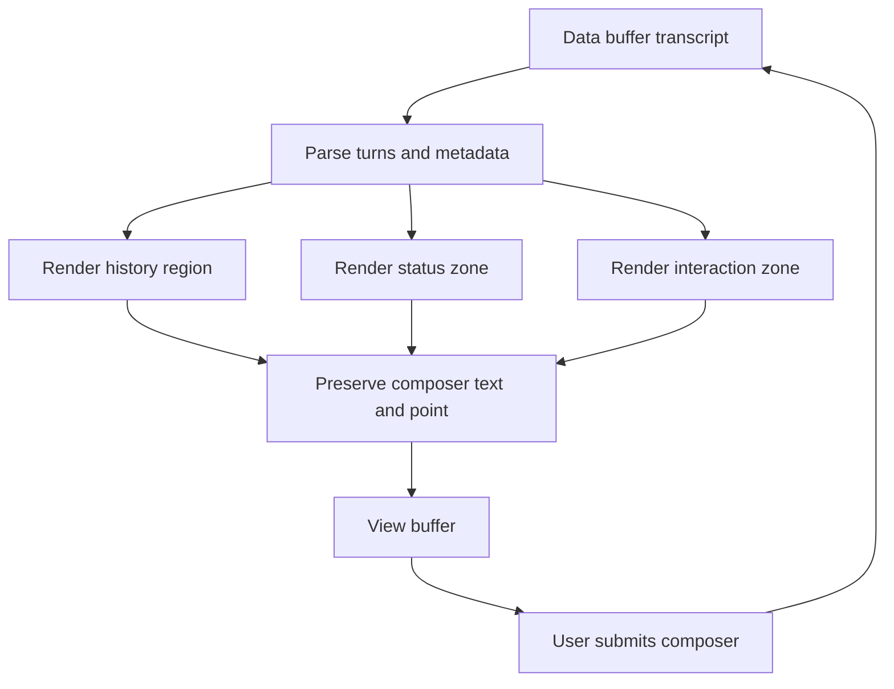

# View Buffer

The view modules render a compact user-facing projection of the authoritative
gptel data buffer. `mevedel-view.el` owns the mode, zones, and session
coordination. `mevedel-view-composer.el` owns the editable composer,
submission hooks, root dispatch, and send/fork coordination.
`mevedel-view-input-files.el` owns local file drops and clipboard-image input.
`mevedel-pending-inputs.el` owns steering, queued follow-ups, automatic
delivery, and the Pending Inputs cockpit.
`mevedel-surface-mode`, derived from `text-mode`, supplies shared ephemeral
buffer behavior for non-transcript surfaces.
`mevedel-view-agent.el` owns agent transcript inspection, live agent status,
and targeted handle refresh. `mevedel-view-interaction.el` owns interaction
descriptor registration, ordering, callback overlays, and redraw.
`mevedel-view-control-transfer.el` owns cooperative transfer polling,
presentation, commands, and view registration.
`mevedel-view-disclosure.el` owns source-backed disclosure identity, state,
and expand/collapse actions. `mevedel-view-render.el` owns transcript
projection, source mapping, and live transcript navigation.
`mevedel-view-segments.el` owns archived segment buffers, switching, and
ephemeral projection state.
`mevedel-view-stream.el` owns request progress and streaming redraw scheduling;
`mevedel-gptel-stream-bridge.el` owns private gptel stream compatibility.
`mevedel-side-conversation.el` owns transient
`/btw` conversations. The data buffer remains the model-visible transcript.

## Buffer Roles

- **Data buffer**: org-mode gptel buffer. Holds `mevedel--session`,
  `mevedel--workspace`, the canonical mixed chat/directive transcript, tool
  results, hidden render-data blocks, and persisted gptel metadata.
- **View buffer**: `mevedel-view-mode`. Holds `mevedel--data-buffer`,
  compact Markdown-rendered turns, status and interaction zones, and the
  input zone.
- **Agent transcript view**: rendered read-only projection of a sub-agent
  transcript. Resident retained agents use their live conversation buffer
  whether running or idle; cold and historical agents use the saved transcript
  file.
- **Directive inspector**: explicit read-only projection of one workspace
  directive record for durable access after compaction, archive, or source
  loss. It replaces the currently displayed view and never owns a composer,
  streaming target, or interaction registry.

An open running-agent transcript view follows the main view's update cadence:
streamed text uses `mevedel-view-stream-render-delay`, tool boundaries use
`mevedel-view-tool-boundary-render-delay`, and terminal settlement renders
immediately. It shows the same transient pending-tool rows as the main view,
but not the main foreground-request spinner; the transcript header already
shows that the agent is running. Live updates keep the window at the bottom
only when it was already there. If the reader has scrolled upward, rendering
preserves point and window start until they return to the bottom.

Agent transcript views reuse the main view's transcript renderer, incremental
rendering, and stream scheduling. The agent-specific layer only fans live
agent events out to open transcript views and applies their read-only chrome;
it does not maintain a parallel rendering implementation. The live agent data
buffer keeps its existing parent-view binding, so opening an inspection view
does not redirect parent status and interaction UI.

Agent transcript views are observation-only. Permission, Ask,
plan, and other actionable interactions remain exclusively in the parent
view. A transcript header may report that an agent is blocked, but the
transcript view never duplicates interaction controls or owns their callbacks.

Each parent view owns at most one agent transcript side window. Opening a
different agent transcript replaces the current inspection view; live refresh
does not add multi-view window management. Transcript buffer identities include
the owning session, so equal canonical agent paths in different sessions never
reuse or repurpose one another's inspection view.

If the observed agent settles while its transcript view is open, the view
renders the final content immediately and updates its header in place. It
keeps the retained data buffer rather than swapping source buffers mid-display.
Closing the inspection view preserves data buffers owned by retained agent
records so a later `FollowupAgent` can continue them; parent-session teardown
kills every retained conversation buffer from the session registry, whether
or not it has an open inspection view. Reopening reuses a resident retained
buffer and otherwise resolves the saved transcript.

The live transcript header updates on the same stream and tool events as the
body. It reflects running or blocked state, tool-call count, and elapsed time.
Elapsed time has no independent ticking timer; it advances when another live
event refreshes the view. Terminal status updates immediately.

Live transcript rendering is an observer side effect and cannot alter agent
execution or the parent view. If a refresh fails, the last good projection
remains visible, mevedel emits a warning, and a later event or terminal
settlement may retry.

Opening a transcript performs the existing full render. Subsequent live
events use the main incremental renderer, except that retained-agent metadata
replacements fully rerender because delete-and-insert invalidates their source
endpoints. Missing or stale source anchors use the same full-rerender
correctness path rather than introducing a second recovery strategy.

Opening a view while a tool is already in flight does not reconstruct a
transient pending-tool row from activity history. The full render shows the
authoritative live transcript as it stands; subsequent tool events populate
pending rows normally, and terminal settlement renders the final state.

Live updates preserve the main view's source-backed disclosure state. An
incremental update or full-rerender fallback must not collapse response,
reasoning, tool, or audit sections that the reader expanded.
Rendered source ranges use data-buffer markers so a length-changing update to
one tool's hidden render data cannot retarget an adjacent tool disclosure.

Agent transcript views open only through explicit user action on an agent
handle or status surface. Agent start, progress, and blocked events never
create or focus an inspection window automatically.

The view is reconstructable from the data buffer. Avoid storing durable
conversation state only in view overlays or text properties.

Directive requests render in the ordinary session view as first-class turns.
The directive header carries id, action, turn, and an exclusion badge; the
submitted prompt is folded, while responses, tool blocks, permission prompts,
Ask, agents, tasks, and progress use the existing renderer and interaction
zones. Settled directive turns older than the newest chronological turn fold
to one-line summaries by default. A newest directive turn remains expanded so
its response stays visible; explicit fold state wins. Every summary expands
back to the actual turn, which is never replaced by a compact event row.

The shared composer has either chat scope or an explicit directive id/action
scope. Entering through Discuss, Continue discussion, Discuss result, Request
changes, Retry, or Implement this stashes the chat draft and shows a compact
directive header, a distinct prompt prefix, and modeline state. The header names
the next scoped action; its secondary line shows chat isolation, the effective
permission mode, `Plan paused` when applicable, and `C-c C-k` for Back to chat.
Directive scope is sticky across sends and exits only through Back to chat;
leaving restores the chat draft, and resume always starts in chat scope. Queued
inputs retain the scope in which they were accepted. Status, agent, task, and
interaction redraws preserve the active scoped draft and point exactly,
including a multiline draft whose first editable character is `>`.

Directive prompt construction remains independent of this visible chronology.
A follow-up uses only durable discussion turns for the current authored request;
Implement this adds the complete matching discussion, Discuss result can target
one selected attempt, Request changes uses fresh directive context and the
immediately preceding successful attempt, and Retry uses the preceding failure
or abort. Submitted subdirectives disappear only after success, while failed and
aborted attempts leave them editable in source.

## Render flow


```mermaid
flowchart TD
    A[Data buffer transcript] --> B[Parse turns and metadata]
    B --> C[Render history region]
    B --> D[Render status zone]
    B --> E[Render interaction zone]
    C --> F[Preserve composer text and point]
    D --> F
    E --> F
    F --> G[View buffer]
    G --> H[User submits composer]
    H --> A
```

Full rerenders parse the data buffer through
`mevedel-transcript-segments`, after skipping gptel-org leading
metadata and any leading compaction summary. `mevedel-view.el` owns the
surrounding view coordination, while `mevedel-view-render.el` owns turn
grouping and projection and `mevedel-view-disclosure.el` owns source-backed
fold state and actions. Transcript span classification, tool block recovery,
and mailbox, reminder, hook-context, render-data, prompt, and ignored-range recognition live in
`mevedel-transcript.el` so persistence and compaction use the same structural
view of the buffer. Hidden audit record grammar and
attachment spans live in `mevedel-transcript-audit.el`; the view consumes
those spans without reparsing the wire format.

Streaming chunks, tool boundaries, and explicit rerender requests share one
buffer-local render scheduler.  Requests in the same pending window collapse
into one refresh; a full request upgrades an incremental request instead of
starting a second timer.  Status and interaction zones remain independent of
transcript parsing.  Reconciliation leaves an unchanged managed fragment in
place, and spinner animation changes its frame display property without
rewriting the textual progress row until elapsed or agent metadata changes.

Before rendering a restored transcript, `mevedel-transcript-restore.el`
recovers gptel bounds and normalizes their text properties through that same
canonical transcript grammar. Restoration does not maintain a second parser.

Inner transcript disclosures use a two-space left inset for their headers and
a four-space left inset for expanded bodies. This includes mailbox, tool,
reasoning, prompt, system-reminder, hook-audit, hook-context, and
completed-agent disclosures. Nested audit details and mailbox payload gutters
may indent further to express their hierarchy. Ordinary response prose and
whole-turn headers or folds remain flush-left. Body insets are display-only,
including on wrapped continuation lines, so copied disclosure content retains
its authoritative text without presentation padding.
Non-empty agent-message and agent-result mailbox bodies start collapsed by
default; `mevedel-view-mailbox-collapse-line-threshold` can raise that
threshold.

Long user prompts fold to a one-line summary — the truncated first line plus
a hidden line count such as `Please analyze this trace... (+83 lines)` —
once they exceed `mevedel-view-user-input-collapse-line-threshold` (default
15, 0 disables). The fold expands in place. The full text travels in a text
property rather than being re-read from the data buffer, so the send-path
echo folds identically before the turn has data-buffer coordinates; only
the source-backed fold keeps its state across full rerenders. Prompts
containing org block markers stay unfolded so their block decorations
remain visible.

Runs of more than `mevedel-view-tool-group-collapse-threshold` (default 3)
consecutive plain tool rows fold into one grouped activity row such as
`Searched 5 patterns, read 1 file, ran 5 commands`; tools without a verb
mapping — MCP tools included — appear as `NAME ×N`. The expanded group
reuses the compound-tool nested-row machinery: each call is a `tool-child`
row rendered by its own tool's renderer with its own collapse state, and
collapsing the group takes its rows with it. Rows that demand individual
presentation — agent handles, compound tools, rows carrying hook audits or
a sandbox warning, rows their renderer wants expanded or compact, and
coalesced rows — never fold into a group; they split the run around
themselves. A `note`-class sandbox line folds like any other row: nested
rows do not carry the summary, so the note is dropped rather than repeated
one level in. A group containing a failed call keeps its warning marker but
starts collapsed.

After an interactive ApplyPatch review settles, the applied patch row opens
expanded on a preview of its first two changes with an `… N more changes`
tail (the rendering's `:preview-body`); collapsing and re-expanding shows
the complete diff. Unreviewed edits/full-auto applications stay collapsed.

## Zones

The view buffer is split into vertically ordered regions. The data buffer
remains the model-visible source of truth; view zones are display and
interaction chrome around that transcript.

```text
+--------------------------------------------------------------+
| Header / mode line chrome                                    |
+--------------------------------------------------------------+
| History region                                               |
|   Rendered user turns, assistant turns, tool summaries,      |
|   inline agent/tool handles, and any in-flight live tail.     |
+------------------------- status marker ----------------------+
| Status zone                                                  |
|   Active child confinement, tasks, and aggregate agent rows.  |
+---------------------- interaction marker --------------------+
| Interaction zone                                             |
|   Permission prompts, plan approvals, Ask,                    |
|   pending input, approvals, and preview controls.            |
+--------------------------------------------------------------+
| Request progress row                                         |
|   Bottom live spinner such as `Working...` or `Compacting...` |
|   while the foreground request is active.                    |
+-------------------------- input marker ----------------------+
| Input zone                                                   |
|   Read-only input prompt, then editable composer body.        |
+--------------------------------------------------------------+
```

Terminology:

- **History region**: rendered transcript above `mevedel-view--status-marker`.
  Pending tool rows like `Calling Read...` are fragment-backed live-tail
  history content, not status-zone content.
- **Status zone**: session status chrome between `mevedel-view--status-marker`
  and `mevedel-view--interaction-marker`. Task, live-execution, and
  aggregate-agent rows appear here.
- **Interaction zone**: user-action chrome between
  `mevedel-view--interaction-marker` and the request progress row; it is for
  pending input and controls that require user response.
- **Request progress row**: the fragment-backed foreground spinner directly
  above the input prompt. It is not part of the history, status, or
  interaction zones. Its elapsed value measures active request work, excluding
  time spent awaiting an Ask answer, permission decision, Plan approval,
  ApplyPatch review decision, or direct request input. During those waits it
  reads `Waiting for input` while its spinner frame keeps animating. Queued
  Pending Inputs and an armed session fork do not pause active elapsed time.
- **Input zone**: the read-only prompt prefix plus the editable composer.
  **Composer** refers only to the editable unsent input body.

A submission that starts in the composer captures the draft it forwards, so a
draft typed while `UserPromptSubmit`, skill preparation, or a slash command
runs asynchronously survives the send it started, together with its mention
bindings, dropped-file grants, and point within the draft. Acceptance clears
the composer only while it still holds the captured draft. A submission that
captured no draft clears unconditionally: a drained pending input already
required an empty composer, and a buffer with no composer has none to protect.

The interaction-zone painter in `mevedel-view-interaction.el` renders
descriptor bodies as `interaction` fragments. Descriptor overlays may still
span those fragments as callback handles for prompt settlement and preview
cleanup; they are not independent renderers. Register controls with
`mevedel-view--interaction-register`; do not direct-insert ad hoc UI near the
composer. Registering or rebuilding an interaction must not auto-focus the
prompt or move point out of the composer.
Use `:body-properties-owned` only when the producer supplies complete per-span
`read-only` and stickiness properties, as ApplyPatch does for inline feedback.
A descriptor whose UI holds live editable state supplies `:body` as a
function returning fresh text and recreates its buffer markers in
`:after-render`; a registration-time snapshot would be redrawn verbatim by
foreign rebuilds (the control-transfer poll, queue events) and destroy what
the user typed. `mevedel-view--interaction-rebuild` drops and re-registers
queue-backed descriptors without rendering the intermediate states: one
final render reconciles the zone, and a descriptor re-registered under the
same id reuses its overlay object, so an unchanged rebuild is a no-op that
leaves zone text, point, and held overlay references untouched.
Interaction keybindings are active only when point is on the interaction text;
composer input must never settle or cycle interaction prompts.

Portable sessions also render cooperative lease-transfer controls in this
zone; `mevedel-view-control-transfer.el` supplies their descriptors while the
generic interaction owner places them.
The owner sees the requester label with `Grant` and `Keep` actions; a granted
transfer remains quiescing until current requests, executions, prompts, pending
inputs, and publication work drain, then the final save releases the owner to
read-only. A read-only client sees `Request control`; its composer remains
untouched while the polling timer waits for the named successor fence to clear.

The interaction separator is virtual chrome. Task rows, aggregate agent
status rows, interaction bodies, and request progress are view-owned UI
chrome; they do not belong to the model-visible transcript. The input
prompt starts with a read-only blank separator line so status,
interaction, and request-progress rows stay visually distinct from the
composer.

## Directive Turns And Inspector

The source actions and `mevedel-list-directives` resolve the topmost workspace
directive record, bind or resume its execution session, and display that
session's ordinary MevView, by default in a directive frame anchored at the
directive. Starting an action appends a directive turn at the
chronological tip; it never opens another live rendering surface. Full request,
response, tool, and interaction content remains visible there while provider
prompt projection keeps it outside ordinary-chat context.

Follow-up actions put the shared composer into directive scope. Prompt preview
shows the complete next isolated request, including discussion, requested
changes, retry guidance, or selected-attempt context. Attempt actions can open
the reusable patch viewer or invoke the session's ordinary Rewind impact and
confirmation flow through the attempt's exact turn checkpoint; neither path
creates another history owner.

The explicit read-only directive inspector renders the current request,
lifecycle and anchor state, implementation attempts, and discussion turns from
the workspace record. It is the durable access path after compaction, source
loss, or archive. Opening it replaces the current displayed view rather than
splitting beside MevView. It owns no composer, streaming, or interaction
callbacks; View patch, Reattach, Rewind before..., Archive, and scope-entering
actions dispatch to the record or execution session. Its activity entries fold
by default as an overview, and each rendered row resolves back to its own
durable entry by activity kind and settlement sequence together, because
Rewind acts on whichever entry the row resolved to. Source overlays expose the Activity action only after
the directive owns a planning, discussion, or implementation turn.

Plan-before-implementation is configured per top-level directive through the
source overlay or inspector Settings menu. The main action menu stays compact:
Settings contains the Plan toggle and model/effort selector, whose label becomes
`planning model/effort` only while Plan is on. An enabled presentation shows a
compact `PLAN: ON` hint. Planning and approval derive Planning, Plan Ready, and
Plan Accepted presentation states without replacing the directive's underlying
lifecycle. A cancelled proposal remains a draft and exposes Continue Plan,
which restores the isolated directive composer scope.

## Directive Frame

The directive frame is a floating child frame anchored at a directive's source
position that displays that directive's bound execution-session view. It shows
the real view buffer, so permissions, Ask, patch review, streaming, and the
composer work in it unmodified and no second renderer exists. See
[ADR 0106](adr/0106-directive-frame-is-a-child-frame.md) for why an overlay
cannot host these interactions.

`mevedel-show-chat-buffer` selects `frame`, `window`, or nil for directive
dispatch. Child frames need a graphical display before Emacs 31, so the frame
falls back to an ordinary window wherever they are unavailable; every behavior
except the floating geometry is identical in that fallback.

An explicit action opens the frame with focus. A request dispatch opens it
without focus, because a request the user just started must not move point.
Scope-entering actions enter the directive composer scope before displaying, so
composer input in the frame becomes a follow-up for that directive; frame
teardown leaves that scope again. Show answer positions point on the rendered
answer instead, and deliberately does not enter composer scope.

At most one directive frame exists at a time, and it is dismissed explicitly
rather than on directive settlement. The frame is anchored to its directive: it
tracks the directive's screen position as the source buffer scrolls, hides once
the directive leaves the window, and returns when it scrolls back, so the
directive and its frame scroll as one thing. Tracking runs from
`window-scroll-functions` and `window-configuration-change-hook` in the source
buffer, and repositions only on an actual change, because setting a frame
position from a redisplay hook triggers redisplay again.

Displaying the same directive in its already open frame reuses it without
rebuilding, so an action that both enters composer scope and dispatches a
request does not recreate the frame between the two steps. Displaying another
directive in the shared view retargets the frame's identity, source anchor,
follow hooks, filter, and close restoration before display. Teardown runs from
`delete-frame-functions`, so dismissing the frame, deleting it with ordinary
frame commands, or exiting Emacs all restore point and leave the composer
scope.

The frame may filter the displayed transcript to its own directive's turns.
Filtering marks the turns of every other directive and of ordinary chat with an
`invisible` text property; content before the first turn, such as the header,
is never hidden. The invisibility spec that implements this is buffer-local
rather than window-local, so filtering is skipped whenever the view buffer is
also displayed outside the frame, and the frame shows the full transcript
instead. Rendering re-applies the filter, so streamed turns stay hidden.

The frame binds only a filter toggle and a dismiss command, both on `C-c`
prefixes. Single-letter bindings are impossible because the view buffer holds an
editable composer, and `C-g` keeps its view meaning of aborting the request. The
directive scope hint line advertises both keys while the frame is showing.

### Frame chrome

The frame carries its own chrome through **window parameters**, not buffer-local
settings, because the view buffer is shared with the main view: the main view
keeps its mode line and its full-width status strip. In the frame the mode line
is suppressed, fringes are zero, and the header line is a condensed variant
leading with directive identity, then composer scope, a filter marker, request
state, model, and tool count. Session facts the parent already shows — session
name, workspace root, execution target, preset — are deliberately absent,
because this header has a fraction of the width.

The border is painted by setting a background on `internal-border` and
`child-frame-border` for that frame. A border width alone draws nothing: without
an explicit background the border takes the default background and is invisible.
`mevedel-directive-frame-border` and `mevedel-directive-frame-border-inactive`
distinguish whether the frame holds focus, which is how a dispatch-opened frame
that deliberately did not take focus reads as unfocused.

Frame height fits its content between `mevedel-directive-frame-min-height` and
`mevedel-directive-frame-height`, refitted on the view's throttled render
cadence rather than per streamed token. Only height is fitted; width stays as
computed from the parent frame at open, because fitting both dimensions sizes
the frame to the longest unwrapped line in the transcript and readily exceeds
the parent's width.

When the directive's source buffer is displayed in more than one window, the
frame anchors to the window the user is in, preferring the selected window, then
any window on the selected frame. It stays with that window afterwards, so
scrolling a second window showing the same buffer neither moves the frame nor
hides it.

### Buffer display from the frame

While the frame is showing, the view buffer redirects `display-buffer` to the
parent frame. The frame's root window is dedicated and unsplittable and the
frame is a few lines tall, so a transient menu, a cockpit surface, a followed
file link, or the patch buffer is unusable inside it. Redirecting at the display
layer rather than per-command covers every such surface, including ones that do
not exist yet.

The redirect hands input focus to the parent along with the buffer. Callers such
as `pop-to-buffer` select the window the redirect returns; without moving focus
too, the selected window and the focused frame would disagree and typing would
still reach the directive frame. The redirect also re-wraps the incoming alist
as a display action, since `display-buffer` takes `(FUNCTIONS . ALIST)` and
reads a bare alist's first entry as an action function.

Frame teardown runs in two phases. `delete-frame-functions` hands input focus
back to the parent before the frame is deleted, because deleting a focused child
frame without moving focus first leaves no frame focused and Emacs stops
responding to the keyboard. `after-delete-frame-functions` then restores point
and focus again once the frame is actually gone: the window system reports focus
back asynchronously, so until Emacs processes that event the parent draws no
cursor, and it would otherwise reappear only when the next key arrives. The
second phase forces one redisplay to settle it.

The view buffer disables `display-line-numbers`. A transcript has no line
numbers worth counting, and they cost four columns of an already narrow frame.

## Status Strip And Cockpit Routing

The view buffer header line is mevedel-owned chrome. It shows session
orientation on the left as `SESSION  WORKSPACE-ROOT` and operational
state on the right as `MODE · REQUEST-STATE · MODEL · TOOL-COUNT`.
The workspace root uses Emacs path abbreviation normally, truncates to
the final directory when space is tight, and disappears before the
right-side state is dropped. Clickable parts route to session cockpit
surfaces such as top, mode, model, and tools. The request state is
plain status text. The view must not copy or proxy gptel's clickable
data-buffer header line; gptel-owned header controls stay in the raw
data buffer. The request state is `settling` while a lost turn's deferred
terminal work still owns the session. Header construction is cached by its semantic fields and display
width, so spinner redisplay reuses the same propertized strip until one of
those inputs changes.

The session cockpit is the normal control surface from the view. It resolves
the live view/data pair once and routes each action to the owner buffer. The
explicit `g gptel menu` cockpit row is the advanced bridge into gptel's menu
from the paired data buffer. One bridge restores at a time: the pending
view, its data buffer, and the window state to return to are single, because
`transient-post-exit-hook` runs in an arbitrary buffer and cannot find them
buffer-locally. Opening the bridge from a second view therefore hands the
first view its windows back before taking that state over, so an abandoned
bridge is not silently discarded along with the window state it was still
waiting to restore.

Its header is one identity line — session, permission mode, request state,
workspace root, and execution target — followed by a warning-face alert line
only when session state is off-nominal: an unready target, an unavailable
sandbox, a lease that is neither owned nor local, or a pending publication.
The complete target and durability state is the `i Session info` panel, so
nominal state costs the cockpit no lines. Cockpit surfaces are grouped as
Conversation, History, Configure, and Cockpits.

Its History group owns mutation of the transcript:

- `f` / `F` arm a Conversation Fork or Worktree Fork at the settled assistant
  response under point.
- `R` confirms a true in-place Rewind to that response.
- `B` switches conversation variants at that response.

`N` opens the Navigate submenu, whose entries all stay open so repeated motion
needs one menu. It only inspects, and never changes session state:

- `[` / `]` project the previous or next persisted session segment in the same
  view.
- `g` opens the segment picker, including missing or unreadable archived
  segments.
- `n` / `p` move through rendered displays.
- `C-n` / `C-p` move through user queries.
- `TAB` toggles the section at point.

Those are the keys the view buffer's own keymap binds, so the cockpit teaches
one vocabulary rather than two.

An archived segment is a read-only projection, not a second live session.
Its banner shows the segment number and a clickable `[Latest]` action. The
live composer draft is hidden and preserved. Live requests continue updating
status, interactions, and progress, but transcript redraws do not replace the
archived projection. Send, follow-up, Compact, Review, Verify, and slash
commands require returning to the latest segment. Fork and Rewind still target
the settled assistant response at point; arming a Fork temporarily reveals the
composer, while cancelling hides it and stays on the archived segment.

`mevedel-view-segments.el` owns this ephemeral inspection lifecycle and consumes
the segment descriptors and verified bytes from `mevedel-session-artifacts.el`;
it does not implement another storage or transcript parser.

Arming a Fork adds a temporary interaction row naming the selected assistant
turn and Fork type. It focuses the existing composer, and cancellation removes
only the row while preserving the draft. The next accepted child prompt
publishes a new session. Conversation Fork discloses that current files may be
newer than its conversation and remain shared; Worktree Fork discloses its
linked worktree and best-effort historical-file restoration. These disclosures
are model-visible transcript records. Folding changes only their presentation.

At a shared fork point, the assistant header renders a variant button in both
expanded and folded states. One alternative opens directly; several open a
Source-first chooser with identity, working-directory, sharing, branch,
recovery, and latest-prompt context. Switching uses ordinary session restore,
rerenders source-backed history, and positions the target at the exact stable
fork point. Each view retains its own composer draft and working directory.

Rendering the buttons reuses the process's last live session enumeration
rather than re-listing the workspace on every redraw — a live listing costs
several target round trips per persisted session. Any live enumeration (the
session picker, resume, fork creation, or activating a variant button)
refreshes what the decoration shows, so a variant created by another client
appears after the next such action rather than instantly.

## Ephemeral `/btw` Side Conversations

`/btw [PROMPT]` opens one multi-turn side conversation owned by the current
root session. It may be invoked while the root response is streaming. The side
receives an invocation-time copy of the effective post-compaction context and
request configuration. Additional gptel text and media context is materialized
at that point rather than retaining live files, buffers, or overlays. Fresh
`@file`, `@ref`, and `@mcp` mentions are still resolved for each accepted side
prompt. For an active root turn, the copy ends after the accepted user prompt
plus any complete assistant/tool material; partial text and unfinished tool
calls are omitted. A hidden model-visible reminder marks that parent turn
incomplete and reference-only. Later root activity is never synchronized or
merged. Synchronous and callback-style gptel context formatters are both
materialized before the side accepts input.

The inherited context stays in the side data buffer for gptel but is below the
view's projection boundary, so the side opens with only its origin header and
new turns visible. The side has its own transient session, request lifecycle,
permission queue, stream rendering, and composer. It has no session/input
history, persistence, compaction, queued follow-ups, slash commands, skills,
Goal/Plan/task state, or ordinary session hooks. `C-c RET` sends only while the
side is idle and `C-c C-k` aborts the current side response without closing the
conversation. Aborting appends the same structural incomplete boundary so a
follow-up cannot mistake partial prose for a settled answer. Closing the side
discards it; closing the parent also closes its side. Neither operation rolls
back already approved workspace effects.

A parent owns at most one side. Bare `/btw` focuses it; `/btw PROMPT` submits
only when its composer is empty and no side response is active. Refused inline
delivery preserves both composers and their points. Side redraws use the same
draft-preserving view machinery as root redraws. `/btw` requires an accepted
parent prompt and is available only from the live root chat or Plan composer;
directive, historical, agent, and side scopes cannot create one.

While managed Bash work is live, the status zone shows its session-wide count
as an `Executions` fragment. Activating it opens the execution cockpit. The
main cockpit exposes the same surface as `Executions`, and `/ps` opens it
directly. Execution start and settlement reconcile this fragment through the
normal managed-zone path, preserving composer text, point, and windows.

## Live browser collaboration

`/collab` starts the one process-wide room for the current session, dialing
the relay at `mevedel-collaboration-relay-url` as a WebSocket client, and
reports two bearer links (the full-control link is copied to the kill ring).
`/collab status` reports the room, relay connectivity, and guest names
without printing any secret, and `/collab stop` ends the room. A second
session cannot replace an active room. Killing the data buffer, ending its
session, exiting Emacs, or the `mevedel-collaboration-share-ttl` timer also
tears the room down; the room id and both links die with it.

The relay (the Go binary in `relay/`, which also serves the static viewer)
is content-blind: every frame is sealed with AES-256-GCM under a room key
that travels only in the links' URL fragments. A view link carries the bare
key and grants live read access. A full link appends a 16-byte write token;
its holder can additionally queue prompts and interrupt the running request.
Authority follows possession of the link.

The browser is an observer of the canonical data buffer plus, for full
links, a remote input source. It receives visible user and assistant text
and tool records whose start and settlement state are explicitly published,
never hidden audit or render data or mutation commands. A tool record keeps
one stable identity from running through its settled canonical result. A
guest prompt enters the ordinary pending-input queue as a queued follow-up;
a hidden `guest-prompt` transcript audit record attributes the inserted
prompt durably, renders as a badge, and never enters model-visible context.
Every string a guest sends -- a prompt, a questionnaire answer, interaction
feedback -- crosses the same per-string byte budget, because each of them
reaches model-visible context and the transcript the same way. Outbound, every
frame is bounded by the wire limit at the transport itself, and a snapshot
record too large to travel in a frame of its own is dropped rather than
sent: the relay refuses an oversized frame by closing the connection, and
for the host connection it collects the room with it.

Full-link guests are also presented pending interactions as `ui-request`
frames — generic requests (approve/deny/feedback), permission prompts
(one-shot allow-once/deny-once/feedback; session, workspace, and always
authority is never mintable remotely), plan approval (accept with the
host-configured axes; Worktree acceptance and feedback drafts stay in
Emacs), ApplyPatch review (apply the staged selection or request a
revision with whole-patch feedback; side-by-side editing stays in
Emacs), and Ask questionnaires (the frame carries questions, options, and
current answers; the guest answers atomically) — and the first answer,
from Emacs or any guest, settles everywhere.
`mevedel-collaboration-remote-interactions` gates that surface. Lease
transfer, save, rewind, fork, publication, and execution-target changes are
impossible from the browser regardless of link strength.

The host reconnects to the relay with bounded backoff after a network blip;
the relay garbage-collects the room with the host connection, so guests
treat `room-closed` as retryable, rejoin the same room id, and re-hello for
a fresh welcome and snapshot within a bounded give-up window.

Starting a room confirms that visible text, paths, and tool results may
contain credentials or secrets and that the links are bearer credentials.

## Managed-zone chrome

`mevedel-view-zone.el` owns the four fixed fragment-backed regions of
view-owned chrome. Producers submit a complete desired fragment set for a
named zone. The module owns region identity, overlay lifetime, marker
choreography during mutation, uniform composer/point/window preservation,
reconciliation, stale-region recovery, collapse, and navigation. Producers
retain their domain text and actions.

A fragment is keyed by managed region identity, namespace, and id. It may
also carry priority, label/body text, keymap/help text, activation metadata,
navigation metadata, and a collapse key. Whole-zone reconciliation sorts by
descending priority and caller order. Unknown zone names and malformed
descriptors are programming errors; stale disposable UI state is rebuilt.

Fragment metadata lives in `mevedel-view-zone-*` text properties. Those
properties are valid for view navigation, activation, collapse, and targeted
refresh decisions, but they are UI cache only. Durable conversation state
continues to live in the data buffer and session structures. The zone module
owns managed region overlays. Remaining interaction overlays are opaque
callback handles for permission, plan, Ask, and preview flows;
they are not parallel renderers.

`mevedel-interaction-prompt.el` owns the common lifecycle for those opaque
handles: exactly-once settlement, request-local cancellation, buffer-kill
cleanup, weak request-registration bookkeeping, and standard prompt framing.
Ask, permission, plan, and preview code retain their domain-specific
descriptors and outcomes.

Current fragment namespaces:

- `history-live`: pending tool live-tail rows in the history region, built
  from `mevedel-view--pending-tool-calls`. They are removed and recreated
  from pending state; they must not be preserved as source-backed transcript
  text or deleted by heuristic `Calling ...` line matching. There is one row
  per call, not per distinct tool: gptel's tool-call hooks carry no call id,
  so identical parallel calls are told apart by a serial paired with their
  name/argument fingerprint, and that pair is the fragment's identity.
- `status`: `tasks`, live `executions`, and `agents` status-zone blocks.
  Task and aggregate-agent disclosure state is backed by fragment collapse
  state.
- `interaction`: pending-input summaries and user controls plus a
  non-navigatable `:separator` fragment. Ask, permission, plan, preview, and
  pending-input
  callers continue to use the descriptor registry.
- `progress`: the foreground `request` progress row between the interaction
  zone and input prompt.

Source-backed transcript turns, tool summaries, request-failure disclosures,
and agent transcript handles are intentionally outside this chrome-fragment
model even when they are clickable or collapsible. They are projections of
the authoritative data buffer and keep source-coordinate disclosure state.
Provider failures are expanded by default and preserve the complete provider
message for manual retry. `mevedel-view-render-live-update` retains completed
semantic units in the view and reparses only the mutable source-backed tail.
Reasoning summaries and consecutive tool groups are units; response prose
advances at the last blank-line boundary outside fenced code. Terminal
settlement calls `mevedel-view-render-settle` for one exact whole-turn
reconciliation. A full rerender, a new turn, or stream cancellation invalidates
the retained tail. `mevedel-view-stream.el` schedules live updates and owns
request-progress state and pending-tool rows;
`mevedel-gptel-stream-bridge.el` confines the private upstream advice. Fragment
updates should not bypass the data-buffer transcript.
Revisit source-backed transcript fragments only as a separate design after a
concrete performance or correctness problem is identified.

When an owning tool or agent turn used materially non-default child access,
its source-backed row includes a durable `! Sandbox:` line directly below the
normal header in collapsed, expanded, and compact-event forms. Additional
writes, network access, unrestricted or unavailable confinement, host `/proc`,
refusals, and no-start outcomes use short plain-language descriptions.
Default Bubblewrap/workspace-write/isolated/fresh-proc execution and additional
read-only mounts remain silent. The line is reconstructed from hidden
transcript render-data rather than view-only state.

High-level zone markers still define layout order in `mevedel-view.el`.
`mevedel-view-interaction.el` turns the interaction marker into managed
fragments; producers do not own managed overlays, preservation wrappers, or
marker insertion choreography.

## Redraw invariants

Redraw paths must treat the composer as user-owned text. Full rerenders,
interaction rebuilds, status/task rows, spinner ticks, pending-tool live
lines, and targeted agent refreshes should preserve both composer text
and point while suppressing modification hooks for view-owned changes.

`mevedel-view--call-preserving-window-state` restores point, window points,
and window starts through semantic render anchors rather than raw buffer
positions: a composer position by its input offset, a managed-fragment
position by zone namespace, fragment id, and offset, and rendered transcript
text by its `mevedel-view-source` data start (plus an ordinal, since a fold
header and its body can share one source start) and offset into the run. A
raw position saved across a delete-and-re-render lands in different content
whenever lengths shift — the cursor visibly drifted through live Bash output
on every tick, and window starts jumped into unrelated turns after full
rerenders. Anchors that cannot be resolved after the redraw fall back to the
clamped raw position.

The allocation-heavy chokepoints run with garbage collection batched
(`mevedel--with-gc-batched`, a direct `gc-cons-threshold` binding with no
external GC-tuning dependency): full and incremental transcript renders,
session save transactions, every tool-pipeline step chain, and the gptel
stream filter/cleanup advice. An unattended session otherwise runs at
whatever low threshold the user's idle GC tuning left behind, paying many
long collections inside a single redraw or settlement.

A send that fails or is interrupted before the provider starts gets no
terminal callback, so that boundary settles the turn itself: it keeps the
committed user turn, records a retryable failure summary while the request
still carries its elapsed time, stops the turn UI, and ends the request. A
later render therefore never continues a dead turn.

The terminal response boundary releases the turn -- pending tool rows, spinner
timer, and both in-flight markers -- whether or not the work it guards
succeeds. Everything fallible runs inside that guard: stopping the progress
row, the zone mutations, the request summary, and the projection. A failure
there warns and falls back to one debounced full rerender, so a terminal render
bug cannot leave a live spinner timer, a stale in-flight anchor, or an error
that skips the post-response observers that follow.

`mevedel-view-rerender` is the correctness fallback and is debounced for
bursty updates. Prefer narrower refresh paths when a stable source exists:
retained-agent metadata replacements use a full rerender, while activity-only
status rows can refresh narrowly. Managed Bash progress and terminal events
identify their row by durable tool-use ID and replace only that row. If the row
is not visible yet, the stream scheduler coalesces one incremental recovery
render.

Full rerenders rebuild the zone markers from the header, skip leading
compaction summaries, and re-anchor the in-flight assistant turn. Without
a valid in-flight anchor, the next incremental render can erase freshly
rendered history or duplicate a preserved live tail.

The reanchor also repairs `mevedel-view--data-turn-start`, the data-buffer
marker that bounds what incremental renders re-render. A whole-buffer
rewrite of the data buffer — compaction application, segment rotation —
goes through `erase-buffer` and collapses every marker to `point-min`; left
unrepaired, each later incremental render extracted and re-rendered the
entire transcript (a 54-minute debug capture showed the accepted-plan turn
re-inserted into the live tail on every tick). When the projection found an
assistant turn to anchor to, the data marker moves to that turn's data
start; otherwise it parks at the data buffer's end, since everything before
it was just rendered as settled history.

Temporary buffers used only to fontify or render view text must suppress
user major-mode hooks and local variables. Use
`mevedel-view--with-render-temp-buffer` rather than raw
`with-temp-buffer` plus mode activation.

Assistant response text is rendered as Markdown in the view. The data
buffer remains org-mode for gptel state, tool parsing, and persistence,
but the user-facing projection does not convert assistant Markdown to org.
Markdown view text is fontified through `markdown-ts-mode`, which Emacs
31.1 ships, so mevedel needs no Markdown package. There is no
`markdown-mode` path: `markdown-mode` is a third-party package, and
`markdown-ts-mode` covers CommonMark and most of GFM, adds LaTeX, and
highlights fenced code blocks with the embedded language's own grammar.

Its two tree-sitter grammars (`markdown` and `markdown-inline`) are not
shipped with Emacs and must be compiled locally, which needs a C toolchain.
`mevedel-view--markdown-fontify-mode` returns nil until
`treesit-language-available-p` reports both, and then view text stays plain
unfontified Markdown - never a prompt, because `markdown-ts-mode` calls
`treesit-ensure-installed`, which offers to clone and compile, and a render
must never block on that. Loading the mode registers both grammars in
`treesit-language-source-alist`, so `M-x markdown-ts-mode-install-parsers`
has a source to build from; mevedel warns once, outside batch, when the
grammars are missing.

Setting the mode up costs about 4.4ms - two parsers, range rules for the
embedded grammars, `outline-minor-mode`, a `jit-lock` registration - against
roughly 0.1ms to fontify a typical response segment. A fresh temp buffer per
call would pay that setup on every streaming redraw, so
`mevedel-view--markdown-fontify-target` sets up one hidden buffer once and
only the content is swapped. `mevedel-view--fontify-as` treats
`markdown-mode` as the tag meaning "this body is Markdown" and routes it
there; every other `:body-mode` is a real major mode and still gets a
throwaway temp buffer.

Markup delimiters -- heading hashes, emphasis asterisks, code-span
backticks -- are hidden by default, so `**bold**` reads as bold alone. They
are only made invisible: `markdown-ts-mode` puts an `invisible` property on
them while fontifying, which rides into the view as an ordinary text
property, so the text the view holds and every position it maps back to
the data buffer are unchanged. Set
`mevedel-view-hide-markdown-markup` to nil to see the raw delimiters.
Because the property is applied at fontification time rather than at
display time, changing the setting drops the reusable buffer and the
response and tool rendering caches and re-renders every open view.

Markdown rendering adds small view-only affordances:

- completed fenced code blocks are rewritten in the view projection as
  source panels: the data buffer keeps the raw Markdown fences, while
  the view strips them, inserts a clickable `LANG ⧉` label (`snippet ⧉`
  for unlabeled fences), adds vertical panel padding/background, and copies
  only the code body. A source panel adds no left inset of its own and
  inherits any inset from its containing disclosure;
- incomplete streaming fences stay raw until the closing fence arrives;
- supported local image references render inline when Emacs can display
  images; remote portable session-artifact images are decoded only from
  resolver-verified committed publication bytes rather than owned staged
  writes or the mutable fixed-path cache, while PID-lock sessions read their
  authoritative fixed logical file.
  `mevedel-view-inline-image-max-width` takes a fixed pixel width
  (default 600) or a float in (0, 1] meaning a fraction of the
  displaying window's pixel width; ratio-sized images retain their path,
  ratio, and measured width and are re-scaled by the realignment job below;
- canonical pipe tables (two or more consecutive `|...|` rows outside
  fenced blocks and linkify-exempt text) are rendered by
  `mevedel-view-table.el` as aligned box-drawing rows after the link and
  path passes, so buttons and faces inside cells survive. Columns wider
  than 90% of the usable window width (window columns minus any
  `line-prefix` or `wrap-prefix` inset) shrink proportionally toward their
  longest-word minima and wrap their cells; plain ASCII is measured by
  `string-width`, faced or non-ASCII content pixel-measured against the
  displaying window. The rendered region retains the canonical Markdown
  source and the layout's window pixel width as text properties and
  carries the view's own source/read-only/turn properties across the
  rewrite;
- rendered `@file` mentions, Markdown file links, and bare file paths
  are clickable open-file buttons, including `:LINE`, `:L<line>`,
  `:#L<line>`, comma-separated line lists, and `#L<line>` targets. A path
  inside the active remote session opens resolver-verified published bytes at
  its logical path; the disposable fixed-path cache is never used as evidence
  that the artifact exists.

Markdown links, local images, paths, and fenced source-panel projection are
isolated in `mevedel-view-markdown.el`, deferred target path verification in
`mevedel-view-path.el`; the table engine lives in
`mevedel-view-table.el`, adapted from agent-shell's renderer with
attribution.

Rendered tables and ratio-sized images stay aligned to their window:
`mevedel-view-mode` installs buffer-local handlers on
`window-size-change-functions` and `window-buffer-change-functions`
that debounce onto one 0.15 s idle timer per buffer, cancelled when the
buffer is killed. The deferred job — never the redisplay hooks
themselves — rebuilds only the tables and images whose retained width
no longer matches the displaying window, off the undo list, preserving
point, the modified flag, the data buffer, and any composer draft. The
changed window rides along to the deferred job, so its width is the
one laid out for. A buffer shown simultaneously in windows of
different widths holds one layout: the most recently realigned window
wins. Staleness is keyed on window pixel width, so a glyph-width-only
change such as `text-scale-adjust` does not trigger reflow until the
next window change.

Copying from a view is contract-bound to canonical Markdown:
`mevedel-view-mode` sets `filter-buffer-substring-function` so any
copied or killed region overlapping a rendered table yields the table's
complete pipe-table source spliced into the surrounding text, never
box-drawing glyphs. The fenced code-block copy button still copies the
raw code body.
Audit disclosure formatting and toggling live in `mevedel-view-audit.el`;
`mevedel-view-disclosure.el` owns its shared source-backed toggle state, and
`mevedel-view-render.el` retains the surrounding turn projection. Each
tool-attached hook audit uses its own transcript span, so audits attached to
one tool retain independent collapse state across rerenders.

Tool-rendering caches are disposable UI caches, not just text caches.
Cache keys must include session-side state that changes visible
headers/status — currently permission-queue origins and pending plan
approval — and collapsed-header cache entries should omit large bodies
so expansion can recompute body content when needed. Agent registry
activity is deliberately excluded from the key: agent handle status
reaches a rendering only through render-data blocks patched into the
transcript text, which the content term already invalidates, while
registry activity changes on every agent tick and would defeat the
cache exactly during agent runs. A new live-state dependency must
either ride a text patch or clear the tool-rendering cache at its
mutation point. Cache keys normalize marker positions to integers so
targeted agent refreshes and full renders share entries, and tool
block bounds are memoized per segment in a data-buffer-local table
keyed on `buffer-modified-tick` (property-only changes included, since
restored transcripts stamp gptel properties without character
changes). Agent-source presence checks reuse the invocation-owned
render-data markers maintained by the live update path and never scan
the transcript.

`mevedel-view-disclosure.el` keys source-backed disclosure state from
data-buffer coordinates and stable source anchors, not view-buffer positions.
Rerenders should capture
and reapply collapse state, including temporary in-flight anchors that later
settle, so expanded tool/response sections do not collapse again during
live refreshes.
`mevedel-view-render-settle` computes those keys with their durable
post-settle anchors (`mevedel-view-disclosure--settling-p`): it runs before
the stream clears the in-flight turn markers, and keys captured or stamped
under the temporary `(in-flight)` anchor there would be orphaned the moment
those markers clear. Empty-string tool ids — restored transcripts stamp
them where the live buffer had nil — never become key anchors, so a
property restore does not change a section's identity.

A user toggle deletes and re-inserts view text, which can drag the retained
live-tail view marker away from its data-buffer twin; `mevedel-view-toggle-
section` therefore invalidates the retained tail, sending the next update
down the non-retained path whose capture/restore preserves the toggle. For
the same reason the live renderer retains the tail only after collapse-state
restoration, and skips retention entirely on a tick whose restore actually
toggled a section. A toggle that finds the in-flight marker inside the
section re-anchors it at the section start — never the end, which would
leave everything above it stale for the next incremental render.

Live-tail duplicate detection should compare literal lines while skipping
volatile spinner/tool/agent rows. Avoid building one large regexp from
streamed transcript text; long agent outputs can overflow Emacs regexp
limits.

### Zone mockups

Idle session with no live status or queued controls:

```text
main  ~/project/                                      ask · idle · gpt-5.5 · 20 tools

> draft starts here
```

Active request with a pending tool live-tail row and pending input:

```text
main  ~/project/                                   ask · running · gpt-5.5 · 20 tools

You
Please inspect the view layout.

Assistant
I'll inspect the associated files.

Calling Read: mevedel-view.el...

-- 1 pending input --------------------------------------------

Follow-ups
  1. Also check the docs.
  RET or C-c C-e manage pending inputs

Working... · 42s

> editable composer draft
```

Active tasks, agents, and an interaction prompt:

```text
main  ~/project/                                   ask · running · gpt-5.5 · 20 tools

You
Implement the change.

Assistant
I'll work on the changes.

-- tasks -------------------------------------------------------
  Main 1 open
  - Run focused tests

  Agent: verifier -- review spinner layout [running · 1 call]

-- 1 permission prompt pending --------------------------------

Allow Bash?
  npx @emacs-eask/cli test ert test/test-mevedel-view.el

Waiting for input · 1m 08s · 1 agent running

[plan]  >
```

Busy session showing every view-owned zone at once:

```text
main  ~/project/                                   ask · running · gpt-5.5 · 20 tools

You
Update the view docs and verify the spinner layout.

Assistant
I'll update the docs, run the focused checks, and ask before any risky action.

Calling Read: docs/view.md...
Calling Grep: status zone...

-- tasks -------------------------------------------------------
  Main 2 open
  - Update docs with zone mockups
  - Run focused validation

  Agent: explorer -- audit zone terminology [running · 3 calls]
  Agent: verifier -- check spinner ordering [blocked · waiting]

-- 1 question · 1 permission · 2 pending inputs ---------------

Ask
  Which validation should run next?
  [focused view tests] [compile] [full suite]

Permission request from /root/verifier
Allow Bash?
  npx @emacs-eask/cli test ert test/test-mevedel-view.el

Steering
  1. Keep the request spinner pinned above the composer.
Follow-ups
  1. Also include a full mockup with agents and permissions.
  RET or C-c C-e manage pending inputs

Waiting for input · 2m 14s · 1 agent blocked · 1 agent running

[auto] > I am drafting a follow-up while the request runs.
```

## Input History

`mevedel-view-history.el` provides comint-style input history for the
view input zone. `mevedel-view-composer.el` owns the editable input boundary,
completion, prompt submission, and integration with that history ring. The
related input bindings are:

- `C-c RET`: send while idle, or enqueue same-turn steering for the active
  ordinary root turn
- `C-c TAB`: send while idle, or enqueue a separate queued follow-up while the
  session is occupied
- `C-y`: yank text or insert a clipboard image
- `C-c C-e`: open the Pending Inputs cockpit
- `C-c C-q`: confirm and clear all pending input
- `M-p` / `M-n`: previous / next input
- `M-r`: search history
- `C-c C-l`: browse history
- `C-c C-u`: clear current input
- `C-a`: beginning of input line
- `Shift-TAB` / `<backtab>`: cycle `ask`, `edits`, and `full-auto`
- `C-<tab>` in the composer: toggle Plan without changing the permission mode

These bindings apply only while point is in the editable composer.
History persists at the workspace level as
`<workspace-root>/.mevedel/input-history.el`, so new and resumed
sessions in the same project share prompt recall. When persistence is not
writable, the active ring remains available in memory. Rewind keeps the current
workspace ring and composer draft. The Lisp sidecar is printed with circle
syntax enabled so shared text-property objects remain readable. Transient read
failures leave the canonical sidecar in place for a later retry; only malformed
history is renamed aside.

The input zone installs slash command completion, `$` skill completion,
and display-only skill argument hints. Root slash completion offers local
commands; root `$` completion offers user-invocable skills. Both insert a
real space after a completed root name. Command argument completion is
available for commands with useful candidate sets, such as `/mode` and
`/model`. Skill hints are rendered
as a zero-width overlay near point from `argument-hint` or remaining
`arguments` names. They are not buffer text and are never sent to the
model.

Text inserted as a user turn must be plain transcript text. User send and
queued-drain paths strip copied view,
tool, read-only, and `gptel` text properties, then restore only internal
render-data blocks as `'gptel 'mevedel-render-data`; UI properties copied
from the view must not become model-visible transcript state.

## File Drag/Drop And Clipboard Images

Interactive view buffers install a buffer-local DND handler for local
`file:` URIs. Dropping regular files inserts visible `@file` mentions in
the composer; paths with whitespace or other token-breaking characters use
the braced `@file:{...}` form. Directory drops are ignored.

`C-y` in the composer first tries to save a clipboard image, using the
first available platform clipboard command, into
`<workspace-root>/.mevedel/media/clipboard-YYYYmmdd-HHMMSS.png`. When an
image is saved, the view inserts it as an `@file` mention instead of
yanking text. If no clipboard image is available, normal `yank` behavior
is used.

Each dropped file also records a pending exact-file grant on the session.
If the next send still contains an `@file` mention for that same expanded
path, the grant becomes an in-memory session-scoped `Read` grant for that
exact path. The grant does not create a directory rule, does not apply to
write tools, and is not persisted with the session. Clipboard image paste
uses the same pending-grant path.

## Pending Input

Pending input is session-owned and has two independent FIFO categories.
`C-c RET` during an ordinary active root turn accepts same-turn steering:
preparation and `UserPromptSubmit` run immediately, then all steering already
present at the next model interaction boundary is inserted as durable user
transcript messages without creating extra turns. Steering submitted during
that injection waits for the following boundary. It never aborts the request.
Root `WaitAgent` uses the same steering path and wakes the wait at the next
possible boundary rather than creating a mailbox message.

A plain send refused because the workflow is occupied names the occupying
cause: a retained accepted-plan implementation hints
`mevedel-retry-plan-implementation`, a normal unfinished Goal hints
`/goal resume`, a budget-limited Goal hints `/goal budget`, a preconstruction
Goal handoff says to wait, and a pending plan proposal points at its approval.
Resuming a mutable session that holds an implementation retry record also
echoes the retry command; read-only inspection does not.

`C-c TAB` while the session is occupied accepts a queued follow-up. Each
follow-up later starts one normal user turn. Steering always has delivery
priority over follow-ups regardless of submission order; FIFO applies within
each category. While idle, both send keys perform an ordinary immediate send.
Slash commands cannot become pending input.

The interaction zone shows compact per-category previews. `RET` on that
summary or `C-c C-e` opens the Pending Inputs cockpit and pauses automatic
delivery. The cockpit edits one entry in the composer without losing an
existing draft, reorders entries within their category, converts entries
between steering and follow-up, marks and deletes selected entries, and clears
all pending input with `C-c C-q`. Saving an edit updates the entry in place;
cancelling restores the prior draft. Closing or killing the cockpit resumes
eligible delivery, and a kill cannot refuse the way `q` does, so an open entry
edit is cancelled -- its suspended draft returns to the composer -- rather than
a paused turn left parked. Opening any cockpit surface for another session
releases the surface the previous one held. Queue and recovery actions recheck
session mutation authority before
restoring reserved submission context or changing session state, so stale,
foreign, and quiescing surfaces fail closed.

Permission, Ask, Plan, and other user-input overlays do not disable either
queue. An unresolved interaction merely postpones steering injection and
follow-up dispatch. If a turn fails with undelivered steering, those entries
remain steering, become `Needs review`, and pause all automatic pending-input
delivery. The user must edit, delete, or recategorize the failed entries, then
resume delivery from the cockpit. Later follow-ups remain intact.

Entries retain atomically bound mention text and dropped-file grants; a
grant activates durably only when its entry is delivered.
Follow-ups run skill planning, mention expansion, and `UserPromptSubmit` only
when their own turn dispatches; an already prepared steering entry is not
prepared twice. Accepted input is added to ordinary workspace input history.

## Agent Transcript Views

`mevedel-view-agent.el` owns transcript lookup and inspection views, live
rows and badges, and status/handle refresh. Transcript turn rendering remains
in `mevedel-view-render.el`.

Agent activity rows are projections of canonical tool and lifecycle events:
`Started PATH`, `FollowupAgent: PATH`, `SendMessage: PATH`,
`InterruptAgent: PATH`, and `Waiting for agents`. Settled waits render
`WaitAgent: agents (OUTCOME)`; consecutive wait rows retain only the final outcome and show the
combined count. The view does not infer a second activity state from internal
storage identities or runtime tables.
An Agent with `context="summary"` first shows `Preparing summary context...`.
After launch, its handle includes the summary provider/model/effort metadata
without copying summary content into the parent transcript. In the child view,
the persisted `Task background` block is a separate initially folded card
before the ordinary Agent Task turn.

Agent handles use `TAB` to expand or collapse their details.  `RET` on the
visible agent path, or a mouse click, opens the transcript.  Agent handles
and activity-row paths are clickable when a transcript entry is available.
`FollowupAgent: PATH` and `SendMessage: PATH` start collapsed and expand
to the exact follow-up or sent message.
Resident retained agents show status/activity in the main view and open a
rendered read-only transcript view over their conversation buffer whether
running or idle. An open idle view begins live projection when a follow-up
turn starts. Cold and historical agents open from the saved transcript file
through `mevedel-view-open-agent-transcript`.

`mevedel-transcript-restore.el` restores only the gptel bounds/properties
needed for rendering and normalizes them through `mevedel-transcript.el`'s
canonical grammar. Transcript views do not restore backend/tool objects or
become live agent buffers themselves.

When `SubagentStart` injects hook context, the parent transcript renders a
compact audit note on the Agent tool row, and the child transcript renders
the full hook-context disclosure on the child's initial prompt.

## Hook Audit Display

Model-visible `<hook-context>` blocks are stripped out of the rendered
user message body so injected policy/context does not look like text the
user typed. When such context is present, the view shows a compact
disclosure:

```text
  ◇ hook context added
```

Expanding it shows the contributing hook event names and injected context.
When multiple hooks contribute context to the same prompt, the view renders
one combined disclosure for that prompt, preserving contribution order in
the expanded details.  This keeps successful context injection quiet by
default while still making it auditable in the transcript view.

If `UserPromptSubmit` blocks a root input, its context stays pending without a
visible user turn and joins the next accepted root input once. Context from
`SessionStart(clear)` behaves the same way. Automatic root compaction adds
`SessionStart(compact)` context to the already-rendered pending turn and the
rerendered transcript exposes it through the same disclosure; it does not run
the prompt hook again.

The renderer builds hook audit surfaces from hook audit records.  For
context injection, it reads ordered `<hook-event name="...">` entries
inside a `<hook-context>` block; new persisted hook context does not need
a plain-body fallback.

Tool input repair reuses the same hidden audit side channel. A committed
repair appears on the affected tool row as `◇ tool input repaired`; a
tentative repair discarded because final validation failed appears as
`◇ tool input repair abandoned`. Expanding either disclosure shows only the
repair rule ID, argument-schema path, and before/after shape. Supplied and
repaired values never enter this metadata. Malformed records render the safe
`tool input repair audit unavailable` fallback without changing the tool
result. Async audit redraw follows the normal view invariant: composer text
and point, including multiline drafts beginning with `>`, are preserved.

Prompt rewrites from `:updated-input` use a separate compact disclosure
attached to the submitted user turn:

```text
  ◇ hook changed prompt
```

Expanding it shows the hook event, any hook-provided message or reason,
and the original and submitted prompt text:

```text
  ◇ hook changed prompt
    UserPromptSubmit
    reason: normalized review request

    Original prompt
    review plz

    Submitted prompt
    Please review this file.
```

The first implementation does not need inline diff review UI.

Tool calls blocked by `PreToolUse` or `PermissionRequest` stay visible as
normal tool attempts, with a short second line showing which hook blocked
the call and the hook-provided reason.  Forced `ask` decisions are also
shown on the affected tool attempt.  `allow` decisions are not rendered
unless they suppress a permission prompt that would otherwise have been
shown.  A `PreToolUse :updated-input` rewrite is shown on the same tool
row as `◇ hook changed tool input`; expanding it shows the event,
supporting message/reason, and original versus updated tool args.

`PostToolUse` and `PostToolUseFailure` context is rendered on the affected
tool result row, not the next user turn, because the hook modifies the
model-visible tool feedback.  A post-tool `:updated-result` rewrite is
shown on the affected tool row as `◇ hook changed tool result`; expanding
it shows original and updated model-visible result text.

## Goal and Preset Cockpits

The session cockpit exposes two session-owned workflow surfaces. The Goal
surface shows the objective, status, turn count, and token accounting on one
line, and groups its keys as Lifecycle, Adjust, and Inspect. Its start, pause,
resume, and clear actions are enabled only at compatible lifecycle states. The
blocked reason, elapsed time, and accepted-plan reference are the `i Goal
record` info panel.

The Preset surface selects a preset buffer-locally in the owning data buffer.
Its header summarizes the preset name and how many tier and workload policies
resolve; `i Model policy report` opens the full table of resolved provider and
effort per tier and workload. A policy that fails to resolve is named on an
error-face alert line telling the user to fix the preset before dispatch, rather
than hiding inside the table. Presets remain configuration-as-code; the cockpit
does not author or rewrite them. The view status strip links to both surfaces.
Cockpit inspection and selection never rebuild the composer, so an active
multiline draft is retained.
