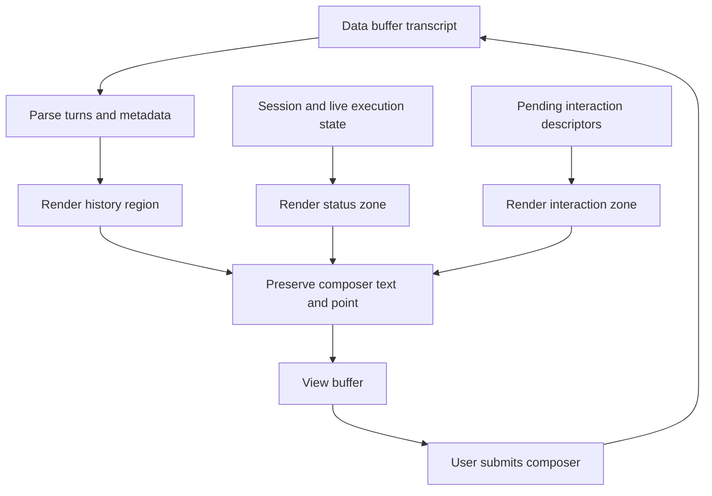

# View Buffer

The view modules render a compact user-facing projection of the authoritative
gptel data buffer. `mevedel-view.el` owns the mode, zones, and session
coordination. `mevedel-view-composer.el` owns the editable composer,
submission hooks, root dispatch, and send/fork coordination.
`mevedel-view-input-files.el` owns local file drops and clipboard-image input.
`mevedel-pending-inputs.el` owns steering, queued follow-ups, automatic
delivery, and the Pending Inputs cockpit.
`mevedel-surface-mode`, derived from `text-mode`, supplies shared ephemeral
buffer behavior for non-transcript surfaces.
`mevedel-view-agent.el` owns agent transcript inspection, live agent status,
and targeted handle refresh. `mevedel-view-interaction.el` owns interaction
descriptor registration, ordering, callback overlays, and redraw.
`mevedel-view-control-transfer.el` owns cooperative transfer polling,
presentation, commands, and view registration.
On view closure, `mevedel-view-control-transfer-stop-polling` stops the timer
and prevents rearming while retaining the root registration needed for journal
sealing. Full transfer teardown removes the registrations after sealing.
`mevedel-view-disclosure.el` owns source-backed disclosure identity, state,
and expand/collapse actions. It also locates contiguous section bounds for
source disclosures, hook context, user-input folds, and turns using each
caller's identity property; equal but distinct source objects remain separate. `mevedel-view-render.el` owns transcript
projection, source mapping, and live transcript navigation.
`mevedel-view-segments.el` owns archived segment buffers, switching, and
ephemeral projection state.
`mevedel-view-stream.el` owns request progress and streaming redraw scheduling;
`mevedel-gptel-stream-bridge.el` owns private gptel stream compatibility.
`mevedel-view-animation.el` prepares bounded time-based status frames;
`mevedel-view-native.el` optionally presents those samples through independent
Wayland surfaces, owning setup, placement, fallback and teardown;
`mevedel-view-power.el` shares local battery observations and computes the
effective animation ceiling. The stream owner decides when visible frames
and semantic progress metadata need updating; these modules do not own the
authoritative transcript.
`mevedel-side-conversation.el` owns transient
`/btw` conversations. The data buffer remains the model-visible transcript;
`C-c C-z` closes the ephemeral side and returns its resources to the parent.

## Buffer Roles

- **Data buffer**: org-mode gptel buffer. Holds `mevedel--session`,
  `mevedel--workspace`, the canonical mixed chat/directive transcript, tool
  results, hidden render-data blocks, and persisted gptel metadata.
- **View buffer**: `mevedel-view-mode`. Holds `mevedel--data-buffer`,
  compact Markdown-rendered turns, status and interaction zones, and the
  input zone.
- **Agent transcript view**: rendered read-only projection of a sub-agent
  transcript. Resident retained agents use their live conversation buffer
  whether running or idle; cold and historical agents use the saved transcript
  file.
- **Directive inspector**: explicit read-only projection of one workspace
  directive record for durable access after compaction, archive, or source
  loss. It replaces the currently displayed view and never owns a composer,
  streaming target, or interaction registry.

An open running-agent transcript view follows the main view's update cadence:
streamed text uses `mevedel-view-stream-render-delay` (a batch flushed by the
stream bridge renders in the flush's own wakeup), tool boundaries use
`mevedel-view-tool-boundary-render-delay`, and terminal settlement renders
immediately. It shows the same transient pending-tool rows as the main view,
but not the main foreground-request spinner; the transcript header already
shows that the agent is running. Live updates keep the window at the bottom
only when it was already there. If the reader has scrolled upward, rendering
preserves point and window start until they return to the bottom.

Agent transcript views reuse the main view's transcript renderer, incremental
rendering, and stream scheduling. The agent-specific layer only fans live
agent events out to open transcript views and applies their read-only chrome;
it does not maintain a parallel rendering implementation. The live agent data
buffer keeps its existing parent-view binding, so opening an inspection view
does not redirect parent status and interaction UI.
Stream and tool callbacks temporarily bind that pointer to the inspection view.
The observer module declares the pointer as a special variable itself, so this
routing also works when compiled before the session structs have been loaded.

Agent transcript views are observation-only. Permission, Ask,
plan, and other actionable interactions remain exclusively in the parent
view. A transcript header may report that an agent is blocked, but the
transcript view never duplicates interaction controls or owns their callbacks.

Each parent view owns at most one agent transcript side window. Opening a
different agent transcript replaces the current inspection view; live refresh
does not add multi-view window management. Transcript buffer identities include
the owning session, so equal canonical agent paths in different sessions never
reuse or repurpose one another's inspection view.

If the observed agent settles while its transcript view is open, the view
renders the final content immediately and updates its header in place. It
keeps the retained data buffer rather than swapping source buffers mid-display.
Closing the inspection view preserves data buffers owned by retained agent
records so a later `FollowupAgent` can continue them; parent-session teardown
kills every retained conversation buffer from the session registry, whether
or not it has an open inspection view. Reopening reuses a resident retained
buffer and otherwise resolves the saved transcript.

The live transcript header updates on the same stream and tool events as the
body. It reflects running or blocked state, tool-call count, and elapsed time.
Elapsed time has no independent ticking timer; it advances when another live
event refreshes the view. Terminal status updates immediately.

Live transcript rendering is an observer side effect and cannot alter agent
execution or the parent view. If a refresh fails, the last good projection
remains visible, mevedel emits a warning, and a later event or terminal
settlement may retry.

Opening a live transcript performs the synchronous full render needed to attach
the stream tail. A settled retained or saved transcript opens with scheduled
canonical projection, keeping the previous display until preparation completes.
Resuming a session, rewinding it, starting a new segment, taking or following
control, rolling back a failed directive request, and refreshing Source after a
Session Fork schedule the same projection rather than blocking on a complete
rebuild.
Subsequent live events use the main incremental renderer, except that retained-agent metadata
replacements fully rerender because delete-and-insert invalidates their source
endpoints. Missing or stale source anchors use the same full-rerender
correctness path rather than introducing a second recovery strategy.

Opening a view while a tool is already in flight does not reconstruct a
transient pending-tool row from activity history. The full render shows the
authoritative live transcript as it stands; subsequent tool events populate
pending rows normally, and terminal settlement renders the final state.

Live updates preserve the main view's source-backed disclosure state. An
incremental update or full-rerender fallback must not collapse response,
reasoning, tool, or audit sections that the reader expanded.
Grouped tool and reasoning rows use their own transcript source identity,
so expansion and the reader's cursor survive a row moving out of a group
when a late audit requires individual presentation.
Rendered source ranges use data-buffer markers so a length-changing update to
one tool's hidden render data cannot retarget an adjacent tool disclosure.
Single-tool progress refreshes preserve that marker-backed range, so expanding
the refreshed row still reads the same tool after another tool's metadata grows.

Agent transcript views open only through explicit user action on an agent
handle or status surface. Agent start, progress, and blocked events never
create or focus an inspection window automatically.

Agent status refreshes replace only the handle. Adjacent audit disclosures,
including delivered system reminders, retain their rows and fold state.
Standalone audits after deliveries keep their audit identity during activity
grouping: provider bookkeeping stays hidden, and user-facing hook records keep
their own disclosures rather than becoming generic tool rows.

The view is reconstructable from the data buffer. Avoid storing durable
conversation state only in view overlays or text properties.

Agent terminal results and Bash completions remain distinct. The result card
contains the agent's final answer; a yielded execution produces one compact
chronological completion breadcrumb in each receiving transcript, including a
parent receiving a child's completion. The breadcrumb identifies the command
and terminal outcome, attributes child work, and links to the original Bash
output. It is not an expandable duplicate of the execution result. A command
that finished before yielding has no breadcrumb. The model-facing mailbox
payload and agent settlement remain unchanged.

Directive requests render in the ordinary session view as first-class turns.
The directive header carries id, action, turn, and an exclusion badge; the
submitted prompt is folded, while responses, tool blocks, permission prompts,
Ask, agents, tasks, and progress use the existing renderer and interaction
zones. Settled directive turns older than the newest chronological turn fold
to one-line summaries by default. A newest directive turn remains expanded so
its response stays visible; explicit fold state wins. Every summary expands
back to the actual turn, which is never replaced by a compact event row.

The shared composer has either chat scope or an explicit directive id/action
scope. Entering through Discuss, Continue discussion, Discuss result, Request
changes, Retry, or Implement this stashes the chat draft and shows a compact
directive header, a distinct prompt prefix, and modeline state. The header names
the next scoped action; its secondary line shows chat isolation, the effective
permission mode, `Plan paused` when applicable, and `C-c C-k` for Back to chat.
Directive scope is sticky across sends and exits only through Back to chat;
leaving restores the chat draft, and resume always starts in chat scope. Queued
inputs retain the scope in which they were accepted. Status, agent, task, and
interaction redraws preserve the active scoped draft and point exactly,
including a multiline draft whose first editable character is `>`.

Directive prompt construction remains independent of this visible chronology.
A follow-up uses only durable discussion turns for the current authored request;
Implement this adds the complete matching discussion, Discuss result can target
one selected attempt, Request changes uses fresh directive context and the
immediately preceding successful attempt, and Retry uses the preceding failure
or abort. Submitted subdirectives disappear only after success, while failed and
aborted attempts leave them editable in source.

## Render flow


```mermaid
flowchart TD
    A[Data buffer transcript] --> B[Parse turns and metadata]
    B --> C[Render history region]
    S[Session and live execution state] --> D[Render status zone]
    Q[Pending interaction descriptors] --> E[Render interaction zone]
    C --> F[Preserve composer text and point]
    D --> F
    E --> F
    F --> G[View buffer]
    G --> H[User submits composer]
    H --> A
```

The transcript supplies history; session state and interaction descriptors
supply the surrounding controls. Each redraw preserves the user-owned composer.

Informational recovery notices offer a **Dismiss** control. It removes only
that notice, not the failure's retained agent result or transcript. Blocking
issues have no dismissal control. A successful retained-agent retry clears
that agent's previous notice; refused retries and other agents' notices remain.
These changes preserve an active composer draft, including multiline input.

Full rerenders parse the data buffer through
`mevedel-transcript-segments`, after skipping gptel-org leading
metadata and any leading compaction summary. `mevedel-view.el` owns the
surrounding view coordination, while `mevedel-view-render.el` owns turn
grouping and projection and `mevedel-view-disclosure.el` owns source-backed
fold state and actions. Transcript span classification, tool block recovery,
and mailbox, reminder, hook-context, render-data, prompt, and ignored-range recognition live in
`mevedel-transcript.el` so persistence and compaction use the same structural
view of the buffer. Container payloads are opaque to that scan: an inline-skill
render-data block carries the prepared root prompt and attachment names and
bodies, reasoning and mailbox bodies are model- and agent-authored, and a prompt
drawer holds the user's directive, so a control marker starting inside one
stays data and never splits the enclosing span. Tool ranges and render-data /
hook-audit ranges are exempt because they
carry their own proof -- validation against the raw tool property runs or a
trust hash -- and backends really do nest a tool call inside a reasoning block.
Independently, no generated control block ever lands inside gptel's streamed
`response` run, so markup found there is prose the model quoted and renders as
prose. What remains unguarded is markup that opens a run: a response or user
prompt whose very first line is `<system-reminder>` still reads as structure.
Hidden audit record grammar and attachment spans live in `mevedel-transcript-audit.el`; the view consumes
those spans without reparsing the wire format.
Attributed shared questions keep the authored question visible and place the
generated snapshot and attachment links in a **Shared context** disclosure,
collapsed by default. Its title includes the item, scope, and revision. Expansion
survives the transition from the immediate echo to a full render. Only the exact
generated suffix of an attributed question is folded; edited or mismatched
prompts remain fully visible. This is presentation only: the data buffer and
model input retain the complete snapshot.
Reasoning summaries and expanded bodies retain source trust properties until
the audit parser removes hidden records, including provider tool-history
records between nested tool calls. Removal precedes reasoning-cache lookup
so quoted audit markup stays visible even when its text matches a trusted record.

Streaming chunks, tool boundaries, and explicit rerender requests share one
buffer-local render scheduler.  Requests in the same pending window collapse
into one refresh; a full request upgrades an incremental request instead of
starting a second timer.  Status and interaction zones remain independent of
transcript parsing.  Reconciliation leaves an unchanged managed fragment in
place, and animation changes only a registered label or tool-indicator display
property without rewriting the textual progress row. Elapsed text is refreshed
at most once a second; status and agent changes use their existing event paths.
Progress spacing also reconciles when the preceding content changes. Managed
zone boundaries advance past history inserted immediately before them, keeping
status, interaction, and progress overlays outside the transcript.

Scheduled full refreshes of settled history leave the current projection in
place while callbacks restore properties, scan the full canonical source with
retained parser context, group and annotate turns, and prepare response Markdown
and tool entries. A complete plan is checked against the source's modification
tick before publication; changing the source cancels and restarts the job.
Markdown fontification sees each whole response but yields between line-aligned
regions. Tool entries are prepared in small groups; the job owns and releases
their private buffers and caches. Once ready, the refresh
renders the turns needed to restore point, selection, and window anchors and
all chat prompt turns immediately (so moving onto pending responses still has
an accurate prompt and click target), then replace other visible turns and
offscreen turn placeholders one per timer
callback, in that priority order. Each callback
captures the current draft and reader state, so typing between callbacks is
preserved. Source text or property changes retire the old plan. Callbacks pause
while the view is unattended or its transport is busy, and view teardown cancels
them. Ordinary manual turn folds retain source identity across rebuilds, as do
expanded tool disclosures. A competing projection writer completes the history
before resolving its own source positions; failed batch insertion rolls back
and falls back to synchronous projection. Explicit zero-delay refreshes, direct
full-render calls, and in-flight streaming reconciliation retain synchronous
projection. Scheduled projection can defer large tool parsing as described below.
Source segmentation and an individual turn remain indivisible work units;
batching does not impose a maximum input delay on a very large single turn.

Transcript mutations additionally share per-view ownership. Full, incremental,
and terminal projection, agent-handle refreshes, and disclosure actions cannot
write the same projection recursively. Nested requests coalesce and run after
the active writer unwinds; terminal intent prevents an older live update from
reviving streaming state. Idle settlement remains immediate. Source and turn
replacement invalidate obsolete queued projection work, while mandatory terminal
release remains ordered before replacement state. Failed writers release
ownership without starving pending terminal cleanup.
Redisplay stays inhibited until the writer and its queued work finish, so
fontification cannot expose the temporarily deleted projection. Failed
disclosure expansion rolls back its text replacement and retains the old row
for a retry.

Queued agent refreshes carry agent identity and rediscover current handles;
they do not apply live transcript offsets to archived segments. Queued
disclosure actions retain source identity and the requested expanded/collapsed
state, not an old view position or a second blind toggle. Internal full-render
restoration composes within the current owner. These operations preserve
composer text and point, source-backed reader anchors, and adjacent disclosures.
Agent transcript inspection uses the same projection ownership rather than a
second renderer.

Scheduled transcript flushes and history batches, and live tool-row refreshes
are attention-gated (`mevedel-view--unattended-p`). When every window
showing the view sits on an invisible or iconified frame, or on an unfocused
graphical frame, the row refresh does nothing and a scheduled
render keeps its pending kind without running. Skipped tool-row refreshes
retain each changed tool-use ID once; focus return reads the latest progress
or terminal state and refreshes those rows. An incremental render also drains
these row updates, including executions before its live tail. A full render
subsumes them. Source replacement or cancellation discards the pending IDs.
Focus returning to a frame
(`after-focus-change-function`) or a window redisplaying the buffer
(`window-buffer-change-functions`) reschedules the pending render.  A view
shown in no window is unattended too; one on a terminal frame is attended,
since focus is unknowable there, and so is an undisplayed view in batch Emacs,
which keeps test behavior unchanged. While unattended, a render request only
records its kind: it arms no timer that would wake the editor merely to defer
again. Child frames use their top-level ancestor's focus
state. The rendering measurements are recorded in
[ADR 0119](adr/0119-keep-views-reconstructable-and-rendering-bounded.md#decision-history).

Animation checks whether each registered indicator's buffer span overlaps the
visible buffer range of an attended window. Both focus and range eligibility
must hold in the same window. A partially visible span remains eligible even
when its start is above the viewport. These checks reuse the completed
redisplay's `window-start` and `window-end`; they never request glyph layout.
Horizontal clipping and partial pixel scrolling deliberately do not suspend an
indicator whose buffer span still overlaps that range. A clipped indicator may
therefore receive decorative updates until its row leaves the viewport. This
bounded extra work avoids expensive pixel-position queries and visibility
checks from inside redisplay for ordinary text animation. The native presenter
also validates pixel placement at semantic boundaries: it covers only a fully
visible, single-line span with matching font geometry. If any window showing
part of the label cannot host it, ordinary animation continues for that target.
A local pre-redisplay guard hides stale native pixels after text, geometry or
cursor/selection changes. There is no per-frame Lisp callback and no
horizontal/pixel-scroll primitive observer.

The elapsed suffix uses the same range check and retains its once-per-second
semantic refresh independently of decorative motion. Focus, window and normal
buffer scrolling changes reevaluate scheduling. A scroll hook and a just-inserted
label or tool row both see the previous redisplay's range, so they reevaluate
once after the next redisplay instead; without that a new request's indicator
stayed frozen, elapsed time included, until the next focus or scroll event. A
span still outside the window after that check waits for scrolling or a
window resize, which rechecks the same way. A target's start marker advances
past text inserted at it, so a reply streaming in just above the progress row
stays outside the label's span. Theme and display-frame changes
repaint eligible labels at their displayed or frozen phase; labels outside the
visible buffer range wait until they return. Frozen glyphs recheck display
fallbacks on these events without restarting decorative motion. The
transcript's separate buffer-wide attention gate remains unchanged.

The view-owned one-shot timer uses the Emacs UI host's top-level timer list:
TRAMP's temporary timer binding neither discards a rearm nor hides an existing
timer from ownership checks and cleanup. Stopping a view inside that binding
removes its timer before the outer list is restored.
The buffer-local window-change hook reevaluates a view when its window switches
buffers; a shared window-state hook catches deletion of its last window. Both
release power monitoring even if zero-fps tool-only progress has no animation
or elapsed timer, and the shared hooks are removed after the last eligible
view unsubscribes. Each one-shot callback rearms from the present rather than
queuing overdue repeats
after a stall. Static or frozen indicators require no decorative timer,
although a visible active request can still update elapsed text once a second
without advancing a frozen indicator. Freezing keeps the last displayed
sample, including an existing tool row's glyph across option changes and
pending-tool row rebuilds, incremental projection, and full rerenders of the
same transcript; a scheduling-only rearm does not sample the next
clock phase. A subsequent resume clears the old freeze latch without
restarting the underlying phase. Waiting for input freezes active
elapsed time and holds every indicator still; answering resumes motion. Progress/status
ownership, the stream-render delay, and the authoritative data buffer do not
change with animation settings.

The foreground request label supports `shimmer`, `breathe`, `bounce`, `dots`,
`ellipsis`, `braille`, `ascii`, and `static` (`shimmer` by default). Pending-tool
rows use `shimmer`, `braille`, `ascii`, `dots`, or `static` (`shimmer` by
default), independently of the request label. Shimmer is cadenced: 0.6 seconds
after a request starts, and then every four seconds, a cosine band at least
six columns wide (a tenth of the label each side, minimum three) fades toward the background as it sweeps the label in one
second. Text outside the band and between sweeps keeps its normal foreground;
between sweeps the view schedules no frames. Tool rows
shimmer their verb and tool name ("Calling Bash", not its arguments), in the
same frames as the label, so they add no wakeups of their own. Color styles use 64 theme-derived shades;
breathe and bounce use a continuous 3.6-second cycle sampled at at most 8 fps.
Breathe starts at normal foreground, fades toward the background, and returns;
bounce moves a faded band over otherwise normal text. Prepared frames are
cached with a bounded animated prefix so long labels remain readable. Color
resolution honors buffer-local face remapping, including the background painted
by native surfaces, so indicators blend into views styled by Solaire or buffer
faces. Prepared banks distinguish each view's remapping specs. A live view reserves a prepared bank for every registered tool label, including
the overflow row, plus the main label (with a four-bank minimum). This working
set is bounded by the visible-tool row cap and retained independently of the
shared six-bank reuse cache, so other views cannot evict active frames. The
scheduler prepares every eligible label at semantic boundaries. Color and
portable glyph rows may coexist and each keeps its own cadence. Frozen rows
adopt their destination display on visibility changes; a changed overflow count
updates its text while retaining its displayed phase. Theme changes clear both caches. If colors
cannot be resolved on a display, color styles fall back to a glyph indicator;
when Braille is unavailable on its target display, the indicator uses ASCII.
Terminal palettes
with fewer than 256 colors use the glyph fallback even when their face colors
resolve: their coarse shade mapping cannot support a smooth color animation,
so the view also uses glyph rather than color-rate timer wakeups. When either dots
glyph is unavailable, `dots` uses a same-width ASCII pattern at the same speed.
An undisplayed status or a new pending-tool row starts with a portable frame
until its display is known. If the same indicator is visible in multiple display
frames, color styles use a portable glyph rather than a palette prepared for
only one frame; configured glyph styles retain their cadence (with ASCII
substitution only where a target display lacks the glyphs). Glyph animations
keep their natural cadence (240 ms for braille/ascii, 480 ms for dots and 960 ms for ellipsis); raising the frame-rate ceiling does not accelerate them.
A color style falling back to a glyph also uses that glyph cadence, not
a needless color-rate timer.
Changes to styles, colors, and labels invalidate affected prepared frames;
theme changes and edits to the spinner, its inherited faces, or the default
face (including Customize) clear the color cache and repaint visible labels
at their current or frozen phase without a periodic timer. Theme changes also
recheck the Braille and dots fallbacks of frozen main and pending-tool glyphs;
a visibility resume retries dots support if the display font changed without
a theme event. Each pending tool retains its own last displayed phase while
motion is disabled, including when the main label is absent or static. Hidden
labels repaint when they become visible again. Applying animation settings
through Customize refreshes live views without restarting a request. Moving a
paused view to another display frame also repaints its frozen color sample for the
destination palette (or the portable multi-frame fallback) on visibility
resume, without starting a decorative timer or discarding reusable color banks.

The normal `mevedel-view-spinner-framerate` ceiling defaults to 30 fps.
With ordinary text animation, each decorative frame is a redisplay, and the
measured pgtk build presents its whole surface. Native presentation avoids that
path: GLib timers draw prepared Pango samples into small Wayland shared-memory
surfaces. Breathe/bounce then use the configured ceiling rather than the ordinary
8-fps compromise. Glyph cadence and shimmer sweep/rest timing remain unchanged.
Equal adjacent samples share an interval. Native callbacks never call Emacs APIs.
`mevedel-view-spinner-power-policy` defaults to `auto`: external power uses
that ceiling; battery/backup power or unknown/stale readings use the lower of
it and `mevedel-view-spinner-battery-framerate` (default 15). `full` always
uses the normal ceiling; `save` always uses the battery ceiling. Battery 0
freezes decorative motion for both indicator types, while the global
`mevedel-view-spinner-animate` switch disables all motion without suppressing
semantic status or elapsed updates. The policy reads the Emacs UI host, not a
remote workspace. One shared `battery.el` observer consumes existing battery
notifications without enabling battery mode; when subscribed automatic views
are visible it queries at most once per 60 seconds. The shared fallback timer
is installed on the UI host's top-level timer list even when TRAMP temporarily
binds that list away, and final unsubscription removes it from that list before
the binding is restored. A stale timer callback cannot replace its successor.
No frame update queries power. Automatic power
transitions follow a notification immediately, or are normally detected
within that fallback interval. Backend failures and unsupported/unknown
readings use the conservative saving ceiling. An unknown notification after
the previous external-power sample expires also rearms the actual view timer
immediately, rather than waiting for elapsed-metadata maintenance. Explicit
`full` is useful on desktops whose power source cannot be determined. Lower
frame rates reduce
scheduled animation work, not necessarily battery drain proportionally.

The optional native presenter requires Linux PGTK/Wayland, Emacs module support,
`cc`, `pkg-config`, and Emacs/GTK 3/Wayland development headers. It compiles once
on first eligible animation and caches the module by source/build identity under
`mevedel-user-dir/native/`. The build looks for `emacs-module.h` beside the
running Emacs (its prefix's `include` directory or its build tree) before the
compiler's default path, and does not treat warnings as errors, so newer headers
cannot disable the path. `mevedel-view-native-enabled` disables this path;
unsupported displays or build/placement failures retain ordinary text animation.
A cached local build is loaded first, then a downloaded prebuilt module, then a
new local build. `mevedel-view-native-install` downloads the prebuilt module for
the current source revision and architecture from the project's GitHub release
`native-HASH` (HASH is the first 16 hex digits of the C source's SHA-256) and
loads it only when its SHA-256 matches `native/prebuilt.eld`. CI
(`.github/workflows/native.yml`) builds the x86_64 and aarch64 modules on
Ubuntu 22.04 against its older `emacs-module.h`, so they load into any newer
Emacs and glibc 2.27 or later, and records their checksums there. A failure is
reported once per session in the echo area, naming the next step; the internal
`mevedel-view-native--load-state` retains its reason, and setting it to nil
retries. Labels that contain characters XML
cannot carry, such as control characters from tool arguments, change width once
escaped, so they keep the ordinary renderer; an error while placing surfaces
closes those already opened and hands every target back to text animation.

The presenter matches the frame's opaque window ID against live GTK toplevels;
it never dereferences that ID. Native ownership includes three bounded pixel
buffers per surface, Pango layouts, timers and parent lifecycle handlers. An
empty input region leaves mouse events with Emacs. Hidden/unfocused/destroyed
parents release native work. Cursor/selection overlap, child frames, clipping,
wrapping and incompatible font metrics retain the ordinary text renderer.
Creation and movement keep the child surface synchronized until a parent frame
callback confirms that its position has been committed. Only then do native
frames run independently, preventing a brief image at the initial `(0, 0)`.

Projection writers inhibit redisplay while deleting and reconstructing rows.
Native synchronization coalesces to their latest intent at the parent redisplay
boundary, retaining unchanged surfaces even when markers are replaced. Releasing
every surface still waits for that boundary, but marks the view's windows for
redisplay, because pre-redisplay hooks run only for windows being redisplayed.
The stream
owner keeps metadata cadence, power policy and the last presented phase for freezes;
the native presenter owns pixels and placement. Stopping the view releases surfaces,
timers, observers, pending parent callbacks and pending presentation.

Before rendering a restored transcript, `mevedel-transcript-restore.el`
recovers gptel bounds and normalizes their text properties through that same
canonical transcript grammar. Successful whole-buffer normalization is reused
until text or properties change; narrowing alone does not invalidate it.
Restoration does not maintain a second parser.

Inner transcript disclosures use a two-space left inset for their headers and
a four-space left inset for expanded bodies. This includes mailbox, tool,
reasoning, prompt, system-reminder, hook-audit, hook-context, and
completed-agent disclosures. Nested audit details and mailbox payload gutters
may indent further to express their hierarchy. Ordinary response prose and
whole-turn headers or folds remain flush-left. Body insets are display-only,
including on wrapped continuation lines, so copied disclosure content retains
its authoritative text without presentation padding.
Restoring an expanded system-reminder audit uses its ordinary disclosure renderer:
one summary header and the same audit face survive both full and live redraws.
Agent paths in launch handles and delivery cards use link highlighting.
Delivery headers use `mevedel-view-mailbox-header`, a keyword face with no
added bold weight. Completion checkmarks use the same success face as tool rows.

Non-empty agent-message and agent-result mailbox bodies start collapsed by
default; `mevedel-view-mailbox-collapse-line-threshold` can raise that
threshold.

Long user prompts fold to a one-line summary — the truncated first line plus
a hidden line count such as `Please analyze this trace... (+83 lines)` —
once they exceed `mevedel-view-user-input-collapse-line-threshold` (default
15, 0 disables). The fold expands in place. The full text travels in a text
property rather than being re-read from the data buffer, so the send-path
echo folds identically before the turn has data-buffer coordinates; only
the source-backed fold keeps its state across full rerenders. Prompts
containing org block markers stay unfolded so their block decorations
remain visible.

An expanded inline `$skill` prompt keeps the invocation as the visible user
text and discloses the prepared prompt in a collapsed `Prompt` row. The
required-attachment system reminders leading that prompt get their own
collapsed row above it, labelled from the render-data record's attachment
names (`2 attached skills (artifact, artifact-design)`), so the prompt drawer
holds the prepared body alone and no `<system-reminder>` markup renders as
prose.

A `Skill` tool row does the same for a model-side invocation. A tool segment
carries its own proof of structure, so the reminder scan does not descend into
it and reminders welded into a tool result would render as prose. The Skill
tool's render data therefore carries the bare skill body and the attachment
names, and the row shows that body under a header naming the dependencies.

Runs of more than `mevedel-view-tool-group-collapse-threshold` (default 3)
plain tool rows fold into one grouped activity row such as
`Searched 5 patterns, read 1 file, ran 5 commands, thought 8 times`; tools
without a verb mapping — MCP tools included — appear as `NAME ×N`. The
expanded group reuses the compound-tool nested-row machinery: each tool call
and substantive reasoning occurrence is a `tool-child` row in chronological
order with its own collapse state, and collapsing the group takes its rows
with it. Nested compound calls retain each descendant's row identity and
nesting depth: toggling one removes its descendants with it while preserving
sibling rows, so repeated expansion never accumulates copies.
Delivered agent messages and agent results inside an activity run join the
same group as independently expandable cards; `received N messages` counts
them separately from tools. Yielded Bash completions use compact linked
breadcrumbs instead of additional expandable mailbox cards, and do not
repeat command output. Inside an activity run they fold into the group as
counted completions, such as `3 commands finished, 1 failed`, and show as
linked rows when it expands; the group row keeps them identifiable while
folded, so a later delivery of the same completion does not add another
line. A delivery of the transcript's own command repeats the breadcrumb
recorded when it finished and is not counted again. Completions no group
absorbs remain standalone lines. Sender links and mailbox collapse thresholds for agent
messages and answers stay the same. A newly formed group stays open when one
of its rows is already open, so grouping
does not hide text the reader is inspecting. An explicit group fold wins over
its children's states. Rows that demand individual presentation — agent
handles, compound tools, rows carrying hook audits, rows their renderer wants expanded or
compact, and coalesced rows — never fold into a group; they split the run
around themselves, including runs interleaved with reasoning. An unfinished
activity run remains mutable across streaming events so later calls can join
its group. Failed calls split that run around their standalone rows and use
a red `×` in the `error` face. Warning rows stay groupable; a group containing
a warning carries `!`, and the warning stays visible on its nested row.
Failed tool rows, including nested calls inside compound tools, start collapsed.
Only the marker uses warning or error highlighting; the tool name, argument,
metadata, and sandbox summary text keep their normal faces. An error takes
precedence over an accompanying sandbox warning. Explicit expansion survives
redraws. A `note`-class sandbox disclosure stays with its nested row without
marking the group. The same rules apply to native, wrapped/MCP, and generic
tools. A valid empty search is successful; a search that failed to run shows
an error instead of a zero-match count. Bash rows show command, status and
elapsed time; execution IDs, output counts, working directory and routine exit
facts belong in expanded details. Their output disclosure starts closed for
running and completed commands. A still-running command carries the running
marker `●` rather than `✓`. The original row owns all progress and output,
including output returned by a hidden, successful empty-input WriteStdin poll.
Input and stop interactions remain visible and link to the original execution;
their result links resolve the execution ID across the current transcript and
readable older segments, including nested ToolCall Bash children. Failed control
operations do not disappear. A command's failed exit is attributed
to the command instead of to its successful input or poll. A terminal event
projects its durable breadcrumb into an open current view immediately, without
waiting for a full rerender; views opened later reconstruct it from the
transcript. Source-backed disclosure choices and reader/composer positions
survive progress and completion. Folding a turn retains its projected
breadcrumb for retry deduplication. Deduplication against older segments reads
each archive once per view and rereads it only when its published hash, staged
write, or file size and modification time change. Show result first unfolds the turn holding
the source-backed Bash row. A separate execution-history disclosure
preserves inspectable polling and delivery records.
The same rules apply to execution tools nested within ToolCall. A direct
ToolCall Bash shows its child's latest sandbox disclosure on the outer row;
its expanded history action uses that child's execution ID, not the outer
ToolCall ID. Completion lookup follows the receiving transcript's own history:
root session segments or numbered agent compaction archives. A missing earlier
archive does not hide available later terminal evidence. If the source row is
gone, the result link opens retained output read-only instead of navigating
into the parent's segments. An empty retained output is shown as an explicit
no-output result; only absent evidence reports an unavailable result.
The read-only fallback shows material sandbox disclosures and marks incomplete
preview output when the complete output artifact is unavailable. A readable
artifact capped by the execution output limit remains marked as truncated. A process
signal is labeled as signaled rather than as a requested stop in the Bash row
and completion breadcrumb; the guest projection reports it as a failure without
calling its signal number an exit code.
An agent result link opens a surviving source row in its own read-only
compaction-archive view, with Latest returning to the current agent transcript;
agent archive navigation does not enter the parent session's segments.
On reload, nested Bash calls whose process is gone show a lost state and error
marker rather than inheriting the ToolCall's earlier successful call status.

Expanding a group rebuilds its rows from the folded run alone:
`mevedel-transcript-segments` expands its end bound to the
containing property run, so the segment beginning where the run ended is
dropped instead of being summarized as one more reasoning occurrence.

After an interactive ApplyPatch review settles, the applied patch row opens
expanded on a preview of its first two changes with an `… N more changes`
tail (the rendering's `:preview-body`); collapsing and re-expanding shows
the complete diff. Unreviewed edits/full-auto applications stay collapsed.

## Zones

The view buffer is split into vertically ordered regions. The data buffer
remains the model-visible source of truth; view zones are display and
interaction chrome around that transcript.

```text
+--------------------------------------------------------------+
| Header / mode line chrome                                    |
+--------------------------------------------------------------+
| History region                                               |
|   Rendered user turns, assistant turns, tool summaries,      |
|   inline agent/tool handles, and any in-flight live tail.     |
+------------------------- status marker ----------------------+
| Status zone                                                  |
|   Active child confinement, tasks, and aggregate agent rows.  |
+---------------------- interaction marker --------------------+
| Interaction zone                                             |
|   Permission prompts, plan approvals, Ask,                    |
|   pending input, approvals, and preview controls.            |
+--------------------------------------------------------------+
| Request progress row                                         |
|   Bottom live spinner such as `Working...` or `Compacting...` |
|   while the foreground request is active.                    |
+-------------------------- input marker ----------------------+
| Input zone                                                   |
|   Read-only input prompt, then editable composer body.        |
+--------------------------------------------------------------+
```

Terminology:

- **History region**: rendered transcript above `mevedel-view--status-marker`.
  Pending tool rows like `Calling Read...` are fragment-backed live-tail
  history content, not status-zone content. Empty-input `WriteStdin` polls with
  a nonempty execution ID do not add pending rows or a separate pre-tool
  spinner, including a ToolCall consisting solely of one literal poll. Invalid
  arguments and compound or ambiguous ToolCall scripts keep their pending row.
  The request progress row remains visible, and a failed poll control appears
  in the settled transcript.
- **Status zone**: session status chrome between `mevedel-view--status-marker`
  and `mevedel-view--interaction-marker`. Task, live-execution, and
  aggregate-agent rows appear here. The agent roster lists every active agent,
  even when its launch handle also appears earlier in the transcript. Opening
  an agent transcript or folding history does not change roster membership.
- **Interaction zone**: user-action chrome between
  `mevedel-view--interaction-marker` and the request progress row; it is for
  pending input and controls that require user response.
- **Request progress row**: the fragment-backed foreground spinner directly
  above the input prompt. It is not part of the history, status, or
  interaction zones. Its elapsed value measures active request work, excluding
  time spent awaiting an Ask answer, permission decision, Plan approval,
  ApplyPatch review decision, or direct request input. During those waits it
  reads `Waiting for input` and every indicator holds still. Queued
  Pending Inputs and an armed session fork do not pause active elapsed time.
- **Input zone**: the read-only prompt prefix plus the editable composer.
  **Composer** refers only to the editable unsent input body.

Only composer edits are undoable. Renders above the composer record their
own undo entries, which Emacs never trims between commands: a busy view once
held 24,000 entries and several megabytes, mostly text-property changes, and
undoing one would rewrite read-only transcript. Asynchronous redraws, zone
reconciliation, scheduled render flushes, and every command start therefore
reduce the view's undo list to composer entries, shifted past the text
renders inserted or removed above the input marker. An entry that cannot be
placed ends the history there. Transcript inspection views and generated data
buffers keep no undo history.

A submission that starts in the composer captures the draft it forwards, so a
draft typed while `UserPromptSubmit`, skill preparation, or a slash command
runs asynchronously survives the send it started, together with its mention
bindings, dropped-file grants, and point within the draft. Acceptance clears
the composer only while it still holds the captured draft. A submission that
captured no draft clears unconditionally: a drained pending input already
required an empty composer, and a buffer with no composer has none to protect.

The interaction-zone painter in `mevedel-view-interaction.el` renders
descriptor bodies as `interaction` fragments. Descriptor overlays may still
span those fragments as callback handles for prompt settlement and preview
cleanup; they are not independent renderers. Register controls with
`mevedel-view--interaction-register`; do not direct-insert ad hoc UI near the
composer. Registering or rebuilding an interaction must not auto-focus the
prompt or move point out of the composer.
Use `:body-properties-owned` only when the producer supplies complete per-span
`read-only` and stickiness properties, as ApplyPatch does for inline feedback.
A descriptor whose UI holds live editable state supplies `:body` as a
function returning fresh text and recreates its buffer markers in
`:after-render`; a registration-time snapshot would be redrawn verbatim by
foreign rebuilds (the control-transfer poll, queue events) and destroy what
the user typed. `mevedel-view--interaction-rebuild` drops and re-registers
queue-backed descriptors without rendering the intermediate states: one
final render reconciles the zone, and a descriptor re-registered under the
same id reuses its overlay object, so an unchanged rebuild is a no-op that
leaves zone text, point, and held overlay references untouched.
Unregistering a descriptor, or a rebuild that drops one, closes that
interaction. When a root view's last pending interaction closes while its
session is idle, the zone offers the session's held idle work again: queued
follow-ups first, otherwise an active Goal's continuation. The choice is made
after the closing command, so a permission sibling rendered by the same
settlement still holds the work, and each offered path rechecks its own gates.
Interaction keybindings are active only when point is on the interaction text;
composer input must never settle or cycle interaction prompts.

Portable sessions also render cooperative lease-transfer controls in this
zone; `mevedel-view-control-transfer.el` supplies their descriptors while the
generic interaction owner places them.
The owner sees the requester label with `Grant` and `Keep` actions; a granted
transfer remains quiescing until current requests, executions, prompts, pending
inputs, and publication work drain, then the final save releases the owner to
read-only. A read-only client sees `Request control`; its composer remains
untouched while the polling timer waits for the named successor fence to clear.

The interaction separator is virtual chrome. Task rows, aggregate agent
status rows, interaction bodies, and request progress are view-owned UI
chrome; they do not belong to the model-visible transcript. The input
prompt starts with a read-only blank separator line so status,
interaction, and request-progress rows stay visually distinct from the
composer.

## Directive Turns And Inspector

The source actions and `mevedel-list-directives` resolve the topmost workspace
directive record, bind or resume its execution session, and display that
session's ordinary MevView, by default in a directive frame anchored at the
directive. Starting an action appends a directive turn at the
chronological tip; it never opens another live rendering surface. Full request,
response, tool, and interaction content remains visible there while provider
prompt projection keeps it outside ordinary-chat context.

Follow-up actions put the shared composer into directive scope. Prompt preview
shows the complete next isolated request, including discussion, requested
changes, retry guidance, or selected-attempt context. Attempt actions can open
the reusable patch viewer or invoke the session's ordinary Rewind impact and
confirmation flow through the attempt's exact turn checkpoint; neither path
creates another history owner.

The explicit read-only directive inspector renders the current request,
lifecycle and anchor state, implementation attempts, and discussion turns from
the workspace record. It is the durable access path after compaction, source
loss, or archive. Opening it replaces the current displayed view rather than
splitting beside MevView. It owns no composer, streaming, or interaction
callbacks; View patch, Reattach, Rewind before..., Archive, and scope-entering
actions dispatch to the record or execution session. Its activity entries fold
by default as an overview, and each rendered row resolves back to its own
durable entry by activity kind and settlement sequence together, because
Rewind acts on whichever entry the row resolved to. Source overlays expose the Activity action only after
the directive owns a planning, discussion, or implementation turn.

Plan-before-implementation is configured per top-level directive through the
source overlay or inspector Settings menu. The main action menu stays compact:
Settings contains the Plan toggle and model/effort selector, whose label becomes
`planning model/effort` only while Plan is on. An enabled presentation shows a
compact `PLAN: ON` hint. Planning and approval derive Planning, Plan Ready, and
Plan Accepted presentation states without replacing the directive's underlying
lifecycle. A cancelled proposal remains a draft and exposes Continue Plan,
which restores the isolated directive composer scope.

## Directive Frame

The directive frame is a floating child frame anchored at a directive's source
position that displays that directive's bound execution-session view. It shows
the real view buffer, so permissions, Ask, patch review, streaming, and the
composer work in it unmodified and no second renderer exists. See
[ADR 0106](adr/0106-directive-frame-is-a-child-frame.md) for why an overlay
cannot host these interactions.

`mevedel-show-chat-buffer` selects `frame`, `window`, or nil for directive
dispatch. Child frames need a graphical display before Emacs 31, so the frame
falls back to an ordinary window wherever they are unavailable; every behavior
except the floating geometry is identical in that fallback.

An explicit action opens the frame with focus. A request dispatch opens it
without focus, because a request the user just started must not move point.
Scope-entering actions enter the directive composer scope before displaying, so
composer input in the frame becomes a follow-up for that directive; frame
teardown leaves that scope again. Show answer positions point on the rendered
answer instead, and deliberately does not enter composer scope.

The frame opens below the directive's last line, or flush above its first line
when there is no room below, so the directive stays readable beside its
conversation. Only when neither side has room does the frame take the larger
side and overlap the directive. Placement uses the frame's actual height, so a
frame fitted shorter than its maximum stays against its directive. Width stays
a fraction of the parent frame, so in a split layout the frame can extend over
a neighbouring window.

At most one directive frame exists at a time, and it is dismissed explicitly
rather than on directive settlement. The frame is anchored to its directive: it
tracks the directive's screen position as the source buffer scrolls, hides once
the directive leaves the window, and returns when it scrolls back, so the
directive and its frame scroll as one thing. Tracking runs from
`window-scroll-functions` and `window-configuration-change-hook` in the source
buffer, and repositions only on an actual change, because setting a frame
position from a redisplay hook triggers redisplay again.

Displaying the same directive in its already open frame reuses it without
rebuilding, so an action that both enters composer scope and dispatches a
request does not recreate the frame between the two steps. Displaying another
directive in the shared view retargets the frame's identity, source anchor,
follow hooks, filter, and close restoration before display. Teardown runs from
`delete-frame-functions`, so dismissing the frame, deleting it with ordinary
frame commands, or exiting Emacs all restore point and leave the composer
scope.

The frame may filter the displayed transcript to its own directive's turns.
Filtering marks the turns of every other directive and of ordinary chat with an
`invisible` text property; content before the first turn, such as the header,
is never hidden. The invisibility spec that implements this is buffer-local
rather than window-local, so filtering is skipped whenever the view buffer is
also displayed outside the frame, and the frame shows the full transcript
instead. Rendering re-applies the filter, so streamed turns stay hidden.

The frame binds only a filter toggle and a dismiss command, both on `C-c`
prefixes. Single-letter bindings are impossible because the view buffer holds an
editable composer, and `C-g` keeps its view meaning of aborting the request. The
directive scope hint line advertises both keys while the frame is showing.

### Frame chrome

The frame carries its own chrome through **window parameters**, not buffer-local
settings, because the view buffer is shared with the main view: the main view
keeps its mode line and its full-width status strip. In the frame the mode line
is suppressed, fringes are zero, and the header line is a condensed variant
leading with directive identity, then composer scope, a filter marker, request
state, model, and tool count. Session facts the parent already shows — session
name, workspace root, execution target, preset — are deliberately absent,
because this header has a fraction of the width.

The border is painted by setting a background on `internal-border` and
`child-frame-border` for that frame. A border width alone draws nothing: without
an explicit background the border takes the default background and is invisible.
`mevedel-directive-frame-border` and `mevedel-directive-frame-border-inactive`
distinguish whether the frame holds focus, which is how a dispatch-opened frame
that deliberately did not take focus reads as unfocused.

Frame height fits its content between `mevedel-directive-frame-min-height` and
`mevedel-directive-frame-height`, refitted on the view's throttled render
cadence rather than per streamed token. Only height is fitted; width stays as
computed from the parent frame at open, because fitting both dimensions sizes
the frame to the longest unwrapped line in the transcript and readily exceeds
the parent's width.

When the directive's source buffer is displayed in more than one window, the
frame anchors to the window the user is in, preferring the selected window, then
any window on the selected frame. It stays with that window afterwards, so
scrolling a second window showing the same buffer neither moves the frame nor
hides it.

### Buffer display from the frame

While the frame is showing, the view buffer redirects `display-buffer` to the
parent frame. The frame's root window is dedicated and unsplittable and the
frame is a few lines tall, so a transient menu, a cockpit surface, a followed
file link, or the patch buffer is unusable inside it. Redirecting at the display
layer rather than per-command covers every such surface, without per-command redirects.

The redirect hands input focus to the parent along with the buffer. Callers such
as `pop-to-buffer` select the window the redirect returns; without moving focus
too, the selected window and the focused frame would disagree and typing would
still reach the directive frame. The redirect also re-wraps the incoming alist
as a display action, since `display-buffer` takes `(FUNCTIONS . ALIST)` and
reads a bare alist's first entry as an action function.

Frame teardown runs in two phases. `delete-frame-functions` hands input focus
back to the parent before the frame is deleted, because deleting a focused child
frame without moving focus first leaves no frame focused and Emacs stops
responding to the keyboard. `after-delete-frame-functions` then restores point
and focus again once the frame is actually gone: the window system reports focus
back asynchronously, so until Emacs processes that event the parent draws no
cursor, and it would otherwise reappear only when the next key arrives. The
second phase forces one redisplay to settle it.

The view buffer disables `display-line-numbers`. A transcript has no line
numbers worth counting, and they cost four columns of an already narrow frame.

## Status Strip And Cockpit Routing

The view buffer tab line is mevedel-owned chrome. It shows session
orientation on the left as `SESSION  WORKSPACE-ROOT` and operational
state on the right as `MODE · REQUEST-STATE · MODEL · TOOL-COUNT`.
When a user or directive prompt has scrolled above a window's top edge,
a separate header line below the status strip shows a one-line clickable prompt
preview. The project path and session name remain in the status strip. The
row stays reserved (empty when the original prompt header is visible), so
scrolling never shifts the transcript vertically. The preview
follows the exchange at the top of each window independently, not the buffer
point or the most recent submission. A visible prompt header does not pin
itself; scrolling to a different exchange changes the preview. In tight
windows, the prompt preview truncates to its own row's width, without taking
space from the operational controls. Its stored text is capped at 512 characters,
including an ellipsis, after filtering and whitespace normalization. This bounds
the width measurement performed on every header-line evaluation. Clicking it reveals the original prompt,
expanding a folded turn or input when necessary. It is view-only:
synthetic/model-only context is excluded, and archived segments use only their
own visible turns.
In the live segment after compaction, the row can also show the originating
prompt from an earlier segment when no retained prompt governs the window.
When compaction copies multiple prompts into the live tail, content before
their first header uses the preceding archived prompt, not the last copied
prompt. A local header anywhere in the visible window suppresses the archived
preview; once it scrolls above the window, its own local preview takes over.
Finding whether a local header is on screen walks the window body, so it runs
only when an archived prompt exists, and its answer is kept per window until
the window's start or size, the buffer, or its invisibility spec changes.
Header lines are evaluated on every redisplay, including the many caused by
timers and streamed output that change nothing on screen.
Clicking that preview opens the archived segment read-only at the original
prompt; `[Latest]` returns to the live transcript. Fresh segments started by
`/clear` do not carry a prompt across the boundary. The archived prompt is
view-only: it is not inserted into the compacted model context.
The session name is shortened or omitted in tight layouts so a long name
cannot hide the operational controls.
The workspace root uses Emacs path abbreviation normally, truncates to
the final directory when space is tight, and disappears before the
right-side state is dropped. Clickable parts route to session cockpit
surfaces such as top, mode, model, and tools. The request state is
plain status text. The view must not copy or proxy gptel's clickable
data-buffer header line; gptel-owned header controls stay in the raw
data buffer. The request state is `settling` while a lost turn's deferred
terminal work still owns the session. Header construction is cached by its semantic fields and display
width, so spinner redisplay reuses the same propertized strip until one of
those inputs changes.

The session cockpit is the normal control surface from the view. It resolves
the live view/data pair once and routes each action to the owner buffer. The
explicit `g gptel menu` cockpit row is the advanced bridge into gptel's menu
from the paired data buffer. One bridge restores at a time: the pending
view, its data buffer, and the window state to return to are single, because
`transient-post-exit-hook` runs in an arbitrary buffer and cannot find them
buffer-locally. Opening the bridge from a second view therefore hands the
first view its windows back before taking that state over, so an abandoned
bridge is not silently discarded along with the window state it was still
waiting to restore.

Its header is one identity line — session, permission mode, request state,
workspace root, and execution target — followed by a warning-face alert line
only when session state is off-nominal: an unready target, an unavailable
sandbox, a lease that is neither owned nor local, or a pending publication.
The complete target and durability state is the `i Session info` panel, so
nominal state costs the cockpit no lines. Cockpit surfaces are grouped as
Conversation, History, Configure, and Cockpits.

Information panels use read-only sections with theme-inheriting headings,
aligned labels, and visual wrapping. `RET` on a heading folds its body; `TAB`
and `S-TAB` visit headings and links, `n`/`p` move between sections, and `q`
returns to the owner. Long supporting records can start folded; their complete
text remains available. `g` refreshes reports with a live refresh source.
`U Subscription usage` in Cockpits and `/usage` share one disposable report per
originating session. The report opens with a loading state and retrieves the
current backend's account-wide quotas on opening or `g`, without polling. It
shows the provider, available account/plan details and last successful retrieval
time, and explains that activity outside mevedel counts toward these quotas.
Missing fields are unavailable, never inferred as zero. A failed refresh retains
previous successful data only with a STALE label and its original timestamp.
Changing backends clears that data. Refresh supersedes any pending retrieval;
`q` or killing the buffer cancels it, and late callbacks cannot change the report.
The composer, transcript, Goal state, and model accounting stay untouched.

Codex OAuth uses gptel's token restoration, account selection and authentication
header. A stale token starts mevedel's asynchronous renewal instead of a request;
the report then asks for a refresh once renewal finishes, or for
`gptel-openai-oauth-login` when no renewal is possible. Quota retrieval never
enters gptel's synchronous login flow. The quota HTTP request to
`https://chatgpt.com/backend-api/wham/usage` is asynchronous with a 30-second
timeout. Primary, secondary and additional quota buckets use the HTTP schema's
returned window durations, utilization and reset times; plan and credits appear
when available. Known utilization also has a 20-cell progress bar beneath each
window; unavailable utilization has no bar. Errors omit credentials and raw
response bodies.

Claude Code uses a fresh isolated ACP inspection conversation with no retained
coding history, tools, or MCP servers. Its launch enables native slash commands
while retaining the launcher's environment and external-settings isolation.
Startup retains session command advertisements even before session creation
completes. Inspection sends exact `/usage` only after `usage` is advertised;
missing support or the existing startup timeout fails without prompting.
The inspection response has a separate 30-second timeout. Only recognized native
subscription headers and quota sections are retained; temporary-session cost,
token and behavioral summaries are omitted. Unrecognized output is an error.
Native formatting is preserved; omitted fields, including extra-usage credits in
the inspected adapter, are unavailable. There is no direct SDK/OAuth fallback.

Dedicated inspectors retain their own action keys, including journal retry and
discard, rewind file diffs, and sharing-tier cycling.

Memory details use a section index beside the reader, or above it in narrow
windows. `n`/`p` switch the selected section. Selection and source-relative reading
position survive refresh for the same item. Closing the inspector closes both
panes. Opening details retains table columns, sorting, selection and actions.
These buffers are disposable presentation state; they do not alter the composer
or the underlying source records.

Its History group owns mutation of the transcript:

- `f` / `F` arm a Conversation Fork or Worktree Fork at the settled assistant
  response under point.
- `R` confirms a true in-place Rewind to that response.
- `B` switches conversation variants at that response.

`N` opens the Navigate submenu, whose entries all stay open so repeated motion
needs one menu. It only inspects, and never changes session state:

- `[` / `]` project the previous or next persisted session segment in the same
  view.
- `g` opens the segment picker, including missing or unreadable archived
  segments.
- `n` / `p` move through rendered displays.
- `C-n` / `C-p` move through user queries.
- `TAB` toggles the section at point.

Those are the keys the view buffer's own keymap binds, so the cockpit teaches
one vocabulary rather than two.

An archived segment is a read-only projection, not a second live session.
Its banner shows the segment number and a clickable `[Latest]` action. The
live composer draft is hidden and preserved. Live requests continue updating
status, interactions, and progress, but transcript redraws do not replace the
archived projection. Send, follow-up, Compact, Review, Verify, and slash
commands require returning to the latest segment. Fork and Rewind still target
the settled assistant response at point; arming a Fork temporarily reveals the
composer, while cancelling hides it and stays on the archived segment.

`mevedel-view-segments.el` owns this ephemeral inspection lifecycle and consumes
the segment descriptors and verified bytes from `mevedel-session-artifacts.el`;
it does not implement another storage or transcript parser.

Arming a Fork adds a temporary interaction row naming the selected assistant
turn and Fork type, and dims the rendered turns after that response, which the
child will not inherit. The row's render hook reapplies the dim after redraws.
It focuses the existing composer, and cancellation removes the row and the dim
while preserving the draft. The next accepted child prompt
publishes a new session. Conversation Fork discloses that current files may be
newer than its conversation and remain shared; Worktree Fork discloses its
linked worktree and best-effort historical-file restoration. Provenance is
derived from durable child state and delivered as a sparse reminder retained
in the transcript; the one-time worktree restore report rides the pending
reminder FIFO onto the child's first request. Both surface in the view through
the hidden injection record's grouped reminder row.

At a shared fork point, the assistant header renders a variant button in both
expanded and folded states. One alternative opens directly; several open a
Source-first chooser with identity, working-directory, sharing, branch,
recovery, and latest-prompt context. Switching uses ordinary session restore,
rerenders source-backed history, and positions the target at the exact stable
fork point. Each view retains its own composer draft and working directory.

Rendering the buttons reuses the process's last live session enumeration
rather than re-listing the workspace on every redraw — a live listing costs
several target round trips per persisted session. Any live enumeration (the
session picker, resume, fork creation, or activating a variant button)
refreshes what the decoration shows, so a variant created by another client
appears after the next such action rather than instantly.

## Ephemeral `/btw` Side Conversations

`/btw [PROMPT]` opens one multi-turn side conversation owned by the current
root session. It may be invoked while the root response is streaming. The side
receives an invocation-time copy of the effective post-compaction context and
request configuration. Additional gptel text and media context is materialized
at that point rather than retaining live files, buffers, or overlays. Fresh
`@file`, `@ref`, and `@mcp` mentions are still resolved for each accepted side
prompt. For an active root turn, the copy ends after the accepted user prompt
plus any complete assistant/tool material; partial text and unfinished tool
calls are omitted. A hidden model-visible reminder marks that parent turn
incomplete and reference-only. Later root activity is never synchronized or
merged. Synchronous and callback-style gptel context formatters are both
materialized before the side accepts input.

The inherited context stays in the side data buffer for gptel but is below the
view's projection boundary, so the side opens with only its origin header and
new turns visible. The side has its own transient session, request lifecycle,
permission queue, stream rendering, and composer. It has no session/input
history, persistence, compaction, queued follow-ups, slash commands, skills,
Goal/Plan/task state, or ordinary session hooks. `C-c RET` sends only while the
side is idle and `C-c C-k` aborts the current side response without closing the
conversation. Aborting appends the same structural incomplete boundary so a
follow-up cannot mistake partial prose for a settled answer. Closing the side
discards it; closing the parent also closes its side. Neither operation rolls
back already approved workspace effects.

A parent owns at most one side. Bare `/btw` focuses it; `/btw PROMPT` submits
only when its composer is empty and no side response is active. Refused inline
delivery preserves both composers and their points. Side redraws use the same
draft-preserving view machinery as root redraws. `/btw` requires an accepted
parent prompt and is available only from the live root chat or Plan composer;
directive, historical, agent, and side scopes cannot create one.

While managed Bash work is live, the status zone shows its session-wide count
as an `Executions` fragment. Activating it opens the execution cockpit. The
main cockpit exposes the same surface as `Executions`, and `/ps` opens it
directly. Execution start and settlement reconcile this fragment through the
normal managed-zone path, preserving composer text, point, and windows.

## Live browser collaboration

The browser viewer projects a shared session through an encrypted relay. The
Emacs host owns session state and tool execution; each browser owns its view
and, when its bearer link permits it, submits typed input and interaction
answers. See [Browser collaboration](collaboration.md) for sharing, link tiers,
remote controls, notifications, and connection recovery.

## Session artifacts

A settled ApplyPatch whose selected render data creates, updates, or moves a
file into `<save-path>/artifacts/` publishes that file as a session artifact:
an HTML mockup, a Markdown document, or an image the user is meant to open.
The folder remains the host cockpit's inventory and byte source; the settled
transcript record is collaboration publication authority. There is no new
mutation tool or artifact registry.
The bundled `artifact` skill carries the conventions (write there,
self-contained, keep it small) and resolves the concrete directory at
invocation. In Emacs, the artifacts cockpit (cockpit `A`) lists the
folder's files and the session's whiteboards and documents, opens a file
locally or an item in the session's room (see
[shared editing](shared-editing.md)), and deletes either. A file goes with its artifact comments; a
whiteboard or document is deleted as a shared item (see
[deleting](shared-editing.md#deleting)). A project session commits each
deletion at once, so Resume, Save As and Fork cannot bring it back before the
next full save. A live room learns of it; the item state below
`artifacts/shared-editing/` never lists as files. Everything except opening
an item works with no room and no relay.

See [Browser artifact viewing](collaboration.md#artifact-viewing) for cards,
on-demand transfer, sandboxed HTML, and supported formats.

Artifact files are ordinary session-owned state. PID-lock sessions carry the
folder through their existing directory transactions. Portable sessions add
its recursive regular-file bytes to the immutable publication manifest and
commit deletions as tombstones, so Resume, Save As, Conversation Fork, and
Worktree Fork resolve the same bytes without trusting fixed caches. Rewind
preserves the current artifact folder; free-form artifacts are not historical
turn snapshots.

## Managed-zone chrome

`mevedel-view-zone.el` owns the four fixed fragment-backed regions of
view-owned chrome. Producers submit a complete desired fragment set for a
named zone. The module owns region identity, overlay lifetime, marker
choreography during mutation, uniform composer/point/window preservation,
reconciliation, stale-region recovery, collapse, and navigation. Producers
retain their domain text and actions.

A fragment is keyed by managed region identity, namespace, and id. It may
also carry priority, label/body text, keymap/help text, activation metadata,
navigation metadata, and a collapse key. Whole-zone reconciliation sorts by
descending priority and caller order. Unknown zone names and malformed
descriptors are programming errors; stale disposable UI state is rebuilt.

Fragment metadata lives in `mevedel-view-zone-*` text properties. Those
properties are valid for view navigation, activation, collapse, and targeted
refresh decisions, but they are UI cache only. Durable conversation state
continues to live in the data buffer and session structures. The zone module
owns managed region overlays. Remaining interaction overlays are opaque
callback handles for permission, plan, Ask, and preview flows;
they are not parallel renderers.

`mevedel-interaction-prompt.el` owns the common lifecycle for those opaque
handles: exactly-once settlement, request-local cancellation, buffer-kill
cleanup, weak request-registration bookkeeping, and standard prompt framing.
Ask, permission, plan, and preview code retain their domain-specific
descriptors and outcomes.

When a prompt opens while the selected window's cursor is in the composer,
focus moves to its `RET` key-help row. Closing that prompt restores the saved
composer position. Redraws preserve prompt focus and the draft, including
multiline drafts; new prompts leave readers in history and other windows alone.

Current fragment namespaces:

- `history-live`: pending tool live-tail rows in the history region, built
  from `mevedel-view--pending-tool-calls`. They are removed and recreated
  from pending state; they must not be preserved as source-backed transcript
  text or deleted by heuristic `Calling ...` line matching. There is one row
  per call, not per distinct tool: gptel's tool-call hooks carry no call id,
  so identical parallel calls are told apart by a serial paired with their
  name/argument fingerprint, and that pair is the fragment's identity.
- `status`: `tasks`, live `executions`, and `agents` status-zone blocks.
  Task and aggregate-agent disclosure state is backed by fragment collapse
  state.
- `interaction`: pending-input summaries and user controls plus a
  non-navigatable `:separator` fragment. Ask, permission, plan, preview, and
  pending-input
  callers continue to use the descriptor registry.
- `progress`: the foreground `request` progress row between the interaction
  zone and input prompt.

Source-backed transcript turns, tool summaries, request-failure disclosures,
and agent transcript handles are intentionally outside this chrome-fragment
model even when they are clickable or collapsible. They are projections of
the authoritative data buffer and keep source-coordinate disclosure state.
Provider failures are expanded by default and preserve the complete provider
message for manual retry. `mevedel-view-render-live-update` retains completed
semantic units in the view and reparses only the mutable source-backed tail.
Standalone reasoning summaries and grouped activity runs are units; reasoning
nested in a qualifying activity run belongs to that one group unit. Response
prose advances at the last blank-line boundary outside fenced code. Terminal
settlement calls `mevedel-view-render-settle` for one exact whole-turn
reconciliation. A full rerender, a new turn, or stream cancellation invalidates
the retained tail. `mevedel-view-stream.el` schedules live updates and owns
request-progress state and pending-tool rows;
`mevedel-gptel-stream-bridge.el` confines the private upstream advice. Fragment
updates should not bypass the data-buffer transcript.

When an owning tool or agent turn used materially non-default child access,
its source-backed row includes a durable `Sandbox:` line directly below the
normal header in collapsed, expanded, and compact-event forms. Additional
writes, network access, unrestricted or unavailable confinement, host `/proc`,
refusals, and no-start outcomes use short plain-language descriptions.
Default Bubblewrap/workspace-write/isolated/fresh-proc execution and additional
read-only mounts remain silent.

The line's class decides how loudly it reads.
`mevedel-execution-telemetry-sandbox-summary-class` returns `warning` only
when something the model asked for did not run — a refusal, or a child that
never started — and only that line's `!` marker takes
`mevedel-view-tool-warning`. The text retains `mevedel-view-tool-metadata`.
Every other disclosure is a `note`: a boundary
wider than the strictest default is the boundary the session was configured or
granted, so network access, an additional write path, an escalation, or an
unavailable sandbox record what ran without claiming a fault. Notes take the
`◇` marker and `mevedel-view-tool-metadata`.

The line is reconstructed from hidden transcript render-data rather than
view-only state.

High-level zone markers still define layout order in `mevedel-view.el`.
`mevedel-view-interaction.el` turns the interaction marker into managed
fragments; producers do not own managed overlays, preservation wrappers, or
marker insertion choreography.

## Redraw invariants

Redraw paths must treat the composer as user-owned text. Full rerenders,
interaction rebuilds, status/task rows, spinner ticks, pending-tool live
lines, and targeted agent refreshes should preserve both composer text
and point while suppressing modification hooks for view-owned changes.
Attention gating is a redraw path like any other: a skipped tick or flush
leaves buffer text, properties, and the composer byte-identical, and the
resumed render runs through the same preserving wrappers.

`mevedel-view--call-preserving-window-state` restores point, mark, window points,
and window starts through semantic render anchors rather than raw buffer
positions: a composer position by its input offset, a managed-fragment
position by zone namespace, fragment id, and offset, and rendered transcript
text by its `mevedel-view-source` data start, section role, child discriminator,
and offset into the run. Disclosure keys supply the standalone role of grouped
rows and the identity of compound children sharing source coordinates. An
ordinal distinguishes runs within that same section identity; separators and
other section roles do not count toward it. This keeps a group summary distinct
from its first tool even when retained-tail projection changes the enclosing
source of a neighboring blank line. Content hashes and temporary in-flight
tokens are excluded so growth and settlement do not change reader identity. A
raw position saved across a delete-and-re-render lands in different content
whenever lengths shift. Anchors that cannot be resolved after the redraw fall back to the
clamped raw position.
Restoring an existing mark updates its marker directly, preserving activation
state without running mark-activation hooks. A redraw must not schedule editor
mode transitions for the next user command.
Restoration also runs when a writer exits with an error. Managed-zone updates
retain fragment-relative selections inside the changed zone and use advancing
markers for positions in neighboring zones. Growing or removing status rows
therefore keeps the reader in the same permission prompt below them.

The allocation-heavy chokepoints run with garbage collection batched
(`mevedel--with-gc-batched`, a direct `gc-cons-threshold` and
`gc-cons-percentage` binding with no external GC-tuning dependency): scheduled
full and incremental transcript flushes, session save transactions, exclusive
transport sections, every tool-pipeline step chain, and the whole gptel
stream filter/cleanup advice. An unattended session otherwise runs at
whatever low threshold the user's idle GC tuning left behind, paying many
long collections inside a single redraw or settlement. Both GC criteria must
be satisfied: on a large heap the percentage term can exceed the batched
absolute threshold, so raising that threshold alone may leave collection
frequency unchanged.
Direct full projection does not add that binding; its collection cadence
depends on the caller's GC settings.

Batching moves a collection to just after its section; it does not make
collections rarer. While any root or agent request runs,
`mevedel-gc-cons-threshold-while-busy` (64 MB by default, nil to disable)
therefore keeps `gc-cons-threshold` at least that high, re-applied every
second and released 30 seconds after the last request ends: settlement's
journal publication and collection allocate as much as the turn did, and one
catch-up capture collected nine times in 1.6 s at the low threshold. gcmh lowers the threshold after
its idle collection and raises it only before the next command, so a
measured unattended request on a 107 MB heap collected 94 times in ten
minutes at about 160 ms each. Each hold carries a liveness check, so an
aborted or replaced request cannot keep the threshold raised, and a value
someone else set meanwhile is left in place. Save As, fork, and rewind hold
the same threshold for their transaction: a large Save As allocated 350 MB and
collected 21 times. A batched history render parked on an unattended view
(unfocused, or shown in no window) releases its hold until it resumes, so
a view hidden mid-render does not keep the threshold raised and the
maintenance timer waking. A batch Emacs is unaffected.

The busy threshold still let a collection land in the middle of typing: a
settled root refresh allocates about 40 MB, and on a long session's heap one
collection takes about 200 ms. While any hold exists and input arrived within
the last second, `mevedel-gc-cons-threshold-while-typing` (256 MB by default,
nil to disable) raises the floor further; the first command after a pause
raises it at once. When input pauses, the busy floor returns and the pending
collection runs while nobody types. Scheduled history rebuilds hold the
threshold for their whole job and five seconds after it. In the compiled
replay, with a key every 10 ms, this removed the one 57-72 ms collection every
scheduled refresh had contained: median worst key delays fell from 125 to
43 ms for a warm root refresh and from 102 to 43 ms for a cold agent refresh.

A send that fails or is interrupted before the provider starts gets no
terminal callback, so that boundary settles the turn itself: it keeps the
committed user turn, records a retryable failure summary while the request
still carries its elapsed time, stops the turn UI, and ends the request. A
later render therefore never continues a dead turn.

The terminal response boundary releases the turn -- pending tool rows, spinner
timer, and both in-flight markers -- whether or not the work it guards
succeeds. Everything fallible runs inside that guard: stopping the progress
row, the zone mutations, the request summary, and the projection. A failure
there warns and falls back to one debounced full rerender, so a terminal render
bug cannot leave a live spinner timer, a stale in-flight anchor, or an error
that skips the post-response observers that follow.

`mevedel-view-rerender` is the correctness fallback and is debounced for
bursty updates. Prefer narrower refresh paths when a stable source exists:
retained-agent metadata replacements refresh their source-backed handles and
status rows. Tool-use IDs and enclosing tool blocks recover current source
bounds when replacement moved an endpoint into deleted metadata or restored
properties split the metadata from its call. Missing or stale handles fall back to full
projection; a sandbox summary patched into a generic tool row without retained-agent metadata also
uses that fallback. Managed Bash progress and terminal events
identify their row by durable tool-use ID and replace only that row. If the row
is not visible yet, the stream scheduler coalesces one incremental recovery
render.

Full rerenders rebuild the zone markers from the header, skip leading
compaction summaries, and re-anchor the in-flight assistant turn. Without
a valid in-flight anchor, the next incremental render can erase freshly
rendered history or duplicate a preserved live tail.

The reanchor also repairs `mevedel-view--data-turn-start`, the data-buffer
marker that bounds what incremental renders re-render. A whole-buffer
rewrite of the data buffer — compaction application, segment rotation —
goes through `erase-buffer` and collapses every marker to `point-min`; so the renderer repairs the marker after rebuilding the projection. When the projection found an
assistant turn to anchor to, the data marker moves to that turn's data
start; otherwise it parks at the data buffer's end, since everything before
it was just rendered as settled history.

Temporary buffers used only to fontify or render view text must suppress
user major-mode hooks and local variables. Use
`mevedel-view--with-render-temp-buffer` rather than raw
`with-temp-buffer` plus mode activation. The shared mode setup and Markdown
fontification buffer live in `mevedel-view-fontify.el`; response cache policy
and invalidation remain in `mevedel-view-render.el`. Generated transcript mode
setup also suppresses persistent Org element-cache loading; ordinary user Org
buffers keep their configuration.

Assistant responses and submitted user messages are highlighted as Markdown
in the view, including expanded user-input folds. The editable composer uses
the same highlighter during redisplay, keeping markup delimiters visible while
typing. Composer highlighting copies only faces and preserves draft text,
point, undo history, and mention bindings. The data
buffer remains org-mode for gptel state, tool parsing, and persistence,
but the user-facing projection does not convert assistant Markdown to org.
Markdown view text is fontified through `markdown-ts-mode`, which Emacs
31.1 ships, so mevedel needs no Markdown package. There is no
`markdown-mode` path: `markdown-mode` is a third-party package, and
`markdown-ts-mode` covers CommonMark and most of GFM, adds LaTeX, and
highlights fenced code blocks with the embedded language's own grammar.

Its two tree-sitter grammars (`markdown` and `markdown-inline`) are not
shipped with Emacs and must be compiled locally, which needs a C toolchain.
`mevedel-view--markdown-fontify-mode` returns nil until
`treesit-language-available-p` reports both, and then view text stays plain
unfontified Markdown - never a prompt, because `markdown-ts-mode` calls
`treesit-ensure-installed`, which offers to clone and compile, and a render
must never block on that. Loading the mode registers both grammars in
`treesit-language-source-alist`, so `M-x markdown-ts-mode-install-parsers`
has a source to build from; mevedel warns once, outside batch, when the
grammars are missing.

To avoid repeated mode setup during streaming redraws,
`mevedel-view--markdown-fontify-target` sets up one hidden buffer once and
only the content is swapped. Nested fontification, including calls from another
view or during mode setup, uses a separate temporary buffer so it cannot replace
the outer call's text. Temporary buffers are released on completion or failure.
Invalidating an active reusable buffer retires it immediately but lets its owner
finish reading before killing it. `mevedel-view--fontify-as` treats
`markdown-mode` as the tag meaning "this body is Markdown" and routes it
there; every other `:body-mode` is a real major mode and still gets a
throwaway temp buffer. Fontification appends a temporary newline so the last
line is highlighted even while typing without a line ending; the returned text
excludes that newline, preserving the draft and source positions.

Markup delimiters -- heading hashes, emphasis asterisks, code-span
backticks -- are hidden by default, so `**bold**` reads as bold alone. They
are only made invisible: `markdown-ts-mode` puts an `invisible` property on
them while fontifying, which rides into the view as an ordinary text
property, so the text the view holds and every position it maps back to
the data buffer are unchanged. Set
`mevedel-view-hide-markdown-markup` to nil to see the raw delimiters.
Because the property is applied at fontification time rather than at
display time, changing the setting drops the reusable buffer and the
response and tool rendering caches and re-renders every open view.

Markdown rendering adds small view-only affordances:

- completed fenced code blocks are rewritten in the view projection as
  source panels: the data buffer keeps the raw Markdown fences, while
  the view strips them, inserts a clickable `LANG ⧉` label (`snippet ⧉`
  for unlabeled fences), adds vertical panel padding/background, and copies
  only the code body. A source panel adds no left inset of its own and
  inherits any inset from its containing disclosure;
- incomplete streaming fences stay raw until the closing fence arrives;
- supported local image references render inline when Emacs can display
  images; remote portable session-artifact images are decoded only from
  resolver-verified committed publication bytes rather than owned staged
  writes or the mutable fixed-path cache, while PID-lock sessions read their
  authoritative fixed logical file.
  `mevedel-view-inline-image-max-width` takes a fixed pixel width
  (default 300) or a float in (0, 1] meaning a fraction of the
  displaying window's pixel width; ratio-sized images retain their path,
  ratio, and measured width and are re-scaled by the realignment job below;
- canonical pipe tables (two or more consecutive `|...|` rows outside
  fenced blocks and linkify-exempt text) are rendered by
  `mevedel-view-table.el` as aligned box-drawing rows after the link and
  path passes, so buttons and faces inside cells survive. Columns wider
  than 90% of the usable window width (window columns minus any
  `line-prefix` or `wrap-prefix` inset) shrink proportionally toward their
  longest-word minima and wrap their cells. Graphical layout measures all
  text, including header and stripe faces, against the displaying window.
  Column units use the box-drawing glyph width, and padding uses exact
  pixel widths so proportional fonts, bold headers and mixed fonts keep
  their borders aligned. Terminal layout uses `string-width`. Font metrics
  are scoped to one table render rather than retained across font changes.
  The rendered region retains the canonical Markdown
  source and the layout's window pixel width as text properties and
  carries the view's own source/read-only/turn properties across the
  rewrite;
- rendered `@file` mentions, Markdown file links, and bare file paths
  are clickable open-file buttons, including `:LINE`, `:L<line>`,
  `:#L<line>`, comma-separated line lists, and `#L<line>` targets. A path
  inside the active remote session opens resolver-verified published bytes at
  its logical path; the disposable fixed-path cache is never used as evidence
  that the artifact exists. One projection resolves each distinct path once,
  and a bare path is considered for inline image display only when it has an
  image extension.
- resource addresses, bare, in inline code, or as a Markdown link target, are
  buttons. A click resolves them; a redraw never does. `shared://ID[/PART]`
  opens the whiteboard or document in the session's room, like `o` in the
  artifacts cockpit; `agent://root/PATH` and `history://root/PATH` open that
  agent's transcript; `work://` and `memory://` files open for editing; and
  `artifact://`, `mevedel://` and `skill://` files open read-only. An address
  with no backing file, such as a listing, reports that there is nothing to
  open. `mcp://` addresses stay text.

Markdown links, local images, paths, and fenced source-panel projection are
isolated in `mevedel-view-markdown.el`, deferred target path verification in
`mevedel-view-path.el` (remote paths wait for an idle transport, and the paths
pending on one target share one existence command); the table engine lives in
`mevedel-view-table.el`, adapted from agent-shell's renderer with
attribution.

Normal views first show pipe tables with their canonical source retained as
text properties. The existing Markdown realignment timer formats one visible
pending or width-stale table after 250 ms idle. Off-screen and folded tables wait until
scrolling or unfolding makes them visible. A partially visible table is still rendered
as a whole; one very large table can exceed the idle delay. There is no
background queue sorted by cursor distance. Interactive visibility uses Emacs's
current window end, reusing completed redisplay and accounting for variable-height
rows. Changed window contents or scroll positions request an updated boundary;
batch rendering, which has no glyph matrices, uses its line-motion approximation.
Tables in an unfinished streamed response stay raw even if that timer runs;
terminal reconciliation replaces the live projection with a pending table,
which the same idle timer then formats once. This avoids relaying out a table
on each stream update or alternating between its raw and rendered forms.

`mevedel-view-mode` schedules that job from decoration, window size/buffer
changes, scrolling, and commands. A current image width and no visible stale
table require no timer. Each buffer owns one cancellable timer;
killing the buffer or changing its major mode cancels pending work. Pending
input postpones the callback. Consecutive tables receive separate idle passes,
with another 250 ms between them. The callback also realigns ratio-sized images.

The callback enters normal projection mutation ownership before locating work,
so queued work discovers current positions and the changed window's width when
it actually runs. Updates stay off the undo list and preserve the modified flag,
data buffer, composer draft, point, mark, other markers, overlays, and displayed
window anchors. Table replacement uses cell identity and unwrapped character
offsets instead of whole-table text diffing. This distinguishes repeated words
when wrapping changes, including markers held by callers' `save-excursion`.
Removed whitespace attaches to the next surviving character, or the cell end;
padding attaches to its cell edge. Separator interiors clamp before their next
junction. Row boundaries retain their logical row, clamping physical
continuation lines that disappear during reflow. Identical text only refreshes
display properties.

A buffer shown simultaneously in windows of different widths holds one layout:
the most recently realigned window wins. Staleness is keyed on window pixel
width, so a glyph-width-only change such as `text-scale-adjust` does not trigger
reflow until the window width changes.

Copying from a view is contract-bound to canonical Markdown:
`mevedel-view-mode` sets `filter-buffer-substring-function` so any
copied or killed region overlapping a pending or rendered table yields the table's
complete pipe-table source spliced into the surrounding text, never
box-drawing glyphs. The fenced code-block copy button still copies the
raw code body.
Audit disclosure formatting and toggling live in `mevedel-view-audit.el`;
`mevedel-view-disclosure.el` owns its shared source-backed toggle state, and
`mevedel-view-render.el` retains the surrounding turn projection. Each
tool-attached hook audit uses its own transcript span, so audits attached to
one tool retain independent collapse state across rerenders. Each audit is
drawn in that remembered state, so a streamed update never has to toggle it
afterward.

Read-tool syntax selection keeps a bounded per-buffer path cache. Its rule
snapshot includes copied regular expressions, so replacing or mutating
`auto-mode-alist` invalidates cached selections, including misses.

Tool-rendering caches are disposable UI caches, not just text caches.
A complete tool block followed by its merged hook audits is cached under the
whole span's key; only an incomplete or partially covered block is reparsed.
Cache keys must include session-side state that changes visible
headers/status — currently permission-queue origins and pending plan
approval — and collapsed-header cache entries should omit large bodies
so expansion can recompute body content when needed. The collapsed projection
also requests summary-only renderer work: Bash skips output cleanup and prefix
construction, and ToolCall skips returned-value formatting and nested-row
construction. Status and warning classification still run. Live expanded Bash
output, explicitly expanded disclosures, and browser projection retain their
complete bodies. This defers body formatting, not transcript or metadata decoding.
Agent registry
activity is deliberately excluded from the key: agent handle status
reaches a rendering only through render-data blocks patched into the
transcript text, which source-change tracking already invalidates, while
registry activity changes on every agent tick and would defeat the
cache exactly during agent runs. A new live-state dependency must
either ride a text patch or invalidate the affected tool-rendering entries at
its mutation point. Progress row refreshes invalidate overlapping source spans
only, preserving cached renderings of unrelated completed calls.
Complete tool keys use bounded, source-buffer-local character revisions rather
than copying and hashing payloads on every redraw. Before/after-change hooks
retain ranges preceding an edit and invalidate the affected suffix. A character
tick mismatch or missing observer discards all identities, including after edits
made with hooks inhibited. Partial spans depending on enclosing text are not
cached under their own range alone. Keys also inspect the source's `gptel`,
render-data, and audit property intervals directly, independently of character
revisions; unrelated fontification properties do not invalidate them. A matching
revision-and-provenance key skips payload copying, tool-call parsing, structural
recovery, and request-failure decoding. Restoring trust can
expose a request failure without changing text, so a text-only hit is insufficient.
Collapsed activity groups retain tool names with their cached headers rather
than reparsing hidden arguments and results to count them. A settled direct
ToolCall caches the recognized specialist's displayed name, so a direct Eval
groups as "evaluated 1 form" rather than as a generic ToolCall. This changes
presentation only: its canonical ToolCall child, provider/source identity,
envelope IDs and audits remain unchanged. Composed or live programs, malformed
audits and failed envelopes retain ToolCall labeling. Expanding a group, or
retaining an already expanded child, recovers its complete child data.
The tool-call reader uses offsets into the existing source string instead of
copying a large result merely to read its leading call form.
The render-data reader likewise reads within explicit string bounds instead of
copying and trimming the serialized payload. A cold complete tool reuses its
initial source copy during structural recovery; partial spans still recover the
enclosing block. These reduce first-arrival allocation without deferring decoding
or changing metadata validation and ownership checks.
Scheduled projections show a non-toggleable `Tool: preparing result...` row for
uncached collapsed tool spans of at least 256 Ki characters. The row indicates
pending presentation, not a successful tool outcome. One parser thread per view
processes admitted spans sequentially, waiting between the canonical parser's
stages. Checkpoints block on a condition variable released by the main-thread
preparation callback; worker waits never dispatch editor timers or process
sentinels. Registered renderers and view mutations run on the main
thread with current presentation context. Prepared payloads are temporary and are
released after publication or cancellation; collapsed caches retain summaries.

Each job validates its exact source range, character identity, trusted properties,
session context and view lifetime. Unchanged source ticks can renew evicted cache
identities; partial spans additionally require an unchanged whole-source tick.
Source replacement, mode change and buffer death cancel owned work. Focus loss
and busy transport pause preparation. Publication acquires projection ownership
before validating and retiring a job; failures fall back without repeatedly
admitting the same source. Active-turn results invalidate retained live units and
refresh that turn. Historical results replace only their containing rendered
turn while its source buffer, tick and render context still match. The local
replacement reuses the turn-batch projector and preserves other pending turns;
whole-turn folds retain the same context. A changed source, missing context or
failed local projection uses the reader-preserving full-history fallback.
Drafts, selection and disclosure state survive publication.

Explicit synchronous projections and expansion retain the ordinary parser path.
Deferred preparation still decodes hidden metadata before displaying its final
summary: this is not general payload-on-expansion storage. Native reader calls,
string operations and shared-heap GC remain atomic costs, so staged preparation
does not establish a maximum input latency.

Cache keys normalize marker positions to integers so
targeted agent refreshes and full renders share entries, and tool
block bounds are memoized per segment in a data-buffer-local table
keyed on `buffer-modified-tick` (property-only changes included, since
restored transcripts stamp gptel properties without character
changes). Distinct agent refreshes share one per-view queue. Each callback refreshes one
path using its current state, coalescing duplicate paths while allowing input
between rows. Killing or reinitializing the view cancels queued work; a failed
row does not strand other paths. Agent-source presence checks reuse the invocation-owned
render-data markers maintained by the live update path and never scan
the transcript.

Each structural scan first indexes candidate control-marker lines, so its
existing parsers skip intervening payload text instead of repeatedly scanning it.
The index selects possible positions only; the parsers retain their complete
marker, nesting, boundary, and provenance checks. It expires with the scan.
Structural ranges overlay the role segments in precedence order, advancing
through their unchanged prefix as source positions increase and reusing untouched
suffixes. A return to earlier source restarts the cursor; contained tool metadata
retains the same classification. This avoids walking and copying the entire role
list for each control range.
Activity classification and insertion also share tool entries within that one
activity render, keyed by source revision/range and session presentation state.
Each caller owns its coalescing count; reuse does not carry mutable counts across
callers or survive into another redraw.

Each full or live-turn projection also shares a lazy canonical tool-boundary
index and pure audit-decoding results. Boundary lookup uses binary search and
retains the existing structural-recovery fallback. A missing boundary limits
backward recovery to the gap after the preceding validated block, avoiding
repeated scans of unrelated completed history. The index is keyed by buffer, text or
property modification tick, and accessible range. Audit decoding caches valid
and invalid results by encoded text, while provenance and trust checks remain
in their callers. Both caches expire when the projection returns or fails;
nested projections receive their own caches. A scan for one record type first
decodes only the payload's leading base64 block: a record printed with its
`:type` first settles that type, so other payloads are skipped without being
copied or decoded, and any other head falls back to the full read. Audit-only
segment checks run over the data buffer region rather than a copy, and settle
visible text in the gaps before decoding any block.

`mevedel-view-disclosure.el` keys source-backed disclosure state from
data-buffer coordinates and stable source anchors, not view-buffer positions.
Rerenders should capture
and reapply collapse state, including temporary in-flight anchors that later
settle, so expanded tool/response sections do not collapse again during
live refreshes. Rebuilding the same transcript retains remembered states for
children hidden inside folded groups; an explicit transcript-source change
clears them. Source anchors prevent unmatched states from applying to rewritten
content at the same position.
`mevedel-view-render-settle` computes those keys with their durable
post-settle anchors (`mevedel-view-disclosure--settling-p`): it runs before
the stream clears the in-flight turn markers, and keys captured or stamped
under the temporary `(in-flight)` anchor there would be orphaned the moment
those markers clear. Empty-string tool ids — restored transcripts stamp
them where the live buffer had nil — never become key anchors, so a
property restore does not change a section's identity.

A user toggle deletes and re-inserts view text, which can drag the retained
live-tail view marker away from its data-buffer twin; `mevedel-view-toggle-
section` therefore invalidates the retained tail, sending the next update
down the non-retained path whose capture/restore preserves the toggle. The
live renderer records the complete final render unit before restoration.
Restoring an earlier disclosure may shift that unit without invalidating it.
Retention survives only when its original boundaries still enclose one complete,
uninterrupted source-property run; a split, merged, deleted or failed restoration
discards it. This avoids rebuilding earlier expanded thinking or tools on every
response chunk while preserving the full-render fallback for a rewritten tail.
A toggle that finds the in-flight marker inside the section re-anchors it at
the section start — never the end, which would leave everything above it stale
for the next incremental render.

Live-tail duplicate detection should compare literal lines while skipping
volatile spinner/tool/agent rows. Avoid building one large regexp from
streamed transcript text; long agent outputs can overflow Emacs regexp
limits.

### Layout examples

Idle session with no live status or queued controls:

```text
main  ~/project/                                      ask · idle · gpt-5.5 · 20 tools

> draft starts here
```

Active request with a pending tool live-tail row and pending input:

```text
main  ~/project/                                   ask · running · gpt-5.5 · 20 tools

You
Please inspect the view layout.

Assistant
I'll inspect the associated files.

Calling Read: mevedel-view.el...

-- 1 pending input --------------------------------------------

Follow-ups
  1. Also check the docs.
  RET or C-c C-e manage pending inputs

Working... · 42s

> editable composer draft
```

Active tasks, agents, and an interaction prompt:

```text
main  ~/project/                                   ask · running · gpt-5.5 · 20 tools

You
Implement the change.

Assistant
I'll work on the changes.

-- tasks -------------------------------------------------------
  Main 1 open
  - Run focused tests

  Agent: verifier -- review spinner layout [running · 1 call]

-- 1 permission prompt pending --------------------------------

Allow Bash?
  npx @emacs-eask/cli test ert test/test-mevedel-view.el

Waiting for input · 1m 08s · 1 agent running

[plan]  >
```

Busy session showing every view-owned zone at once:

```text
main  ~/project/                                   ask · running · gpt-5.5 · 20 tools

You
Update the view docs and verify the spinner layout.

Assistant
I'll update the docs, run the focused checks, and ask before any risky action.

Calling Read: docs/view.md...
Calling Grep: status zone...

-- tasks -------------------------------------------------------
  Main 2 open
  - Update docs with zone mockups
  - Run focused validation

  Agent: explorer -- audit zone terminology [running · 3 calls]
  Agent: verifier -- check spinner ordering [blocked · waiting]

-- 1 question · 1 permission · 2 pending inputs ---------------

Ask
  Which validation should run next?
  [focused view tests] [compile] [full suite]

Permission request from /root/verifier
Allow Bash?
  npx @emacs-eask/cli test ert test/test-mevedel-view.el

Steering
  1. Keep the request spinner pinned above the composer.
Follow-ups
  1. Also include a full mockup with agents and permissions.
  RET or C-c C-e manage pending inputs

Waiting for input · 2m 14s · 1 agent blocked · 1 agent running

[auto] > I am drafting a follow-up while the request runs.
```

## Input History

`mevedel-view-history.el` provides comint-style input history for the
view input zone. `mevedel-view-composer.el` owns the editable input boundary,
completion, prompt submission, and integration with that history ring. The
related input bindings are:

- `C-c RET`: send while idle, or enqueue same-turn steering for the active
  ordinary root turn
- `C-c TAB`: send while idle, or enqueue a separate queued follow-up while the
  session is occupied
- `C-y`: yank text or insert a clipboard image
- `C-c C-e`: open the Pending Inputs cockpit
- `C-c C-q`: confirm and clear all pending input
- `M-p` / `M-n`: previous / next input
- `M-r`: search history
- `C-c C-l`: browse history
- `C-c C-u`: clear current input
- `C-a`: beginning of input line
- `Shift-TAB` / `<backtab>`: cycle `ask`, `edits`, and `full-auto`
- `C-<tab>` in the composer: toggle Plan without changing the permission mode

These bindings apply only while point is in the editable composer.
History persists at the workspace level as
`<workspace-root>/.mevedel/input-history.el`, so new and resumed
sessions in the same project share prompt recall. When persistence is not
writable, the active ring remains available in memory. Rewind keeps the current
workspace ring and composer draft. The Lisp sidecar is printed with circle
syntax enabled so shared text-property objects remain readable. Transient read
failures leave the canonical sidecar in place for a later retry; only malformed
history is renamed aside.

The input zone installs slash command completion, `$` skill completion,
and display-only skill argument hints. Root slash completion offers local
commands; root `$` completion offers user-invocable skills. Both insert a
real space after a completed root name. Command argument completion is
available for commands with useful candidate sets, such as `/mode` and
`/model`. Skill hints are rendered
as a zero-width overlay near point from `argument-hint` or remaining
`arguments` names. They are not buffer text and are never sent to the
model.

Root prompt producers share `mevedel--insert-user-turn`, which applies the
configured gptel separator and clears copied view, tool,
read-only, and `gptel` properties. Atomic mention bindings and live structural
provenance survive this cleanup; the transcript grammar restores internal
blocks' ignored properties. UI properties copied from the view must not become
model-visible transcript state. Callers retain request admission, response
markers, and view updates.

## File Drag/Drop And Clipboard Images

Interactive view buffers install a buffer-local DND handler for local
`file:` URIs. Dropping regular files inserts visible `@file` mentions in
the composer; paths with whitespace or other token-breaking characters use
the braced `@file:{...}` form. Directory drops are ignored.

`C-y` in the composer first tries to save a clipboard image, using the
first available platform clipboard command, into
`<workspace-root>/.mevedel/state/media/clipboard-YYYYmmdd-HHMMSS.png`. When an
image is saved, the view inserts it as an `@file` mention instead of
yanking text. If no clipboard image is available, normal `yank` behavior
is used.

Each dropped file also records a pending exact-file grant on the session.
If the next send still contains an `@file` mention for that same expanded
path, the grant becomes an in-memory session-scoped `Read` grant for that
exact path. The grant does not create a directory rule, does not apply to
write tools, and is not persisted with the session. Clipboard image paste
uses the same pending-grant path.

## Pending Input

In a managed root data buffer, gptel's `M-RET` menu action and prefix-0
`gptel-send` ask for steering text and submit it through the same preparation
and queue as the composer. The existing draft remains unchanged, even when it
equals the submitted text. Blank minibuffer input does nothing; edit or delete
pending entries through the Pending Inputs cockpit. These commands do not mark
raw transcript regions for later submission. A scoped directive composer or
side conversation cannot use this root steering route.

Retained-agent buffers refuse native gptel steering: use `FollowupAgent` or
`SendMessage` for their existing retained delivery path. Native gptel
reject-and-steer confirmation actions likewise direct managed sessions to
mevedel's permission feedback or composer. This keeps raw native steering out
of agent FSMs and assistant-output accumulation. Ordinary gptel buffers retain
their native commands.

Pending input is session-owned and has two independent FIFO categories.
`C-c RET` during an ordinary active root turn accepts same-turn steering:
preparation and `UserPromptSubmit` run immediately, then all steering already
present at the next model interaction boundary is inserted as durable user
transcript messages without creating extra turns. Steering submitted during
that injection waits for the following boundary. It never aborts the request.
Media mentions, such as a dropped or pasted image, steer too: the injected user
message carries the images in the provider's own format, from a temporary
context that never becomes the chat buffer's `gptel-context`. Root `WaitAgent`
uses the same steering path and wakes the wait at the next possible boundary
rather than creating a mailbox message.

A Claude Code turn takes steering the same way. It arrives with the next native
tool batch, or as a further prompt of the same turn when the native prompt ends
first. Steering with images stops the native prompt at its tool batch and
continues the turn with a prompt carrying them. A native turn cannot wait at a held boundary, so steering still held by
the cockpit or an unresolved interaction when it succeeds becomes the first
follow-ups ([Sessions](sessions.md#native-context-delivery)).

A plain send refused because the workflow is occupied names the occupying
cause: a retained accepted-plan implementation hints
`mevedel-retry-plan-implementation`, a normal unfinished Goal hints
`/goal resume`, a budget-limited Goal hints `/goal budget`, a preconstruction
Goal handoff says to wait, and a pending plan proposal points at its approval.
Resuming a mutable session that holds an implementation retry record also
echoes the retry command; read-only inspection does not.

`C-c TAB` while the session is occupied accepts a queued follow-up. Each
follow-up later starts one normal user turn. Steering always has delivery
priority over follow-ups regardless of submission order; FIFO applies within
each category. While idle, both send keys perform an ordinary immediate send.
Slash commands cannot become pending input.

The interaction zone shows compact per-category previews. `RET` on that
summary or `C-c C-e` opens the Pending Inputs cockpit and pauses automatic
delivery. The cockpit edits one entry in the composer without losing an
existing draft, reorders entries within their category, converts entries
between steering and follow-up, marks and deletes selected entries, and clears
all pending input with `C-c C-q`. Saving an edit updates the entry in place;
cancelling restores the prior draft. Closing or killing the cockpit resumes
eligible delivery, and a kill cannot refuse the way `q` does, so an open entry
edit is cancelled -- its suspended draft returns to the composer -- rather than
a paused turn left parked. Opening any cockpit surface for another session
releases the surface the previous one held. Queue and recovery actions recheck
session mutation authority before
restoring reserved submission context or changing session state, so stale,
foreign, and quiescing surfaces fail closed.

After a failed turn or an interrupted queued dispatch, entries marked
`Needs review` require an explicit decision. Select `f` to convert failed
steering or requeue a failed follow-up at the follow-up tail, preserving its
attachments, guest attribution, and scope, or delete the entry. `R` clears the
failure pause only after both categories contain no unresolved failed entries;
closing the cockpit then resumes eligible delivery.

Permission, Ask, Plan, and other user-input overlays do not disable either
queue. An unresolved interaction merely postpones steering injection and
follow-up dispatch; closing the last one, including a child agent's card
answered while the root session is idle, offers queued follow-ups again.

Automatic follow-up delivery also waits while the composer holds a draft, so
a queued turn never replaces or clears text the user is still writing. The
draft is the gate rather than a pause: the edit that leaves the composer empty
or whitespace-only, whether by sending, killing, or deleting the draft,
schedules delivery again. Delivery is likewise held by a running root request,
a running prompt hook or skill preparation, the Pending Inputs cockpit or
failed steering awaiting review, a pending Plan approval, directive planning
(which admits only its own Plan input), an accepted-plan implementation retry
or Goal handoff, and a paused, blocked, or budget-limited Goal that owns the
next entry.

If a turn fails with undelivered steering, those entries
remain steering, become `Needs review`, and pause all automatic pending-input
delivery. The user must edit, delete, or recategorize the failed entries, then
resume delivery from the cockpit. Later follow-ups remain intact.

Entries retain atomically bound mention text and dropped-file grants; a grant remains active in memory only after its entry is delivered. It is not
persisted in the session sidecar.
Follow-ups run skill planning, mention expansion, and `UserPromptSubmit` only
when their own turn dispatches; an already prepared steering entry is not
prepared twice. Accepted input is added to ordinary workspace input history.

## Agent Transcript Views

`mevedel-view-agent.el` owns transcript lookup and inspection views, live
rows and badges, and status/handle refresh. Transcript turn rendering remains
in `mevedel-view-render.el`.

Agent activity rows are projections of canonical tool and lifecycle events:
`Started PATH`, `FollowupAgent: PATH`, `SendMessage: PATH`,
`InterruptAgent: PATH`, and `Waiting for agents`. Settled waits render
`WaitAgent: agents (OUTCOME)`; consecutive wait rows retain only the final outcome and show the
combined count. The view does not infer a second activity state from internal
storage identities or runtime tables.
An Agent with `context="summary"` first shows `Preparing summary context...`.
After launch, its handle includes the summary provider/model/effort metadata
without copying summary content into the parent transcript. In the child view,
the persisted `Task background` block is a separate initially folded card
before the ordinary Agent Task turn.

Agent handles use `TAB` to expand or collapse their details.  `RET` on the
visible agent path, or a mouse click, opens the transcript.  Agent handles
and activity-row paths are clickable when a transcript entry is available.
`FollowupAgent: PATH` and `SendMessage: PATH` start collapsed and expand
to the exact follow-up or sent message.
Resident retained agents show status/activity in the main view and open a
rendered read-only transcript view over their conversation buffer whether
running or idle. An open idle view begins live projection when a follow-up
turn starts. Cold and historical agents open from the saved transcript file
through `mevedel-view-open-agent-transcript`.

`mevedel-transcript-restore.el` restores only the gptel bounds/properties
needed for rendering and normalizes them through `mevedel-transcript.el`'s
canonical grammar. Transcript views do not restore backend/tool objects or
become live agent buffers themselves.

When `SubagentStart` injects hook context, the parent transcript renders a
compact audit note on the Agent tool row, and the child transcript renders
the full hook-context disclosure on the child's initial prompt.

## Hook Audit Display

Model-visible `<hook-context>` blocks are stripped out of the rendered
user message body so injected policy/context does not look like text the
user typed. When such context is present, the view shows a compact
disclosure:

```text
  ◇ hook context added
```

Expanding it shows the contributing hook event names, known source, source file
and plugin attribution, and injected context.
When multiple hooks contribute context to the same prompt, the view renders
one combined disclosure for that prompt, preserving contribution order in
the expanded details.  This keeps successful context injection quiet by
default while still making it auditable in the transcript view.

If `UserPromptSubmit` blocks a root input, its context stays pending without a
visible user turn and joins the next accepted root input once. Context from
`SessionStart(clear)` behaves the same way. Automatic root compaction adds
`SessionStart(compact)` context to the already-rendered pending turn and the
rerendered transcript exposes it through the same disclosure; it does not run
the prompt hook again.

The renderer builds hook audit surfaces from visible hook audit records.
Buffer directive discovery and fork-point classification scan trusted audit
blocks directly, without copying the whole transcript. Range-limited scans omit
partial records at either boundary and preserve the caller's narrowing. All audit
readers share bounded pure decoding within the current buffer across projections,
in addition to sharing decoding within one projection. Every scan still checks
current provenance and positions. The
memo retains at most 1024 encoded payloads totaling 4 MiB, and does not retain an
individual encoded payload larger than 1 MiB. It does not grant trust to quoted
or edited audit-looking text.

User and assistant turns share the same visibility filter: provider-history
boundaries and fork-point bookkeeping stay hidden, while system-reminder
disclosures retain their exact source spans. Consecutive generated reminder
blocks share one collapsed row, such as `2 system reminders`; expanding it
shows their bodies in order. Responses and other intervening content keep
reminder groups separate. For context injection, it reads ordered
`<hook-event name="..." ...>` entries,
including optional `source`, `file`, and `plugin` attributes,
inside a `<hook-context>` block.

Tool input repair reuses the same hidden audit side channel. A committed
repair appears on the affected tool row as `◇ tool input repaired`; a
tentative repair discarded because final validation failed appears as
`◇ tool input repair abandoned`. Expanding either disclosure shows only the
repair rule ID, argument-schema path, and before/after shape. Supplied and
repaired values never enter this metadata. Malformed records render the safe
`tool input repair audit unavailable` fallback without changing the tool
result. Async audit redraw follows the normal view invariant: composer text
and point, including multiline drafts beginning with `>`, are preserved.

Prompt rewrites from `:updated-input` use a separate compact disclosure
attached to the submitted user turn:

```text
  ◇ hook changed prompt
```

Expanding it shows the hook event, any hook-provided message or reason,
and the original and submitted prompt text:

```text
  ◇ hook changed prompt
    UserPromptSubmit
    reason: normalized review request

    Original prompt
    review plz

    Submitted prompt
    Please review this file.
```

Tool calls blocked by `PreToolUse` or `PermissionRequest` stay visible as
normal tool attempts, with a short second line showing which hook blocked
the call and the hook-provided reason.  Forced `ask` decisions are also
shown on the affected tool attempt.  `allow` decisions are not rendered
unless they suppress a permission prompt that would otherwise have been
shown.  A `PreToolUse :updated-input` rewrite is shown on the same tool
row as `◇ hook changed tool input`; expanding it shows the event,
supporting message/reason, and original versus updated tool args.

`PostToolUse` and `PostToolUseFailure` context is rendered on the affected
tool result row, not the next user turn, because the hook modifies the
model-visible tool feedback.  A post-tool `:updated-result` rewrite is
shown on the affected tool row as `◇ hook changed tool result`; expanding
it shows original and updated model-visible result text.

## Goal and Preset Cockpits

The session cockpit exposes two session-owned workflow surfaces. The Goal
surface shows the objective, status, turn count, and token accounting on one
line, and groups its keys as Lifecycle, Adjust, and Inspect. Its start, pause,
resume, and clear actions are enabled only at compatible lifecycle states. The
blocked reason, elapsed time, and accepted-plan reference are the `i Goal
record` info panel.

The Preset surface selects a preset buffer-locally in the owning data buffer.
Its header summarizes the preset name and how many tier and workload policies
resolve; `i Model policy report` opens the full table of resolved provider and
effort per tier and workload. A policy that fails to resolve is named on an
error-face alert line telling the user to fix the preset before dispatch, rather
than hiding inside the table. Presets remain configuration-as-code; the cockpit
does not author or rewrite them. The view status strip links to both surfaces.
Cockpit inspection and selection never rebuild the composer, so an active
multiline draft is retained.
